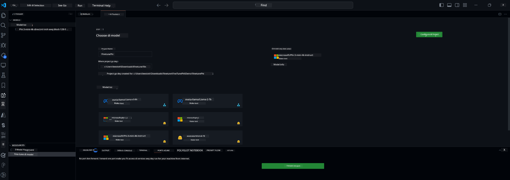

## Welcome to AI Toolkit for VS Code

[AI Toolkit for VS Code](https://github.com/microsoft/vscode-ai-toolkit/tree/main) dey gather different models from Azure AI Studio Catalog and other catalogs like Hugging Face. Dis toolkit dey make the common development wahala wey you dey face for building AI apps with generative AI tools and models easier by:
- Make you fit start quick with model discovery and playground.
- Fine-tune model and run inference using local computing resources.
- Do remote fine-tuning and inference using Azure resources

[Install AI Toolkit for VSCode](https://marketplace.visualstudio.com/items?itemName=ms-windows-ai-studio.windows-ai-studio)




**[Private Preview]** One-click provisioning for Azure Container Apps to run model fine-tuning and inference for cloud.

Now make we start your AI app development:

- [Welcome to AI Toolkit for VS Code](../../../../md/03.FineTuning)
- [Local Development](../../../../md/03.FineTuning)
  - [Preparations](../../../../md/03.FineTuning)
  - [Activate Conda](../../../../md/03.FineTuning)
  - [Base model fine-tuning only](../../../../md/03.FineTuning)
  - [Model fine-tuning and inferencing](../../../../md/03.FineTuning)
  - [Model Fine-tuning](../../../../md/03.FineTuning)
  - [Microsoft Olive](../../../../md/03.FineTuning)
  - [Fine Tuning Samples and Resoures](../../../../md/03.FineTuning)
- [**\[Private Preview\]** Remote Development](../../../../md/03.FineTuning)
  - [Prerequisites](../../../../md/03.FineTuning)
  - [Setting Up a Remote Development Project](../../../../md/03.FineTuning)
  - [Provision Azure Resources](../../../../md/03.FineTuning)
  - [\[Optional\] Add Huggingface Token to the Azure Container App Secret](../../../../md/03.FineTuning)
  - [Run Fine-tuning](../../../../md/03.FineTuning)
  - [Provision Inference Endpoint](../../../../md/03.FineTuning)
  - [Deploy the Inference Endpoint](../../../../md/03.FineTuning)
  - [Advanced usage](../../../../md/03.FineTuning)

## Local Development
### Preparations

1. Make sure say NVIDIA driver don install for the host. 
2. Run `huggingface-cli login`, if you dey use HF for dataset utilization
3. `Olive` key settings na explanations for anything wey fit change memory usage. 

### Activate Conda
Since we dey use WSL environment and e dey shared you go need activate the conda environment by hand. After you do this step you fit run fine-tuning or inference.

```bash
conda activate [conda-env-name] 
```

### Base model fine-tuning only
If you wan just try the base model without fine-tuning you fit run this command after you don activate conda.

```bash
cd inference

# Di web browser interface dey allow you adjust small parameters like max new token length, temperature and so on.
# User gats open di link by hand (e.g. http://0.0.0.0:7860) for browser after gradio don start di connections.
python gradio_chat.py --baseonly
```

### Model fine-tuning and inferencing

Once you open the workspace for inside dev container, open terminal (default path na project root), then run the command below to fine-tune one LLM on the dataset wey you select.

```bash
python finetuning/invoke_olive.py 
```

Checkpoints and the final model go save for `models` folder.

Next run inference with the fine-tuned model through chats for `console`, `web browser` or `prompt flow`.

```bash
cd inference

# Console interface.
python console_chat.py

# Web browser interface dey allow you adjust small parameters like max new token length, temperature and so on.
# User gots to open the link by hand (e.g. http://127.0.0.1:7860) for browser after gradio don start the connections.
python gradio_chat.py
```

If you wan use `prompt flow` for VS Code, abeg check this [Quick Start](https://microsoft.github.io/promptflow/how-to-guides/quick-start.html).

### Model Fine-tuning

Next, download the model wey match whether GPU dey your device or no.

To start the local fine-tuning session wey dey use QLoRA, pick the model wey you want fine-tune from our catalog.
| Platform(s) | GPU available | Model name | Size (GB) |
|---------|---------|--------|--------|
| Windows | Yes | Phi-3-mini-4k-**directml**-int4-awq-block-128-onnx | 2.13GB |
| Linux | Yes | Phi-3-mini-4k-**cuda**-int4-onnx | 2.30GB |
| Windows<br>Linux | No | Phi-3-mini-4k-**cpu**-int4-rtn-block-32-acc-level-4-onnx | 2.72GB |

**_Note_** You no need Azure Account to download the models

The Phi3-mini (int4) model size na about 2GB-3GB. Depending on your network speed, e fit take small minutes to download.

Start by selecting project name and where you wan put am.
Next, choose model from the model catalog. VS Code go ask you to download the project template. Then you fit click "Configure Project" to change different settings.

### Microsoft Olive 

We dey use [Olive](https://microsoft.github.io/Olive/why-olive.html) to run QLoRA fine-tuning on PyTorch model wey dey our catalog. All the settings don preset with default values so e go optimize memory use to run fine-tuning locally, but you fit change am to match your case.

### Fine Tuning Samples and Resoures

- [Fine tuning Getting Started Guide](https://learn.microsoft.com/windows/ai/toolkit/toolkit-fine-tune)
- [Fine tuning with a HuggingFace Dataset](https://github.com/microsoft/vscode-ai-toolkit/blob/main/archive/walkthrough-hf-dataset.md)
- [Fine tuning with Simple DataSet](https://github.com/microsoft/vscode-ai-toolkit/blob/main/archive/walkthrough-simple-dataset.md)

## **[Private Preview]** Remote Development

### Prerequisites

1. If you wan run model fine-tuning for your remote Azure Container App Environment, make sure your subscription get enough GPU capacity. Send one [support ticket](https://azure.microsoft.com/support/create-ticket/) to request the capacity wey your app need. [Get More Info about GPU capacity](https://learn.microsoft.com/azure/container-apps/workload-profiles-overview)
2. If you dey use private dataset for HuggingFace, make sure say you get [HuggingFace account](https://huggingface.co/?WT.mc_id=aiml-137032-kinfeylo) and make token for access (generate an access token) from there: https links in original.
3. Enable Remote Fine-tuning and Inference feature flag for AI Toolkit for VS Code
   1. Open VS Code Settings by selecting *File -> Preferences -> Settings*.
   2. Go to *Extensions* and select *AI Toolkit*.
   3. Turn on the *"Enable Remote Fine-tuning And Inference"* option.
   4. Reload VS Code make e start to work.

- [Remote Fine tuning](https://github.com/microsoft/vscode-ai-toolkit/blob/main/archive/remote-finetuning.md)

### Setting Up a Remote Development Project
1. Run the command palette `AI Toolkit: Focus on Resource View`.
2. Go to *Model Fine-tuning* to open the model catalog. Give your project name and choose where you wan save am on your machine. Then press the *"Configure Project"* button.
3. Project Configuration
    1. No enable the *"Fine-tune locally"* option.
    2. Olive configuration settings go show with pre-set default values. Adjust and fill these configurations as you need.
    3. Move to *Generate Project*. This step go use WSL and e go set up new Conda environment, preparing for future updates wey go include Dev Containers.
4. Click *"Relaunch Window In Workspace"* to open your remote development project.

> **Note:** The project fit work either locally or remotely inside AI Toolkit for VS Code. If you choose *"Fine-tune locally"* when you dey create the project, e go only run inside WSL without remote development features. If you no enable *"Fine-tune locally"*, then the project go run only for remote Azure Container App environment.

### Provision Azure Resources
To start, you need to provision the Azure Resource for remote fine-tuning. Do am by running `AI Toolkit: Provision Azure Container Apps job for fine-tuning` from the command palette.

Watch the provisioning progress through the link wey go show for the output channel.

### [Optional] Add Huggingface Token to the Azure Container App Secret
If you dey use private HuggingFace dataset, set your HuggingFace token as environment variable so you no go need to login manually for the Hugging Face Hub.
You fit do this with `AI Toolkit: Add Azure Container Apps Job secret for fine-tuning` command. With this command, set the secret name to [`HF_TOKEN`](https://huggingface.co/docs/huggingface_hub/package_reference/environment_variables#hftoken) and use your Hugging Face token as the secret value.

### Run Fine-tuning
To start the remote fine-tuning job, run the `AI Toolkit: Run fine-tuning` command.

To see system and console logs, you fit open the Azure portal using the link wey dey the output panel (more steps for [View and Query Logs on Azure](https://aka.ms/ai-toolkit/remote-provision#view-and-query-logs-on-azure)). Or you fit see the console logs directly inside VSCode output panel by running `AI Toolkit: Show the running fine-tuning job streaming logs`. 
> **Note:** The job fit queue if resources no full. If the log no show, run `AI Toolkit: Show the running fine-tuning job streaming logs` command, wait small and run am again to reconnect to the streaming log.

For this process, QLoRA go dey use for fine-tuning, and e go create LoRA adapters for the model wey inference go use.
The fine-tuning results go store for Azure Files.

### Provision Inference Endpoint
After adapters don train for the remote environment, use simple Gradio app to interact with the model.
Like the fine-tuning step, you need set up Azure Resources for remote inference by running `AI Toolkit: Provision Azure Container Apps for inference` from the command palette.

By default, the subscription and resource group for inference go match the ones wey you use for fine-tuning. The inference go use the same Azure Container App Environment and go access the model and model adapter wey dey Azure Files, wey fine-tuning step don create. 


### Deploy the Inference Endpoint
If you want change the inference code or reload the inference model, run `AI Toolkit: Deploy for inference` command. Dis go synchronize your latest code with Azure Container App and restart the replica.  

Once deployment finish successful, you fit access the inference API by clicking the "*Go to Inference Endpoint*" button wey go show for VSCode notification. Or, the web API endpoint dey under `ACA_APP_ENDPOINT` for `./infra/inference.config.json` and e dey show for the output panel. You don ready to test the model with this endpoint.

### Advanced usage
For more info about remote development with AI Toolkit, check [Fine-Tuning models remotely](https://aka.ms/ai-toolkit/remote-provision) and [Inferencing with the fine-tuned model](https://aka.ms/ai-toolkit/remote-inference) documentation.

---

<!-- CO-OP TRANSLATOR DISCLAIMER START -->
Make una sabi:
Dis document don translate wit AI translation service [Co-op Translator] (https://github.com/Azure/co-op-translator). We dey try make everything correct, but abeg note say automated translations fit get errors or inaccuracies. The original document for im original language na di authoritative source. If na important info, e good make human professional translator check am. We no go take responsibility for any misunderstanding or wrong interpretation wey fit come from dis translation.
<!-- CO-OP TRANSLATOR DISCLAIMER END -->