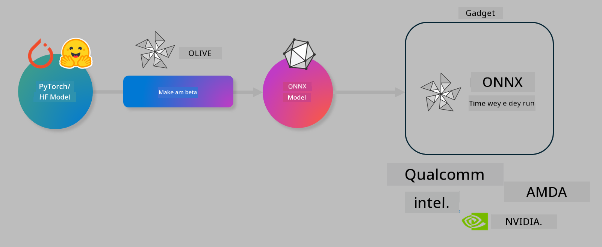

# Lab. How to make AI models work well for on-device inference

## Intro 

> [!IMPORTANT]
> Dis lab need an **Nvidia A10 or A100 GPU** plus di correct drivers and CUDA toolkit (version 12+) wey don install.

> [!NOTE]
> Na **35-minute** lab dis be wey go give you hands-on intro to di main ideas for optimizing models for on-device inference using OLIVE.

## Wetin you go learn

By di end of dis lab, you go fit use OLIVE to:

- Quantize an AI model using di AWQ quantization method.
- Fine-tune an AI model for one specific task.
- Generate LoRA adapters (fine-tuned model) make on-device inference dey efficient for ONNX Runtime.

### Wetin Olive be

Olive (*O*NNX *live*) na model optimization toolkit with CLI wey dey help you ship models for di ONNX runtime +++https://onnxruntime.ai+++ with good quality and performance.



Di input wey Olive dey use normally na PyTorch or Hugging Face model and di output na optimized ONNX model wey dem go run for device (deployment target) wey dey run di ONNX runtime. Olive go optimize di model for di deployment target AI accelerator (NPU, GPU, CPU) wey hardware vendor like Qualcomm, AMD, Nvidia or Intel provide.

Olive dey execute one *workflow*, wey be ordered sequence of individual model optimization tasks wey dem dey call *passes* - example passes na: model compression, graph capture, quantization, graph optimization. Every pass get parameters wey you fit tune to get di best metrics, like accuracy and latency, wey di evaluator go measure. Olive dey use search strategy wey use search algorithm to auto-tune each pass one by one or set of passes together.

#### Benefits of Olive

- **Reduce frustration and time** wey people dey waste for trial-and-error manual experimentation with different techniques for graph optimization, compression and quantization. Define your quality and performance constraints and make Olive automatically find di best model for you.
- **40+ built-in model optimization components** wey cover cutting-edge techniques for quantization, compression, graph optimization and finetuning.
- **Easy-to-use CLI** for common model optimization tasks. For example, olive quantize, olive auto-opt, olive finetune.
- Model packaging and deployment don dey built-in.
- Support to generate models for **Multi LoRA serving**.
- Fit construct workflows using YAML/JSON to orchestrate model optimization and deployment tasks.
- **Hugging Face** and **Azure AI** integration.
- Built-in **caching** mechanism to **save costs**.

## Lab Instructions
> [!NOTE]
> Make sure say you don provision your Azure AI Hub and Project and don setup your A100 compute as per Lab 1.

### Step 0: Connect to your Azure AI Compute

You go connect to di Azure AI compute using di remote feature for **VS Code.** 

1. Open your **VS Code** desktop application:
1. Open di **command palette** using  **Shift+Ctrl+P**
1. For di command palette search for **AzureML - remote: Connect to compute instance in New Window**.
1. Follow di on-screen instructions to connect to di Compute. Dis go require say you select your Azure Subscription, Resource Group, Project and Compute name wey you setup for Lab 1.
1. Once you don connect to your Azure ML Compute node, dis go show for **bottom left of Visual Code** `><Azure ML: Compute Name`

### Step 1: Clone this repo

For VS Code, you fit open new terminal with **Ctrl+J** and clone this repo:

For di terminal you suppose see di prompt

```
azureuser@computername:~/cloudfiles/code$ 
```
Clone di solution 

```bash
cd ~/localfiles
git clone https://github.com/microsoft/phi-3cookbook.git
```

### Step 2: Open Folder in VS Code

To open VS Code for di correct folder run di command below for di terminal, e go open new window:

```bash
code phi-3cookbook/code/04.Finetuning/Olive-lab
```

If you no wan run command, you fit open di folder by selecting **File** > **Open Folder**. 

### Step 3: Dependencies

Open one terminal window for VS Code for your Azure AI Compute Instance (tip: **Ctrl+J**) and run di commands below to install di dependencies:

```bash
conda create -n olive-ai python=3.11 -y
conda activate olive-ai
pip install -r requirements.txt
az extension remove -n azure-cli-ml
az extension add -n ml
```

> [!NOTE]
> E go take ~5mins to install all di dependencies.

For dis lab you go download and upload models to di Azure AI Model catalog. So make you fit access di model catalog, you need to login to Azure using:

```bash
az login
```

> [!NOTE]
> For login time dem go ask you to select your subscription. Make sure say you set di subscription to di one wey dem give you for dis lab.

### Step 4: Execute Olive commands 

Open one terminal window for VS Code for your Azure AI Compute Instance (tip: **Ctrl+J**) and make sure say di `olive-ai` conda environment don activate:

```bash
conda activate olive-ai
```

Next, run di following Olive commands for di command line.

1. **Inspect the data:** For this example, you go fine-tune Phi-3.5-Mini model make e specialize for answering travel related questions. Di code below dey show di first few records of di dataset, wey dey in JSON lines format:
   
    ```bash
    head data/data_sample_travel.jsonl
    ```
1. **Quantize the model:** Before you train di model, first you go quantize am with di command wey dey use technique called Active Aware Quantization (AWQ) +++https://arxiv.org/abs/2306.00978+++. AWQ dey quantize di weights of model by considering di activations wey dem produce during inference. This one mean say di quantization process dey consider di actual data distribution for di activations, and e dey help preserve model accuracy better compared to traditional weight quantization methods.
    
    ```bash
    olive quantize \
       --model_name_or_path microsoft/Phi-3.5-mini-instruct \
       --trust_remote_code \
       --algorithm awq \
       --output_path models/phi/awq \
       --log_level 1
    ```
    
    E go take **~8mins** to finish di AWQ quantization, wey go **reduce di model size from ~7.5GB to ~2.5GB**.
   
   For dis lab, we dey show how to input models from Hugging Face (for example: `microsoft/Phi-3.5-mini-instruct`). But Olive still allow you to input models from di Azure AI catalog by changing di `model_name_or_path` argument to one Azure AI asset ID (for example:  `azureml://registries/azureml/models/Phi-3.5-mini-instruct/versions/4`). 

1. **Train the model:** Next, di `olive finetune` command go finetune di quantized model. If you quantize di model *before* fine-tuning instead of after, e dey give better accuracy because di fine-tuning process dey recover some loss wey quantization cause.
    
    ```bash
    olive finetune \
        --method lora \
        --model_name_or_path models/phi/awq \
        --data_files "data/data_sample_travel.jsonl" \
        --data_name "json" \
        --text_template "<|user|>\n{prompt}<|end|>\n<|assistant|>\n{response}<|end|>" \
        --max_steps 100 \
        --output_path ./models/phi/ft \
        --log_level 1
    ```
    
    E go take **~6mins** to finish di Fine-tuning (with 100 steps).

1. **Optimize:** After you don train di model, now you go optimize di model using Olive `auto-opt` command, wey go capture di ONNX graph and automatically do several optimizations to improve di model performance for CPU by compressing di model and doing fusions. E good make you sabi say you fit also optimize for other devices like NPU or GPU by just update di `--device` and `--provider` arguments - but for dis lab we go use CPU.

    ```bash
    olive auto-opt \
       --model_name_or_path models/phi/ft/model \
       --adapter_path models/phi/ft/adapter \
       --device cpu \
       --provider CPUExecutionProvider \
       --use_ort_genai \
       --output_path models/phi/onnx-ao \
       --log_level 1
    ```
    
    E go take **~5mins** to finish di optimization.

### Step 5: Model inference quick test

To test di model inference, create one Python file for your folder wey name na **app.py** and copy-and-paste di code below:

```python
import onnxruntime_genai as og
import numpy as np

print("loading model and adapters...", end="", flush=True)
model = og.Model("models/phi/onnx-ao/model")
adapters = og.Adapters(model)
adapters.load("models/phi/onnx-ao/model/adapter_weights.onnx_adapter", "travel")
print("DONE!")

tokenizer = og.Tokenizer(model)
tokenizer_stream = tokenizer.create_stream()

params = og.GeneratorParams(model)
params.set_search_options(max_length=100, past_present_share_buffer=False)
user_input = "what is the best thing to see in chicago"
params.input_ids = tokenizer.encode(f"<|user|>\n{user_input}<|end|>\n<|assistant|>\n")

generator = og.Generator(model, params)

generator.set_active_adapter(adapters, "travel")

print(f"{user_input}")

while not generator.is_done():
    generator.compute_logits()
    generator.generate_next_token()

    new_token = generator.get_next_tokens()[0]
    print(tokenizer_stream.decode(new_token), end='', flush=True)

print("\n")
```

Run di code using:

```bash
python app.py
```

### Step 6: Upload model to Azure AI

If you upload di model to Azure AI model repository, e go make di model sharable with oda people for your dev team and e go also handle version control for di model. To upload di model run di command below:

> [!NOTE]
> Update di `{}` placeholders with di name of your resource group and Azure AI Project Name. 

To find your resource group `"resourceGroup"and Azure AI Project name, run di command below 

```
az ml workspace show
```

Or go to +++ai.azure.com+++ and select **management center** **project** **overview**

Update di `{}` placeholders with di name of your resource group and Azure AI Project Name.

```bash
az ml model create \
    --name ft-for-travel \
    --version 1 \
    --path ./models/phi/onnx-ao \
    --resource-group {RESOURCE_GROUP_NAME} \
    --workspace-name {PROJECT_NAME}
```
You fit then see your uploaded model and deploy your model at https://ml.azure.com/model/list

---

<!-- CO-OP TRANSLATOR DISCLAIMER START -->
Disclaimer:
Dis document don translate by AI translation service Co-op Translator (https://github.com/Azure/co-op-translator). Even though we dey try make am correct, abeg note say automated translations fit get mistakes or no too correct. Treat the original document for im original language as the official source. If na important information, make you use professional human translator. We no dey responsible for any misunderstanding or wrong interpretation wey fit come from the use of this translation.
<!-- CO-OP TRANSLATOR DISCLAIMER END -->