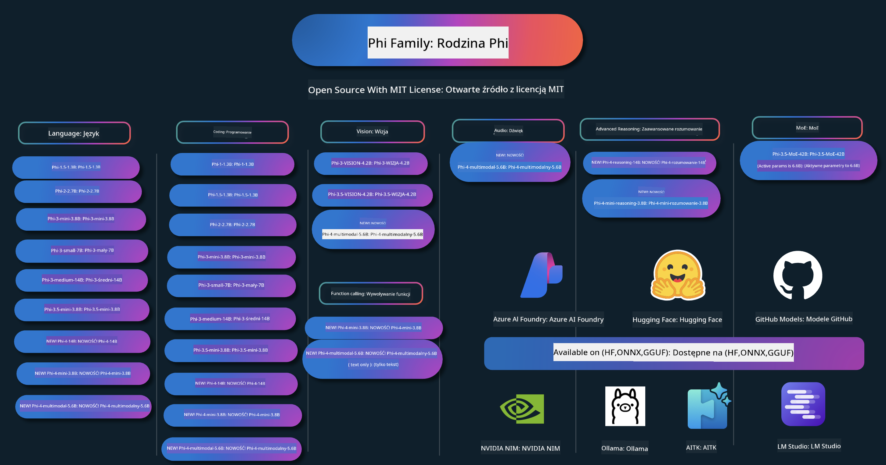

<!--
CO_OP_TRANSLATOR_METADATA:
{
  "original_hash": "1cab9282e04f2e1c388a38dca7763c16",
  "translation_date": "2025-05-09T03:53:17+00:00",
  "source_file": "README.md",
  "language_code": "pl"
}
-->
# Phi Cookbook: Przykłady praktyczne z modelami Phi Microsoftu

Phi to seria otwartoźródłowych modeli AI opracowanych przez Microsoft. 

Obecnie Phi jest najmocniejszym i najbardziej opłacalnym małym modelem językowym (SLM), osiągając bardzo dobre wyniki w wielojęzyczności, rozumowaniu, generowaniu tekstu/czatu, kodowaniu, obrazach, dźwięku i innych zastosowaniach. 

Możesz wdrożyć Phi w chmurze lub na urządzeniach brzegowych, a także łatwo tworzyć aplikacje generatywnej sztucznej inteligencji przy ograniczonej mocy obliczeniowej.

Wykonaj te kroki, aby rozpocząć korzystanie z tych zasobów:
1. **Forkuj repozytorium**: Kliknij 
2. **Sklonuj repozytorium**:   `git clone https://github.com/microsoft/PhiCookBook.git`
3. [**Dołącz do społeczności Microsoft AI na Discordzie i poznaj ekspertów oraz innych programistów**](https://discord.com/invite/ByRwuEEgH4?WT.mc_id=aiml-137032-kinfeylo)

## 🌐 Wsparcie wielojęzyczne

### Obsługiwane przez GitHub Action (automatyczne i zawsze aktualne)

[Francuski](../fr/README.md) | [Hiszpański](../es/README.md) | [Niemiecki](../de/README.md) | [Rosyjski](../ru/README.md) | [Arabski](../ar/README.md) | [Perski (Farsi)](../fa/README.md) | [Urdu](../ur/README.md) | [Chiński (uproszczony)](../zh/README.md) | [Chiński (tradycyjny, Makau)](../mo/README.md) | [Chiński (tradycyjny, Hongkong)](../hk/README.md) | [Chiński (tradycyjny, Tajwan)](../tw/README.md) | [Japoński](../ja/README.md) | [Koreański](../ko/README.md) | [Hindi](../hi/README.md)

### Obsługiwane przez CLI
[Bengali](../bn/README.md) | [Marathi](../mr/README.md) | [Nepali](../ne/README.md) | [Punjabi (Gurmukhi)](../pa/README.md) | [Portuguese (Portugal)](../pt/README.md) | [Portuguese (Brazil)](../br/README.md) | [Italian](../it/README.md) | [Polish](./README.md) | [Turkish](../tr/README.md) | [Greek](../el/README.md) | [Thai](../th/README.md) | [Swedish](../sv/README.md) | [Danish](../da/README.md) | [Norwegian](../no/README.md) | [Finnish](../fi/README.md) | [Dutch](../nl/README.md) | [Hebrew](../he/README.md) | [Vietnamese](../vi/README.md) | [Indonesian](../id/README.md) | [Malay](../ms/README.md) | [Tagalog (Filipino)](../tl/README.md) | [Swahili](../sw/README.md) | [Hungarian](../hu/README.md) | [Czech](../cs/README.md) | [Slovak](../sk/README.md) | [Romanian](../ro/README.md) | [Bulgarian](../bg/README.md) | [Serbian (Cyrillic)](../sr/README.md) | [Croatian](../hr/README.md) | [Slovenian](../sl/README.md)

## Spis treści

- Wprowadzenie
- [Witamy w rodzinie Phi](./md/01.Introduction/01/01.PhiFamily.md)
  - [Konfiguracja środowiska](./md/01.Introduction/01/01.EnvironmentSetup.md)
  - [Zrozumienie kluczowych technologii](./md/01.Introduction/01/01.Understandingtech.md)
  - [Bezpieczeństwo AI dla modeli Phi](./md/01.Introduction/01/01.AISafety.md)
  - [Wsparcie sprzętowe Phi](./md/01.Introduction/01/01.Hardwaresupport.md)
  - [Modele Phi i ich dostępność na różnych platformach](./md/01.Introduction/01/01.Edgeandcloud.md)
  - [Korzystanie z Guidance-ai i Phi](./md/01.Introduction/01/01.Guidance.md)
  - [Modele na GitHub Marketplace](https://github.com/marketplace/models)
  - [Katalog modeli AI Azure](https://ai.azure.com)

- Inference Phi w różnych środowiskach
    -  [Hugging face](./md/01.Introduction/02/01.HF.md)
    -  [Modele na GitHub](./md/01.Introduction/02/02.GitHubModel.md)
    -  [Katalog modeli Azure AI Foundry](./md/01.Introduction/02/03.AzureAIFoundry.md)
    -  [Ollama](./md/01.Introduction/02/04.Ollama.md)
    -  [AI Toolkit VSCode (AITK)](./md/01.Introduction/02/05.AITK.md)
    -  [NVIDIA NIM](./md/01.Introduction/02/06.NVIDIA.md)

- Inference Phi Family
    - [Inference Phi na iOS](./md/01.Introduction/03/iOS_Inference.md)
    - [Inference Phi na Android](./md/01.Introduction/03/Android_Inference.md)
    - [Inference Phi na Jetson](./md/01.Introduction/03/Jetson_Inference.md)
    - [Inference Phi na AI PC](./md/01.Introduction/03/AIPC_Inference.md)
    - [Inference Phi z wykorzystaniem Apple MLX Framework](./md/01.Introduction/03/MLX_Inference.md)
    - [Inference Phi na lokalnym serwerze](./md/01.Introduction/03/Local_Server_Inference.md)
    - [Inference Phi na zdalnym serwerze z użyciem AI Toolkit](./md/01.Introduction/03/Remote_Interence.md)
    - [Inference Phi z Rust](./md/01.Introduction/03/Rust_Inference.md)
    - [Inference Phi–Vision lokalnie](./md/01.Introduction/03/Vision_Inference.md)
    - [Inference Phi z Kaito AKS, Azure Containers (oficjalne wsparcie)](./md/01.Introduction/03/Kaito_Inference.md)
-  [Kwantyzacja Phi Family](./md/01.Introduction/04/QuantifyingPhi.md)
    - [Kwantyzacja Phi-3.5 / 4 przy użyciu llama.cpp](./md/01.Introduction/04/UsingLlamacppQuantifyingPhi.md)
    - [Kwantyzacja Phi-3.5 / 4 z rozszerzeniami Generative AI dla onnxruntime](./md/01.Introduction/04/UsingORTGenAIQuantifyingPhi.md)
    - [Kwantyzacja Phi-3.5 / 4 z użyciem Intel OpenVINO](./md/01.Introduction/04/UsingIntelOpenVINOQuantifyingPhi.md)
    - [Kwantyzacja Phi-3.5 / 4 z wykorzystaniem Apple MLX Framework](./md/01.Introduction/04/UsingAppleMLXQuantifyingPhi.md)

-  Ewaluacja Phi
- [Response AI](./md/01.Introduction/05/ResponsibleAI.md)
    - [Azure AI Foundry for Evaluation](./md/01.Introduction/05/AIFoundry.md)
    - [Using Promptflow for Evaluation](./md/01.Introduction/05/Promptflow.md)
 
- RAG z Azure AI Search
    - [Jak używać Phi-4-mini i Phi-4-multimodal(RAG) z Azure AI Search](https://github.com/microsoft/PhiCookBook/blob/main/code/06.E2E/E2E_Phi-4-RAG-Azure-AI-Search.ipynb)

- Przykłady tworzenia aplikacji Phi
  - Aplikacje tekstowe i czatowe
    - Przykłady Phi-4 🆕
      - [📓] [Czat z modelem Phi-4-mini ONNX](./md/02.Application/01.TextAndChat/Phi4/ChatWithPhi4ONNX/README.md)
      - [Czat z lokalnym modelem Phi-4 ONNX w .NET](../../md/04.HOL/dotnet/src/LabsPhi4-Chat-01OnnxRuntime)
      - [Konsolowa aplikacja czatu .NET z Phi-4 ONNX używając Semantic Kernel](../../md/04.HOL/dotnet/src/LabsPhi4-Chat-02SK)
    - Przykłady Phi-3 / 3.5
      - [Lokalny chatbot w przeglądarce z użyciem Phi3, ONNX Runtime Web i WebGPU](https://github.com/microsoft/onnxruntime-inference-examples/tree/main/js/chat)
      - [OpenVino Chat](./md/02.Application/01.TextAndChat/Phi3/E2E_OpenVino_Chat.md)
      - [Multi Model - Interaktywny Phi-3-mini i OpenAI Whisper](./md/02.Application/01.TextAndChat/Phi3/E2E_Phi-3-mini_with_whisper.md)
      - [MLFlow - Tworzenie wrappera i używanie Phi-3 z MLFlow](./md//02.Application/01.TextAndChat/Phi3/E2E_Phi-3-MLflow.md)
      - [Optymalizacja modelu - Jak zoptymalizować model Phi-3-mini dla ONNX Runtime Web z Olive](https://github.com/microsoft/Olive/tree/main/examples/phi3)
      - [Aplikacja WinUI3 z Phi-3 mini-4k-instruct-onnx](https://github.com/microsoft/Phi3-Chat-WinUI3-Sample/)
      -[Przykład aplikacji WinUI3 Multi Model AI Powered Notes](https://github.com/microsoft/ai-powered-notes-winui3-sample)
      - [Dostrajanie i integracja niestandardowych modeli Phi-3 z Prompt flow](./md/02.Application/01.TextAndChat/Phi3/E2E_Phi-3-FineTuning_PromptFlow_Integration.md)
      - [Dostrajanie i integracja niestandardowych modeli Phi-3 z Prompt flow w Azure AI Foundry](./md/02.Application/01.TextAndChat/Phi3/E2E_Phi-3-FineTuning_PromptFlow_Integration_AIFoundry.md)
      - [Ocena dostrojonego modelu Phi-3 / Phi-3.5 w Azure AI Foundry z naciskiem na zasady Responsible AI Microsoftu](./md/02.Application/01.TextAndChat/Phi3/E2E_Phi-3-Evaluation_AIFoundry.md)
      - [📓] [Przykład predykcji językowej Phi-3.5-mini-instruct (chiński/angielski)](../../md/02.Application/01.TextAndChat/Phi3/phi3-instruct-demo.ipynb)
      - [Phi-3.5-Instruct WebGPU RAG Chatbot](./md/02.Application/01.TextAndChat/Phi3/WebGPUWithPhi35Readme.md)
      - [Użycie Windows GPU do tworzenia rozwiązania Prompt flow z Phi-3.5-Instruct ONNX](./md/02.Application/01.TextAndChat/Phi3/UsingPromptFlowWithONNX.md)
      - [Użycie Microsoft Phi-3.5 tflite do stworzenia aplikacji na Androida](./md/02.Application/01.TextAndChat/Phi3/UsingPhi35TFLiteCreateAndroidApp.md)
      - [Przykład Q&A .NET z lokalnym modelem ONNX Phi-3 używając Microsoft.ML.OnnxRuntime](../../md/04.HOL/dotnet/src/LabsPhi301)
      - [Konsolowa aplikacja czatu .NET z Semantic Kernel i Phi-3](../../md/04.HOL/dotnet/src/LabsPhi302)

  - Przykłady kodu SDK Azure AI Inference
    - Przykłady Phi-4 🆕
      - [📓] [Generowanie kodu projektu używając Phi-4-multimodal](./md/02.Application/02.Code/Phi4/GenProjectCode/README.md)
    - Przykłady Phi-3 / 3.5
      - [Zbuduj własny czat GitHub Copilot w Visual Studio Code z rodziną Microsoft Phi-3](./md/02.Application/02.Code/Phi3/VSCodeExt/README.md)
      - [Stwórz własnego agenta czatu Visual Studio Code Copilot z Phi-3.5 korzystając z modeli GitHub](./md/02.Application/02.Code/Phi3/CreateVSCodeChatAgentWithGitHubModels.md)

  - Zaawansowane przykłady rozumowania
    - Przykłady Phi-4 🆕
      - [📓] [Przykłady rozumowania Phi-4-mini lub Phi-4](./md/02.Application/03.AdvancedReasoning/Phi4/AdvancedResoningPhi4mini/README.md)
      - [📓] [Dostrajanie Phi-4-mini-reasoning z Microsoft Olive](../../md/02.Application/03.AdvancedReasoning/Phi4/AdvancedResoningPhi4mini/olive_ft_phi_4_reasoning_with_medicaldata.ipynb)
      - [📓] [Dostrajanie Phi-4-mini-reasoning z Apple MLX](../../md/02.Application/03.AdvancedReasoning/Phi4/AdvancedResoningPhi4mini/mlx_ft_phi_4_reasoning_with_medicaldata.ipynb)
      - [📓] [Phi-4-mini-reasoning z modelami GitHub](../../md/02.Application/02.Code/Phi4r/github_models_inference.ipynb)
- [📓] [Phi-4-mini reasoning z modelami Azure AI Foundry](../../md/02.Application/02.Code/Phi4r/azure_models_inference.ipynb)
  - Pokazy
      - [Phi-4-mini pokazy hostowane na Hugging Face Spaces](https://huggingface.co/spaces/microsoft/phi-4-mini?WT.mc_id=aiml-137032-kinfeylo)
      - [Phi-4-multimodal pokazy hostowane na Hugging Face Spaces](https://huggingface.co/spaces/microsoft/phi-4-multimodal?WT.mc_id=aiml-137032-kinfeylo)
  - Próbki wizji
    - Próbki Phi-4 🆕
      - [📓] [Użyj Phi-4-multimodal do odczytu obrazów i generowania kodu](./md/02.Application/04.Vision/Phi4/CreateFrontend/README.md) 
    - Próbki Phi-3 / 3.5
      -  [📓][Phi-3-vision-Obraz tekst na tekst](../../md/02.Application/04.Vision/Phi3/E2E_Phi-3-vision-image-text-to-text-online-endpoint.ipynb)
      - [Phi-3-vision-ONNX](https://onnxruntime.ai/docs/genai/tutorials/phi3-v.html)
      - [📓][Phi-3-vision CLIP Embedding](../../md/02.Application/04.Vision/Phi3/E2E_Phi-3-vision-image-text-to-text-online-endpoint.ipynb)
      - [DEMO: Phi-3 Recycling](https://github.com/jennifermarsman/PhiRecycling/)
      - [Phi-3-vision - Asystent języka wizualnego - z Phi3-Vision i OpenVINO](https://docs.openvino.ai/nightly/notebooks/phi-3-vision-with-output.html)
      - [Phi-3 Vision Nvidia NIM](./md/02.Application/04.Vision/Phi3/E2E_Nvidia_NIM_Vision.md)
      - [Phi-3 Vision OpenVino](./md/02.Application/04.Vision/Phi3/E2E_OpenVino_Phi3Vision.md)
      - [📓][Phi-3.5 Vision próbka multi-frame lub multi-image](../../md/02.Application/04.Vision/Phi3/phi3-vision-demo.ipynb)
      - [Phi-3 Vision lokalny model ONNX używając Microsoft.ML.OnnxRuntime .NET](../../md/04.HOL/dotnet/src/LabsPhi303)
      - [Menu bazowany Phi-3 Vision lokalny model ONNX używając Microsoft.ML.OnnxRuntime .NET](../../md/04.HOL/dotnet/src/LabsPhi304)

  - Próbki audio
    - Próbki Phi-4 🆕
      - [📓] [Wyodrębnianie transkrypcji audio za pomocą Phi-4-multimodal](./md/02.Application/05.Audio/Phi4/Transciption/README.md)
      - [📓] [Próbka audio Phi-4-multimodal](../../md/02.Application/05.Audio/Phi4/Siri/demo.ipynb)
      - [📓] [Próbka tłumaczenia mowy Phi-4-multimodal](../../md/02.Application/05.Audio/Phi4/Translate/demo.ipynb)
      - [Aplikacja konsolowa .NET wykorzystująca Phi-4-multimodal Audio do analizy pliku audio i generowania transkrypcji](../../md/04.HOL/dotnet/src/LabsPhi4-MultiModal-02Audio)

  - Próbki MOE
    - Próbki Phi-3 / 3.5
      - [📓] [Phi-3.5 Mixture of Experts Models (MoEs) przykład mediów społecznościowych](../../md/02.Application/06.MoE/Phi3/phi3_moe_demo.ipynb)
      - [📓] [Budowanie pipeline Retrieval-Augmented Generation (RAG) z NVIDIA NIM Phi-3 MOE, Azure AI Search i LlamaIndex](../../md/02.Application/06.MoE/Phi3/azure-ai-search-nvidia-rag.ipynb)
  - Próbki wywoływania funkcji
    - Próbki Phi-4 🆕
      -  [📓] [Używanie Function Calling z Phi-4-mini](./md/02.Application/07.FunctionCalling/Phi4/FunctionCallingBasic/README.md)
      -  [📓] [Używanie Function Calling do tworzenia multi-agentów z Phi-4-mini](../../md/02.Application/07.FunctionCalling/Phi4/Multiagents/Phi_4_mini_multiagent.ipynb)
      -  [📓] [Używanie Function Calling z Ollama](../../md/02.Application/07.FunctionCalling/Phi4/Ollama/ollama_functioncalling.ipynb)
  - Próbki mieszania multimodalnego
    - Próbki Phi-4 🆕
      -  [📓] [Używanie Phi-4-multimodal jako dziennikarz technologiczny](../../md/02.Application/08.Multimodel/Phi4/TechJournalist/phi_4_mm_audio_text_publish_news.ipynb)
      - [Aplikacja konsolowa .NET wykorzystująca Phi-4-multimodal do analizy obrazów](../../md/04.HOL/dotnet/src/LabsPhi4-MultiModal-01Images)

- Fine-tuning Phi - próbki
  - [Scenariusze fine-tuningu](./md/03.FineTuning/FineTuning_Scenarios.md)
  - [Fine-tuning a RAG](./md/03.FineTuning/FineTuning_vs_RAG.md)
  - [Fine-tuning: pozwól Phi-3 zostać ekspertem branżowym](./md/03.FineTuning/LetPhi3gotoIndustriy.md)
  - [Fine-tuning Phi-3 z AI Toolkit dla VS Code](./md/03.FineTuning/Finetuning_VSCodeaitoolkit.md)
  - [Fine-tuning Phi-3 z Azure Machine Learning Service](./md/03.FineTuning/Introduce_AzureML.md)
- [Fine-tuning Phi-3 z Lora](./md/03.FineTuning/FineTuning_Lora.md)
  - [Fine-tuning Phi-3 z QLora](./md/03.FineTuning/FineTuning_Qlora.md)
  - [Fine-tuning Phi-3 z Azure AI Foundry](./md/03.FineTuning/FineTuning_AIFoundry.md)
  - [Fine-tuning Phi-3 z Azure ML CLI/SDK](./md/03.FineTuning/FineTuning_MLSDK.md)
  - [Fine-tuning z Microsoft Olive](./md/03.FineTuning/FineTuning_MicrosoftOlive.md)
  - [Fine-tuning z Microsoft Olive Hands-On Lab](./md/03.FineTuning/olive-lab/readme.md)
  - [Fine-tuning Phi-3-vision z Weights and Bias](./md/03.FineTuning/FineTuning_Phi-3-visionWandB.md)
  - [Fine-tuning Phi-3 z Apple MLX Framework](./md/03.FineTuning/FineTuning_MLX.md)
  - [Fine-tuning Phi-3-vision (oficjalne wsparcie)](./md/03.FineTuning/FineTuning_Vision.md)
  - [Fine-Tuning Phi-3 z Kaito AKS, Azure Containers (oficjalne wsparcie)](./md/03.FineTuning/FineTuning_Kaito.md)
  - [Fine-Tuning Phi-3 i 3.5 Vision](https://github.com/2U1/Phi3-Vision-Finetune)

- Hands on Lab
  - [Eksploracja najnowszych modeli: LLM, SLM, lokalny rozwój i więcej](https://github.com/microsoft/aitour-exploring-cutting-edge-models)
  - [Odkrywanie potencjału NLP: Fine-Tuning z Microsoft Olive](https://github.com/azure/Ignite_FineTuning_workshop)

- Artykuły naukowe i publikacje
  - [Textbooks Are All You Need II: phi-1.5 raport techniczny](https://arxiv.org/abs/2309.05463)
  - [Phi-3 raport techniczny: Wysoce zaawansowany model językowy lokalnie na Twoim telefonie](https://arxiv.org/abs/2404.14219)
  - [Phi-4 raport techniczny](https://arxiv.org/abs/2412.08905)
  - [Phi-4-Mini raport techniczny: Kompaktowe, ale potężne multimodalne modele językowe poprzez Mixture-of-LoRAs](https://arxiv.org/abs/2503.01743)
  - [Optymalizacja małych modeli językowych do wywoływania funkcji w pojeździe](https://arxiv.org/abs/2501.02342)
  - [(WhyPHI) Fine-Tuning PHI-3 do pytań wielokrotnego wyboru: Metodologia, wyniki i wyzwania](https://arxiv.org/abs/2501.01588)
  - [Phi-4-reasoning raport techniczny](https://www.microsoft.com/en-us/research/wp-content/uploads/2025/04/phi_4_reasoning.pdf)
  - [Phi-4-mini-reasoning raport techniczny](https://huggingface.co/microsoft/Phi-4-mini-reasoning/blob/main/Phi-4-Mini-Reasoning.pdf)

## Korzystanie z modeli Phi

### Phi na Azure AI Foundry

Możesz nauczyć się, jak korzystać z Microsoft Phi oraz jak budować rozwiązania E2E na różnych urządzeniach sprzętowych. Aby samodzielnie przetestować Phi, zacznij od eksperymentowania z modelami i dostosowywania Phi do swoich scenariuszy, korzystając z [Azure AI Foundry Azure AI Model Catalog](https://aka.ms/phi3-azure-ai). Więcej informacji znajdziesz w sekcji Getting Started with [Azure AI Foundry](/md/02.QuickStart/AzureAIFoundry_QuickStart.md)

**Playground**  
Każdy model ma dedykowane miejsce do testów [Azure AI Playground](https://aka.ms/try-phi3).

### Phi na GitHub Models

Możesz nauczyć się, jak korzystać z Microsoft Phi oraz jak budować rozwiązania E2E na różnych urządzeniach sprzętowych. Aby samodzielnie przetestować model i dostosować Phi do swoich scenariuszy, skorzystaj z [GitHub Model Catalog](https://github.com/marketplace/models?WT.mc_id=aiml-137032-kinfeylo). Więcej informacji znajdziesz w sekcji Getting Started with [GitHub Model Catalog](/md/02.QuickStart/GitHubModel_QuickStart.md)

**Playground**  
Każdy model ma dedykowane [miejsce do testowania modelu](/md/02.QuickStart/GitHubModel_QuickStart.md).

### Phi na Hugging Face

Model jest również dostępny na [Hugging Face](https://huggingface.co/microsoft)

**Playground**  
[Hugging Chat playground](https://huggingface.co/chat/models/microsoft/Phi-3-mini-4k-instruct)

## Odpowiedzialna AI

Microsoft zobowiązuje się do wspierania klientów w odpowiedzialnym korzystaniu z naszych produktów AI, dzielenia się zdobytymi doświadczeniami oraz budowania partnerstw opartych na zaufaniu poprzez narzędzia takie jak Transparency Notes i Impact Assessments. Wiele z tych zasobów znajdziesz pod adresem [https://aka.ms/RAI](https://aka.ms/RAI).  
Podejście Microsoft do odpowiedzialnej AI opiera się na naszych zasadach AI: uczciwość, niezawodność i bezpieczeństwo, prywatność i ochrona, inkluzywność, przejrzystość oraz odpowiedzialność.
Modele języka naturalnego, obrazu i mowy na dużą skalę – takie jak te użyte w tym przykładzie – mogą potencjalnie zachowywać się w sposób niesprawiedliwy, zawodny lub obraźliwy, co z kolei może powodować szkody. Prosimy o zapoznanie się z [Azure OpenAI service Transparency note](https://learn.microsoft.com/legal/cognitive-services/openai/transparency-note?tabs=text), aby być świadomym ryzyk i ograniczeń.

Zalecanym podejściem do łagodzenia tych ryzyk jest uwzględnienie w architekturze systemu bezpieczeństwa, który potrafi wykrywać i zapobiegać szkodliwym zachowaniom. [Azure AI Content Safety](https://learn.microsoft.com/azure/ai-services/content-safety/overview) zapewnia niezależną warstwę ochrony, zdolną do wykrywania szkodliwych treści generowanych przez użytkowników i AI w aplikacjach i usługach. Azure AI Content Safety obejmuje API tekstowe i obrazowe, które pozwalają wykrywać materiały szkodliwe. W ramach Azure AI Foundry usługa Content Safety umożliwia przeglądanie, eksplorowanie oraz testowanie przykładowego kodu do wykrywania szkodliwych treści w różnych modalnościach. Następująca [dokumentacja quickstart](https://learn.microsoft.com/azure/ai-services/content-safety/quickstart-text?tabs=visual-studio%2Clinux&pivots=programming-language-rest) przeprowadzi Cię przez proces wysyłania zapytań do usługi.

Kolejnym aspektem, który należy wziąć pod uwagę, jest ogólna wydajność aplikacji. W przypadku aplikacji multimodalnych i wielomodelowych, wydajność oznacza, że system działa zgodnie z oczekiwaniami Twoimi i użytkowników, w tym nie generuje szkodliwych wyników. Ważne jest, aby ocenić wydajność całej aplikacji za pomocą [Performance and Quality and Risk and Safety evaluators](https://learn.microsoft.com/azure/ai-studio/concepts/evaluation-metrics-built-in). Masz również możliwość tworzenia i oceny za pomocą [custom evaluators](https://learn.microsoft.com/azure/ai-studio/how-to/develop/evaluate-sdk#custom-evaluators).

Możesz ocenić swoją aplikację AI w środowisku deweloperskim, korzystając z [Azure AI Evaluation SDK](https://microsoft.github.io/promptflow/index.html). Mając do dyspozycji zestaw testowy lub cel, generacje Twojej aplikacji generatywnej AI są mierzone ilościowo za pomocą wbudowanych evaluatorów lub wybranych przez Ciebie custom evaluatorów. Aby rozpocząć pracę z azure ai evaluation sdk do oceny systemu, możesz skorzystać z [przewodnika quickstart](https://learn.microsoft.com/azure/ai-studio/how-to/develop/flow-evaluate-sdk). Po wykonaniu oceny możesz [wizualizować wyniki w Azure AI Foundry](https://learn.microsoft.com/azure/ai-studio/how-to/evaluate-flow-results).

## Znaki towarowe

Ten projekt może zawierać znaki towarowe lub logotypy projektów, produktów lub usług. Autoryzowane użycie znaków towarowych lub logotypów Microsoft podlega i musi być zgodne z [Microsoft's Trademark & Brand Guidelines](https://www.microsoft.com/legal/intellectualproperty/trademarks/usage/general).
Użycie znaków towarowych lub logotypów Microsoft w zmodyfikowanych wersjach tego projektu nie może wprowadzać w błąd ani sugerować sponsorowania przez Microsoft. Wszelkie użycie znaków towarowych lub logotypów stron trzecich podlega politykom tych stron trzecich.

**Zastrzeżenie**:  
Niniejszy dokument został przetłumaczony przy użyciu automatycznej usługi tłumaczeniowej AI [Co-op Translator](https://github.com/Azure/co-op-translator). Mimo że dokładamy starań, aby tłumaczenie było jak najbardziej precyzyjne, prosimy mieć na uwadze, że automatyczne tłumaczenia mogą zawierać błędy lub nieścisłości. Oryginalny dokument w języku źródłowym powinien być uznawany za źródło wiarygodne. W przypadku informacji o kluczowym znaczeniu zalecane jest skorzystanie z profesjonalnego tłumaczenia wykonanego przez człowieka. Nie ponosimy odpowiedzialności za jakiekolwiek nieporozumienia lub błędne interpretacje wynikające z korzystania z tego tłumaczenia.