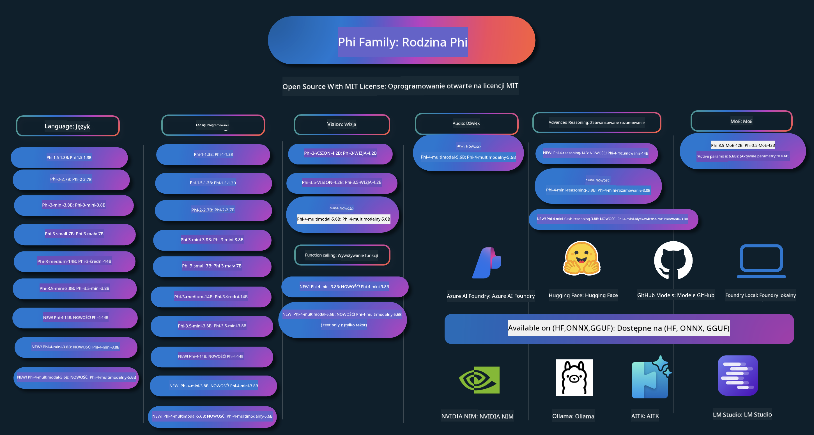

<!--
CO_OP_TRANSLATOR_METADATA:
{
  "original_hash": "c2e4b490f4bd424b095f21e38c6af33b",
  "translation_date": "2026-01-05T03:19:24+00:00",
  "source_file": "README.md",
  "language_code": "pl"
}
-->
# Phi Cookbook: Przykłady praktyczne z modelami Phi firmy Microsoft

[](https://codespaces.new/microsoft/phicookbook)
[](https://vscode.dev/redirect?url=vscode://ms-vscode-remote.remote-containers/cloneInVolume?url=https://github.com/microsoft/phicookbook)

[](https://GitHub.com/microsoft/phicookbook/graphs/contributors/?WT.mc_id=aiml-137032-kinfeylo)
[](https://GitHub.com/microsoft/phicookbook/issues/?WT.mc_id=aiml-137032-kinfeylo)
[](https://GitHub.com/microsoft/phicookbook/pulls/?WT.mc_id=aiml-137032-kinfeylo)
[](http://makeapullrequest.com?WT.mc_id=aiml-137032-kinfeylo)

[](https://GitHub.com/microsoft/phicookbook/watchers/?WT.mc_id=aiml-137032-kinfeylo)
[](https://GitHub.com/microsoft/phicookbook/network/?WT.mc_id=aiml-137032-kinfeylo)
[](https://GitHub.com/microsoft/phicookbook/stargazers/?WT.mc_id=aiml-137032-kinfeylo)

[](https://discord.com/invite/ByRwuEEgH4)

Phi is a series of open source AI models developed by Microsoft. 

Phi is currently the most powerful and cost-effective small language model (SLM), with very good benchmarks in multi-language, reasoning, text/chat generation,coding, images, audio and other scenarios. 

You can deploy Phi to the cloud or to edge devices, and you can easily build generative AI applications with limited computing power.

Follow these steps to get started using these resource :
1. **Sforkuj repozytorium**: Click [](https://GitHub.com/microsoft/phicookbook/network/?WT.mc_id=aiml-137032-kinfeylo)
2. **Sklonuj repozytorium**:   `git clone https://github.com/microsoft/PhiCookBook.git`
3. [**Dołącz do społeczności Microsoft AI na Discordzie i spotkaj ekspertów oraz innych deweloperów**](https://discord.com/invite/ByRwuEEgH4?WT.mc_id=aiml-137032-kinfeylo)



### 🌐 Obsługa wielu języków

#### Wspierane przez GitHub Action (zautomatyzowane i zawsze aktualne)

<!-- CO-OP TRANSLATOR LANGUAGES TABLE START -->
[Arabski](../ar/README.md) | [Bengalski](../bn/README.md) | [Bułgarski](../bg/README.md) | [Birmański (Myanmar)](../my/README.md) | [Chiński (uproszczony)](../zh/README.md) | [Chiński (tradycyjny, Hongkong)](../hk/README.md) | [Chiński (tradycyjny, Makau)](../mo/README.md) | [Chiński (tradycyjny, Tajwan)](../tw/README.md) | [Chorwacki](../hr/README.md) | [Czeski](../cs/README.md) | [Duński](../da/README.md) | [Niderlandzki](../nl/README.md) | [Estoński](../et/README.md) | [Fiński](../fi/README.md) | [Francuski](../fr/README.md) | [Niemiecki](../de/README.md) | [Grecki](../el/README.md) | [Hebrajski](../he/README.md) | [Hindi](../hi/README.md) | [Węgierski](../hu/README.md) | [Indonezyjski](../id/README.md) | [Włoski](../it/README.md) | [Japoński](../ja/README.md) | [Kannada](../kn/README.md) | [Koreański](../ko/README.md) | [Litewski](../lt/README.md) | [Malajski](../ms/README.md) | [Malajalam](../ml/README.md) | [Marathi](../mr/README.md) | [Nepalski](../ne/README.md) | [Nigeryjski pidgin](../pcm/README.md) | [Norweski](../no/README.md) | [Perski (farsi)](../fa/README.md) | [Polski](./README.md) | [Portugalski (Brazylia)](../br/README.md) | [Portugalski (Portugalia)](../pt/README.md) | [Pendżabski (Gurmukhi)](../pa/README.md) | [Rumuński](../ro/README.md) | [Rosyjski](../ru/README.md) | [Serbski (cyrylica)](../sr/README.md) | [Słowacki](../sk/README.md) | [Słoweński](../sl/README.md) | [Hiszpański](../es/README.md) | [Suahili](../sw/README.md) | [Szwedzki](../sv/README.md) | [Tagalog (filipiński)](../tl/README.md) | [Tamil](../ta/README.md) | [Telugu](../te/README.md) | [Tajski](../th/README.md) | [Turecki](../tr/README.md) | [Ukraiński](../uk/README.md) | [Urdu](../ur/README.md) | [Wietnamski](../vi/README.md)

> **Wolisz klonować lokalnie?**

> To repozytorium zawiera ponad 50 tłumaczeń językowych, co znacząco zwiększa rozmiar pobierania. Aby sklonować bez tłumaczeń, użyj sparse checkout:
> ```bash
> git clone --filter=blob:none --sparse https://github.com/microsoft/PhiCookBook.git
> cd PhiCookBook
> git sparse-checkout set --no-cone '/*' '!translations' '!translated_images'
> ```
> To daje Ci wszystko, czego potrzebujesz, aby ukończyć kurs, przy znacznie szybszym pobieraniu.
<!-- CO-OP TRANSLATOR LANGUAGES TABLE END -->

## Spis treści

- Wprowadzenie
  - [Witamy w rodzinie Phi](./md/01.Introduction/01/01.PhiFamily.md)
  - [Konfiguracja środowiska](./md/01.Introduction/01/01.EnvironmentSetup.md)
  - [Zrozumienie kluczowych technologii](./md/01.Introduction/01/01.Understandingtech.md)
  - [Bezpieczeństwo AI dla modeli Phi](./md/01.Introduction/01/01.AISafety.md)
  - [Obsługa sprzętu Phi](./md/01.Introduction/01/01.Hardwaresupport.md)
  - [Modele Phi i dostępność na platformach](./md/01.Introduction/01/01.Edgeandcloud.md)
  - [Używanie Guidance-ai i Phi](./md/01.Introduction/01/01.Guidance.md)
  - [Modele na GitHub Marketplace](https://github.com/marketplace/models)
  - [Katalog modeli Azure AI](https://ai.azure.com)

- Wnioskowanie Phi w różnych środowiskach
    -  [Hugging Face](./md/01.Introduction/02/01.HF.md)
    -  [GitHub Models](./md/01.Introduction/02/02.GitHubModel.md)
    -  [Katalog modeli Azure AI Foundry](./md/01.Introduction/02/03.AzureAIFoundry.md)
    -  [Ollama](./md/01.Introduction/02/04.Ollama.md)
    -  [AI Toolkit VSCode (AITK)](./md/01.Introduction/02/05.AITK.md)
    -  [NVIDIA NIM](./md/01.Introduction/02/06.NVIDIA.md)
    -  [Foundry Local](./md/01.Introduction/02/07.FoundryLocal.md)

- Wnioskowanie — rodzina Phi
    - [Wnioskowanie Phi w iOS](./md/01.Introduction/03/iOS_Inference.md)
    - [Wnioskowanie Phi na Androidzie](./md/01.Introduction/03/Android_Inference.md)
    - [Wnioskowanie Phi na Jetson](./md/01.Introduction/03/Jetson_Inference.md)
    - [Wnioskowanie Phi na AI PC](./md/01.Introduction/03/AIPC_Inference.md)
    - [Wnioskowanie Phi z Apple MLX Framework](./md/01.Introduction/03/MLX_Inference.md)
    - [Wnioskowanie Phi na serwerze lokalnym](./md/01.Introduction/03/Local_Server_Inference.md)
    - [Wnioskowanie Phi na zdalnym serwerze za pomocą AI Toolkit](./md/01.Introduction/03/Remote_Interence.md)
    - [Wnioskowanie Phi z użyciem Rust](./md/01.Introduction/03/Rust_Inference.md)
    - [Wnioskowanie Phi — wizja lokalna](./md/01.Introduction/03/Vision_Inference.md)
    - [Wnioskowanie Phi z Kaito AKS, Azure Containers (oficjalne wsparcie)](./md/01.Introduction/03/Kaito_Inference.md)
-  [Kwantyzacja rodziny Phi](./md/01.Introduction/04/QuantifyingPhi.md)
    - [Kwantyzacja Phi-3.5 / 4 za pomocą llama.cpp](./md/01.Introduction/04/UsingLlamacppQuantifyingPhi.md)
    - [Kwantyzacja Phi-3.5 / 4 za pomocą rozszerzeń Generative AI dla onnxruntime](./md/01.Introduction/04/UsingORTGenAIQuantifyingPhi.md)
    - [Kwantyzacja Phi-3.5 / 4 za pomocą Intel OpenVINO](./md/01.Introduction/04/UsingIntelOpenVINOQuantifyingPhi.md)
    - [Kwantyzacja Phi-3.5 / 4 za pomocą Apple MLX Framework](./md/01.Introduction/04/UsingAppleMLXQuantifyingPhi.md)

-  Ocena Phi
    - [Odpowiedzialna AI](./md/01.Introduction/05/ResponsibleAI.md)
    - [Azure AI Foundry do ewaluacji](./md/01.Introduction/05/AIFoundry.md)
    - [Używanie Promptflow do ewaluacji](./md/01.Introduction/05/Promptflow.md)
 
- RAG z Azure AI Search
    - [Jak używać Phi-4-mini i Phi-4-multimodal(RAG) z Azure AI Search](https://github.com/microsoft/PhiCookBook/blob/main/code/06.E2E/E2E_Phi-4-RAG-Azure-AI-Search.ipynb)

- Przykłady aplikacji Phi
  - Aplikacje tekstowe i czatowe
    - Phi-4 Przykłady 🆕
      - [📓] [Czat z modelem Phi-4-mini ONNX](./md/02.Application/01.TextAndChat/Phi4/ChatWithPhi4ONNX/README.md)
      - [Czat z lokalnym modelem Phi-4 ONNX (.NET)](../../md/04.HOL/dotnet/src/LabsPhi4-Chat-01OnnxRuntime)
      - [Aplikacja konsolowa .NET do czatu z Phi-4 ONNX używająca Semantic Kernel](../../md/04.HOL/dotnet/src/LabsPhi4-Chat-02SK)
    - Phi-3 / 3.5 Przykłady
      - [Lokalny chatbot w przeglądarce używając Phi3, ONNX Runtime Web i WebGPU](https://github.com/microsoft/onnxruntime-inference-examples/tree/main/js/chat)
      - [Czat OpenVINO](./md/02.Application/01.TextAndChat/Phi3/E2E_OpenVino_Chat.md)
      - [Multi Model - Interaktywny Phi-3-mini i OpenAI Whisper](./md/02.Application/01.TextAndChat/Phi3/E2E_Phi-3-mini_with_whisper.md)
      - [MLFlow - Tworzenie wrappera i używanie Phi-3 z MLFlow](./md//02.Application/01.TextAndChat/Phi3/E2E_Phi-3-MLflow.md)
      - [Model Optimization - Jak zoptymalizować model Phi-3-min dla ONNX Runtime Web za pomocą Olive](https://github.com/microsoft/Olive/tree/main/examples/phi3)
      - [Aplikacja WinUI3 z Phi-3 mini-4k-instruct-onnx](https://github.com/microsoft/Phi3-Chat-WinUI3-Sample/)
      -[Przykład aplikacji WinUI3 — wielomodelowe notatki zasilane AI](https://github.com/microsoft/ai-powered-notes-winui3-sample)
      - [Dostrajanie i integracja niestandardowych modeli Phi-3 z Prompt flow](./md/02.Application/01.TextAndChat/Phi3/E2E_Phi-3-FineTuning_PromptFlow_Integration.md)
      - [Dostrajanie i integracja niestandardowych modeli Phi-3 z Prompt flow w Azure AI Foundry](./md/02.Application/01.TextAndChat/Phi3/E2E_Phi-3-FineTuning_PromptFlow_Integration_AIFoundry.md)
      - [Ocena dostrojonego modelu Phi-3 / Phi-3.5 w Azure AI Foundry z naciskiem na Zasady Odpowiedzialnej AI Microsoftu](./md/02.Application/01.TextAndChat/Phi3/E2E_Phi-3-Evaluation_AIFoundry.md)
      - [📓] [Przykład predykcji językowej Phi-3.5-mini-instruct (chiński/angielski)](./md/02.Application/01.TextAndChat/Phi3/phi3-instruct-demo.ipynb)
      - [Chatbot RAG Phi-3.5-Instruct WebGPU](./md/02.Application/01.TextAndChat/Phi3/WebGPUWithPhi35Readme.md)
      - [Używanie GPU Windows do stworzenia rozwiązania Prompt flow z Phi-3.5-Instruct ONNX](./md/02.Application/01.TextAndChat/Phi3/UsingPromptFlowWithONNX.md)
      - [Użycie Microsoft Phi-3.5 tflite do stworzenia aplikacji Android](./md/02.Application/01.TextAndChat/Phi3/UsingPhi35TFLiteCreateAndroidApp.md)
      - [Przykład Q&A .NET używający lokalnego modelu ONNX Phi-3 z Microsoft.ML.OnnxRuntime](../../md/04.HOL/dotnet/src/LabsPhi301)
      - [Aplikacja konsolowa chat .NET z Semantic Kernel i Phi-3](../../md/04.HOL/dotnet/src/LabsPhi302)

  - Przykłady oparte na kodzie Azure AI Inference SDK 
    - Przykłady Phi-4 🆕
      - [📓] [Generowanie kodu projektu przy użyciu Phi-4-multimodal](./md/02.Application/02.Code/Phi4/GenProjectCode/README.md)
    - Przykłady Phi-3 / 3.5
      - [Zbuduj własny GitHub Copilot Chat dla Visual Studio Code z rodziną Microsoft Phi-3](./md/02.Application/02.Code/Phi3/VSCodeExt/README.md)
      - [Utwórz własnego agenta Chat Copilot dla Visual Studio Code z Phi-3.5 od GitHub Models](/md/02.Application/02.Code/Phi3/CreateVSCodeChatAgentWithGitHubModels.md)

  - Przykłady zaawansowanego rozumowania
    - Przykłady Phi-4 🆕
      - [📓] [Przykłady Phi-4-mini-reasoning lub Phi-4-reasoning](./md/02.Application/03.AdvancedReasoning/Phi4/AdvancedResoningPhi4mini/README.md)
      - [📓] [Dostrajanie Phi-4-mini-reasoning za pomocą Microsoft Olive](./md/02.Application/03.AdvancedReasoning/Phi4/AdvancedResoningPhi4mini/olive_ft_phi_4_reasoning_with_medicaldata.ipynb)
      - [📓] [Dostrajanie Phi-4-mini-reasoning z Apple MLX](./md/02.Application/03.AdvancedReasoning/Phi4/AdvancedResoningPhi4mini/mlx_ft_phi_4_reasoning_with_medicaldata.ipynb)
      - [📓] [Phi-4-mini-reasoning z GitHub Models](./md/02.Application/02.Code/Phi4r/github_models_inference.ipynb)
      - [📓] [Phi-4-mini-reasoning z modelami Azure AI Foundry](./md/02.Application/02.Code/Phi4r/azure_models_inference.ipynb)
  - Demonstracje
      - [Demo Phi-4-mini hostowane na Hugging Face Spaces](https://huggingface.co/spaces/microsoft/phi-4-mini?WT.mc_id=aiml-137032-kinfeylo)
      - [Demo Phi-4-multimodal hostowane na Hugging Face Spaces](https://huggingface.co/spaces/microsoft/phi-4-multimodal?WT.mc_id=aiml-137032-kinfeylo)
  - Przykłady wizji
    - Przykłady Phi-4 🆕
      - [📓] [Użyj Phi-4-multimodal do odczytu obrazów i generowania kodu](./md/02.Application/04.Vision/Phi4/CreateFrontend/README.md) 
    - Przykłady Phi-3 / 3.5
      -  [📓][Phi-3-vision — konwersja obrazu na tekst](./md/02.Application/04.Vision/Phi3/E2E_Phi-3-vision-image-text-to-text-online-endpoint.ipynb)
      - [Phi-3-vision-ONNX](https://onnxruntime.ai/docs/genai/tutorials/phi3-v.html)
      - [📓][Phi-3-vision CLIP Embedding](./md/02.Application/04.Vision/Phi3/E2E_Phi-3-vision-image-text-to-text-online-endpoint.ipynb)
      - [DEMO: Phi-3 Recycling](https://github.com/jennifermarsman/PhiRecycling/)
      - [Phi-3-vision - Wizualny asystent językowy - z Phi3-Vision i OpenVINO](https://docs.openvino.ai/nightly/notebooks/phi-3-vision-with-output.html)
      - [Phi-3 Vision Nvidia NIM](./md/02.Application/04.Vision/Phi3/E2E_Nvidia_NIM_Vision.md)
      - [Phi-3 Vision OpenVino](./md/02.Application/04.Vision/Phi3/E2E_OpenVino_Phi3Vision.md)
      - [📓][Przykład Phi-3.5 Vision wieloklatkowy lub wieloobrazowy](./md/02.Application/04.Vision/Phi3/phi3-vision-demo.ipynb)
      - [Lokalny model ONNX Phi-3 Vision przy użyciu Microsoft.ML.OnnxRuntime .NET](../../md/04.HOL/dotnet/src/LabsPhi303)
      - [Model lokalny ONNX Phi-3 Vision sterowany menu przy użyciu Microsoft.ML.OnnxRuntime .NET](../../md/04.HOL/dotnet/src/LabsPhi304)

  - Przykłady matematyczne
    -  Phi-4-Mini-Flash-Reasoning-Instruct Przykłady 🆕 [Demo matematyczne z Phi-4-Mini-Flash-Reasoning-Instruct](./md/02.Application/09.Math/MathDemo.ipynb)

  - Przykłady audio
    - Przykłady Phi-4 🆕
      - [📓] [Wyodrębnianie transkryptów audio przy użyciu Phi-4-multimodal](./md/02.Application/05.Audio/Phi4/Transciption/README.md)
      - [📓] [Przykład audio Phi-4-multimodal](./md/02.Application/05.Audio/Phi4/Siri/demo.ipynb)
      - [📓] [Przykład tłumaczenia mowy Phi-4-multimodal](./md/02.Application/05.Audio/Phi4/Translate/demo.ipynb)
      - [.NET aplikacja konsolowa używająca audio Phi-4-multimodal do analizy pliku audio i generowania transkrypcji](../../md/04.HOL/dotnet/src/LabsPhi4-MultiModal-02Audio)

  - Przykłady MOE
    - Przykłady Phi-3 / 3.5
      - [📓] [Przykład mediów społecznościowych modeli Phi-3.5 Mixture of Experts (MoEs)](/md/02.Application/06.MoE/Phi3/phi3_moe_demo.ipynb)
      - [📓] [Budowanie pipeline'u Retrieval-Augmented Generation (RAG) z NVIDIA NIM Phi-3 MOE, Azure AI Search i LlamaIndex](./md/02.Application/06.MoE/Phi3/azure-ai-search-nvidia-rag.ipynb)
      - 
  - Przykłady wywoływania funkcji
    - Przykłady Phi-4 🆕
      -  [📓] [Używanie wywołań funkcji z Phi-4-mini](./md/02.Application/07.FunctionCalling/Phi4/FunctionCallingBasic/README.md)
      -  [📓] [Używanie wywołań funkcji do tworzenia multi-agentów z Phi-4-mini](./md/02.Application/07.FunctionCalling/Phi4/Multiagents/Phi_4_mini_multiagent.ipynb)
      -  [📓] [Używanie wywołań funkcji z Ollama](./md/02.Application/07.FunctionCalling/Phi4/Ollama/ollama_functioncalling.ipynb)
      -  [📓] [Używanie wywołań funkcji z ONNX](./md/02.Application/07.FunctionCalling/Phi4/ONNX/onnx_parallel_functioncalling.ipynb)
  - Przykłady mieszania multimodalnego
    - Przykłady Phi-4 🆕
      -  [📓] [Używanie Phi-4-multimodal jako dziennikarza technologicznego](./md/02.Application/08.Multimodel/Phi4/TechJournalist/phi_4_mm_audio_text_publish_news.ipynb)
      - [.NET aplikacja konsolowa używająca Phi-4-multimodal do analizy obrazów](../../md/04.HOL/dotnet/src/LabsPhi4-MultiModal-01Images)

- Dostrajanie przykładów Phi
  - [Scenariusze dostrajania](./md/03.FineTuning/FineTuning_Scenarios.md)
  - [Dostrajanie vs RAG](./md/03.FineTuning/FineTuning_vs_RAG.md)
  - [Dostrajanie — pozwól, by Phi-3 stał się ekspertem branżowym](./md/03.FineTuning/LetPhi3gotoIndustriy.md)
  - [Dostrajanie Phi-3 za pomocą AI Toolkit dla VS Code](./md/03.FineTuning/Finetuning_VSCodeaitoolkit.md)
  - [Dostrajanie Phi-3 z Azure Machine Learning Service](./md/03.FineTuning/Introduce_AzureML.md)
  - [Dostrajanie Phi-3 z Lora](./md/03.FineTuning/FineTuning_Lora.md)
  - [Dostrajanie Phi-3 z QLora](./md/03.FineTuning/FineTuning_Qlora.md)
  - [Dostrajanie Phi-3 z Azure AI Foundry](./md/03.FineTuning/FineTuning_AIFoundry.md)
  - [Dostrajanie Phi-3 z Azure ML CLI/SDK](./md/03.FineTuning/FineTuning_MLSDK.md)
  - [Dostrajanie z Microsoft Olive](./md/03.FineTuning/FineTuning_MicrosoftOlive.md)
  - [Dostrajanie z Microsoft Olive - laboratorium praktyczne](./md/03.FineTuning/olive-lab/readme.md)
  - [Dostrajanie Phi-3-vision z Weights and Bias](./md/03.FineTuning/FineTuning_Phi-3-visionWandB.md)
  - [Dostrajanie Phi-3 z Apple MLX Framework](./md/03.FineTuning/FineTuning_MLX.md)
  - [Dostrajanie Phi-3-vision (oficjalne wsparcie)](./md/03.FineTuning/FineTuning_Vision.md)
  - [Dostrajanie Phi-3 z Kaito AKS , Azure Containers(official Support)](./md/03.FineTuning/FineTuning_Kaito.md)
  - [Dostrajanie Phi-3 i 3.5 Vision](https://github.com/2U1/Phi3-Vision-Finetune)

- Laboratorium praktyczne
  - [Eksploracja nowoczesnych modeli: LLMs, SLMs, local development and more](https://github.com/microsoft/aitour-exploring-cutting-edge-models)
  - [Uwalnianie potencjału NLP: dostrajanie z Microsoft Olive](https://github.com/azure/Ignite_FineTuning_workshop)

- Artykuły naukowe i publikacje
  - [Textbooks Are All You Need II: raport techniczny phi-1.5](https://arxiv.org/abs/2309.05463)
  - [Phi-3 — raport techniczny: Wysoce zdolny model językowy lokalnie na Twoim telefonie](https://arxiv.org/abs/2404.14219)
  - [Phi-4 — raport techniczny](https://arxiv.org/abs/2412.08905)
  - [Raport techniczny Phi-4-Mini: kompaktowe, lecz potężne multimodalne modele językowe za pomocą Mixture-of-LoRAs](https://arxiv.org/abs/2503.01743)
  - [Optymalizacja małych modeli językowych do wywoływania funkcji w pojeździe](https://arxiv.org/abs/2501.02342)
  - [(WhyPHI) Dostrajenie PHI-3 do odpowiadania na pytania wielokrotnego wyboru: metodologia, wyniki i wyzwania](https://arxiv.org/abs/2501.01588)
  - [Raport techniczny Phi-4-reasoning](https://www.microsoft.com/en-us/research/wp-content/uploads/2025/04/phi_4_reasoning.pdf)
  - [Raport techniczny Phi-4-mini-reasoning](https://huggingface.co/microsoft/Phi-4-mini-reasoning/blob/main/Phi-4-Mini-Reasoning.pdf)

## Używanie modeli Phi

### Phi w Azure AI Foundry

Możesz dowiedzieć się, jak używać Microsoft Phi i jak budować rozwiązania E2E na różnych urządzeniach sprzętowych. Aby samodzielnie doświadczyć Phi, zacznij od eksperymentowania z modelami i dostosowywania Phi do swoich scenariuszy, korzystając z [Katalog modeli Azure AI Foundry](https://aka.ms/phi3-azure-ai) możesz dowiedzieć się więcej w Rozpoczęcie pracy z [Azure AI Foundry](/md/02.QuickStart/AzureAIFoundry_QuickStart.md)

**Środowisko testowe**
Każdy model ma dedykowane środowisko testowe do testowania modelu [Azure AI Playground](https://aka.ms/try-phi3).

### Phi w modelach GitHub

Możesz dowiedzieć się, jak używać Microsoft Phi i jak budować rozwiązania E2E na różnych urządzeniach sprzętowych. Aby samodzielnie wypróbować Phi, zacznij od zabawy z modelem i dostosowywania Phi do swoich scenariuszy, korzystając z [Katalog modeli GitHub](https://github.com/marketplace/models?WT.mc_id=aiml-137032-kinfeylo) możesz dowiedzieć się więcej w Rozpoczęcie pracy z [GitHub Model Catalog](/md/02.QuickStart/GitHubModel_QuickStart.md)

**Środowisko testowe**
Każdy model ma dedykowane [środowisko testowe do przetestowania modelu](/md/02.QuickStart/GitHubModel_QuickStart.md).

### Phi na Hugging Face

Możesz także znaleźć model na [Hugging Face](https://huggingface.co/microsoft)

**Środowisko testowe**
 [Hugging Chat - środowisko testowe](https://huggingface.co/chat/models/microsoft/Phi-3-mini-4k-instruct)

 ## 🎒 Inne kursy

Nasz zespół tworzy także inne kursy! Sprawdź:

<!-- CO-OP TRANSLATOR OTHER COURSES START -->
### LangChain
[](https://aka.ms/langchain4j-for-beginners)
[](https://aka.ms/langchainjs-for-beginners?WT.mc_id=m365-94501-dwahlin)

---

### Azure / Edge / MCP / Agents
[](https://github.com/microsoft/AZD-for-beginners?WT.mc_id=academic-105485-koreyst)
[](https://github.com/microsoft/edgeai-for-beginners?WT.mc_id=academic-105485-koreyst)
[](https://github.com/microsoft/mcp-for-beginners?WT.mc_id=academic-105485-koreyst)
[](https://github.com/microsoft/ai-agents-for-beginners?WT.mc_id=academic-105485-koreyst)

---
 
### Generative AI Series
[](https://github.com/microsoft/generative-ai-for-beginners?WT.mc_id=academic-105485-koreyst)
[-9333EA?style=for-the-badge&labelColor=E5E7EB&color=9333EA)](https://github.com/microsoft/Generative-AI-for-beginners-dotnet?WT.mc_id=academic-105485-koreyst)
[-C084FC?style=for-the-badge&labelColor=E5E7EB&color=C084FC)](https://github.com/microsoft/generative-ai-for-beginners-java?WT.mc_id=academic-105485-koreyst)
[-E879F9?style=for-the-badge&labelColor=E5E7EB&color=E879F9)](https://github.com/microsoft/generative-ai-with-javascript?WT.mc_id=academic-105485-koreyst)

---
 
### Core Learning
[](https://aka.ms/ml-beginners?WT.mc_id=academic-105485-koreyst)
[](https://aka.ms/datascience-beginners?WT.mc_id=academic-105485-koreyst)
[](https://aka.ms/ai-beginners?WT.mc_id=academic-105485-koreyst)
[](https://github.com/microsoft/Security-101?WT.mc_id=academic-96948-sayoung)
[](https://aka.ms/webdev-beginners?WT.mc_id=academic-105485-koreyst)
[](https://aka.ms/iot-beginners?WT.mc_id=academic-105485-koreyst)
[](https://github.com/microsoft/xr-development-for-beginners?WT.mc_id=academic-105485-koreyst)

---
 
### Copilot Series
[](https://aka.ms/GitHubCopilotAI?WT.mc_id=academic-105485-koreyst)
[](https://github.com/microsoft/mastering-github-copilot-for-dotnet-csharp-developers?WT.mc_id=academic-105485-koreyst)
[](https://github.com/microsoft/CopilotAdventures?WT.mc_id=academic-105485-koreyst)
<!-- CO-OP TRANSLATOR OTHER COURSES END -->

## Odpowiedzialna AI 

Microsoft zobowiązuje się pomagać naszym klientom w odpowiedzialnym korzystaniu z naszych produktów AI, dzielić się naszymi doświadczeniami i budować partnerstwa oparte na zaufaniu poprzez narzędzia takie jak Transparency Notes i Impact Assessments. Wiele z tych zasobów można znaleźć pod adresem [https://aka.ms/RAI](https://aka.ms/RAI).
Podejście Microsoftu do odpowiedzialnej AI opiera się na naszych zasadach AI: uczciwości, niezawodności i bezpieczeństwie, prywatności i ochronie, inkluzywności, przejrzystości i odpowiedzialności.

Modele na dużą skalę przetwarzające język naturalny, obrazy i mowę — takie jak te użyte w tym przykładzie — mogą potencjalnie zachowywać się w sposób nieuczciwy, zawodny lub obraźliwy, co z kolei może powodować szkody. Prosimy zapoznać się z [Notatką dotyczącą przejrzystości usługi Azure OpenAI](https://learn.microsoft.com/legal/cognitive-services/openai/transparency-note?tabs=text), aby uzyskać informacje o ryzykach i ograniczeniach.

Zalecane podejście do ograniczania tych ryzyk polega na uwzględnieniu w architekturze systemu bezpieczeństwa, który potrafi wykrywać i zapobiegać szkodliwemu zachowaniu. [Azure AI Content Safety](https://learn.microsoft.com/azure/ai-services/content-safety/overview) zapewnia niezależną warstwę ochrony, zdolną do wykrywania szkodliwych treści tworzonych przez użytkowników i przez AI w aplikacjach i usługach. Azure AI Content Safety obejmuje interfejsy API dla tekstu i obrazu, które pozwalają wykrywać materiały szkodliwe. W ramach Azure AI Foundry usługa Content Safety umożliwia przeglądanie, eksplorowanie i wypróbowanie przykładowego kodu do wykrywania szkodliwych treści w różnych modalnościach. Następująca [dokumentacja szybkiego startu](https://learn.microsoft.com/azure/ai-services/content-safety/quickstart-text?tabs=visual-studio%2Clinux&pivots=programming-language-rest) poprowadzi Cię przez wysyłanie żądań do usługi.

Kolejnym aspektem do wzięcia pod uwagę jest ogólna wydajność aplikacji. W przypadku aplikacji multimodalnych i wykorzystujących wiele modeli, przez wydajność rozumiemy, że system działa tak, jak Ty i Twoi użytkownicy oczekujecie, włączając w to niegenerowanie szkodliwych rezultatów. Ważne jest ocenianie wydajności całej aplikacji przy użyciu [ocenników Wydajności i Jakości oraz Ryzyka i Bezpieczeństwa](https://learn.microsoft.com/azure/ai-studio/concepts/evaluation-metrics-built-in). Masz również możliwość tworzenia i oceniania za pomocą [niestandardowych evaluatorów](https://learn.microsoft.com/azure/ai-studio/how-to/develop/evaluate-sdk#custom-evaluators).
Możesz ocenić swoją aplikację AI w środowisku programistycznym, używając [Azure AI Evaluation SDK](https://microsoft.github.io/promptflow/index.html). Dysponując zestawem testowym lub celem, generowane przez Twoją aplikację AI wyniki są mierzone ilościowo za pomocą wbudowanych ewaluatorów lub niestandardowych ewaluatorów wybranych przez Ciebie. Aby rozpocząć korzystanie z azure ai evaluation sdk do oceny systemu, możesz skorzystać z [przewodnika szybkiego startu](https://learn.microsoft.com/azure/ai-studio/how-to/develop/flow-evaluate-sdk). Po uruchomieniu zadania ewaluacyjnego możesz [wizualizować wyniki w Azure AI Foundry](https://learn.microsoft.com/azure/ai-studio/how-to/evaluate-flow-results). 

## Znaki towarowe

Ten projekt może zawierać znaki towarowe lub logotypy projektów, produktów lub usług. Autoryzowane użycie znaków towarowych lub logotypów Microsoft podlega i musi być zgodne z [Wytycznymi Microsoft dotyczącymi znaków towarowych i marki](https://www.microsoft.com/legal/intellectualproperty/trademarks/usage/general).
Użycie znaków towarowych lub logotypów Microsoft w zmodyfikowanych wersjach tego projektu nie może powodować nieporozumień ani sugerować sponsorowania przez Microsoft. Jakiekolwiek użycie znaków towarowych lub logotypów podmiotów trzecich podlega zasadom tych podmiotów.

## Uzyskiwanie pomocy

Jeśli utkniesz lub masz pytania dotyczące tworzenia aplikacji AI, dołącz do:

[](https://aka.ms/foundry/discord)

Jeśli masz opinie o produkcie lub napotkasz błędy podczas tworzenia, odwiedź:

[](https://aka.ms/foundry/forum)

---

<!-- CO-OP TRANSLATOR DISCLAIMER START -->
Zastrzeżenie:
Niniejszy dokument został przetłumaczony przy użyciu usługi tłumaczeń AI Co-op Translator (https://github.com/Azure/co-op-translator). Chociaż dokładamy starań, aby tłumaczenie było jak najdokładniejsze, prosimy pamiętać, że tłumaczenia automatyczne mogą zawierać błędy lub nieścisłości. Oryginalny dokument w języku źródłowym należy traktować jako wiążące źródło. W przypadku informacji istotnych lub krytycznych zalecane jest skorzystanie z usług profesjonalnego tłumacza. Nie ponosimy odpowiedzialności za jakiekolwiek nieporozumienia lub błędne interpretacje wynikające z użycia tego tłumaczenia.
<!-- CO-OP TRANSLATOR DISCLAIMER END -->