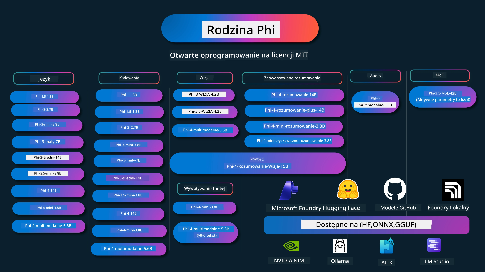

# Phi Cookbook: Praktyczne przykłady z modelami Phi firmy Microsoft

[](https://codespaces.new/microsoft/phicookbook)
[](https://vscode.dev/redirect?url=vscode://ms-vscode-remote.remote-containers/cloneInVolume?url=https://github.com/microsoft/phicookbook)

[](https://GitHub.com/microsoft/phicookbook/graphs/contributors/?WT.mc_id=aiml-137032-kinfeylo)
[](https://GitHub.com/microsoft/phicookbook/issues/?WT.mc_id=aiml-137032-kinfeylo)
[](https://GitHub.com/microsoft/phicookbook/pulls/?WT.mc_id=aiml-137032-kinfeylo)
[](http://makeapullrequest.com?WT.mc_id=aiml-137032-kinfeylo)

[](https://GitHub.com/microsoft/phicookbook/watchers/?WT.mc_id=aiml-137032-kinfeylo)
[](https://GitHub.com/microsoft/phicookbook/network/?WT.mc_id=aiml-137032-kinfeylo)
[](https://GitHub.com/microsoft/phicookbook/stargazers/?WT.mc_id=aiml-137032-kinfeylo)

[](https://discord.com/invite/ByRwuEEgH4)

Phi to seria otwartych modeli AI opracowanych przez Microsoft.

Phi jest obecnie najsilniejszym i najbardziej opłacalnym małym modelem językowym (SLM), z bardzo dobrymi wskaźnikami w wielu językach, rozumowaniu, generowaniu tekstu/rozmów, kodowaniu, obrazach, audio i innych zastosowaniach.

Możesz wdrożyć Phi w chmurze lub na urządzeniach edge i łatwo budować aplikacje AI generatywnej przy ograniczonej mocy obliczeniowej.

Postępuj zgodnie z tymi krokami, aby rozpocząć korzystanie z tych zasobów:
1. **Utwórz fork repozytorium**: Kliknij [](https://GitHub.com/microsoft/phicookbook/network/?WT.mc_id=aiml-137032-kinfeylo)
2. **Sklonuj repozytorium**: `git clone https://github.com/microsoft/PhiCookBook.git`
3. [**Dołącz do społeczności Microsoft AI Discord i poznaj ekspertów oraz innych programistów**](https://discord.com/invite/ByRwuEEgH4?WT.mc_id=aiml-137032-kinfeylo)



### 🌐 Wielojęzyczne wsparcie

#### Obsługiwane przez GitHub Action (Automatyczne i Zawsze Aktualne)

<!-- CO-OP TRANSLATOR LANGUAGES TABLE START -->
[Arabski](../ar/README.md) | [Bengalski](../bn/README.md) | [Bułgarski](../bg/README.md) | [Birmański (Myanmar)](../my/README.md) | [Chiński (uproszczony)](../zh-CN/README.md) | [Chiński (tradycyjny, Hong Kong)](../zh-HK/README.md) | [Chiński (tradycyjny, Macau)](../zh-MO/README.md) | [Chiński (tradycyjny, Tajwan)](../zh-TW/README.md) | [Chorwacki](../hr/README.md) | [Czeski](../cs/README.md) | [Duński](../da/README.md) | [Holenderski](../nl/README.md) | [Estoński](../et/README.md) | [Fiński](../fi/README.md) | [Francuski](../fr/README.md) | [Niemiecki](../de/README.md) | [Grecki](../el/README.md) | [Hebrajski](../he/README.md) | [Hindi](../hi/README.md) | [Węgierski](../hu/README.md) | [Indonezyjski](../id/README.md) | [Włoski](../it/README.md) | [Japoński](../ja/README.md) | [Kannada](../kn/README.md) | [Khmer](../km/README.md) | [Koreański](../ko/README.md) | [Litewski](../lt/README.md) | [Malajski](../ms/README.md) | [Malajalam](../ml/README.md) | [Marathi](../mr/README.md) | [Nepalski](../ne/README.md) | [Pidgin nigeryjski](../pcm/README.md) | [Norweski](../no/README.md) | [Perski (Farsi)](../fa/README.md) | [Polski](./README.md) | [Portugalski (Brazylia)](../pt-BR/README.md) | [Portugalski (Portugalia)](../pt-PT/README.md) | [Pendżabski (Gurmukhi)](../pa/README.md) | [Rumuński](../ro/README.md) | [Rosyjski](../ru/README.md) | [Serbski (cyrylica)](../sr/README.md) | [Słowacki](../sk/README.md) | [Słoweński](../sl/README.md) | [Hiszpański](../es/README.md) | [Suahili](../sw/README.md) | [Szwedzki](../sv/README.md) | [Tagalog (Filipiński)](../tl/README.md) | [Tamilski](../ta/README.md) | [Telugu](../te/README.md) | [Tajski](../th/README.md) | [Turecki](../tr/README.md) | [Ukraiński](../uk/README.md) | [Urdu](../ur/README.md) | [Wietnamski](../vi/README.md)

> **Wolisz klonować lokalnie?**
>
> To repozytorium zawiera tłumaczenia na 50+ języków, co znacząco zwiększa rozmiar pobierania. Aby sklonować bez tłumaczeń, użyj sparse checkout:
>
> **Bash / macOS / Linux:**
> ```bash
> git clone --filter=blob:none --sparse https://github.com/microsoft/PhiCookBook.git
> cd PhiCookBook
> git sparse-checkout set --no-cone '/*' '!translations' '!translated_images'
> ```
>
> **CMD (Windows):**
> ```cmd
> git clone --filter=blob:none --sparse https://github.com/microsoft/PhiCookBook.git
> cd PhiCookBook
> git sparse-checkout set --no-cone "/*" "!translations" "!translated_images"
> ```
>
> To daje wszystko, czego potrzebujesz, aby ukończyć kurs z dużo szybszym pobieraniem.
<!-- CO-OP TRANSLATOR LANGUAGES TABLE END -->

## Spis treści
- Wprowadzenie - [Witamy w rodzinie Phi](./md/01.Introduction/01/01.PhiFamily.md) - [Konfiguracja środowiska](./md/01.Introduction/01/01.EnvironmentSetup.md) - [Zrozumienie kluczowych technologii](./md/01.Introduction/01/01.Understandingtech.md) - [Bezpieczeństwo AI dla modeli Phi](./md/01.Introduction/01/01.AISafety.md) - [Wsparcie sprzętowe Phi](./md/01.Introduction/01/01.Hardwaresupport.md) - [Modele Phi i dostępność na różnych platformach](./md/01.Introduction/01/01.Edgeandcloud.md) - [Korzystanie z Guidance-ai i Phi](./md/01.Introduction/01/01.Guidance.md) - [Modele z GitHub Marketplace](https://github.com/marketplace/models) - [Katalog modeli AI Azure](https://ai.azure.com) - Inferencja Phi w różnych środowiskach - [Hugging face](./md/01.Introduction/02/01.HF.md) - [Modele GitHub](./md/01.Introduction/02/02.GitHubModel.md) - [Katalog modeli Microsoft Foundry](./md/01.Introduction/02/03.AzureAIFoundry.md) - [Ollama](./md/01.Introduction/02/04.Ollama.md) - [Zestaw narzędzi AI VSCode (AITK)](./md/01.Introduction/02/05.AITK.md) - [NVIDIA NIM](./md/01.Introduction/02/06.NVIDIA.md) - [Foundry lokalny](./md/01.Introduction/02/07.FoundryLocal.md) - Inferencja w rodzinie Phi - [Inferencja Phi w iOS](./md/01.Introduction/03/iOS_Inference.md) - [Inferencja Phi w Android](./md/01.Introduction/03/Android_Inference.md) - [Inferencja Phi w Jetson](./md/01.Introduction/03/Jetson_Inference.md) - [Inferencja Phi w AI PC](./md/01.Introduction/03/AIPC_Inference.md) - [Inferencja Phi z frameworkiem Apple MLX](./md/01.Introduction/03/MLX_Inference.md) - [Inferencja Phi na serwerze lokalnym](./md/01.Introduction/03/Local_Server_Inference.md) - [Inferencja Phi na serwerze zdalnym z wykorzystaniem AI Toolkit](./md/01.Introduction/03/Remote_Interence.md) - [Inferencja Phi z Rust](./md/01.Introduction/03/Rust_Inference.md) - [Inferencja Phi – Wizja lokalna](./md/01.Introduction/03/Vision_Inference.md) - [Inferencja Phi z Kaito AKS, Azure Containers (oficjalne wsparcie)](./md/01.Introduction/03/Kaito_Inference.md) - [Kwatyfikacja rodziny Phi](./md/01.Introduction/04/QuantifyingPhi.md) - [Kwantowanie Phi-3.5 / 4 z użyciem llama.cpp](./md/01.Introduction/04/UsingLlamacppQuantifyingPhi.md) - [Kwantowanie Phi-3.5 /4 z użyciem rozszerzeń Generative AI dla onnxruntime](./md/01.Introduction/04/UsingORTGenAIQuantifyingPhi.md) - [Kwantowanie Phi-3.5 / 4 z użyciem Intel OpenVINO](./md/01.Introduction/04/UsingIntelOpenVINOQuantifyingPhi.md) - [Kwantowanie Phi-3.5 / 4 z użyciem frameworka Apple MLX](./md/01.Introduction/04/UsingAppleMLXQuantifyingPhi.md) - Ocena Phi - [Odpowiedzialne AI](./md/01.Introduction/05/ResponsibleAI.md) - [Microsoft Foundry do oceny](./md/01.Introduction/05/AIFoundry.md) - [Używanie Promptflow do oceny](./md/01.Introduction/05/Promptflow.md) - RAG z Azure AI Search - [Jak używać Phi-4-mini i Phi-4-multimodal (RAG) z Azure AI Search](https://github.com/microsoft/PhiCookBook/blob/main/code/06.E2E/E2E_Phi-4-RAG-Azure-AI-Search.ipynb) - Przykłady tworzenia aplikacji Phi - Aplikacje tekstowe i czatowe - Przykłady Phi-4 - [📓] [Czat z modelem Phi-4-mini ONNX](./md/02.Application/01.TextAndChat/Phi4/ChatWithPhi4ONNX/README.md) - [Czat z lokalnym modelem Phi-4 ONNX w .NET](../../md/04.HOL/dotnet/src/LabsPhi4-Chat-01OnnxRuntime) - [Czat aplikacja konsolowa .NET z Phi-4 ONNX z użyciem Semantic Kernel](../../md/04.HOL/dotnet/src/LabsPhi4-Chat-02SK) - Przykłady Phi-3 / 3.5 - [Lokalny chatbot w przeglądarce z użyciem Phi3, ONNX Runtime Web i WebGPU](https://github.com/microsoft/onnxruntime-inference-examples/tree/main/js/chat) - [Czat OpenVino](./md/02.Application/01.TextAndChat/Phi3/E2E_OpenVino_Chat.md) - [Wielomodelowy - interaktywny Phi-3-mini i OpenAI Whisper](./md/02.Application/01.TextAndChat/Phi3/E2E_Phi-3-mini_with_whisper.md) - [MLFlow - Tworzenie wrappera i używanie Phi-3 z MLFlow](./md//02.Application/01.TextAndChat/Phi3/E2E_Phi-3-MLflow.md) - [Optymalizacja modelu - Jak zoptymalizować model Phi-3-mini dla ONNX Runtime Web z Olive](https://github.com/microsoft/Olive/tree/main/examples/phi3) - [Aplikacja WinUI3 z Phi-3 mini-4k-instruct-onnx](https://github.com/microsoft/Phi3-Chat-WinUI3-Sample/) - [Przykład aplikacji WinUI3 Notes z AI wielomodelową](https://github.com/microsoft/ai-powered-notes-winui3-sample) - [Dostrajanie i integracja niestandardowych modeli Phi-3 z Prompt flow](./md/02.Application/01.TextAndChat/Phi3/E2E_Phi-3-FineTuning_PromptFlow_Integration.md) - [Dostrajanie i integracja niestandardowych modeli Phi-3 z Prompt flow w Microsoft Foundry](./md/02.Application/01.TextAndChat/Phi3/E2E_Phi-3-FineTuning_PromptFlow_Integration_AIFoundry.md) - [Ocena dostrojonych modeli Phi-3 / Phi-3.5 w Microsoft Foundry z uwzględnieniem zasad odpowiedzialnego AI Microsoft](./md/02.Application/01.TextAndChat/Phi3/E2E_Phi-3-Evaluation_AIFoundry.md) - [📓] [Przykład predykcji językowej Phi-3.5-mini-instruct (chiński/angielski)](./md/02.Application/01.TextAndChat/Phi3/phi3-instruct-demo.ipynb) - [Phi-3.5-Instruct WebGPU RAG Chatbot](./md/02.Application/01.TextAndChat/Phi3/WebGPUWithPhi35Readme.md) - [Użycie GPU Windows do tworzenia rozwiązania Prompt flow z Phi-3.5-Instruct ONNX](./md/02.Application/01.TextAndChat/Phi3/UsingPromptFlowWithONNX.md) - [Użycie Microsoft Phi-3.5 tflite do tworzenia aplikacji Android](./md/02.Application/01.TextAndChat/Phi3/UsingPhi35TFLiteCreateAndroidApp.md) - [Przykład Q&A .NET używający lokalnego modelu ONNX Phi-3 z Microsoft.ML.OnnxRuntime](../../md/04.HOL/dotnet/src/LabsPhi301) - [Aplikacja konsolowa chat .NET z Semantic Kernel i Phi-3](../../md/04.HOL/dotnet/src/LabsPhi302) - Przykłady kodu SDK inferencji Azure AI - Przykłady Phi-4 - [📓] [Generowanie kodu projektu z Phi-4-multimodal](./md/02.Application/02.Code/Phi4/GenProjectCode/README.md) - Przykłady Phi-3 / 3.5 - [Zbuduj własny chat GitHub Copilot w Visual Studio Code z rodziną Microsoft Phi-3](./md/02.Application/02.Code/Phi3/VSCodeExt/README.md) - [Stwórz własnego agenta Chat Copilot w Visual Studio Code z Phi-3.5 i modelami GitHub](/md/02.Application/02.Code/Phi3/CreateVSCodeChatAgentWithGitHubModels.md) - Zaawansowane przykłady wnioskowania - Przykłady Phi-4 - [📓] [Przykłady wnioskowania Phi-4-mini lub Phi-4](./md/02.Application/03.AdvancedReasoning/Phi4/AdvancedResoningPhi4mini/README.md) - [📓] [Dostrajanie Phi-4-mini-reasoning z Microsoft Olive](./md/02.Application/03.AdvancedReasoning/Phi4/AdvancedResoningPhi4mini/olive_ft_phi_4_reasoning_with_medicaldata.ipynb) - [📓] [Dostrajanie Phi-4-mini-reasoning z Apple MLX](./md/02.Application/03.AdvancedReasoning/Phi4/AdvancedResoningPhi4mini/mlx_ft_phi_4_reasoning_with_medicaldata.ipynb) - [📓] [Phi-4-mini-reasoning z modelami GitHub](./md/02.Application/02.Code/Phi4r/github_models_inference.ipynb) - [📓] [Phi-4-mini-reasoning z modelami Microsoft Foundry](./md/02.Application/02.Code/Phi4r/azure_models_inference.ipynb) -
Demos - [Dema Phi-4-mini hostowane na Hugging Face Spaces](https://huggingface.co/spaces/microsoft/phi-4-mini?WT.mc_id=aiml-137032-kinfeylo) - [Dema Phi-4-multimodal hostowane na Hugginge Face Spaces](https://huggingface.co/spaces/microsoft/phi-4-multimodal?WT.mc_id=aiml-137032-kinfeylo) - Próbki wizji - Próbki Phi-4 - [📓] [Użyj Phi-4-multimodal do odczytywania obrazów i generowania kodu](./md/02.Application/04.Vision/Phi4/CreateFrontend/README.md) - Próbki Phi-3 / 3.5 - [📓][Phi-3-vision-Obraz tekst do tekstu](./md/02.Application/04.Vision/Phi3/E2E_Phi-3-vision-image-text-to-text-online-endpoint.ipynb) - [Phi-3-vision-ONNX](https://onnxruntime.ai/docs/genai/tutorials/phi3-v.html) - [📓][Phi-3-vision CLIP Embedding](./md/02.Application/04.Vision/Phi3/E2E_Phi-3-vision-image-text-to-text-online-endpoint.ipynb) - [DEMO: Phi-3 Recycling](https://github.com/jennifermarsman/PhiRecycling/) - [Phi-3-vision - Asystent języka wizualnego - z Phi3-Vision i OpenVINO](https://docs.openvino.ai/nightly/notebooks/phi-3-vision-with-output.html) - [Phi-3 Vision Nvidia NIM](./md/02.Application/04.Vision/Phi3/E2E_Nvidia_NIM_Vision.md) - [Phi-3 Vision OpenVino](./md/02.Application/04.Vision/Phi3/E2E_OpenVino_Phi3Vision.md) - [📓][Phi-3.5 Vision przykładowy wieloklatkowy lub wieloobrazowy](./md/02.Application/04.Vision/Phi3/phi3-vision-demo.ipynb) - [Lokalny model Phi-3 Vision ONNX używając Microsoft.ML.OnnxRuntime .NET](../../md/04.HOL/dotnet/src/LabsPhi303) - [Menu oparte na lokalnym modelu Phi-3 Vision ONNX używając Microsoft.ML.OnnxRuntime .NET](../../md/04.HOL/dotnet/src/LabsPhi304) - Próbki Reasoning-Vision - Phi-4-Reasoning-Vision-15B - [📓] [Użycie Phi-4-Reasoning-Vision-15B do wykrywania przechodzenia na czerwonym świetle](./md/02.Application/10.ReasoningVision/Phi_4_reasoning_vision_15b_Jaywalking.ipynb) - [📓] [Użycie Phi-4-Reasoning-Vision-15B do matematyki](./md/02.Application/10.ReasoningVision/Phi_4_reasoning_vision_15b_Math.ipynb) - [📓] [Użycie Phi-4-Reasoning-Vision-15B do wykrywania UI](./md/02.Application/10.ReasoningVision/Phi_4_reasoning_vision_15b_ui.ipynb) - Próbki matematyczne - Phi-4-Mini-Flash-Reasoning-Instruct Próbki [Demo matematyczne z Phi-4-Mini-Flash-Reasoning-Instruct](./md/02.Application/09.Math/MathDemo.ipynb) - Próbki audio - Próbki Phi-4 - [📓] [Ekstrakcja transkryptów audio za pomocą Phi-4-multimodal](./md/02.Application/05.Audio/Phi4/Transciption/README.md) - [📓] [Próbka audio Phi-4-multimodal](./md/02.Application/05.Audio/Phi4/Siri/demo.ipynb) - [📓] [Próbka tłumaczenia mowy Phi-4-multimodal](./md/02.Application/05.Audio/Phi4/Translate/demo.ipynb) - [Aplikacja konsolowa .NET używająca Phi-4-multimodal Audio do analizy pliku audio i generowania transkryptu](../../md/04.HOL/dotnet/src/LabsPhi4-MultiModal-02Audio) - Próbki MOE - Próbki Phi-3 / 3.5 - [📓] [Próbka modeli mieszaniny ekspertów (MoEs) Phi-3.5 w mediach społecznościowych](./md/02.Application/06.MoE/Phi3/phi3_moe_demo.ipynb) - [📓] [Budowa Pipeline Retrieval-Augmented Generation (RAG) z NVIDIA NIM Phi-3 MOE, Azure AI Search i LlamaIndex](./md/02.Application/06.MoE/Phi3/azure-ai-search-nvidia-rag.ipynb) - - Próbki wywoływania funkcji - Próbki Phi-4 🆕 - [📓] [Użycie wywoływania funkcji z Phi-4-mini](./md/02.Application/07.FunctionCalling/Phi4/FunctionCallingBasic/README.md) - [📓] [Użycie wywoływania funkcji do tworzenia wieloagentów z Phi-4-mini](./md/02.Application/07.FunctionCalling/Phi4/Multiagents/Phi_4_mini_multiagent.ipynb) - [📓] [Użycie wywoływania funkcji z Ollama](./md/02.Application/07.FunctionCalling/Phi4/Ollama/ollama_functioncalling.ipynb) - [📓] [Użycie wywoływania funkcji z ONNX](./md/02.Application/07.FunctionCalling/Phi4/ONNX/onnx_parallel_functioncalling.ipynb) - Próbki mieszania multimodalnego - Próbki Phi-4 🆕 - [📓] [Użycie Phi-4-multimodal jako dziennikarza technologicznego](./md/02.Application/08.Multimodel/Phi4/TechJournalist/phi_4_mm_audio_text_publish_news.ipynb) - [Aplikacja konsolowa .NET używająca Phi-4-multimodal do analizy obrazów](../../md/04.HOL/dotnet/src/LabsPhi4-MultiModal-01Images) - Próbki dostrajania Phi - [Scenariusze dostrajania](./md/03.FineTuning/FineTuning_Scenarios.md) - [Dostrajanie vs RAG](./md/03.FineTuning/FineTuning_vs_RAG.md) - [Dostrajanie: Niech Phi-3 stanie się ekspertem branżowym](./md/03.FineTuning/LetPhi3gotoIndustriy.md) - [Dostrajanie Phi-3 z AI Toolkit dla VS Code](./md/03.FineTuning/Finetuning_VSCodeaitoolkit.md) - [Dostrajanie Phi-3 z Azure Machine Learning Service](./md/03.FineTuning/Introduce_AzureML.md) - [Dostrajanie Phi-3 z Lora](./md/03.FineTuning/FineTuning_Lora.md) - [Dostrajanie Phi-3 z QLora](./md/03.FineTuning/FineTuning_Qlora.md) - [Dostrajanie Phi-3 z Microsoft Foundry](./md/03.FineTuning/FineTuning_AIFoundry.md) - [Dostrajanie Phi-3 z Azure ML CLI/SDK](./md/03.FineTuning/FineTuning_MLSDK.md) - [Dostrajanie z Microsoft Olive](./md/03.FineTuning/FineTuning_MicrosoftOlive.md) - [Ćwiczenia praktyczne z dostrajania Microsoft Olive](./md/03.FineTuning/olive-lab/readme.md) - [Dostrajanie Phi-3-vision z Weights and Bias](./md/03.FineTuning/FineTuning_Phi-3-visionWandB.md) - [Dostrajanie Phi-3 z Apple MLX Framework](./md/03.FineTuning/FineTuning_MLX.md) - [Dostrajanie Phi-3-vision (oficjalne wsparcie)](./md/03.FineTuning/FineTuning_Vision.md) - [Dostrajanie Phi-3 z Kaito AKS, Azure Containers (oficjalne wsparcie)](./md/03.FineTuning/FineTuning_Kaito.md) - [Dostrajanie Phi-3 i 3.5 Vision](https://github.com/2U1/Phi3-Vision-Finetune) - Ćwiczenia praktyczne - [Eksploracja najnowszych modeli: LLM, SLM, lokalny rozwój i więcej](https://github.com/microsoft/aitour-exploring-cutting-edge-models) - [Uwalnianie potencjału NLP: dostrajanie z Microsoft Olive](https://github.com/azure/Ignite_FineTuning_workshop) - Prace badawcze i publikacje akademickie - [Textbooks Are All You Need II: raport techniczny phi-1.5](https://arxiv.org/abs/2309.05463) - [Raport techniczny Phi-3: wysoce zdolny model językowy lokalnie na Twoim telefonie](https://arxiv.org/abs/2404.14219) - [Raport techniczny Phi-4](https://arxiv.org/abs/2412.08905) - [Raport techniczny Phi-4-Mini: kompaktowe, a jednocześnie potężne multimodalne modele językowe za pomocą mieszaniny LoRAs](https://arxiv.org/abs/2503.01743) - [Optymalizacja małych modeli językowych dla wywoływania funkcji w pojeździe](https://arxiv.org/abs/2501.02342) - [(WhyPHI) Dostrajanie PHI-3 do odpowiedzi na pytania wielokrotnego wyboru: metodologia, wyniki i wyzwania](https://arxiv.org/abs/2501.01588) - [Raport techniczny Phi-4-reasoning](https://www.microsoft.com/en-us/research/wp-content/uploads/2025/04/phi_4_reasoning.pdf)
- [Raport techniczny Phi-4-mini-reasoning](https://huggingface.co/microsoft/Phi-4-mini-reasoning/blob/main/Phi-4-Mini-Reasoning.pdf)
# Phi Cookbook: Praktyczne przykłady z modelami Phi firmy Microsoft

[](https://codespaces.new/microsoft/phicookbook)
[](https://vscode.dev/redirect?url=vscode://ms-vscode-remote.remote-containers/cloneInVolume?url=https://github.com/microsoft/phicookbook)

[](https://GitHub.com/microsoft/phicookbook/graphs/contributors/?WT.mc_id=aiml-137032-kinfeylo)
[](https://GitHub.com/microsoft/phicookbook/issues/?WT.mc_id=aiml-137032-kinfeylo)
[](https://GitHub.com/microsoft/phicookbook/pulls/?WT.mc_id=aiml-137032-kinfeylo)
[](http://makeapullrequest.com?WT.mc_id=aiml-137032-kinfeylo)

[](https://GitHub.com/microsoft/phicookbook/watchers/?WT.mc_id=aiml-137032-kinfeylo)
[](https://GitHub.com/microsoft/phicookbook/network/?WT.mc_id=aiml-137032-kinfeylo)
[](https://GitHub.com/microsoft/phicookbook/stargazers/?WT.mc_id=aiml-137032-kinfeylo)

[](https://discord.com/invite/ByRwuEEgH4)

Phi to seria otwartych modeli AI opracowanych przez Microsoft.

Phi jest obecnie najmocniejszym i najbardziej opłacalnym małym modelem językowym (SLM), z bardzo dobrymi wynikami w wielojęzyczności, rozumowaniu, generowaniu tekstu/czatu, kodowaniu, obrazach, dźwięku i innych scenariuszach.

Możesz wdrożyć Phi w chmurze lub na urządzeniach brzegowych, a także łatwo tworzyć aplikacje generatywnej AI przy ograniczonej mocy obliczeniowej.

Postępuj według tych kroków, aby rozpocząć korzystanie z tych zasobów:
1. **Forknij repozytorium**: Kliknij [](https://GitHub.com/microsoft/phicookbook/network/?WT.mc_id=aiml-137032-kinfeylo)
2. **Sklonuj repozytorium**: `git clone https://github.com/microsoft/PhiCookBook.git`
3. [**Dołącz do społeczności Microsoft AI na Discordzie i poznaj ekspertów oraz innych deweloperów**](https://discord.com/invite/ByRwuEEgH4?WT.mc_id=aiml-137032-kinfeylo)


### 🌐 Wsparcie wielojęzyczne

#### Obsługiwane przez GitHub Action (Automatyczne i zawsze aktualne)

<!-- CO-OP TRANSLATOR LANGUAGES TABLE START -->
[Arabski](../ar/README.md) | [Bengalski](../bn/README.md) | [Bułgarski](../bg/README.md) | [Birmański (Myanmar)](../my/README.md) | [Chiński (uproszczony)](../zh-CN/README.md) | [Chiński (tradycyjny, Hongkong)](../zh-HK/README.md) | [Chiński (tradycyjny, Makau)](../zh-MO/README.md) | [Chiński (tradycyjny, Tajwan)](../zh-TW/README.md) | [Chorwacki](../hr/README.md) | [Czeski](../cs/README.md) | [Duński](../da/README.md) | [Holenderski](../nl/README.md) | [Estoński](../et/README.md) | [Fiński](../fi/README.md) | [Francuski](../fr/README.md) | [Niemiecki](../de/README.md) | [Grecki](../el/README.md) | [Hebrajski](../he/README.md) | [Hindi](../hi/README.md) | [Węgierski](../hu/README.md) | [Indonezyjski](../id/README.md) | [Włoski](../it/README.md) | [Japoński](../ja/README.md) | [Kannada](../kn/README.md) | [Khmer](../km/README.md) | [Koreański](../ko/README.md) | [Litewski](../lt/README.md) | [Malajski](../ms/README.md) | [Malajalam](../ml/README.md) | [Marathi](../mr/README.md) | [Nepalski](../ne/README.md) | [Nigerski pidgin](../pcm/README.md) | [Norweski](../no/README.md) | [Perski (Farsi)](../fa/README.md) | [Polski](./README.md) | [Portugalski (Brazylia)](../pt-BR/README.md) | [Portugalski (Portugalia)](../pt-PT/README.md) | [Pendżabski (Gurmukhi)](../pa/README.md) | [Rumuński](../ro/README.md) | [Rosyjski](../ru/README.md) | [Serbski (cyrylica)](../sr/README.md) | [Słowacki](../sk/README.md) | [Słoweński](../sl/README.md) | [Hiszpański](../es/README.md) | [Suahili](../sw/README.md) | [Szwedzki](../sv/README.md) | [Tagalog (filipiński)](../tl/README.md) | [Tamilski](../ta/README.md) | [Telugu](../te/README.md) | [Tajski](../th/README.md) | [Turecki](../tr/README.md) | [Ukraiński](../uk/README.md) | [Urdu](../ur/README.md) | [Wietnamski](../vi/README.md)

> **Wolisz klonować lokalnie?**
>
> Repozytorium zawiera ponad 50 tłumaczeń językowych, co znacznie zwiększa rozmiar pobierania. Aby sklonować bez tłumaczeń, użyj sparse checkout:
>
> **Bash / macOS / Linux:**
> ```bash
> git clone --filter=blob:none --sparse https://github.com/microsoft/PhiCookBook.git
> cd PhiCookBook
> git sparse-checkout set --no-cone '/*' '!translations' '!translated_images'
> ```
>
> **CMD (Windows):**
> ```cmd
> git clone --filter=blob:none --sparse https://github.com/microsoft/PhiCookBook.git
> cd PhiCookBook
> git sparse-checkout set --no-cone "/*" "!translations" "!translated_images"
> ```
>
> To zapewnia wszystko, czego potrzebujesz, aby ukończyć kurs z dużo szybszym pobieraniem.
<!-- CO-OP TRANSLATOR LANGUAGES TABLE END -->

## Spis treści

## Korzystanie z modeli Phi

### Phi na Microsoft Foundry

Możesz nauczyć się, jak używać Microsoft Phi oraz jak budować rozwiązania E2E na różnych urządzeniach sprzętowych. Aby doświadczyć Phi osobiście, zacznij od zabawy z modelami i dostosowywania Phi do swoich scenariuszy za pomocą [Microsoft Foundry Azure AI Model Catalog](https://aka.ms/phi3-azure-ai). Więcej informacji znajdziesz w poradniku Rozpoczęcie pracy z [Microsoft Foundry](/md/02.QuickStart/AzureAIFoundry_QuickStart.md).

**Playground**
Każdy model ma dedykowane środowisko testowe [Azure AI Playground](https://aka.ms/try-phi3).

### Phi w modelach GitHub

Możesz nauczyć się, jak używać Microsoft Phi oraz jak budować rozwiązania E2E na różnych urządzeniach sprzętowych. Aby doświadczyć Phi osobiście, zacznij od zabawy z modelem i dostosowywania Phi do swoich scenariuszy za pomocą [Katalogu modeli GitHub](https://github.com/marketplace/models?WT.mc_id=aiml-137032-kinfeylo). Więcej informacji znajdziesz w poradniku Rozpoczęcie pracy z [Katalogiem modeli GitHub](/md/02.QuickStart/GitHubModel_QuickStart.md).

**Playground**
Każdy model ma dedykowany [środowisko testowe](/md/02.QuickStart/GitHubModel_QuickStart.md).

### Phi na Hugging Face

Model możesz również znaleźć na [Hugging Face](https://huggingface.co/microsoft)

**Playground**
 [Hugging Chat playground](https://huggingface.co/chat/models/microsoft/Phi-3-mini-4k-instruct)

## 🎒 Inne kursy

Nasz zespół przygotowuje inne kursy! Sprawdź:

<!-- CO-OP TRANSLATOR OTHER COURSES START -->
### LangChain
[](https://aka.ms/langchain4j-for-beginners)
[](https://aka.ms/langchainjs-for-beginners?WT.mc_id=m365-94501-dwahlin)
[](https://github.com/microsoft/langchain-for-beginners?WT.mc_id=m365-94501-dwahlin)
---

### Azure / Edge / MCP / Agenci
[](https://github.com/microsoft/AZD-for-beginners?WT.mc_id=academic-105485-koreyst)
[](https://github.com/microsoft/edgeai-for-beginners?WT.mc_id=academic-105485-koreyst)
[](https://github.com/microsoft/mcp-for-beginners?WT.mc_id=academic-105485-koreyst)
[](https://github.com/microsoft/ai-agents-for-beginners?WT.mc_id=academic-105485-koreyst)

---
 
### Seria Generative AI
[](https://github.com/microsoft/generative-ai-for-beginners?WT.mc_id=academic-105485-koreyst)
[-9333EA?style=for-the-badge&labelColor=E5E7EB&color=9333EA)](https://github.com/microsoft/Generative-AI-for-beginners-dotnet?WT.mc_id=academic-105485-koreyst)
[-C084FC?style=for-the-badge&labelColor=E5E7EB&color=C084FC)](https://github.com/microsoft/generative-ai-for-beginners-java?WT.mc_id=academic-105485-koreyst)
[-E879F9?style=for-the-badge&labelColor=E5E7EB&color=E879F9)](https://github.com/microsoft/generative-ai-with-javascript?WT.mc_id=academic-105485-koreyst)

---
 
### Podstawowa nauka
[](https://aka.ms/ml-beginners?WT.mc_id=academic-105485-koreyst)
[](https://aka.ms/datascience-beginners?WT.mc_id=academic-105485-koreyst)
[](https://aka.ms/ai-beginners?WT.mc_id=academic-105485-koreyst)
[](https://github.com/microsoft/Security-101?WT.mc_id=academic-96948-sayoung)
[](https://aka.ms/webdev-beginners?WT.mc_id=academic-105485-koreyst)
[](https://aka.ms/iot-beginners?WT.mc_id=academic-105485-koreyst)
[](https://github.com/microsoft/xr-development-for-beginners?WT.mc_id=academic-105485-koreyst)

---
 
### Seria Copilot
[](https://aka.ms/GitHubCopilotAI?WT.mc_id=academic-105485-koreyst)
[](https://github.com/microsoft/mastering-github-copilot-for-dotnet-csharp-developers?WT.mc_id=academic-105485-koreyst)
[](https://github.com/microsoft/CopilotAdventures?WT.mc_id=academic-105485-koreyst)
<!-- CO-OP TRANSLATOR OTHER COURSES END -->

## Odpowiedzialna AI

Microsoft zobowiązuje się do pomocy naszym klientom w odpowiedzialnym korzystaniu z naszych produktów AI, dzieląc się naszymi doświadczeniami i budując oparte na zaufaniu partnerstwa za pomocą narzędzi takich jak Transparency Notes i Impact Assessments. Wiele z tych zasobów można znaleźć pod adresem [https://aka.ms/RAI](https://aka.ms/RAI).
Podejście Microsoft do odpowiedzialnej AI opiera się na naszych zasadach AI dotyczących uczciwości, niezawodności i bezpieczeństwa, prywatności i bezpieczeństwa, inkluzywności, przejrzystości oraz odpowiedzialności.

Duże modele języka naturalnego, obrazu i mowy – takie jak te użyte w tym przykładzie – mogą potencjalnie zachowywać się w sposób nieuczciwy, zawodny lub obraźliwy, co może powodować szkody. Prosimy o zapoznanie się z [Notatką o przejrzystości usługi Azure OpenAI](https://learn.microsoft.com/legal/cognitive-services/openai/transparency-note?tabs=text), aby być poinformowanym o ryzykach i ograniczeniach.

Zalecanym podejściem do zmniejszania tych ryzyk jest włączenie do architektury systemu bezpieczeństwa, który potrafi wykrywać i zapobiegać szkodliwym zachowaniom. [Azure AI Content Safety](https://learn.microsoft.com/azure/ai-services/content-safety/overview) zapewnia niezależną warstwę ochrony, zdolną wykrywać szkodliwe treści generowane przez użytkowników i AI w aplikacjach i usługach. Azure AI Content Safety obejmuje API dla tekstu i obrazu, które pozwalają wykrywać materiały szkodliwe. W ramach Microsoft Foundry, usługa Content Safety umożliwia przeglądanie, eksplorowanie i wypróbowywanie przykładowego kodu do wykrywania szkodliwych treści w różnych modalnościach. Poniższa [dokumentacja szybkiego startu](https://learn.microsoft.com/azure/ai-services/content-safety/quickstart-text?tabs=visual-studio%2Clinux&pivots=programming-language-rest) przeprowadzi Cię przez wysyłanie żądań do usługi.

Innym aspektem, który należy wziąć pod uwagę, jest ogólna wydajność aplikacji. W aplikacjach wielomodalnych i wielomodelowych wydajność oznacza, że system działa zgodnie z oczekiwaniami Twoimi i Twoich użytkowników, w tym nie generuje szkodliwych wyników. Ważne jest, aby ocenić wydajność całej aplikacji korzystając z [oceniania wydajności, jakości oraz ryzyka i bezpieczeństwa](https://learn.microsoft.com/azure/ai-studio/concepts/evaluation-metrics-built-in). Masz również możliwość tworzenia i oceny za pomocą [niestandardowych oceniaczy](https://learn.microsoft.com/azure/ai-studio/how-to/develop/evaluate-sdk#custom-evaluators).

Możesz ocenić swoją aplikację AI w środowisku deweloperskim używając [Azure AI Evaluation SDK](https://microsoft.github.io/promptflow/index.html). Dla zbioru testowego lub celu, generacje Twojej aplikacji generatywnej AI są ilościowo mierzone za pomocą wbudowanych oceniaczy lub wybranych przez Ciebie niestandardowych oceniaczy. Aby rozpocząć korzystanie z azure ai evaluation sdk do oceny systemu, możesz skorzystać z [przewodnika szybkiego startu](https://learn.microsoft.com/azure/ai-studio/how-to/develop/flow-evaluate-sdk). Po wykonaniu oceny, możesz [wizualizować wyniki w Microsoft Foundry](https://learn.microsoft.com/azure/ai-studio/how-to/evaluate-flow-results).

## Znaki towarowe

Ten projekt może zawierać znaki towarowe lub logotypy projektów, produktów lub usług. Autoryzowane użycie znaków towarowych lub logotypów Microsoft podlega i musi przestrzegać [Wytycznych dotyczących znaków towarowych i marki Microsoft](https://www.microsoft.com/legal/intellectualproperty/trademarks/usage/general).
Używanie znaków towarowych lub logotypów Microsoft w zmodyfikowanych wersjach tego projektu nie może wywoływać zamieszania ani sugerować sponsorowania przez Microsoft. Wszelkie użycie znaków towarowych lub logotypów stron trzecich podlega politykom tych stron trzecich.

## Uzyskanie pomocy

Jeśli utkniesz lub masz pytania dotyczące tworzenia aplikacji AI, dołącz do:

[](https://aka.ms/foundry/discord)

Jeśli masz opinie o produkcie lub błędy podczas budowania, odwiedź:

[](https://aka.ms/foundry/forum)

---

<!-- CO-OP TRANSLATOR DISCLAIMER START -->
**Zrzeczenie się odpowiedzialności**:  
Niniejszy dokument został przetłumaczony przy użyciu usługi tłumaczeń AI [Co-op Translator](https://github.com/Azure/co-op-translator). Chociaż dążymy do dokładności, prosimy pamiętać, że tłumaczenia automatyczne mogą zawierać błędy lub nieścisłości. Oryginalny dokument w języku źródłowym powinien być uważany za źródło autorytatywne. W przypadku informacji krytycznych zaleca się skorzystanie z profesjonalnego tłumaczenia wykonywanego przez człowieka. Nie ponosimy odpowiedzialności za jakiekolwiek nieporozumienia lub błędne interpretacje wynikające z korzystania z tego tłumaczenia.
<!-- CO-OP TRANSLATOR DISCLAIMER END -->