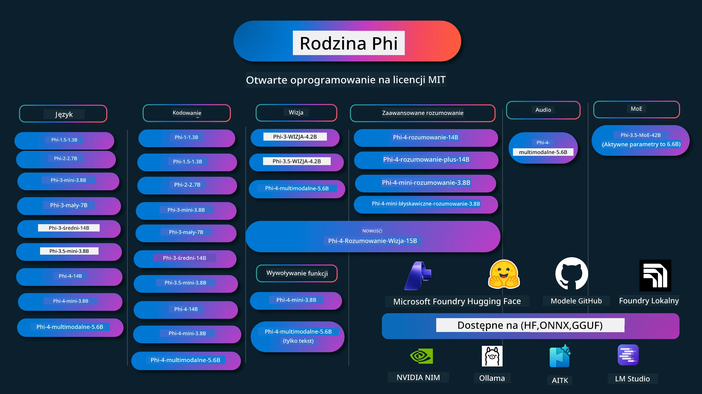

# Phi Cookbook: Praktyczne Przykłady z Modelami Phi od Microsoft

[](https://codespaces.new/microsoft/phicookbook)
[](https://vscode.dev/redirect?url=vscode://ms-vscode-remote.remote-containers/cloneInVolume?url=https://github.com/microsoft/phicookbook)

[](https://GitHub.com/microsoft/phicookbook/graphs/contributors/?WT.mc_id=aiml-137032-kinfeylo)
[](https://GitHub.com/microsoft/phicookbook/issues/?WT.mc_id=aiml-137032-kinfeylo)
[](https://GitHub.com/microsoft/phicookbook/pulls/?WT.mc_id=aiml-137032-kinfeylo)
[](http://makeapullrequest.com?WT.mc_id=aiml-137032-kinfeylo)

[](https://GitHub.com/microsoft/phicookbook/watchers/?WT.mc_id=aiml-137032-kinfeylo)
[](https://GitHub.com/microsoft/phicookbook/network/?WT.mc_id=aiml-137032-kinfeylo)
[](https://GitHub.com/microsoft/phicookbook/stargazers/?WT.mc_id=aiml-137032-kinfeylo)

[](https://discord.com/invite/ByRwuEEgH4)

Phi to seria otwartych modeli AI rozwijanych przez Microsoft.

Phi jest obecnie najpotężniejszym i najbardziej opłacalnym małym modelem językowym (SLM), z bardzo dobrymi wynikami w wielu językach, rozumowaniu, generowaniu tekstu/czatu, kodowaniu, obrazach, dźwięku i innych scenariuszach.

Możesz wdrożyć Phi w chmurze lub na urządzeniach brzegowych i z łatwością budować aplikacje generatywnej AI przy ograniczonej mocy obliczeniowej.

Wykonaj następujące kroki, aby zacząć korzystać z tych zasobów:
1. **Utwórz forka Repozytorium**: Kliknij [](https://GitHub.com/microsoft/phicookbook/network/?WT.mc_id=aiml-137032-kinfeylo)
2. **Sklonuj Repozytorium**: `git clone https://github.com/microsoft/PhiCookBook.git`
3. [**Dołącz do Społeczności Microsoft AI Discord i poznaj ekspertów oraz innych deweloperów**](https://discord.com/invite/ByRwuEEgH4?WT.mc_id=aiml-137032-kinfeylo)



### 🌐 Wielojęzyczne wsparcie

#### Tłumaczenia utrzymywane z pomocą [Co-op Translator](https://github.com/Azure/co-op-translator)

<!-- CO-OP TRANSLATOR LANGUAGES TABLE START -->
[Arabski](../ar/README.md) | [Bengalski](../bn/README.md) | [Bułgarski](../bg/README.md) | [Birmański (Myanmar)](../my/README.md) | [Chiński (uproszczony)](../zh-CN/README.md) | [Chiński (tradycyjny, Hongkong)](../zh-HK/README.md) | [Chiński (tradycyjny, Makau)](../zh-MO/README.md) | [Chiński (tradycyjny, Tajwan)](../zh-TW/README.md) | [Chorwacki](../hr/README.md) | [Czeski](../cs/README.md) | [Duński](../da/README.md) | [Niderlandzki](../nl/README.md) | [Estoński](../et/README.md) | [Fiński](../fi/README.md) | [Francuski](../fr/README.md) | [Niemiecki](../de/README.md) | [Grecki](../el/README.md) | [Hebrajski](../he/README.md) | [Hindi](../hi/README.md) | [Węgierski](../hu/README.md) | [Indonezyjski](../id/README.md) | [Włoski](../it/README.md) | [Japoński](../ja/README.md) | [Kannada](../kn/README.md) | [Khmer](../km/README.md) | [Koreański](../ko/README.md) | [Litewski](../lt/README.md) | [Malajski](../ms/README.md) | [Malajalam](../ml/README.md) | [Marathi](../mr/README.md) | [Nepalski](../ne/README.md) | [Nigeryjski pidgin](../pcm/README.md) | [Norweski](../no/README.md) | [Perski (Farsi)](../fa/README.md) | [Polski](./README.md) | [Portugalski (Brazylia)](../pt-BR/README.md) | [Portugalski (Portugalia)](../pt-PT/README.md) | [Pendżabski (Gurmukhi)](../pa/README.md) | [Rumuński](../ro/README.md) | [Rosyjski](../ru/README.md) | [Serbski (cyrylica)](../sr/README.md) | [Słowacki](../sk/README.md) | [Słoweński](../sl/README.md) | [Hiszpański](../es/README.md) | [Suahili](../sw/README.md) | [Szwedzki](../sv/README.md) | [Tagalog (Filipino)](../tl/README.md) | [Tamil](../ta/README.md) | [Telugu](../te/README.md) | [Tajski](../th/README.md) | [Turecki](../tr/README.md) | [Ukraiński](../uk/README.md) | [Urdu](../ur/README.md) | [Wietnamski](../vi/README.md)

> **Wolisz sklonować lokalnie?**
>
> To repozytorium zawiera ponad 50 tłumaczeń językowych, co znacznie zwiększa rozmiar pobierania. Aby klonować bez tłumaczeń, użyj selektywnego checkoutu:
>
> **Bash / macOS / Linux:**
> ```bash
> git clone --filter=blob:none --sparse https://github.com/microsoft/PhiCookBook.git
> cd PhiCookBook
> git sparse-checkout set --no-cone '/*' '!translations' '!translated_images'
> ```
>
> **CMD (Windows):**
> ```cmd
> git clone --filter=blob:none --sparse https://github.com/microsoft/PhiCookBook.git
> cd PhiCookBook
> git sparse-checkout set --no-cone "/*" "!translations" "!translated_images"
> ```
>
> To daje wszystko, czego potrzebujesz do ukończenia kursu z dużo szybszym pobieraniem.
<!-- CO-OP TRANSLATOR LANGUAGES TABLE END -->

## Spis treści

- Wprowadzenie
  - [Witamy w Rodzinie Phi](./md/01.Introduction/01/01.PhiFamily.md)
  - [Konfiguracja środowiska](./md/01.Introduction/01/01.EnvironmentSetup.md)
  - [Zrozumienie Kluczowych Technologii](./md/01.Introduction/01/01.Understandingtech.md)
  - [Bezpieczeństwo AI dla modeli Phi](./md/01.Introduction/01/01.AISafety.md)
  - [Wsparcie sprzętowe Phi](./md/01.Introduction/01/01.Hardwaresupport.md)
  - [Modele Phi i dostępność na platformach](./md/01.Introduction/01/01.Edgeandcloud.md)
  - [Używanie Guidance-ai i Phi](./md/01.Introduction/01/01.Guidance.md)
  - [Modele na GitHub Marketplace](https://github.com/marketplace/models)
  - [Katalog modeli Azure AI](https://ai.azure.com)

- Inference Phi w różnych środowiskach
    -  [Hugging face](./md/01.Introduction/02/01.HF.md)
    -  [Modele GitHub](./md/01.Introduction/02/02.GitHubModel.md)
    -  [Microsoft Foundry Katalog Modeli](./md/01.Introduction/02/03.AzureAIFoundry.md)
    -  [Ollama](./md/01.Introduction/02/04.Ollama.md)
    -  [AI Toolkit VSCode (AITK)](./md/01.Introduction/02/05.AITK.md)
    -  [NVIDIA NIM](./md/01.Introduction/02/06.NVIDIA.md)
    -  [Foundry Local](./md/01.Introduction/02/07.FoundryLocal.md)

- Inference Phi Family
    - [Inference Phi na iOS](./md/01.Introduction/03/iOS_Inference.md)
    - [Inference Phi na Android](./md/01.Introduction/03/Android_Inference.md)
    - [Inference Phi na Jetson](./md/01.Introduction/03/Jetson_Inference.md)
    - [Inference Phi na AI PC](./md/01.Introduction/03/AIPC_Inference.md)
    - [Inference Phi z Apple MLX Framework](./md/01.Introduction/03/MLX_Inference.md)
    - [Inference Phi na lokalnym serwerze](./md/01.Introduction/03/Local_Server_Inference.md)
    - [Inference Phi na serwerze zdalnym z AI Toolkit](./md/01.Introduction/03/Remote_Interence.md)
    - [Inference Phi z Rust](./md/01.Introduction/03/Rust_Inference.md)
    - [Inference Phi – wizja lokalna](./md/01.Introduction/03/Vision_Inference.md)
    - [Inference Phi z Kaito AKS, Azure Containers (oficjalne wsparcie)](./md/01.Introduction/03/Kaito_Inference.md)
-  [Kwantyzacja Phi Family](./md/01.Introduction/04/QuantifyingPhi.md)
    - [Kwantyzacja Phi-3.5 / 4 za pomocą llama.cpp](./md/01.Introduction/04/UsingLlamacppQuantifyingPhi.md)
    - [Kwantyzacja Phi-3.5 / 4 za pomocą rozszerzeń Generative AI dla onnxruntime](./md/01.Introduction/04/UsingORTGenAIQuantifyingPhi.md)
    - [Kwantyzacja Phi-3.5 / 4 za pomocą Intel OpenVINO](./md/01.Introduction/04/UsingIntelOpenVINOQuantifyingPhi.md)
    - [Kwantyzacja Phi-3.5 / 4 za pomocą Apple MLX Framework](./md/01.Introduction/04/UsingAppleMLXQuantifyingPhi.md)

-  Ewaluacja Phi
    - [Response AI](./md/01.Introduction/05/ResponsibleAI.md)
    - [Microsoft Foundry do ewaluacji](./md/01.Introduction/05/AIFoundry.md)
    - [Użycie Promptflow do ewaluacji](./md/01.Introduction/05/Promptflow.md)
 
- RAG z Azure AI Search
    - [Jak użyć Phi-4-mini i Phi-4-multimodal (RAG) z Azure AI Search](https://github.com/microsoft/PhiCookBook/blob/main/code/06.E2E/E2E_Phi-4-RAG-Azure-AI-Search.ipynb)
    - [Zero-Chmura lokalny hybrydowy RAG z SQLite FTS5 i phi-4-mini](https://github.com/microsoft/PhiCookBook/blob/main/code/06.E2E/E2E_Phi-4-mini_Local_Hybrid_RAG_SQLite_FTS5.ipynb)

- Przykłady zastosowań i rozwoju aplikacji Phi
  - Aplikacje tekstowe i czatowe
    - Przykłady Phi-4 
      - [📓] [Czat z modelem Phi-4-mini ONNX](./md/02.Application/01.TextAndChat/Phi4/ChatWithPhi4ONNX/README.md)
      - [Czat z lokalnym modelem Phi-4 ONNX .NET](../../md/04.HOL/dotnet/src/LabsPhi4-Chat-01OnnxRuntime)
      - [Konsolowa aplikacja czatu .NET z Phi-4 ONNX używająca Semantic Kernel](../../md/04.HOL/dotnet/src/LabsPhi4-Chat-02SK)
    - Przykłady Phi-3 / 3.5
      - [Lokalny chatbot w przeglądarce używając Phi3, ONNX Runtime Web i WebGPU](https://github.com/microsoft/onnxruntime-inference-examples/tree/main/js/chat)
      - [Czat OpenVino](./md/02.Application/01.TextAndChat/Phi3/E2E_OpenVino_Chat.md)
      - [Multi Model - Interaktywny Phi-3-mini i OpenAI Whisper](./md/02.Application/01.TextAndChat/Phi3/E2E_Phi-3-mini_with_whisper.md)
      - [MLFlow - Budowa wrappera i używanie Phi-3 z MLFlow](./md//02.Application/01.TextAndChat/Phi3/E2E_Phi-3-MLflow.md)
      - [Optymalizacja modelu - jak zoptymalizować model Phi-3-mini dla ONNX Runtime Web z Olive](https://github.com/microsoft/Olive/tree/main/examples/phi3)
      - [Aplikacja WinUI3 z Phi-3 mini-4k-instruct-onnx](https://github.com/microsoft/Phi3-Chat-WinUI3-Sample/)
      -[Przykład aplikacji WinUI3 Multi Model AI-Powered Notes](https://github.com/microsoft/ai-powered-notes-winui3-sample)
      - [Fine-tuning i integracja niestandardowych modeli Phi-3 z Prompt flow](./md/02.Application/01.TextAndChat/Phi3/E2E_Phi-3-FineTuning_PromptFlow_Integration.md)
      - [Fine-tuning i integracja niestandardowych modeli Phi-3 z Prompt flow w Microsoft Foundry](./md/02.Application/01.TextAndChat/Phi3/E2E_Phi-3-FineTuning_PromptFlow_Integration_AIFoundry.md)
      - [Ewaluacja dostrojonego modelu Phi-3 / Phi-3.5 w Microsoft Foundry ze skupieniem na Zasadach Odpowiedzialnej AI Microsoft](./md/02.Application/01.TextAndChat/Phi3/E2E_Phi-3-Evaluation_AIFoundry.md)
      - [📓] [Przykład predykcji językowej Phi-3.5-mini-instruct (chiński/angielski)](./md/02.Application/01.TextAndChat/Phi3/phi3-instruct-demo.ipynb)
      - [Phi-3.5-Instruct WebGPU RAG Chatbot](./md/02.Application/01.TextAndChat/Phi3/WebGPUWithPhi35Readme.md)
      - [Używanie Windows GPU do tworzenia rozwiązania Prompt flow z Phi-3.5-Instruct ONNX](./md/02.Application/01.TextAndChat/Phi3/UsingPromptFlowWithONNX.md)
      - [Używanie Microsoft Phi-3.5 tflite do tworzenia aplikacji na Android](./md/02.Application/01.TextAndChat/Phi3/UsingPhi35TFLiteCreateAndroidApp.md)
      - [Przykład Q&A .NET z lokalnym modelem ONNX Phi-3 używając Microsoft.ML.OnnxRuntime](../../md/04.HOL/dotnet/src/LabsPhi301)
      - [Konsolowa aplikacja czatu .NET z Semantic Kernel i Phi-3](../../md/04.HOL/dotnet/src/LabsPhi302)

  - Przykłady kodów SDK Azure AI Inference
    - Przykłady Phi-4 
      - [📓] [Generowanie kodu projektu używając Phi-4-multimodal](./md/02.Application/02.Code/Phi4/GenProjectCode/README.md)
    - Przykłady Phi-3 / 3.5
      - [Zbuduj własnego Visual Studio Code GitHub Copilot Chat z rodziną Microsoft Phi-3](./md/02.Application/02.Code/Phi3/VSCodeExt/README.md)
      - [Stwórz własnego agenta czatu Visual Studio Code Copilot z Phi-3.5 za pomocą modeli GitHub](/md/02.Application/02.Code/Phi3/CreateVSCodeChatAgentWithGitHubModels.md)

  - Zaawansowane przykłady rozumowania
    - Próbki Phi-4 
      - [📓] [Próbki Phi-4-mini-reasoning lub Phi-4-reasoning](./md/02.Application/03.AdvancedReasoning/Phi4/AdvancedResoningPhi4mini/README.md)
      - [📓] [Dostrajanie Phi-4-mini-reasoning z Microsoft Olive](./md/02.Application/03.AdvancedReasoning/Phi4/AdvancedResoningPhi4mini/olive_ft_phi_4_reasoning_with_medicaldata.ipynb)
      - [📓] [Dostrajanie Phi-4-mini-reasoning z Apple MLX](./md/02.Application/03.AdvancedReasoning/Phi4/AdvancedResoningPhi4mini/mlx_ft_phi_4_reasoning_with_medicaldata.ipynb)
      - [📓] [Phi-4-mini-reasoning z modelami GitHub](./md/02.Application/02.Code/Phi4r/github_models_inference.ipynb)
      - [📓] [Phi-4-mini-reasoning z modelami Microsoft Foundry](./md/02.Application/02.Code/Phi4r/azure_models_inference.ipynb)
  - Demonstracje
      - [Demonstracje Phi-4-mini hostowane na Hugging Face Spaces](https://huggingface.co/spaces/microsoft/phi-4-mini?WT.mc_id=aiml-137032-kinfeylo)
      - [Demonstracje Phi-4-multimodal hostowane na Hugging Face Spaces](https://huggingface.co/spaces/microsoft/phi-4-multimodal?WT.mc_id=aiml-137032-kinfeylo)
  - Próbki wizji
    - Próbki Phi-4 
      - [📓] [Używanie Phi-4-multimodal do czytania obrazów i generowania kodu](./md/02.Application/04.Vision/Phi4/CreateFrontend/README.md) 
    - Próbki Phi-3 / 3.5
      -  [📓][Phi-3-vision-Image tekst na tekst](./md/02.Application/04.Vision/Phi3/E2E_Phi-3-vision-image-text-to-text-online-endpoint.ipynb)
      - [Phi-3-vision-ONNX](https://onnxruntime.ai/docs/genai/tutorials/phi3-v.html)
      - [📓][Phi-3-vision CLIP Embedding](./md/02.Application/04.Vision/Phi3/E2E_Phi-3-vision-image-text-to-text-online-endpoint.ipynb)
      - [DEMO: Recykling Phi-3](https://github.com/jennifermarsman/PhiRecycling/)
      - [Phi-3-vision - Wizualny asystent językowy - z Phi3-Vision i OpenVINO](https://docs.openvino.ai/nightly/notebooks/phi-3-vision-with-output.html)
      - [Phi-3 Vision Nvidia NIM](./md/02.Application/04.Vision/Phi3/E2E_Nvidia_NIM_Vision.md)
      - [Phi-3 Vision OpenVino](./md/02.Application/04.Vision/Phi3/E2E_OpenVino_Phi3Vision.md)
      - [📓][Phi-3.5 Vision próbka multi-frame lub multi-image](./md/02.Application/04.Vision/Phi3/phi3-vision-demo.ipynb)
      - [Phi-3 Vision lokalny model ONNX używający Microsoft.ML.OnnxRuntime .NET](../../md/04.HOL/dotnet/src/LabsPhi303)
      - [Model lokalny Phi-3 Vision ONNX z menu, używający Microsoft.ML.OnnxRuntime .NET](../../md/04.HOL/dotnet/src/LabsPhi304)

  - Próbki Reasoning-Vision
    - Phi-4-Reasoning-Vision-15B 
      - [📓] [Używanie Phi-4-Reasoning-Vision-15B do wykrywania przechodzenia nielegalnego](./md/02.Application/10.ReasoningVision/Phi_4_reasoning_vision_15b_Jaywalking.ipynb)
      - [📓] [Używanie Phi-4-Reasoning-Vision-15B do matematyki](./md/02.Application/10.ReasoningVision/Phi_4_reasoning_vision_15b_Math.ipynb)
      - [📓] [Używanie Phi-4-Reasoning-Vision-15B do wykrywania UI](./md/02.Application/10.ReasoningVision/Phi_4_reasoning_vision_15b_ui.ipynb)

  - Próbki matematyczne
    -  Próbki Phi-4-Mini-Flash-Reasoning-Instruct  [Demo matematyczne z Phi-4-Mini-Flash-Reasoning-Instruct](./md/02.Application/09.Math/MathDemo.ipynb)

  - Próbki audio
    - Próbki Phi-4 
      - [📓] [Wydobywanie transkryptów audio używając Phi-4-multimodal](./md/02.Application/05.Audio/Phi4/Transciption/README.md)
      - [📓] [Próbka audio Phi-4-multimodal](./md/02.Application/05.Audio/Phi4/Siri/demo.ipynb)
      - [📓] [Próbka tłumaczenia mowy Phi-4-multimodal](./md/02.Application/05.Audio/Phi4/Translate/demo.ipynb)
      - [Aplikacja konsolowa .NET używająca Phi-4-multimodal Audio do analizy pliku audio i generowania transkryptu](../../md/04.HOL/dotnet/src/LabsPhi4-MultiModal-02Audio)

  - Próbki MOE
    - Próbki Phi-3 / 3.5
      - [📓] [Phi-3.5 Modele mix ekspertów (MoEs) przykłady mediów społecznościowych](./md/02.Application/06.MoE/Phi3/phi3_moe_demo.ipynb)
      - [📓] [Budowanie potoku Retrieval-Augmented Generation (RAG) z NVIDIA NIM Phi-3 MOE, Azure AI Search i LlamaIndex](./md/02.Application/06.MoE/Phi3/azure-ai-search-nvidia-rag.ipynb)
      - 
  - Próbki wywoływania funkcji
    - Próbki Phi-4 🆕
      -  [📓] [Użycie wywoływania funkcji z Phi-4-mini](./md/02.Application/07.FunctionCalling/Phi4/FunctionCallingBasic/README.md)
      -  [📓] [Użycie wywoływania funkcji do tworzenia multi-agentów z Phi-4-mini](./md/02.Application/07.FunctionCalling/Phi4/Multiagents/Phi_4_mini_multiagent.ipynb)
      -  [📓] [Używanie wywoływania funkcji z Ollama](./md/02.Application/07.FunctionCalling/Phi4/Ollama/ollama_functioncalling.ipynb)
      -  [📓] [Użycie wywoływania funkcji z ONNX](./md/02.Application/07.FunctionCalling/Phi4/ONNX/onnx_parallel_functioncalling.ipynb)
  - Próbki mieszania multimodalnego
    - Próbki Phi-4 🆕
      -  [📓] [Używanie Phi-4-multimodal jako dziennikarza technologicznego](./md/02.Application/08.Multimodel/Phi4/TechJournalist/phi_4_mm_audio_text_publish_news.ipynb)
      - [Aplikacja konsolowa .NET używająca Phi-4-multimodal do analizy obrazów](../../md/04.HOL/dotnet/src/LabsPhi4-MultiModal-01Images)

- Dostrajanie próbek Phi
  - [Scenariusze dostrajania](./md/03.FineTuning/FineTuning_Scenarios.md)
  - [Dostrajanie kontra RAG](./md/03.FineTuning/FineTuning_vs_RAG.md)
  - [Dostrajanie – pozwól, aby Phi-3 stał się ekspertem branżowym](./md/03.FineTuning/LetPhi3gotoIndustriy.md)
  - [Dostrajanie Phi-3 za pomocą AI Toolkit dla VS Code](./md/03.FineTuning/Finetuning_VSCodeaitoolkit.md)
  - [Dostrajanie Phi-3 z Azure Machine Learning Service](./md/03.FineTuning/Introduce_AzureML.md)
  - [Dostrajanie Phi-3 z Lora](./md/03.FineTuning/FineTuning_Lora.md)
  - [Dostrajanie Phi-3 z QLora](./md/03.FineTuning/FineTuning_Qlora.md)
  - [Dostrajanie Phi-3 z Microsoft Foundry](./md/03.FineTuning/FineTuning_AIFoundry.md)
  - [Dostrajanie Phi-3 z Azure ML CLI/SDK](./md/03.FineTuning/FineTuning_MLSDK.md)
  - [Dostrajanie z Microsoft Olive](./md/03.FineTuning/FineTuning_MicrosoftOlive.md)
  - [Laboratorium praktyczne dostrajania z Microsoft Olive](./md/03.FineTuning/olive-lab/readme.md)
  - [Dostrajanie Phi-3-vision z Weights and Bias](./md/03.FineTuning/FineTuning_Phi-3-visionWandB.md)
  - [Dostrajanie Phi-3 z Apple MLX Framework](./md/03.FineTuning/FineTuning_MLX.md)
  - [Dostrajanie Phi-3-vision (oficjalne wsparcie)](./md/03.FineTuning/FineTuning_Vision.md)
  - [Dostrajanie Phi-3 z Kaito AKS, Azure Containers (oficjalne wsparcie)](./md/03.FineTuning/FineTuning_Kaito.md)
  - [Dostrajanie Phi-3 i 3.5 Vision](https://github.com/2U1/Phi3-Vision-Finetune)

- Laboratorium praktyczne
  - [Eksploracja najnowszych modeli: LLMs, SLMs, lokalny rozwój i więcej](https://github.com/microsoft/aitour-exploring-cutting-edge-models)
  - [Odblokowanie potencjału NLP: dostrajanie za pomocą Microsoft Olive](https://github.com/azure/Ignite_FineTuning_workshop)

- Artykuły i publikacje naukowe
  - [Textbooks Are All You Need II: raport techniczny phi-1.5](https://arxiv.org/abs/2309.05463)
  - [Phi-3 Raport techniczny: wysoce zdolny model językowy lokalnie na twoim telefonie](https://arxiv.org/abs/2404.14219)
  - [Raport techniczny Phi-4](https://arxiv.org/abs/2412.08905)
  - [Raport techniczny Phi-4-Mini: kompaktowe lecz potężne multimodalne modele językowe przez Mixture-of-LoRAs](https://arxiv.org/abs/2503.01743)
  - [Optymalizacja małych modeli językowych dla wywoływania funkcji w pojeździe](https://arxiv.org/abs/2501.02342)
  - [(WhyPHI) Dostrajanie PHI-3 do odpowiedzi na pytania wielokrotnego wyboru: metodyka, wyniki i wyzwania](https://arxiv.org/abs/2501.01588)
  - [Raport techniczny Phi-4-reasoning](https://www.microsoft.com/en-us/research/wp-content/uploads/2025/04/phi_4_reasoning.pdf)
  - [Raport techniczny Phi-4-mini-reasoning](https://huggingface.co/microsoft/Phi-4-mini-reasoning/blob/main/Phi-4-Mini-Reasoning.pdf)

## Używanie modeli Phi

### Phi na Microsoft Foundry

Możesz nauczyć się, jak używać Microsoft Phi i jak budować rozwiązania E2E na różnych urządzeniach sprzętowych. Aby doświadczyć Phi samodzielnie, zacznij od zabawy z modelami i dostosowywania Phi do swoich scenariuszy używając [Microsoft Foundry Azure AI Model Catalog](https://aka.ms/phi3-azure-ai). Więcej informacji znajdziesz w przewodniku Rozpoczęcie pracy z [Microsoft Foundry](/md/02.QuickStart/AzureAIFoundry_QuickStart.md)

**Plac zabaw**
Każdy model ma dedykowany plac zabaw do testowania modelu [Azure AI Playground](https://aka.ms/try-phi3).

### Phi na modelach GitHub

Możesz nauczyć się, jak używać Microsoft Phi i jak budować rozwiązania E2E na różnych urządzeniach sprzętowych. Aby doświadczyć Phi samodzielnie, zacznij od zabawy z modelem i dostosowywania Phi do swoich scenariuszy używając [Katalog modeli GitHub](https://github.com/marketplace/models?WT.mc_id=aiml-137032-kinfeylo). Więcej informacji znajdziesz w przewodniku Rozpoczęcie pracy z [Katalog modeli GitHub](/md/02.QuickStart/GitHubModel_QuickStart.md)

**Plac zabaw**
Każdy model ma dedykowany [plac zabaw do testowania modelu](/md/02.QuickStart/GitHubModel_QuickStart.md).

### Phi na Hugging Face

Możesz również znaleźć model na [Hugging Face](https://huggingface.co/microsoft)

**Plac zabaw**
 [Plac zabaw Hugging Chat](https://huggingface.co/chat/models/microsoft/Phi-3-mini-4k-instruct)

 ## 🎒 Inne kursy

Nasz zespół tworzy także inne kursy! Sprawdź:

<!-- CO-OP TRANSLATOR OTHER COURSES START -->
### LangChain
[](https://aka.ms/langchain4j-for-beginners)
[](https://aka.ms/langchainjs-for-beginners?WT.mc_id=m365-94501-dwahlin)
[](https://github.com/microsoft/langchain-for-beginners?WT.mc_id=m365-94501-dwahlin)
---

### Azure / Edge / MCP / Agenci
[](https://github.com/microsoft/AZD-for-beginners?WT.mc_id=academic-105485-koreyst)
[](https://github.com/microsoft/edgeai-for-beginners?WT.mc_id=academic-105485-koreyst)
[](https://github.com/microsoft/mcp-for-beginners?WT.mc_id=academic-105485-koreyst)
[](https://github.com/microsoft/ai-agents-for-beginners?WT.mc_id=academic-105485-koreyst)

---
 
### Seria Generatywnej AI
[](https://github.com/microsoft/generative-ai-for-beginners?WT.mc_id=academic-105485-koreyst)
[-9333EA?style=for-the-badge&labelColor=E5E7EB&color=9333EA)](https://github.com/microsoft/Generative-AI-for-beginners-dotnet?WT.mc_id=academic-105485-koreyst)
[-C084FC?style=for-the-badge&labelColor=E5E7EB&color=C084FC)](https://github.com/microsoft/generative-ai-for-beginners-java?WT.mc_id=academic-105485-koreyst)
[-E879F9?style=for-the-badge&labelColor=E5E7EB&color=E879F9)](https://github.com/microsoft/generative-ai-with-javascript?WT.mc_id=academic-105485-koreyst)

---
 
### Podstawowa nauka
[](https://aka.ms/ml-beginners?WT.mc_id=academic-105485-koreyst)
[](https://aka.ms/datascience-beginners?WT.mc_id=academic-105485-koreyst)
[](https://aka.ms/ai-beginners?WT.mc_id=academic-105485-koreyst)
[](https://github.com/microsoft/Security-101?WT.mc_id=academic-96948-sayoung)
[](https://aka.ms/webdev-beginners?WT.mc_id=academic-105485-koreyst)
[](https://aka.ms/iot-beginners?WT.mc_id=academic-105485-koreyst)
[](https://github.com/microsoft/xr-development-for-beginners?WT.mc_id=academic-105485-koreyst)

---
 
### Seria Copilot
[](https://aka.ms/GitHubCopilotAI?WT.mc_id=academic-105485-koreyst)
[](https://github.com/microsoft/mastering-github-copilot-for-dotnet-csharp-developers?WT.mc_id=academic-105485-koreyst)
[](https://github.com/microsoft/CopilotAdventures?WT.mc_id=academic-105485-koreyst)
<!-- CO-OP TRANSLATOR OTHER COURSES END -->

## Odpowiedzialna AI 

Microsoft zobowiązuje się pomagać klientom w odpowiedzialnym korzystaniu z naszych produktów AI, dzieląc się naszymi doświadczeniami i budując partnerskie relacje oparte na zaufaniu za pomocą narzędzi takich jak Transparency Notes i Impact Assessments. Wiele z tych zasobów można znaleźć na [https://aka.ms/RAI](https://aka.ms/RAI).
Podejście Microsoft do odpowiedzialnej AI opiera się na naszych zasadach AI: uczciwości, niezawodności i bezpieczeństwu, prywatności i ochronie, inkluzywności, przejrzystości oraz odpowiedzialności.

Duże modele języka naturalnego, obrazu i mowy - takie jak używane w tym przykładzie - mogą potencjalnie zachowywać się w sposób nieuczciwy, niewiarygodny lub obraźliwy, co może powodować szkody. Prosimy o zapoznanie się z [notatką transparentności usługi Azure OpenAI](https://learn.microsoft.com/legal/cognitive-services/openai/transparency-note?tabs=text), aby być poinformowanym o ryzykach i ograniczeniach.

Zalecanym podejściem do ograniczania tych ryzyk jest uwzględnienie w architekturze systemu bezpieczeństwa, który może wykrywać i zapobiegać szkodliwym zachowaniom. [Azure AI Content Safety](https://learn.microsoft.com/azure/ai-services/content-safety/overview) zapewnia niezależną warstwę ochrony, zdolną do wykrywania szkodliwych treści generowanych przez użytkowników i AI w aplikacjach i usługach. Azure AI Content Safety obejmuje API tekstowe i obrazowe, które pozwalają wykrywać materiały szkodliwe. W ramach Microsoft Foundry usługa Content Safety pozwala przeglądać, eksplorować i wypróbować przykładowy kod do wykrywania szkodliwych treści w różnych modalnościach. Następująca [dokumentacja szybkiego startu](https://learn.microsoft.com/azure/ai-services/content-safety/quickstart-text?tabs=visual-studio%2Clinux&pivots=programming-language-rest) poprowadzi Cię przez proces wykonywania żądań do tej usługi.

Kolejnym aspektem, który należy wziąć pod uwagę, jest ogólna wydajność aplikacji. W przypadku aplikacji multi-modalnych i multi-modelowych, wydajność oznacza, że system działa tak, jak oczekujesz Ty i Twoi użytkownicy, w tym nie generuje szkodliwych wyników. Ważne jest, aby ocenić wydajność całej aplikacji za pomocą [ewaluatorów wydajności, jakości, ryzyka i bezpieczeństwa](https://learn.microsoft.com/azure/ai-studio/concepts/evaluation-metrics-built-in). Masz również możliwość tworzenia i oceniania za pomocą [własnych ewaluatorów](https://learn.microsoft.com/azure/ai-studio/how-to/develop/evaluate-sdk#custom-evaluators).

Możesz ocenić swoją aplikację AI w środowisku deweloperskim, używając [Azure AI Evaluation SDK](https://microsoft.github.io/promptflow/index.html). Mając do dyspozycji zestaw testowy lub cel, generacje twojej aplikacji generującej AI są ilościowo mierzone za pomocą wbudowanych ewaluatorów lub wybranych przez Ciebie ewaluatorów niestandardowych. Aby zacząć korzystać z azure ai evaluation sdk do oceny swojego systemu, możesz postępować zgodnie z [przewodnikiem szybkiego startu](https://learn.microsoft.com/azure/ai-studio/how-to/develop/flow-evaluate-sdk). Po wykonaniu oceny możesz [wizualizować wyniki w Microsoft Foundry](https://learn.microsoft.com/azure/ai-studio/how-to/evaluate-flow-results). 

## Znaki towarowe

Ten projekt może zawierać znaki towarowe lub logotypy projektów, produktów lub usług. Autoryzowane użycie znaków towarowych lub logotypów Microsoft podlega i musi być zgodne z [Wytycznymi dotyczącymi znaków towarowych i marki Microsoft](https://www.microsoft.com/legal/intellectualproperty/trademarks/usage/general).
Używanie znaków towarowych lub logotypów Microsoft w zmodyfikowanych wersjach tego projektu nie może powodować zamieszania ani sugerować sponsorowania przez Microsoft. Każde użycie znaków towarowych lub logotypów stron trzecich podlega politykom tych stron trzecich.

## Uzyskiwanie pomocy

Jeśli utkniesz lub masz pytania dotyczące tworzenia aplikacji AI, dołącz do:

[](https://aka.ms/foundry/discord)

Jeśli masz opinię na temat produktu lub napotkasz błędy podczas tworzenia, odwiedź:

[](https://aka.ms/foundry/forum)

---

<!-- CO-OP TRANSLATOR DISCLAIMER START -->
**Zastrzeżenie**:
Niniejszy dokument został przetłumaczony za pomocą usługi tłumaczenia AI [Co-op Translator](https://github.com/Azure/co-op-translator). Choć dążymy do dokładności, prosimy pamiętać, że automatyczne tłumaczenia mogą zawierać błędy lub niedokładności. Oryginalny dokument w jego języku źródłowym należy uznawać za autorytatywne źródło. W przypadku informacji krytycznych zalecane jest skorzystanie z profesjonalnego tłumaczenia wykonanego przez człowieka. Nie ponosimy odpowiedzialności za jakiekolwiek nieporozumienia lub błędne interpretacje wynikające z użycia tego tłumaczenia.
<!-- CO-OP TRANSLATOR DISCLAIMER END -->