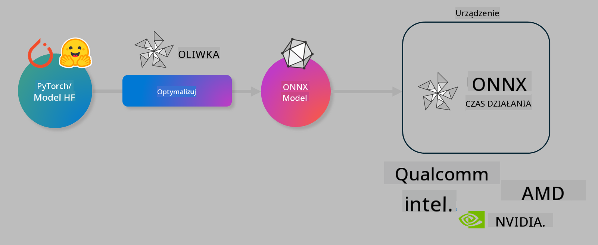

<!--
CO_OP_TRANSLATOR_METADATA:
{
  "original_hash": "6bbe47de3b974df7eea29dfeccf6032b",
  "translation_date": "2025-05-09T04:23:58+00:00",
  "source_file": "code/03.Finetuning/olive-lab/readme.md",
  "language_code": "pl"
}
-->
# Lab. Optymalizacja modeli AI do inferencji na urządzeniu

## Wprowadzenie

> [!IMPORTANT]  
> To laboratorium wymaga **karty graficznej Nvidia A10 lub A100** z zainstalowanymi odpowiednimi sterownikami i zestawem narzędzi CUDA (wersja 12+).

> [!NOTE]  
> To jest **35-minutowe** laboratorium, które pozwoli Ci praktycznie zapoznać się z podstawowymi koncepcjami optymalizacji modeli pod kątem inferencji na urządzeniu przy użyciu OLIVE.

## Cele nauki

Po zakończeniu tego laboratorium będziesz potrafił używać OLIVE do:

- Kwantyzacji modelu AI metodą kwantyzacji AWQ.  
- Dostrajenia modelu AI do konkretnego zadania.  
- Generowania adapterów LoRA (dostrojony model) dla efektywnej inferencji na urządzeniu za pomocą ONNX Runtime.

### Czym jest Olive

Olive (*O*NNX *live*) to zestaw narzędzi do optymalizacji modeli wraz z towarzyszącym CLI, który umożliwia dostarczanie modeli dla środowiska ONNX runtime +++https://onnxruntime.ai+++ z zachowaniem jakości i wydajności.



Wejściem do Olive jest zazwyczaj model PyTorch lub Hugging Face, a wyjściem jest zoptymalizowany model ONNX, który jest uruchamiany na urządzeniu (cel wdrożenia) z działającym środowiskiem ONNX runtime. Olive optymalizuje model pod kątem akceleratora AI (NPU, GPU, CPU) dostarczonego przez producenta sprzętu, takiego jak Qualcomm, AMD, Nvidia czy Intel.

Olive wykonuje *workflow*, czyli uporządkowany ciąg zadań optymalizacji modelu zwanych *passes* – przykładowe passes to: kompresja modelu, przechwytywanie grafu, kwantyzacja, optymalizacja grafu. Każdy pass ma zestaw parametrów, które można dostroić, aby osiągnąć najlepsze metryki, np. dokładność i opóźnienie, oceniane przez odpowiedni evaluator. Olive stosuje strategię poszukiwania, która wykorzystuje algorytm do automatycznego dostrajania kolejno każdego pass lub zestawu pass.

#### Zalety Olive

- **Zmniejszenie frustracji i czasu** na ręczne eksperymenty metodami prób i błędów w optymalizacji grafu, kompresji i kwantyzacji. Zdefiniuj swoje ograniczenia jakości i wydajności, a Olive automatycznie znajdzie najlepszy model dla Ciebie.  
- **Ponad 40 wbudowanych komponentów optymalizacji modeli**, obejmujących najnowsze techniki kwantyzacji, kompresji, optymalizacji grafu i dostrajania.  
- **Łatwe w użyciu CLI** do powszechnych zadań optymalizacji modeli, np. olive quantize, olive auto-opt, olive finetune.  
- Wbudowane pakowanie i wdrażanie modeli.  
- Obsługa generowania modeli dla **Multi LoRA serving**.  
- Budowanie workflow za pomocą YAML/JSON do organizacji zadań optymalizacji i wdrażania modeli.  
- Integracja z **Hugging Face** i **Azure AI**.  
- Wbudowany mechanizm **cache’owania** dla **oszczędności kosztów**.

## Instrukcje do laboratorium

> [!NOTE]  
> Upewnij się, że masz skonfigurowany Azure AI Hub i projekt oraz przygotowany obliczeniowy klaster A100 zgodnie z Lab 1.

### Krok 0: Połącz się ze swoim Azure AI Compute

Połączysz się z obliczeniami Azure AI używając funkcji zdalnego dostępu w **VS Code**.

1. Otwórz aplikację **VS Code** na komputerze.  
1. Otwórz **paletę poleceń** za pomocą **Shift+Ctrl+P**.  
1. W palecie poleceń wyszukaj **AzureML - remote: Connect to compute instance in New Window**.  
1. Postępuj zgodnie z instrukcjami wyświetlanymi na ekranie, aby połączyć się z obliczeniami. Będzie to wymagało wybrania subskrypcji Azure, grupy zasobów, projektu i nazwy klastra obliczeniowego skonfigurowanego w Lab 1.  
1. Po połączeniu z węzłem Azure ML Compute pojawi się to w **lewem dolnym rogu Visual Studio Code** `><Azure ML: Compute Name`

### Krok 1: Sklonuj repozytorium

W VS Code możesz otworzyć nowy terminal za pomocą **Ctrl+J** i sklonować to repozytorium:

W terminalu pojawi się zachęta

```
azureuser@computername:~/cloudfiles/code$ 
```  
Sklonuj rozwiązanie  

```bash
cd ~/localfiles
git clone https://github.com/microsoft/phi-3cookbook.git
```

### Krok 2: Otwórz folder w VS Code

Aby otworzyć VS Code w odpowiednim folderze, wykonaj następujące polecenie w terminalu, które otworzy nowe okno:

```bash
code phi-3cookbook/code/04.Finetuning/Olive-lab
```

Alternatywnie możesz otworzyć folder wybierając **Plik** > **Otwórz folder**.

### Krok 3: Zależności

Otwórz okno terminala w VS Code na Twoim Azure AI Compute Instance (skrót: **Ctrl+J**) i wykonaj poniższe polecenia, aby zainstalować zależności:

```bash
conda create -n olive-ai python=3.11 -y
conda activate olive-ai
pip install -r requirements.txt
az extension remove -n azure-cli-ml
az extension add -n ml
```

> [!NOTE]  
> Instalacja wszystkich zależności zajmie około 5 minut.

W tym laboratorium będziesz pobierać i przesyłać modele do katalogu modeli Azure AI. Aby mieć dostęp do katalogu modeli, musisz zalogować się do Azure używając:

```bash
az login
```

> [!NOTE]  
> Podczas logowania zostaniesz poproszony o wybranie subskrypcji. Upewnij się, że wybierasz tę przypisaną do tego laboratorium.

### Krok 4: Wykonaj polecenia Olive

Otwórz terminal w VS Code na swoim Azure AI Compute Instance (skrót: **Ctrl+J**) i upewnij się, że środowisko conda `olive-ai` jest aktywne:

```bash
conda activate olive-ai
```

Następnie wykonaj poniższe polecenia Olive w wierszu poleceń.

1. **Sprawdź dane:** W tym przykładzie będziesz dostrajać model Phi-3.5-Mini, aby był specjalistą od odpowiadania na pytania związane z podróżami. Poniższy kod wyświetla pierwsze rekordy zbioru danych w formacie JSON lines:

    ```bash
    head data/data_sample_travel.jsonl
    ```

1. **Kwantyzuj model:** Przed trenowaniem modelu najpierw wykonaj kwantyzację za pomocą polecenia używającego techniki Active Aware Quantization (AWQ) +++https://arxiv.org/abs/2306.00978+++. AWQ kwantyzuje wagi modelu biorąc pod uwagę aktywacje generowane podczas inferencji. Oznacza to, że proces kwantyzacji uwzględnia rzeczywisty rozkład danych w aktywacjach, co pozwala lepiej zachować dokładność modelu w porównaniu do tradycyjnych metod kwantyzacji wag.

    ```bash
    olive quantize \
       --model_name_or_path microsoft/Phi-3.5-mini-instruct \
       --trust_remote_code \
       --algorithm awq \
       --output_path models/phi/awq \
       --log_level 1
    ```

    Kwantyzacja AWQ zajmuje **około 8 minut** i **zmniejsza rozmiar modelu z ~7,5GB do ~2,5GB**.

    W tym laboratorium pokazujemy, jak wczytać modele z Hugging Face (np. `microsoft/Phi-3.5-mini-instruct`). However, Olive also allows you to input models from the Azure AI catalog by updating the `model_name_or_path` argument to an Azure AI asset ID (for example:  `azureml://registries/azureml/models/Phi-3.5-mini-instruct/versions/4`). 

1. **Train the model:** Next, the `olive finetune` to polecenie dostraja kwantyzowany model. Kwantyzacja modelu *przed* dostrajaniem daje lepszą dokładność, ponieważ proces dostrajania odzyskuje część utraty wynikającej z kwantyzacji.

    ```bash
    olive finetune \
        --method lora \
        --model_name_or_path models/phi/awq \
        --data_files "data/data_sample_travel.jsonl" \
        --data_name "json" \
        --text_template "<|user|>\n{prompt}<|end|>\n<|assistant|>\n{response}<|end|>" \
        --max_steps 100 \
        --output_path ./models/phi/ft \
        --log_level 1
    ```

    Dostrajanie (z 100 krokami) trwa **około 6 minut**.

1. **Optymalizuj:** Po wytrenowaniu modelu możesz go zoptymalizować używając polecenia Olive `auto-opt` command, which will capture the ONNX graph and automatically perform a number of optimizations to improve the model performance for CPU by compressing the model and doing fusions. It should be noted, that you can also optimize for other devices such as NPU or GPU by just updating the `--device` and `--provider` – w tym laboratorium użyjemy CPU.

    ```bash
    olive auto-opt \
       --model_name_or_path models/phi/ft/model \
       --adapter_path models/phi/ft/adapter \
       --device cpu \
       --provider CPUExecutionProvider \
       --use_ort_genai \
       --output_path models/phi/onnx-ao \
       --log_level 1
    ```

    Optymalizacja zajmie **około 5 minut**.

### Krok 5: Szybki test inferencji modelu

Aby przetestować inferencję modelu, utwórz w swoim folderze plik Python o nazwie **app.py** i wklej poniższy kod:

```python
import onnxruntime_genai as og
import numpy as np

print("loading model and adapters...", end="", flush=True)
model = og.Model("models/phi/onnx-ao/model")
adapters = og.Adapters(model)
adapters.load("models/phi/onnx-ao/model/adapter_weights.onnx_adapter", "travel")
print("DONE!")

tokenizer = og.Tokenizer(model)
tokenizer_stream = tokenizer.create_stream()

params = og.GeneratorParams(model)
params.set_search_options(max_length=100, past_present_share_buffer=False)
user_input = "what is the best thing to see in chicago"
params.input_ids = tokenizer.encode(f"<|user|>\n{user_input}<|end|>\n<|assistant|>\n")

generator = og.Generator(model, params)

generator.set_active_adapter(adapters, "travel")

print(f"{user_input}")

while not generator.is_done():
    generator.compute_logits()
    generator.generate_next_token()

    new_token = generator.get_next_tokens()[0]
    print(tokenizer_stream.decode(new_token), end='', flush=True)

print("\n")
```

Uruchom kod za pomocą:

```bash
python app.py
```

### Krok 6: Prześlij model do Azure AI

Przesłanie modelu do repozytorium modeli Azure AI pozwala na dzielenie się modelem z innymi członkami zespołu oraz zarządzanie wersjami modelu. Aby przesłać model, wykonaj następujące polecenie:

> [!NOTE]  
> Zaktualizuj `{}`` placeholders with the name of your resource group and Azure AI Project Name. 

To find your resource group ` z nazwą grupy zasobów i nazwą projektu Azure AI, a następnie uruchom polecenie

```
az ml workspace show
```

Możesz też przejść na +++ai.azure.com+++ i wybrać **management center** > **project** > **overview**

Zamień `{}` na nazwę swojej grupy zasobów oraz nazwę projektu Azure AI.

```bash
az ml model create \
    --name ft-for-travel \
    --version 1 \
    --path ./models/phi/onnx-ao \
    --resource-group {RESOURCE_GROUP_NAME} \
    --workspace-name {PROJECT_NAME}
```

Następnie możesz zobaczyć przesłany model i wdrożyć go na stronie https://ml.azure.com/model/list

**Zastrzeżenie**:  
Niniejszy dokument został przetłumaczony przy użyciu automatycznej usługi tłumaczeniowej AI [Co-op Translator](https://github.com/Azure/co-op-translator). Mimo że dokładamy starań, aby tłumaczenie było jak najbardziej precyzyjne, prosimy pamiętać, że tłumaczenia automatyczne mogą zawierać błędy lub niedokładności. Oryginalny dokument w języku źródłowym należy traktować jako źródło wiążące. W przypadku informacji o krytycznym znaczeniu zalecane jest skorzystanie z profesjonalnego tłumaczenia wykonanego przez człowieka. Nie ponosimy odpowiedzialności za jakiekolwiek nieporozumienia lub błędne interpretacje wynikające z korzystania z tego tłumaczenia.