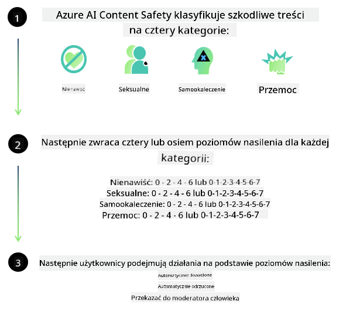

<!--
CO_OP_TRANSLATOR_METADATA:
{
  "original_hash": "839ccc4b3886ef10cfd4e64977f5792d",
  "translation_date": "2026-01-05T03:28:34+00:00",
  "source_file": "md/01.Introduction/01/01.AISafety.md",
  "language_code": "pl"
}
-->
# Bezpieczeństwo AI dla modeli Phi
Rodzina modeli Phi została opracowana zgodnie z [Standardem Odpowiedzialnej AI Microsoftu](https://www.microsoft.com/ai/principles-and-approach#responsible-ai-standard), który jest obowiązującym w całej firmie zbiorem wymagań opartym na następujących sześciu zasadach: odpowiedzialność, przejrzystość, sprawiedliwość, niezawodność i bezpieczeństwo, prywatność i ochrona oraz inkluzywność, które tworzą [zasady odpowiedzialnej AI Microsoftu](https://www.microsoft.com/ai/responsible-ai). 

Podobnie jak w przypadku wcześniejszych modeli Phi, przyjęto wieloaspektową ocenę bezpieczeństwa i podejście do post-treningowego doskonalenia bezpieczeństwa, z dodatkowymi środkami uwzględniającymi możliwości wielojęzyczne tej wersji. Nasze podejście do szkolenia i ocen bezpieczeństwa, w tym testowanie w wielu językach i kategoriach ryzyka, zostało opisane w [Artykule Phi dotyczącego post-treningowego bezpieczeństwa](https://arxiv.org/abs/2407.13833). Chociaż modele Phi korzystają z tego podejścia, deweloperzy powinni stosować najlepsze praktyki odpowiedzialnej AI, w tym mapowanie, mierzenie i łagodzenie ryzyk związanych z ich konkretnym przypadkiem użycia oraz kontekstem kulturowym i językowym.

## Najlepsze praktyki

Podobnie jak inne modele, rodzina modeli Phi może potencjalnie zachowywać się w sposób niesprawiedliwy, zawodny lub obraźliwy.

Niektóre ograniczające zachowania SLM i LLM, o których należy wiedzieć, to:

- **Jakość usług:** Modele Phi są szkolone głównie na tekście angielskim. Języki inne niż angielski osiągną gorsze wyniki; odmiany języka angielskiego o mniejszej reprezentacji w danych szkoleniowych mogą osiągać gorsze wyniki niż standardowy angielski amerykański.
- **Reprezentacja szkód i utrwalanie stereotypów:** Te modele mogą nad- lub niedoreprezentować grupy ludzi, wymazywać reprezentację niektórych grup lub wzmacniać poniżające lub negatywne stereotypy. Pomimo post-treningowego doskonalenia bezpieczeństwa, te ograniczenia mogą nadal występować ze względu na różne poziomy reprezentacji różnych grup lub rozpowszechnienie przykładów negatywnych stereotypów w danych szkoleniowych, które odzwierciedlają wzorce rzeczywiste i uprzedzenia społeczne.
- **Niewłaściwe lub obraźliwe treści:** Te modele mogą generować inne rodzaje niewłaściwych lub obraźliwych treści, co może sprawić, że ich wdrożenie w wrażliwych kontekstach będzie nieodpowiednie bez dodatkowych środków zaradczych specyficznych dla przypadku użycia.
Informacyjna wiarygodność: Modele językowe mogą generować bezsensowną treść lub fabrykować informacje, które mogą brzmieć przekonująco, ale są nieścisłe lub nieaktualne.
- **Ograniczony zakres dla kodu:** Większość danych szkoleniowych Phi-3 opiera się na Pythonie i korzysta z popularnych pakietów, takich jak "typing, math, random, collections, datetime, itertools". Jeśli model generuje skrypty Pythona wykorzystujące inne pakiety lub skrypty w innych językach, zdecydowanie zalecamy, aby użytkownicy ręcznie weryfikowali wszystkie użycia API.

Deweloperzy powinni stosować najlepsze praktyki odpowiedzialnej AI i są odpowiedzialni za zapewnienie, że konkretne użycie jest zgodne z odpowiednimi przepisami i regulacjami (np. prywatność, handel itp.). 

## Rozważania dotyczące odpowiedzialnej AI

Podobnie jak inne modele językowe, seria modeli Phi może potencjalnie zachowywać się w sposób niesprawiedliwy, zawodny lub obraźliwy. Niektóre ograniczające zachowania, o których należy pamiętać, obejmują:

**Jakość usług:** Modele Phi są szkolone głównie na tekście angielskim. Języki inne niż angielski osiągną gorsze wyniki. Odmiany języka angielskiego o mniejszej reprezentacji w danych szkoleniowych mogą osiągać gorsze wyniki niż standardowy angielski amerykański.

**Reprezentacja szkód i utrwalanie stereotypów:** Te modele mogą nad- lub niedoreprezentować grupy ludzi, wymazywać reprezentację niektórych grup lub wzmacniać poniżające lub negatywne stereotypy. Pomimo post-treningowego doskonalenia bezpieczeństwa, te ograniczenia mogą nadal występować ze względu na różne poziomy reprezentacji różnych grup lub rozpowszechnienie przykładów negatywnych stereotypów w danych szkoleniowych, które odzwierciedlają wzorce rzeczywiste i uprzedzenia społeczne.

**Niewłaściwe lub obraźliwe treści:** Te modele mogą generować inne rodzaje niewłaściwych lub obraźliwych treści, co może sprawić, że ich wdrożenie w wrażliwych kontekstach będzie nieodpowiednie bez dodatkowych środków zaradczych specyficznych dla przypadku użycia.
Informacyjna wiarygodność: Modele językowe mogą generować bezsensowną treść lub fabrykować informacje, które mogą brzmieć przekonująco, ale są nieścisłe lub nieaktualne.

**Ograniczony zakres dla kodu:** Większość danych szkoleniowych Phi-3 opiera się na Pythonie i korzysta z popularnych pakietów, takich jak "typing, math, random, collections, datetime, itertools". Jeśli model generuje skrypty Pythona wykorzystujące inne pakiety lub skrypty w innych językach, zdecydowanie zalecamy, aby użytkownicy ręcznie weryfikowali wszystkie użycia API.

Deweloperzy powinni stosować najlepsze praktyki odpowiedzialnej AI i są odpowiedzialni za zapewnienie, że konkretne użycie jest zgodne z odpowiednimi przepisami i regulacjami (np. prywatność, handel itp.). Ważne obszary do rozważenia obejmują:

**Przydział:** Modele mogą nie nadawać się do scenariuszy, które mogą mieć istotny wpływ na status prawny lub przydział zasobów bądź możliwości życiowych (np. mieszkanie, zatrudnienie, kredyt itp.) bez dalszych ocen i dodatkowych technik redukcji uprzedzeń.

**Scenariusze wysokiego ryzyka:** Deweloperzy powinni ocenić przydatność użycia modeli w scenariuszach wysokiego ryzyka, gdzie niesprawiedliwe, zawodnie lub obraźliwe wyniki mogą być niezwykle kosztowne lub prowadzić do szkód. Obejmuje to udzielanie porad w wrażliwych lub eksperckich dziedzinach, gdzie dokładność i niezawodność są krytyczne (np. porady prawne lub zdrowotne). Na poziomie aplikacji należy wdrożyć dodatkowe zabezpieczenia zgodnie z kontekstem wdrożenia.

**Dezinformacja:** Modele mogą generować nieścisłe informacje. Deweloperzy powinni stosować praktyki przejrzystości i informować użytkowników końcowych, że mają do czynienia z systemem AI. Na poziomie aplikacji deweloperzy mogą budować mechanizmy opinii i procesy łączenia odpowiedzi z kontekstowymi informacjami specyficznymi dla przypadku użycia, techniką znaną jako Retrieval Augmented Generation (RAG).

**Generowanie szkodliwych treści:** Deweloperzy powinni oceniać wyniki w kontekście ich użycia i wykorzystywać dostępne klasyfikatory bezpieczeństwa lub własne rozwiązania odpowiednie dla ich przypadku użycia.

**Nadużycie:** Inne formy nadużyć, takie jak oszustwa, spam czy tworzenie złośliwego oprogramowania, mogą być możliwe, a deweloperzy powinni upewnić się, że ich aplikacje nie naruszają obowiązujących przepisów i regulacji.

### Dostrajanie (fine-tuning) i bezpieczeństwo treści AI

Po dostrojeniu modelu zdecydowanie zalecamy wykorzystanie rozwiązań [Azure AI Content Safety](https://learn.microsoft.com/azure/ai-services/content-safety/overview) do monitorowania treści generowanych przez modele, identyfikowania i blokowania potencjalnych ryzyk, zagrożeń oraz problemów z jakością.

[Azure AI Content Safety](https://learn.microsoft.com/azure/ai-services/content-safety/overview) obsługuje zarówno treści tekstowe, jak i obrazowe. Może być wdrażana w chmurze, w odłączonych kontenerach oraz na urządzeniach brzegowych/wbudowanych.

## Przegląd usługi Azure AI Content Safety

Azure AI Content Safety nie jest rozwiązaniem uniwersalnym; można je dostosować do specyficznych zasad firm. Dodatkowo jego modele wielojęzyczne umożliwiają rozumienie wielu języków jednocześnie.

- **Azure AI Content Safety**
- **Microsoft Developer**
- **5 filmów**

Usługa Azure AI Content Safety wykrywa szkodliwe treści tworzone przez użytkowników i generowane przez AI w aplikacjach i usługach. Zawiera interfejsy API dla tekstu i obrazów, które pozwalają wykrywać materiały szkodliwe lub nieodpowiednie.

[Playlista Bezpieczeństwa treści AI](https://www.youtube.com/playlist?list=PLlrxD0HtieHjaQ9bJjyp1T7FeCbmVcPkQ)

---

<!-- CO-OP TRANSLATOR DISCLAIMER START -->
Zastrzeżenie:
Niniejszy dokument został przetłumaczony przy użyciu usługi tłumaczenia AI [Co-op Translator](https://github.com/Azure/co-op-translator). Chociaż dokładamy starań, prosimy pamiętać, że automatyczne tłumaczenia mogą zawierać błędy lub nieścisłości. Oryginalny dokument w języku źródłowym należy uznać za wersję wiążącą. W przypadku informacji o krytycznym znaczeniu zaleca się skorzystanie z profesjonalnego tłumacza. Nie ponosimy odpowiedzialności za jakiekolwiek nieporozumienia lub błędne interpretacje wynikające z korzystania z tego tłumaczenia.
<!-- CO-OP TRANSLATOR DISCLAIMER END -->