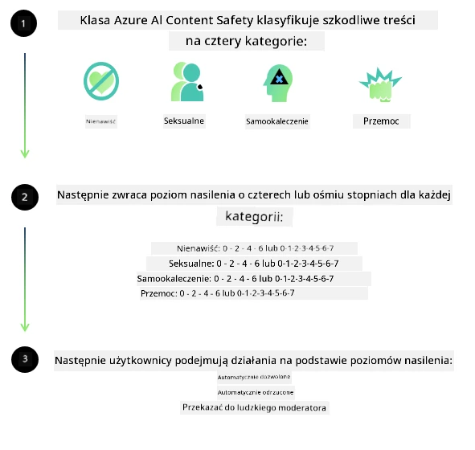
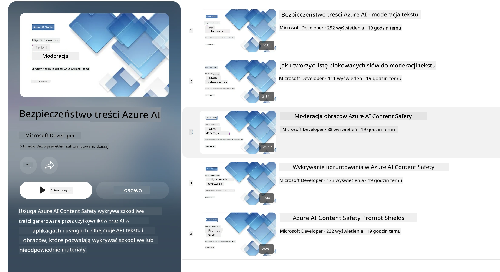

<!--
CO_OP_TRANSLATOR_METADATA:
{
  "original_hash": "839ccc4b3886ef10cfd4e64977f5792d",
  "translation_date": "2026-01-05T14:25:28+00:00",
  "source_file": "md/01.Introduction/01/01.AISafety.md",
  "language_code": "pl"
}
-->
# Bezpieczeństwo AI dla modeli Phi
Rodzina modeli Phi została opracowana zgodnie z [Microsoft Responsible AI Standard](https://www.microsoft.com/ai/principles-and-approach#responsible-ai-standard), który jest firmowym zestawem wymagań opartych na następujących sześciu zasadach: odpowiedzialność, przejrzystość, sprawiedliwość, niezawodność i bezpieczeństwo, prywatność i ochrona oraz inkluzywność, które tworzą [zasady odpowiedzialnej AI Microsoft](https://www.microsoft.com/ai/responsible-ai). 

Podobnie jak w przypadku poprzednich modeli Phi, przyjęto wieloaspektowe podejście do oceny bezpieczeństwa i szkolenia po treningu bezpieczeństwa, z dodatkowymi środkami uwzględniającymi możliwości wielojęzyczne tego wydania. Nasze podejście do szkolenia i ocen bezpieczeństwa, w tym testowanie w wielu językach i kategoriach ryzyka, jest opisane w [Phi Safety Post-Training Paper](https://arxiv.org/abs/2407.13833). Mimo że modele Phi korzystają z tego podejścia, deweloperzy powinni stosować najlepsze praktyki odpowiedzialnej AI, w tym mapowanie, pomiar i łagodzenie ryzyk związanych z ich konkretnym zastosowaniem oraz kontekstem kulturowym i językowym.

## Najlepsze praktyki

Podobnie jak inne modele, rodzina modeli Phi może potencjalnie zachowywać się w sposób niesprawiedliwy, niesolidny lub obraźliwy.

Niektóre z ograniczających zachowań SLM i LLM, o których należy wiedzieć, to:

- **Jakość usługi:** Modele Phi są szkolone głównie na angielskim tekście. Języki inne niż angielski doświadczą gorszej wydajności. Odmiany języka angielskiego, które są mniej reprezentowane w danych treningowych, mogą mieć gorsze wyniki niż standardowy angielski amerykański.
- **Reprezentacja szkód i utrwalanie stereotypów:** Modele te mogą nadmiernie lub niedostatecznie reprezentować grupy osób, wymazywać reprezentację niektórych grup lub wzmacniać poniżające czy negatywne stereotypy. Pomimo szkolenia po treningu w zakresie bezpieczeństwa, te ograniczenia mogą nadal występować ze względu na różne poziomy reprezentacji grup lub rozpowszechnienie przykładów negatywnych stereotypów w danych treningowych odzwierciedlających wzorce ze świata rzeczywistego i uprzedzenia społeczne.
- **Nieodpowiednie lub obraźliwe treści:** Modele te mogą generować inne typy nieodpowiednich lub obraźliwych treści, co może powodować, że wdrożenie ich w wrażliwych kontekstach bez dodatkowych środków zaradczych specyficznych dla przypadku użycia jest nieodpowiednie.
**Rzetelność informacji:** Modele językowe mogą generować bezsensowne treści lub fabrykować informacje, które mogą brzmieć rozsądnie, lecz są nieścisłe lub przestarzałe.
- **Ograniczony zakres dla kodu:** Większość danych treningowych Phi-3 opiera się na Pythonie i używa popularnych pakietów takich jak „typing, math, random, collections, datetime, itertools”. Jeśli model generuje skrypty Pythona korzystające z innych pakietów lub skrypty w innych językach, stanowczo zalecamy ręczną weryfikację wszystkich użyć API przez użytkowników.

Deweloperzy powinni stosować najlepsze praktyki odpowiedzialnej AI i odpowiadają za zapewnienie, że konkretny przypadek użycia jest zgodny z obowiązującymi przepisami prawa i regulacjami (np. prywatność, handel itp.).

## Rozważania dotyczące odpowiedzialnej AI

Podobnie jak inne modele językowe, modele z serii Phi mogą potencjalnie zachowywać się w sposoby niesprawiedliwe, niesolidne lub obraźliwe. Niektóre z ograniczających zachowań, na które należy zwrócić uwagę, to:

**Jakość usługi:** Modele Phi są szkolone głównie na angielskim tekście. Języki inne niż angielski doświadczą gorszej wydajności. Odmiany języka angielskiego, które są mniej reprezentowane w danych treningowych, mogą mieć gorsze wyniki niż standardowy angielski amerykański.

**Reprezentacja szkód i utrwalanie stereotypów:** Modele te mogą nadmiernie lub niedostatecznie reprezentować grupy osób, wymazywać reprezentację niektórych grup lub wzmacniać poniżające czy negatywne stereotypy. Pomimo szkolenia po treningu w zakresie bezpieczeństwa, te ograniczenia mogą nadal występować ze względu na różne poziomy reprezentacji grup lub rozpowszechnienie przykładów negatywnych stereotypów w danych treningowych odzwierciedlających wzorce ze świata rzeczywistego i uprzedzenia społeczne.

**Nieodpowiednie lub obraźliwe treści:** Modele te mogą generować inne typy nieodpowiednich lub obraźliwych treści, co może powodować, że wdrożenie ich w wrażliwych kontekstach bez dodatkowych środków zaradczych specyficznych dla przypadku użycia jest nieodpowiednie.  
**Rzetelność informacji:** Modele językowe mogą generować bezsensowne treści lub fabrykować informacje, które mogą brzmieć rozsądnie, lecz są nieścisłe lub przestarzałe.

**Ograniczony zakres dla kodu:** Większość danych treningowych Phi-3 opiera się na Pythonie i używa popularnych pakietów takich jak „typing, math, random, collections, datetime, itertools”. Jeśli model generuje skrypty Pythona korzystające z innych pakietów lub skrypty w innych językach, stanowczo zalecamy ręczną weryfikację wszystkich użyć API przez użytkowników.

Deweloperzy powinni stosować najlepsze praktyki odpowiedzialnej AI i odpowiadają za zapewnienie, że konkretny przypadek użycia jest zgodny z obowiązującymi przepisami prawa i regulacjami (np. prywatność, handel itp.). Ważne obszary do rozważenia obejmują:

**Przydział:** Modele mogą nie być odpowiednie do scenariuszy, które mogą mieć istotny wpływ na status prawny lub przydział zasobów bądź szans życiowych (np. mieszkanie, zatrudnienie, kredyt itp.) bez dalszych ocen i dodatkowych technik usuwania uprzedzeń.

**Scenariusze wysokiego ryzyka:** Deweloperzy powinni ocenić przydatność modeli w scenariuszach wysokiego ryzyka, gdzie niesprawiedliwe, niesolidne lub obraźliwe wyniki mogą być bardzo kosztowne lub prowadzić do szkody. Obejmuje to udzielanie porad w wrażliwych lub ekspertowych dziedzinach, gdzie dokładność i niezawodność są krytyczne (np. porady prawne lub zdrowotne). Dodatkowe zabezpieczenia powinny być wdrażane na poziomie aplikacji zgodnie z kontekstem wdrożenia.

**Dezinformacja:** Modele mogą generować nieścisłe informacje. Deweloperzy powinni przestrzegać najlepszych praktyk przejrzystości i informować końcowych użytkowników, że wchodzą w interakcję z systemem AI. Na poziomie aplikacji deweloperzy mogą budować mechanizmy informacji zwrotnej i łącza pozwalające opierać odpowiedzi na specyficznych dla przypadku użycia, kontekstowych informacjach, technice znanej jako Retrieval Augmented Generation (RAG).

**Generowanie szkodliwych treści:** Deweloperzy powinni oceniać wyniki w kontekście i korzystać z dostępnych klasyfikatorów bezpieczeństwa lub rozwiązań niestandardowych odpowiednich dla ich przypadku użycia.

**Niewłaściwe użycie:** Możliwe są także inne formy niewłaściwego użycia, takie jak oszustwa, spam czy produkcja złośliwego oprogramowania, a deweloperzy powinni zapewnić, że ich aplikacje nie naruszają obowiązujących przepisów prawa i regulacji.

### Dostosowywanie i bezpieczeństwo treści AI

Po dostosowaniu modelu zalecamy skorzystanie ze środków [Azure AI Content Safety](https://learn.microsoft.com/azure/ai-services/content-safety/overview), aby monitorować treści generowane przez modele, identyfikować i blokować potencjalne ryzyka, zagrożenia oraz problemy jakościowe.

[Azure AI Content Safety](https://learn.microsoft.com/azure/ai-services/content-safety/overview) obsługuje zarówno treści tekstowe, jak i obrazowe. Może być wdrażany w chmurze, w odłączonych kontenerach oraz na urządzeniach brzegowych/wbudowanych.

## Przegląd Azure AI Content Safety

Azure AI Content Safety nie jest rozwiązaniem uniwersalnym; może być dostosowane do zgodności z politykami konkretnych firm. Dodatkowo, jego wielojęzyczne modele pozwalają na rozumienie wielu języków jednocześnie.

- **Azure AI Content Safety**
- **Microsoft Developer**
- **5 filmów**

Usługa Azure AI Content Safety wykrywa szkodliwe treści generowane przez użytkowników oraz AI w aplikacjach i usługach. Obejmuje API tekstowe i obrazowe pozwalające na wykrywanie szkodliwych lub nieodpowiednich materiałów.

[AI Content Safety Playlist](https://www.youtube.com/playlist?list=PLlrxD0HtieHjaQ9bJjyp1T7FeCbmVcPkQ)

---

<!-- CO-OP TRANSLATOR DISCLAIMER START -->
**Zastrzeżenie**:
Niniejszy dokument został przetłumaczony przy użyciu usługi tłumaczenia AI [Co-op Translator](https://github.com/Azure/co-op-translator). Mimo że dążymy do dokładności, prosimy mieć na uwadze, że tłumaczenia automatyczne mogą zawierać błędy lub niedokładności. Oryginalny dokument w języku źródłowym powinien być uważany za źródło wiarygodne. W przypadku informacji krytycznych zalecane jest skorzystanie z profesjonalnego tłumaczenia wykonanego przez człowieka. Nie ponosimy odpowiedzialności za jakiekolwiek nieporozumienia lub błędne interpretacje wynikające z korzystania z tego tłumaczenia.
<!-- CO-OP TRANSLATOR DISCLAIMER END -->