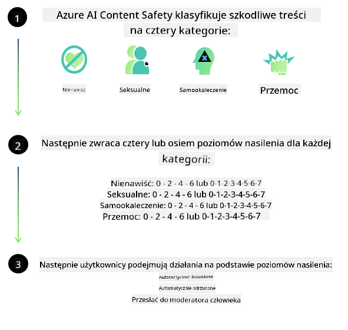
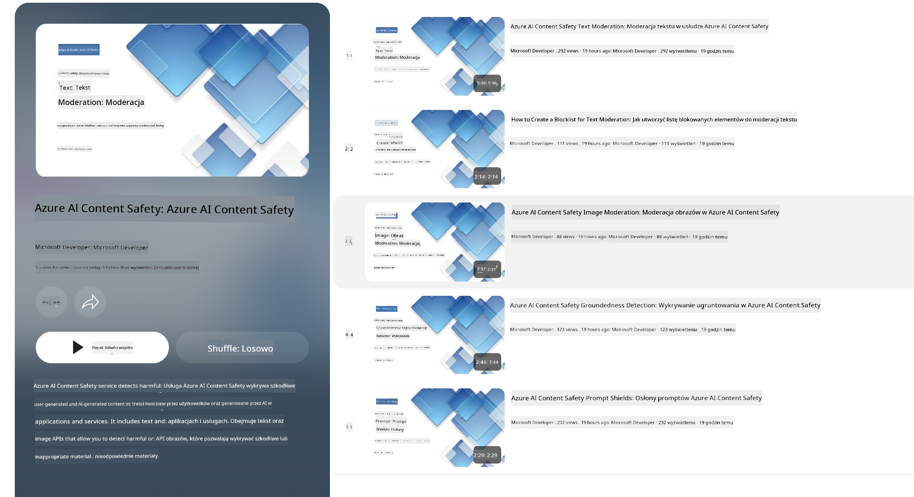

<!--
CO_OP_TRANSLATOR_METADATA:
{
  "original_hash": "c8273672cc57df2be675407a1383aaf0",
  "translation_date": "2025-05-09T05:58:31+00:00",
  "source_file": "md/01.Introduction/01/01.AISafety.md",
  "language_code": "pl"
}
-->
# Bezpieczeństwo AI dla modeli Phi  
Rodzina modeli Phi została opracowana zgodnie z [Microsoft Responsible AI Standard](https://query.prod.cms.rt.microsoft.com/cms/api/am/binary/RE5cmFl), czyli firmowym zestawem wymagań opartym na sześciu zasadach: odpowiedzialność, przejrzystość, uczciwość, niezawodność i bezpieczeństwo, prywatność i ochrona oraz inkluzywność, które tworzą [zasady odpowiedzialnej sztucznej inteligencji Microsoft](https://www.microsoft.com/ai/responsible-ai).

Podobnie jak w przypadku wcześniejszych modeli Phi, zastosowano wieloaspektową ocenę bezpieczeństwa oraz podejście do bezpieczeństwa po treningu, z dodatkowymi środkami uwzględniającymi wielojęzyczne możliwości tej wersji. Nasze podejście do treningu i oceny bezpieczeństwa, w tym testowanie w różnych językach i kategoriach ryzyka, jest opisane w [Phi Safety Post-Training Paper](https://arxiv.org/abs/2407.13833). Choć modele Phi korzystają z tego podejścia, deweloperzy powinni stosować najlepsze praktyki odpowiedzialnej AI, w tym mapowanie, mierzenie i łagodzenie ryzyk związanych z konkretnym zastosowaniem oraz kontekstem kulturowym i językowym.

## Najlepsze praktyki

Podobnie jak inne modele, rodzina modeli Phi może potencjalnie zachowywać się w sposób niesprawiedliwy, zawodny lub obraźliwy.

Niektóre ograniczenia zachowań modeli SLM i LLM, o których warto wiedzieć, to:

- **Jakość usług:** Modele Phi są trenowane głównie na tekstach anglojęzycznych. Języki inne niż angielski mogą mieć gorszą wydajność. Warianty języka angielskiego mniej reprezentowane w danych treningowych mogą działać gorzej niż standardowy angielski amerykański.  
- **Reprezentacja szkód i utrwalanie stereotypów:** Modele te mogą nad- lub niedoreprezentować grupy ludzi, wymazywać reprezentację niektórych grup lub wzmacniać poniżające lub negatywne stereotypy. Pomimo treningu po etapie bezpieczeństwa, te ograniczenia mogą nadal występować z powodu różnego poziomu reprezentacji grup lub przewagi przykładów negatywnych stereotypów w danych treningowych odzwierciedlających wzorce społeczne i uprzedzenia.  
- **Nieodpowiednie lub obraźliwe treści:** Modele mogą generować inne rodzaje nieodpowiednich lub obraźliwych treści, co może uniemożliwiać ich stosowanie w wrażliwych kontekstach bez dodatkowych środków łagodzących dostosowanych do konkretnego zastosowania.  
- **Wiarygodność informacji:** Modele językowe mogą tworzyć bezsensowne treści lub fabrykować informacje, które mogą brzmieć wiarygodnie, ale są nieścisłe lub nieaktualne.  
- **Ograniczony zakres w kontekście kodu:** Większość danych treningowych Phi-3 opiera się na Pythonie i korzysta z popularnych pakietów takich jak "typing, math, random, collections, datetime, itertools". Jeśli model generuje skrypty Pythona wykorzystujące inne pakiety lub skrypty w innych językach, zdecydowanie zalecamy ręczną weryfikację wszystkich użyć API przez użytkowników.

Deweloperzy powinni stosować najlepsze praktyki odpowiedzialnej AI i są odpowiedzialni za zapewnienie, że konkretne zastosowanie spełnia obowiązujące przepisy i regulacje (np. dotyczące prywatności, handlu itp.).

## Rozważania dotyczące odpowiedzialnej AI

Podobnie jak inne modele językowe, modele z serii Phi mogą potencjalnie zachowywać się w sposób niesprawiedliwy, zawodny lub obraźliwy. Warto znać następujące ograniczenia:

**Jakość usług:** Modele Phi są trenowane głównie na tekstach anglojęzycznych. Języki inne niż angielski będą działać gorzej. Warianty języka angielskiego mniej reprezentowane w danych treningowych mogą mieć gorszą wydajność niż standardowy angielski amerykański.

**Reprezentacja szkód i utrwalanie stereotypów:** Modele mogą nad- lub niedoreprezentować grupy ludzi, usuwać reprezentację niektórych grup lub wzmacniać poniżające lub negatywne stereotypy. Pomimo treningu po etapie bezpieczeństwa, te ograniczenia mogą występować z powodu różnego poziomu reprezentacji grup lub przewagi przykładów negatywnych stereotypów w danych treningowych odzwierciedlających wzorce społeczne i uprzedzenia.

**Nieodpowiednie lub obraźliwe treści:** Modele mogą generować inne rodzaje nieodpowiednich lub obraźliwych treści, co może uniemożliwiać ich stosowanie w wrażliwych kontekstach bez dodatkowych środków łagodzących dostosowanych do konkretnego zastosowania.  
Wiarygodność informacji: Modele językowe mogą tworzyć bezsensowne treści lub fabrykować informacje, które mogą brzmieć wiarygodnie, ale są nieścisłe lub nieaktualne.

**Ograniczony zakres w kontekście kodu:** Większość danych treningowych Phi-3 opiera się na Pythonie i korzysta z popularnych pakietów takich jak "typing, math, random, collections, datetime, itertools". Jeśli model generuje skrypty Pythona wykorzystujące inne pakiety lub skrypty w innych językach, zalecamy ręczną weryfikację wszystkich użyć API przez użytkowników.

Deweloperzy powinni stosować najlepsze praktyki odpowiedzialnej AI i są odpowiedzialni za zapewnienie zgodności konkretnego zastosowania z obowiązującymi przepisami (np. dotyczącymi prywatności, handlu itp.). Ważne obszary do rozważenia to:

**Przydział:** Modele mogą nie być odpowiednie do scenariuszy, które mogą mieć istotny wpływ na status prawny lub przydział zasobów czy szans życiowych (np. mieszkanie, zatrudnienie, kredyt itp.) bez dalszych ocen i dodatkowych technik usuwania uprzedzeń.

**Scenariusze wysokiego ryzyka:** Deweloperzy powinni ocenić przydatność modeli w scenariuszach wysokiego ryzyka, gdzie niesprawiedliwe, zawodliwe lub obraźliwe wyniki mogą być bardzo kosztowne lub prowadzić do szkód. Dotyczy to m.in. udzielania porad w wrażliwych lub eksperckich dziedzinach, gdzie dokładność i niezawodność są kluczowe (np. porady prawne lub zdrowotne). Na poziomie aplikacji należy wdrożyć dodatkowe zabezpieczenia dostosowane do kontekstu wdrożenia.

**Dezinformacja:** Modele mogą generować nieścisłe informacje. Deweloperzy powinni stosować najlepsze praktyki przejrzystości i informować użytkowników końcowych, że mają do czynienia z systemem AI. Na poziomie aplikacji można budować mechanizmy feedbacku i procesy opierające odpowiedzi na specyficznych, kontekstowych informacjach z danego zastosowania, technikę znaną jako Retrieval Augmented Generation (RAG).

**Generowanie szkodliwych treści:** Deweloperzy powinni oceniać wygenerowane treści pod kątem kontekstu i korzystać z dostępnych klasyfikatorów bezpieczeństwa lub niestandardowych rozwiązań odpowiednich dla swojego zastosowania.

**Niewłaściwe użycie:** Możliwe są inne formy nadużyć, takie jak oszustwa, spam czy tworzenie złośliwego oprogramowania. Deweloperzy powinni zadbać, by ich aplikacje nie naruszały obowiązujących przepisów i regulacji.

### Fine-tuning i bezpieczeństwo treści AI

Po dostrojeniu modelu zalecamy korzystanie z [Azure AI Content Safety](https://learn.microsoft.com/azure/ai-services/content-safety/overview) do monitorowania generowanych treści, identyfikowania i blokowania potencjalnych zagrożeń, ryzyk oraz problemów z jakością.

[Azure AI Content Safety](https://learn.microsoft.com/azure/ai-services/content-safety/overview) obsługuje zarówno treści tekstowe, jak i obrazowe. Może być wdrażany w chmurze, w odłączonych kontenerach oraz na urządzeniach brzegowych/wbudowanych.

## Przegląd Azure AI Content Safety

Azure AI Content Safety nie jest rozwiązaniem uniwersalnym; można je dostosować do specyficznych polityk biznesowych. Dodatkowo, jego wielojęzyczne modele pozwalają na jednoczesne rozumienie wielu języków.

- **Azure AI Content Safety**  
- **Microsoft Developer**  
- **5 filmów**

Usługa Azure AI Content Safety wykrywa szkodliwe treści generowane przez użytkowników oraz AI w aplikacjach i usługach. Obejmuje API tekstowe i obrazowe, które pozwalają na wykrywanie materiałów szkodliwych lub nieodpowiednich.

[AI Content Safety Playlist](https://www.youtube.com/playlist?list=PLlrxD0HtieHjaQ9bJjyp1T7FeCbmVcPkQ)

**Zastrzeżenie**:  
Niniejszy dokument został przetłumaczony za pomocą usługi tłumaczenia AI [Co-op Translator](https://github.com/Azure/co-op-translator). Mimo że dążymy do dokładności, prosimy mieć na uwadze, że automatyczne tłumaczenia mogą zawierać błędy lub niedokładności. Oryginalny dokument w jego języku źródłowym powinien być uznawany za autorytatywne źródło. W przypadku informacji krytycznych zaleca się skorzystanie z profesjonalnego tłumaczenia wykonanego przez człowieka. Nie ponosimy odpowiedzialności za jakiekolwiek nieporozumienia lub błędne interpretacje wynikające z korzystania z tego tłumaczenia.