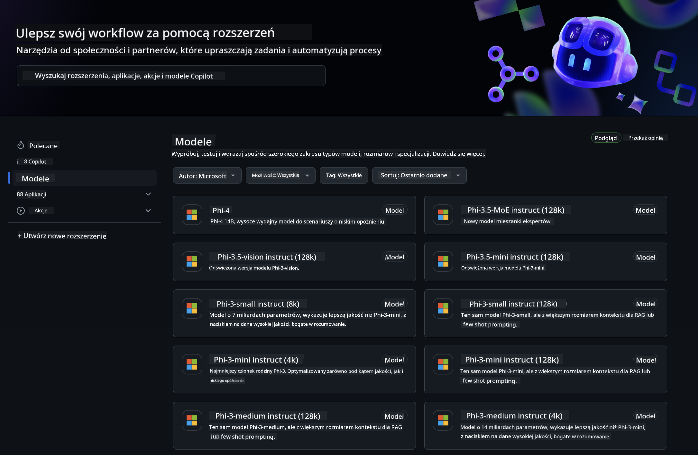

<!--
CO_OP_TRANSLATOR_METADATA:
{
  "original_hash": "fb67a08b9fc911a10ed58081fadef416",
  "translation_date": "2025-07-16T19:00:41+00:00",
  "source_file": "md/01.Introduction/02/02.GitHubModel.md",
  "language_code": "pl"
}
-->
## Rodzina Phi w GitHub Models

Witamy w [GitHub Models](https://github.com/marketplace/models)! Mamy wszystko gotowe, abyś mógł odkrywać modele AI hostowane na Azure AI.



Aby uzyskać więcej informacji o dostępnych modelach na GitHub Models, zajrzyj do [GitHub Model Marketplace](https://github.com/marketplace/models)

## Dostępne modele

Każdy model ma dedykowane środowisko testowe oraz przykładowy kod


### Rodzina Phi w katalogu modeli GitHub

- [Phi-4](https://github.com/marketplace/models/azureml/Phi-4)

- [Phi-3.5-MoE instruct (128k)](https://github.com/marketplace/models/azureml/Phi-3-5-MoE-instruct)

- [Phi-3.5-vision instruct (128k)](https://github.com/marketplace/models/azureml/Phi-3-5-vision-instruct)

- [Phi-3.5-mini instruct (128k)](https://github.com/marketplace/models/azureml/Phi-3-5-mini-instruct)

- [Phi-3-Medium-128k-Instruct](https://github.com/marketplace/models/azureml/Phi-3-medium-128k-instruct)

- [Phi-3-medium-4k-instruct](https://github.com/marketplace/models/azureml/Phi-3-medium-4k-instruct)

- [Phi-3-mini-128k-instruct](https://github.com/marketplace/models/azureml/Phi-3-mini-128k-instruct)

- [Phi-3-mini-4k-instruct](https://github.com/marketplace/models/azureml/Phi-3-mini-4k-instruct)

- [Phi-3-small-128k-instruct](https://github.com/marketplace/models/azureml/Phi-3-small-128k-instruct)

- [Phi-3-small-8k-instruct](https://github.com/marketplace/models/azureml/Phi-3-small-8k-instruct)

## Pierwsze kroki

Dostępnych jest kilka podstawowych przykładów gotowych do uruchomienia. Znajdziesz je w katalogu samples. Jeśli chcesz od razu przejść do swojego ulubionego języka, przykłady dostępne są w następujących językach:

- Python
- JavaScript
- C#
- Java
- cURL

Dostępne jest również dedykowane środowisko Codespaces do uruchamiania przykładów i modeli.


## Przykładowy kod

Poniżej znajdują się fragmenty kodu pokazujące kilka zastosowań. Aby uzyskać więcej informacji o Azure AI Inference SDK, zobacz pełną dokumentację i przykłady.

## Konfiguracja

1. Utwórz personal access token  
Nie musisz nadawać żadnych uprawnień tokenowi. Pamiętaj, że token będzie przesyłany do usługi Microsoft.

Aby użyć poniższych fragmentów kodu, utwórz zmienną środowiskową, w której ustawisz swój token jako klucz dla kodu klienta.

Jeśli używasz bash:  
```
export GITHUB_TOKEN="<your-github-token-goes-here>"
```  
Jeśli korzystasz z powershell:  

```
$Env:GITHUB_TOKEN="<your-github-token-goes-here>"
```  

Jeśli używasz Windows command prompt:  

```
set GITHUB_TOKEN=<your-github-token-goes-here>
```  

## Przykład w Pythonie

### Instalacja zależności  
Zainstaluj Azure AI Inference SDK za pomocą pip (wymaga: Python >=3.8):

```
pip install azure-ai-inference
```  
### Uruchom podstawowy przykład kodu

Ten przykład pokazuje podstawowe wywołanie API chat completion. Wykorzystuje endpoint inferencji modelu AI z GitHub oraz twój token GitHub. Wywołanie jest synchroniczne.

```python
import os
from azure.ai.inference import ChatCompletionsClient
from azure.ai.inference.models import SystemMessage, UserMessage
from azure.core.credentials import AzureKeyCredential

endpoint = "https://models.inference.ai.azure.com"
model_name = "Phi-4"
token = os.environ["GITHUB_TOKEN"]

client = ChatCompletionsClient(
    endpoint=endpoint,
    credential=AzureKeyCredential(token),
)

response = client.complete(
    messages=[
        UserMessage(content="I have $20,000 in my savings account, where I receive a 4% profit per year and payments twice a year. Can you please tell me how long it will take for me to become a millionaire? Also, can you please explain the math step by step as if you were explaining it to an uneducated person?"),
    ],
    temperature=0.4,
    top_p=1.0,
    max_tokens=2048,
    model=model_name
)

print(response.choices[0].message.content)
```

### Uruchom rozmowę wieloetapową

Ten przykład pokazuje rozmowę wieloetapową z API chat completion. Korzystając z modelu w aplikacji czatu, musisz zarządzać historią rozmowy i przesyłać do modelu najnowsze wiadomości.

```
import os
from azure.ai.inference import ChatCompletionsClient
from azure.ai.inference.models import AssistantMessage, SystemMessage, UserMessage
from azure.core.credentials import AzureKeyCredential

token = os.environ["GITHUB_TOKEN"]
endpoint = "https://models.inference.ai.azure.com"
# Replace Model_Name
model_name = "Phi-4"

client = ChatCompletionsClient(
    endpoint=endpoint,
    credential=AzureKeyCredential(token),
)

messages = [
    SystemMessage(content="You are a helpful assistant."),
    UserMessage(content="What is the capital of France?"),
    AssistantMessage(content="The capital of France is Paris."),
    UserMessage(content="What about Spain?"),
]

response = client.complete(messages=messages, model=model_name)

print(response.choices[0].message.content)
```

### Strumieniowanie odpowiedzi

Dla lepszego doświadczenia użytkownika warto strumieniować odpowiedź modelu, aby pierwszy token pojawił się szybko i uniknąć długiego oczekiwania na pełną odpowiedź.

```
import os
from azure.ai.inference import ChatCompletionsClient
from azure.ai.inference.models import SystemMessage, UserMessage
from azure.core.credentials import AzureKeyCredential

token = os.environ["GITHUB_TOKEN"]
endpoint = "https://models.inference.ai.azure.com"
# Replace Model_Name
model_name = "Phi-4"

client = ChatCompletionsClient(
    endpoint=endpoint,
    credential=AzureKeyCredential(token),
)

response = client.complete(
    stream=True,
    messages=[
        SystemMessage(content="You are a helpful assistant."),
        UserMessage(content="Give me 5 good reasons why I should exercise every day."),
    ],
    model=model_name,
)

for update in response:
    if update.choices:
        print(update.choices[0].delta.content or "", end="")

client.close()
```

## Darmowe użycie i limity dla GitHub Models


[Limity dla środowiska testowego i darmowego API](https://docs.github.com/en/github-models/prototyping-with-ai-models#rate-limits) mają na celu umożliwić eksperymentowanie z modelami i prototypowanie aplikacji AI. Aby korzystać z modeli poza tymi limitami i skalować swoją aplikację, musisz przydzielić zasoby z konta Azure i uwierzytelnić się tam zamiast używać personal access token GitHub. Nie musisz zmieniać niczego w swoim kodzie. Skorzystaj z tego linku, aby dowiedzieć się, jak przekroczyć limity darmowego poziomu w Azure AI.

### Informacje dodatkowe

Pamiętaj, że podczas interakcji z modelem eksperymentujesz z AI, więc mogą pojawić się błędy w treści.

Funkcja podlega różnym ograniczeniom (w tym liczbie zapytań na minutę, na dzień, tokenów na zapytanie oraz jednoczesnych zapytań) i nie jest przeznaczona do zastosowań produkcyjnych.

GitHub Models korzysta z Azure AI Content Safety. Te filtry nie mogą być wyłączone w ramach doświadczenia GitHub Models. Jeśli zdecydujesz się korzystać z modeli przez płatną usługę, skonfiguruj filtry treści zgodnie z własnymi wymaganiami.

Ta usługa jest objęta warunkami wstępnej wersji GitHub.

**Zastrzeżenie**:  
Niniejszy dokument został przetłumaczony za pomocą usługi tłumaczenia AI [Co-op Translator](https://github.com/Azure/co-op-translator). Mimo że dążymy do jak największej dokładności, prosimy mieć na uwadze, że tłumaczenia automatyczne mogą zawierać błędy lub nieścisłości. Oryginalny dokument w języku źródłowym powinien być uznawany za źródło autorytatywne. W przypadku informacji o kluczowym znaczeniu zalecane jest skorzystanie z profesjonalnego tłumaczenia wykonanego przez człowieka. Nie ponosimy odpowiedzialności za jakiekolwiek nieporozumienia lub błędne interpretacje wynikające z korzystania z tego tłumaczenia.