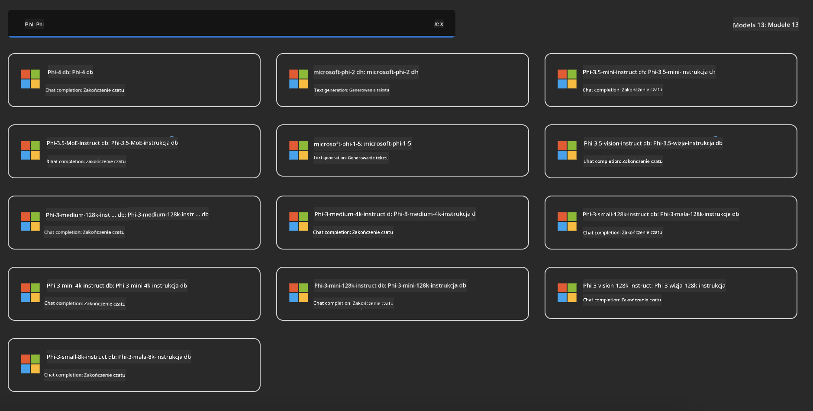
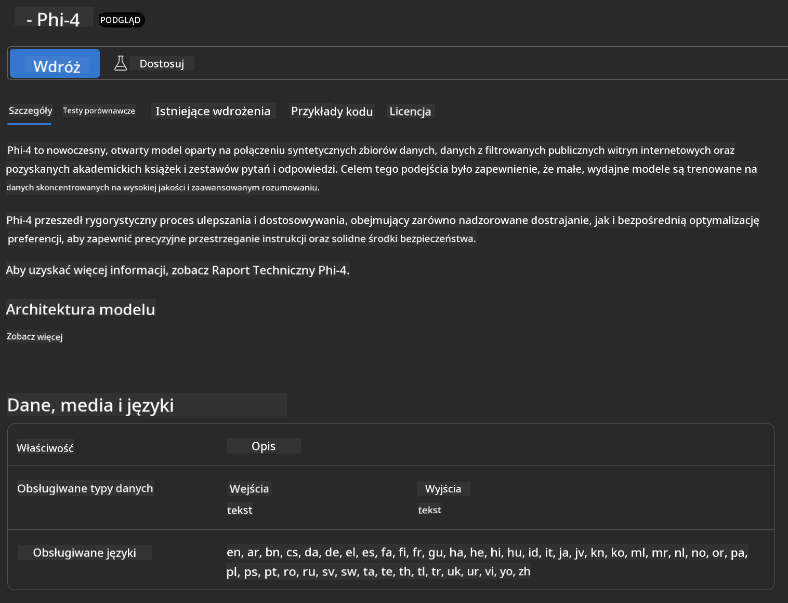
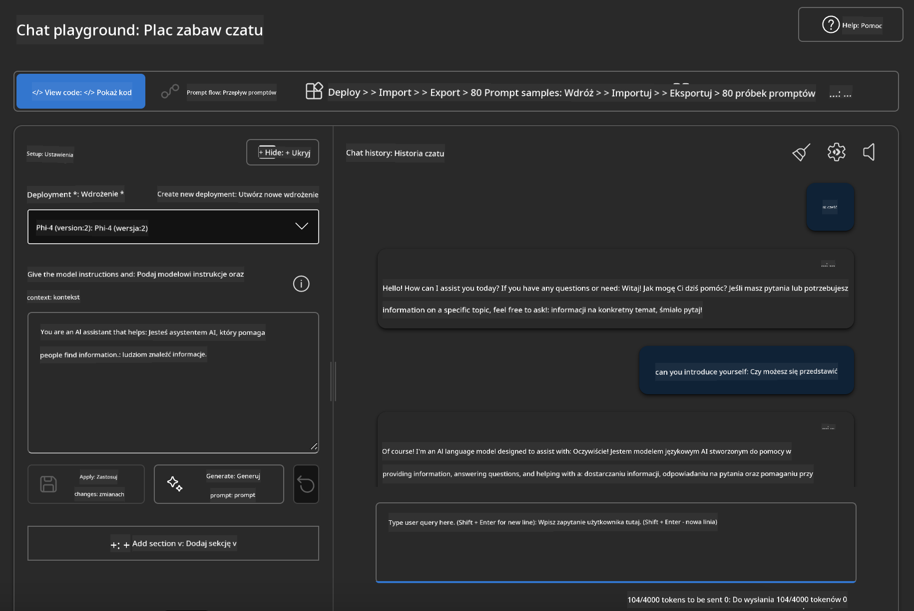

<!--
CO_OP_TRANSLATOR_METADATA:
{
  "original_hash": "3ae21dc5554e888defbe57946ee995ee",
  "translation_date": "2025-05-09T09:04:19+00:00",
  "source_file": "md/01.Introduction/02/03.AzureAIFoundry.md",
  "language_code": "pl"
}
-->
## Rodzina Phi w Azure AI Foundry

[Azure AI Foundry](https://ai.azure.com) to zaufana platforma, która umożliwia deweloperom wprowadzanie innowacji i kształtowanie przyszłości z AI w bezpieczny, pewny i odpowiedzialny sposób.

[Azure AI Foundry](https://ai.azure.com) została zaprojektowana dla deweloperów, aby:

- Tworzyć aplikacje generatywnej AI na platformie klasy korporacyjnej.
- Eksplorować, budować, testować i wdrażać, korzystając z nowoczesnych narzędzi AI i modeli ML, opartych na odpowiedzialnych praktykach AI.
- Współpracować z zespołem przez cały cykl życia tworzenia aplikacji.

Dzięki Azure AI Foundry możesz odkrywać szeroką gamę modeli, usług i funkcji oraz tworzyć aplikacje AI, które najlepiej odpowiadają Twoim celom. Platforma Azure AI Foundry ułatwia skalowanie, pozwalając łatwo przekształcać prototypy w pełnoprawne aplikacje produkcyjne. Ciągły monitoring i doskonalenie wspierają długoterminowy sukces.


Oprócz korzystania z Azure AOAI Service w Azure AI Foundry, możesz także używać modeli firm trzecich z Model Catalog w Azure AI Foundry. To dobre rozwiązanie, jeśli chcesz używać Azure AI Foundry jako swojej platformy AI.

Możemy szybko wdrażać modele Rodziny Phi za pomocą Model Catalog w Azure AI Foundry

[Microsoft Phi Models in Azure AI Foundry Models](https://ai.azure.com/explore/models/?selectedCollection=phi)



### **Wdrażanie Phi-4 w Azure AI Foundry**



### **Testowanie Phi-4 w Azure AI Foundry Playground**



### **Uruchamianie kodu Python wywołującego Azure AI Foundry Phi-4**

```python

import os  
import base64
from openai import AzureOpenAI  
from azure.identity import DefaultAzureCredential, get_bearer_token_provider  
        
endpoint = os.getenv("ENDPOINT_URL", "Your Azure AOAI Service Endpoint")  
deployment = os.getenv("DEPLOYMENT_NAME", "Phi-4")  
      
token_provider = get_bearer_token_provider(  
    DefaultAzureCredential(),  
    "https://cognitiveservices.azure.com/.default"  
)  
  
client = AzureOpenAI(  
    azure_endpoint=endpoint,  
    azure_ad_token_provider=token_provider,  
    api_version="2024-05-01-preview",  
)  
  

chat_prompt = [
    {
        "role": "system",
        "content": "You are an AI assistant that helps people find information."
    },
    {
        "role": "user",
        "content": "can you introduce yourself"
    }
] 
    
# Include speech result if speech is enabled  
messages = chat_prompt 

completion = client.chat.completions.create(  
    model=deployment,  
    messages=messages,
    max_tokens=800,  
    temperature=0.7,  
    top_p=0.95,  
    frequency_penalty=0,  
    presence_penalty=0,
    stop=None,  
    stream=False  
)  
  
print(completion.to_json())  

```

**Zastrzeżenie**:  
Niniejszy dokument został przetłumaczony przy użyciu automatycznej usługi tłumaczeniowej AI [Co-op Translator](https://github.com/Azure/co-op-translator). Mimo że dokładamy starań, aby tłumaczenie było jak najdokładniejsze, prosimy pamiętać, że tłumaczenia automatyczne mogą zawierać błędy lub niedokładności. Oryginalny dokument w języku źródłowym powinien być uznawany za wiarygodne źródło. W przypadku informacji o krytycznym znaczeniu zalecane jest skorzystanie z profesjonalnego tłumaczenia wykonanego przez człowieka. Nie ponosimy odpowiedzialności za jakiekolwiek nieporozumienia lub błędne interpretacje wynikające z użycia tego tłumaczenia.