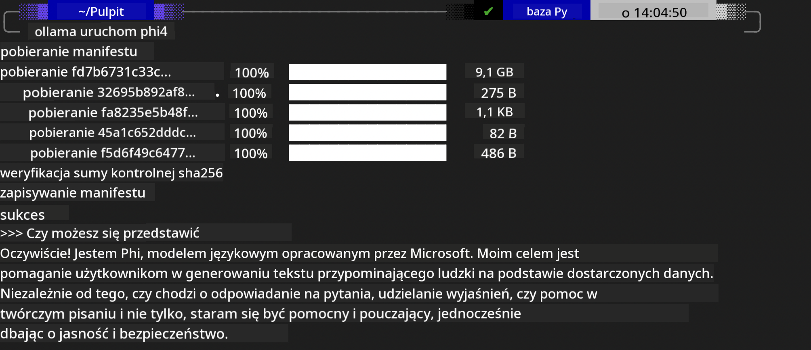
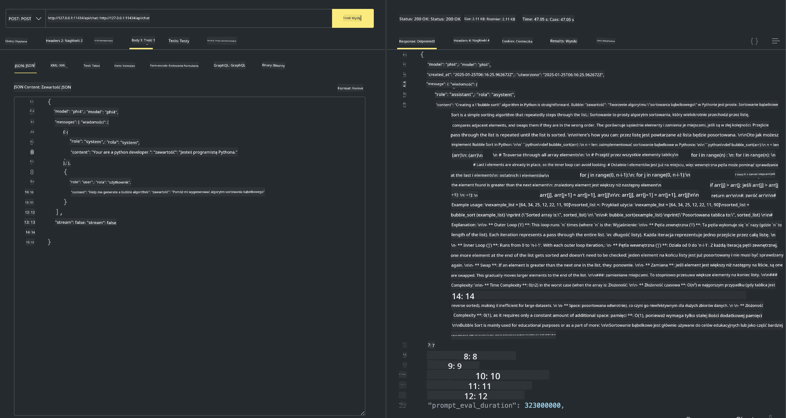

<!--
CO_OP_TRANSLATOR_METADATA:
{
  "original_hash": "0b38834693bb497f96bf53f0d941f9a1",
  "translation_date": "2025-07-16T19:15:44+00:00",
  "source_file": "md/01.Introduction/02/04.Ollama.md",
  "language_code": "pl"
}
-->
## Rodzina Phi w Ollama


[Ollama](https://ollama.com) umożliwia większej liczbie osób bezpośrednie uruchamianie otwartych modeli LLM lub SLM za pomocą prostych skryptów, a także pozwala tworzyć API wspierające lokalne scenariusze aplikacji Copilot.

## **1. Instalacja**

Ollama działa na Windows, macOS i Linux. Możesz zainstalować Ollama, korzystając z tego linku ([https://ollama.com/download](https://ollama.com/download)). Po pomyślnej instalacji możesz bezpośrednio używać skryptu Ollama, aby wywołać Phi-3 przez okno terminala. Możesz zobaczyć wszystkie [dostępne biblioteki w Ollama](https://ollama.com/library). Jeśli otworzysz to repozytorium w Codespace, Ollama będzie już zainstalowana.

```bash

ollama run phi4

```

> [!NOTE]
> Model zostanie pobrany przy pierwszym uruchomieniu. Oczywiście możesz też od razu wskazać wcześniej pobrany model Phi-4. Jako przykład używamy WSL do wykonania polecenia. Po pomyślnym pobraniu modelu możesz od razu prowadzić interakcję w terminalu.



## **2. Wywołanie API phi-4 z Ollama**

Jeśli chcesz wywołać API Phi-4 wygenerowane przez Ollama, możesz użyć tego polecenia w terminalu, aby uruchomić serwer Ollama.

```bash

ollama serve

```

> [!NOTE]
> Jeśli korzystasz z macOS lub Linux, może pojawić się następujący błąd **"Error: listen tcp 127.0.0.1:11434: bind: address already in use"**. Ten błąd może wystąpić podczas uruchamiania polecenia. Możesz go zignorować, ponieważ zwykle oznacza, że serwer już działa, lub możesz zatrzymać i ponownie uruchomić Ollama:

**macOS**

```bash

brew services restart ollama

```

**Linux**

```bash

sudo systemctl stop ollama

```

Ollama obsługuje dwa API: generate i chat. Możesz wywoływać API modelu udostępniane przez Ollama zgodnie z potrzebami, wysyłając zapytania do lokalnej usługi działającej na porcie 11434.

**Chat**

```bash

curl http://127.0.0.1:11434/api/chat -d '{
  "model": "phi3",
  "messages": [
    {
      "role": "system",
      "content": "Your are a python developer."
    },
    {
      "role": "user",
      "content": "Help me generate a bubble algorithm"
    }
  ],
  "stream": false
  
}'

This is the result in Postman



## Additional Resources

Check the list of available models in Ollama in [their library](https://ollama.com/library).

Pull your model from the Ollama server using this command

```bash
ollama pull phi4
```

Run the model using this command

```bash
ollama run phi4
```

***Note:*** Visit this link [https://github.com/ollama/ollama/blob/main/docs/api.md](https://github.com/ollama/ollama/blob/main/docs/api.md) to learn more

## Calling Ollama from Python

You can use `requests` or `urllib3` to make requests to the local server endpoints used above. However, a popular way to use Ollama in Python is via the [openai](https://pypi.org/project/openai/) SDK, since Ollama provides OpenAI-compatible server endpoints as well.

Here is an example for phi3-mini:

```python
import openai

client = openai.OpenAI(
    base_url="http://localhost:11434/v1",
    api_key="nokeyneeded",
)

response = client.chat.completions.create(
    model="phi4",
    temperature=0.7,
    n=1,
    messages=[
        {"role": "system", "content": "Jesteś pomocnym asystentem."},
        {"role": "user", "content": "Napisz haiku o głodnym kocie"},
    ],
)

print("Odpowiedź:")
print(response.choices[0].message.content)
```

## Calling Ollama from JavaScript 

```javascript
// Przykład podsumowania pliku za pomocą Phi-4
script({
    model: "ollama:phi4",
    title: "Podsumowanie z Phi-4",
    system: ["system"],
})

// Przykład podsumowania
const file = def("FILE", env.files)
$`Podsumuj ${file} w jednym akapicie.`
```

## Calling Ollama from C#

Create a new C# Console application and add the following NuGet package:

```bash
dotnet add package Microsoft.SemanticKernel --version 1.34.0
```

Then replace this code in the `Program.cs` file

```csharp
using Microsoft.SemanticKernel;
using Microsoft.SemanticKernel.ChatCompletion;

// dodaj usługę chat completion korzystając z lokalnego endpointu Ollama
#pragma warning disable SKEXP0001, SKEXP0003, SKEXP0010, SKEXP0011, SKEXP0050, SKEXP0052
builder.AddOpenAIChatCompletion(
    modelId: "phi4",
    endpoint: new Uri("http://localhost:11434/"),
    apiKey: "non required");

// wywołaj proste zapytanie do usługi chat
string prompt = "Napisz dowcip o kociakach";
var response = await kernel.InvokePromptAsync(prompt);
Console.WriteLine(response.GetValue<string>());
```

Run the app with the command:

```bash
dotnet run


**Zastrzeżenie**:  
Niniejszy dokument został przetłumaczony za pomocą usługi tłumaczenia AI [Co-op Translator](https://github.com/Azure/co-op-translator). Mimo że dążymy do dokładności, prosimy mieć na uwadze, że automatyczne tłumaczenia mogą zawierać błędy lub nieścisłości. Oryginalny dokument w języku źródłowym powinien być uznawany za źródło autorytatywne. W przypadku informacji o kluczowym znaczeniu zalecane jest skorzystanie z profesjonalnego tłumaczenia wykonanego przez człowieka. Nie ponosimy odpowiedzialności za jakiekolwiek nieporozumienia lub błędne interpretacje wynikające z korzystania z tego tłumaczenia.