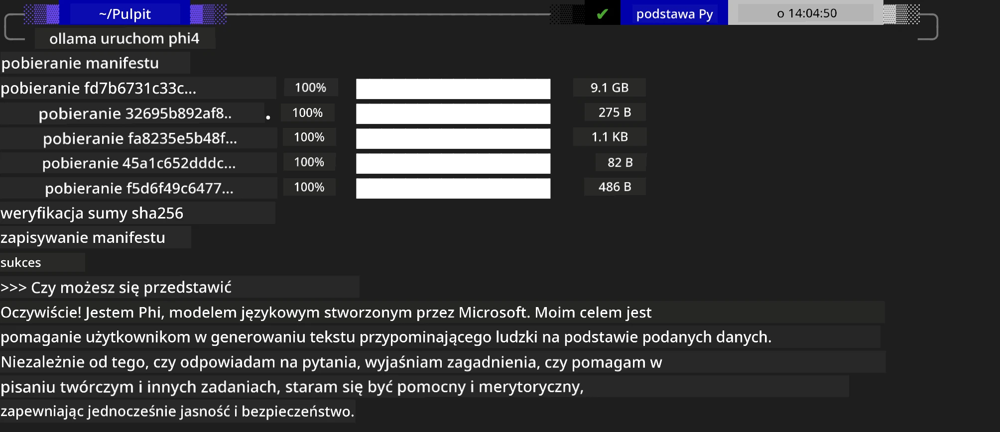
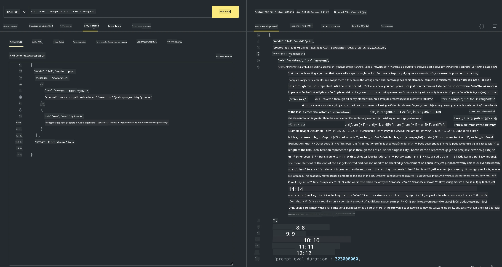

## Rodzina Phi w Ollama


[Ollama](https://ollama.com) pozwala większej liczbie osób bezpośrednio wdrażać otwarte modele LLM lub SLM za pomocą prostych skryptów, a także może budować interfejsy API wspierające lokalne scenariusze aplikacji Copilot.

## **1. Instalacja**

Ollama obsługuje uruchamianie na Windows, macOS i Linux. Możesz zainstalować Ollama przez ten link ([https://ollama.com/download](https://ollama.com/download)). Po pomyślnej instalacji możesz bezpośrednio użyć skryptu Ollama, aby wywołać Phi-3 z poziomu okna terminala. Możesz zobaczyć wszystkie [dostępne biblioteki w Ollama](https://ollama.com/library). Jeśli otworzysz to repozytorium w Codespace, Ollama będzie już zainstalowane.

```bash

ollama run phi4

```

> [!NOTE]
> Model zostanie najpierw pobrany przy pierwszym uruchomieniu. Oczywiście możesz też bezpośrednio wskazać wcześniej pobrany model Phi-4. Jako przykład używamy WSL do uruchomienia polecenia. Po pomyślnym pobraniu modelu możesz bezpośrednio wchodzić w interakcję w terminalu.



## **2. Wywoływanie API phi-4 z Ollama**

Jeśli chcesz wywołać API Phi-4 wygenerowane przez Ollama, możesz użyć tego polecenia w terminalu, aby uruchomić serwer Ollama.

```bash

ollama serve

```

> [!NOTE]
> Jeśli uruchamiasz na macOS lub Linux, zwróć uwagę, że możesz napotkać następujący błąd **"Error: listen tcp 127.0.0.1:11434: bind: address already in use"**. Możesz otrzymać ten błąd podczas uruchamiania polecenia. Możesz go zignorować, ponieważ zazwyczaj oznacza to, że serwer już działa, lub możesz zatrzymać i ponownie uruchomić Ollama:

**macOS**

```bash

brew services restart ollama

```

**Linux**

```bash

sudo systemctl stop ollama

```

Ollama obsługuje dwa API: generate i chat. Możesz wywołać API modelu dostarczone przez Ollama zgodnie ze swoimi potrzebami, wysyłając żądania do lokalnej usługi działającej na porcie 11434.

**Czat**

```bash

curl http://127.0.0.1:11434/api/chat -d '{
  "model": "phi3",
  "messages": [
    {
      "role": "system",
      "content": "Your are a python developer."
    },
    {
      "role": "user",
      "content": "Help me generate a bubble algorithm"
    }
  ],
  "stream": false
  
}'
```

Oto wynik w Postmanie



## Dodatkowe zasoby

Sprawdź listę dostępnych modeli w Ollama w [ich bibliotece](https://ollama.com/library).

Pobierz swój model z serwera Ollama, używając tego polecenia

```bash
ollama pull phi4
```

Uruchom model, używając tego polecenia

```bash
ollama run phi4
```

***Uwaga:*** Odwiedź ten link [https://github.com/ollama/ollama/blob/main/docs/api.md](https://github.com/ollama/ollama/blob/main/docs/api.md), aby dowiedzieć się więcej

## Wywoływanie Ollama z Pythona

Możesz użyć `requests` lub `urllib3` do wykonywania żądań do lokalnych punktów końcowych serwera używanych powyżej. Popularnym sposobem użycia Ollama w Pythonie jest jednak SDK [openai](https://pypi.org/project/openai/), ponieważ Ollama udostępnia również zgodne z OpenAI punkty końcowe serwera.

Oto przykład dla phi3-mini:

```python
import openai

client = openai.OpenAI(
    base_url="http://localhost:11434/v1",
    api_key="nokeyneeded",
)

response = client.chat.completions.create(
    model="phi4",
    temperature=0.7,
    n=1,
    messages=[
        {"role": "system", "content": "You are a helpful assistant."},
        {"role": "user", "content": "Write a haiku about a hungry cat"},
    ],
)

print("Response:")
print(response.choices[0].message.content)
```

## Wywoływanie Ollama z JavaScript

```javascript
// Przykład streszczenia pliku za pomocą Phi-4
script({
    model: "ollama:phi4",
    title: "Summarize with Phi-4",
    system: ["system"],
})

// Przykład streszczenia
const file = def("FILE", env.files)
$`Summarize ${file} in a single paragraph.`
```

## Wywoływanie Ollama z C#

Utwórz nową aplikację konsolową C# i dodaj następującą paczkę NuGet:

```bash
dotnet add package Microsoft.SemanticKernel --version 1.34.0
```

Następnie zastąp ten kod w pliku `Program.cs`

```csharp
using Microsoft.SemanticKernel;
using Microsoft.SemanticKernel.ChatCompletion;

// add chat completion service using the local ollama server endpoint
#pragma warning disable SKEXP0001, SKEXP0003, SKEXP0010, SKEXP0011, SKEXP0050, SKEXP0052
builder.AddOpenAIChatCompletion(
    modelId: "phi4",
    endpoint: new Uri("http://localhost:11434/"),
    apiKey: "non required");

// invoke a simple prompt to the chat service
string prompt = "Write a joke about kittens";
var response = await kernel.InvokePromptAsync(prompt);
Console.WriteLine(response.GetValue<string>());
```

Uruchom aplikację poleceniem:

```bash
dotnet run
```

---

<!-- CO-OP TRANSLATOR DISCLAIMER START -->
**Zastrzeżenie**:
Niniejszy dokument został przetłumaczony przy użyciu usługi tłumaczenia AI [Co-op Translator](https://github.com/Azure/co-op-translator). Choć dokładamy starań, aby tłumaczenia były poprawne, prosimy pamiętać, że tłumaczenia automatyczne mogą zawierać błędy lub niedokładności. Oryginalny dokument w języku źródłowym należy uznać za wersję wiążącą. W przypadku informacji istotnych zaleca się skorzystanie z profesjonalnego tłumaczenia wykonanego przez tłumacza. Nie ponosimy odpowiedzialności za jakiekolwiek nieporozumienia lub błędne interpretacje wynikające z użycia tego tłumaczenia.
<!-- CO-OP TRANSLATOR DISCLAIMER END -->