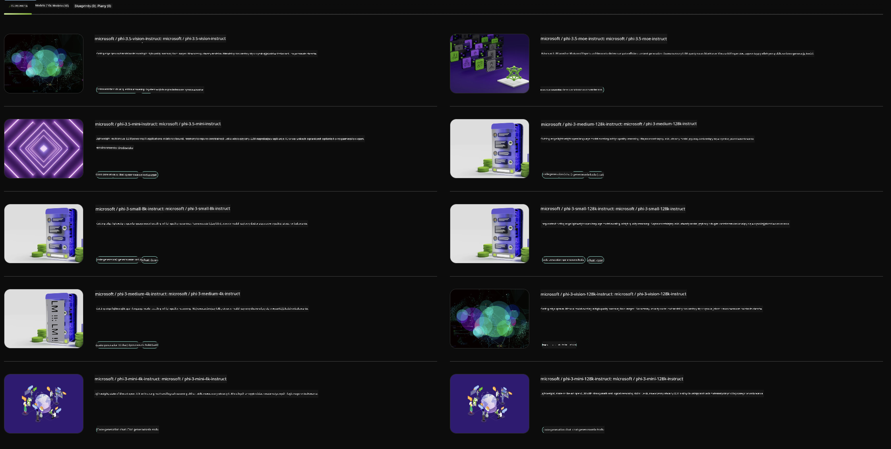

<!--
CO_OP_TRANSLATOR_METADATA:
{
  "original_hash": "7b08e277df2a9307f861ae54bc30c772",
  "translation_date": "2025-05-09T09:52:48+00:00",
  "source_file": "md/01.Introduction/02/06.NVIDIA.md",
  "language_code": "pl"
}
-->
## Rodzina Phi w NVIDIA NIM

NVIDIA NIM to zestaw łatwych w użyciu mikroserwisów zaprojektowanych do przyspieszenia wdrażania modeli generatywnej AI w chmurze, centrach danych i na stacjach roboczych. NIM są kategoryzowane według rodziny modeli oraz na poziomie pojedynczych modeli. Na przykład NVIDIA NIM dla dużych modeli językowych (LLM) wnosi moc najnowocześniejszych LLM do aplikacji korporacyjnych, oferując niezrównane możliwości przetwarzania i rozumienia języka naturalnego.

NIM ułatwia zespołom IT i DevOps samodzielne hostowanie dużych modeli językowych (LLM) we własnych zarządzanych środowiskach, jednocześnie zapewniając deweloperom standardowe API branżowe, które pozwalają tworzyć potężne kopiloty, chatboty i asystentów AI, mogące zrewolucjonizować ich biznes. Wykorzystując najnowocześniejszą akcelerację GPU NVIDIA oraz skalowalne wdrażanie, NIM oferuje najszybszą ścieżkę do inferencji z niezrównaną wydajnością.

Możesz użyć NVIDIA NIM do inferencji modeli z rodziny Phi



### **Przykłady - Phi-3-Vision w NVIDIA NIM**

Wyobraź sobie, że masz obraz (`demo.png`) i chcesz wygenerować kod w Pythonie, który przetworzy ten obraz i zapisze jego nową wersję (`phi-3-vision.jpg`).

Powyższy kod automatyzuje ten proces poprzez:

1. Konfigurację środowiska i niezbędnych ustawień.
2. Stworzenie promptu, który instruuje model do wygenerowania wymaganego kodu Pythona.
3. Wysłanie promptu do modelu i zebranie wygenerowanego kodu.
4. Wyodrębnienie i uruchomienie wygenerowanego kodu.
5. Wyświetlenie oryginalnych i przetworzonych obrazów.

To podejście wykorzystuje moc AI do automatyzacji zadań związanych z przetwarzaniem obrazów, co ułatwia i przyspiesza osiągnięcie zamierzonych celów.

[Przykładowe rozwiązanie kodu](../../../../../code/06.E2E/E2E_Nvidia_NIM_Phi3_Vision.ipynb)

Rozłóżmy działanie całego kodu krok po kroku:

1. **Instalacja wymaganego pakietu**:
    ```python
    !pip install langchain_nvidia_ai_endpoints -U
    ```
    To polecenie instaluje pakiet `langchain_nvidia_ai_endpoints`, zapewniając, że jest to jego najnowsza wersja.

2. **Importowanie niezbędnych modułów**:
    ```python
    from langchain_nvidia_ai_endpoints import ChatNVIDIA
    import getpass
    import os
    import base64
    ```
    Te importy wprowadzają potrzebne moduły do interakcji z NVIDIA AI endpoints, bezpiecznego obsługiwania haseł, pracy z systemem operacyjnym oraz kodowania/odkodowywania danych w formacie base64.

3. **Ustawienie klucza API**:
    ```python
    if not os.getenv("NVIDIA_API_KEY"):
        os.environ["NVIDIA_API_KEY"] = getpass.getpass("Enter your NVIDIA API key: ")
    ```
    Ten fragment sprawdza, czy zmienna środowiskowa `NVIDIA_API_KEY` jest ustawiona. Jeśli nie, prosi użytkownika o bezpieczne wprowadzenie klucza API.

4. **Definicja modelu i ścieżki do obrazu**:
    ```python
    model = 'microsoft/phi-3-vision-128k-instruct'
    chat = ChatNVIDIA(model=model)
    img_path = './imgs/demo.png'
    ```
    Tutaj ustawia się model do użycia, tworzy instancję `ChatNVIDIA` z określonym modelem oraz definiuje ścieżkę do pliku obrazu.

5. **Tworzenie tekstowego promptu**:
    ```python
    text = "Please create Python code for image, and use plt to save the new picture under imgs/ and name it phi-3-vision.jpg."
    ```
    Definiuje prompt tekstowy, który instruuje model do wygenerowania kodu Pythona do przetwarzania obrazu.

6. **Kodowanie obrazu w base64**:
    ```python
    with open(img_path, "rb") as f:
        image_b64 = base64.b64encode(f.read()).decode()
    image = f''
    ```
    Ten fragment czyta plik obrazu, koduje go w base64 i tworzy tag HTML obrazu z zakodowanymi danymi.

7. **Łączenie tekstu i obrazu w prompt**:
    ```python
    prompt = f"{text} {image}"
    ```
    Łączy tekstowy prompt i tag HTML obrazu w jeden ciąg znaków.

8. **Generowanie kodu przy użyciu ChatNVIDIA**:
    ```python
    code = ""
    for chunk in chat.stream(prompt):
        print(chunk.content, end="")
        code += chunk.content
    ```
    Ten fragment wysyła prompt do `ChatNVIDIA` model and collects the generated code in chunks, printing and appending each chunk to the `code` string.

9. **Wyodrębnienie kodu Pythona z wygenerowanej treści**:
    ```python
    begin = code.index('```python') + 9
    code = code[begin:]
    end = code.index('```')
    code = code[:end]
    ```
    Ten krok wyciąga właściwy kod Pythona z wygenerowanej treści, usuwając formatowanie markdown.

10. **Uruchomienie wygenerowanego kodu**:
    ```python
    import subprocess
    result = subprocess.run(["python", "-c", code], capture_output=True)
    ```
    Ten fragment uruchamia wyodrębniony kod Pythona jako podproces i przechwytuje jego wynik.

11. **Wyświetlanie obrazów**:
    ```python
    from IPython.display import Image, display
    display(Image(filename='./imgs/phi-3-vision.jpg'))
    display(Image(filename='./imgs/demo.png'))
    ```
    Te linie wyświetlają obrazy przy użyciu modułu `IPython.display`.

**Zastrzeżenie**:  
Niniejszy dokument został przetłumaczony za pomocą usługi tłumaczeń AI [Co-op Translator](https://github.com/Azure/co-op-translator). Mimo że dążymy do jak największej dokładności, prosimy pamiętać, że tłumaczenia automatyczne mogą zawierać błędy lub nieścisłości. Oryginalny dokument w języku źródłowym należy uważać za źródło wiarygodne. W przypadku informacji o kluczowym znaczeniu zalecane jest skorzystanie z profesjonalnego tłumaczenia wykonanego przez człowieka. Nie ponosimy odpowiedzialności za jakiekolwiek nieporozumienia lub błędne interpretacje wynikające z użycia tego tłumaczenia.