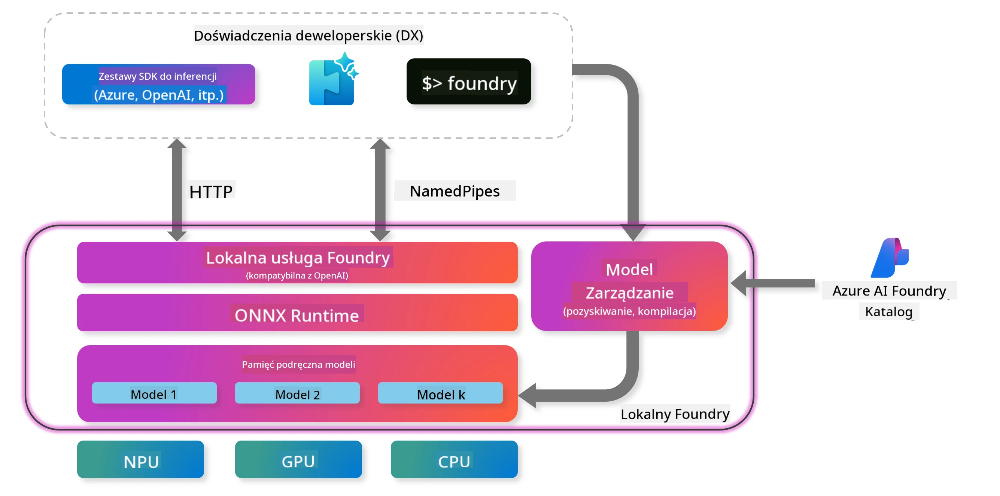
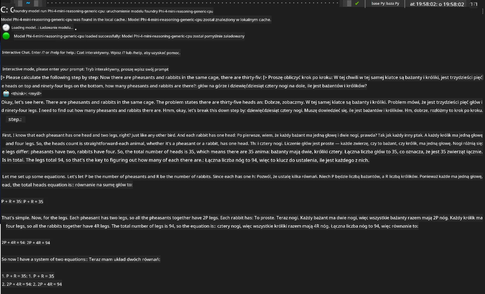

## Rozpoczęcie pracy z modelami Phi-Family w Foundry Local

### Wprowadzenie do Foundry Local

Foundry Local to potężne rozwiązanie do inferencji AI działające lokalnie na urządzeniu, które przenosi możliwości AI klasy korporacyjnej bezpośrednio na Twój sprzęt. Ten przewodnik przeprowadzi Cię przez proces konfiguracji i korzystania z modeli Phi-Family w Foundry Local, dając pełną kontrolę nad obciążeniami AI, jednocześnie dbając o prywatność i obniżając koszty.

Foundry Local oferuje wydajność, prywatność, możliwość dostosowania oraz oszczędności dzięki uruchamianiu modeli AI lokalnie na Twoim urządzeniu. Integruje się bezproblemowo z Twoimi istniejącymi procesami i aplikacjami za pomocą intuicyjnego CLI, SDK oraz REST API.




### Dlaczego warto wybrać Foundry Local?

Zrozumienie zalet Foundry Local pomoże Ci podjąć świadome decyzje dotyczące strategii wdrażania AI:

- **Inferencja na urządzeniu:** Uruchamiaj modele lokalnie na własnym sprzęcie, obniżając koszty i zachowując wszystkie dane na swoim urządzeniu.

- **Dostosowanie modeli:** Wybieraj spośród gotowych modeli lub użyj własnych, aby spełnić konkretne wymagania i scenariusze użycia.

- **Efektywność kosztowa:** Eliminuj powtarzające się opłaty za usługi w chmurze, korzystając z posiadanego sprzętu, co sprawia, że AI staje się bardziej dostępne.

- **Bezproblemowa integracja:** Łącz się z aplikacjami przez SDK, punkty końcowe API lub CLI, z łatwą skalowalnością do Microsoft Foundry w miarę rosnących potrzeb.

> **Getting Started Note:** Ten przewodnik skupia się na korzystaniu z Foundry Local przez interfejsy CLI i SDK. Poznasz oba sposoby, aby wybrać najlepszą metodę dla swojego zastosowania.

## Część 1: Konfiguracja Foundry Local CLI

### Krok 1: Instalacja

Foundry Local CLI to Twoje narzędzie do zarządzania i uruchamiania modeli AI lokalnie. Zacznijmy od jego instalacji na Twoim systemie.

**Obsługiwane platformy:** Windows i macOS

Szczegółowe instrukcje instalacji znajdziesz w [oficjalnej dokumentacji Foundry Local](https://github.com/microsoft/Foundry-Local/blob/main/README.md).

### Krok 2: Przegląd dostępnych modeli

Po zainstalowaniu Foundry Local CLI możesz sprawdzić, jakie modele są dostępne dla Twojego zastosowania. To polecenie pokaże wszystkie obsługiwane modele:


```bash
foundry model list
```

### Krok 3: Poznanie modeli Phi Family

Phi Family oferuje różnorodne modele zoptymalizowane pod kątem różnych zastosowań i konfiguracji sprzętowych. Oto dostępne modele Phi w Foundry Local:

**Dostępne modele Phi:** 

- **phi-3.5-mini** - Kompaktowy model do podstawowych zadań
- **phi-3-mini-128k** - Wersja z rozszerzonym kontekstem do dłuższych rozmów
- **phi-3-mini-4k** - Standardowy model kontekstowy do ogólnego użytku
- **phi-4** - Zaawansowany model z ulepszonymi możliwościami
- **phi-4-mini** - Lżejsza wersja Phi-4
- **phi-4-mini-reasoning** - Specjalistyczny do złożonych zadań rozumowania

> **Kompatybilność sprzętowa:** Każdy model można skonfigurować pod kątem różnych akceleratorów sprzętowych (CPU, GPU) w zależności od możliwości Twojego systemu.

### Krok 4: Uruchomienie pierwszego modelu Phi

Zacznijmy od praktycznego przykładu. Uruchomimy model `phi-4-mini-reasoning`, który świetnie radzi sobie z rozwiązywaniem złożonych problemów krok po kroku.


**Polecenie do uruchomienia modelu:**

```bash
foundry model run Phi-4-mini-reasoning-generic-cpu
```

> **Pierwsza konfiguracja:** Przy pierwszym uruchomieniu model zostanie automatycznie pobrany na Twoje urządzenie lokalne. Czas pobierania zależy od prędkości Twojej sieci, więc prosimy o cierpliwość podczas początkowej konfiguracji.

### Krok 5: Testowanie modelu na rzeczywistym problemie

Teraz przetestujmy nasz model na klasycznym problemie logicznym, aby zobaczyć, jak radzi sobie z rozumowaniem krok po kroku:

**Przykładowy problem:**

```txt
Please calculate the following step by step: Now there are pheasants and rabbits in the same cage, there are thirty-five heads on top and ninety-four legs on the bottom, how many pheasants and rabbits are there?
```

**Oczekiwane zachowanie:** Model powinien rozłożyć problem na logiczne kroki, wykorzystując fakt, że bażanty mają 2 nogi, a króliki 4 nogi, aby rozwiązać układ równań.

**Wyniki:**



## Część 2: Tworzenie aplikacji z Foundry Local SDK

### Dlaczego warto używać SDK?

CLI jest idealne do testów i szybkich interakcji, natomiast SDK pozwala na programową integrację Foundry Local z Twoimi aplikacjami. Otwiera to możliwości:

- Tworzenia niestandardowych aplikacji zasilanych AI
- Automatyzacji procesów
- Integracji funkcji AI z istniejącymi systemami
- Budowy chatbotów i narzędzi interaktywnych

### Obsługiwane języki programowania

Foundry Local oferuje wsparcie SDK dla wielu języków programowania, dostosowując się do Twoich preferencji rozwojowych:

**📦 Dostępne SDK:**

- **C# (.NET):** [Dokumentacja i przykłady SDK](https://github.com/microsoft/Foundry-Local/tree/main/sdk/cs)
- **Python:** [Dokumentacja i przykłady SDK](https://github.com/microsoft/Foundry-Local/tree/main/sdk/python)
- **JavaScript:** [Dokumentacja i przykłady SDK](https://github.com/microsoft/Foundry-Local/tree/main/sdk/js)
- **Rust:** [Dokumentacja i przykłady SDK](https://github.com/microsoft/Foundry-Local/tree/main/sdk/rust)

### Kolejne kroki

1. **Wybierz preferowane SDK** zgodnie ze swoim środowiskiem programistycznym
2. **Przejdź do dokumentacji SDK** dla szczegółowych wskazówek implementacyjnych
3. **Zacznij od prostych przykładów** zanim stworzysz bardziej złożone aplikacje
4. **Przeglądaj przykładowy kod** dostępny w każdym repozytorium SDK

## Podsumowanie

Nauczyłeś się już, jak:
- ✅ Zainstalować i skonfigurować Foundry Local CLI
- ✅ Odkrywać i uruchamiać modele Phi Family
- ✅ Testować modele na rzeczywistych problemach
- ✅ Poznać opcje SDK do tworzenia aplikacji

Foundry Local to solidna podstawa do przeniesienia możliwości AI bezpośrednio do Twojego lokalnego środowiska, dając kontrolę nad wydajnością, prywatnością i kosztami, a jednocześnie zachowując elastyczność skalowania do rozwiązań chmurowych w razie potrzeby.

**Zastrzeżenie**:  
Niniejszy dokument został przetłumaczony za pomocą usługi tłumaczenia AI [Co-op Translator](https://github.com/Azure/co-op-translator). Mimo że dążymy do dokładności, prosimy mieć na uwadze, że automatyczne tłumaczenia mogą zawierać błędy lub nieścisłości. Oryginalny dokument w języku źródłowym powinien być uznawany za źródło autorytatywne. W przypadku informacji o kluczowym znaczeniu zalecane jest skorzystanie z profesjonalnego tłumaczenia wykonanego przez człowieka. Nie ponosimy odpowiedzialności za jakiekolwiek nieporozumienia lub błędne interpretacje wynikające z korzystania z tego tłumaczenia.