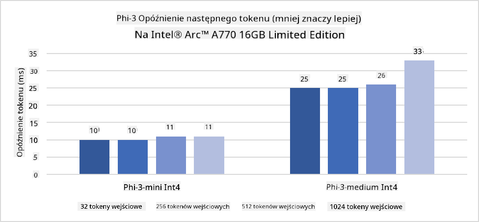
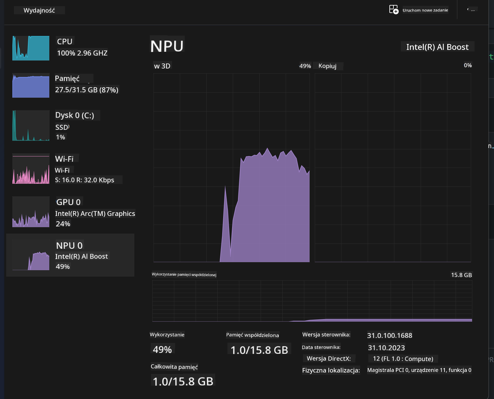
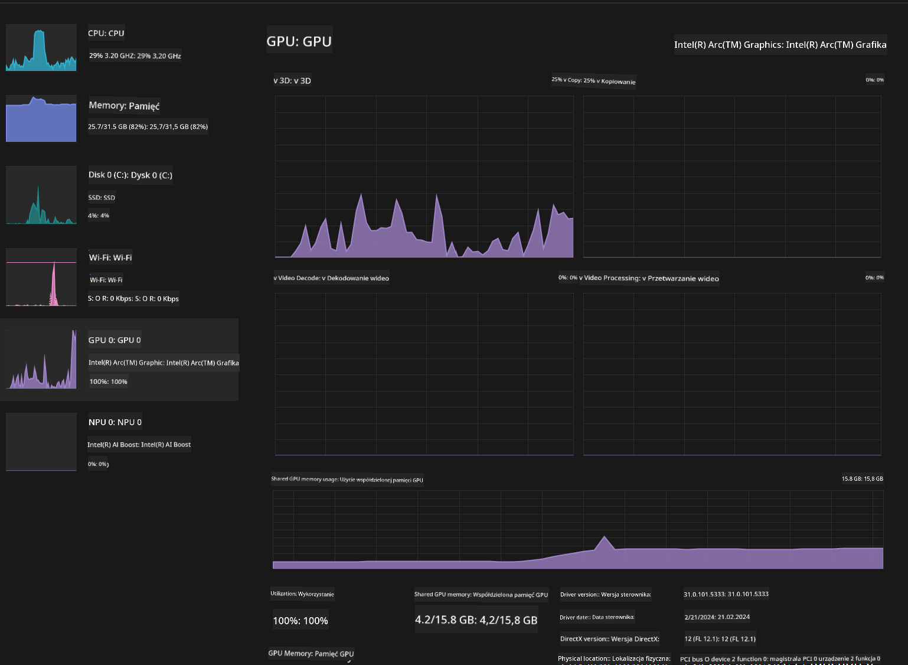

<!--
CO_OP_TRANSLATOR_METADATA:
{
  "original_hash": "e08ce816e23ad813244a09ca34ebb8ac",
  "translation_date": "2025-05-09T10:14:28+00:00",
  "source_file": "md/01.Introduction/03/AIPC_Inference.md",
  "language_code": "pl"
}
-->
# **Wnioskowanie Phi-3 na AI PC**

Wraz z rozwojem generatywnej sztucznej inteligencji oraz poprawą możliwości sprzętowych urządzeń brzegowych, coraz więcej modeli generatywnej AI może być teraz integrowanych z urządzeniami użytkowników typu Bring Your Own Device (BYOD). AI PC należą do tych modeli. Od 2024 roku Intel, AMD i Qualcomm współpracują z producentami komputerów, aby wprowadzić AI PC, które ułatwiają wdrażanie lokalnych modeli generatywnej AI dzięki modyfikacjom sprzętowym. W tej dyskusji skupimy się na AI PC Intela i omówimy, jak wdrożyć Phi-3 na AI PC Intela.

### Czym jest NPU

NPU (Neural Processing Unit) to dedykowany procesor lub jednostka przetwarzająca w większym SoC, zaprojektowana specjalnie do przyspieszania operacji sieci neuronowych i zadań AI. W przeciwieństwie do ogólnego przeznaczenia CPU i GPU, NPU są zoptymalizowane pod kątem równoległego przetwarzania danych, co czyni je bardzo wydajnymi w przetwarzaniu ogromnych ilości danych multimedialnych, takich jak wideo i obrazy, oraz danych dla sieci neuronowych. Szczególnie dobrze radzą sobie z zadaniami związanymi z AI, takimi jak rozpoznawanie mowy, rozmycie tła podczas rozmów wideo czy edycja zdjęć i filmów, np. wykrywanie obiektów.

## NPU a GPU

Choć wiele zadań AI i uczenia maszynowego działa na GPU, istnieje zasadnicza różnica między GPU a NPU.  
GPU słyną z możliwości obliczeń równoległych, ale nie wszystkie GPU są równie efektywne poza przetwarzaniem grafiki. NPU natomiast są zaprojektowane specjalnie do złożonych obliczeń wymaganych w operacjach sieci neuronowych, co czyni je bardzo skutecznymi w zadaniach AI.

Podsumowując, NPU to matematyczne mózgi, które przyspieszają obliczenia AI i odgrywają kluczową rolę w nadchodzącej erze AI PC!

***Ten przykład opiera się na najnowszym procesorze Intel Core Ultra***

## **1. Użycie NPU do uruchomienia modelu Phi-3**

Urządzenie Intel® NPU to akcelerator wnioskowania AI zintegrowany z procesorami Intel dla klientów, począwszy od generacji procesorów Intel® Core™ Ultra (dawniej Meteor Lake). Umożliwia energooszczędne wykonywanie zadań sztucznych sieci neuronowych.




**Intel NPU Acceleration Library**

Intel NPU Acceleration Library [https://github.com/intel/intel-npu-acceleration-library](https://github.com/intel/intel-npu-acceleration-library) to biblioteka Python zaprojektowana, by zwiększyć efektywność twoich aplikacji, wykorzystując moc Intel Neural Processing Unit (NPU) do wykonywania szybkich obliczeń na kompatybilnym sprzęcie.

Przykład Phi-3-mini na AI PC z procesorami Intel® Core™ Ultra.


Instalacja biblioteki Python za pomocą pip

```bash

   pip install intel-npu-acceleration-library

```

***Note*** Projekt jest nadal w fazie rozwoju, ale model referencyjny jest już bardzo kompletny.

### **Uruchamianie Phi-3 z Intel NPU Acceleration Library**

Korzystając z przyspieszenia Intel NPU, ta biblioteka nie wpływa na tradycyjny proces kodowania. Wystarczy użyć tej biblioteki do kwantyzacji oryginalnego modelu Phi-3, np. FP16, INT8, INT4, tak jak:

```python
from transformers import AutoTokenizer, pipeline,TextStreamer
from intel_npu_acceleration_library import NPUModelForCausalLM, int4
from intel_npu_acceleration_library.compiler import CompilerConfig
import warnings

model_id = "microsoft/Phi-3-mini-4k-instruct"

compiler_conf = CompilerConfig(dtype=int4)
model = NPUModelForCausalLM.from_pretrained(
    model_id, use_cache=True, config=compiler_conf, attn_implementation="sdpa"
).eval()

tokenizer = AutoTokenizer.from_pretrained(model_id)

text_streamer = TextStreamer(tokenizer, skip_prompt=True)
```

Po pomyślnej kwantyzacji kontynuujemy wykonanie, wywołując NPU do uruchomienia modelu Phi-3.

```python
generation_args = {
   "max_new_tokens": 1024,
   "return_full_text": False,
   "temperature": 0.3,
   "do_sample": False,
   "streamer": text_streamer,
}

pipe = pipeline(
   "text-generation",
   model=model,
   tokenizer=tokenizer,
)

query = "<|system|>You are a helpful AI assistant.<|end|><|user|>Can you introduce yourself?<|end|><|assistant|>"

with warnings.catch_warnings():
    warnings.simplefilter("ignore")
    pipe(query, **generation_args)
```

Podczas wykonywania kodu możemy obserwować status działania NPU przez Menedżera zadań.



***Samples*** : [AIPC_NPU_DEMO.ipynb](../../../../../code/03.Inference/AIPC/AIPC_NPU_DEMO.ipynb)

## **2. Użycie DirectML + ONNX Runtime do uruchomienia modelu Phi-3**

### **Czym jest DirectML**

[DirectML](https://github.com/microsoft/DirectML) to wysokowydajna, sprzętowo przyspieszana biblioteka DirectX 12 dla uczenia maszynowego. DirectML zapewnia akcelerację GPU dla powszechnych zadań uczenia maszynowego na szerokiej gamie obsługiwanego sprzętu i sterowników, w tym wszystkich GPU obsługujących DirectX 12 od takich producentów jak AMD, Intel, NVIDIA i Qualcomm.

W trybie samodzielnym API DirectML to niskopoziomowa biblioteka DirectX 12, odpowiednia do wysokowydajnych aplikacji o niskim opóźnieniu, takich jak frameworki, gry i inne aplikacje czasu rzeczywistego. Bezproblemowa współpraca DirectML z Direct3D 12, niskie narzuty oraz zgodność na różnych urządzeniach czynią DirectML idealnym do przyspieszania uczenia maszynowego, gdy wymagane są zarówno wysoka wydajność, jak i niezawodność oraz przewidywalność wyników na różnych sprzętach.

***Note*** : Najnowszy DirectML obsługuje już NPU (https://devblogs.microsoft.com/directx/introducing-neural-processor-unit-npu-support-in-directml-developer-preview/)

### DirectML i CUDA pod względem możliwości i wydajności:

**DirectML** to biblioteka uczenia maszynowego stworzona przez Microsoft. Jest zaprojektowana, by przyspieszać zadania uczenia maszynowego na urządzeniach z Windows, w tym na komputerach stacjonarnych, laptopach i urządzeniach brzegowych.  
- Oparta na DX12: DirectML bazuje na DirectX 12 (DX12), co zapewnia szerokie wsparcie sprzętowe dla GPU, w tym NVIDIA i AMD.  
- Szersze wsparcie: Dzięki DX12, DirectML działa na każdym GPU obsługującym DX12, także na zintegrowanych GPU.  
- Przetwarzanie obrazów: DirectML przetwarza obrazy i inne dane za pomocą sieci neuronowych, co sprawia, że nadaje się do zadań takich jak rozpoznawanie obrazów, wykrywanie obiektów i inne.  
- Łatwość konfiguracji: Konfiguracja DirectML jest prosta i nie wymaga specjalnych SDK ani bibliotek od producentów GPU.  
- Wydajność: W niektórych przypadkach DirectML działa bardzo dobrze i może być szybszy niż CUDA, szczególnie dla wybranych zadań.  
- Ograniczenia: Są jednak sytuacje, gdy DirectML może być wolniejszy, zwłaszcza przy dużych partiach float16.

**CUDA** to platforma i model programowania równoległego firmy NVIDIA. Pozwala programistom wykorzystać moc GPU NVIDIA do obliczeń ogólnego przeznaczenia, w tym uczenia maszynowego i symulacji naukowych.  
- Specyficzne dla NVIDIA: CUDA jest ściśle zintegrowana z GPU NVIDIA i zaprojektowana specjalnie dla nich.  
- Wysoka optymalizacja: Zapewnia doskonałą wydajność zadań przyspieszanych przez GPU, szczególnie na sprzęcie NVIDIA.  
- Szerokie zastosowanie: Wiele frameworków i bibliotek uczenia maszynowego (np. TensorFlow, PyTorch) wspiera CUDA.  
- Możliwość dostosowania: Programiści mogą precyzyjnie dostrajać ustawienia CUDA dla konkretnych zadań, co pozwala osiągnąć optymalną wydajność.  
- Ograniczenia: Jednak zależność od sprzętu NVIDIA może być ograniczeniem, jeśli potrzebujesz szerszej kompatybilności z różnymi GPU.

### Wybór między DirectML a CUDA

Wybór między DirectML a CUDA zależy od konkretnego zastosowania, dostępnego sprzętu i preferencji.  
Jeśli zależy Ci na szerokiej kompatybilności i łatwości konfiguracji, DirectML może być dobrym wyborem. Natomiast jeśli masz GPU NVIDIA i potrzebujesz maksymalnie zoptymalizowanej wydajności, CUDA pozostaje mocnym kandydatem. Podsumowując, oba rozwiązania mają swoje mocne i słabe strony, więc warto rozważyć swoje potrzeby i dostępny sprzęt przy podejmowaniu decyzji.

### **Generatywna AI z ONNX Runtime**

W erze AI przenośność modeli AI jest bardzo ważna. ONNX Runtime umożliwia łatwe wdrażanie wytrenowanych modeli na różnych urządzeniach. Programiści nie muszą martwić się o framework wnioskowania i mogą korzystać z ujednoliconego API do wykonania modelu. W erze generatywnej AI ONNX Runtime oferuje również optymalizację kodu (https://onnxruntime.ai/docs/genai/). Dzięki zoptymalizowanemu ONNX Runtime, skwantyzowany model generatywnej AI może być wnioskowany na różnych urządzeniach. W Generatywnej AI z ONNX Runtime można korzystać z API modelu AI przez Python, C#, C/C++. Oczywiście, wdrożenie na iPhonie może korzystać z C++ API Generative AI z ONNX Runtime.

[Sample Code](https://github.com/Azure-Samples/Phi-3MiniSamples/tree/main/onnx)

***Kompilacja biblioteki generatywnej AI z ONNX Runtime***

```bash

winget install --id=Kitware.CMake  -e

git clone https://github.com/microsoft/onnxruntime.git

cd .\onnxruntime\

./build.bat --build_shared_lib --skip_tests --parallel --use_dml --config Release

cd ../

git clone https://github.com/microsoft/onnxruntime-genai.git

cd .\onnxruntime-genai\

mkdir ort

cd ort

mkdir include

mkdir lib

copy ..\onnxruntime\include\onnxruntime\core\providers\dml\dml_provider_factory.h ort\include

copy ..\onnxruntime\include\onnxruntime\core\session\onnxruntime_c_api.h ort\include

copy ..\onnxruntime\build\Windows\Release\Release\*.dll ort\lib

copy ..\onnxruntime\build\Windows\Release\Release\onnxruntime.lib ort\lib

python build.py --use_dml


```

**Instalacja biblioteki**

```bash

pip install .\onnxruntime_genai_directml-0.3.0.dev0-cp310-cp310-win_amd64.whl

```

Oto wynik działania


***Samples*** : [AIPC_DirectML_DEMO.ipynb](../../../../../code/03.Inference/AIPC/AIPC_DirectML_DEMO.ipynb)

## **3. Użycie Intel OpenVino do uruchomienia modelu Phi-3**

### **Czym jest OpenVINO**

[OpenVINO](https://github.com/openvinotoolkit/openvino) to otwartoźródłowy zestaw narzędzi do optymalizacji i wdrażania modeli głębokiego uczenia. Zapewnia przyspieszenie wydajności modeli wizji, dźwięku i języka z popularnych frameworków, takich jak TensorFlow, PyTorch i innych. Zacznij korzystać z OpenVINO. OpenVINO może być także używane w połączeniu z CPU i GPU do uruchomienia modelu Phi-3.

***Note***: Obecnie OpenVINO nie obsługuje NPU.

### **Instalacja biblioteki OpenVINO**

```bash

 pip install git+https://github.com/huggingface/optimum-intel.git

 pip install git+https://github.com/openvinotoolkit/nncf.git

 pip install openvino-nightly

```

### **Uruchamianie Phi-3 z OpenVINO**

Podobnie jak w przypadku NPU, OpenVINO wykonuje wywołanie modeli generatywnej AI przez uruchamianie modeli kwantyzowanych. Najpierw musimy dokonać kwantyzacji modelu Phi-3 i wykonać ją w wierszu poleceń za pomocą optimum-cli.

**INT4**

```bash

optimum-cli export openvino --model "microsoft/Phi-3-mini-4k-instruct" --task text-generation-with-past --weight-format int4 --group-size 128 --ratio 0.6  --sym  --trust-remote-code ./openvinomodel/phi3/int4

```

**FP16**

```bash

optimum-cli export openvino --model "microsoft/Phi-3-mini-4k-instruct" --task text-generation-with-past --weight-format fp16 --trust-remote-code ./openvinomodel/phi3/fp16

```

skonwertowany format wygląda tak


Ładujemy ścieżki modelu (model_dir), powiązane konfiguracje (ov_config = {"PERFORMANCE_HINT": "LATENCY", "NUM_STREAMS": "1", "CACHE_DIR": ""}) oraz sprzętowo przyspieszone urządzenia (GPU.0) przez OVModelForCausalLM

```python

ov_model = OVModelForCausalLM.from_pretrained(
     model_dir,
     device='GPU.0',
     ov_config=ov_config,
     config=AutoConfig.from_pretrained(model_dir, trust_remote_code=True),
     trust_remote_code=True,
)

```

Podczas wykonywania kodu możemy obserwować status działania GPU przez Menedżera zadań



***Samples*** : [AIPC_OpenVino_Demo.ipynb](../../../../../code/03.Inference/AIPC/AIPC_OpenVino_Demo.ipynb)

### ***Note*** : Powyższe trzy metody mają swoje zalety, ale zaleca się korzystanie z przyspieszenia NPU do wnioskowania na AI PC.

**Zastrzeżenie**:  
Niniejszy dokument został przetłumaczony przy użyciu automatycznej usługi tłumaczeniowej AI [Co-op Translator](https://github.com/Azure/co-op-translator). Chociaż dokładamy starań, aby tłumaczenie było precyzyjne, prosimy mieć na uwadze, że tłumaczenia automatyczne mogą zawierać błędy lub nieścisłości. Oryginalny dokument w języku źródłowym powinien być uznawany za źródło wiarygodne. W przypadku informacji o krytycznym znaczeniu zaleca się skorzystanie z profesjonalnego tłumaczenia wykonanego przez człowieka. Nie ponosimy odpowiedzialności za jakiekolwiek nieporozumienia lub błędne interpretacje wynikające z korzystania z tego tłumaczenia.