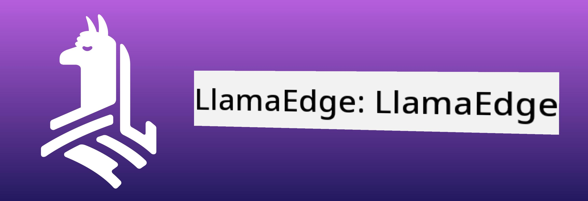
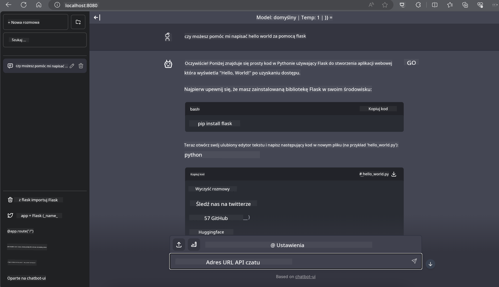

<!--
CO_OP_TRANSLATOR_METADATA:
{
  "original_hash": "be4101a30d98e95a71d42c276e8bcd37",
  "translation_date": "2025-05-09T11:36:29+00:00",
  "source_file": "md/01.Introduction/03/Jetson_Inference.md",
  "language_code": "pl"
}
-->
# **Inference Phi-3 na Nvidia Jetson**

Nvidia Jetson to seria wbudowanych płyt komputerowych od Nvidia. Modele Jetson TK1, TX1 i TX2 wyposażone są w procesor Tegra (lub SoC) od Nvidia, który integruje jednostkę centralną (CPU) opartą na architekturze ARM. Jetson to system o niskim zużyciu energii, zaprojektowany do przyspieszania zastosowań uczenia maszynowego. Nvidia Jetson jest wykorzystywany przez profesjonalnych deweloperów do tworzenia przełomowych produktów AI w różnych branżach, a także przez studentów i entuzjastów do praktycznej nauki AI i realizacji niesamowitych projektów. SLM jest wdrażany w urządzeniach brzegowych, takich jak Jetson, co pozwala na lepszą implementację przemysłowych scenariuszy zastosowań generatywnej sztucznej inteligencji.

## Wdrożenie na NVIDIA Jetson:
Deweloperzy pracujący nad autonomicznymi robotami i urządzeniami wbudowanymi mogą skorzystać z Phi-3 Mini. Stosunkowo niewielkie rozmiary Phi-3 czynią go idealnym do wdrożeń na krawędzi sieci. Parametry zostały starannie dostrojone podczas treningu, co zapewnia wysoką dokładność odpowiedzi.

### Optymalizacja TensorRT-LLM:
Biblioteka [TensorRT-LLM firmy NVIDIA](https://github.com/NVIDIA/TensorRT-LLM?WT.mc_id=aiml-138114-kinfeylo) optymalizuje inferencję dużych modeli językowych. Obsługuje długie okno kontekstowe Phi-3 Mini, poprawiając zarówno przepustowość, jak i opóźnienia. Optymalizacje obejmują techniki takie jak LongRoPE, FP8 oraz inflight batching.

### Dostępność i wdrożenie:
Deweloperzy mogą przetestować Phi-3 Mini z oknem kontekstowym 128K na [NVIDIA AI](https://www.nvidia.com/en-us/ai-data-science/generative-ai/). Jest on udostępniany jako NVIDIA NIM, mikrousługa ze standardowym API, którą można wdrożyć w dowolnym miejscu. Dodatkowo, [implementacje TensorRT-LLM na GitHub](https://github.com/NVIDIA/TensorRT-LLM).

## **1. Przygotowanie**

a. Jetson Orin NX / Jetson NX

b. JetPack 5.1.2+

c. Cuda 11.8

d. Python 3.8+

## **2. Uruchomienie Phi-3 na Jetson**

Możemy wybrać [Ollama](https://ollama.com) lub [LlamaEdge](https://llamaedge.com)

Jeśli chcesz używać gguf jednocześnie w chmurze i na urządzeniach brzegowych, LlamaEdge można rozumieć jako WasmEdge (WasmEdge to lekki, wysokowydajny, skalowalny runtime WebAssembly odpowiedni dla aplikacji cloud native, edge oraz zdecentralizowanych. Wspiera aplikacje serverless, funkcje wbudowane, mikrousługi, smart kontrakty oraz urządzenia IoT). Możesz wdrożyć skwantowany model gguf zarówno na urządzeniach brzegowych, jak i w chmurze za pomocą LlamaEdge.



Oto kroki użytkowania

1. Zainstaluj i pobierz powiązane biblioteki oraz pliki

```bash

curl -sSf https://raw.githubusercontent.com/WasmEdge/WasmEdge/master/utils/install.sh | bash -s -- --plugin wasi_nn-ggml

curl -LO https://github.com/LlamaEdge/LlamaEdge/releases/latest/download/llama-api-server.wasm

curl -LO https://github.com/LlamaEdge/chatbot-ui/releases/latest/download/chatbot-ui.tar.gz

tar xzf chatbot-ui.tar.gz

```

**Uwaga**: llama-api-server.wasm oraz chatbot-ui muszą znajdować się w tym samym katalogu

2. Uruchom skrypty w terminalu

```bash

wasmedge --dir .:. --nn-preload default:GGML:AUTO:{Your gguf path} llama-api-server.wasm -p phi-3-chat

```

Oto wynik działania



***Przykładowy kod*** [Phi-3 mini WASM Notebook Sample](https://github.com/Azure-Samples/Phi-3MiniSamples/tree/main/wasm)

Podsumowując, Phi-3 Mini to znaczący krok naprzód w modelowaniu języka, łączący wydajność, świadomość kontekstu i możliwości optymalizacji NVIDIA. Niezależnie od tego, czy tworzysz roboty, czy aplikacje brzegowe, Phi-3 Mini to potężne narzędzie, które warto znać.

**Zastrzeżenie**:  
Niniejszy dokument został przetłumaczony przy użyciu usługi tłumaczenia AI [Co-op Translator](https://github.com/Azure/co-op-translator). Mimo że dążymy do dokładności, prosimy pamiętać, że tłumaczenia automatyczne mogą zawierać błędy lub niedokładności. Oryginalny dokument w języku źródłowym powinien być uznawany za źródło autorytatywne. W przypadku informacji o kluczowym znaczeniu zaleca się skorzystanie z profesjonalnego tłumaczenia wykonanego przez człowieka. Nie ponosimy odpowiedzialności za jakiekolwiek nieporozumienia lub błędne interpretacje wynikające z korzystania z tego tłumaczenia.