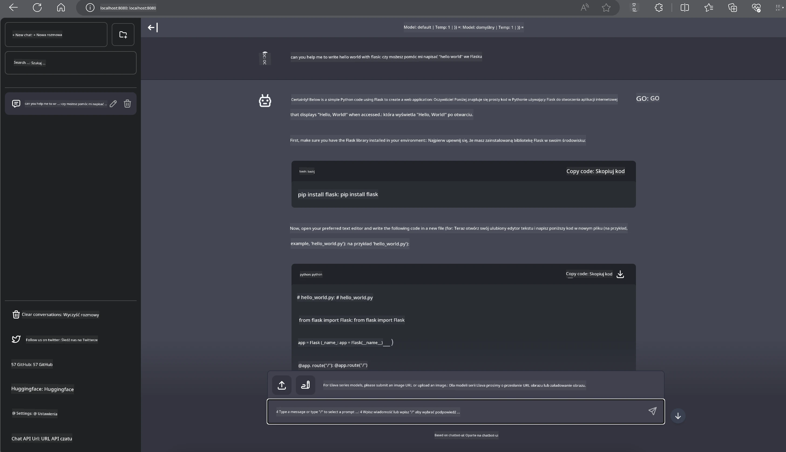

# **Inference Phi-3 na Nvidia Jetson**

Nvidia Jetson to seria wbudowanych płyt komputerowych od Nvidia. Modele Jetson TK1, TX1 i TX2 wyposażone są w procesor Tegra (lub SoC) od Nvidia, który integruje jednostkę centralną (CPU) opartą na architekturze ARM. Jetson to system o niskim zużyciu energii, zaprojektowany do przyspieszania aplikacji uczenia maszynowego. Nvidia Jetson jest wykorzystywany przez profesjonalnych deweloperów do tworzenia przełomowych produktów AI w różnych branżach, a także przez studentów i entuzjastów do praktycznej nauki AI i realizacji niesamowitych projektów. SLM jest wdrażany w urządzeniach brzegowych, takich jak Jetson, co umożliwia lepszą implementację przemysłowych scenariuszy zastosowań generatywnej AI.

## Wdrożenie na NVIDIA Jetson:
Deweloperzy pracujący nad autonomicznymi robotami i urządzeniami wbudowanymi mogą skorzystać z Phi-3 Mini. Relatywnie niewielkie rozmiary Phi-3 czynią go idealnym do wdrożeń na brzegu sieci. Parametry zostały starannie dostrojone podczas treningu, co zapewnia wysoką dokładność odpowiedzi.

### Optymalizacja TensorRT-LLM:
Biblioteka [TensorRT-LLM firmy NVIDIA](https://github.com/NVIDIA/TensorRT-LLM?WT.mc_id=aiml-138114-kinfeylo) optymalizuje inferencję dużych modeli językowych. Wspiera długie okno kontekstowe Phi-3 Mini, poprawiając zarówno przepustowość, jak i opóźnienia. Optymalizacje obejmują techniki takie jak LongRoPE, FP8 oraz inflight batching.

### Dostępność i wdrożenie:
Deweloperzy mogą wypróbować Phi-3 Mini z oknem kontekstowym 128K na [NVIDIA AI](https://www.nvidia.com/en-us/ai-data-science/generative-ai/). Jest on udostępniany jako NVIDIA NIM, mikroserwis z standardowym API, który można wdrożyć w dowolnym miejscu. Dodatkowo, [implementacje TensorRT-LLM na GitHub](https://github.com/NVIDIA/TensorRT-LLM).

## **1. Przygotowanie**

a. Jetson Orin NX / Jetson NX

b. JetPack 5.1.2+

c. Cuda 11.8

d. Python 3.8+

## **2. Uruchamianie Phi-3 na Jetson**

Możemy wybrać [Ollama](https://ollama.com) lub [LlamaEdge](https://llamaedge.com)

Jeśli chcesz korzystać z gguf jednocześnie w chmurze i na urządzeniach brzegowych, LlamaEdge można rozumieć jako WasmEdge (WasmEdge to lekki, wysokowydajny i skalowalny runtime WebAssembly, odpowiedni dla aplikacji cloud native, edge i zdecentralizowanych. Wspiera aplikacje serverless, funkcje wbudowane, mikroserwisy, smart kontrakty oraz urządzenia IoT). Możesz wdrożyć kwantowany model gguf na urządzenia brzegowe i w chmurze za pomocą LlamaEdge.


Oto kroki do użycia:

1. Zainstaluj i pobierz powiązane biblioteki i pliki

```bash

curl -sSf https://raw.githubusercontent.com/WasmEdge/WasmEdge/master/utils/install.sh | bash -s -- --plugin wasi_nn-ggml

curl -LO https://github.com/LlamaEdge/LlamaEdge/releases/latest/download/llama-api-server.wasm

curl -LO https://github.com/LlamaEdge/chatbot-ui/releases/latest/download/chatbot-ui.tar.gz

tar xzf chatbot-ui.tar.gz

```

**Uwaga**: llama-api-server.wasm i chatbot-ui muszą znajdować się w tym samym katalogu

2. Uruchom skrypty w terminalu

```bash

wasmedge --dir .:. --nn-preload default:GGML:AUTO:{Your gguf path} llama-api-server.wasm -p phi-3-chat

```

Oto wynik działania



***Przykładowy kod*** [Phi-3 mini WASM Notebook Sample](https://github.com/Azure-Samples/Phi-3MiniSamples/tree/main/wasm)

Podsumowując, Phi-3 Mini to znaczący krok naprzód w modelowaniu języka, łączący efektywność, świadomość kontekstu oraz możliwości optymalizacji NVIDIA. Niezależnie od tego, czy tworzysz roboty, czy aplikacje brzegowe, Phi-3 Mini to potężne narzędzie, które warto znać.

**Zastrzeżenie**:  
Niniejszy dokument został przetłumaczony za pomocą usługi tłumaczenia AI [Co-op Translator](https://github.com/Azure/co-op-translator). Mimo że dążymy do jak największej dokładności, prosimy mieć na uwadze, że automatyczne tłumaczenia mogą zawierać błędy lub nieścisłości. Oryginalny dokument w języku źródłowym powinien być uznawany za źródło autorytatywne. W przypadku informacji o kluczowym znaczeniu zalecane jest skorzystanie z profesjonalnego tłumaczenia wykonanego przez człowieka. Nie ponosimy odpowiedzialności za jakiekolwiek nieporozumienia lub błędne interpretacje wynikające z korzystania z tego tłumaczenia.