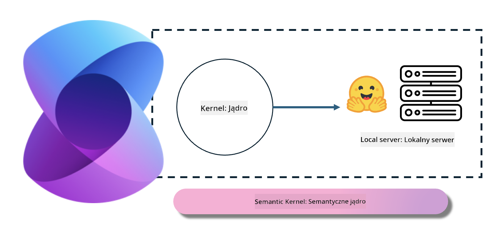
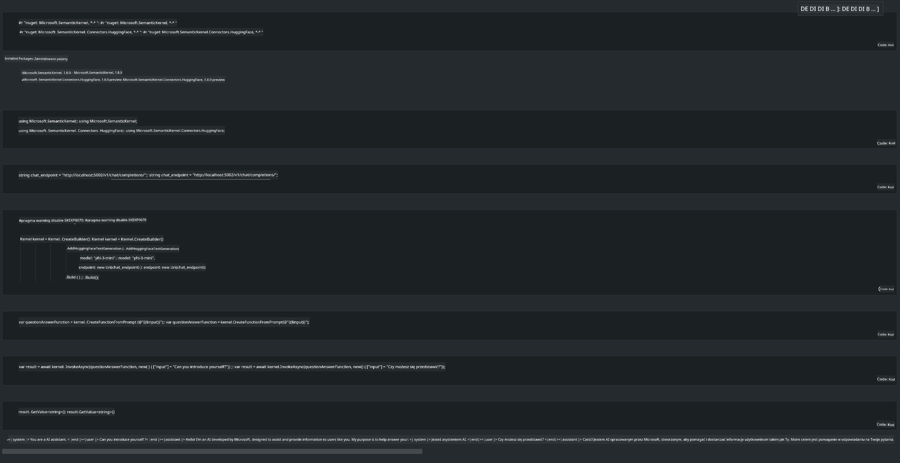

<!--
CO_OP_TRANSLATOR_METADATA:
{
  "original_hash": "bcf5dd7031db0031abdb9dd0c05ba118",
  "translation_date": "2025-05-09T12:03:59+00:00",
  "source_file": "md/01.Introduction/03/Local_Server_Inference.md",
  "language_code": "pl"
}
-->
# **Inference Phi-3 na lokalnym serwerze**

Możemy wdrożyć Phi-3 na lokalnym serwerze. Użytkownicy mogą wybrać rozwiązania [Ollama](https://ollama.com) lub [LM Studio](https://llamaedge.com), albo napisać własny kod. Można połączyć lokalne usługi Phi-3 przez [Semantic Kernel](https://github.com/microsoft/semantic-kernel?WT.mc_id=aiml-138114-kinfeylo) lub [Langchain](https://www.langchain.com/), aby tworzyć aplikacje Copilot.

## **Użycie Semantic Kernel do dostępu do Phi-3-mini**

W aplikacji Copilot tworzymy aplikacje za pomocą Semantic Kernel / LangChain. Taki framework aplikacji jest na ogół kompatybilny z Azure OpenAI Service / modelami OpenAI, a także może obsługiwać modele open source z Hugging Face oraz modele lokalne. Co zrobić, jeśli chcemy użyć Semantic Kernel do dostępu do Phi-3-mini? Na przykładzie .NET możemy połączyć go z Hugging Face Connector w Semantic Kernel. Domyślnie odpowiada to identyfikatorowi modelu na Hugging Face (przy pierwszym użyciu model zostanie pobrany z Hugging Face, co zajmuje sporo czasu). Można też połączyć się z lokalnie uruchomioną usługą. W porównaniu z tymi dwoma opcjami zalecamy tę drugą, ponieważ daje większą autonomię, zwłaszcza w zastosowaniach biznesowych.

Na ilustracji widać, że dostęp do lokalnych usług przez Semantic Kernel umożliwia łatwe połączenie z samodzielnie zbudowanym serwerem modelu Phi-3-mini. Oto wynik działania

***Sample Code*** https://github.com/kinfey/Phi3MiniSamples/tree/main/semantickernel

**Zastrzeżenie**:  
Niniejszy dokument został przetłumaczony przy użyciu usługi tłumaczenia AI [Co-op Translator](https://github.com/Azure/co-op-translator). Mimo że dokładamy starań, aby tłumaczenie było precyzyjne, prosimy pamiętać, że automatyczne tłumaczenia mogą zawierać błędy lub nieścisłości. Oryginalny dokument w języku źródłowym należy traktować jako źródło autorytatywne. W przypadku informacji krytycznych zalecane jest skorzystanie z profesjonalnego tłumaczenia wykonanego przez człowieka. Nie ponosimy odpowiedzialności za jakiekolwiek nieporozumienia lub błędne interpretacje wynikające z korzystania z tego tłumaczenia.