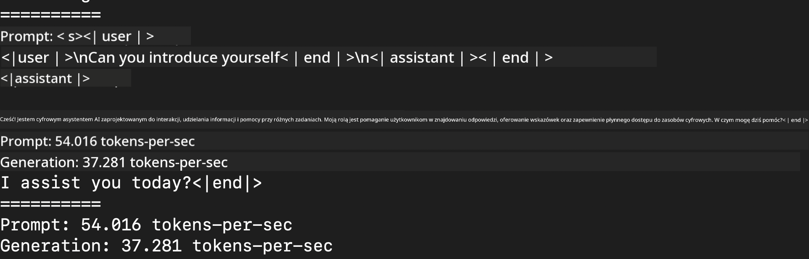
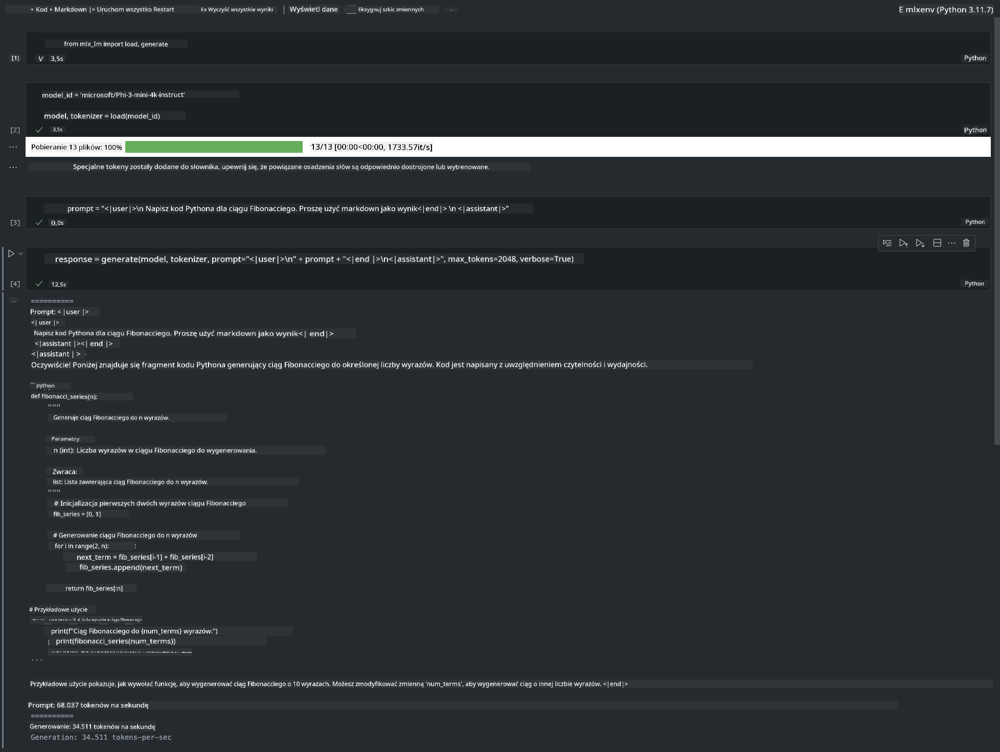

<!--
CO_OP_TRANSLATOR_METADATA:
{
  "original_hash": "dcb656f3d206fc4968e236deec5d4384",
  "translation_date": "2025-05-09T12:12:44+00:00",
  "source_file": "md/01.Introduction/03/MLX_Inference.md",
  "language_code": "pl"
}
-->
# **Inference Phi-3 z Apple MLX Framework**

## **Czym jest MLX Framework**

MLX to framework tablicowy do badań nad uczeniem maszynowym na układach Apple Silicon, stworzony przez zespół badawczy Apple zajmujący się uczeniem maszynowym.

MLX został zaprojektowany przez badaczy uczenia maszynowego dla badaczy uczenia maszynowego. Framework ma być przyjazny dla użytkownika, a jednocześnie efektywny w trenowaniu i wdrażaniu modeli. Sam projekt frameworka jest również koncepcyjnie prosty. Chcemy, aby badacze mogli łatwo rozszerzać i ulepszać MLX, co pozwoli na szybkie testowanie nowych pomysłów.

LLM-y mogą być przyspieszane na urządzeniach Apple Silicon dzięki MLX, a modele można uruchamiać lokalnie bardzo wygodnie.

## **Użycie MLX do inferencji Phi-3-mini**

### **1. Skonfiguruj swoje środowisko MLX**

1. Python 3.11.x  
2. Zainstaluj bibliotekę MLX


```bash

pip install mlx-lm

```

### **2. Uruchamianie Phi-3-mini w Terminalu za pomocą MLX**


```bash

python -m mlx_lm.generate --model microsoft/Phi-3-mini-4k-instruct --max-token 2048 --prompt  "<|user|>\nCan you introduce yourself<|end|>\n<|assistant|>"

```

Wynik (moje środowisko to Apple M1 Max, 64GB) wygląda tak


### **3. Kwantyzacja Phi-3-mini z MLX w Terminalu**


```bash

python -m mlx_lm.convert --hf-path microsoft/Phi-3-mini-4k-instruct

```

***Note：*** Model można skwantyzować za pomocą mlx_lm.convert, a domyślną kwantyzacją jest INT4. Ten przykład pokazuje kwantyzację Phi-3-mini do INT4.

Model można skwantyzować za pomocą mlx_lm.convert, a domyślną kwantyzacją jest INT4. W tym przykładzie Phi-3-mini jest kwantyzowany do INT4. Po kwantyzacji model zostanie zapisany w domyślnym katalogu ./mlx_model

Możemy przetestować skwantyzowany model MLX z poziomu terminala


```bash

python -m mlx_lm.generate --model ./mlx_model/ --max-token 2048 --prompt  "<|user|>\nCan you introduce yourself<|end|>\n<|assistant|>"

```

Wynik jest następujący




### **4. Uruchamianie Phi-3-mini z MLX w Jupyter Notebook**




***Note:*** Proszę zapoznać się z tym przykładem [kliknij ten link](../../../../../code/03.Inference/MLX/MLX_DEMO.ipynb)


## **Zasoby**

1. Dowiedz się więcej o Apple MLX Framework [https://ml-explore.github.io](https://ml-explore.github.io/mlx/build/html/index.html)

2. Repozytorium Apple MLX na GitHub [https://github.com/ml-explore](https://github.com/ml-explore)

**Zastrzeżenie**:  
Niniejszy dokument został przetłumaczony przy użyciu usługi tłumaczeń AI [Co-op Translator](https://github.com/Azure/co-op-translator). Mimo że dążymy do dokładności, prosimy mieć na uwadze, że automatyczne tłumaczenia mogą zawierać błędy lub niedokładności. Oryginalny dokument w języku źródłowym należy uważać za źródło wiarygodne. W przypadku informacji krytycznych zaleca się skorzystanie z profesjonalnego tłumaczenia wykonanego przez człowieka. Nie ponosimy odpowiedzialności za jakiekolwiek nieporozumienia lub błędne interpretacje wynikające z korzystania z tego tłumaczenia.