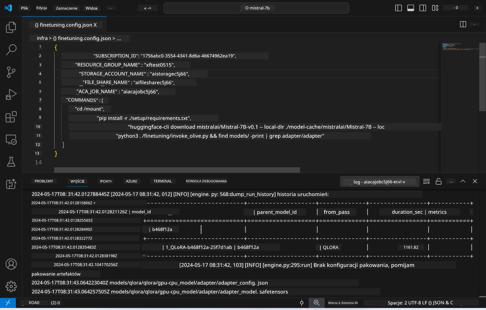
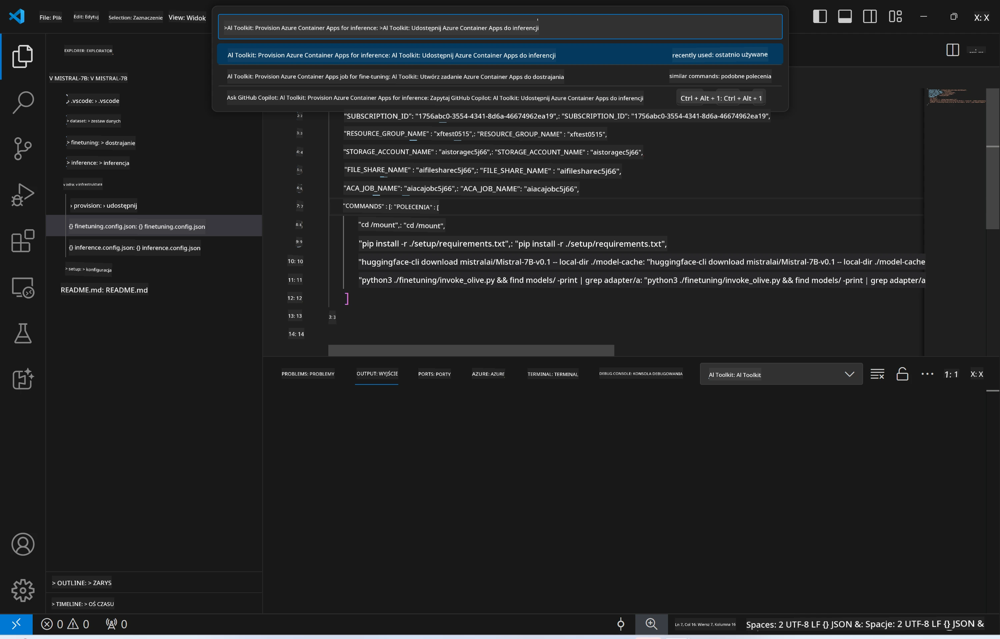
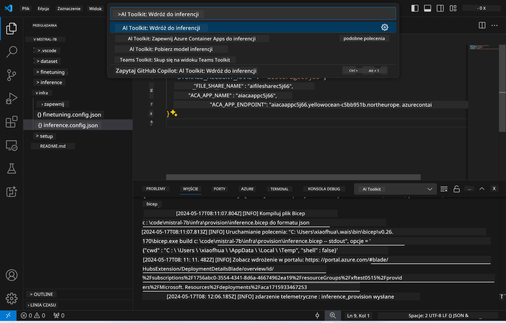

<!--
CO_OP_TRANSLATOR_METADATA:
{
  "original_hash": "a54cd3d65b6963e4e8ce21e143c3ab04",
  "translation_date": "2025-07-16T21:18:34+00:00",
  "source_file": "md/01.Introduction/03/Remote_Interence.md",
  "language_code": "pl"
}
-->
# Zdalne wnioskowanie z wykorzystaniem modelu dostrojonego

Po wytrenowaniu adapterów w środowisku zdalnym, użyj prostej aplikacji Gradio, aby wchodzić w interakcję z modelem.



### Przygotowanie zasobów Azure  
Musisz skonfigurować zasoby Azure do zdalnego wnioskowania, wykonując polecenie `AI Toolkit: Provision Azure Container Apps for inference` z palety poleceń. Podczas tej konfiguracji zostaniesz poproszony o wybranie subskrypcji Azure oraz grupy zasobów.  


Domyślnie subskrypcja i grupa zasobów dla wnioskowania powinny być takie same, jak te użyte podczas dostrajania. Wnioskowanie będzie korzystać z tego samego środowiska Azure Container App oraz uzyska dostęp do modelu i adaptera modelu przechowywanych w Azure Files, które zostały wygenerowane podczas etapu dostrajania.

## Korzystanie z AI Toolkit

### Wdrażanie do wnioskowania  
Jeśli chcesz zmodyfikować kod wnioskowania lub ponownie załadować model wnioskowania, wykonaj polecenie `AI Toolkit: Deploy for inference`. Spowoduje to synchronizację najnowszego kodu z ACA i ponowne uruchomienie repliki.



Po pomyślnym wdrożeniu model jest gotowy do oceny za pomocą tego punktu końcowego.

### Dostęp do API wnioskowania

Do API wnioskowania możesz uzyskać dostęp, klikając przycisk "*Go to Inference Endpoint*" wyświetlany w powiadomieniu VSCode. Alternatywnie, adres punktu końcowego API webowego znajdziesz pod `ACA_APP_ENDPOINT` w pliku `./infra/inference.config.json` oraz w panelu wyjściowym.


> **Note:** Punkt końcowy wnioskowania może wymagać kilku minut, aby stać się w pełni operacyjnym.

## Komponenty wnioskowania zawarte w szablonie

| Folder | Zawartość |
| ------ | --------- |
| `infra` | Zawiera wszystkie niezbędne konfiguracje do operacji zdalnych. |
| `infra/provision/inference.parameters.json` | Zawiera parametry dla szablonów bicep, używane do przygotowania zasobów Azure dla wnioskowania. |
| `infra/provision/inference.bicep` | Zawiera szablony do przygotowania zasobów Azure dla wnioskowania. |
| `infra/inference.config.json` | Plik konfiguracyjny, wygenerowany przez polecenie `AI Toolkit: Provision Azure Container Apps for inference`. Służy jako dane wejściowe dla innych poleceń zdalnych. |

### Konfiguracja przygotowania zasobów Azure za pomocą AI Toolkit  
Skonfiguruj [AI Toolkit](https://marketplace.visualstudio.com/items?itemName=ms-windows-ai-studio.windows-ai-studio)

Wykonaj polecenie `Provision Azure Container Apps for inference`.

Parametry konfiguracyjne znajdziesz w pliku `./infra/provision/inference.parameters.json`. Oto szczegóły:  
| Parametr | Opis |
| -------- | ---- |
| `defaultCommands` | Komendy do uruchomienia API webowego. |
| `maximumInstanceCount` | Maksymalna liczba instancji GPU. |
| `location` | Lokalizacja, w której będą przygotowane zasoby Azure. Domyślnie jest to ta sama lokalizacja, co wybrana grupa zasobów. |
| `storageAccountName`, `fileShareName`, `acaEnvironmentName`, `acaEnvironmentStorageName`, `acaAppName`, `acaLogAnalyticsName` | Parametry służące do nadawania nazw zasobom Azure podczas przygotowania. Domyślnie są takie same jak nazwy zasobów użytych podczas dostrajania. Możesz podać nową, nieużywaną nazwę, aby utworzyć własne zasoby o niestandardowych nazwach, lub podać nazwę już istniejącego zasobu Azure, jeśli chcesz go użyć. Szczegóły znajdziesz w sekcji [Using existing Azure Resources](../../../../../md/01.Introduction/03). |

### Korzystanie z istniejących zasobów Azure

Domyślnie przygotowanie wnioskowania korzysta z tego samego środowiska Azure Container App, konta Storage, udziału Azure File Share oraz Azure Log Analytics, które były używane podczas dostrajania. Osobna aplikacja Azure Container App jest tworzona wyłącznie dla API wnioskowania.

Jeśli dostosowałeś zasoby Azure podczas etapu dostrajania lub chcesz użyć własnych istniejących zasobów Azure do wnioskowania, podaj ich nazwy w pliku `./infra/inference.parameters.json`. Następnie uruchom polecenie `AI Toolkit: Provision Azure Container Apps for inference` z palety poleceń. Spowoduje to aktualizację wskazanych zasobów oraz utworzenie brakujących.

Na przykład, jeśli masz istniejące środowisko kontenerowe Azure, twój plik `./infra/finetuning.parameters.json` powinien wyglądać tak:

```json
{
    "$schema": "https://schema.management.azure.com/schemas/2019-04-01/deploymentParameters.json#",
    "contentVersion": "1.0.0.0",
    "parameters": {
      ...
      "acaEnvironmentName": {
        "value": "<your-aca-env-name>"
      },
      "acaEnvironmentStorageName": {
        "value": null
      },
      ...
    }
  }
```

### Ręczne przygotowanie  
Jeśli wolisz ręcznie skonfigurować zasoby Azure, możesz użyć dostarczonych plików bicep w folderach `./infra/provision`. Jeśli już skonfigurowałeś wszystkie zasoby Azure bez użycia palety poleceń AI Toolkit, wystarczy, że wpiszesz nazwy zasobów w pliku `inference.config.json`.

Na przykład:

```json
{
  "SUBSCRIPTION_ID": "<your-subscription-id>",
  "RESOURCE_GROUP_NAME": "<your-resource-group-name>",
  "STORAGE_ACCOUNT_NAME": "<your-storage-account-name>",
  "FILE_SHARE_NAME": "<your-file-share-name>",
  "ACA_APP_NAME": "<your-aca-name>",
  "ACA_APP_ENDPOINT": "<your-aca-endpoint>"
}
```

**Zastrzeżenie**:  
Niniejszy dokument został przetłumaczony przy użyciu usługi tłumaczenia AI [Co-op Translator](https://github.com/Azure/co-op-translator). Mimo że dążymy do dokładności, prosimy mieć na uwadze, że automatyczne tłumaczenia mogą zawierać błędy lub nieścisłości. Oryginalny dokument w języku źródłowym powinien być uznawany za źródło autorytatywne. W przypadku informacji o kluczowym znaczeniu zalecane jest skorzystanie z profesjonalnego tłumaczenia wykonanego przez człowieka. Nie ponosimy odpowiedzialności za jakiekolwiek nieporozumienia lub błędne interpretacje wynikające z korzystania z tego tłumaczenia.