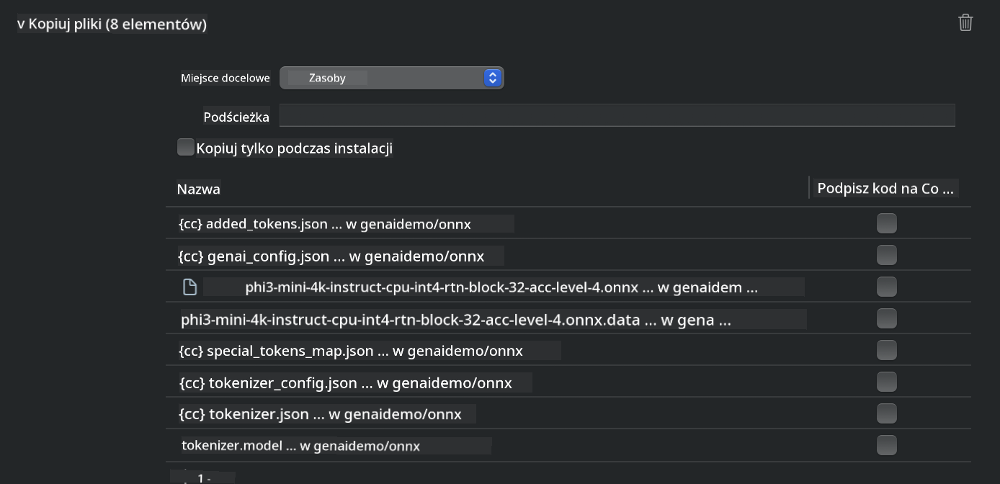
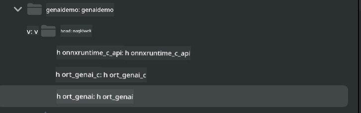
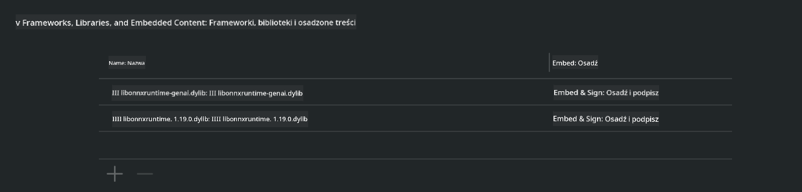
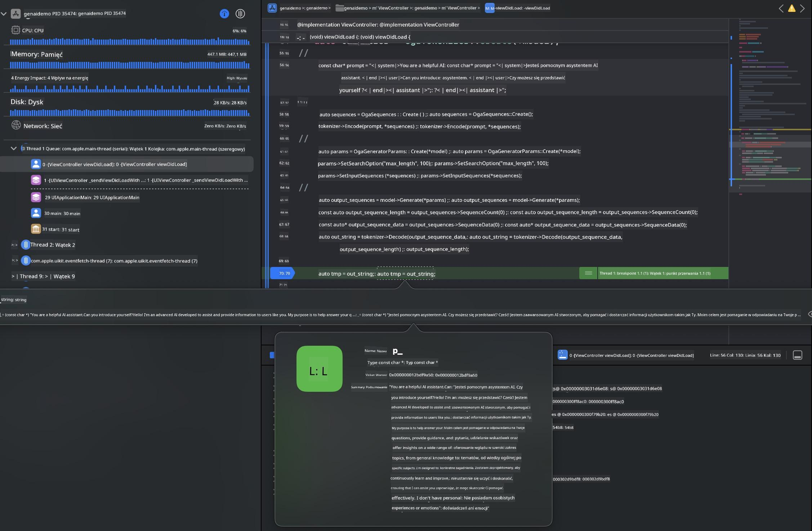

<!--
CO_OP_TRANSLATOR_METADATA:
{
  "original_hash": "82af197df38d25346a98f1f0e84d1698",
  "translation_date": "2025-07-16T20:21:11+00:00",
  "source_file": "md/01.Introduction/03/iOS_Inference.md",
  "language_code": "pl"
}
-->
# **Inference Phi-3 na iOS**

Phi-3-mini to nowa seria modeli od Microsoft, która umożliwia wdrażanie dużych modeli językowych (LLM) na urządzeniach brzegowych i IoT. Phi-3-mini jest dostępny na iOS, Androida oraz urządzenia brzegowe, co pozwala na wdrażanie generatywnej sztucznej inteligencji w środowiskach BYOD. Poniższy przykład pokazuje, jak wdrożyć Phi-3-mini na iOS.

## **1. Przygotowanie**

- **a.** macOS 14+
- **b.** Xcode 15+
- **c.** iOS SDK 17.x (iPhone 14 A16 lub nowszy)
- **d.** Zainstaluj Python 3.10+ (zalecany Conda)
- **e.** Zainstaluj bibliotekę Pythona: `python-flatbuffers`
- **f.** Zainstaluj CMake

### Semantic Kernel i Inference

Semantic Kernel to framework aplikacyjny, który pozwala tworzyć aplikacje kompatybilne z Azure OpenAI Service, modelami OpenAI, a także lokalnymi modelami. Dostęp do lokalnych usług przez Semantic Kernel umożliwia łatwą integrację z własnym serwerem modelu Phi-3-mini.

### Wywoływanie modeli kwantyzowanych za pomocą Ollama lub LlamaEdge

Wielu użytkowników woli korzystać z modeli kwantyzowanych, aby uruchamiać modele lokalnie. [Ollama](https://ollama.com) i [LlamaEdge](https://llamaedge.com) pozwalają na wywoływanie różnych modeli kwantyzowanych:

#### **Ollama**

Możesz uruchomić `ollama run phi3` bezpośrednio lub skonfigurować go offline. Utwórz plik Modelfile z ścieżką do pliku `gguf`. Przykładowy kod uruchamiający kwantyzowany model Phi-3-mini:

```gguf
FROM {Add your gguf file path}
TEMPLATE \"\"\"<|user|> .Prompt<|end|> <|assistant|>\"\"\"
PARAMETER stop <|end|>
PARAMETER num_ctx 4096
```

#### **LlamaEdge**

Jeśli chcesz używać `gguf` jednocześnie w chmurze i na urządzeniach brzegowych, LlamaEdge to świetna opcja.

## **2. Kompilacja ONNX Runtime dla iOS**

```bash

git clone https://github.com/microsoft/onnxruntime.git

cd onnxruntime

./build.sh --build_shared_lib --ios --skip_tests --parallel --build_dir ./build_ios --ios --apple_sysroot iphoneos --osx_arch arm64 --apple_deploy_target 17.5 --cmake_generator Xcode --config Release

cd ../

```

### **Uwaga**

- **a.** Przed kompilacją upewnij się, że Xcode jest poprawnie skonfigurowany i ustaw go jako aktywny katalog deweloperski w terminalu:

    ```bash
    sudo xcode-select -switch /Applications/Xcode.app/Contents/Developer
    ```

- **b.** ONNX Runtime musi być skompilowany dla różnych platform. Dla iOS możesz kompilować dla `arm64` lub `x86_64`.

- **c.** Zaleca się używanie najnowszego iOS SDK do kompilacji. Możesz jednak użyć starszej wersji, jeśli potrzebujesz kompatybilności z wcześniejszymi SDK.

## **3. Kompilacja Generative AI z ONNX Runtime dla iOS**

> **Note:** Ponieważ Generative AI z ONNX Runtime jest w wersji podglądowej, bądź świadomy możliwych zmian.

```bash

git clone https://github.com/microsoft/onnxruntime-genai
 
cd onnxruntime-genai
 
mkdir ort
 
cd ort
 
mkdir include
 
mkdir lib
 
cd ../
 
cp ../onnxruntime/include/onnxruntime/core/session/onnxruntime_c_api.h ort/include
 
cp ../onnxruntime/build_ios/Release/Release-iphoneos/libonnxruntime*.dylib* ort/lib
 
export OPENCV_SKIP_XCODEBUILD_FORCE_TRYCOMPILE_DEBUG=1
 
python3 build.py --parallel --build_dir ./build_ios --ios --ios_sysroot iphoneos --ios_arch arm64 --ios_deployment_target 17.5 --cmake_generator Xcode --cmake_extra_defines CMAKE_XCODE_ATTRIBUTE_CODE_SIGNING_ALLOWED=NO

```

## **4. Utwórz aplikację w Xcode**

Wybrałem Objective-C jako metodę tworzenia aplikacji, ponieważ korzystając z Generative AI z ONNX Runtime C++ API, Objective-C jest lepiej kompatybilny. Oczywiście, możesz też wykonać odpowiednie wywołania przez mostek Swift.


## **5. Skopiuj kwantyzowany model ONNX INT4 do projektu aplikacji**

Musimy zaimportować model kwantyzacji INT4 w formacie ONNX, który należy najpierw pobrać.


Po pobraniu dodaj go do katalogu Resources w projekcie w Xcode.



## **6. Dodanie API C++ w ViewControllers**

> **Uwaga:**

- **a.** Dodaj odpowiednie pliki nagłówkowe C++ do projektu.

  

- **b.** Dołącz dynamiczną bibliotekę `onnxruntime-genai` w Xcode.

  

- **c.** Użyj przykładowego kodu w C do testów. Możesz też dodać dodatkowe funkcje, takie jak ChatUI, dla większej funkcjonalności.

- **d.** Ponieważ w projekcie musisz używać C++, zmień nazwę `ViewController.m` na `ViewController.mm`, aby włączyć wsparcie dla Objective-C++.

```objc

    NSString *llmPath = [[NSBundle mainBundle] resourcePath];
    char const *modelPath = llmPath.cString;

    auto model =  OgaModel::Create(modelPath);

    auto tokenizer = OgaTokenizer::Create(*model);

    const char* prompt = "<|system|>You are a helpful AI assistant.<|end|><|user|>Can you introduce yourself?<|end|><|assistant|>";

    auto sequences = OgaSequences::Create();
    tokenizer->Encode(prompt, *sequences);

    auto params = OgaGeneratorParams::Create(*model);
    params->SetSearchOption("max_length", 100);
    params->SetInputSequences(*sequences);

    auto output_sequences = model->Generate(*params);
    const auto output_sequence_length = output_sequences->SequenceCount(0);
    const auto* output_sequence_data = output_sequences->SequenceData(0);
    auto out_string = tokenizer->Decode(output_sequence_data, output_sequence_length);
    
    auto tmp = out_string;

```

## **7. Uruchomienie aplikacji**

Po zakończeniu konfiguracji możesz uruchomić aplikację, aby zobaczyć wyniki inferencji modelu Phi-3-mini.



Więcej przykładowego kodu i szczegółowe instrukcje znajdziesz w repozytorium [Phi-3 Mini Samples](https://github.com/Azure-Samples/Phi-3MiniSamples/tree/main/ios).

**Zastrzeżenie**:  
Niniejszy dokument został przetłumaczony przy użyciu usługi tłumaczenia AI [Co-op Translator](https://github.com/Azure/co-op-translator). Mimo że dążymy do dokładności, prosimy mieć na uwadze, że automatyczne tłumaczenia mogą zawierać błędy lub nieścisłości. Oryginalny dokument w języku źródłowym powinien być uznawany za źródło autorytatywne. W przypadku informacji o kluczowym znaczeniu zalecane jest skorzystanie z profesjonalnego tłumaczenia wykonanego przez człowieka. Nie ponosimy odpowiedzialności za jakiekolwiek nieporozumienia lub błędne interpretacje wynikające z korzystania z tego tłumaczenia.