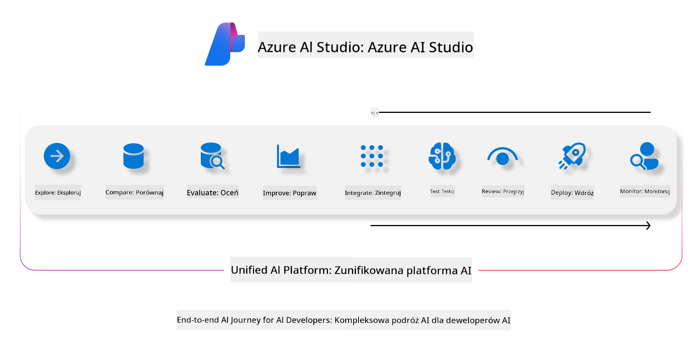
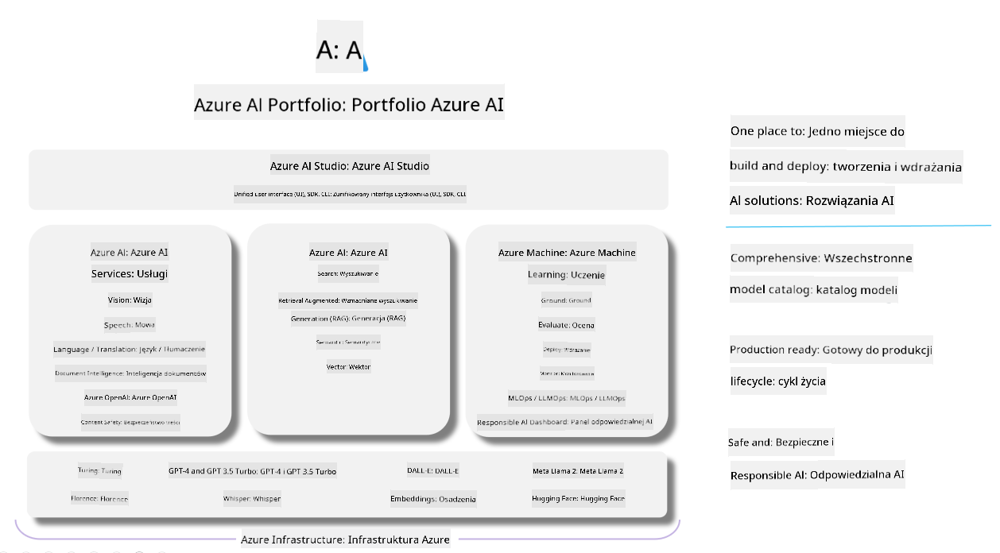

<!--
CO_OP_TRANSLATOR_METADATA:
{
  "original_hash": "7b4235159486df4000e16b7b46ddfec3",
  "translation_date": "2025-05-09T14:56:45+00:00",
  "source_file": "md/01.Introduction/05/AIFoundry.md",
  "language_code": "pl"
}
-->
# **Korzystanie z Azure AI Foundry do oceny**

Jak ocenić swoją aplikację generatywnej AI za pomocą [Azure AI Foundry](https://ai.azure.com?WT.mc_id=aiml-138114-kinfeylo). Niezależnie od tego, czy analizujesz rozmowy jednoetapowe, czy wieloetapowe, Azure AI Foundry oferuje narzędzia do oceny wydajności i bezpieczeństwa modeli.

## Jak oceniać aplikacje generatywnej AI za pomocą Azure AI Foundry
Szczegółowe instrukcje znajdziesz w [Azure AI Foundry Documentation](https://learn.microsoft.com/azure/ai-studio/how-to/evaluate-generative-ai-app?WT.mc_id=aiml-138114-kinfeylo)

Oto kroki, aby zacząć:

## Ocena modeli generatywnej AI w Azure AI Foundry

**Wymagania wstępne**

- Zestaw danych testowych w formacie CSV lub JSON.
- Wdrożony model generatywnej AI (np. Phi-3, GPT 3.5, GPT 4 lub modele Davinci).
- Środowisko wykonawcze z instancją obliczeniową do przeprowadzenia oceny.

## Wbudowane metryki oceny

Azure AI Foundry umożliwia ocenę zarówno rozmów jednoetapowych, jak i złożonych, wieloetapowych.
W scenariuszach Retrieval Augmented Generation (RAG), gdzie model opiera się na określonych danych, możesz ocenić wydajność za pomocą wbudowanych metryk oceny.
Dodatkowo możesz ocenić ogólne scenariusze jednoetapowego odpowiadania na pytania (nie-RAG).

## Tworzenie przebiegu oceny

W interfejsie Azure AI Foundry przejdź do strony Evaluate lub Prompt Flow.
Postępuj zgodnie z kreatorem tworzenia oceny, aby skonfigurować przebieg oceny. Możesz podać opcjonalną nazwę oceny.
Wybierz scenariusz, który odpowiada celom Twojej aplikacji.
Wybierz jedną lub więcej metryk oceny, aby ocenić wyniki modelu.

## Niestandardowy przebieg oceny (opcjonalnie)

Dla większej elastyczności możesz stworzyć niestandardowy przebieg oceny. Dostosuj proces oceny do swoich specyficznych potrzeb.

## Przeglądanie wyników

Po przeprowadzeniu oceny zaloguj się, przeglądaj i analizuj szczegółowe metryki oceny w Azure AI Foundry. Uzyskaj wgląd w możliwości i ograniczenia swojej aplikacji.

**Note** Azure AI Foundry jest obecnie w publicznej wersji preview, więc używaj go do eksperymentów i celów rozwojowych. Do zastosowań produkcyjnych rozważ inne opcje. Zapoznaj się z oficjalną [AI Foundry documentation](https://learn.microsoft.com/azure/ai-studio/?WT.mc_id=aiml-138114-kinfeylo) po więcej szczegółów i instrukcji krok po kroku.

**Zastrzeżenie**:  
Niniejszy dokument został przetłumaczony przy użyciu automatycznej usługi tłumaczeniowej AI [Co-op Translator](https://github.com/Azure/co-op-translator). Mimo że dążymy do dokładności, prosimy pamiętać, że tłumaczenia automatyczne mogą zawierać błędy lub nieścisłości. Oryginalny dokument w jego języku źródłowym powinien być uznawany za autorytatywne źródło. W przypadku informacji krytycznych zaleca się skorzystanie z profesjonalnego tłumaczenia wykonanego przez człowieka. Nie ponosimy odpowiedzialności za jakiekolwiek nieporozumienia lub błędne interpretacje wynikające z użycia tego tłumaczenia.