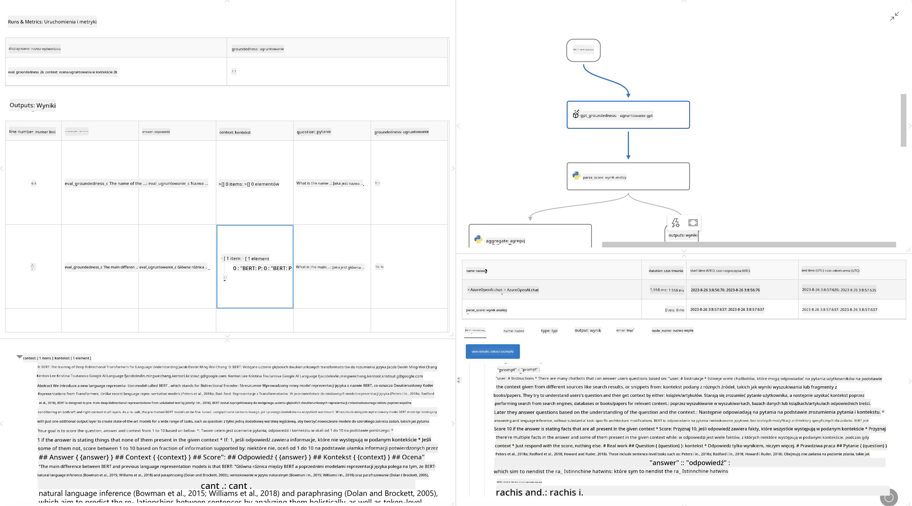

<!--
CO_OP_TRANSLATOR_METADATA:
{
  "original_hash": "3cbe7629d254f1043193b7fe22524d55",
  "translation_date": "2025-07-16T22:40:03+00:00",
  "source_file": "md/01.Introduction/05/Promptflow.md",
  "language_code": "pl"
}
-->
# **Wprowadzenie do Promptflow**

[Microsoft Prompt Flow](https://microsoft.github.io/promptflow/index.html?WT.mc_id=aiml-138114-kinfeylo) to wizualne narzędzie do automatyzacji przepływów pracy, które pozwala użytkownikom tworzyć zautomatyzowane procesy za pomocą gotowych szablonów i niestandardowych konektorów. Zostało zaprojektowane, aby umożliwić programistom i analitykom biznesowym szybkie tworzenie zautomatyzowanych procesów do zadań takich jak zarządzanie danymi, współpraca czy optymalizacja procesów. Dzięki Prompt Flow użytkownicy mogą łatwo łączyć różne usługi, aplikacje i systemy oraz automatyzować złożone procesy biznesowe.

Microsoft Prompt Flow został stworzony, aby usprawnić cały cykl rozwoju aplikacji AI opartych na dużych modelach językowych (LLM). Niezależnie od tego, czy tworzysz pomysły, prototypujesz, testujesz, oceniasz czy wdrażasz aplikacje oparte na LLM, Prompt Flow upraszcza ten proces i pozwala budować aplikacje LLM o jakości produkcyjnej.

## Oto kluczowe funkcje i korzyści korzystania z Microsoft Prompt Flow:

**Interaktywne środowisko tworzenia**

Prompt Flow oferuje wizualną reprezentację struktury Twojego przepływu, co ułatwia zrozumienie i nawigację po projektach.  
Zapewnia doświadczenie podobne do notatnika, co sprzyja efektywnemu tworzeniu i debugowaniu przepływów.

**Warianty promptów i ich dostrajanie**

Twórz i porównuj różne warianty promptów, aby ułatwić iteracyjny proces ich udoskonalania. Oceń skuteczność różnych promptów i wybierz te najefektywniejsze.

**Wbudowane przepływy oceny**  
Oceniaj jakość i skuteczność swoich promptów oraz przepływów za pomocą wbudowanych narzędzi oceniających.  
Dowiedz się, jak dobrze działają Twoje aplikacje oparte na LLM.

**Kompleksowe zasoby**

Prompt Flow zawiera bibliotekę wbudowanych narzędzi, przykładów i szablonów. Te zasoby stanowią punkt wyjścia do rozwoju, inspirują kreatywność i przyspieszają proces.

**Współpraca i gotowość dla przedsiębiorstw**

Wspieraj współpracę zespołową, umożliwiając wielu użytkownikom pracę nad projektami inżynierii promptów.  
Zachowuj kontrolę wersji i efektywnie dziel się wiedzą. Usprawnij cały proces inżynierii promptów – od tworzenia i oceny po wdrożenie i monitorowanie.

## Ocena w Prompt Flow

W Microsoft Prompt Flow ocena odgrywa kluczową rolę w mierzeniu efektywności Twoich modeli AI. Sprawdźmy, jak możesz dostosować przepływy oceny i metryki w Prompt Flow:

**Zrozumienie oceny w Prompt Flow**

W Prompt Flow przepływ to sekwencja węzłów, które przetwarzają dane wejściowe i generują wyjścia. Przepływy oceny to specjalne typy przepływów zaprojektowane do oceny wydajności uruchomienia na podstawie określonych kryteriów i celów.

**Kluczowe cechy przepływów oceny**

Zazwyczaj uruchamiają się po przepływie testowanym, korzystając z jego wyników. Obliczają wyniki lub metryki, które mierzą efektywność testowanego przepływu. Metryki mogą obejmować dokładność, oceny trafności lub inne istotne wskaźniki.

### Dostosowywanie przepływów oceny

**Definiowanie wejść**

Przepływy oceny muszą przyjmować wyniki testowanego uruchomienia. Definiuj wejścia podobnie jak w standardowych przepływach.  
Na przykład, jeśli oceniasz przepływ QnA, nazwij wejście „answer”. Jeśli oceniasz przepływ klasyfikacji, nazwij wejście „category”. Mogą być też potrzebne wejścia z prawdziwymi danymi (np. rzeczywiste etykiety).

**Wyjścia i metryki**

Przepływy oceny generują wyniki mierzące efektywność testowanego przepływu. Metryki można obliczać za pomocą Pythona lub LLM. Użyj funkcji log_metric(), aby zapisać odpowiednie metryki.

**Korzystanie z dostosowanych przepływów oceny**

Stwórz własny przepływ oceny dopasowany do konkretnych zadań i celów. Dostosuj metryki zgodnie z wymaganiami oceny.  
Zastosuj ten spersonalizowany przepływ oceny do uruchomień wsadowych w celu testów na dużą skalę.

## Wbudowane metody oceny

Prompt Flow oferuje również wbudowane metody oceny.  
Możesz przesyłać uruchomienia wsadowe i korzystać z tych metod, aby ocenić, jak dobrze działa Twój przepływ na dużych zbiorach danych.  
Przeglądaj wyniki oceny, porównuj metryki i wprowadzaj poprawki w razie potrzeby.  
Pamiętaj, że ocena jest niezbędna, aby upewnić się, że Twoje modele AI spełniają wymagane kryteria i cele. Zapoznaj się z oficjalną dokumentacją, aby uzyskać szczegółowe instrukcje dotyczące tworzenia i korzystania z przepływów oceny w Microsoft Prompt Flow.

Podsumowując, Microsoft Prompt Flow umożliwia programistom tworzenie wysokiej jakości aplikacji LLM, upraszczając inżynierię promptów i oferując solidne środowisko rozwojowe. Jeśli pracujesz z LLM, Prompt Flow to narzędzie warte poznania. Zapoznaj się z [Prompt Flow Evaluation Documents](https://learn.microsoft.com/azure/machine-learning/prompt-flow/how-to-develop-an-evaluation-flow?view=azureml-api-2?WT.mc_id=aiml-138114-kinfeylo) po szczegółowe instrukcje dotyczące tworzenia i korzystania z przepływów oceny w Microsoft Prompt Flow.

**Zastrzeżenie**:  
Niniejszy dokument został przetłumaczony za pomocą usługi tłumaczenia AI [Co-op Translator](https://github.com/Azure/co-op-translator). Mimo że dążymy do jak największej dokładności, prosimy mieć na uwadze, że tłumaczenia automatyczne mogą zawierać błędy lub nieścisłości. Oryginalny dokument w języku źródłowym powinien być uznawany za źródło autorytatywne. W przypadku informacji o kluczowym znaczeniu zalecane jest skorzystanie z profesjonalnego tłumaczenia wykonanego przez człowieka. Nie ponosimy odpowiedzialności za jakiekolwiek nieporozumienia lub błędne interpretacje wynikające z korzystania z tego tłumaczenia.