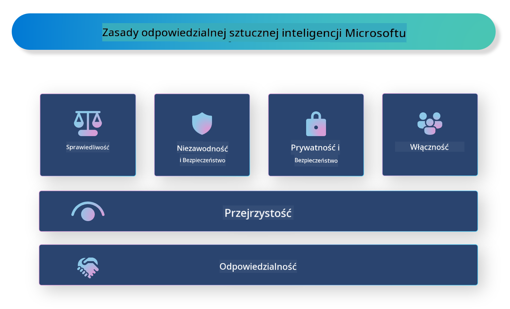

<!--
CO_OP_TRANSLATOR_METADATA:
{
  "original_hash": "805b96b20152936d8f4c587d90d6e06e",
  "translation_date": "2025-05-09T15:31:21+00:00",
  "source_file": "md/01.Introduction/05/ResponsibleAI.md",
  "language_code": "pl"
}
-->
# **Wprowadzenie do Responsible AI**

[Microsoft Responsible AI](https://www.microsoft.com/ai/responsible-ai?WT.mc_id=aiml-138114-kinfeylo) to inicjatywa mająca na celu pomoc deweloperom i organizacjom w tworzeniu systemów AI, które są przejrzyste, godne zaufania i odpowiedzialne. Inicjatywa ta dostarcza wskazówek i zasobów do opracowywania odpowiedzialnych rozwiązań AI, które są zgodne z zasadami etycznymi, takimi jak prywatność, sprawiedliwość i przejrzystość. Omówimy również niektóre wyzwania i najlepsze praktyki związane z budowaniem odpowiedzialnych systemów AI.

## Przegląd Microsoft Responsible AI

**Zasady etyczne**

Microsoft Responsible AI kieruje się zestawem zasad etycznych, takich jak prywatność, sprawiedliwość, przejrzystość, odpowiedzialność i bezpieczeństwo. Zasady te mają na celu zapewnienie, że systemy AI są tworzone w sposób etyczny i odpowiedzialny.

**Przejrzyste AI**

Microsoft Responsible AI podkreśla znaczenie przejrzystości w systemach AI. Obejmuje to dostarczanie jasnych wyjaśnień dotyczących działania modeli AI oraz zapewnienie publicznego dostępu do źródeł danych i algorytmów.

**Odpowiedzialne AI**

[Microsoft Responsible AI](https://www.microsoft.com/ai/responsible-ai?WT.mc_id=aiml-138114-kinfeylo) promuje tworzenie odpowiedzialnych systemów AI, które potrafią dostarczyć informacji o tym, jak modele AI podejmują decyzje. Pomaga to użytkownikom zrozumieć i zaufać wynikom systemów AI.

**Inkluzywność**

Systemy AI powinny być projektowane tak, aby przynosiły korzyści wszystkim. Microsoft dąży do tworzenia inkluzywnej AI, która uwzględnia różnorodne perspektywy i unika uprzedzeń czy dyskryminacji.

**Niezawodność i bezpieczeństwo**

Zapewnienie, że systemy AI są niezawodne i bezpieczne, jest kluczowe. Microsoft skupia się na budowaniu solidnych modeli, które działają konsekwentnie i unikają szkodliwych skutków.

**Sprawiedliwość w AI**

Microsoft Responsible AI zdaje sobie sprawę, że systemy AI mogą utrwalać uprzedzenia, jeśli są trenowane na stronniczych danych lub algorytmach. Inicjatywa dostarcza wskazówek dotyczących tworzenia sprawiedliwych systemów AI, które nie dyskryminują na podstawie takich czynników jak rasa, płeć czy wiek.

**Prywatność i bezpieczeństwo**

Microsoft Responsible AI podkreśla znaczenie ochrony prywatności użytkowników i bezpieczeństwa danych w systemach AI. Obejmuje to stosowanie silnego szyfrowania danych oraz kontroli dostępu, a także regularne audyty systemów AI pod kątem podatności.

**Odpowiedzialność i rozliczalność**

Microsoft Responsible AI promuje odpowiedzialność i rozliczalność w procesie tworzenia i wdrażania AI. Obejmuje to zapewnienie, że deweloperzy i organizacje są świadomi potencjalnych ryzyk związanych z systemami AI i podejmują działania mające na celu ich minimalizację.

## Najlepsze praktyki w budowaniu odpowiedzialnych systemów AI

**Twórz modele AI wykorzystujące zróżnicowane zestawy danych**

Aby uniknąć uprzedzeń w systemach AI, ważne jest korzystanie z różnorodnych danych, które odzwierciedlają szeroki zakres perspektyw i doświadczeń.

**Stosuj techniki wyjaśnialnej AI**

Techniki wyjaśnialnej AI pomagają użytkownikom zrozumieć, jak modele AI podejmują decyzje, co zwiększa zaufanie do systemu.

**Regularnie audytuj systemy AI pod kątem podatności**

Regularne audyty systemów AI pomagają wykryć potencjalne ryzyka i słabe punkty, które wymagają poprawy.

**Stosuj silne szyfrowanie danych i kontrolę dostępu**

Szyfrowanie danych i kontrola dostępu pomagają chronić prywatność i bezpieczeństwo użytkowników systemów AI.

**Przestrzegaj zasad etycznych w tworzeniu AI**

Przestrzeganie zasad etycznych, takich jak sprawiedliwość, przejrzystość i odpowiedzialność, pomaga budować zaufanie do systemów AI i zapewnia, że są one tworzone w sposób odpowiedzialny.

## Korzystanie z AI Foundry dla Responsible AI

[Azure AI Foundry](https://ai.azure.com?WT.mc_id=aiml-138114-kinfeylo) to potężna platforma umożliwiająca deweloperom i organizacjom szybkie tworzenie inteligentnych, nowoczesnych, gotowych do wdrożenia i odpowiedzialnych aplikacji. Oto kilka kluczowych funkcji i możliwości Azure AI Foundry:

**Gotowe do użycia API i modele**

Azure AI Foundry oferuje gotowe i konfigurowalne API oraz modele obejmujące szeroki zakres zadań AI, w tym generatywną AI, przetwarzanie języka naturalnego w konwersacjach, wyszukiwanie, monitorowanie, tłumaczenie, mowę, wizję oraz podejmowanie decyzji.

**Prompt Flow**

Prompt Flow w Azure AI Foundry pozwala tworzyć doświadczenia konwersacyjne AI. Umożliwia projektowanie i zarządzanie przepływami konwersacji, co ułatwia budowę chatbotów, asystentów wirtualnych i innych interaktywnych aplikacji.

**Retrieval Augmented Generation (RAG)**

RAG to technika łącząca podejścia oparte na wyszukiwaniu i generowaniu. Poprawia jakość generowanych odpowiedzi, wykorzystując zarówno istniejącą wiedzę (wyszukiwanie), jak i kreatywne generowanie (generacja).

**Metryki oceny i monitorowania generatywnej AI**

Azure AI Foundry dostarcza narzędzi do oceny i monitorowania modeli generatywnej AI. Możesz ocenić ich wydajność, sprawiedliwość i inne istotne metryki, aby zapewnić odpowiedzialne wdrożenie. Dodatkowo, jeśli stworzyłeś dashboard, możesz użyć interfejsu bez kodu w Azure Machine Learning Studio do dostosowania i wygenerowania Responsible AI Dashboard oraz powiązanego scorecard opartego na [Responsible AI Toolbox](https://responsibleaitoolbox.ai/?WT.mc_id=aiml-138114-kinfeylo) Python Libraries. Scorecard pomaga dzielić się kluczowymi spostrzeżeniami dotyczącymi sprawiedliwości, ważności cech i innych aspektów odpowiedzialnego wdrożenia zarówno z interesariuszami technicznymi, jak i nietechnicznymi.

Aby korzystać z AI Foundry w kontekście Responsible AI, możesz stosować następujące najlepsze praktyki:

**Zdefiniuj problem i cele systemu AI**

Przed rozpoczęciem procesu tworzenia ważne jest jasne określenie problemu lub celu, który ma rozwiązać Twój system AI. Pomoże to zidentyfikować dane, algorytmy i zasoby potrzebne do zbudowania skutecznego modelu.

**Zbierz i przetwórz odpowiednie dane**

Jakość i ilość danych użytych do trenowania systemu AI mają istotny wpływ na jego działanie. Dlatego ważne jest zebranie odpowiednich danych, ich oczyszczenie, przetworzenie i zapewnienie, że reprezentują populację lub problem, który chcesz rozwiązać.

**Wybierz odpowiednią metodę oceny**

Dostępne są różne algorytmy oceny. Ważne jest, aby wybrać najbardziej odpowiedni algorytm na podstawie Twoich danych i problemu.

**Oceń i zinterpretuj model**

Po zbudowaniu modelu AI ważne jest ocenienie jego działania za pomocą odpowiednich metryk oraz przejrzysta interpretacja wyników. Pomoże to wykryć ewentualne uprzedzenia lub ograniczenia modelu i wprowadzić niezbędne ulepszenia.

**Zapewnij przejrzystość i wyjaśnialność**

Systemy AI powinny być przejrzyste i wyjaśnialne, aby użytkownicy mogli zrozumieć, jak działają i jak podejmowane są decyzje. Jest to szczególnie ważne w aplikacjach mających istotny wpływ na życie ludzi, takich jak opieka zdrowotna, finanse czy systemy prawne.

**Monitoruj i aktualizuj model**

Systemy AI powinny być nieustannie monitorowane i aktualizowane, aby zachować dokładność i skuteczność w czasie. Wymaga to ciągłej konserwacji, testowania i ponownego trenowania modelu.

Podsumowując, Microsoft Responsible AI to inicjatywa mająca na celu pomoc deweloperom i organizacjom w tworzeniu systemów AI, które są przejrzyste, godne zaufania i odpowiedzialne. Pamiętaj, że wdrożenie odpowiedzialnej AI jest kluczowe, a Azure AI Foundry ma na celu uczynienie tego praktycznym dla organizacji. Przestrzegając zasad etycznych i najlepszych praktyk, możemy zapewnić, że systemy AI będą tworzone i wdrażane w sposób odpowiedzialny, przynoszący korzyści całemu społeczeństwu.

**Zastrzeżenie**:  
Niniejszy dokument został przetłumaczony za pomocą usługi tłumaczenia AI [Co-op Translator](https://github.com/Azure/co-op-translator). Mimo że dążymy do jak największej dokładności, prosimy mieć na uwadze, że automatyczne tłumaczenia mogą zawierać błędy lub niedokładności. Oryginalny dokument w języku źródłowym należy traktować jako źródło wiarygodne. W przypadku informacji krytycznych zalecane jest skorzystanie z profesjonalnego tłumaczenia wykonanego przez człowieka. Nie ponosimy odpowiedzialności za jakiekolwiek nieporozumienia lub błędne interpretacje wynikające z korzystania z tego tłumaczenia.