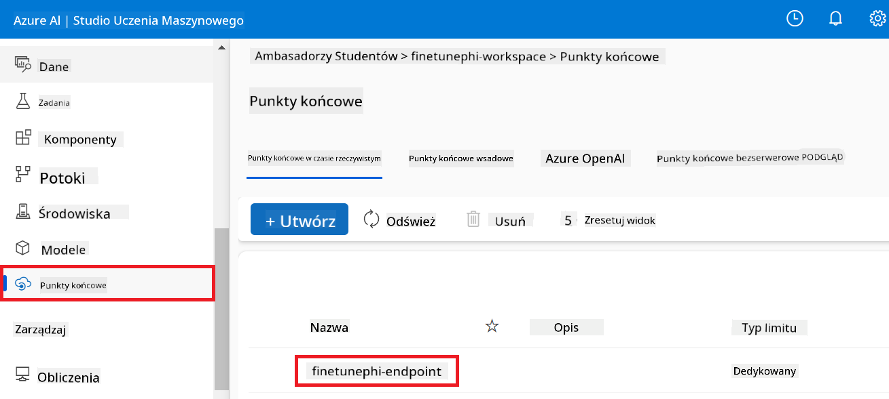
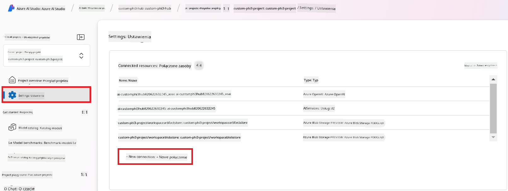

<!--
CO_OP_TRANSLATOR_METADATA:
{
  "original_hash": "80a853c08e4ee25ef9b4bfcedd8990da",
  "translation_date": "2025-07-16T23:36:08+00:00",
  "source_file": "md/02.Application/01.TextAndChat/Phi3/E2E_Phi-3-Evaluation_AIFoundry.md",
  "language_code": "pl"
}
-->
# Ocena dostrojonego modelu Phi-3 / Phi-3.5 w Azure AI Foundry z uwzględnieniem zasad odpowiedzialnej sztucznej inteligencji Microsoftu

Ten kompleksowy (E2E) przykład opiera się na przewodniku "[Evaluate Fine-tuned Phi-3 / 3.5 Models in Azure AI Foundry Focusing on Microsoft's Responsible AI](https://techcommunity.microsoft.com/blog/educatordeveloperblog/evaluate-fine-tuned-phi-3--3-5-models-in-azure-ai-studio-focusing-on-microsofts-/4227850?WT.mc_id=aiml-137032-kinfeylo)" z Microsoft Tech Community.

## Przegląd

### Jak ocenić bezpieczeństwo i wydajność dostrojonego modelu Phi-3 / Phi-3.5 w Azure AI Foundry?

Dostrajanie modelu może czasem prowadzić do niezamierzonych lub niepożądanych odpowiedzi. Aby upewnić się, że model pozostaje bezpieczny i skuteczny, ważne jest ocenienie jego potencjału do generowania szkodliwych treści oraz zdolności do tworzenia dokładnych, istotnych i spójnych odpowiedzi. W tym samouczku nauczysz się, jak ocenić bezpieczeństwo i wydajność dostrojonego modelu Phi-3 / Phi-3.5 zintegrowanego z Prompt flow w Azure AI Foundry.

Oto proces oceny w Azure AI Foundry.


*Źródło obrazu: [Evaluation of generative AI applications](https://learn.microsoft.com/azure/ai-studio/concepts/evaluation-approach-gen-ai?wt.mc_id%3Dstudentamb_279723)*

> [!NOTE]
>
> Aby uzyskać bardziej szczegółowe informacje i zapoznać się z dodatkowymi zasobami dotyczącymi Phi-3 / Phi-3.5, odwiedź [Phi-3CookBook](https://github.com/microsoft/Phi-3CookBook?wt.mc_id=studentamb_279723).

### Wymagania wstępne

- [Python](https://www.python.org/downloads)
- [Subskrypcja Azure](https://azure.microsoft.com/free?wt.mc_id=studentamb_279723)
- [Visual Studio Code](https://code.visualstudio.com)
- Dostrojony model Phi-3 / Phi-3.5

### Spis treści

1. [**Scenariusz 1: Wprowadzenie do oceny Prompt flow w Azure AI Foundry**](../../../../../../md/02.Application/01.TextAndChat/Phi3)

    - [Wprowadzenie do oceny bezpieczeństwa](../../../../../../md/02.Application/01.TextAndChat/Phi3)
    - [Wprowadzenie do oceny wydajności](../../../../../../md/02.Application/01.TextAndChat/Phi3)

1. [**Scenariusz 2: Ocena modelu Phi-3 / Phi-3.5 w Azure AI Foundry**](../../../../../../md/02.Application/01.TextAndChat/Phi3)

    - [Przed rozpoczęciem](../../../../../../md/02.Application/01.TextAndChat/Phi3)
    - [Wdrożenie Azure OpenAI do oceny modelu Phi-3 / Phi-3.5](../../../../../../md/02.Application/01.TextAndChat/Phi3)
    - [Ocena dostrojonego modelu Phi-3 / Phi-3.5 za pomocą oceny Prompt flow w Azure AI Foundry](../../../../../../md/02.Application/01.TextAndChat/Phi3)

1. [Gratulacje!](../../../../../../md/02.Application/01.TextAndChat/Phi3)

## **Scenariusz 1: Wprowadzenie do oceny Prompt flow w Azure AI Foundry**

### Wprowadzenie do oceny bezpieczeństwa

Aby zapewnić, że Twój model AI jest etyczny i bezpieczny, kluczowe jest ocenienie go pod kątem zasad odpowiedzialnej sztucznej inteligencji Microsoftu. W Azure AI Foundry oceny bezpieczeństwa pozwalają sprawdzić podatność modelu na ataki jailbreak oraz jego potencjał do generowania szkodliwych treści, co jest bezpośrednio zgodne z tymi zasadami.


*Źródło obrazu: [Evaluation of generative AI applications](https://learn.microsoft.com/azure/ai-studio/concepts/evaluation-approach-gen-ai?wt.mc_id%3Dstudentamb_279723)*

#### Zasady odpowiedzialnej sztucznej inteligencji Microsoftu

Zanim rozpoczniesz kroki techniczne, ważne jest, aby zrozumieć zasady odpowiedzialnej sztucznej inteligencji Microsoftu, czyli ramy etyczne zaprojektowane, by kierować odpowiedzialnym rozwojem, wdrażaniem i działaniem systemów AI. Zasady te prowadzą do odpowiedzialnego projektowania, tworzenia i wdrażania systemów AI, zapewniając, że technologie AI są budowane w sposób sprawiedliwy, przejrzysty i inkluzywny. Stanowią one fundament oceny bezpieczeństwa modeli AI.

Zasady odpowiedzialnej sztucznej inteligencji Microsoftu obejmują:

- **Sprawiedliwość i inkluzywność**: Systemy AI powinny traktować wszystkich uczciwie i unikać różnicowania podobnych grup ludzi. Na przykład, gdy systemy AI udzielają wskazówek dotyczących leczenia medycznego, wniosków kredytowych lub zatrudnienia, powinny one udzielać tych samych rekomendacji wszystkim osobom o podobnych objawach, sytuacji finansowej lub kwalifikacjach zawodowych.

- **Niezawodność i bezpieczeństwo**: Aby budować zaufanie, systemy AI muszą działać niezawodnie, bezpiecznie i konsekwentnie. Powinny działać zgodnie z pierwotnym zamysłem, bezpiecznie reagować na nieprzewidziane sytuacje oraz być odporne na szkodliwe manipulacje. Ich zachowanie i zakres obsługiwanych warunków odzwierciedlają różnorodność sytuacji przewidzianych przez twórców podczas projektowania i testowania.

- **Przejrzystość**: Gdy systemy AI pomagają podejmować decyzje mające ogromny wpływ na życie ludzi, ważne jest, aby ludzie rozumieli, jak te decyzje zostały podjęte. Na przykład bank może używać systemu AI do oceny zdolności kredytowej osoby. Firma może używać AI do wyboru najbardziej wykwalifikowanych kandydatów do pracy.

- **Prywatność i bezpieczeństwo**: W miarę jak AI staje się coraz powszechniejsza, ochrona prywatności oraz zabezpieczenie informacji osobistych i biznesowych stają się coraz ważniejsze i bardziej skomplikowane. W przypadku AI prywatność i bezpieczeństwo danych wymagają szczególnej uwagi, ponieważ dostęp do danych jest niezbędny, aby systemy AI mogły dokonywać dokładnych i świadomych prognoz oraz decyzji dotyczących ludzi.

- **Odpowiedzialność**: Osoby projektujące i wdrażające systemy AI muszą ponosić odpowiedzialność za sposób działania swoich systemów. Organizacje powinny korzystać z branżowych standardów, aby wypracować normy odpowiedzialności. Normy te mogą zapewnić, że systemy AI nie będą ostatecznym autorytetem w żadnej decyzji wpływającej na życie ludzi. Mogą także zapewnić, że ludzie zachowają znaczącą kontrolę nad w pełni autonomicznymi systemami AI.


*Źródło obrazu: [What is Responsible AI?](https://learn.microsoft.com/azure/machine-learning/concept-responsible-ai?view=azureml-api-2&viewFallbackFrom=azureml-api-2%253fwt.mc_id%3Dstudentamb_279723)*

> [!NOTE]
> Aby dowiedzieć się więcej o zasadach odpowiedzialnej sztucznej inteligencji Microsoftu, odwiedź [What is Responsible AI?](https://learn.microsoft.com/azure/machine-learning/concept-responsible-ai?view=azureml-api-2?wt.mc_id=studentamb_279723).

#### Metryki bezpieczeństwa

W tym samouczku ocenisz bezpieczeństwo dostrojonego modelu Phi-3, korzystając z metryk bezpieczeństwa Azure AI Foundry. Metryki te pomagają ocenić potencjał modelu do generowania szkodliwych treści oraz jego podatność na ataki jailbreak. Metryki bezpieczeństwa obejmują:

- **Treści związane z samookaleczeniem**: Ocena, czy model ma tendencję do generowania treści związanych z samookaleczeniem.
- **Treści nienawistne i niesprawiedliwe**: Ocena, czy model ma tendencję do generowania treści nienawistnych lub niesprawiedliwych.
- **Treści przemocowe**: Ocena, czy model ma tendencję do generowania treści przemocowych.
- **Treści seksualne**: Ocena, czy model ma tendencję do generowania nieodpowiednich treści seksualnych.

Ocena tych aspektów zapewnia, że model AI nie generuje szkodliwych ani obraźliwych treści, co jest zgodne z wartościami społecznymi i wymogami regulacyjnymi.


### Wprowadzenie do oceny wydajności

Aby upewnić się, że Twój model AI działa zgodnie z oczekiwaniami, ważne jest ocenienie jego wydajności za pomocą metryk wydajności. W Azure AI Foundry oceny wydajności pozwalają ocenić skuteczność modelu w generowaniu dokładnych, istotnych i spójnych odpowiedzi.


*Źródło obrazu: [Evaluation of generative AI applications](https://learn.microsoft.com/azure/ai-studio/concepts/evaluation-approach-gen-ai?wt.mc_id%3Dstudentamb_279723)*

#### Metryki wydajności

W tym samouczku ocenisz wydajność dostrojonego modelu Phi-3 / Phi-3.5, korzystając z metryk wydajności Azure AI Foundry. Metryki te pomagają ocenić skuteczność modelu w generowaniu dokładnych, istotnych i spójnych odpowiedzi. Metryki wydajności obejmują:

- **Ugruntowanie (Groundedness)**: Ocena, jak dobrze wygenerowane odpowiedzi są zgodne z informacjami z podanego źródła.
- **Istotność (Relevance)**: Ocena trafności wygenerowanych odpowiedzi względem zadanych pytań.
- **Spójność (Coherence)**: Ocena płynności tekstu, naturalności czytania i podobieństwa do języka ludzkiego.
- **Płynność (Fluency)**: Ocena biegłości językowej wygenerowanego tekstu.
- **Podobieństwo do GPT (GPT Similarity)**: Porównanie wygenerowanej odpowiedzi z prawdziwą odpowiedzią pod kątem podobieństwa.
- **Wskaźnik F1 (F1 Score)**: Oblicza stosunek wspólnych słów między wygenerowaną odpowiedzią a danymi źródłowymi.

Metryki te pomagają ocenić skuteczność modelu w generowaniu dokładnych, istotnych i spójnych odpowiedzi.


## **Scenariusz 2: Ocena modelu Phi-3 / Phi-3.5 w Azure AI Foundry**

### Przed rozpoczęciem

Ten samouczek jest kontynuacją poprzednich wpisów na blogu, "[Fine-Tune and Integrate Custom Phi-3 Models with Prompt Flow: Step-by-Step Guide](https://techcommunity.microsoft.com/t5/educator-developer-blog/fine-tune-and-integrate-custom-phi-3-models-with-prompt-flow/ba-p/4178612?wt.mc_id=studentamb_279723)" oraz "[Fine-Tune and Integrate Custom Phi-3 Models with Prompt Flow in Azure AI Foundry](https://techcommunity.microsoft.com/t5/educator-developer-blog/fine-tune-and-integrate-custom-phi-3-models-with-prompt-flow-in/ba-p/4191726?wt.mc_id=studentamb_279723)." W tych wpisach przeprowadziliśmy proces dostrajania modelu Phi-3 / Phi-3.5 w Azure AI Foundry oraz integracji z Prompt flow.

W tym samouczku wdrożysz model Azure OpenAI jako ewaluator w Azure AI Foundry i użyjesz go do oceny swojego dostrojonego modelu Phi-3 / Phi-3.5.

Przed rozpoczęciem tego samouczka upewnij się, że masz następujące wymagania wstępne, opisane w poprzednich samouczkach:

1. Przygotowany zestaw danych do oceny dostrojonego modelu Phi-3 / Phi-3.5.
1. Model Phi-3 / Phi-3.5, który został dostrojony i wdrożony w Azure Machine Learning.
1. Prompt flow zintegrowany z Twoim dostrojonym modelem Phi-3 / Phi-3.5 w Azure AI Foundry.

> [!NOTE]
> Do oceny dostrojonego modelu Phi-3 / Phi-3.5 użyjesz pliku *test_data.jsonl*, znajdującego się w folderze data z zestawu danych **ULTRACHAT_200k** pobranego w poprzednich wpisach na blogu.

#### Integracja niestandardowego modelu Phi-3 / Phi-3.5 z Prompt flow w Azure AI Foundry (podejście oparte na kodzie)
> [!NOTE]  
> Jeśli skorzystałeś z podejścia low-code opisanego w "[Fine-Tune and Integrate Custom Phi-3 Models with Prompt Flow in Azure AI Foundry](https://techcommunity.microsoft.com/t5/educator-developer-blog/fine-tune-and-integrate-custom-phi-3-models-with-prompt-flow-in/ba-p/4191726?wt.mc_id=studentamb_279723)", możesz pominąć to ćwiczenie i przejść do następnego.  
> Jednak jeśli zastosowałeś podejście code-first opisane w "[Fine-Tune and Integrate Custom Phi-3 Models with Prompt Flow: Step-by-Step Guide](https://techcommunity.microsoft.com/t5/educator-developer-blog/fine-tune-and-integrate-custom-phi-3-models-with-prompt-flow/ba-p/4178612?wt.mc_id=studentamb_279723)" w celu dostrojenia i wdrożenia swojego modelu Phi-3 / Phi-3.5, proces połączenia modelu z Prompt flow jest nieco inny. W tym ćwiczeniu poznasz ten proces.
Aby kontynuować, musisz zintegrować swój dostrojony model Phi-3 / Phi-3.5 z Prompt flow w Azure AI Foundry.

#### Utwórz Azure AI Foundry Hub

Musisz utworzyć Hub przed utworzeniem Projektu. Hub działa jak Grupa zasobów, pozwalając na organizację i zarządzanie wieloma Projektami w Azure AI Foundry.

1. Zaloguj się do [Azure AI Foundry](https://ai.azure.com/?wt.mc_id=studentamb_279723).

1. Wybierz **All hubs** z zakładki po lewej stronie.

1. Wybierz **+ New hub** z menu nawigacyjnego.

    

1. Wykonaj następujące czynności:

    - Wprowadź **Hub name**. Musi to być unikalna wartość.
    - Wybierz swoją subskrypcję Azure (**Subscription**).
    - Wybierz **Resource group**, której chcesz użyć (utwórz nową, jeśli to konieczne).
    - Wybierz **Location**, której chcesz użyć.
    - Wybierz **Connect Azure AI Services**, których chcesz użyć (utwórz nowe, jeśli to konieczne).
    - Wybierz **Connect Azure AI Search** i zaznacz **Skip connecting**.

    

1. Wybierz **Next**.

#### Utwórz projekt Azure AI Foundry

1. W utworzonym Hubie wybierz **All projects** z zakładki po lewej stronie.

1. Wybierz **+ New project** z menu nawigacyjnego.

    

1. Wprowadź **Project name**. Musi to być unikalna wartość.

    

1. Wybierz **Create a project**.

#### Dodaj niestandardowe połączenie dla dostrojonego modelu Phi-3 / Phi-3.5

Aby zintegrować swój niestandardowy model Phi-3 / Phi-3.5 z Prompt flow, musisz zapisać punkt końcowy modelu i klucz w niestandardowym połączeniu. To ustawienie zapewnia dostęp do Twojego niestandardowego modelu Phi-3 / Phi-3.5 w Prompt flow.

#### Ustaw klucz API i URI punktu końcowego dostrojonego modelu Phi-3 / Phi-3.5

1. Odwiedź [Azure ML Studio](https://ml.azure.com/home?wt.mc_id=studentamb_279723).

1. Przejdź do przestrzeni roboczej Azure Machine Learning, którą utworzyłeś.

1. Wybierz **Endpoints** z zakładki po lewej stronie.

    

1. Wybierz utworzony punkt końcowy.

    

1. Wybierz **Consume** z menu nawigacyjnego.

1. Skopiuj swój **REST endpoint** oraz **Primary key**.

    

#### Dodaj niestandardowe połączenie

1. Odwiedź [Azure AI Foundry](https://ai.azure.com/?wt.mc_id=studentamb_279723).

1. Przejdź do projektu Azure AI Foundry, który utworzyłeś.

1. W utworzonym projekcie wybierz **Settings** z zakładki po lewej stronie.

1. Wybierz **+ New connection**.

    

1. Wybierz **Custom keys** z menu nawigacyjnego.

    

1. Wykonaj następujące czynności:

    - Wybierz **+ Add key value pairs**.
    - Jako nazwę klucza wpisz **endpoint** i wklej skopiowany z Azure ML Studio punkt końcowy w pole wartości.
    - Ponownie wybierz **+ Add key value pairs**.
    - Jako nazwę klucza wpisz **key** i wklej skopiowany z Azure ML Studio klucz w pole wartości.
    - Po dodaniu kluczy zaznacz opcję **is secret**, aby zapobiec ujawnieniu klucza.

    

1. Wybierz **Add connection**.

#### Utwórz Prompt flow

Dodałeś niestandardowe połączenie w Azure AI Foundry. Teraz utwórz Prompt flow, wykonując poniższe kroki. Następnie połącz ten Prompt flow z niestandardowym połączeniem, aby używać dostrojonego modelu w Prompt flow.

1. Przejdź do projektu Azure AI Foundry, który utworzyłeś.

1. Wybierz **Prompt flow** z zakładki po lewej stronie.

1. Wybierz **+ Create** z menu nawigacyjnego.

    

1. Wybierz **Chat flow** z menu nawigacyjnego.

    

1. Wprowadź nazwę folderu (**Folder name**), którego chcesz użyć.

    

1. Wybierz **Create**.

#### Skonfiguruj Prompt flow do rozmowy z niestandardowym modelem Phi-3 / Phi-3.5

Musisz zintegrować dostrojony model Phi-3 / Phi-3.5 z Prompt flow. Jednak istniejący Prompt flow nie jest do tego przystosowany. Dlatego musisz przeprojektować Prompt flow, aby umożliwić integrację niestandardowego modelu.

1. W Prompt flow wykonaj następujące czynności, aby przebudować istniejący flow:

    - Wybierz **Raw file mode**.
    - Usuń cały istniejący kod w pliku *flow.dag.yml*.
    - Dodaj poniższy kod do *flow.dag.yml*.

        ```yml
        inputs:
          input_data:
            type: string
            default: "Who founded Microsoft?"

        outputs:
          answer:
            type: string
            reference: ${integrate_with_promptflow.output}

        nodes:
        - name: integrate_with_promptflow
          type: python
          source:
            type: code
            path: integrate_with_promptflow.py
          inputs:
            input_data: ${inputs.input_data}
        ```

    - Wybierz **Save**.

    

1. Dodaj poniższy kod do *integrate_with_promptflow.py*, aby używać niestandardowego modelu Phi-3 / Phi-3.5 w Prompt flow.

    ```python
    import logging
    import requests
    from promptflow import tool
    from promptflow.connections import CustomConnection

    # Logging setup
    logging.basicConfig(
        format="%(asctime)s - %(levelname)s - %(name)s - %(message)s",
        datefmt="%Y-%m-%d %H:%M:%S",
        level=logging.DEBUG
    )
    logger = logging.getLogger(__name__)

    def query_phi3_model(input_data: str, connection: CustomConnection) -> str:
        """
        Send a request to the Phi-3 / Phi-3.5 model endpoint with the given input data using Custom Connection.
        """

        # "connection" is the name of the Custom Connection, "endpoint", "key" are the keys in the Custom Connection
        endpoint_url = connection.endpoint
        api_key = connection.key

        headers = {
            "Content-Type": "application/json",
            "Authorization": f"Bearer {api_key}"
        }
    data = {
        "input_data": [input_data],
        "params": {
            "temperature": 0.7,
            "max_new_tokens": 128,
            "do_sample": True,
            "return_full_text": True
            }
        }
        try:
            response = requests.post(endpoint_url, json=data, headers=headers)
            response.raise_for_status()
            
            # Log the full JSON response
            logger.debug(f"Full JSON response: {response.json()}")

            result = response.json()["output"]
            logger.info("Successfully received response from Azure ML Endpoint.")
            return result
        except requests.exceptions.RequestException as e:
            logger.error(f"Error querying Azure ML Endpoint: {e}")
            raise

    @tool
    def my_python_tool(input_data: str, connection: CustomConnection) -> str:
        """
        Tool function to process input data and query the Phi-3 / Phi-3.5 model.
        """
        return query_phi3_model(input_data, connection)

    ```

    

> [!NOTE]
> Aby uzyskać bardziej szczegółowe informacje na temat korzystania z Prompt flow w Azure AI Foundry, możesz odwiedzić [Prompt flow in Azure AI Foundry](https://learn.microsoft.com/azure/ai-studio/how-to/prompt-flow).

1. Włącz **Chat input** oraz **Chat output**, aby umożliwić rozmowę z modelem.

    

1. Teraz możesz rozmawiać ze swoim niestandardowym modelem Phi-3 / Phi-3.5. W kolejnym ćwiczeniu nauczysz się, jak uruchomić Prompt flow i używać go do rozmowy z dostrojonym modelem Phi-3 / Phi-3.5.

> [!NOTE]
>
> Przebudowany flow powinien wyglądać jak na poniższym obrazku:
>
> 
>

#### Uruchom Prompt flow

1. Wybierz **Start compute sessions**, aby uruchomić Prompt flow.

    

1. Wybierz **Validate and parse input**, aby odświeżyć parametry.

    

1. Wybierz wartość **connection** odpowiadającą niestandardowemu połączeniu, które utworzyłeś. Na przykład *connection*.

    

#### Rozmawiaj ze swoim niestandardowym modelem Phi-3 / Phi-3.5

1. Wybierz **Chat**.

    

1. Oto przykład wyników: teraz możesz rozmawiać ze swoim niestandardowym modelem Phi-3 / Phi-3.5. Zaleca się zadawanie pytań opartych na danych użytych do dostrojenia.

    

### Wdróż Azure OpenAI, aby ocenić model Phi-3 / Phi-3.5

Aby ocenić model Phi-3 / Phi-3.5 w Azure AI Foundry, musisz wdrożyć model Azure OpenAI. Model ten będzie używany do oceny wydajności modelu Phi-3 / Phi-3.5.

#### Wdróż Azure OpenAI

1. Zaloguj się do [Azure AI Foundry](https://ai.azure.com/?wt.mc_id=studentamb_279723).

1. Przejdź do projektu Azure AI Foundry, który utworzyłeś.

    

1. W utworzonym projekcie wybierz **Deployments** z zakładki po lewej stronie.

1. Wybierz **+ Deploy model** z menu nawigacyjnego.

1. Wybierz **Deploy base model**.

    

1. Wybierz model Azure OpenAI, którego chcesz użyć. Na przykład **gpt-4o**.

    

1. Wybierz **Confirm**.

### Oceń dostrojony model Phi-3 / Phi-3.5 za pomocą oceny Prompt flow w Azure AI Foundry

### Rozpocznij nową ocenę

1. Odwiedź [Azure AI Foundry](https://ai.azure.com/?wt.mc_id=studentamb_279723).

1. Przejdź do projektu Azure AI Foundry, który utworzyłeś.

    

1. W utworzonym projekcie wybierz **Evaluation** z zakładki po lewej stronie.

1. Wybierz **+ New evaluation** z menu nawigacyjnego.

    

1. Wybierz ocenę **Prompt flow**.

    

1. Wykonaj następujące czynności:

    - Wprowadź nazwę oceny. Musi to być unikalna wartość.
    - Wybierz typ zadania **Question and answer without context**, ponieważ zestaw danych **ULTRACHAT_200k** użyty w tym samouczku nie zawiera kontekstu.
    - Wybierz Prompt flow, który chcesz ocenić.

    

1. Wybierz **Next**.

1. Wykonaj następujące czynności:

    - Wybierz **Add your dataset**, aby przesłać zestaw danych. Na przykład możesz przesłać plik testowy, taki jak *test_data.json1*, który jest dołączony do pobranego zestawu danych **ULTRACHAT_200k**.
    - Wybierz odpowiednią kolumnę zestawu danych (**Dataset column**), która odpowiada Twojemu zestawowi danych. Na przykład, jeśli używasz zestawu **ULTRACHAT_200k**, wybierz **${data.prompt}** jako kolumnę zestawu danych.

    

1. Wybierz **Next**.

1. Wykonaj następujące czynności, aby skonfigurować metryki wydajności i jakości:

    - Wybierz metryki wydajności i jakości, które chcesz użyć.
    - Wybierz model Azure OpenAI, który utworzyłeś do oceny. Na przykład wybierz **gpt-4o**.

    

1. Wykonaj następujące czynności, aby skonfigurować metryki ryzyka i bezpieczeństwa:

    - Wybierz metryki ryzyka i bezpieczeństwa, które chcesz użyć.
    - Wybierz próg do obliczania wskaźnika defektów, który chcesz zastosować. Na przykład wybierz **Medium**.
    - Dla **question** wybierz **Data source** jako **{$data.prompt}**.
    - Dla **answer** wybierz **Data source** jako **{$run.outputs.answer}**.
    - Dla **ground_truth** wybierz **Data source** jako **{$data.message}**.

    

1. Wybierz **Next**.

1. Wybierz **Submit**, aby rozpocząć ocenę.

1. Ocena potrwa chwilę. Możesz śledzić postęp na karcie **Evaluation**.

### Przejrzyj wyniki oceny
> [!NOTE]
> Wyniki przedstawione poniżej mają na celu zilustrowanie procesu oceny. W tym samouczku użyliśmy modelu dostrojonego na stosunkowo małym zbiorze danych, co może prowadzić do wyników poniżej optymalnych. Rzeczywiste rezultaty mogą się znacznie różnić w zależności od wielkości, jakości i różnorodności użytego zbioru danych oraz konkretnej konfiguracji modelu.
Po zakończeniu oceny możesz przejrzeć wyniki zarówno pod kątem wydajności, jak i wskaźników bezpieczeństwa.

1. Wskaźniki wydajności i jakości:

    - oceniaj skuteczność modelu w generowaniu spójnych, płynnych i trafnych odpowiedzi.

    

1. Wskaźniki ryzyka i bezpieczeństwa:

    - Upewnij się, że wyniki modelu są bezpieczne i zgodne z Responsible AI Principles, unikając treści szkodliwych lub obraźliwych.

    

1. Możesz przewinąć w dół, aby zobaczyć **Szczegółowe wyniki wskaźników**.

    

1. Ocena własnego modelu Phi-3 / Phi-3.5 pod kątem wskaźników wydajności i bezpieczeństwa pozwala potwierdzić, że model jest nie tylko skuteczny, ale także przestrzega zasad odpowiedzialnej sztucznej inteligencji, dzięki czemu jest gotowy do wdrożenia w rzeczywistych zastosowaniach.

## Gratulacje!

### Ukończyłeś ten samouczek

Pomyślnie oceniłeś dostrojony model Phi-3 zintegrowany z Prompt flow w Azure AI Foundry. To ważny krok, aby upewnić się, że Twoje modele AI nie tylko działają efektywnie, ale także przestrzegają zasad Responsible AI Microsoftu, pomagając Ci tworzyć wiarygodne i niezawodne aplikacje AI.


## Sprzątanie zasobów Azure

Posprzątaj zasoby Azure, aby uniknąć dodatkowych opłat na swoim koncie. Przejdź do portalu Azure i usuń następujące zasoby:

- zasób Azure Machine learning,
- punkt końcowy modelu Azure Machine learning,
- zasób projektu Azure AI Foundry,
- zasób Prompt flow w Azure AI Foundry.

### Kolejne kroki

#### Dokumentacja

- [Assess AI systems by using the Responsible AI dashboard](https://learn.microsoft.com/azure/machine-learning/concept-responsible-ai-dashboard?view=azureml-api-2&source=recommendations?wt.mc_id=studentamb_279723)
- [Evaluation and monitoring metrics for generative AI](https://learn.microsoft.com/azure/ai-studio/concepts/evaluation-metrics-built-in?tabs=definition?wt.mc_id=studentamb_279723)
- [Azure AI Foundry documentation](https://learn.microsoft.com/azure/ai-studio/?wt.mc_id=studentamb_279723)
- [Prompt flow documentation](https://microsoft.github.io/promptflow/?wt.mc_id=studentamb_279723)

#### Materiały szkoleniowe

- [Introduction to Microsoft's Responsible AI Approach](https://learn.microsoft.com/training/modules/introduction-to-microsofts-responsible-ai-approach/?source=recommendations?wt.mc_id=studentamb_279723)
- [Introduction to Azure AI Foundry](https://learn.microsoft.com/training/modules/introduction-to-azure-ai-studio/?wt.mc_id=studentamb_279723)

### Źródła

- [What is Responsible AI?](https://learn.microsoft.com/azure/machine-learning/concept-responsible-ai?view=azureml-api-2?wt.mc_id=studentamb_279723)
- [Announcing new tools in Azure AI to help you build more secure and trustworthy generative AI applications](https://azure.microsoft.com/blog/announcing-new-tools-in-azure-ai-to-help-you-build-more-secure-and-trustworthy-generative-ai-applications/?wt.mc_id=studentamb_279723)
- [Evaluation of generative AI applications](https://learn.microsoft.com/azure/ai-studio/concepts/evaluation-approach-gen-ai?wt.mc_id%3Dstudentamb_279723)

**Zastrzeżenie**:  
Niniejszy dokument został przetłumaczony za pomocą usługi tłumaczenia AI [Co-op Translator](https://github.com/Azure/co-op-translator). Mimo że dążymy do dokładności, prosimy mieć na uwadze, że automatyczne tłumaczenia mogą zawierać błędy lub nieścisłości. Oryginalny dokument w języku źródłowym powinien być uznawany za źródło autorytatywne. W przypadku informacji o kluczowym znaczeniu zalecane jest skorzystanie z profesjonalnego tłumaczenia wykonanego przez człowieka. Nie ponosimy odpowiedzialności za jakiekolwiek nieporozumienia lub błędne interpretacje wynikające z korzystania z tego tłumaczenia.