<!--
CO_OP_TRANSLATOR_METADATA:
{
  "original_hash": "455be2b7b9c3390d367d528f8fab2aa0",
  "translation_date": "2025-07-17T00:26:03+00:00",
  "source_file": "md/02.Application/01.TextAndChat/Phi3/E2E_Phi-3-FineTuning_PromptFlow_Integration.md",
  "language_code": "pl"
}
-->
# Dostosuj i zintegrować niestandardowe modele Phi-3 z Prompt flow

Ten kompleksowy (E2E) przykład opiera się na przewodniku "[Fine-Tune and Integrate Custom Phi-3 Models with Prompt Flow: Step-by-Step Guide](https://techcommunity.microsoft.com/t5/educator-developer-blog/fine-tune-and-integrate-custom-phi-3-models-with-prompt-flow/ba-p/4178612?WT.mc_id=aiml-137032-kinfeylo)" z Microsoft Tech Community. Przedstawia procesy dostrajania, wdrażania i integracji niestandardowych modeli Phi-3 z Prompt flow.

## Przegląd

W tym przykładzie E2E nauczysz się, jak dostroić model Phi-3 i zintegrować go z Prompt flow. Wykorzystując Azure Machine Learning oraz Prompt flow, stworzysz przepływ pracy do wdrażania i korzystania z niestandardowych modeli AI. Ten przykład E2E podzielony jest na trzy scenariusze:

**Scenariusz 1: Konfiguracja zasobów Azure i przygotowanie do dostrajania**

**Scenariusz 2: Dostrajanie modelu Phi-3 i wdrażanie w Azure Machine Learning Studio**

**Scenariusz 3: Integracja z Prompt flow i rozmowa z niestandardowym modelem**

Oto przegląd tego przykładu E2E.

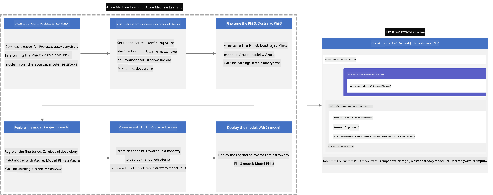

### Spis treści

1. **[Scenariusz 1: Konfiguracja zasobów Azure i przygotowanie do dostrajania](../../../../../../md/02.Application/01.TextAndChat/Phi3)**
    - [Utwórz Azure Machine Learning Workspace](../../../../../../md/02.Application/01.TextAndChat/Phi3)
    - [Złóż wniosek o limity GPU w subskrypcji Azure](../../../../../../md/02.Application/01.TextAndChat/Phi3)
    - [Dodaj przypisanie roli](../../../../../../md/02.Application/01.TextAndChat/Phi3)
    - [Skonfiguruj projekt](../../../../../../md/02.Application/01.TextAndChat/Phi3)
    - [Przygotuj zestaw danych do dostrajania](../../../../../../md/02.Application/01.TextAndChat/Phi3)

1. **[Scenariusz 2: Dostrajanie modelu Phi-3 i wdrażanie w Azure Machine Learning Studio](../../../../../../md/02.Application/01.TextAndChat/Phi3)**
    - [Skonfiguruj Azure CLI](../../../../../../md/02.Application/01.TextAndChat/Phi3)
    - [Dostrój model Phi-3](../../../../../../md/02.Application/01.TextAndChat/Phi3)
    - [Wdróż dostrojony model](../../../../../../md/02.Application/01.TextAndChat/Phi3)

1. **[Scenariusz 3: Integracja z Prompt flow i rozmowa z niestandardowym modelem](../../../../../../md/02.Application/01.TextAndChat/Phi3)**
    - [Zintegruj niestandardowy model Phi-3 z Prompt flow](../../../../../../md/02.Application/01.TextAndChat/Phi3)
    - [Rozmawiaj ze swoim niestandardowym modelem](../../../../../../md/02.Application/01.TextAndChat/Phi3)

## Scenariusz 1: Konfiguracja zasobów Azure i przygotowanie do dostrajania

### Utwórz Azure Machine Learning Workspace

1. Wpisz *azure machine learning* w **pasku wyszukiwania** u góry strony portalu i wybierz **Azure Machine Learning** z dostępnych opcji.

    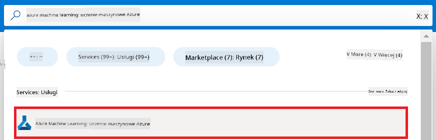

1. Wybierz **+ Create** z menu nawigacyjnego.

1. Wybierz **New workspace** z menu nawigacyjnego.

    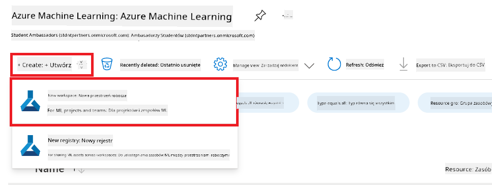

1. Wykonaj następujące czynności:

    - Wybierz swoją subskrypcję Azure **Subscription**.
    - Wybierz **Resource group** do użycia (utwórz nową, jeśli to konieczne).
    - Wprowadź **Workspace Name**. Musi to być unikalna nazwa.
    - Wybierz **Region**, którego chcesz użyć.
    - Wybierz **Storage account** do użycia (utwórz nowy, jeśli to konieczne).
    - Wybierz **Key vault** do użycia (utwórz nowy, jeśli to konieczne).
    - Wybierz **Application insights** do użycia (utwórz nowy, jeśli to konieczne).
    - Wybierz **Container registry** do użycia (utwórz nowy, jeśli to konieczne).

    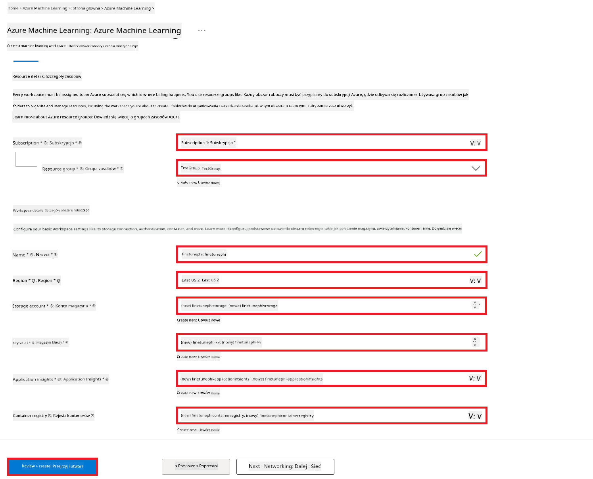

1. Wybierz **Review + Create**.

1. Wybierz **Create**.

### Złóż wniosek o limity GPU w subskrypcji Azure

W tym przykładzie E2E użyjesz *Standard_NC24ads_A100_v4 GPU* do dostrajania, co wymaga złożenia wniosku o limit, oraz *Standard_E4s_v3* CPU do wdrożenia, które nie wymaga wniosku o limit.

> [!NOTE]
>
> Tylko subskrypcje Pay-As-You-Go (standardowy typ subskrypcji) kwalifikują się do przydziału GPU; subskrypcje benefitowe nie są obecnie obsługiwane.
>
> Dla użytkowników subskrypcji benefitowych (np. Visual Studio Enterprise Subscription) lub tych, którzy chcą szybko przetestować proces dostrajania i wdrażania, ten przewodnik zawiera również wskazówki dotyczące dostrajania z minimalnym zestawem danych przy użyciu CPU. Należy jednak pamiętać, że wyniki dostrajania są znacznie lepsze przy użyciu GPU i większych zestawów danych.

1. Odwiedź [Azure ML Studio](https://ml.azure.com/home?wt.mc_id=studentamb_279723).

1. Wykonaj następujące czynności, aby złożyć wniosek o limit *Standard NCADSA100v4 Family*:

    - Wybierz **Quota** z lewego panelu.
    - Wybierz **Virtual machine family** do użycia. Na przykład wybierz **Standard NCADSA100v4 Family Cluster Dedicated vCPUs**, który obejmuje GPU *Standard_NC24ads_A100_v4*.
    - Wybierz **Request quota** z menu nawigacyjnego.

        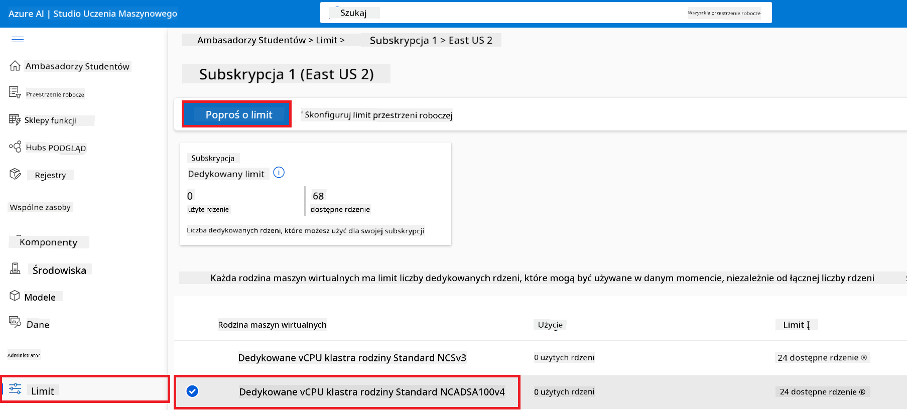

    - Na stronie Request quota wpisz **New cores limit**, którego chcesz użyć. Na przykład 24.
    - Na stronie Request quota wybierz **Submit**, aby złożyć wniosek o limit GPU.

> [!NOTE]
> Możesz wybrać odpowiedni GPU lub CPU dla swoich potrzeb, odwołując się do dokumentu [Sizes for Virtual Machines in Azure](https://learn.microsoft.com/azure/virtual-machines/sizes/overview?tabs=breakdownseries%2Cgeneralsizelist%2Ccomputesizelist%2Cmemorysizelist%2Cstoragesizelist%2Cgpusizelist%2Cfpgasizelist%2Chpcsizelist).

### Dodaj przypisanie roli

Aby dostroić i wdrożyć modele, musisz najpierw utworzyć User Assigned Managed Identity (UAI) i przypisać jej odpowiednie uprawnienia. Ta UAI będzie używana do uwierzytelniania podczas wdrażania.

#### Utwórz User Assigned Managed Identity (UAI)

1. Wpisz *managed identities* w **pasku wyszukiwania** u góry strony portalu i wybierz **Managed Identities** z dostępnych opcji.

    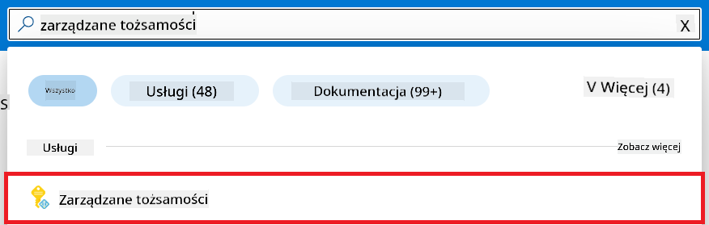

1. Wybierz **+ Create**.

    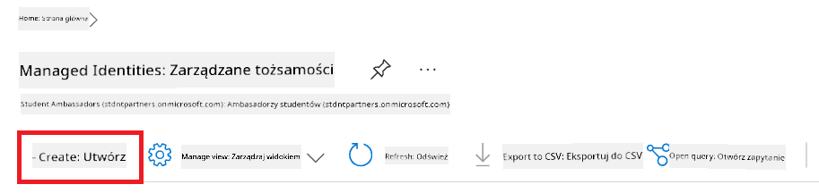

1. Wykonaj następujące czynności:

    - Wybierz swoją subskrypcję Azure **Subscription**.
    - Wybierz **Resource group** do użycia (utwórz nową, jeśli to konieczne).
    - Wybierz **Region**, którego chcesz użyć.
    - Wprowadź **Name**. Musi to być unikalna nazwa.

1. Wybierz **Review + create**.

1. Wybierz **+ Create**.

#### Dodaj przypisanie roli Contributor do Managed Identity

1. Przejdź do zasobu Managed Identity, który utworzyłeś.

1. Wybierz **Azure role assignments** z lewego panelu.

1. Wybierz **+Add role assignment** z menu nawigacyjnego.

1. Na stronie Add role assignment wykonaj następujące czynności:
    - Wybierz **Scope** na **Resource group**.
    - Wybierz swoją subskrypcję Azure **Subscription**.
    - Wybierz **Resource group** do użycia.
    - Wybierz rolę **Contributor**.

    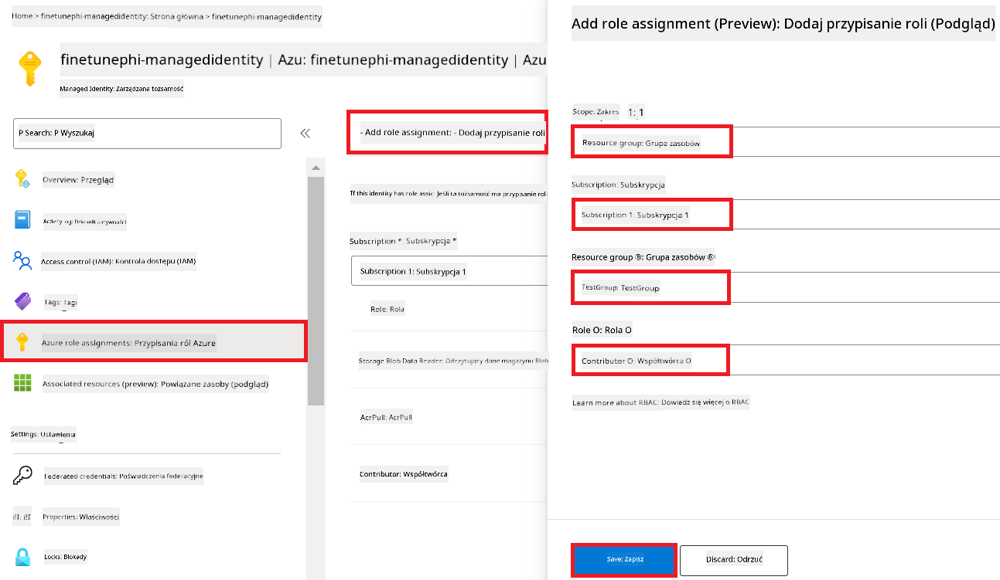

1. Wybierz **Save**.

#### Dodaj przypisanie roli Storage Blob Data Reader do Managed Identity

1. Wpisz *storage accounts* w **pasku wyszukiwania** u góry strony portalu i wybierz **Storage accounts** z dostępnych opcji.

    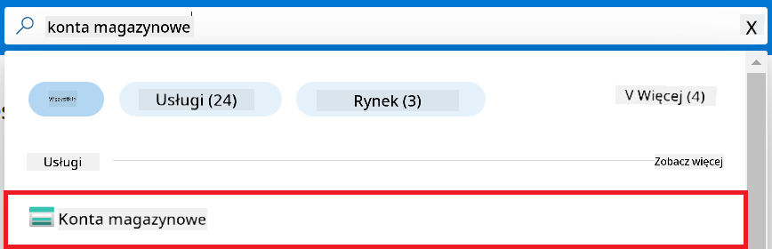

1. Wybierz konto storage powiązane z Azure Machine Learning workspace, które utworzyłeś. Na przykład *finetunephistorage*.

1. Wykonaj następujące czynności, aby przejść do strony Add role assignment:

    - Przejdź do utworzonego konta Azure Storage.
    - Wybierz **Access Control (IAM)** z lewego panelu.
    - Wybierz **+ Add** z menu nawigacyjnego.
    - Wybierz **Add role assignment** z menu nawigacyjnego.

    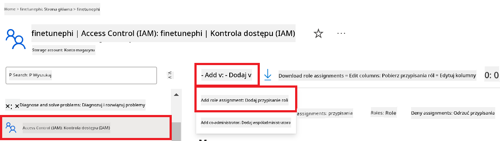

1. Na stronie Add role assignment wykonaj następujące czynności:

    - W polu roli wpisz *Storage Blob Data Reader* w **pasku wyszukiwania** i wybierz **Storage Blob Data Reader** z dostępnych opcji.
    - Wybierz **Next**.
    - Na stronie Members wybierz **Assign access to** **Managed identity**.
    - Wybierz **+ Select members**.
    - Na stronie Select managed identities wybierz swoją subskrypcję Azure **Subscription**.
    - Wybierz **Managed identity** jako **Manage Identity**.
    - Wybierz utworzoną Managed Identity, np. *finetunephi-managedidentity*.
    - Wybierz **Select**.

    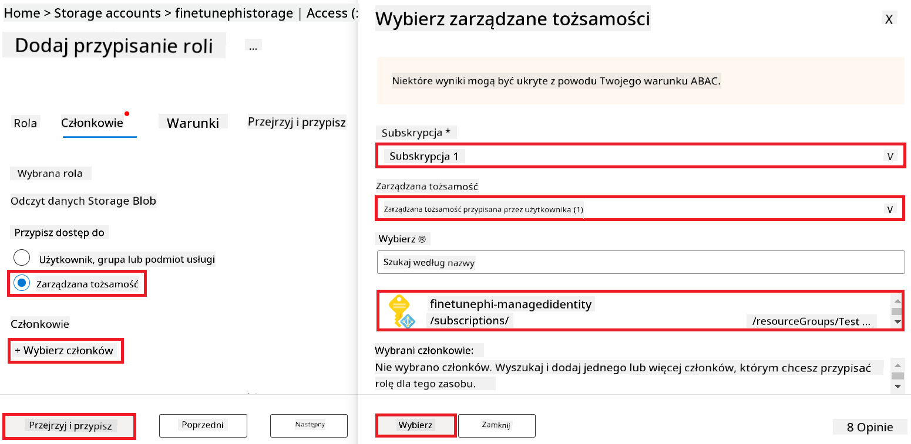

1. Wybierz **Review + assign**.

#### Dodaj przypisanie roli AcrPull do Managed Identity

1. Wpisz *container registries* w **pasku wyszukiwania** u góry strony portalu i wybierz **Container registries** z dostępnych opcji.

    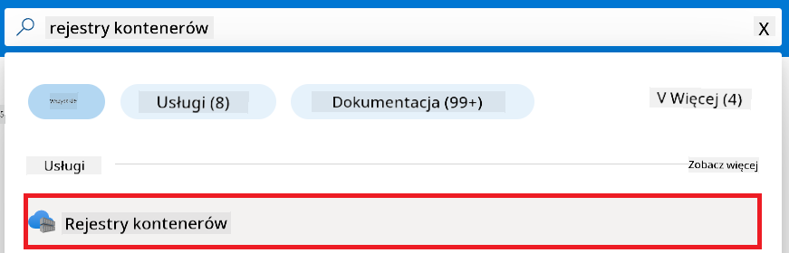

1. Wybierz rejestr kontenerów powiązany z Azure Machine Learning workspace. Na przykład *finetunephicontainerregistries*.

1. Wykonaj następujące czynności, aby przejść do strony Add role assignment:

    - Wybierz **Access Control (IAM)** z lewego panelu.
    - Wybierz **+ Add** z menu nawigacyjnego.
    - Wybierz **Add role assignment** z menu nawigacyjnego.

1. Na stronie Add role assignment wykonaj następujące czynności:

    - W polu roli wpisz *AcrPull* w **pasku wyszukiwania** i wybierz **AcrPull** z dostępnych opcji.
    - Wybierz **Next**.
    - Na stronie Members wybierz **Assign access to** **Managed identity**.
    - Wybierz **+ Select members**.
    - Na stronie Select managed identities wybierz swoją subskrypcję Azure **Subscription**.
    - Wybierz **Managed identity** jako **Manage Identity**.
    - Wybierz utworzoną Managed Identity, np. *finetunephi-managedidentity*.
    - Wybierz **Select**.
    - Wybierz **Review + assign**.

### Skonfiguruj projekt

Teraz utworzysz folder do pracy i skonfigurujesz środowisko wirtualne, aby opracować program, który będzie wchodził w interakcję z użytkownikami i korzystał z zapisanej historii czatu z Azure Cosmos DB, aby lepiej odpowiadać.

#### Utwórz folder do pracy

1. Otwórz okno terminala i wpisz następujące polecenie, aby utworzyć folder o nazwie *finetune-phi* w domyślnej ścieżce.

    ```console
    mkdir finetune-phi
    ```

1. Wpisz następujące polecenie w terminalu, aby przejść do utworzonego folderu *finetune-phi*.

    ```console
    cd finetune-phi
    ```

#### Utwórz środowisko wirtualne

1. Wpisz następujące polecenie w terminalu, aby utworzyć środowisko wirtualne o nazwie *.venv*.

    ```console
    python -m venv .venv
    ```

1. Wpisz następujące polecenie w terminalu, aby aktywować środowisko wirtualne.

    ```console
    .venv\Scripts\activate.bat
    ```
> [!NOTE]
>
> Jeśli wszystko poszło dobrze, powinieneś zobaczyć *(.venv)* przed znakiem zachęty.
#### Zainstaluj wymagane pakiety

1. Wpisz następujące polecenia w terminalu, aby zainstalować wymagane pakiety.

    ```console
    pip install datasets==2.19.1
    pip install transformers==4.41.1
    pip install azure-ai-ml==1.16.0
    pip install torch==2.3.1
    pip install trl==0.9.4
    pip install promptflow==1.12.0
    ```

#### Utwórz pliki projektu

W tym ćwiczeniu utworzysz niezbędne pliki dla naszego projektu. Pliki te zawierają skrypty do pobierania zbioru danych, konfiguracji środowiska Azure Machine Learning, dostrajania modelu Phi-3 oraz wdrażania dostrojonego modelu. Utworzysz także plik *conda.yml* do skonfigurowania środowiska dostrajania.

W tym ćwiczeniu wykonasz:

- Utworzenie pliku *download_dataset.py* do pobierania zbioru danych.
- Utworzenie pliku *setup_ml.py* do konfiguracji środowiska Azure Machine Learning.
- Utworzenie pliku *fine_tune.py* w folderze *finetuning_dir* do dostrajania modelu Phi-3 przy użyciu zbioru danych.
- Utworzenie pliku *conda.yml* do konfiguracji środowiska dostrajania.
- Utworzenie pliku *deploy_model.py* do wdrożenia dostrojonego modelu.
- Utworzenie pliku *integrate_with_promptflow.py* do integracji dostrojonego modelu i uruchamiania go za pomocą Prompt flow.
- Utworzenie pliku flow.dag.yml do skonfigurowania struktury workflow dla Prompt flow.
- Utworzenie pliku *config.py* do wprowadzenia informacji o Azure.

> [!NOTE]
>
> Pełna struktura folderów:
>
> ```text
> └── YourUserName
> .    └── finetune-phi
> .        ├── finetuning_dir
> .        │      └── fine_tune.py
> .        ├── conda.yml
> .        ├── config.py
> .        ├── deploy_model.py
> .        ├── download_dataset.py
> .        ├── flow.dag.yml
> .        ├── integrate_with_promptflow.py
> .        └── setup_ml.py
> ```

1. Otwórz **Visual Studio Code**.

1. Wybierz **File** z paska menu.

1. Wybierz **Open Folder**.

1. Wybierz folder *finetune-phi*, który utworzyłeś, znajdujący się pod ścieżką *C:\Users\yourUserName\finetune-phi*.

    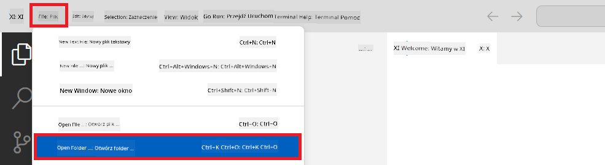

1. W lewym panelu Visual Studio Code kliknij prawym przyciskiem myszy i wybierz **New File**, aby utworzyć nowy plik o nazwie *download_dataset.py*.

1. W lewym panelu Visual Studio Code kliknij prawym przyciskiem myszy i wybierz **New File**, aby utworzyć nowy plik o nazwie *setup_ml.py*.

1. W lewym panelu Visual Studio Code kliknij prawym przyciskiem myszy i wybierz **New File**, aby utworzyć nowy plik o nazwie *deploy_model.py*.

    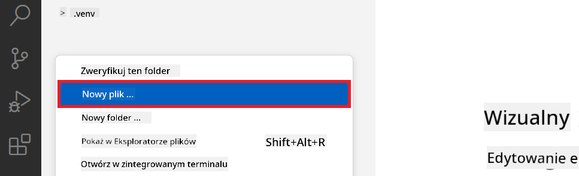

1. W lewym panelu Visual Studio Code kliknij prawym przyciskiem myszy i wybierz **New Folder**, aby utworzyć nowy folder o nazwie *finetuning_dir*.

1. W folderze *finetuning_dir* utwórz nowy plik o nazwie *fine_tune.py*.

#### Utwórz i skonfiguruj plik *conda.yml*

1. W lewym panelu Visual Studio Code kliknij prawym przyciskiem myszy i wybierz **New File**, aby utworzyć nowy plik o nazwie *conda.yml*.

1. Dodaj następujący kod do pliku *conda.yml*, aby skonfigurować środowisko dostrajania dla modelu Phi-3.

    ```yml
    name: phi-3-training-env
    channels:
      - defaults
      - conda-forge
    dependencies:
      - python=3.10
      - pip
      - numpy<2.0
      - pip:
          - torch==2.4.0
          - torchvision==0.19.0
          - trl==0.8.6
          - transformers==4.41
          - datasets==2.21.0
          - azureml-core==1.57.0
          - azure-storage-blob==12.19.0
          - azure-ai-ml==1.16
          - azure-identity==1.17.1
          - accelerate==0.33.0
          - mlflow==2.15.1
          - azureml-mlflow==1.57.0
    ```

#### Utwórz i skonfiguruj plik *config.py*

1. W lewym panelu Visual Studio Code kliknij prawym przyciskiem myszy i wybierz **New File**, aby utworzyć nowy plik o nazwie *config.py*.

1. Dodaj następujący kod do pliku *config.py*, aby wprowadzić informacje o Azure.

    ```python
    # Azure settings
    AZURE_SUBSCRIPTION_ID = "your_subscription_id"
    AZURE_RESOURCE_GROUP_NAME = "your_resource_group_name" # "TestGroup"

    # Azure Machine Learning settings
    AZURE_ML_WORKSPACE_NAME = "your_workspace_name" # "finetunephi-workspace"

    # Azure Managed Identity settings
    AZURE_MANAGED_IDENTITY_CLIENT_ID = "your_azure_managed_identity_client_id"
    AZURE_MANAGED_IDENTITY_NAME = "your_azure_managed_identity_name" # "finetunephi-mangedidentity"
    AZURE_MANAGED_IDENTITY_RESOURCE_ID = f"/subscriptions/{AZURE_SUBSCRIPTION_ID}/resourceGroups/{AZURE_RESOURCE_GROUP_NAME}/providers/Microsoft.ManagedIdentity/userAssignedIdentities/{AZURE_MANAGED_IDENTITY_NAME}"

    # Dataset file paths
    TRAIN_DATA_PATH = "data/train_data.jsonl"
    TEST_DATA_PATH = "data/test_data.jsonl"

    # Fine-tuned model settings
    AZURE_MODEL_NAME = "your_fine_tuned_model_name" # "finetune-phi-model"
    AZURE_ENDPOINT_NAME = "your_fine_tuned_model_endpoint_name" # "finetune-phi-endpoint"
    AZURE_DEPLOYMENT_NAME = "your_fine_tuned_model_deployment_name" # "finetune-phi-deployment"

    AZURE_ML_API_KEY = "your_fine_tuned_model_api_key"
    AZURE_ML_ENDPOINT = "your_fine_tuned_model_endpoint_uri" # "https://{your-endpoint-name}.{your-region}.inference.ml.azure.com/score"
    ```

#### Dodaj zmienne środowiskowe Azure

1. Wykonaj następujące kroki, aby dodać Azure Subscription ID:

    - Wpisz *subscriptions* w **pasku wyszukiwania** u góry strony portalu i wybierz **Subscriptions** z dostępnych opcji.
    - Wybierz subskrypcję Azure, której aktualnie używasz.
    - Skopiuj i wklej swój Subscription ID do pliku *config.py*.

    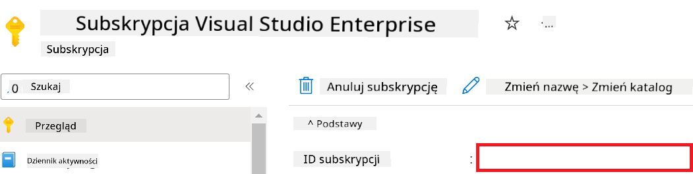

1. Wykonaj następujące kroki, aby dodać nazwę Azure Workspace:

    - Przejdź do zasobu Azure Machine Learning, który utworzyłeś.
    - Skopiuj i wklej nazwę swojego konta do pliku *config.py*.

    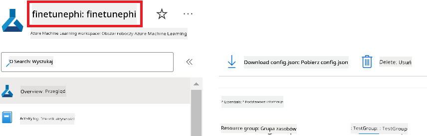

1. Wykonaj następujące kroki, aby dodać nazwę Azure Resource Group:

    - Przejdź do zasobu Azure Machine Learning, który utworzyłeś.
    - Skopiuj i wklej nazwę swojej grupy zasobów Azure do pliku *config.py*.

    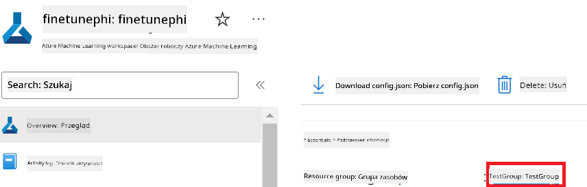

2. Wykonaj następujące kroki, aby dodać nazwę Azure Managed Identity:

    - Przejdź do zasobu Managed Identities, który utworzyłeś.
    - Skopiuj i wklej nazwę swojej Azure Managed Identity do pliku *config.py*.

    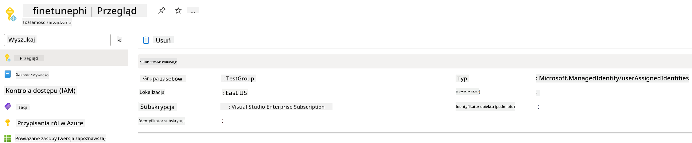

### Przygotuj zbiór danych do dostrajania

W tym ćwiczeniu uruchomisz plik *download_dataset.py*, aby pobrać zbiory danych *ULTRACHAT_200k* do lokalnego środowiska. Następnie użyjesz tych danych do dostrojenia modelu Phi-3 w Azure Machine Learning.

#### Pobierz swój zbiór danych za pomocą *download_dataset.py*

1. Otwórz plik *download_dataset.py* w Visual Studio Code.

1. Dodaj następujący kod do pliku *download_dataset.py*.

    ```python
    import json
    import os
    from datasets import load_dataset
    from config import (
        TRAIN_DATA_PATH,
        TEST_DATA_PATH)

    def load_and_split_dataset(dataset_name, config_name, split_ratio):
        """
        Load and split a dataset.
        """
        # Load the dataset with the specified name, configuration, and split ratio
        dataset = load_dataset(dataset_name, config_name, split=split_ratio)
        print(f"Original dataset size: {len(dataset)}")
        
        # Split the dataset into train and test sets (80% train, 20% test)
        split_dataset = dataset.train_test_split(test_size=0.2)
        print(f"Train dataset size: {len(split_dataset['train'])}")
        print(f"Test dataset size: {len(split_dataset['test'])}")
        
        return split_dataset

    def save_dataset_to_jsonl(dataset, filepath):
        """
        Save a dataset to a JSONL file.
        """
        # Create the directory if it does not exist
        os.makedirs(os.path.dirname(filepath), exist_ok=True)
        
        # Open the file in write mode
        with open(filepath, 'w', encoding='utf-8') as f:
            # Iterate over each record in the dataset
            for record in dataset:
                # Dump the record as a JSON object and write it to the file
                json.dump(record, f)
                # Write a newline character to separate records
                f.write('\n')
        
        print(f"Dataset saved to {filepath}")

    def main():
        """
        Main function to load, split, and save the dataset.
        """
        # Load and split the ULTRACHAT_200k dataset with a specific configuration and split ratio
        dataset = load_and_split_dataset("HuggingFaceH4/ultrachat_200k", 'default', 'train_sft[:1%]')
        
        # Extract the train and test datasets from the split
        train_dataset = dataset['train']
        test_dataset = dataset['test']

        # Save the train dataset to a JSONL file
        save_dataset_to_jsonl(train_dataset, TRAIN_DATA_PATH)
        
        # Save the test dataset to a separate JSONL file
        save_dataset_to_jsonl(test_dataset, TEST_DATA_PATH)

    if __name__ == "__main__":
        main()

    ```

> [!TIP]
>
> **Wskazówki dotyczące dostrajania z minimalnym zbiorem danych przy użyciu CPU**
>
> Jeśli chcesz użyć CPU do dostrajania, to podejście jest idealne dla osób posiadających subskrypcje benefitowe (np. Visual Studio Enterprise Subscription) lub do szybkiego przetestowania procesu dostrajania i wdrożenia.
>
> Zamień `dataset = load_and_split_dataset("HuggingFaceH4/ultrachat_200k", 'default', 'train_sft[:1%]')` na `dataset = load_and_split_dataset("HuggingFaceH4/ultrachat_200k", 'default', 'train_sft[:10]')`
>

1. Wpisz następujące polecenie w terminalu, aby uruchomić skrypt i pobrać zbiór danych do lokalnego środowiska.

    ```console
    python download_data.py
    ```

1. Sprawdź, czy zbiory danych zostały pomyślnie zapisane w lokalnym katalogu *finetune-phi/data*.

> [!NOTE]
>
> **Rozmiar zbioru danych i czas dostrajania**
>
> W tym przykładzie E2E używasz tylko 1% zbioru danych (`train_sft[:1%]`). Znacznie zmniejsza to ilość danych, przyspieszając zarówno przesyłanie, jak i proces dostrajania. Możesz dostosować procent, aby znaleźć odpowiedni balans między czasem treningu a wydajnością modelu. Użycie mniejszej części zbioru danych skraca czas potrzebny na dostrajanie, co ułatwia pracę z przykładem E2E.

## Scenariusz 2: Dostrajanie modelu Phi-3 i wdrożenie w Azure Machine Learning Studio

### Skonfiguruj Azure CLI

Musisz skonfigurować Azure CLI, aby uwierzytelnić swoje środowisko. Azure CLI pozwala zarządzać zasobami Azure bezpośrednio z linii poleceń i dostarcza poświadczenia niezbędne do uzyskania dostępu do tych zasobów przez Azure Machine Learning. Aby rozpocząć, zainstaluj [Azure CLI](https://learn.microsoft.com/cli/azure/install-azure-cli)

1. Otwórz okno terminala i wpisz następujące polecenie, aby zalogować się do swojego konta Azure.

    ```console
    az login
    ```

1. Wybierz konto Azure, którego chcesz użyć.

1. Wybierz subskrypcję Azure, której chcesz użyć.

    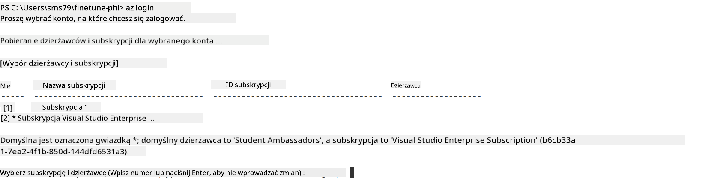

> [!TIP]
>
> Jeśli masz problemy z zalogowaniem się do Azure, spróbuj użyć kodu urządzenia. Otwórz okno terminala i wpisz następujące polecenie, aby zalogować się do swojego konta Azure:
>
> ```console
> az login --use-device-code
> ```
>

### Dostrój model Phi-3

W tym ćwiczeniu dostroisz model Phi-3 przy użyciu dostarczonego zbioru danych. Najpierw zdefiniujesz proces dostrajania w pliku *fine_tune.py*. Następnie skonfigurujesz środowisko Azure Machine Learning i rozpoczniesz proces dostrajania, uruchamiając plik *setup_ml.py*. Ten skrypt zapewnia, że dostrajanie odbywa się w środowisku Azure Machine Learning.

Uruchamiając *setup_ml.py*, rozpoczniesz proces dostrajania w środowisku Azure Machine Learning.

#### Dodaj kod do pliku *fine_tune.py*

1. Przejdź do folderu *finetuning_dir* i otwórz plik *fine_tune.py* w Visual Studio Code.

1. Dodaj następujący kod do pliku *fine_tune.py*.

    ```python
    import argparse
    import sys
    import logging
    import os
    from datasets import load_dataset
    import torch
    import mlflow
    from transformers import AutoModelForCausalLM, AutoTokenizer, TrainingArguments
    from trl import SFTTrainer

    # To avoid the INVALID_PARAMETER_VALUE error in MLflow, disable MLflow integration
    os.environ["DISABLE_MLFLOW_INTEGRATION"] = "True"

    # Logging setup
    logging.basicConfig(
        format="%(asctime)s - %(levelname)s - %(name)s - %(message)s",
        datefmt="%Y-%m-%d %H:%M:%S",
        handlers=[logging.StreamHandler(sys.stdout)],
        level=logging.WARNING
    )
    logger = logging.getLogger(__name__)

    def initialize_model_and_tokenizer(model_name, model_kwargs):
        """
        Initialize the model and tokenizer with the given pretrained model name and arguments.
        """
        model = AutoModelForCausalLM.from_pretrained(model_name, **model_kwargs)
        tokenizer = AutoTokenizer.from_pretrained(model_name)
        tokenizer.model_max_length = 2048
        tokenizer.pad_token = tokenizer.unk_token
        tokenizer.pad_token_id = tokenizer.convert_tokens_to_ids(tokenizer.pad_token)
        tokenizer.padding_side = 'right'
        return model, tokenizer

    def apply_chat_template(example, tokenizer):
        """
        Apply a chat template to tokenize messages in the example.
        """
        messages = example["messages"]
        if messages[0]["role"] != "system":
            messages.insert(0, {"role": "system", "content": ""})
        example["text"] = tokenizer.apply_chat_template(
            messages, tokenize=False, add_generation_prompt=False
        )
        return example

    def load_and_preprocess_data(train_filepath, test_filepath, tokenizer):
        """
        Load and preprocess the dataset.
        """
        train_dataset = load_dataset('json', data_files=train_filepath, split='train')
        test_dataset = load_dataset('json', data_files=test_filepath, split='train')
        column_names = list(train_dataset.features)

        train_dataset = train_dataset.map(
            apply_chat_template,
            fn_kwargs={"tokenizer": tokenizer},
            num_proc=10,
            remove_columns=column_names,
            desc="Applying chat template to train dataset",
        )

        test_dataset = test_dataset.map(
            apply_chat_template,
            fn_kwargs={"tokenizer": tokenizer},
            num_proc=10,
            remove_columns=column_names,
            desc="Applying chat template to test dataset",
        )

        return train_dataset, test_dataset

    def train_and_evaluate_model(train_dataset, test_dataset, model, tokenizer, output_dir):
        """
        Train and evaluate the model.
        """
        training_args = TrainingArguments(
            bf16=True,
            do_eval=True,
            output_dir=output_dir,
            eval_strategy="epoch",
            learning_rate=5.0e-06,
            logging_steps=20,
            lr_scheduler_type="cosine",
            num_train_epochs=3,
            overwrite_output_dir=True,
            per_device_eval_batch_size=4,
            per_device_train_batch_size=4,
            remove_unused_columns=True,
            save_steps=500,
            seed=0,
            gradient_checkpointing=True,
            gradient_accumulation_steps=1,
            warmup_ratio=0.2,
        )

        trainer = SFTTrainer(
            model=model,
            args=training_args,
            train_dataset=train_dataset,
            eval_dataset=test_dataset,
            max_seq_length=2048,
            dataset_text_field="text",
            tokenizer=tokenizer,
            packing=True
        )

        train_result = trainer.train()
        trainer.log_metrics("train", train_result.metrics)

        mlflow.transformers.log_model(
            transformers_model={"model": trainer.model, "tokenizer": tokenizer},
            artifact_path=output_dir,
        )

        tokenizer.padding_side = 'left'
        eval_metrics = trainer.evaluate()
        eval_metrics["eval_samples"] = len(test_dataset)
        trainer.log_metrics("eval", eval_metrics)

    def main(train_file, eval_file, model_output_dir):
        """
        Main function to fine-tune the model.
        """
        model_kwargs = {
            "use_cache": False,
            "trust_remote_code": True,
            "torch_dtype": torch.bfloat16,
            "device_map": None,
            "attn_implementation": "eager"
        }

        # pretrained_model_name = "microsoft/Phi-3-mini-4k-instruct"
        pretrained_model_name = "microsoft/Phi-3.5-mini-instruct"

        with mlflow.start_run():
            model, tokenizer = initialize_model_and_tokenizer(pretrained_model_name, model_kwargs)
            train_dataset, test_dataset = load_and_preprocess_data(train_file, eval_file, tokenizer)
            train_and_evaluate_model(train_dataset, test_dataset, model, tokenizer, model_output_dir)

    if __name__ == "__main__":
        parser = argparse.ArgumentParser()
        parser.add_argument("--train-file", type=str, required=True, help="Path to the training data")
        parser.add_argument("--eval-file", type=str, required=True, help="Path to the evaluation data")
        parser.add_argument("--model_output_dir", type=str, required=True, help="Directory to save the fine-tuned model")
        args = parser.parse_args()
        main(args.train_file, args.eval_file, args.model_output_dir)

    ```

1. Zapisz i zamknij plik *fine_tune.py*.

> [!TIP]
> **Możesz dostroić model Phi-3.5**
>
> W pliku *fine_tune.py* możesz zmienić `pretrained_model_name` z `"microsoft/Phi-3-mini-4k-instruct"` na dowolny model, który chcesz dostroić. Na przykład, jeśli zmienisz go na `"microsoft/Phi-3.5-mini-instruct"`, będziesz używać modelu Phi-3.5-mini-instruct do dostrajania. Aby znaleźć i użyć preferowaną nazwę modelu, odwiedź [Hugging Face](https://huggingface.co/), wyszukaj interesujący Cię model, a następnie skopiuj i wklej jego nazwę do pola `pretrained_model_name` w swoim skrypcie.
>
> :::image type="content" source="../../imgs/03/FineTuning-PromptFlow/finetunephi3.5.png" alt-text="Dostrajanie Phi-3.5.":::
>

#### Dodaj kod do pliku *setup_ml.py*

1. Otwórz plik *setup_ml.py* w Visual Studio Code.

1. Dodaj następujący kod do pliku *setup_ml.py*.

    ```python
    import logging
    from azure.ai.ml import MLClient, command, Input
    from azure.ai.ml.entities import Environment, AmlCompute
    from azure.identity import AzureCliCredential
    from config import (
        AZURE_SUBSCRIPTION_ID,
        AZURE_RESOURCE_GROUP_NAME,
        AZURE_ML_WORKSPACE_NAME,
        TRAIN_DATA_PATH,
        TEST_DATA_PATH
    )

    # Constants

    # Uncomment the following lines to use a CPU instance for training
    # COMPUTE_INSTANCE_TYPE = "Standard_E16s_v3" # cpu
    # COMPUTE_NAME = "cpu-e16s-v3"
    # DOCKER_IMAGE_NAME = "mcr.microsoft.com/azureml/openmpi4.1.0-ubuntu20.04:latest"

    # Uncomment the following lines to use a GPU instance for training
    COMPUTE_INSTANCE_TYPE = "Standard_NC24ads_A100_v4"
    COMPUTE_NAME = "gpu-nc24s-a100-v4"
    DOCKER_IMAGE_NAME = "mcr.microsoft.com/azureml/curated/acft-hf-nlp-gpu:59"

    CONDA_FILE = "conda.yml"
    LOCATION = "eastus2" # Replace with the location of your compute cluster
    FINETUNING_DIR = "./finetuning_dir" # Path to the fine-tuning script
    TRAINING_ENV_NAME = "phi-3-training-environment" # Name of the training environment
    MODEL_OUTPUT_DIR = "./model_output" # Path to the model output directory in azure ml

    # Logging setup to track the process
    logger = logging.getLogger(__name__)
    logging.basicConfig(
        format="%(asctime)s - %(levelname)s - %(name)s - %(message)s",
        datefmt="%Y-%m-%d %H:%M:%S",
        level=logging.WARNING
    )

    def get_ml_client():
        """
        Initialize the ML Client using Azure CLI credentials.
        """
        credential = AzureCliCredential()
        return MLClient(credential, AZURE_SUBSCRIPTION_ID, AZURE_RESOURCE_GROUP_NAME, AZURE_ML_WORKSPACE_NAME)

    def create_or_get_environment(ml_client):
        """
        Create or update the training environment in Azure ML.
        """
        env = Environment(
            image=DOCKER_IMAGE_NAME,  # Docker image for the environment
            conda_file=CONDA_FILE,  # Conda environment file
            name=TRAINING_ENV_NAME,  # Name of the environment
        )
        return ml_client.environments.create_or_update(env)

    def create_or_get_compute_cluster(ml_client, compute_name, COMPUTE_INSTANCE_TYPE, location):
        """
        Create or update the compute cluster in Azure ML.
        """
        try:
            compute_cluster = ml_client.compute.get(compute_name)
            logger.info(f"Compute cluster '{compute_name}' already exists. Reusing it for the current run.")
        except Exception:
            logger.info(f"Compute cluster '{compute_name}' does not exist. Creating a new one with size {COMPUTE_INSTANCE_TYPE}.")
            compute_cluster = AmlCompute(
                name=compute_name,
                size=COMPUTE_INSTANCE_TYPE,
                location=location,
                tier="Dedicated",  # Tier of the compute cluster
                min_instances=0,  # Minimum number of instances
                max_instances=1  # Maximum number of instances
            )
            ml_client.compute.begin_create_or_update(compute_cluster).wait()  # Wait for the cluster to be created
        return compute_cluster

    def create_fine_tuning_job(env, compute_name):
        """
        Set up the fine-tuning job in Azure ML.
        """
        return command(
            code=FINETUNING_DIR,  # Path to fine_tune.py
            command=(
                "python fine_tune.py "
                "--train-file ${{inputs.train_file}} "
                "--eval-file ${{inputs.eval_file}} "
                "--model_output_dir ${{inputs.model_output}}"
            ),
            environment=env,  # Training environment
            compute=compute_name,  # Compute cluster to use
            inputs={
                "train_file": Input(type="uri_file", path=TRAIN_DATA_PATH),  # Path to the training data file
                "eval_file": Input(type="uri_file", path=TEST_DATA_PATH),  # Path to the evaluation data file
                "model_output": MODEL_OUTPUT_DIR
            }
        )

    def main():
        """
        Main function to set up and run the fine-tuning job in Azure ML.
        """
        # Initialize ML Client
        ml_client = get_ml_client()

        # Create Environment
        env = create_or_get_environment(ml_client)
        
        # Create or get existing compute cluster
        create_or_get_compute_cluster(ml_client, COMPUTE_NAME, COMPUTE_INSTANCE_TYPE, LOCATION)

        # Create and Submit Fine-Tuning Job
        job = create_fine_tuning_job(env, COMPUTE_NAME)
        returned_job = ml_client.jobs.create_or_update(job)  # Submit the job
        ml_client.jobs.stream(returned_job.name)  # Stream the job logs
        
        # Capture the job name
        job_name = returned_job.name
        print(f"Job name: {job_name}")

    if __name__ == "__main__":
        main()

    ```

1. Zamień `COMPUTE_INSTANCE_TYPE`, `COMPUTE_NAME` oraz `LOCATION` na swoje konkretne dane.

    ```python
   # Uncomment the following lines to use a GPU instance for training
    COMPUTE_INSTANCE_TYPE = "Standard_NC24ads_A100_v4"
    COMPUTE_NAME = "gpu-nc24s-a100-v4"
    ...
    LOCATION = "eastus2" # Replace with the location of your compute cluster
    ```

> [!TIP]
>
> **Wskazówki dotyczące dostrajania z minimalnym zbiorem danych przy użyciu CPU**
>
> Jeśli chcesz użyć CPU do dostrajania, to podejście jest idealne dla osób posiadających subskrypcje benefitowe (np. Visual Studio Enterprise Subscription) lub do szybkiego przetestowania procesu dostrajania i wdrożenia.
>
> 1. Otwórz plik *setup_ml*.
> 2. Zamień `COMPUTE_INSTANCE_TYPE`, `COMPUTE_NAME` oraz `DOCKER_IMAGE_NAME` na poniższe wartości. Jeśli nie masz dostępu do *Standard_E16s_v3*, możesz użyć równoważnej instancji CPU lub poprosić o nową kwotę.
> 3. Zamień `LOCATION` na swoje konkretne dane.
>
>    ```python
>    # Uncomment the following lines to use a CPU instance for training
>    COMPUTE_INSTANCE_TYPE = "Standard_E16s_v3" # cpu
>    COMPUTE_NAME = "cpu-e16s-v3"
>    DOCKER_IMAGE_NAME = "mcr.microsoft.com/azureml/openmpi4.1.0-ubuntu20.04:latest"
>    LOCATION = "eastus2" # Replace with the location of your compute cluster
>    ```
>

1. Wpisz następujące polecenie, aby uruchomić skrypt *setup_ml.py* i rozpocząć proces dostrajania w Azure Machine Learning.

    ```python
    python setup_ml.py
    ```

1. W tym ćwiczeniu pomyślnie dostroiłeś model Phi-3 przy użyciu Azure Machine Learning. Uruchamiając skrypt *setup_ml.py*, skonfigurowałeś środowisko Azure Machine Learning i rozpocząłeś proces dostrajania zdefiniowany w pliku *fine_tune.py*. Pamiętaj, że proces dostrajania może zająć sporo czasu. Po uruchomieniu polecenia `python setup_ml.py` musisz poczekać na zakończenie procesu. Status zadania dostrajania możesz monitorować, korzystając z linku podanego w terminalu do portalu Azure Machine Learning.

    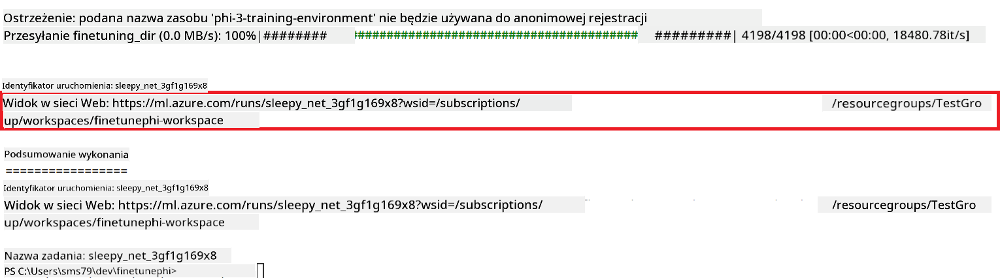

### Wdróż dostrojony model

Aby zintegrować dostrojony model Phi-3 z Prompt Flow, musisz wdrożyć model, aby był dostępny do inferencji w czasie rzeczywistym. Proces ten obejmuje rejestrację modelu, utworzenie punktu końcowego online oraz wdrożenie modelu.

#### Ustaw nazwę modelu, nazwę punktu końcowego i nazwę wdrożenia

1. Otwórz plik *config.py*.

1. Zamień `AZURE_MODEL_NAME = "your_fine_tuned_model_name"` na wybraną nazwę swojego modelu.

1. Zamień `AZURE_ENDPOINT_NAME = "your_fine_tuned_model_endpoint_name"` na wybraną nazwę punktu końcowego.

1. Zamień `AZURE_DEPLOYMENT_NAME = "your_fine_tuned_model_deployment_name"` na wybraną nazwę wdrożenia.

#### Dodaj kod do pliku *deploy_model.py*

Uruchomienie pliku *deploy_model.py* automatyzuje cały proces wdrożenia. Rejestruje model, tworzy punkt końcowy i wykonuje wdrożenie na podstawie ustawień określonych w pliku *config.py*, które obejmują nazwę modelu, nazwę punktu końcowego i nazwę wdrożenia.

1. Otwórz plik *deploy_model.py* w Visual Studio Code.

1. Dodaj następujący kod do pliku *deploy_model.py*.

    ```python
    import logging
    from azure.identity import AzureCliCredential
    from azure.ai.ml import MLClient
    from azure.ai.ml.entities import Model, ProbeSettings, ManagedOnlineEndpoint, ManagedOnlineDeployment, IdentityConfiguration, ManagedIdentityConfiguration, OnlineRequestSettings
    from azure.ai.ml.constants import AssetTypes

    # Configuration imports
    from config import (
        AZURE_SUBSCRIPTION_ID,
        AZURE_RESOURCE_GROUP_NAME,
        AZURE_ML_WORKSPACE_NAME,
        AZURE_MANAGED_IDENTITY_RESOURCE_ID,
        AZURE_MANAGED_IDENTITY_CLIENT_ID,
        AZURE_MODEL_NAME,
        AZURE_ENDPOINT_NAME,
        AZURE_DEPLOYMENT_NAME
    )

    # Constants
    JOB_NAME = "your-job-name"
    COMPUTE_INSTANCE_TYPE = "Standard_E4s_v3"

    deployment_env_vars = {
        "SUBSCRIPTION_ID": AZURE_SUBSCRIPTION_ID,
        "RESOURCE_GROUP_NAME": AZURE_RESOURCE_GROUP_NAME,
        "UAI_CLIENT_ID": AZURE_MANAGED_IDENTITY_CLIENT_ID,
    }

    # Logging setup
    logging.basicConfig(
        format="%(asctime)s - %(levelname)s - %(name)s - %(message)s",
        datefmt="%Y-%m-%d %H:%M:%S",
        level=logging.DEBUG
    )
    logger = logging.getLogger(__name__)

    def get_ml_client():
        """Initialize and return the ML Client."""
        credential = AzureCliCredential()
        return MLClient(credential, AZURE_SUBSCRIPTION_ID, AZURE_RESOURCE_GROUP_NAME, AZURE_ML_WORKSPACE_NAME)

    def register_model(ml_client, model_name, job_name):
        """Register a new model."""
        model_path = f"azureml://jobs/{job_name}/outputs/artifacts/paths/model_output"
        logger.info(f"Registering model {model_name} from job {job_name} at path {model_path}.")
        run_model = Model(
            path=model_path,
            name=model_name,
            description="Model created from run.",
            type=AssetTypes.MLFLOW_MODEL,
        )
        model = ml_client.models.create_or_update(run_model)
        logger.info(f"Registered model ID: {model.id}")
        return model

    def delete_existing_endpoint(ml_client, endpoint_name):
        """Delete existing endpoint if it exists."""
        try:
            endpoint_result = ml_client.online_endpoints.get(name=endpoint_name)
            logger.info(f"Deleting existing endpoint {endpoint_name}.")
            ml_client.online_endpoints.begin_delete(name=endpoint_name).result()
            logger.info(f"Deleted existing endpoint {endpoint_name}.")
        except Exception as e:
            logger.info(f"No existing endpoint {endpoint_name} found to delete: {e}")

    def create_or_update_endpoint(ml_client, endpoint_name, description=""):
        """Create or update an endpoint."""
        delete_existing_endpoint(ml_client, endpoint_name)
        logger.info(f"Creating new endpoint {endpoint_name}.")
        endpoint = ManagedOnlineEndpoint(
            name=endpoint_name,
            description=description,
            identity=IdentityConfiguration(
                type="user_assigned",
                user_assigned_identities=[ManagedIdentityConfiguration(resource_id=AZURE_MANAGED_IDENTITY_RESOURCE_ID)]
            )
        )
        endpoint_result = ml_client.online_endpoints.begin_create_or_update(endpoint).result()
        logger.info(f"Created new endpoint {endpoint_name}.")
        return endpoint_result

    def create_or_update_deployment(ml_client, endpoint_name, deployment_name, model):
        """Create or update a deployment."""

        logger.info(f"Creating deployment {deployment_name} for endpoint {endpoint_name}.")
        deployment = ManagedOnlineDeployment(
            name=deployment_name,
            endpoint_name=endpoint_name,
            model=model.id,
            instance_type=COMPUTE_INSTANCE_TYPE,
            instance_count=1,
            environment_variables=deployment_env_vars,
            request_settings=OnlineRequestSettings(
                max_concurrent_requests_per_instance=3,
                request_timeout_ms=180000,
                max_queue_wait_ms=120000
            ),
            liveness_probe=ProbeSettings(
                failure_threshold=30,
                success_threshold=1,
                period=100,
                initial_delay=500,
            ),
            readiness_probe=ProbeSettings(
                failure_threshold=30,
                success_threshold=1,
                period=100,
                initial_delay=500,
            ),
        )
        deployment_result = ml_client.online_deployments.begin_create_or_update(deployment).result()
        logger.info(f"Created deployment {deployment.name} for endpoint {endpoint_name}.")
        return deployment_result

    def set_traffic_to_deployment(ml_client, endpoint_name, deployment_name):
        """Set traffic to the specified deployment."""
        try:
            # Fetch the current endpoint details
            endpoint = ml_client.online_endpoints.get(name=endpoint_name)
            
            # Log the current traffic allocation for debugging
            logger.info(f"Current traffic allocation: {endpoint.traffic}")
            
            # Set the traffic allocation for the deployment
            endpoint.traffic = {deployment_name: 100}
            
            # Update the endpoint with the new traffic allocation
            endpoint_poller = ml_client.online_endpoints.begin_create_or_update(endpoint)
            updated_endpoint = endpoint_poller.result()
            
            # Log the updated traffic allocation for debugging
            logger.info(f"Updated traffic allocation: {updated_endpoint.traffic}")
            logger.info(f"Set traffic to deployment {deployment_name} at endpoint {endpoint_name}.")
            return updated_endpoint
        except Exception as e:
            # Log any errors that occur during the process
            logger.error(f"Failed to set traffic to deployment: {e}")
            raise


    def main():
        ml_client = get_ml_client()

        registered_model = register_model(ml_client, AZURE_MODEL_NAME, JOB_NAME)
        logger.info(f"Registered model ID: {registered_model.id}")

        endpoint = create_or_update_endpoint(ml_client, AZURE_ENDPOINT_NAME, "Endpoint for finetuned Phi-3 model")
        logger.info(f"Endpoint {AZURE_ENDPOINT_NAME} is ready.")

        try:
            deployment = create_or_update_deployment(ml_client, AZURE_ENDPOINT_NAME, AZURE_DEPLOYMENT_NAME, registered_model)
            logger.info(f"Deployment {AZURE_DEPLOYMENT_NAME} is created for endpoint {AZURE_ENDPOINT_NAME}.")

            set_traffic_to_deployment(ml_client, AZURE_ENDPOINT_NAME, AZURE_DEPLOYMENT_NAME)
            logger.info(f"Traffic is set to deployment {AZURE_DEPLOYMENT_NAME} at endpoint {AZURE_ENDPOINT_NAME}.")
        except Exception as e:
            logger.error(f"Failed to create or update deployment: {e}")

    if __name__ == "__main__":
        main()

    ```

1. Wykonaj następujące kroki, aby uzyskać `JOB_NAME`:

    - Przejdź do zasobu Azure Machine Learning, który utworzyłeś.
    - Wybierz **Studio web URL**, aby otworzyć workspace Azure Machine Learning.
    - Wybierz **Jobs** z lewego panelu.
    - Wybierz eksperyment dotyczący dostrajania, np. *finetunephi*.
    - Wybierz utworzone zadanie.
- Skopiuj i wklej nazwę swojego zadania do `JOB_NAME = "your-job-name"` w pliku *deploy_model.py*.

1. Zamień `COMPUTE_INSTANCE_TYPE` na swoje konkretne dane.

1. Wpisz następujące polecenie, aby uruchomić skrypt *deploy_model.py* i rozpocząć proces wdrażania w Azure Machine Learning.

    ```python
    python deploy_model.py
    ```


> [!WARNING]
> Aby uniknąć dodatkowych opłat na swoim koncie, upewnij się, że usuniesz utworzony endpoint w obszarze roboczym Azure Machine Learning.
>

#### Sprawdź status wdrożenia w Azure Machine Learning Workspace

1. Odwiedź [Azure ML Studio](https://ml.azure.com/home?wt.mc_id=studentamb_279723).

1. Przejdź do utworzonego przez siebie obszaru roboczego Azure Machine Learning.

1. Wybierz **Studio web URL**, aby otworzyć obszar roboczy Azure Machine Learning.

1. Wybierz **Endpoints** z zakładki po lewej stronie.

    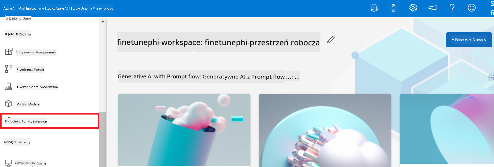

2. Wybierz endpoint, który utworzyłeś.

    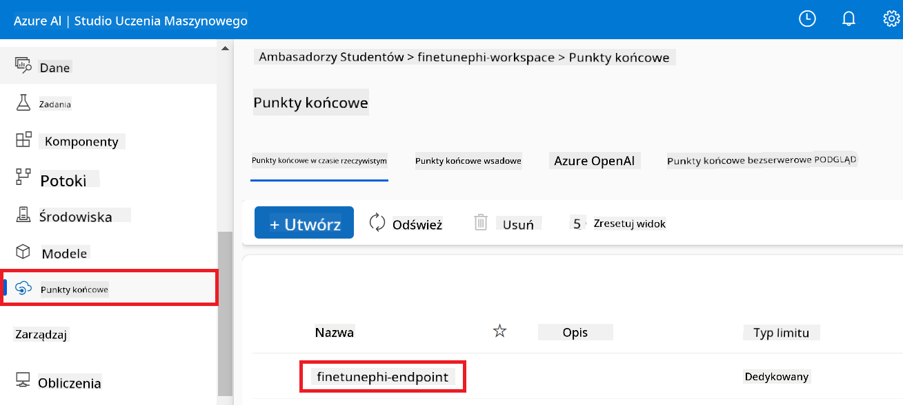

3. Na tej stronie możesz zarządzać endpointami utworzonymi podczas procesu wdrażania.

## Scenariusz 3: Integracja z Prompt flow i rozmowa z własnym modelem

### Integracja niestandardowego modelu Phi-3 z Prompt flow

Po pomyślnym wdrożeniu modelu dostrojonego możesz teraz zintegrować go z Prompt flow, aby używać swojego modelu w aplikacjach działających w czasie rzeczywistym, umożliwiając różnorodne interaktywne zadania z Twoim niestandardowym modelem Phi-3.

#### Ustaw klucz api i URI endpointu dostrojonego modelu Phi-3

1. Przejdź do utworzonego obszaru roboczego Azure Machine Learning.
1. Wybierz **Endpoints** z zakładki po lewej stronie.
1. Wybierz endpoint, który utworzyłeś.
1. Wybierz **Consume** z menu nawigacyjnego.
1. Skopiuj i wklej swój **REST endpoint** do pliku *config.py*, zastępując `AZURE_ML_ENDPOINT = "your_fine_tuned_model_endpoint_uri"` swoim **REST endpointem**.
1. Skopiuj i wklej swój **Primary key** do pliku *config.py*, zastępując `AZURE_ML_API_KEY = "your_fine_tuned_model_api_key"` swoim **Primary key**.

    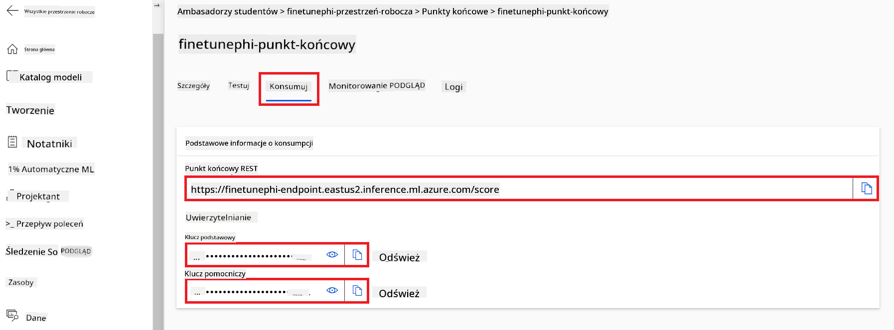

#### Dodaj kod do pliku *flow.dag.yml*

1. Otwórz plik *flow.dag.yml* w Visual Studio Code.

1. Dodaj następujący kod do *flow.dag.yml*.

    ```yml
    inputs:
      input_data:
        type: string
        default: "Who founded Microsoft?"

    outputs:
      answer:
        type: string
        reference: ${integrate_with_promptflow.output}

    nodes:
    - name: integrate_with_promptflow
      type: python
      source:
        type: code
        path: integrate_with_promptflow.py
      inputs:
        input_data: ${inputs.input_data}
    ```

#### Dodaj kod do pliku *integrate_with_promptflow.py*

1. Otwórz plik *integrate_with_promptflow.py* w Visual Studio Code.

1. Dodaj następujący kod do *integrate_with_promptflow.py*.

    ```python
    import logging
    import requests
    from promptflow.core import tool
    import asyncio
    import platform
    from config import (
        AZURE_ML_ENDPOINT,
        AZURE_ML_API_KEY
    )

    # Logging setup
    logging.basicConfig(
        format="%(asctime)s - %(levelname)s - %(name)s - %(message)s",
        datefmt="%Y-%m-%d %H:%M:%S",
        level=logging.DEBUG
    )
    logger = logging.getLogger(__name__)

    def query_azml_endpoint(input_data: list, endpoint_url: str, api_key: str) -> str:
        """
        Send a request to the Azure ML endpoint with the given input data.
        """
        headers = {
            "Content-Type": "application/json",
            "Authorization": f"Bearer {api_key}"
        }
        data = {
            "input_data": [input_data],
            "params": {
                "temperature": 0.7,
                "max_new_tokens": 128,
                "do_sample": True,
                "return_full_text": True
            }
        }
        try:
            response = requests.post(endpoint_url, json=data, headers=headers)
            response.raise_for_status()
            result = response.json()[0]
            logger.info("Successfully received response from Azure ML Endpoint.")
            return result
        except requests.exceptions.RequestException as e:
            logger.error(f"Error querying Azure ML Endpoint: {e}")
            raise

    def setup_asyncio_policy():
        """
        Setup asyncio event loop policy for Windows.
        """
        if platform.system() == 'Windows':
            asyncio.set_event_loop_policy(asyncio.WindowsSelectorEventLoopPolicy())
            logger.info("Set Windows asyncio event loop policy.")

    @tool
    def my_python_tool(input_data: str) -> str:
        """
        Tool function to process input data and query the Azure ML endpoint.
        """
        setup_asyncio_policy()
        return query_azml_endpoint(input_data, AZURE_ML_ENDPOINT, AZURE_ML_API_KEY)

    ```

### Rozmowa z własnym modelem

1. Wpisz następujące polecenie, aby uruchomić skrypt *deploy_model.py* i rozpocząć proces wdrażania w Azure Machine Learning.

    ```python
    pf flow serve --source ./ --port 8080 --host localhost
    ```

1. Oto przykład wyników: Teraz możesz rozmawiać ze swoim niestandardowym modelem Phi-3. Zaleca się zadawanie pytań opartych na danych użytych do dostrojenia.

    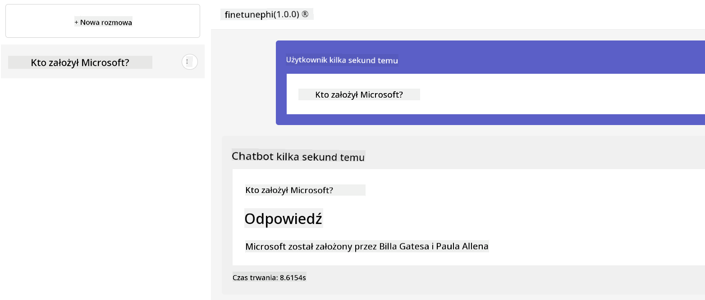

**Zastrzeżenie**:  
Niniejszy dokument został przetłumaczony za pomocą usługi tłumaczenia AI [Co-op Translator](https://github.com/Azure/co-op-translator). Chociaż dokładamy starań, aby tłumaczenie było jak najbardziej precyzyjne, prosimy mieć na uwadze, że automatyczne tłumaczenia mogą zawierać błędy lub nieścisłości. Oryginalny dokument w języku źródłowym należy traktować jako źródło autorytatywne. W przypadku informacji o kluczowym znaczeniu zalecane jest skorzystanie z profesjonalnego tłumaczenia wykonanego przez człowieka. Nie ponosimy odpowiedzialności za jakiekolwiek nieporozumienia lub błędne interpretacje wynikające z korzystania z tego tłumaczenia.