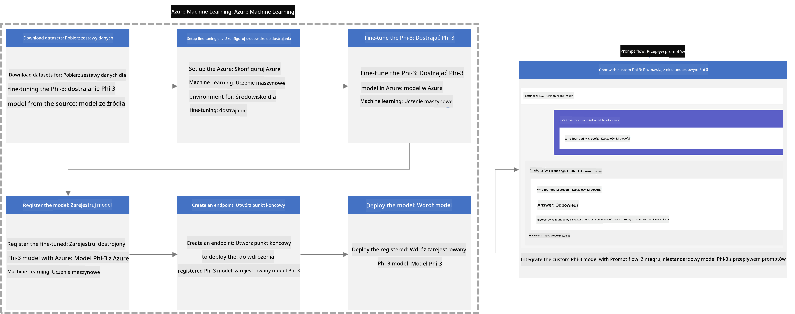
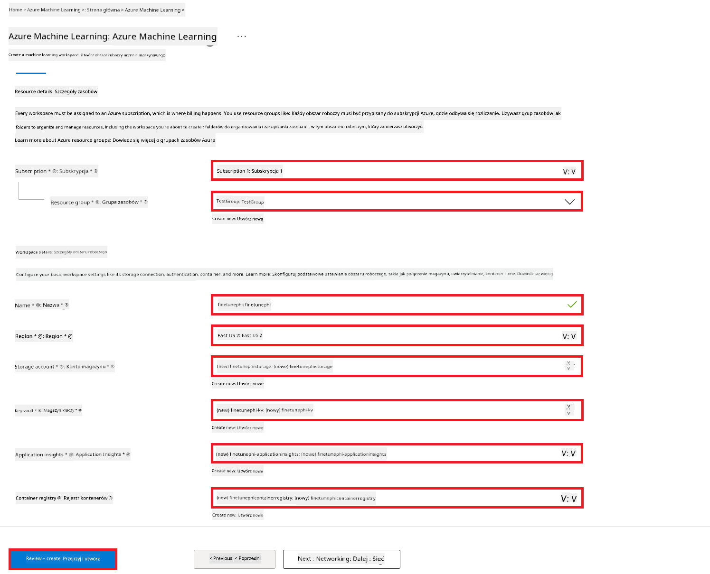
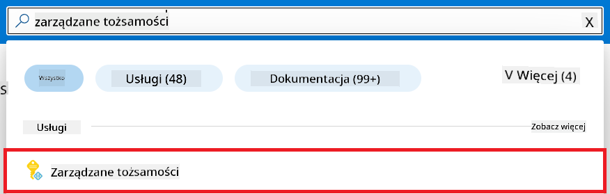
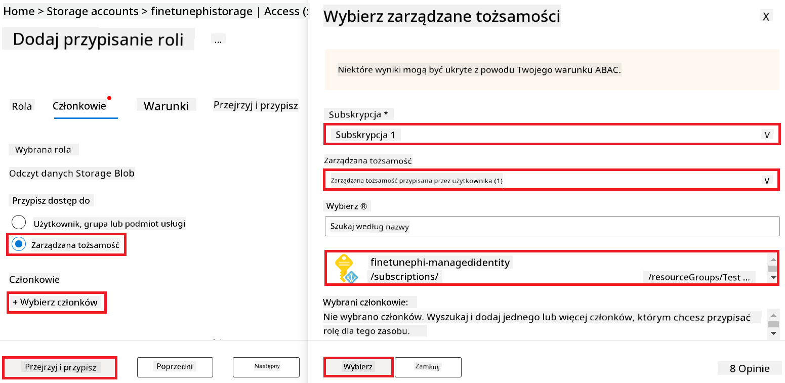
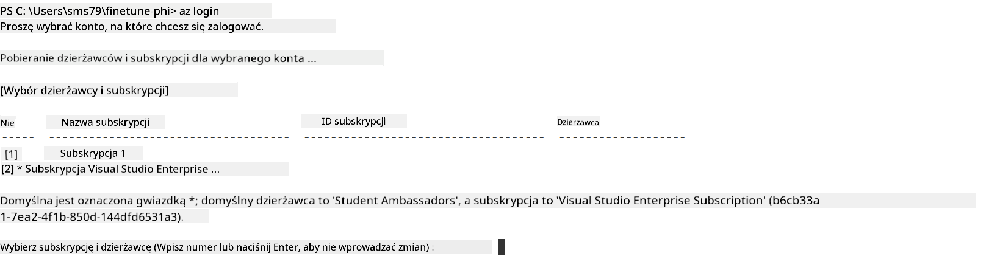
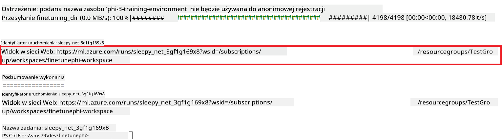
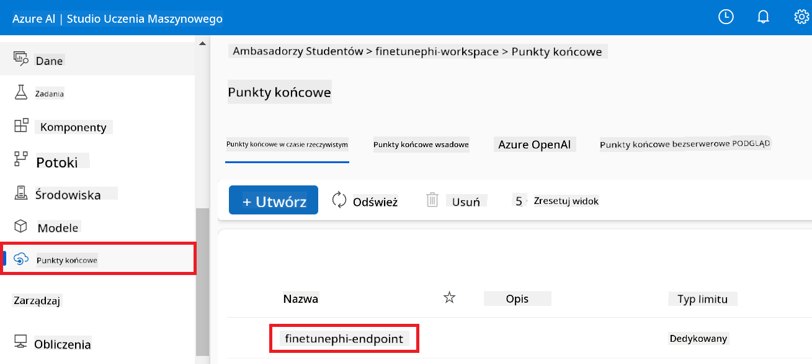
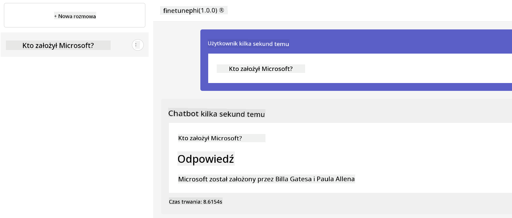

<!--
CO_OP_TRANSLATOR_METADATA:
{
  "original_hash": "7ca2c30fdb802664070e9cfbf92e24fe",
  "translation_date": "2026-01-05T03:23:52+00:00",
  "source_file": "md/02.Application/01.TextAndChat/Phi3/E2E_Phi-3-FineTuning_PromptFlow_Integration.md",
  "language_code": "pl"
}
-->
# Fine-tune and Integrate custom Phi-3 models with Prompt flow

This end-to-end (E2E) sample is based on the guide "[Fine-Tune and Integrate Custom Phi-3 Models with Prompt Flow: Step-by-Step Guide](https://techcommunity.microsoft.com/t5/educator-developer-blog/fine-tune-and-integrate-custom-phi-3-models-with-prompt-flow/ba-p/4178612?WT.mc_id=aiml-137032-kinfeylo)" from the Microsoft Tech Community. It introduces the processes of fine-tuning, deploying, and integrating custom Phi-3 models with Prompt flow.

## Overview

In this E2E sample, you will learn how to fine-tune the Phi-3 model and integrate it with Prompt flow. By leveraging Azure Machine Learning, and Prompt flow you will establish a workflow for deploying and utilizing custom AI models. This E2E sample is divided into three scenarios:

**Scenario 1: Set up Azure resources and Prepare for fine-tuning**

**Scenario 2: Fine-tune the Phi-3 model and Deploy in Azure Machine Learning Studio**

**Scenario 3: Integrate with Prompt flow and Chat with your custom model**

Here is an overview of this E2E sample.



### Table of Contents

1. **[Scenario 1: Set up Azure resources and Prepare for fine-tuning](../../../../../../md/02.Application/01.TextAndChat/Phi3)**
    - [Create an Azure Machine Learning Workspace](../../../../../../md/02.Application/01.TextAndChat/Phi3)
    - [Request GPU quotas in Azure Subscription](../../../../../../md/02.Application/01.TextAndChat/Phi3)
    - [Add role assignment](../../../../../../md/02.Application/01.TextAndChat/Phi3)
    - [Set up project](../../../../../../md/02.Application/01.TextAndChat/Phi3)
    - [Prepare dataset for fine-tuning](../../../../../../md/02.Application/01.TextAndChat/Phi3)

1. **[Scenario 2: Fine-tune Phi-3 model and Deploy in Azure Machine Learning Studio](../../../../../../md/02.Application/01.TextAndChat/Phi3)**
    - [Set up Azure CLI](../../../../../../md/02.Application/01.TextAndChat/Phi3)
    - [Fine-tune the Phi-3 model](../../../../../../md/02.Application/01.TextAndChat/Phi3)
    - [Deploy the fine-tuned model](../../../../../../md/02.Application/01.TextAndChat/Phi3)

1. **[Scenario 3: Integrate with Prompt flow and Chat with your custom model](../../../../../../md/02.Application/01.TextAndChat/Phi3)**
    - [Integrate the custom Phi-3 model with Prompt flow](../../../../../../md/02.Application/01.TextAndChat/Phi3)
    - [Chat with your custom model](../../../../../../md/02.Application/01.TextAndChat/Phi3)

## Scenario 1: Set up Azure resources and Prepare for fine-tuning

### Create an Azure Machine Learning Workspace

1. Type *azure machine learning* in the **search bar** at the top of the portal page and select **Azure Machine Learning** from the options that appear.

    

1. Select **+ Create** from the navigation menu.

1. Select **New workspace** from the navigation menu.

    

1. Perform the following tasks:

    - Select your Azure **Subscription**.
    - Select the **Resource group** to use (create a new one if needed).
    - Enter **Workspace Name**. It must be a unique value.
    - Select the **Region** you'd like to use.
    - Select the **Storage account** to use (create a new one if needed).
    - Select the **Key vault** to use (create a new one if needed).
    - Select the **Application insights** to use (create a new one if needed).
    - Select the **Container registry** to use (create a new one if needed).

    

1. Select **Review + Create**.

1. Select **Create**.

### Request GPU quotas in Azure Subscription

In this E2E sample, you will use the *Standard_NC24ads_A100_v4 GPU* for fine-tuning, which requires a quota request, and the *Standard_E4s_v3* CPU for deployment, which does not require a quota request.

> [!NOTE]
>
> Only Pay-As-You-Go subscriptions (the standard subscription type) are eligible for GPU allocation; benefit subscriptions are not currently supported.
>
> For those using benefit subscriptions (such as Visual Studio Enterprise Subscription) or those looking to quickly test the fine-tuning and deployment process, this tutorial also provides guidance for fine-tuning with a minimal dataset using a CPU. However, it is important to note that fine-tuning results are significantly better when using a GPU with larger datasets.

1. Visit [Azure ML Studio](https://ml.azure.com/home?wt.mc_id=studentamb_279723).

1. Perform the following tasks to request *Standard NCADSA100v4 Family* quota:

    - Select **Quota** from the left side tab.
    - Select the **Virtual machine family** to use. For example, select **Standard NCADSA100v4 Family Cluster Dedicated vCPUs**, which includes the *Standard_NC24ads_A100_v4* GPU.
    - Select the **Request quota** from the navigation menu.

        

    - Inside the Request quota page, enter the **New cores limit** you'd like to use. For example, 24.
    - Inside the Request quota page, select **Submit** to request the GPU quota.

> [!NOTE]
> You can select the appropriate GPU or CPU for your needs by referring to [Sizes for Virtual Machines in Azure](https://learn.microsoft.com/azure/virtual-machines/sizes/overview?tabs=breakdownseries%2Cgeneralsizelist%2Ccomputesizelist%2Cmemorysizelist%2Cstoragesizelist%2Cgpusizelist%2Cfpgasizelist%2Chpcsizelist) document.

### Add role assignment

To fine-tune and deploy your models, you must first create a User Assigned Managed Identity (UAI) and assign it the appropriate permissions. This UAI will be used for authentication during deployment

#### Create User Assigned Managed Identity(UAI)

1. Type *managed identities* in the **search bar** at the top of the portal page and select **Managed Identities** from the options that appear.

    

1. Select **+ Create**.

    

1. Perform the following tasks:

    - Select your Azure **Subscription**.
    - Select the **Resource group** to use (create a new one if needed).
    - Select the **Region** you'd like to use.
    - Enter the **Name**. It must be a unique value.

1. Select **Review + create**.

1. Select **+ Create**.

#### Add Contributor role assignment to Managed Identity

1. Navigate to the Managed Identity resource that you created.

1. Select **Azure role assignments** from the left side tab.

1. Select **+Add role assignment** from the navigation menu.

1. Inside Add role assignment page, Perform the following tasks:
    - Select the **Scope** to **Resource group**.
    - Select your Azure **Subscription**.
    - Select the **Resource group** to use.
    - Select the **Role** to **Contributor**.

    

1. Select **Save**.

#### Add Storage Blob Data Reader role assignment to Managed Identity

1. Type *storage accounts* in the **search bar** at the top of the portal page and select **Storage accounts** from the options that appear.

    

1. Select the storage account that associated with the Azure Machine Learning workspace that you created. For example, *finetunephistorage*.

1. Perform the following tasks to navigate to Add role assignment page:

    - Navigate to the Azure Storage account that you created.
    - Select **Access Control (IAM)** from the left side tab.
    - Select **+ Add** from the navigation menu.
    - Select **Add role assignment** from the navigation menu.

    

1. Inside Add role assignment page, Perform the following tasks:

    - Inside the Role page, type *Storage Blob Data Reader* in the **search bar** and select **Storage Blob Data Reader** from the options that appear.
    - Inside the Role page, select **Next**.
    - Inside the Members page, select **Assign access to** **Managed identity**.
    - Inside the Members page, select **+ Select members**.
    - Inside Select managed identities page, select your Azure **Subscription**.
    - Inside Select managed identities page, select the **Managed identity** to **Manage Identity**.
    - Inside Select managed identities page, select the Manage Identity that you created. For example, *finetunephi-managedidentity*.
    - Inside Select managed identities page, select **Select**.

    

1. Select **Review + assign**.

#### Add AcrPull role assignment to Managed Identity

1. Type *container registries* in the **search bar** at the top of the portal page and select **Container registries** from the options that appear.

    

1. Select the container registry that associated with the Azure Machine Learning workspace. For example, *finetunephicontainerregistries*

1. Perform the following tasks to navigate to Add role assignment page:

    - Select **Access Control (IAM)** from the left side tab.
    - Select **+ Add** from the navigation menu.
    - Select **Add role assignment** from the navigation menu.

1. Inside Add role assignment page, Perform the following tasks:

    - Inside the Role page, Type *AcrPull* in the **search bar** and select **AcrPull** from the options that appear.
    - Inside the Role page, select **Next**.
    - Inside the Members page, select **Assign access to** **Managed identity**.
    - Inside the Members page, select **+ Select members**.
    - Inside Select managed identities page, select your Azure **Subscription**.
    - Inside Select managed identities page, select the **Managed identity** to **Manage Identity**.
    - Inside Select managed identities page, select the Manage Identity that you created. For example, *finetunephi-managedidentity*.
    - Inside Select managed identities page, select **Select**.
    - Select **Review + assign**.

### Set up project

Now, you will create a folder to work in and set up a virtual environment to develop a program that interacts with users and uses stored chat history from Azure Cosmos DB to inform its responses.

#### Create a folder to work inside it

1. Open a terminal window and type the following command to create a folder named *finetune-phi* in the default path.

    ```console
    mkdir finetune-phi
    ```

1. Type the following command inside your terminal to navigate to the *finetune-phi* folder you created.

    ```console
    cd finetune-phi
    ```

#### Create a virtual environment

1. Type the following command inside your terminal to create a virtual environment named *.venv*.

    ```console
    python -m venv .venv
    ```

1. Type the following command inside your terminal to activate the virtual environment.

    ```console
    .venv\Scripts\activate.bat
    ```

> [!NOTE]
>
> If it worked, you should see *(.venv)* before the command prompt.

#### Install the required packages

1. Type the following commands inside your terminal to install the required packages.

    ```console
    pip install datasets==2.19.1
    pip install transformers==4.41.1
    pip install azure-ai-ml==1.16.0
    pip install torch==2.3.1
    pip install trl==0.9.4
    pip install promptflow==1.12.0
    ```

#### Create project files
W tym ćwiczeniu utworzysz niezbędne pliki dla naszego projektu. Pliki te obejmują skrypty do pobierania zestawu danych, konfigurowania środowiska Azure Machine Learning, dostrajania modelu Phi-3 oraz wdrażania dostrojonego modelu. Utworzysz także plik *conda.yml* do skonfigurowania środowiska do dostrajania.

W tym ćwiczeniu wykonasz:

- Utwórz plik *download_dataset.py*, aby pobrać zestaw danych.
- Utwórz plik *setup_ml.py*, aby skonfigurować środowisko Azure Machine Learning.
- Utwórz plik *fine_tune.py* w folderze *finetuning_dir*, aby dostroić model Phi-3 przy użyciu zestawu danych.
- Utwórz plik *conda.yml*, aby skonfigurować środowisko do dostrajania.
- Utwórz plik *deploy_model.py*, aby wdrożyć dostrojony model.
- Utwórz plik *integrate_with_promptflow.py*, aby zintegrować dostrojony model i uruchomić model za pomocą Prompt Flow.
- Utwórz plik flow.dag.yml, aby skonfigurować strukturę workflow dla Prompt Flow.
- Utwórz plik *config.py*, aby wprowadzić informacje o Azure.

> [!NOTE]
>
> Complete folder structure:
>
> ```text
> └── YourUserName
> .    └── finetune-phi
> .        ├── finetuning_dir
> .        │      └── fine_tune.py
> .        ├── conda.yml
> .        ├── config.py
> .        ├── deploy_model.py
> .        ├── download_dataset.py
> .        ├── flow.dag.yml
> .        ├── integrate_with_promptflow.py
> .        └── setup_ml.py
> ```

1. Otwórz **Visual Studio Code**.

1. Wybierz **Plik** (File) z paska menu.

1. Wybierz **Otwórz folder** (Open Folder).

1. Wybierz folder *finetune-phi*, który utworzyłeś, znajdujący się w *C:\Users\yourUserName\finetune-phi*.

    

1. W lewym panelu Visual Studio Code kliknij prawym przyciskiem i wybierz **Nowy plik** (New File), aby utworzyć nowy plik o nazwie *download_dataset.py*.

1. W lewym panelu Visual Studio Code kliknij prawym przyciskiem i wybierz **Nowy plik** (New File), aby utworzyć nowy plik o nazwie *setup_ml.py*.

1. W lewym panelu Visual Studio Code kliknij prawym przyciskiem i wybierz **Nowy plik** (New File), aby utworzyć nowy plik o nazwie *deploy_model.py*.

    

1. W lewym panelu Visual Studio Code kliknij prawym przyciskiem i wybierz **Nowy folder** (New Folder), aby utworzyć nowy folder o nazwie *finetuning_dir*.

1. W folderze *finetuning_dir* utwórz nowy plik o nazwie *fine_tune.py*.

#### Create and Configure *conda.yml* file

1. W lewym panelu Visual Studio Code kliknij prawym przyciskiem i wybierz **Nowy plik** (New File), aby utworzyć nowy plik o nazwie *conda.yml*.

1. Dodaj następujący kod do pliku *conda.yml*, aby skonfigurować środowisko do dostrajania modelu Phi-3.

    ```yml
    name: phi-3-training-env
    channels:
      - defaults
      - conda-forge
    dependencies:
      - python=3.10
      - pip
      - numpy<2.0
      - pip:
          - torch==2.4.0
          - torchvision==0.19.0
          - trl==0.8.6
          - transformers==4.41
          - datasets==2.21.0
          - azureml-core==1.57.0
          - azure-storage-blob==12.19.0
          - azure-ai-ml==1.16
          - azure-identity==1.17.1
          - accelerate==0.33.0
          - mlflow==2.15.1
          - azureml-mlflow==1.57.0
    ```

#### Create and Configure *config.py* file

1. W lewym panelu Visual Studio Code kliknij prawym przyciskiem i wybierz **Nowy plik** (New File), aby utworzyć nowy plik o nazwie *config.py*.

1. Dodaj następujący kod do pliku *config.py*, aby dodać informacje dotyczące Azure.

    ```python
    # Ustawienia Azure
    AZURE_SUBSCRIPTION_ID = "your_subscription_id"
    AZURE_RESOURCE_GROUP_NAME = "your_resource_group_name" # "TestGroup"

    # Ustawienia Azure Machine Learning
    AZURE_ML_WORKSPACE_NAME = "your_workspace_name" # "finetunephi-workspace"

    # Ustawienia zarządzanej tożsamości Azure
    AZURE_MANAGED_IDENTITY_CLIENT_ID = "your_azure_managed_identity_client_id"
    AZURE_MANAGED_IDENTITY_NAME = "your_azure_managed_identity_name" # "finetune-phi-mangedidentity"
    AZURE_MANAGED_IDENTITY_RESOURCE_ID = f"/subscriptions/{AZURE_SUBSCRIPTION_ID}/resourceGroups/{AZURE_RESOURCE_GROUP_NAME}/providers/Microsoft.ManagedIdentity/userAssignedIdentities/{AZURE_MANAGED_IDENTITY_NAME}"

    # Ścieżki plików zestawu danych
    TRAIN_DATA_PATH = "data/train_data.jsonl"
    TEST_DATA_PATH = "data/test_data.jsonl"

    # Ustawienia dostrojonego modelu
    AZURE_MODEL_NAME = "your_fine_tuned_model_name" # "finetune-phi-model"
    AZURE_ENDPOINT_NAME = "your_fine_tuned_model_endpoint_name" # "finetune-phi-endpoint"
    AZURE_DEPLOYMENT_NAME = "your_fine_tuned_model_deployment_name" # "finetune-phi-deployment"

    AZURE_ML_API_KEY = "your_fine_tuned_model_api_key"
    AZURE_ML_ENDPOINT = "your_fine_tuned_model_endpoint_uri" # "https://{your-endpoint-name}.{your-region}.inference.ml.azure.com/score"
    ```

#### Add Azure environment variables

1. Wykonaj następujące kroki, aby dodać identyfikator subskrypcji Azure:

    - Wpisz *subscriptions* w **pasku wyszukiwania** na górze strony portalu i wybierz **Subscriptions** z dostępnych opcji.
    - Wybierz subskrypcję Azure, której aktualnie używasz.
    - Skopiuj i wklej swój identyfikator subskrypcji do pliku *config.py*.

    

1. Wykonaj następujące kroki, aby dodać nazwę Workspace Azure:

    - Przejdź do zasobu Azure Machine Learning, który utworzyłeś.
    - Skopiuj i wklej nazwę konta do pliku *config.py*.

    

1. Wykonaj następujące kroki, aby dodać nazwę grupy zasobów Azure:

    - Przejdź do zasobu Azure Machine Learning, który utworzyłeś.
    - Skopiuj i wklej nazwę grupy zasobów Azure do pliku *config.py*.

    

2. Wykonaj następujące kroki, aby dodać nazwę zarządzanej tożsamości Azure

    - Przejdź do zasobu Managed Identities, który utworzyłeś.
    - Skopiuj i wklej nazwę zarządzanej tożsamości Azure do pliku *config.py*.

    

### Prepare dataset for fine-tuning

W tym ćwiczeniu uruchomisz plik *download_dataset.py*, aby pobrać zestawy danych *ULTRACHAT_200k* do lokalnego środowiska. Następnie użyjesz tych zestawów danych do dostrojenia modelu Phi-3 w Azure Machine Learning.

#### Download your dataset using *download_dataset.py*

1. Otwórz plik *download_dataset.py* w Visual Studio Code.

1. Dodaj następujący kod do pliku *download_dataset.py*.

    ```python
    import json
    import os
    from datasets import load_dataset
    from config import (
        TRAIN_DATA_PATH,
        TEST_DATA_PATH)

    def load_and_split_dataset(dataset_name, config_name, split_ratio):
        """
        Load and split a dataset.
        """
        # Wczytaj zbiór danych o określonej nazwie, konfiguracji i proporcji podziału
        dataset = load_dataset(dataset_name, config_name, split=split_ratio)
        print(f"Original dataset size: {len(dataset)}")
        
        # Podziel zbiór danych na zbiór treningowy i zbiór testowy (80% treningowy, 20% testowy)
        split_dataset = dataset.train_test_split(test_size=0.2)
        print(f"Train dataset size: {len(split_dataset['train'])}")
        print(f"Test dataset size: {len(split_dataset['test'])}")
        
        return split_dataset

    def save_dataset_to_jsonl(dataset, filepath):
        """
        Save a dataset to a JSONL file.
        """
        # Utwórz katalog, jeśli nie istnieje
        os.makedirs(os.path.dirname(filepath), exist_ok=True)
        
        # Otwórz plik w trybie zapisu
        with open(filepath, 'w', encoding='utf-8') as f:
            # Iteruj po każdym rekordzie w zbiorze danych
            for record in dataset:
                # Zserializuj rekord jako obiekt JSON i zapisz go do pliku
                json.dump(record, f)
                # Zapisz znak nowej linii, aby oddzielić rekordy
                f.write('\n')
        
        print(f"Dataset saved to {filepath}")

    def main():
        """
        Main function to load, split, and save the dataset.
        """
        # Wczytaj i podziel zbiór ULTRACHAT_200k z określoną konfiguracją i proporcją podziału
        dataset = load_and_split_dataset("HuggingFaceH4/ultrachat_200k", 'default', 'train_sft[:1%]')
        
        # Wyodrębnij z podziału zbiór treningowy i zbiór testowy
        train_dataset = dataset['train']
        test_dataset = dataset['test']

        # Zapisz zbiór treningowy do pliku JSONL
        save_dataset_to_jsonl(train_dataset, TRAIN_DATA_PATH)
        
        # Zapisz zbiór testowy do osobnego pliku JSONL
        save_dataset_to_jsonl(test_dataset, TEST_DATA_PATH)

    if __name__ == "__main__":
        main()

    ```

> [!TIP]
>
> **Wskazówki dotyczące dostrajania przy minimalnym zestawie danych z użyciem CPU**
>
> Jeśli chcesz użyć procesora (CPU) do dostrajania, podejście to jest idealne dla osób z subskrypcjami uprawniającymi do korzyści (takimi jak Visual Studio Enterprise Subscription) lub gdy chcesz szybko przetestować proces dostrajania i wdrażania.
>
> Zastąp `dataset = load_and_split_dataset("HuggingFaceH4/ultrachat_200k", 'default', 'train_sft[:1%]')` przez `dataset = load_and_split_dataset("HuggingFaceH4/ultrachat_200k", 'default', 'train_sft[:10]')`
>

1. Wpisz następujące polecenie w terminalu, aby uruchomić skrypt i pobrać zestaw danych do lokalnego środowiska.

    ```console
    python download_data.py
    ```

1. Sprawdź, czy zestawy danych zostały pomyślnie zapisane w lokalnym katalogu *finetune-phi/data*.

> [!NOTE]
>
> **Rozmiar zestawu danych i czas dostrajania**
>
> W tym przykładzie E2E używasz tylko 1% zestawu danych (`train_sft[:1%]`). Zdecydowanie zmniejsza to ilość danych, przyspieszając zarówno przesyłanie, jak i proces dostrajania. Możesz dostosować procent, aby znaleźć odpowiednią równowagę między czasem treningu a wydajnością modelu. Użycie mniejszego podzbioru danych skraca czas wymagany do dostrajania, co ułatwia proces w przykładowym scenariuszu E2E.

## Scenario 2: Fine-tune Phi-3 model and Deploy in Azure Machine Learning Studio

### Set up Azure CLI

Musisz skonfigurować Azure CLI, aby uwierzytelnić swoje środowisko. Azure CLI pozwala zarządzać zasobami Azure bezpośrednio z wiersza poleceń i dostarcza poświadczenia niezbędne do tego, aby Azure Machine Learning miało dostęp do tych zasobów. Aby rozpocząć, zainstaluj [Azure CLI](https://learn.microsoft.com/cli/azure/install-azure-cli)

1. Otwórz okno terminala i wpisz następujące polecenie, aby zalogować się do konta Azure.

    ```console
    az login
    ```

1. Wybierz konto Azure, którego chcesz użyć.

1. Wybierz subskrypcję Azure, której chcesz używać.

    

> [!TIP]
>
> Jeśli masz problemy z logowaniem do Azure, spróbuj użyć kodu urządzenia. Otwórz okno terminala i wpisz następujące polecenie, aby zalogować się do konta Azure:
>
> ```console
> az login --use-device-code
> ```
>

### Fine-tune the Phi-3 model

W tym ćwiczeniu dostroisz model Phi-3 przy użyciu udostępnionego zestawu danych. Najpierw zdefiniujesz proces dostrajania w pliku *fine_tune.py*. Następnie skonfigurujesz środowisko Azure Machine Learning i uruchomisz proces dostrajania, uruchamiając plik *setup_ml.py*. Ten skrypt zapewnia, że dostrajanie odbywa się w środowisku Azure Machine Learning.

Uruchamiając *setup_ml.py*, uruchomisz proces dostrajania w środowisku Azure Machine Learning.

#### Add code to the *fine_tune.py* file

1. Przejdź do folderu *finetuning_dir* i otwórz plik *fine_tune.py* w Visual Studio Code.

1. Dodaj następujący kod do pliku *fine_tune.py*.

    ```python
    import argparse
    import sys
    import logging
    import os
    from datasets import load_dataset
    import torch
    import mlflow
    from transformers import AutoModelForCausalLM, AutoTokenizer, TrainingArguments
    from trl import SFTTrainer

    # Aby uniknąć błędu INVALID_PARAMETER_VALUE w MLflow, wyłącz integrację z MLflow
    os.environ["DISABLE_MLFLOW_INTEGRATION"] = "True"

    # Konfiguracja logowania
    logging.basicConfig(
        format="%(asctime)s - %(levelname)s - %(name)s - %(message)s",
        datefmt="%Y-%m-%d %H:%M:%S",
        handlers=[logging.StreamHandler(sys.stdout)],
        level=logging.WARNING
    )
    logger = logging.getLogger(__name__)

    def initialize_model_and_tokenizer(model_name, model_kwargs):
        """
        Initialize the model and tokenizer with the given pretrained model name and arguments.
        """
        model = AutoModelForCausalLM.from_pretrained(model_name, **model_kwargs)
        tokenizer = AutoTokenizer.from_pretrained(model_name)
        tokenizer.model_max_length = 2048
        tokenizer.pad_token = tokenizer.unk_token
        tokenizer.pad_token_id = tokenizer.convert_tokens_to_ids(tokenizer.pad_token)
        tokenizer.padding_side = 'right'
        return model, tokenizer

    def apply_chat_template(example, tokenizer):
        """
        Apply a chat template to tokenize messages in the example.
        """
        messages = example["messages"]
        if messages[0]["role"] != "system":
            messages.insert(0, {"role": "system", "content": ""})
        example["text"] = tokenizer.apply_chat_template(
            messages, tokenize=False, add_generation_prompt=False
        )
        return example

    def load_and_preprocess_data(train_filepath, test_filepath, tokenizer):
        """
        Load and preprocess the dataset.
        """
        train_dataset = load_dataset('json', data_files=train_filepath, split='train')
        test_dataset = load_dataset('json', data_files=test_filepath, split='train')
        column_names = list(train_dataset.features)

        train_dataset = train_dataset.map(
            apply_chat_template,
            fn_kwargs={"tokenizer": tokenizer},
            num_proc=10,
            remove_columns=column_names,
            desc="Applying chat template to train dataset",
        )

        test_dataset = test_dataset.map(
            apply_chat_template,
            fn_kwargs={"tokenizer": tokenizer},
            num_proc=10,
            remove_columns=column_names,
            desc="Applying chat template to test dataset",
        )

        return train_dataset, test_dataset

    def train_and_evaluate_model(train_dataset, test_dataset, model, tokenizer, output_dir):
        """
        Train and evaluate the model.
        """
        training_args = TrainingArguments(
            bf16=True,
            do_eval=True,
            output_dir=output_dir,
            eval_strategy="epoch",
            learning_rate=5.0e-06,
            logging_steps=20,
            lr_scheduler_type="cosine",
            num_train_epochs=3,
            overwrite_output_dir=True,
            per_device_eval_batch_size=4,
            per_device_train_batch_size=4,
            remove_unused_columns=True,
            save_steps=500,
            seed=0,
            gradient_checkpointing=True,
            gradient_accumulation_steps=1,
            warmup_ratio=0.2,
        )

        trainer = SFTTrainer(
            model=model,
            args=training_args,
            train_dataset=train_dataset,
            eval_dataset=test_dataset,
            max_seq_length=2048,
            dataset_text_field="text",
            tokenizer=tokenizer,
            packing=True
        )

        train_result = trainer.train()
        trainer.log_metrics("train", train_result.metrics)

        mlflow.transformers.log_model(
            transformers_model={"model": trainer.model, "tokenizer": tokenizer},
            artifact_path=output_dir,
        )

        tokenizer.padding_side = 'left'
        eval_metrics = trainer.evaluate()
        eval_metrics["eval_samples"] = len(test_dataset)
        trainer.log_metrics("eval", eval_metrics)

    def main(train_file, eval_file, model_output_dir):
        """
        Main function to fine-tune the model.
        """
        model_kwargs = {
            "use_cache": False,
            "trust_remote_code": True,
            "torch_dtype": torch.bfloat16,
            "device_map": None,
            "attn_implementation": "eager"
        }

        # pretrained_model_name = "microsoft/Phi-3-mini-4k-instruct"
        pretrained_model_name = "microsoft/Phi-3.5-mini-instruct"

        with mlflow.start_run():
            model, tokenizer = initialize_model_and_tokenizer(pretrained_model_name, model_kwargs)
            train_dataset, test_dataset = load_and_preprocess_data(train_file, eval_file, tokenizer)
            train_and_evaluate_model(train_dataset, test_dataset, model, tokenizer, model_output_dir)

    if __name__ == "__main__":
        parser = argparse.ArgumentParser()
        parser.add_argument("--train-file", type=str, required=True, help="Path to the training data")
        parser.add_argument("--eval-file", type=str, required=True, help="Path to the evaluation data")
        parser.add_argument("--model_output_dir", type=str, required=True, help="Directory to save the fine-tuned model")
        args = parser.parse_args()
        main(args.train_file, args.eval_file, args.model_output_dir)

    ```

1. Zapisz i zamknij plik *fine_tune.py*.

> [!TIP]
> **Możesz dostroić model Phi-3.5**
>
> W pliku *fine_tune.py* możesz zmienić `pretrained_model_name` z `"microsoft/Phi-3-mini-4k-instruct"` na dowolny model, który chcesz dostroić. Na przykład, jeśli zmienisz go na `"microsoft/Phi-3.5-mini-instruct"`, użyjesz modelu Phi-3.5-mini-instruct do dostrajania. Aby znaleźć i użyć preferowanej nazwy modelu, odwiedź [Hugging Face](https://huggingface.co/), wyszukaj model, który Cię interesuje, a następnie skopiuj i wklej jego nazwę do pola `pretrained_model_name` w swoim skrypcie.
>
> <image type="content" src="../../../../imgs/02/FineTuning-PromptFlow/finetunephi3.5.png" alt-text="Dostrajanie Phi-3.5.">
>

#### Add code to the *setup_ml.py* file

1. Otwórz plik *setup_ml.py* w Visual Studio Code.

1. Dodaj następujący kod do pliku *setup_ml.py*.

    ```python
    import logging
    from azure.ai.ml import MLClient, command, Input
    from azure.ai.ml.entities import Environment, AmlCompute
    from azure.identity import AzureCliCredential
    from config import (
        AZURE_SUBSCRIPTION_ID,
        AZURE_RESOURCE_GROUP_NAME,
        AZURE_ML_WORKSPACE_NAME,
        TRAIN_DATA_PATH,
        TEST_DATA_PATH
    )

    # Stałe

    # Odkomentuj poniższe linie, aby użyć instancji CPU do trenowania
    # COMPUTE_INSTANCE_TYPE = "Standard_E16s_v3" # CPU
    # COMPUTE_NAME = "cpu-e16s-v3"
    # DOCKER_IMAGE_NAME = "mcr.microsoft.com/azureml/openmpi4.1.0-ubuntu20.04:latest"

    # Odkomentuj poniższe linie, aby użyć instancji GPU do trenowania
    COMPUTE_INSTANCE_TYPE = "Standard_NC24ads_A100_v4"
    COMPUTE_NAME = "gpu-nc24s-a100-v4"
    DOCKER_IMAGE_NAME = "mcr.microsoft.com/azureml/curated/acft-hf-nlp-gpu:59"

    CONDA_FILE = "conda.yml"
    LOCATION = "eastus2" # Zamień na lokalizację swojego klastra obliczeniowego
    FINETUNING_DIR = "./finetuning_dir" # Ścieżka do skryptu dostrajania
    TRAINING_ENV_NAME = "phi-3-training-environment" # Nazwa środowiska treningowego
    MODEL_OUTPUT_DIR = "./model_output" # Ścieżka do katalogu wyjściowego modelu w Azure ML

    # Ustawienia logowania do śledzenia procesu
    logger = logging.getLogger(__name__)
    logging.basicConfig(
        format="%(asctime)s - %(levelname)s - %(name)s - %(message)s",
        datefmt="%Y-%m-%d %H:%M:%S",
        level=logging.WARNING
    )

    def get_ml_client():
        """
        Initialize the ML Client using Azure CLI credentials.
        """
        credential = AzureCliCredential()
        return MLClient(credential, AZURE_SUBSCRIPTION_ID, AZURE_RESOURCE_GROUP_NAME, AZURE_ML_WORKSPACE_NAME)

    def create_or_get_environment(ml_client):
        """
        Create or update the training environment in Azure ML.
        """
        env = Environment(
            image=DOCKER_IMAGE_NAME,  # Obraz Dockera dla środowiska
            conda_file=CONDA_FILE,  # Plik środowiska Conda
            name=TRAINING_ENV_NAME,  # Nazwa środowiska
        )
        return ml_client.environments.create_or_update(env)

    def create_or_get_compute_cluster(ml_client, compute_name, COMPUTE_INSTANCE_TYPE, location):
        """
        Create or update the compute cluster in Azure ML.
        """
        try:
            compute_cluster = ml_client.compute.get(compute_name)
            logger.info(f"Compute cluster '{compute_name}' already exists. Reusing it for the current run.")
        except Exception:
            logger.info(f"Compute cluster '{compute_name}' does not exist. Creating a new one with size {COMPUTE_INSTANCE_TYPE}.")
            compute_cluster = AmlCompute(
                name=compute_name,
                size=COMPUTE_INSTANCE_TYPE,
                location=location,
                tier="Dedicated",  # Poziom klastra obliczeniowego
                min_instances=0,  # Minimalna liczba instancji
                max_instances=1  # Maksymalna liczba instancji
            )
            ml_client.compute.begin_create_or_update(compute_cluster).wait()  # Poczekaj na utworzenie klastra
        return compute_cluster

    def create_fine_tuning_job(env, compute_name):
        """
        Set up the fine-tuning job in Azure ML.
        """
        return command(
            code=FINETUNING_DIR,  # Ścieżka do fine_tune.py
            command=(
                "python fine_tune.py "
                "--train-file ${{inputs.train_file}} "
                "--eval-file ${{inputs.eval_file}} "
                "--model_output_dir ${{inputs.model_output}}"
            ),
            environment=env,  # Środowisko treningowe
            compute=compute_name,  # Klaster obliczeniowy do użycia
            inputs={
                "train_file": Input(type="uri_file", path=TRAIN_DATA_PATH),  # Ścieżka do pliku z danymi treningowymi
                "eval_file": Input(type="uri_file", path=TEST_DATA_PATH),  # Ścieżka do pliku z danymi ewaluacyjnymi
                "model_output": MODEL_OUTPUT_DIR
            }
        )

    def main():
        """
        Main function to set up and run the fine-tuning job in Azure ML.
        """
        # Zainicjalizuj klienta ML
        ml_client = get_ml_client()

        # Utwórz środowisko
        env = create_or_get_environment(ml_client)
        
        # Utwórz lub pobierz istniejący klaster obliczeniowy
        create_or_get_compute_cluster(ml_client, COMPUTE_NAME, COMPUTE_INSTANCE_TYPE, LOCATION)

        # Utwórz i prześlij zadanie dostrajania
        job = create_fine_tuning_job(env, COMPUTE_NAME)
        returned_job = ml_client.jobs.create_or_update(job)  # Prześlij zadanie
        ml_client.jobs.stream(returned_job.name)  # Strumieniuj logi zadania
        
        # Przechwyć nazwę zadania
        job_name = returned_job.name
        print(f"Job name: {job_name}")

    if __name__ == "__main__":
        main()

    ```

1. Zastąp `COMPUTE_INSTANCE_TYPE`, `COMPUTE_NAME`, oraz `LOCATION` swoimi konkretnymi danymi.

    ```python
   # Odkomentuj poniższe linie, aby użyć instancji GPU do trenowania
    COMPUTE_INSTANCE_TYPE = "Standard_NC24ads_A100_v4"
    COMPUTE_NAME = "gpu-nc24s-a100-v4"
    ...
    LOCATION = "eastus2" # Zastąp lokalizacją swojego klastra obliczeniowego
    ```

> [!TIP]
>
> **Wskazówki dotyczące dostrajania przy minimalnym zestawie danych z użyciem CPU**
>
> Jeśli chcesz użyć procesora (CPU) do dostrajania, podejście to jest idealne dla osób z subskrypcjami uprawniającymi do korzyści (takimi jak Visual Studio Enterprise Subscription) lub gdy chcesz szybko przetestować proces dostrajania i wdrażania.
>
> 1. Otwórz plik *setup_ml*.
> 1. Zastąp `COMPUTE_INSTANCE_TYPE`, `COMPUTE_NAME`, oraz `DOCKER_IMAGE_NAME` następującymi wartościami. Jeśli nie masz dostępu do *Standard_E16s_v3*, możesz użyć równoważnej instancji CPU lub poprosić o nową kwotę.
> 1. Zastąp `LOCATION` swoimi konkretnymi danymi.
>
>    ```python
>    # Uncomment the following lines to use a CPU instance for training
>    COMPUTE_INSTANCE_TYPE = "Standard_E16s_v3" # cpu
>    COMPUTE_NAME = "cpu-e16s-v3"
>    DOCKER_IMAGE_NAME = "mcr.microsoft.com/azureml/openmpi4.1.0-ubuntu20.04:latest"
>    LOCATION = "eastus2" # Replace with the location of your compute cluster
>    ```
>

1. Wpisz następujące polecenie, aby uruchomić skrypt *setup_ml.py* i rozpocząć proces dostrajania w Azure Machine Learning.

    ```python
    python setup_ml.py
    ```

1. W tym ćwiczeniu pomyślnie dostroiłeś model Phi-3 przy użyciu Azure Machine Learning. Uruchamiając skrypt *setup_ml.py*, skonfigurowałeś środowisko Azure Machine Learning i zainicjowałeś proces dostrajania zdefiniowany w pliku *fine_tune.py*. Pamiętaj, że proces dostrajania może zająć znaczną ilość czasu. Po uruchomieniu polecenia `python setup_ml.py` musisz poczekać na zakończenie procesu. Możesz monitorować status zadania dostrajania, korzystając z linku podanego w terminalu prowadzącego do portalu Azure Machine Learning.

    

### Deploy the fine-tuned model

Aby zintegrować dostrojony model Phi-3 z Prompt Flow, musisz wdrożyć model, aby był dostępny do wnioskowania w czasie rzeczywistym. Proces ten obejmuje zarejestrowanie modelu, utworzenie punktu końcowego online i wdrożenie modelu.

#### Set the model name, endpoint name, and deployment name for deployment

1. Otwórz plik *config.py*.

1. Zastąp `AZURE_MODEL_NAME = "your_fine_tuned_model_name"` pożądaną nazwą dla Twojego modelu.

1. Zastąp `AZURE_ENDPOINT_NAME = "your_fine_tuned_model_endpoint_name"` pożądaną nazwą dla Twojego punktu końcowego.

1. Zastąp `AZURE_DEPLOYMENT_NAME = "your_fine_tuned_model_deployment_name"` pożądaną nazwą dla Twojego wdrożenia.

#### Add code to the *deploy_model.py* file

Uruchomienie pliku *deploy_model.py* automatyzuje cały proces wdrażania. Rejestruje model, tworzy punkt końcowy i wykonuje wdrożenie na podstawie ustawień określonych w pliku config.py, które obejmują nazwę modelu, nazwę punktu końcowego i nazwę wdrożenia.

1. Otwórz plik *deploy_model.py* w Visual Studio Code.

1. Dodaj następujący kod do pliku *deploy_model.py*.

    ```python
    import logging
    from azure.identity import AzureCliCredential
    from azure.ai.ml import MLClient
    from azure.ai.ml.entities import Model, ProbeSettings, ManagedOnlineEndpoint, ManagedOnlineDeployment, IdentityConfiguration, ManagedIdentityConfiguration, OnlineRequestSettings
    from azure.ai.ml.constants import AssetTypes

    # Importy konfiguracji
    from config import (
        AZURE_SUBSCRIPTION_ID,
        AZURE_RESOURCE_GROUP_NAME,
        AZURE_ML_WORKSPACE_NAME,
        AZURE_MANAGED_IDENTITY_RESOURCE_ID,
        AZURE_MANAGED_IDENTITY_CLIENT_ID,
        AZURE_MODEL_NAME,
        AZURE_ENDPOINT_NAME,
        AZURE_DEPLOYMENT_NAME
    )

    # Stałe
    JOB_NAME = "your-job-name"
    COMPUTE_INSTANCE_TYPE = "Standard_E4s_v3"

    deployment_env_vars = {
        "SUBSCRIPTION_ID": AZURE_SUBSCRIPTION_ID,
        "RESOURCE_GROUP_NAME": AZURE_RESOURCE_GROUP_NAME,
        "UAI_CLIENT_ID": AZURE_MANAGED_IDENTITY_CLIENT_ID,
    }

    # Konfiguracja logowania
    logging.basicConfig(
        format="%(asctime)s - %(levelname)s - %(name)s - %(message)s",
        datefmt="%Y-%m-%d %H:%M:%S",
        level=logging.DEBUG
    )
    logger = logging.getLogger(__name__)

    def get_ml_client():
        """Initialize and return the ML Client."""
        credential = AzureCliCredential()
        return MLClient(credential, AZURE_SUBSCRIPTION_ID, AZURE_RESOURCE_GROUP_NAME, AZURE_ML_WORKSPACE_NAME)

    def register_model(ml_client, model_name, job_name):
        """Register a new model."""
        model_path = f"azureml://jobs/{job_name}/outputs/artifacts/paths/model_output"
        logger.info(f"Registering model {model_name} from job {job_name} at path {model_path}.")
        run_model = Model(
            path=model_path,
            name=model_name,
            description="Model created from run.",
            type=AssetTypes.MLFLOW_MODEL,
        )
        model = ml_client.models.create_or_update(run_model)
        logger.info(f"Registered model ID: {model.id}")
        return model

    def delete_existing_endpoint(ml_client, endpoint_name):
        """Delete existing endpoint if it exists."""
        try:
            endpoint_result = ml_client.online_endpoints.get(name=endpoint_name)
            logger.info(f"Deleting existing endpoint {endpoint_name}.")
            ml_client.online_endpoints.begin_delete(name=endpoint_name).result()
            logger.info(f"Deleted existing endpoint {endpoint_name}.")
        except Exception as e:
            logger.info(f"No existing endpoint {endpoint_name} found to delete: {e}")

    def create_or_update_endpoint(ml_client, endpoint_name, description=""):
        """Create or update an endpoint."""
        delete_existing_endpoint(ml_client, endpoint_name)
        logger.info(f"Creating new endpoint {endpoint_name}.")
        endpoint = ManagedOnlineEndpoint(
            name=endpoint_name,
            description=description,
            identity=IdentityConfiguration(
                type="user_assigned",
                user_assigned_identities=[ManagedIdentityConfiguration(resource_id=AZURE_MANAGED_IDENTITY_RESOURCE_ID)]
            )
        )
        endpoint_result = ml_client.online_endpoints.begin_create_or_update(endpoint).result()
        logger.info(f"Created new endpoint {endpoint_name}.")
        return endpoint_result

    def create_or_update_deployment(ml_client, endpoint_name, deployment_name, model):
        """Create or update a deployment."""

        logger.info(f"Creating deployment {deployment_name} for endpoint {endpoint_name}.")
        deployment = ManagedOnlineDeployment(
            name=deployment_name,
            endpoint_name=endpoint_name,
            model=model.id,
            instance_type=COMPUTE_INSTANCE_TYPE,
            instance_count=1,
            environment_variables=deployment_env_vars,
            request_settings=OnlineRequestSettings(
                max_concurrent_requests_per_instance=3,
                request_timeout_ms=180000,
                max_queue_wait_ms=120000
            ),
            liveness_probe=ProbeSettings(
                failure_threshold=30,
                success_threshold=1,
                period=100,
                initial_delay=500,
            ),
            readiness_probe=ProbeSettings(
                failure_threshold=30,
                success_threshold=1,
                period=100,
                initial_delay=500,
            ),
        )
        deployment_result = ml_client.online_deployments.begin_create_or_update(deployment).result()
        logger.info(f"Created deployment {deployment.name} for endpoint {endpoint_name}.")
        return deployment_result

    def set_traffic_to_deployment(ml_client, endpoint_name, deployment_name):
        """Set traffic to the specified deployment."""
        try:
            # Pobierz bieżące szczegóły punktu końcowego
            endpoint = ml_client.online_endpoints.get(name=endpoint_name)
            
            # Zaloguj bieżący przydział ruchu w celach debugowania
            logger.info(f"Current traffic allocation: {endpoint.traffic}")
            
            # Ustaw przydział ruchu dla wdrożenia
            endpoint.traffic = {deployment_name: 100}
            
            # Zaktualizuj punkt końcowy z nowym przydziałem ruchu
            endpoint_poller = ml_client.online_endpoints.begin_create_or_update(endpoint)
            updated_endpoint = endpoint_poller.result()
            
            # Zaloguj zaktualizowany przydział ruchu w celach debugowania
            logger.info(f"Updated traffic allocation: {updated_endpoint.traffic}")
            logger.info(f"Set traffic to deployment {deployment_name} at endpoint {endpoint_name}.")
            return updated_endpoint
        except Exception as e:
            # Zaloguj wszelkie błędy, które wystąpią podczas procesu
            logger.error(f"Failed to set traffic to deployment: {e}")
            raise


    def main():
        ml_client = get_ml_client()

        registered_model = register_model(ml_client, AZURE_MODEL_NAME, JOB_NAME)
        logger.info(f"Registered model ID: {registered_model.id}")

        endpoint = create_or_update_endpoint(ml_client, AZURE_ENDPOINT_NAME, "Endpoint for finetuned Phi-3 model")
        logger.info(f"Endpoint {AZURE_ENDPOINT_NAME} is ready.")

        try:
            deployment = create_or_update_deployment(ml_client, AZURE_ENDPOINT_NAME, AZURE_DEPLOYMENT_NAME, registered_model)
            logger.info(f"Deployment {AZURE_DEPLOYMENT_NAME} is created for endpoint {AZURE_ENDPOINT_NAME}.")

            set_traffic_to_deployment(ml_client, AZURE_ENDPOINT_NAME, AZURE_DEPLOYMENT_NAME)
            logger.info(f"Traffic is set to deployment {AZURE_DEPLOYMENT_NAME} at endpoint {AZURE_ENDPOINT_NAME}.")
        except Exception as e:
            logger.error(f"Failed to create or update deployment: {e}")

    if __name__ == "__main__":
        main()

    ```

1. Wykonaj następujące czynności, aby uzyskać `JOB_NAME`:

    - Przejdź do zasobu Azure Machine Learning, który utworzyłeś.
    - Wybierz **Studio web URL**, aby otworzyć obszar roboczy Azure Machine Learning.
    - Wybierz **Jobs** z lewego paska.
    - Wybierz eksperyment dotyczący dostrajania. Na przykład, *finetunephi*.
    - Wybierz zadanie (job), które utworzyłeś.
    - Skopiuj i wklej nazwę swojej pracy do `JOB_NAME = "your-job-name"` w pliku *deploy_model.py*.

1. Zastąp `COMPUTE_INSTANCE_TYPE` swoimi szczegółami.

1. Wpisz następujące polecenie, aby uruchomić skrypt *deploy_model.py* i rozpocząć proces wdrażania w usłudze Azure Machine Learning.

    ```python
    python deploy_model.py
    ```

> [!WARNING]
> Aby uniknąć dodatkowych opłat na Twoim koncie, upewnij się, że usuniesz utworzony punkt końcowy w obszarze roboczym Azure Machine Learning.
>

#### Sprawdź status wdrożenia w obszarze roboczym Azure Machine Learning

1. Odwiedź [Azure ML Studio](https://ml.azure.com/home?wt.mc_id=studentamb_279723).

1. Przejdź do obszaru roboczego Azure Machine Learning, który utworzyłeś.

1. Wybierz **Studio web URL**, aby otworzyć obszar roboczy Azure Machine Learning.

1. Wybierz **Endpoints** z lewego panelu.

    

2. Wybierz utworzony punkt końcowy.

    

3. Na tej stronie możesz zarządzać punktami końcowymi utworzonymi podczas procesu wdrażania.

## Scenariusz 3: Integracja z Prompt flow i czat z twoim niestandardowym modelem

### Zintegruj niestandardowy model Phi-3 z Prompt flow

Po pomyślnym wdrożeniu dostrojonego modelu możesz teraz zintegrować go z Prompt flow, aby używać modelu w aplikacjach działających w czasie rzeczywistym, umożliwiając różnorodne zadania interaktywne z twoim niestandardowym modelem Phi-3.

#### Ustaw klucz API i URI punktu końcowego dla dostrojonego modelu Phi-3

1. Przejdź do obszaru roboczego usługi Azure Machine Learning, który utworzyłeś.
1. Wybierz **Endpoints** z lewego panelu.
1. Wybierz utworzony punkt końcowy.
1. Wybierz **Consume** z menu nawigacyjnego.
1. Skopiuj i wklej swój **punkt końcowy REST** do pliku *config.py*, zastępując `AZURE_ML_ENDPOINT = "your_fine_tuned_model_endpoint_uri"` swoim **punktem końcowym REST**.
1. Skopiuj i wklej swój **klucz podstawowy** do pliku *config.py*, zastępując `AZURE_ML_API_KEY = "your_fine_tuned_model_api_key"` swoim **kluczem podstawowym**.

    

#### Dodaj kod do pliku *flow.dag.yml*

1. Otwórz plik *flow.dag.yml* w Visual Studio Code.

1. Dodaj następujący kod do pliku *flow.dag.yml*.

    ```yml
    inputs:
      input_data:
        type: string
        default: "Who founded Microsoft?"

    outputs:
      answer:
        type: string
        reference: ${integrate_with_promptflow.output}

    nodes:
    - name: integrate_with_promptflow
      type: python
      source:
        type: code
        path: integrate_with_promptflow.py
      inputs:
        input_data: ${inputs.input_data}
    ```

#### Dodaj kod do pliku *integrate_with_promptflow.py*

1. Otwórz plik *integrate_with_promptflow.py* w Visual Studio Code.

1. Dodaj następujący kod do pliku *integrate_with_promptflow.py*.

    ```python
    import logging
    import requests
    from promptflow.core import tool
    import asyncio
    import platform
    from config import (
        AZURE_ML_ENDPOINT,
        AZURE_ML_API_KEY
    )

    # Konfiguracja logowania
    logging.basicConfig(
        format="%(asctime)s - %(levelname)s - %(name)s - %(message)s",
        datefmt="%Y-%m-%d %H:%M:%S",
        level=logging.DEBUG
    )
    logger = logging.getLogger(__name__)

    def query_azml_endpoint(input_data: list, endpoint_url: str, api_key: str) -> str:
        """
        Send a request to the Azure ML endpoint with the given input data.
        """
        headers = {
            "Content-Type": "application/json",
            "Authorization": f"Bearer {api_key}"
        }
        data = {
            "input_data": [input_data],
            "params": {
                "temperature": 0.7,
                "max_new_tokens": 128,
                "do_sample": True,
                "return_full_text": True
            }
        }
        try:
            response = requests.post(endpoint_url, json=data, headers=headers)
            response.raise_for_status()
            result = response.json()[0]
            logger.info("Successfully received response from Azure ML Endpoint.")
            return result
        except requests.exceptions.RequestException as e:
            logger.error(f"Error querying Azure ML Endpoint: {e}")
            raise

    def setup_asyncio_policy():
        """
        Setup asyncio event loop policy for Windows.
        """
        if platform.system() == 'Windows':
            asyncio.set_event_loop_policy(asyncio.WindowsSelectorEventLoopPolicy())
            logger.info("Set Windows asyncio event loop policy.")

    @tool
    def my_python_tool(input_data: str) -> str:
        """
        Tool function to process input data and query the Azure ML endpoint.
        """
        setup_asyncio_policy()
        return query_azml_endpoint(input_data, AZURE_ML_ENDPOINT, AZURE_ML_API_KEY)

    ```

### Czat z twoim niestandardowym modelem

1. Wpisz następujące polecenie, aby uruchomić skrypt *deploy_model.py* i rozpocząć proces wdrażania w usłudze Azure Machine Learning.

    ```python
    pf flow serve --source ./ --port 8080 --host localhost
    ```

1. Oto przykład wyników: teraz możesz rozmawiać ze swoim niestandardowym modelem Phi-3. Zaleca się zadawanie pytań w oparciu o dane użyte do dostrajania.

    

---

<!-- CO-OP TRANSLATOR DISCLAIMER START -->
Zastrzeżenie:
Ten dokument został przetłumaczony przy użyciu usługi tłumaczenia opartej na sztucznej inteligencji Co-op Translator (https://github.com/Azure/co-op-translator). Dokładamy starań, aby tłumaczenie było jak najbardziej rzetelne, jednak prosimy pamiętać, że tłumaczenia automatyczne mogą zawierać błędy lub nieścisłości. Oryginalny dokument w języku źródłowym należy uznać za wersję wiążącą. W przypadku informacji istotnych zalecamy skorzystanie z usług profesjonalnego tłumacza. Nie ponosimy odpowiedzialności za jakiekolwiek nieporozumienia lub błędne interpretacje wynikające z korzystania z tego tłumaczenia.
<!-- CO-OP TRANSLATOR DISCLAIMER END -->