<!--
CO_OP_TRANSLATOR_METADATA:
{
  "original_hash": "0df910a227098303cc392b6ad204c271",
  "translation_date": "2026-01-06T04:36:24+00:00",
  "source_file": "md/02.Application/01.TextAndChat/Phi3/E2E_Phi-3-FineTuning_PromptFlow_Integration_AIFoundry.md",
  "language_code": "pl"
}
-->
# Dostrajanie i integracja niestandardowych modeli Phi-3 z przepływem Prompt w Azure AI Foundry

Ten przykładowy, kompleksowy (E2E) poradnik bazuje na przewodniku "[Dostrajanie i integracja niestandardowych modeli Phi-3 z przepływem Prompt w Azure AI Foundry](https://techcommunity.microsoft.com/t5/educator-developer-blog/fine-tune-and-integrate-custom-phi-3-models-with-prompt-flow-in/ba-p/4191726?WT.mc_id=aiml-137032-kinfeylo)" z Microsoft Tech Community. Przedstawia procesy dostrajania, wdrażania i integracji niestandardowych modeli Phi-3 z przepływem Prompt w Azure AI Foundry.
W przeciwieństwie do przykładu E2E, "[Dostrajanie i integracja niestandardowych modeli Phi-3 z przepływem Prompt](./E2E_Phi-3-FineTuning_PromptFlow_Integration.md)", który polegał na uruchamianiu kodu lokalnie, ten tutorial koncentruje się całkowicie na dostrajaniu i integracji modelu w ramach Azure AI / ML Studio.

## Przegląd

W tym przykładzie E2E nauczysz się, jak dostroić model Phi-3 i zintegrować go z przepływem Prompt w Azure AI Foundry. Wykorzystując Azure AI / ML Studio, ustanowisz przepływ pracy do wdrażania i użytkowania niestandardowych modeli AI. Ten przykład E2E jest podzielony na trzy scenariusze:

**Scenariusz 1: Konfiguracja zasobów Azure i przygotowanie do dostrajania**

**Scenariusz 2: Dostrajanie modelu Phi-3 i wdrożenie w Azure Machine Learning Studio**

**Scenariusz 3: Integracja z przepływem Prompt i rozmowa z niestandardowym modelem w Azure AI Foundry**

Oto przegląd tego przykładu E2E.


### Spis treści

1. **[Scenariusz 1: Konfiguracja zasobów Azure i przygotowanie do dostrajania](../../../../../../md/02.Application/01.TextAndChat/Phi3)**
    - [Utwórz środowisko Azure Machine Learning](../../../../../../md/02.Application/01.TextAndChat/Phi3)
    - [Złóż wniosek o limity GPU w abonamencie Azure](../../../../../../md/02.Application/01.TextAndChat/Phi3)
    - [Dodaj przypisanie roli](../../../../../../md/02.Application/01.TextAndChat/Phi3)
    - [Skonfiguruj projekt](../../../../../../md/02.Application/01.TextAndChat/Phi3)
    - [Przygotuj zestaw danych do dostrajania](../../../../../../md/02.Application/01.TextAndChat/Phi3)

1. **[Scenariusz 2: Dostrajanie modelu Phi-3 i wdrażanie w Azure Machine Learning Studio](../../../../../../md/02.Application/01.TextAndChat/Phi3)**
    - [Dostrój model Phi-3](../../../../../../md/02.Application/01.TextAndChat/Phi3)
    - [Wdróż dostrojony model Phi-3](../../../../../../md/02.Application/01.TextAndChat/Phi3)

1. **[Scenariusz 3: Integracja z przepływem Prompt i rozmowa z niestandardowym modelem w Azure AI Foundry](../../../../../../md/02.Application/01.TextAndChat/Phi3)**
    - [Zintegruj niestandardowy model Phi-3 z przepływem Prompt](../../../../../../md/02.Application/01.TextAndChat/Phi3)
    - [Rozmawiaj z niestandardowym modelem Phi-3](../../../../../../md/02.Application/01.TextAndChat/Phi3)

## Scenariusz 1: Konfiguracja zasobów Azure i przygotowanie do dostrajania

### Utwórz środowisko Azure Machine Learning

1. Wpisz *azure machine learning* w **pasku wyszukiwania** u góry strony portalu i wybierz **Azure Machine Learning** z dostępnych opcji.

    

2. Wybierz **+ Utwórz** z menu nawigacyjnego.

3. Wybierz **Nowe środowisko** z menu nawigacyjnego.

    

4. Wykonaj następujące czynności:

    - Wybierz swój **Abonament** Azure.
    - Wybierz **Grupę zasobów** do użycia (utwórz nową, jeśli to konieczne).
    - Wpisz **Nazwa środowiska**. Musi to być unikalna wartość.
    - Wybierz **Region**, którego chcesz użyć.
    - Wybierz **Konto magazynu** do użycia (utwórz nowe, jeśli to konieczne).
    - Wybierz **Key vault** do użycia (utwórz nowy, jeśli to konieczne).
    - Wybierz **Application insights** do użycia (utwórz nowe, jeśli to konieczne).
    - Wybierz **Rejestr kontenera** do użycia (utwórz nowy, jeśli to konieczne).

    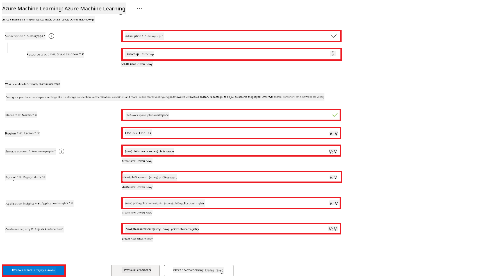

5. Wybierz **Przejrzyj + utwórz**.

6. Wybierz **Utwórz**.

### Złóż wniosek o limity GPU w abonamencie Azure

W tym tutorialu nauczysz się, jak dostroić i wdrożyć model Phi-3, korzystając z GPU. Do dostrajania wykorzystasz GPU *Standard_NC24ads_A100_v4*, który wymaga złożenia wniosku o limit. Do wdrożenia użyjesz GPU *Standard_NC6s_v3*, który również wymaga wniosku o limit.

> [!NOTE]
>
> Tylko subskrypcje Pay-As-You-Go (standardowy typ subskrypcji) są uprawnione do przydziału GPU; subskrypcje benefity nie są obecnie obsługiwane.
>

1. Odwiedź [Azure ML Studio](https://ml.azure.com/home?wt.mc_id=studentamb_279723).

1. Wykonaj następujące czynności, aby złożyć wniosek o limit *Standard NCADSA100v4 Family*:

    - Wybierz **Limit** z panelu bocznego po lewej.
    - Wybierz **Rodzinę maszyn wirtualnych** do użycia. Na przykład wybierz **Standard NCADSA100v4 Family Cluster Dedicated vCPUs**, która obejmuje GPU *Standard_NC24ads_A100_v4*.
    - Wybierz **Złóż wniosek o limit** z menu nawigacyjnego.

        

    - Na stronie składania wniosku o limit wpisz **Nowy limit rdzeni**, którego chcesz używać. Na przykład 24.
    - Na stronie składania wniosku o limit wybierz **Prześlij**, aby złożyć wniosek o limit GPU.

1. Wykonaj następujące czynności, aby złożyć wniosek o limit *Standard NCSv3 Family*:

    - Wybierz **Limit** z panelu bocznego po lewej.
    - Wybierz **Rodzinę maszyn wirtualnych** do użycia. Na przykład wybierz **Standard NCSv3 Family Cluster Dedicated vCPUs**, która obejmuje GPU *Standard_NC6s_v3*.
    - Wybierz **Złóż wniosek o limit** z menu nawigacyjnego.
    - Na stronie składania wniosku o limit wpisz **Nowy limit rdzeni**, którego chcesz używać. Na przykład 24.
    - Na stronie składania wniosku o limit wybierz **Prześlij**, aby złożyć wniosek o limit GPU.

### Dodaj przypisanie roli

Aby dostroić i wdrożyć swoje modele, musisz najpierw utworzyć przypisaną przez użytkownika tożsamość zarządzaną (User Assigned Managed Identity, UAI) i przypisać jej odpowiednie uprawnienia. Ta UAI będzie używana do uwierzytelniania podczas wdrożenia.

#### Utwórz przypisaną przez użytkownika tożsamość zarządzaną (UAI)

1. Wpisz *tożsamości zarządzane* w **pasku wyszukiwania** u góry strony portalu i wybierz **Tożsamości zarządzane** z dostępnych opcji.

    

1. Wybierz **+ Utwórz**.

    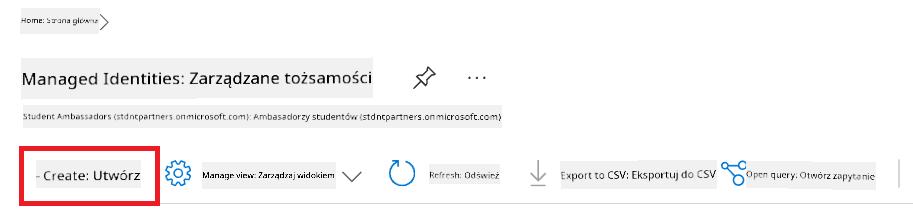

1. Wykonaj następujące czynności:

    - Wybierz swój **Abonament** Azure.
    - Wybierz **Grupę zasobów** do użycia (utwórz nową, jeśli to konieczne).
    - Wybierz **Region**, którego chcesz użyć.
    - Wpisz **Nazwę**. Musi to być unikalna wartość.

    

1. Wybierz **Przejrzyj + utwórz**.

1. Wybierz **+ Utwórz**.

#### Dodaj przypisanie roli Współtwórcy do tożsamości zarządzanej

1. Przejdź do zasobu Tożsamości zarządzanej, który utworzyłeś.

1. Wybierz **Przypisania ról Azure** z panelu bocznego po lewej.

1. Wybierz **+ Dodaj przypisanie roli** z menu nawigacyjnego.

1. Na stronie Dodaj przypisanie roli wykonaj następujące czynności:
    - Ustaw **Zakres** na **Grupa zasobów**.
    - Wybierz swój **Abonament** Azure.
    - Wybierz **Grupę zasobów** do użycia.
    - Wybierz **Rolę** na **Współtwórca**.

    

2. Wybierz **Zapisz**.

#### Dodaj przypisanie roli Storage Blob Data Reader do tożsamości zarządzanej

1. Wpisz *konta magazynu* w **pasku wyszukiwania** u góry strony portalu i wybierz **Konta magazynu** z dostępnych opcji.

    

1. Wybierz konto magazynu powiązane ze środowiskiem Azure Machine Learning, które utworzyłeś. Na przykład *finetunephistorage*.

1. Wykonaj następujące czynności, aby przejść do strony Dodaj przypisanie roli:

    - Przejdź do konta magazynu Azure, które utworzyłeś.
    - Wybierz **Kontrola dostępu (IAM)** z panelu bocznego po lewej.
    - Wybierz **+ Dodaj** z menu nawigacyjnego.
    - Wybierz **Dodaj przypisanie roli** z menu nawigacyjnego.

    

1. Na stronie Dodaj przypisanie roli wykonaj następujące czynności:

    - Na stronie wyboru roli wpisz *Storage Blob Data Reader* w **pasku wyszukiwania** i wybierz **Storage Blob Data Reader** z dostępnych opcji.
    - Na stronie roli wybierz **Dalej**.
    - Na stronie członków wybierz **Przyznaj dostęp do** **Tożsamości zarządzanej**.
    - Na stronie członków wybierz **+ Wybierz członków**.
    - Na stronie wyboru tożsamości zarządzanej wybierz swój **Abonament** Azure.
    - Na stronie wyboru tożsamości zarządzanej wybierz **Tożsamość zarządzaną**.
    - Na stronie wyboru tożsamości zarządzanej wybierz tożsamość, którą utworzyłeś. Na przykład *finetunephi-managedidentity*.
    - Na stronie wyboru tożsamości zarządzanej wybierz **Wybierz**.

    

1. Wybierz **Przejrzyj + przypisz**.

#### Dodaj przypisanie roli AcrPull do tożsamości zarządzanej

1. Wpisz *rejestry kontenerów* w **pasku wyszukiwania** u góry strony portalu i wybierz **Rejestry kontenerów** z dostępnych opcji.

    

1. Wybierz rejestr kontenera powiązany ze środowiskiem Azure Machine Learning. Na przykład *finetunephicontainerregistry*.

1. Wykonaj następujące czynności, aby przejść do strony Dodaj przypisanie roli:

    - Wybierz **Kontrola dostępu (IAM)** z panelu bocznego po lewej.
    - Wybierz **+ Dodaj** z menu nawigacyjnego.
    - Wybierz **Dodaj przypisanie roli** z menu nawigacyjnego.

1. Na stronie Dodaj przypisanie roli wykonaj następujące czynności:

    - Na stronie roli wpisz *AcrPull* w **pasku wyszukiwania** i wybierz **AcrPull** z dostępnych opcji.
    - Na stronie roli wybierz **Dalej**.
    - Na stronie członków wybierz **Przyznaj dostęp do** **Tożsamości zarządzanej**.
    - Na stronie członków wybierz **+ Wybierz członków**.
    - Na stronie wyboru tożsamości zarządzanej wybierz swój **Abonament** Azure.
    - Na stronie wyboru tożsamości zarządzanej wybierz **Tożsamość zarządzaną**.
    - Na stronie wyboru tożsamości zarządzanej wybierz tożsamość, którą utworzyłeś. Na przykład *finetunephi-managedidentity*.
    - Na stronie wyboru tożsamości zarządzanej wybierz **Wybierz**.
    - Wybierz **Przejrzyj + przypisz**.

### Skonfiguruj projekt

Aby pobrać zestawy danych potrzebne do dostrajania, skonfigurujesz środowisko lokalne.

W tym ćwiczeniu:

- Utworzysz folder do pracy.
- Utworzysz środowisko wirtualne.
- Zainstalujesz wymagane pakiety.
- Utworzysz plik *download_dataset.py* do pobrania zestawu danych.

#### Utwórz folder do pracy

1. Otwórz okno terminala i wpisz poniższe polecenie, aby utworzyć folder o nazwie *finetune-phi* w domyślnej ścieżce.

    ```console
    mkdir finetune-phi
    ```

2. Wpisz następujące polecenie w terminalu, aby przejść do folderu *finetune-phi*, który utworzyłeś.

    ```console
    cd finetune-phi
    ```

#### Utwórz środowisko wirtualne

1. Wpisz następujące polecenie w terminalu, aby utworzyć środowisko wirtualne o nazwie *.venv*.

    ```console
    python -m venv .venv
    ```

2. Wpisz następujące polecenie w terminalu, aby aktywować środowisko wirtualne.

    ```console
    .venv\Scripts\activate.bat
    ```

> [!NOTE]
> Jeśli się powiodło, powinieneś zobaczyć *(.venv)* przed wierszem polecenia.

#### Zainstaluj wymagane pakiety

1. Wpisz następujące polecenia w terminalu, aby zainstalować wymagane pakiety.

    ```console
    pip install datasets==2.19.1
    ```

#### Utwórz `donload_dataset.py`

> [!NOTE]
> Kompletna struktura folderów:
>
> ```text
> └── YourUserName
> .    └── finetune-phi
> .        └── download_dataset.py
> ```

1. Otwórz **Visual Studio Code**.

1. Wybierz **Plik** z paska menu.

1. Wybierz **Otwórz folder**.

1. Wybierz folder *finetune-phi*, który utworzyłeś, znajdujący się pod adresem *C:\Users\twojaNazwaUżytkownika\finetune-phi*.

    

1. W lewym panelu Visual Studio Code kliknij prawym przyciskiem myszy i wybierz **Nowy plik**, aby utworzyć nowy plik o nazwie *download_dataset.py*.

    

### Przygotuj zestaw danych do fine-tuningu

W tym ćwiczeniu uruchomisz plik *download_dataset.py*, aby pobrać zestawy danych *ultrachat_200k* do lokalnego środowiska. Następnie wykorzystasz te zestawy danych do fine-tuningu modelu Phi-3 w Azure Machine Learning.

W tym ćwiczeniu:

- Dodasz kod do pliku *download_dataset.py*, aby pobrać zestawy danych.
- Uruchomisz plik *download_dataset.py*, aby pobrać zestawy danych do lokalnego środowiska.

#### Pobierz swój zestaw danych za pomocą *download_dataset.py*

1. Otwórz plik *download_dataset.py* w Visual Studio Code.

1. Dodaj następujący kod do pliku *download_dataset.py*.

    ```python
    import json
    import os
    from datasets import load_dataset

    def load_and_split_dataset(dataset_name, config_name, split_ratio):
        """
        Load and split a dataset.
        """
        # Załaduj zestaw danych o określonej nazwie, konfiguracji i proporcji podziału
        dataset = load_dataset(dataset_name, config_name, split=split_ratio)
        print(f"Original dataset size: {len(dataset)}")
        
        # Podziel zestaw danych na zestawy treningowe i testowe (80% trening, 20% test)
        split_dataset = dataset.train_test_split(test_size=0.2)
        print(f"Train dataset size: {len(split_dataset['train'])}")
        print(f"Test dataset size: {len(split_dataset['test'])}")
        
        return split_dataset

    def save_dataset_to_jsonl(dataset, filepath):
        """
        Save a dataset to a JSONL file.
        """
        # Utwórz katalog, jeśli nie istnieje
        os.makedirs(os.path.dirname(filepath), exist_ok=True)
        
        # Otwórz plik w trybie zapisu
        with open(filepath, 'w', encoding='utf-8') as f:
            # Iteruj po każdym rekordzie w zestawie danych
            for record in dataset:
                # Zrzutuj rekord jako obiekt JSON i zapisz go do pliku
                json.dump(record, f)
                # Zapisz znak nowej linii, aby oddzielić rekordy
                f.write('\n')
        
        print(f"Dataset saved to {filepath}")

    def main():
        """
        Main function to load, split, and save the dataset.
        """
        # Załaduj i podziel zestaw danych ULTRACHAT_200k z określoną konfiguracją i proporcją podziału
        dataset = load_and_split_dataset("HuggingFaceH4/ultrachat_200k", 'default', 'train_sft[:1%]')
        
        # Wyodrębnij zestawy treningowe i testowe z podziału
        train_dataset = dataset['train']
        test_dataset = dataset['test']

        # Zapisz zestaw treningowy do pliku JSONL
        save_dataset_to_jsonl(train_dataset, "data/train_data.jsonl")
        
        # Zapisz zestaw testowy do osobnego pliku JSONL
        save_dataset_to_jsonl(test_dataset, "data/test_data.jsonl")

    if __name__ == "__main__":
        main()

    ```

1. Wpisz następujące polecenie w terminalu, aby uruchomić skrypt i pobrać zestaw danych do lokalnego środowiska.

    ```console
    python download_dataset.py
    ```

1. Sprawdź, czy zestawy danych zostały pomyślnie zapisane w lokalnym katalogu *finetune-phi/data*.

> [!NOTE]
>
> #### Uwagi dotyczące rozmiaru zestawu danych i czasu fine-tuningu
>
> W tym samouczku używasz tylko 1% zestawu danych (`split='train[:1%]'`). Znacznie zmniejsza to ilość danych, przyspieszając zarówno przesyłanie, jak i proces fine-tuningu. Możesz dostosować procent, aby znaleźć odpowiedni balans między czasem treningu a wydajnością modelu. Użycie mniejszej części zestawu danych skraca czas potrzebny na fine-tuning, co czyni proces bardziej przystępnym na potrzeby samouczka.

## Scenariusz 2: Fine-tuning modelu Phi-3 i wdrożenie w Azure Machine Learning Studio

### Fine-tuning modelu Phi-3

W tym ćwiczeniu dokonasz fine-tuningu modelu Phi-3 w Azure Machine Learning Studio.

W tym ćwiczeniu:

- Utworzysz klaster obliczeniowy do fine-tuningu.
- Przeprowadzisz fine-tuning modelu Phi-3 w Azure Machine Learning Studio.

#### Utwórz klaster obliczeniowy do fine-tuningu

1. Odwiedź [Azure ML Studio](https://ml.azure.com/home?wt.mc_id=studentamb_279723).

1. Wybierz **Compute** z lewego panelu.

1. Wybierz **Compute clusters** z menu nawigacyjnego.

1. Wybierz **+ Nowy**.

    

1. Wykonaj następujące czynności:

    - Wybierz **Region**, którego chcesz użyć.
    - Wybierz **Virtual machine tier** na **Dedicated**.
    - Wybierz **Virtual machine type** na **GPU**.
    - Użyj filtra **Virtual machine size** i wybierz **Select from all options**.
    - Wybierz **Virtual machine size** na **Standard_NC24ads_A100_v4**.

    

1. Wybierz **Dalej**.

1. Wykonaj następujące czynności:

    - Wpisz **Nazwa obliczeń**. Musi być unikalna.
    - Ustaw **Minimalna liczba węzłów** na **0**.
    - Ustaw **Maksymalna liczba węzłów** na **1**.
    - Ustaw **Czas bezczynności przed skalowaniem w dół** na **120**.

    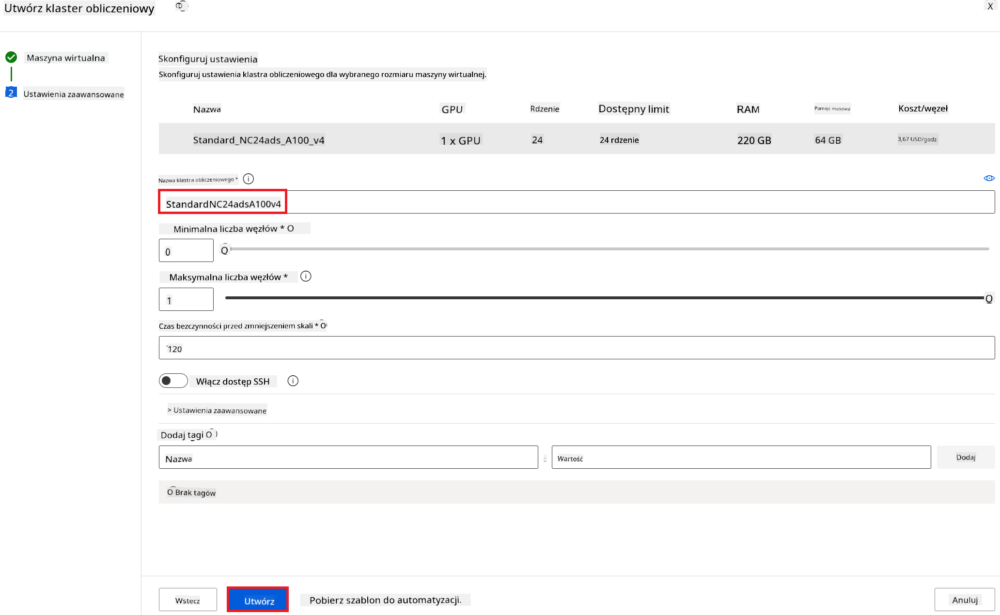

1. Wybierz **Utwórz**.

#### Fine-tuning modelu Phi-3

1. Odwiedź [Azure ML Studio](https://ml.azure.com/home?wt.mc_id=studentamb_279723).

1. Wybierz utworzoną przestrzeń roboczą Azure Machine Learning.

    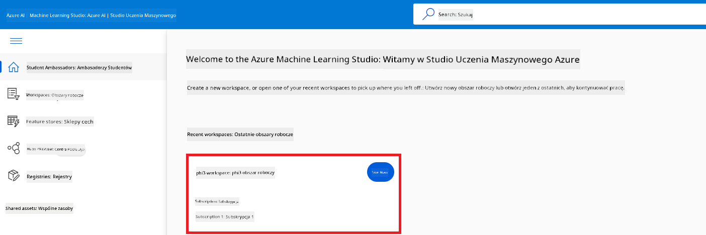

1. Wykonaj następujące czynności:

    - Wybierz **Katalog modeli** z lewego panelu.
    - Wpisz *phi-3-mini-4k* w **pasku wyszukiwania** i wybierz **Phi-3-mini-4k-instruct** z dostępnych opcji.

    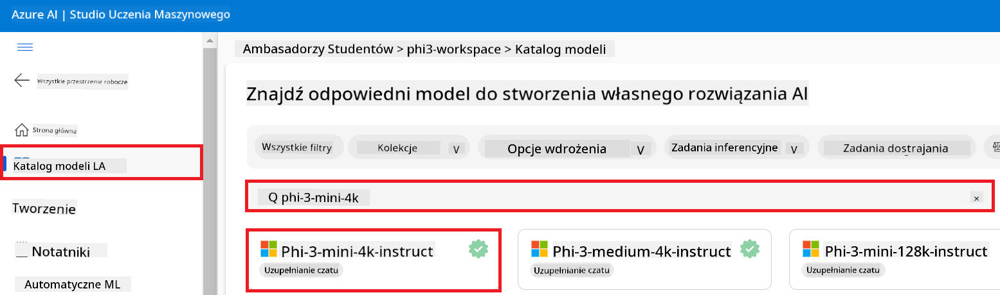

1. Wybierz **Fine-tune** z menu nawigacyjnego.

    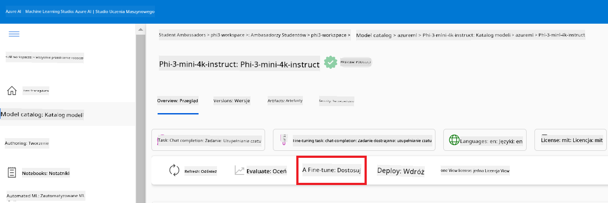

1. Wykonaj następujące czynności:

    - Wybierz **Select task type** na **Chat completion**.
    - Wybierz **+ Select data**, aby przesłać **dane treningowe**.
    - Wybierz sposób przesyłania danych walidacyjnych na **Provide different validation data**.
    - Wybierz **+ Select data**, aby przesłać **dane walidacyjne**.

    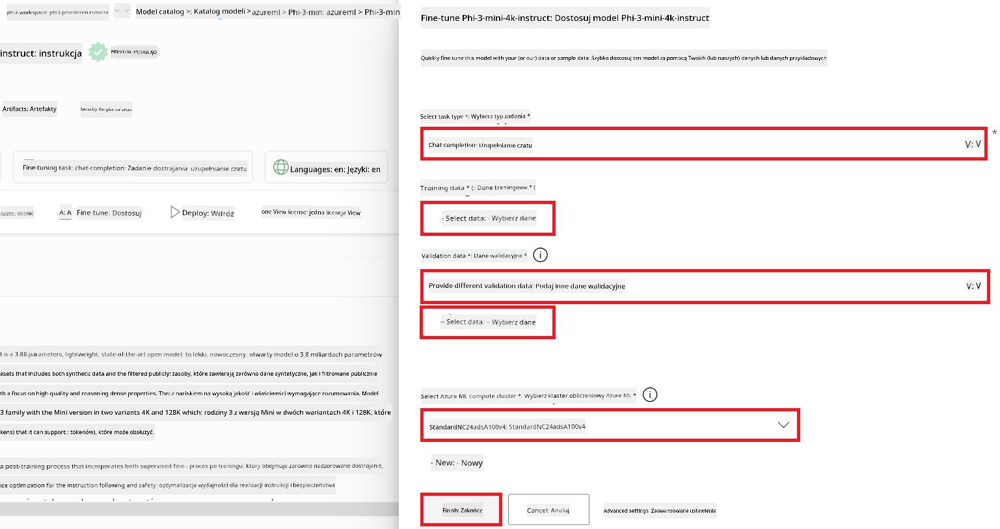

> [!TIP]
>
> Możesz wybrać **Ustawienia zaawansowane**, aby dostosować konfiguracje takie jak **learning_rate** i **lr_scheduler_type**, aby zoptymalizować proces fine-tuningu zgodnie z Twoimi potrzebami.

1. Wybierz **Zakończ**.

1. W tym ćwiczeniu pomyślnie przeprowadziłeś fine-tuning modelu Phi-3 za pomocą Azure Machine Learning. Należy pamiętać, że proces fine-tuningu może zająć znaczną ilość czasu. Po uruchomieniu zadania fine-tuningu musisz poczekać na jego zakończenie. Możesz monitorować status zadania fine-tuningu, przechodząc do zakładki Zadania po lewej stronie w swoim środowisku Azure Machine Learning. W kolejnych seriach wdrożysz wytrenowany model i zintegrujesz go z Prompt flow.

    

### Wdróż wytrenowany model Phi-3

Aby zintegrować wytrenowany model Phi-3 z Prompt flow, musisz wdrożyć model, aby był dostępny do inferencji w czasie rzeczywistym. Proces ten obejmuje rejestrację modelu, utworzenie punktu końcowego online oraz wdrożenie modelu.

W tym ćwiczeniu:

- Zarejestrujesz wytrenowany model w środowisku Azure Machine Learning.
- Utworzysz punkt końcowy online.
- Wdrożysz zarejestrowany wytrenowany model Phi-3.

#### Zarejestruj wytrenowany model

1. Odwiedź [Azure ML Studio](https://ml.azure.com/home?wt.mc_id=studentamb_279723).

1. Wybierz utworzoną przestrzeń roboczą Azure Machine Learning.

    

1. Wybierz **Modele** z lewego panelu.
1. Wybierz **+ Zarejestruj**.
1. Wybierz **Z wyjścia zadania**.

    

1. Wybierz utworzone zadanie.

    

1. Wybierz **Dalej**.

1. Wybierz **Typ modelu** na **MLflow**.

1. Upewnij się, że **Wyjście zadania** jest wybrane; powinno być zaznaczone automatycznie.

    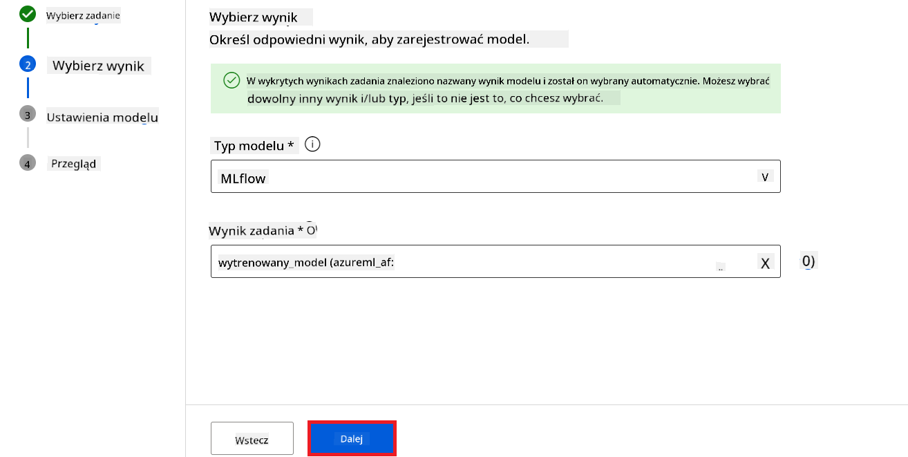

2. Wybierz **Dalej**.

3. Wybierz **Zarejestruj**.

    

4. Możesz zobaczyć zarejestrowany model, przechodząc do menu **Modele** z lewego panelu.

    

#### Wdróż wytrenowany model

1. Przejdź do utworzonej przestrzeni roboczej Azure Machine Learning.

1. Wybierz **Punkty końcowe** z lewego panelu.

1. Wybierz **Punkty końcowe w czasie rzeczywistym** z menu nawigacyjnego.

    

1. Wybierz **Utwórz**.

1. Wybierz zarejestrowany model, który utworzyłeś.

    

1. Wybierz **Wybierz**.

1. Wykonaj następujące czynności:

    - Wybierz **Maszynę wirtualną** na *Standard_NC6s_v3*.
    - Wybierz liczbę instancji, której chcesz użyć. Na przykład *1*.
    - Wybierz **Punkt końcowy** na **Nowy**, aby utworzyć punkt końcowy.
    - Wprowadź **Nazwę punktu końcowego**. Musi być unikalna.
    - Wprowadź **Nazwę wdrożenia**. Musi być unikalna.

    

1. Wybierz **Wdróż**.

> [!WARNING]
> Aby uniknąć dodatkowych opłat na swoim koncie, upewnij się, że usunąłeś utworzony punkt końcowy w przestrzeni roboczej Azure Machine Learning.
>

#### Sprawdź status wdrożenia w przestrzeni roboczej Azure Machine Learning

1. Przejdź do utworzonej przestrzeni roboczej Azure Machine Learning.

1. Wybierz **Punkty końcowe** z lewego panelu.

1. Wybierz utworzony punkt końcowy.

    

1. Na tej stronie możesz zarządzać punktami końcowymi podczas procesu wdrażania.

> [!NOTE]
> Po zakończeniu wdrożenia upewnij się, że **Ruch na żywo** jest ustawiony na **100%**. Jeśli nie, wybierz **Aktualizuj ruch**, aby dostosować ustawienia ruchu. Pamiętaj, że nie można testować modelu, jeśli ruch jest ustawiony na 0%.
>
> 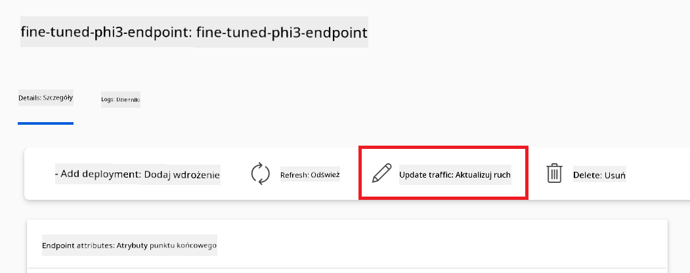
>

## Scenariusz 3: Integracja z Prompt flow i czat z własnym modelem w Azure AI Foundry

### Integracja niestandardowego modelu Phi-3 z Prompt flow

Po pomyślnym wdrożeniu wytrenowanego modelu możesz teraz zintegrować go z Prompt Flow, aby używać modelu w aplikacjach czasu rzeczywistego, co pozwala na wiele interaktywnych zadań z Twoim niestandardowym modelem Phi-3.

W tym ćwiczeniu:

- Utworzysz Centrum Azure AI Foundry.
- Utworzysz projekt w Azure AI Foundry.
- Utworzysz Prompt flow.
- Dodasz niestandardowe połączenie dla wytrenowanego modelu Phi-3.
- Skonfigurujesz Prompt flow do czatu z Twoim niestandardowym modelem Phi-3.

> [!NOTE]
> Możesz również integrować się z Promptflow za pomocą Azure ML Studio. Ten sam proces integracji można zastosować w Azure ML Studio.

#### Utwórz Centrum Azure AI Foundry

Musisz utworzyć Centrum przed utworzeniem Projektu. Centrum działa jak grupa zasobów, pozwalając na organizację i zarządzanie wieloma Projektami w Azure AI Foundry.

1. Odwiedź [Azure AI Foundry](https://ai.azure.com/?WT.mc_id=aiml-137032-kinfeylo).

1. Wybierz **Wszystkie centra** z lewego panelu.

1. Wybierz **+ Nowe centrum** z menu nawigacyjnego.
    

1. Wykonaj następujące zadania:

    - Wprowadź **Nazwa hubu**. Musi to być unikalna wartość.
    - Wybierz swoją subskrypcję Azure (**Subscription**).
    - Wybierz używaną **grupę zasobów** (utwórz nową, jeśli to konieczne).
    - Wybierz **lokalizację** (Location), której chcesz użyć.
    - Wybierz **Połącz usługi Azure AI** do wykorzystania (utwórz nową, jeśli to konieczne).
    - Wybierz **Połącz Azure AI Search** i **Pomiń łączenie**.

    

1. Wybierz **Dalej**.

#### Utwórz projekt Azure AI Foundry

1. W hubie, który utworzyłeś, wybierz **Wszystkie projekty** z zakładki po lewej stronie.

1. Wybierz **+ Nowy projekt** z menu nawigacyjnego.

    

1. Wprowadź **Nazwa projektu**. Musi to być unikalna wartość.

    

1. Wybierz **Utwórz projekt**.

#### Dodaj niestandardowe połączenie dla wytrenowanego modelu Phi-3

Aby zintegrować swój niestandardowy model Phi-3 z Prompt flow, musisz zapisać punkt końcowy modelu i klucz w niestandardowym połączeniu. Ta konfiguracja zapewnia dostęp do niestandardowego modelu Phi-3 w Prompt flow.

#### Ustaw klucz api i URI punktu końcowego wytrenowanego modelu Phi-3

1. Odwiedź [Azure ML Studio](https://ml.azure.com/home?WT.mc_id=aiml-137032-kinfeylo).

1. Przejdź do utworzonego przez siebie Azure Machine Learning workspace.

1. Wybierz **Punkty końcowe** (Endpoints) z zakładki po lewej stronie.

    

1. Wybierz utworzony punkt końcowy.

    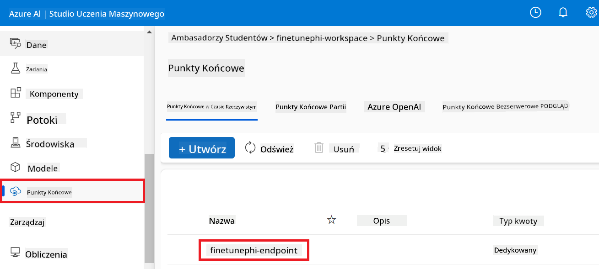

1. Wybierz **Korzystaj** (Consume) z menu nawigacyjnego.

1. Skopiuj swój **REST endpoint** oraz **klucz podstawowy** (Primary key).

    

#### Dodaj niestandardowe połączenie

1. Odwiedź [Azure AI Foundry](https://ai.azure.com/?WT.mc_id=aiml-137032-kinfeylo).

1. Przejdź do utworzonego projektu Azure AI Foundry.

1. W projekcie, który utworzyłeś, wybierz **Ustawienia** z zakładki po lewej stronie.

1. Wybierz **+ Nowe połączenie**.

    

1. Wybierz **Klucze niestandardowe** z menu nawigacyjnego.

    

1. Wykonaj następujące kroki:

    - Wybierz **+ Dodaj parę klucz-wartość**.
    - W polu nazwy klucza wpisz **endpoint** i wklej punkt końcowy, który skopiowałeś z Azure ML Studio, w pole wartości.
    - Ponownie wybierz **+ Dodaj parę klucz-wartość**.
    - W polu nazwy klucza wpisz **key** i wklej klucz skopiowany z Azure ML Studio w pole wartości.
    - Po dodaniu kluczy zaznacz **jest tajne** (is secret), aby zapobiec ujawnieniu klucza.

    

1. Wybierz **Dodaj połączenie**.

#### Utwórz Prompt flow

Dodałeś niestandardowe połączenie w Azure AI Foundry. Teraz utwórz Prompt flow, wykonując następujące kroki. Następnie połącz ten Prompt flow z niestandardowym połączeniem, aby móc korzystać z wytrenowanego modelu w Prompt flow.

1. Przejdź do utworzonego projektu Azure AI Foundry.

1. Wybierz **Prompt flow** z zakładki po lewej stronie.

1. Wybierz **+ Utwórz** z menu nawigacyjnego.

    

1. Wybierz **Chat flow** z menu nawigacyjnego.

    

1. Wprowadź nazwę folderu (**Folder name**) do użycia.

    

2. Wybierz **Utwórz**.

#### Skonfiguruj Prompt flow do rozmowy z niestandardowym modelem Phi-3

Musisz zintegrować wytrenowany model Phi-3 w Prompt flow. Jednak istniejący Prompt flow nie jest do tego przeznaczony. Dlatego musisz przeprojektować Prompt flow, aby umożliwić integrację niestandardowego modelu.

1. W Prompt flow wykonaj następujące czynności, aby przebudować istniejący flow:

    - Wybierz **Tryb pliku surowego** (Raw file mode).
    - Usuń cały istniejący kod z pliku *flow.dag.yml*.
    - Dodaj następujący kod do pliku *flow.dag.yml*.

        ```yml
        inputs:
          input_data:
            type: string
            default: "Who founded Microsoft?"

        outputs:
          answer:
            type: string
            reference: ${integrate_with_promptflow.output}

        nodes:
        - name: integrate_with_promptflow
          type: python
          source:
            type: code
            path: integrate_with_promptflow.py
          inputs:
            input_data: ${inputs.input_data}
        ```

    - Wybierz **Zapisz**.

    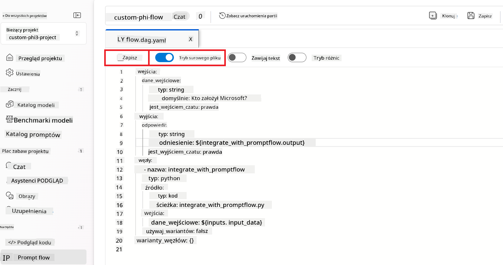

1. Dodaj następujący kod do pliku *integrate_with_promptflow.py*, aby używać niestandardowego modelu Phi-3 w Prompt flow.

    ```python
    import logging
    import requests
    from promptflow import tool
    from promptflow.connections import CustomConnection

    # Konfiguracja logowania
    logging.basicConfig(
        format="%(asctime)s - %(levelname)s - %(name)s - %(message)s",
        datefmt="%Y-%m-%d %H:%M:%S",
        level=logging.DEBUG
    )
    logger = logging.getLogger(__name__)

    def query_phi3_model(input_data: str, connection: CustomConnection) -> str:
        """
        Send a request to the Phi-3 model endpoint with the given input data using Custom Connection.
        """

        # "connection" to nazwa Niestandardowego Połączenia, "endpoint", "key" to klucze w Niestandardowym Połączeniu
        endpoint_url = connection.endpoint
        api_key = connection.key

        headers = {
            "Content-Type": "application/json",
            "Authorization": f"Bearer {api_key}"
        }
        data = {
            "input_data": {
                "input_string": [
                    {"role": "user", "content": input_data}
                ],
                "parameters": {
                    "temperature": 0.7,
                    "max_new_tokens": 128
                }
            }
        }
        try:
            response = requests.post(endpoint_url, json=data, headers=headers)
            response.raise_for_status()
            
            # Zaloguj pełną odpowiedź JSON
            logger.debug(f"Full JSON response: {response.json()}")

            result = response.json()["output"]
            logger.info("Successfully received response from Azure ML Endpoint.")
            return result
        except requests.exceptions.RequestException as e:
            logger.error(f"Error querying Azure ML Endpoint: {e}")
            raise

    @tool
    def my_python_tool(input_data: str, connection: CustomConnection) -> str:
        """
        Tool function to process input data and query the Phi-3 model.
        """
        return query_phi3_model(input_data, connection)

    ```

    

> [!NOTE]
> Aby uzyskać bardziej szczegółowe informacje o używaniu Prompt flow w Azure AI Foundry, możesz odwołać się do [Prompt flow w Azure AI Foundry](https://learn.microsoft.com/azure/ai-studio/how-to/prompt-flow).

1. Włącz **Wejście czatu** (Chat input), **Wyjście czatu** (Chat output), aby umożliwić rozmowę z Twoim modelem.

    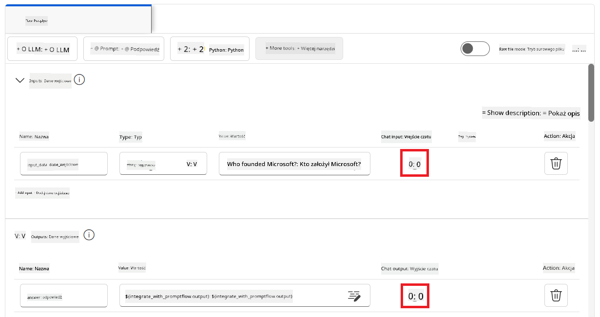

1. Teraz jesteś gotowy do rozmowy z niestandardowym modelem Phi-3. W kolejnym ćwiczeniu nauczysz się, jak uruchomić Prompt flow i używać go do rozmowy z wytrenowanym modelem Phi-3.

> [!NOTE]
>
> Przebudowany flow powinien wyglądać jak na poniższym obrazku:
>
> 
>

### Rozmawiaj ze swoim niestandardowym modelem Phi-3

Teraz, gdy wytrenowałeś i zintegrowałeś swój niestandardowy model Phi-3 z Prompt flow, możesz rozpocząć interakcję z nim. To ćwiczenie przeprowadzi Cię przez proces konfiguracji i uruchomienia rozmowy z modelem za pomocą Prompt flow. Postępując zgodnie z tymi krokami, będziesz mógł w pełni wykorzystać możliwości swojego wytrenowanego modelu Phi-3 do różnych zadań i konwersacji.

- Rozmawiaj ze swoim niestandardowym modelem Phi-3 za pomocą Prompt flow.

#### Uruchom Prompt flow

1. Wybierz **Uruchom sesje obliczeniowe** (Start compute sessions), aby uruchomić Prompt flow.

    

1. Wybierz **Zweryfikuj i przeanalizuj dane wejściowe** (Validate and parse input), aby odświeżyć parametry.

    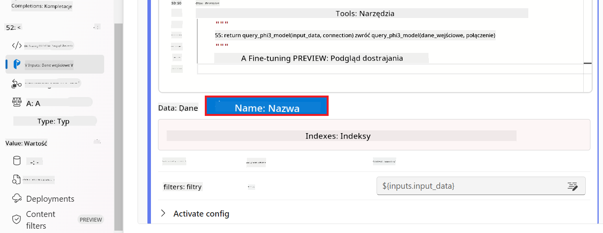

1. Wybierz **Wartość** (Value) dla **połączenia** (connection) w celu użycia niestandardowego połączenia, które utworzyłeś. Na przykład *connection*.

    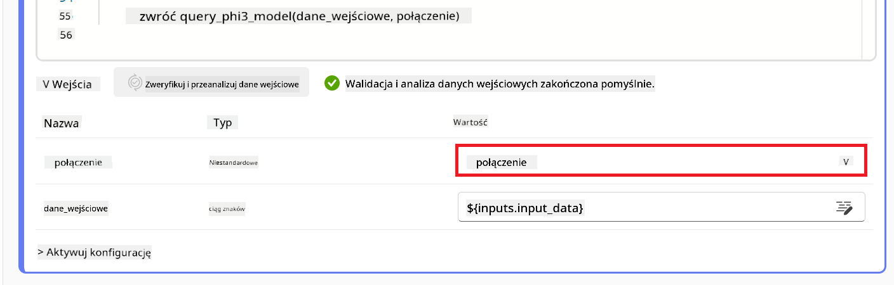

#### Rozmawiaj ze swoim niestandardowym modelem

1. Wybierz **Rozmowa** (Chat).

    

1. Oto przykład wyników: Teraz możesz rozmawiać ze swoim niestandardowym modelem Phi-3. Zaleca się zadawanie pytań na podstawie danych użytych do trenowania.

    

---

<!-- CO-OP TRANSLATOR DISCLAIMER START -->
**Zastrzeżenie**:
Niniejszy dokument został przetłumaczony za pomocą usługi tłumaczenia AI [Co-op Translator](https://github.com/Azure/co-op-translator). Chociaż dokładamy wszelkich starań, aby tłumaczenie było poprawne, prosimy pamiętać, że tłumaczenia automatyczne mogą zawierać błędy lub nieścisłości. Oryginalny dokument w języku źródłowym powinien być uważany za źródło wiążące. W przypadku informacji o kluczowym znaczeniu zaleca się skorzystanie z profesjonalnego tłumaczenia wykonanego przez człowieka. Nie ponosimy odpowiedzialności za jakiekolwiek nieporozumienia lub błędne interpretacje wynikające z użycia tego tłumaczenia.
<!-- CO-OP TRANSLATOR DISCLAIMER END -->