<!--
CO_OP_TRANSLATOR_METADATA:
{
  "original_hash": "ecbd9179a21edbaafaf114d47f09f3e3",
  "translation_date": "2025-07-17T01:26:13+00:00",
  "source_file": "md/02.Application/01.TextAndChat/Phi3/E2E_Phi-3-FineTuning_PromptFlow_Integration_AIFoundry.md",
  "language_code": "pl"
}
-->
# Dostosuj i zintegrować niestandardowe modele Phi-3 z Prompt flow w Azure AI Foundry

Ten kompleksowy (E2E) przykład opiera się na przewodniku "[Fine-Tune and Integrate Custom Phi-3 Models with Prompt Flow in Azure AI Foundry](https://techcommunity.microsoft.com/t5/educator-developer-blog/fine-tune-and-integrate-custom-phi-3-models-with-prompt-flow-in/ba-p/4191726?WT.mc_id=aiml-137032-kinfeylo)" z Microsoft Tech Community. Przedstawia procesy dostrajania, wdrażania i integracji niestandardowych modeli Phi-3 z Prompt flow w Azure AI Foundry. W przeciwieństwie do przykładu E2E, "[Fine-Tune and Integrate Custom Phi-3 Models with Prompt Flow](./E2E_Phi-3-FineTuning_PromptFlow_Integration.md)", który wymagał uruchamiania kodu lokalnie, ten samouczek skupia się całkowicie na dostrajaniu i integracji modelu w Azure AI / ML Studio.

## Przegląd

W tym przykładzie E2E nauczysz się, jak dostroić model Phi-3 i zintegrować go z Prompt flow w Azure AI Foundry. Wykorzystując Azure AI / ML Studio, stworzysz przepływ pracy do wdrażania i korzystania z niestandardowych modeli AI. Ten przykład E2E podzielony jest na trzy scenariusze:

**Scenariusz 1: Konfiguracja zasobów Azure i przygotowanie do dostrajania**

**Scenariusz 2: Dostrajanie modelu Phi-3 i wdrażanie w Azure Machine Learning Studio**

**Scenariusz 3: Integracja z Prompt flow i rozmowa z niestandardowym modelem w Azure AI Foundry**

Oto przegląd tego przykładu E2E.

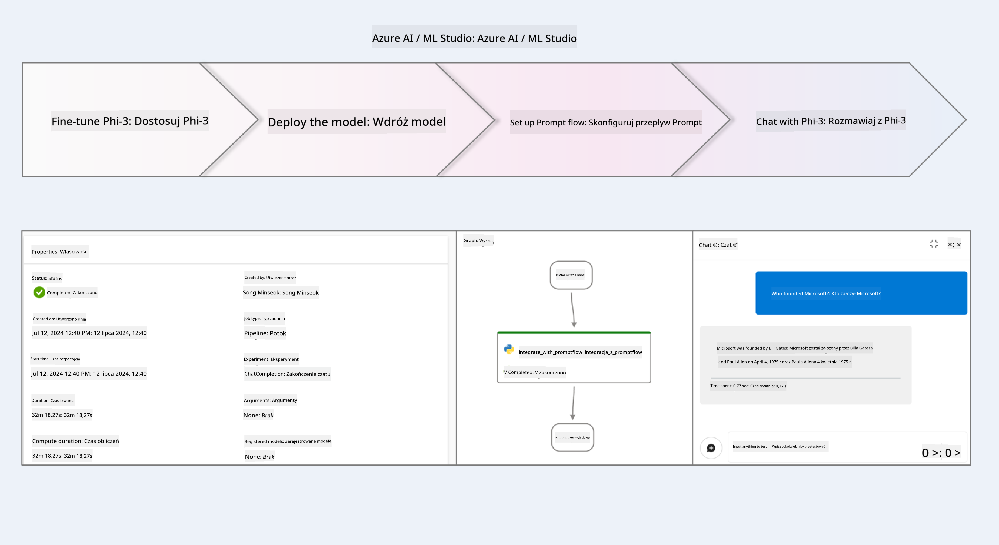

### Spis treści

1. **[Scenariusz 1: Konfiguracja zasobów Azure i przygotowanie do dostrajania](../../../../../../md/02.Application/01.TextAndChat/Phi3)**
    - [Utwórz Azure Machine Learning Workspace](../../../../../../md/02.Application/01.TextAndChat/Phi3)
    - [Złóż wniosek o limity GPU w subskrypcji Azure](../../../../../../md/02.Application/01.TextAndChat/Phi3)
    - [Dodaj przypisanie roli](../../../../../../md/02.Application/01.TextAndChat/Phi3)
    - [Skonfiguruj projekt](../../../../../../md/02.Application/01.TextAndChat/Phi3)
    - [Przygotuj zestaw danych do dostrajania](../../../../../../md/02.Application/01.TextAndChat/Phi3)

1. **[Scenariusz 2: Dostrajanie modelu Phi-3 i wdrażanie w Azure Machine Learning Studio](../../../../../../md/02.Application/01.TextAndChat/Phi3)**
    - [Dostrój model Phi-3](../../../../../../md/02.Application/01.TextAndChat/Phi3)
    - [Wdróż dostrojony model Phi-3](../../../../../../md/02.Application/01.TextAndChat/Phi3)

1. **[Scenariusz 3: Integracja z Prompt flow i rozmowa z niestandardowym modelem w Azure AI Foundry](../../../../../../md/02.Application/01.TextAndChat/Phi3)**
    - [Zintegruj niestandardowy model Phi-3 z Prompt flow](../../../../../../md/02.Application/01.TextAndChat/Phi3)
    - [Rozmawiaj z niestandardowym modelem Phi-3](../../../../../../md/02.Application/01.TextAndChat/Phi3)

## Scenariusz 1: Konfiguracja zasobów Azure i przygotowanie do dostrajania

### Utwórz Azure Machine Learning Workspace

1. Wpisz *azure machine learning* w **pasku wyszukiwania** u góry strony portalu i wybierz **Azure Machine Learning** z dostępnych opcji.

    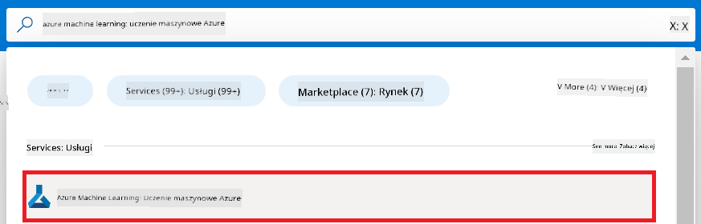

2. Wybierz **+ Create** z menu nawigacyjnego.

3. Wybierz **New workspace** z menu nawigacyjnego.

    

4. Wykonaj następujące czynności:

    - Wybierz swoją subskrypcję Azure (**Subscription**).
    - Wybierz grupę zasobów (**Resource group**) do użycia (utwórz nową, jeśli to konieczne).
    - Wprowadź nazwę workspace (**Workspace Name**). Musi być unikalna.
    - Wybierz region (**Region**), którego chcesz użyć.
    - Wybierz konto magazynu (**Storage account**) do użycia (utwórz nowe, jeśli to konieczne).
    - Wybierz Key Vault do użycia (utwórz nowy, jeśli to konieczne).
    - Wybierz Application Insights do użycia (utwórz nowe, jeśli to konieczne).
    - Wybierz rejestr kontenerów (**Container registry**) do użycia (utwórz nowy, jeśli to konieczne).

    

5. Wybierz **Review + Create**.

6. Wybierz **Create**.

### Złóż wniosek o limity GPU w subskrypcji Azure

W tym samouczku nauczysz się, jak dostroić i wdrożyć model Phi-3, korzystając z GPU. Do dostrajania użyjesz GPU *Standard_NC24ads_A100_v4*, który wymaga złożenia wniosku o limit. Do wdrożenia użyjesz GPU *Standard_NC6s_v3*, który również wymaga wniosku o limit.

> [!NOTE]
>
> Tylko subskrypcje Pay-As-You-Go (standardowy typ subskrypcji) kwalifikują się do przydziału GPU; subskrypcje benefitowe nie są obecnie obsługiwane.
>

1. Odwiedź [Azure ML Studio](https://ml.azure.com/home?wt.mc_id=studentamb_279723).

1. Wykonaj następujące czynności, aby złożyć wniosek o limit dla rodziny *Standard NCADSA100v4*:

    - Wybierz **Quota** z lewego panelu.
    - Wybierz rodzinę maszyn wirtualnych (**Virtual machine family**), np. **Standard NCADSA100v4 Family Cluster Dedicated vCPUs**, która obejmuje GPU *Standard_NC24ads_A100_v4*.
    - Wybierz **Request quota** z menu nawigacyjnego.

        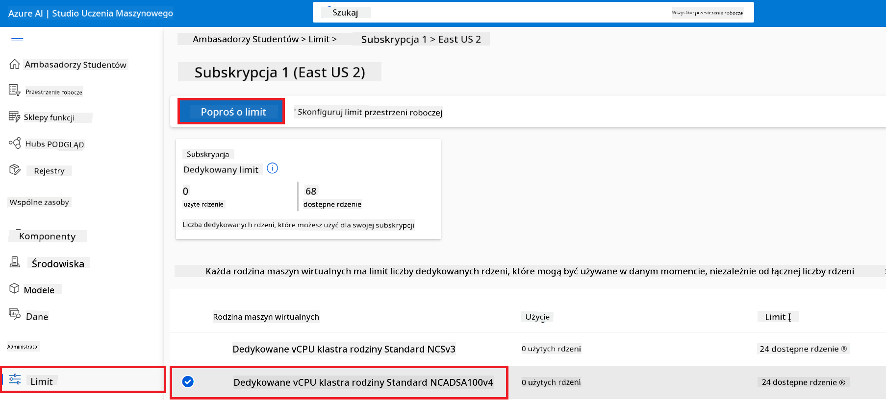

    - Na stronie Request quota wpisz nowy limit rdzeni (**New cores limit**), który chcesz uzyskać, np. 24.
    - Na stronie Request quota wybierz **Submit**, aby złożyć wniosek o limit GPU.

1. Wykonaj następujące czynności, aby złożyć wniosek o limit dla rodziny *Standard NCSv3*:

    - Wybierz **Quota** z lewego panelu.
    - Wybierz rodzinę maszyn wirtualnych, np. **Standard NCSv3 Family Cluster Dedicated vCPUs**, która obejmuje GPU *Standard_NC6s_v3*.
    - Wybierz **Request quota** z menu nawigacyjnego.
    - Na stronie Request quota wpisz nowy limit rdzeni, np. 24.
    - Na stronie Request quota wybierz **Submit**, aby złożyć wniosek o limit GPU.

### Dodaj przypisanie roli

Aby dostroić i wdrożyć modele, musisz najpierw utworzyć User Assigned Managed Identity (UAI) i przypisać jej odpowiednie uprawnienia. Ta UAI będzie używana do uwierzytelniania podczas wdrażania.

#### Utwórz User Assigned Managed Identity (UAI)

1. Wpisz *managed identities* w **pasku wyszukiwania** u góry strony portalu i wybierz **Managed Identities** z dostępnych opcji.

    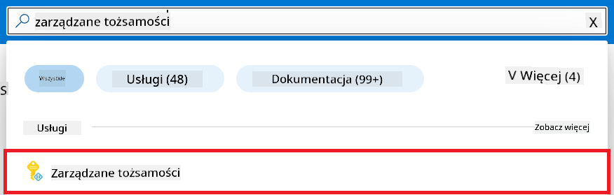

1. Wybierz **+ Create**.

    

1. Wykonaj następujące czynności:

    - Wybierz swoją subskrypcję Azure (**Subscription**).
    - Wybierz grupę zasobów (**Resource group**) do użycia (utwórz nową, jeśli to konieczne).
    - Wybierz region (**Region**), którego chcesz użyć.
    - Wprowadź nazwę (**Name**). Musi być unikalna.

    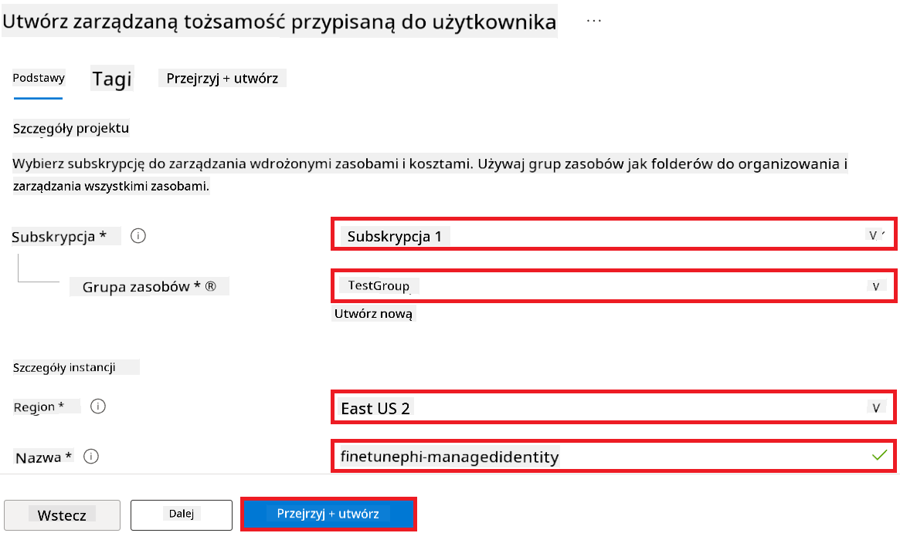

1. Wybierz **Review + create**.

1. Wybierz **+ Create**.

#### Dodaj przypisanie roli Contributor do Managed Identity

1. Przejdź do zasobu Managed Identity, który utworzyłeś.

1. Wybierz **Azure role assignments** z lewego panelu.

1. Wybierz **+Add role assignment** z menu nawigacyjnego.

1. Na stronie Add role assignment wykonaj następujące czynności:
    - Ustaw zakres (**Scope**) na **Resource group**.
    - Wybierz swoją subskrypcję Azure (**Subscription**).
    - Wybierz grupę zasobów (**Resource group**) do użycia.
    - Wybierz rolę (**Role**) **Contributor**.

    

2. Wybierz **Save**.

#### Dodaj przypisanie roli Storage Blob Data Reader do Managed Identity

1. Wpisz *storage accounts* w **pasku wyszukiwania** u góry strony portalu i wybierz **Storage accounts** z dostępnych opcji.

    

1. Wybierz konto magazynu powiązane z Azure Machine Learning workspace, które utworzyłeś. Na przykład *finetunephistorage*.

1. Wykonaj następujące czynności, aby przejść do strony Add role assignment:

    - Przejdź do konta magazynu Azure, które utworzyłeś.
    - Wybierz **Access Control (IAM)** z lewego panelu.
    - Wybierz **+ Add** z menu nawigacyjnego.
    - Wybierz **Add role assignment** z menu nawigacyjnego.

    

1. Na stronie Add role assignment wykonaj następujące czynności:

    - W polu roli wpisz *Storage Blob Data Reader* w **pasku wyszukiwania** i wybierz **Storage Blob Data Reader** z dostępnych opcji.
    - Wybierz **Next**.
    - Na stronie członków wybierz **Assign access to** **Managed identity**.
    - Wybierz **+ Select members**.
    - Na stronie wyboru Managed Identities wybierz swoją subskrypcję Azure (**Subscription**).
    - Wybierz Managed Identity o nazwie **Manage Identity**.
    - Wybierz utworzoną Managed Identity, np. *finetunephi-managedidentity*.
    - Wybierz **Select**.

    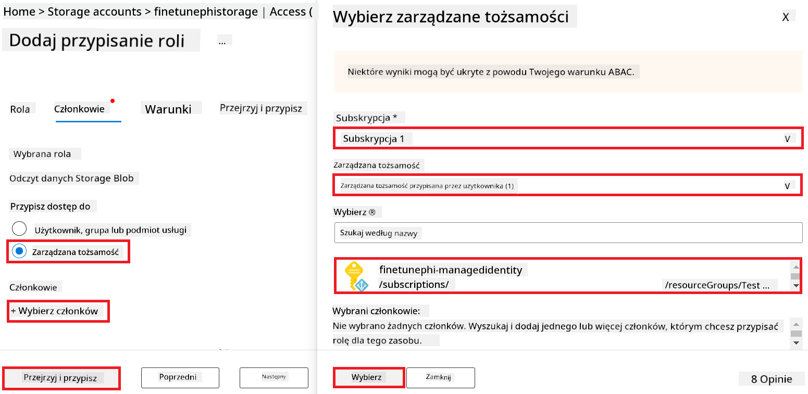

1. Wybierz **Review + assign**.

#### Dodaj przypisanie roli AcrPull do Managed Identity

1. Wpisz *container registries* w **pasku wyszukiwania** u góry strony portalu i wybierz **Container registries** z dostępnych opcji.

    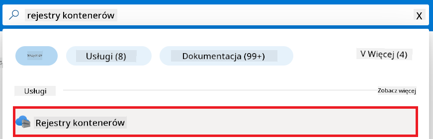

1. Wybierz rejestr kontenerów powiązany z Azure Machine Learning workspace, np. *finetunephicontainerregistry*.

1. Wykonaj następujące czynności, aby przejść do strony Add role assignment:

    - Wybierz **Access Control (IAM)** z lewego panelu.
    - Wybierz **+ Add** z menu nawigacyjnego.
    - Wybierz **Add role assignment** z menu nawigacyjnego.

1. Na stronie Add role assignment wykonaj następujące czynności:

    - W polu roli wpisz *AcrPull* w **pasku wyszukiwania** i wybierz **AcrPull** z dostępnych opcji.
    - Wybierz **Next**.
    - Na stronie członków wybierz **Assign access to** **Managed identity**.
    - Wybierz **+ Select members**.
    - Na stronie wyboru Managed Identities wybierz swoją subskrypcję Azure (**Subscription**).
    - Wybierz Managed Identity o nazwie **Manage Identity**.
    - Wybierz utworzoną Managed Identity, np. *finetunephi-managedidentity*.
    - Wybierz **Select**.
    - Wybierz **Review + assign**.

### Skonfiguruj projekt

Aby pobrać zestawy danych potrzebne do dostrajania, skonfigurujesz lokalne środowisko.

W tym ćwiczeniu:

- Utworzysz folder do pracy.
- Utworzysz środowisko wirtualne.
- Zainstalujesz wymagane pakiety.
- Utworzysz plik *download_dataset.py* do pobrania zestawu danych.

#### Utwórz folder do pracy

1. Otwórz okno terminala i wpisz następujące polecenie, aby utworzyć folder o nazwie *finetune-phi* w domyślnej ścieżce.

    ```console
    mkdir finetune-phi
    ```

2. Wpisz następujące polecenie w terminalu, aby przejść do utworzonego folderu *finetune-phi*.
#### Utwórz środowisko wirtualne

1. Wpisz następujące polecenie w terminalu, aby utworzyć środowisko wirtualne o nazwie *.venv*.

    ```console
    python -m venv .venv
    ```

2. Wpisz następujące polecenie w terminalu, aby aktywować środowisko wirtualne.

    ```console
    .venv\Scripts\activate.bat
    ```


> [!NOTE]
> Jeśli się powiodło, powinieneś zobaczyć *(.venv)* przed znakiem zachęty w terminalu.

#### Zainstaluj wymagane pakiety

1. Wpisz następujące polecenia w terminalu, aby zainstalować wymagane pakiety.

    ```console
    pip install datasets==2.19.1
    ```

#### Utwórz `download_dataset.py`

> [!NOTE]
> Pełna struktura folderów:
>
> ```text
> └── YourUserName
> .    └── finetune-phi
> .        └── download_dataset.py
> ```

1. Otwórz **Visual Studio Code**.

1. Wybierz **File** z paska menu.

1. Wybierz **Open Folder**.

1. Wybierz folder *finetune-phi*, który utworzyłeś, znajdujący się pod ścieżką *C:\Users\yourUserName\finetune-phi*.

    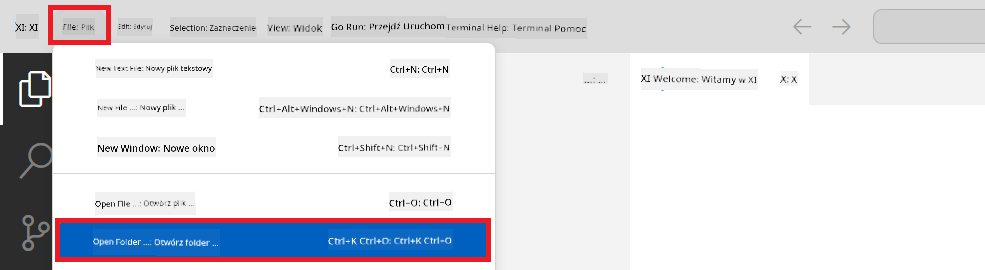

1. W lewym panelu Visual Studio Code kliknij prawym przyciskiem myszy i wybierz **New File**, aby utworzyć nowy plik o nazwie *download_dataset.py*.

    

### Przygotuj zestaw danych do fine-tuningu

W tym ćwiczeniu uruchomisz plik *download_dataset.py*, aby pobrać zestawy danych *ultrachat_200k* do lokalnego środowiska. Następnie użyjesz tych danych do fine-tuningu modelu Phi-3 w Azure Machine Learning.

W tym ćwiczeniu:

- Dodasz kod do pliku *download_dataset.py*, aby pobrać zestawy danych.
- Uruchomisz plik *download_dataset.py*, aby pobrać dane do lokalnego środowiska.

#### Pobierz swój zestaw danych za pomocą *download_dataset.py*

1. Otwórz plik *download_dataset.py* w Visual Studio Code.

1. Dodaj następujący kod do pliku *download_dataset.py*.

    ```python
    import json
    import os
    from datasets import load_dataset

    def load_and_split_dataset(dataset_name, config_name, split_ratio):
        """
        Load and split a dataset.
        """
        # Load the dataset with the specified name, configuration, and split ratio
        dataset = load_dataset(dataset_name, config_name, split=split_ratio)
        print(f"Original dataset size: {len(dataset)}")
        
        # Split the dataset into train and test sets (80% train, 20% test)
        split_dataset = dataset.train_test_split(test_size=0.2)
        print(f"Train dataset size: {len(split_dataset['train'])}")
        print(f"Test dataset size: {len(split_dataset['test'])}")
        
        return split_dataset

    def save_dataset_to_jsonl(dataset, filepath):
        """
        Save a dataset to a JSONL file.
        """
        # Create the directory if it does not exist
        os.makedirs(os.path.dirname(filepath), exist_ok=True)
        
        # Open the file in write mode
        with open(filepath, 'w', encoding='utf-8') as f:
            # Iterate over each record in the dataset
            for record in dataset:
                # Dump the record as a JSON object and write it to the file
                json.dump(record, f)
                # Write a newline character to separate records
                f.write('\n')
        
        print(f"Dataset saved to {filepath}")

    def main():
        """
        Main function to load, split, and save the dataset.
        """
        # Load and split the ULTRACHAT_200k dataset with a specific configuration and split ratio
        dataset = load_and_split_dataset("HuggingFaceH4/ultrachat_200k", 'default', 'train_sft[:1%]')
        
        # Extract the train and test datasets from the split
        train_dataset = dataset['train']
        test_dataset = dataset['test']

        # Save the train dataset to a JSONL file
        save_dataset_to_jsonl(train_dataset, "data/train_data.jsonl")
        
        # Save the test dataset to a separate JSONL file
        save_dataset_to_jsonl(test_dataset, "data/test_data.jsonl")

    if __name__ == "__main__":
        main()

    ```

1. Wpisz następujące polecenie w terminalu, aby uruchomić skrypt i pobrać zestaw danych do lokalnego środowiska.

    ```console
    python download_dataset.py
    ```

1. Sprawdź, czy zestawy danych zostały pomyślnie zapisane w lokalnym katalogu *finetune-phi/data*.

> [!NOTE]
>
> #### Uwagi dotyczące rozmiaru zestawu danych i czasu fine-tuningu
>
> W tym samouczku używasz tylko 1% zestawu danych (`split='train[:1%]'`). Znacznie zmniejsza to ilość danych, przyspieszając zarówno przesyłanie, jak i proces fine-tuningu. Możesz dostosować procent, aby znaleźć odpowiedni balans między czasem treningu a wydajnością modelu. Użycie mniejszej części zestawu danych skraca czas potrzebny na fine-tuning, co ułatwia przeprowadzenie ćwiczenia.

## Scenariusz 2: Fine-tuning modelu Phi-3 i wdrożenie w Azure Machine Learning Studio

### Fine-tuning modelu Phi-3

W tym ćwiczeniu wykonasz fine-tuning modelu Phi-3 w Azure Machine Learning Studio.

W tym ćwiczeniu:

- Utworzysz klaster obliczeniowy do fine-tuningu.
- Wykonasz fine-tuning modelu Phi-3 w Azure Machine Learning Studio.

#### Utwórz klaster obliczeniowy do fine-tuningu

1. Odwiedź [Azure ML Studio](https://ml.azure.com/home?wt.mc_id=studentamb_279723).

1. Wybierz **Compute** z lewego panelu.

1. Wybierz **Compute clusters** z menu nawigacyjnego.

1. Wybierz **+ New**.

    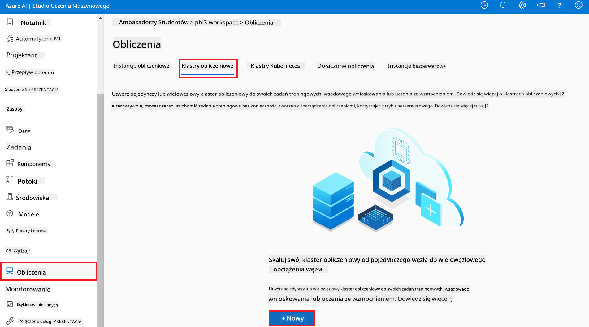

1. Wykonaj następujące czynności:

    - Wybierz **Region**, którego chcesz użyć.
    - Ustaw **Virtual machine tier** na **Dedicated**.
    - Ustaw **Virtual machine type** na **GPU**.
    - W filtrze **Virtual machine size** wybierz **Select from all options**.
    - Wybierz **Virtual machine size** na **Standard_NC24ads_A100_v4**.

    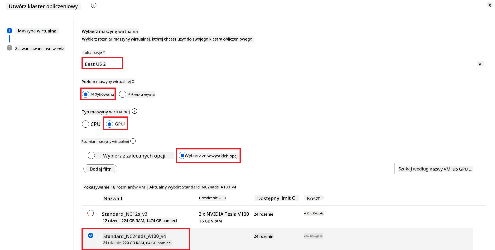

1. Wybierz **Next**.

1. Wykonaj następujące czynności:

    - Wprowadź **Compute name**. Musi to być unikalna nazwa.
    - Ustaw **Minimum number of nodes** na **0**.
    - Ustaw **Maximum number of nodes** na **1**.
    - Ustaw **Idle seconds before scale down** na **120**.

    

1. Wybierz **Create**.

#### Fine-tuning modelu Phi-3

1. Odwiedź [Azure ML Studio](https://ml.azure.com/home?wt.mc_id=studentamb_279723).

1. Wybierz utworzone przez siebie środowisko Azure Machine Learning.

    

1. Wykonaj następujące czynności:

    - Wybierz **Model catalog** z lewego panelu.
    - Wpisz *phi-3-mini-4k* w **pasku wyszukiwania** i wybierz **Phi-3-mini-4k-instruct** z pojawiających się opcji.

    

1. Wybierz **Fine-tune** z menu nawigacyjnego.

    

1. Wykonaj następujące czynności:

    - Ustaw **Select task type** na **Chat completion**.
    - Wybierz **+ Select data**, aby przesłać **Traning data**.
    - Ustaw typ przesyłania danych walidacyjnych na **Provide different validation data**.
    - Wybierz **+ Select data**, aby przesłać **Validation data**.

    

    > [!TIP]
    >
    > Możesz wybrać **Advanced settings**, aby dostosować konfiguracje takie jak **learning_rate** i **lr_scheduler_type**, aby zoptymalizować proces fine-tuningu zgodnie z własnymi potrzebami.

1. Wybierz **Finish**.

1. W tym ćwiczeniu pomyślnie wykonałeś fine-tuning modelu Phi-3 za pomocą Azure Machine Learning. Pamiętaj, że proces fine-tuningu może zająć sporo czasu. Po uruchomieniu zadania fine-tuningu musisz poczekać na jego zakończenie. Status zadania możesz monitorować, przechodząc do zakładki Jobs po lewej stronie w Azure Machine Learning Workspace. W kolejnej części wdrożysz wytrenowany model i zintegrujesz go z Prompt flow.

    

### Wdrożenie wytrenowanego modelu Phi-3

Aby zintegrować wytrenowany model Phi-3 z Prompt flow, musisz wdrożyć model, aby był dostępny do inferencji w czasie rzeczywistym. Proces ten obejmuje rejestrację modelu, utworzenie punktu końcowego online oraz wdrożenie modelu.

W tym ćwiczeniu:

- Zarejestrujesz wytrenowany model w Azure Machine Learning workspace.
- Utworzysz punkt końcowy online.
- Wdrożysz zarejestrowany wytrenowany model Phi-3.

#### Zarejestruj wytrenowany model

1. Odwiedź [Azure ML Studio](https://ml.azure.com/home?wt.mc_id=studentamb_279723).

1. Wybierz utworzone przez siebie środowisko Azure Machine Learning.

    

1. Wybierz **Models** z lewego panelu.

1. Wybierz **+ Register**.

1. Wybierz **From a job output**.

    

1. Wybierz utworzone przez siebie zadanie.

    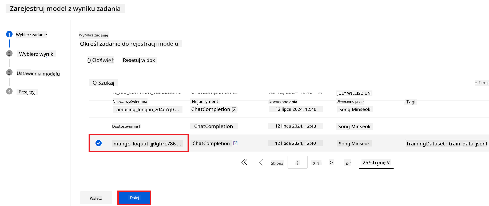

1. Wybierz **Next**.

1. Ustaw **Model type** na **MLflow**.

1. Upewnij się, że wybrano **Job output**; powinno być wybrane automatycznie.

    

2. Wybierz **Next**.

3. Wybierz **Register**.

    

4. Możesz zobaczyć zarejestrowany model, przechodząc do menu **Models** po lewej stronie.

    

#### Wdrożenie wytrenowanego modelu

1. Przejdź do utworzonego środowiska Azure Machine Learning.

1. Wybierz **Endpoints** z lewego panelu.

1. Wybierz **Real-time endpoints** z menu nawigacyjnego.

    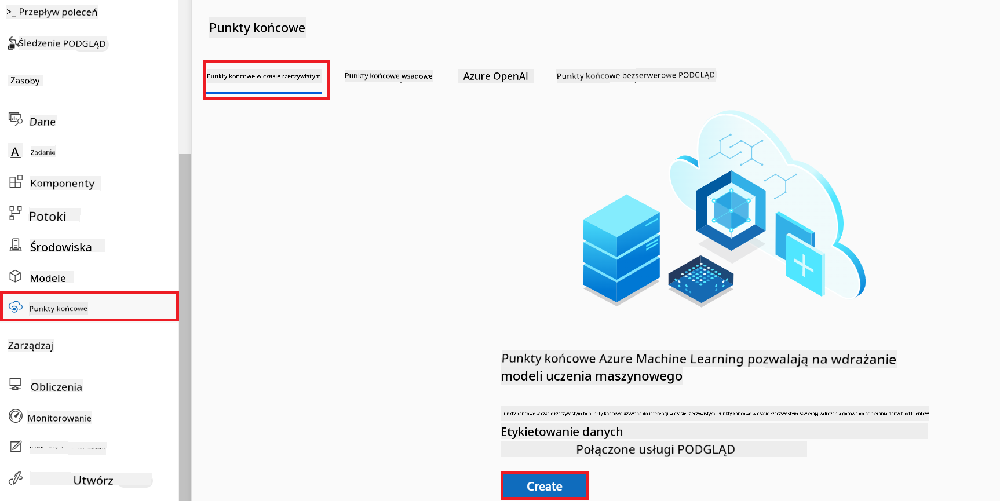

1. Wybierz **Create**.

1. Wybierz zarejestrowany model, który utworzyłeś.

    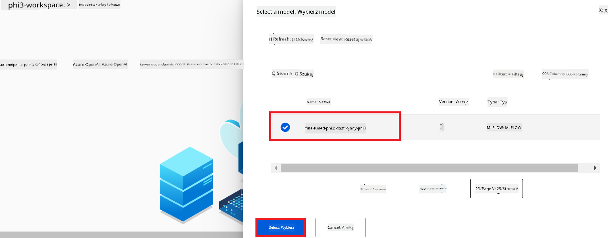

1. Wybierz **Select**.

1. Wykonaj następujące czynności:

    - Wybierz **Virtual machine** na *Standard_NC6s_v3*.
    - Wybierz liczbę instancji, której chcesz użyć, np. *1*.
    - Ustaw **Endpoint** na **New**, aby utworzyć nowy punkt końcowy.
    - Wprowadź **Endpoint name**. Musi to być unikalna nazwa.
    - Wprowadź **Deployment name**. Musi to być unikalna nazwa.

    

1. Wybierz **Deploy**.

> [!WARNING]
> Aby uniknąć dodatkowych opłat, upewnij się, że usuniesz utworzony punkt końcowy w Azure Machine Learning workspace.
>

#### Sprawdź status wdrożenia w Azure Machine Learning Workspace

1. Przejdź do utworzonego środowiska Azure Machine Learning.

1. Wybierz **Endpoints** z lewego panelu.

1. Wybierz utworzony punkt końcowy.

    

1. Na tej stronie możesz zarządzać punktami końcowymi podczas procesu wdrożenia.

> [!NOTE]
> Po zakończeniu wdrożenia upewnij się, że **Live traffic** jest ustawiony na **100%**. Jeśli nie, wybierz **Update traffic**, aby dostosować ustawienia ruchu. Pamiętaj, że nie możesz testować modelu, jeśli ruch jest ustawiony na 0%.
>
> 
>

## Scenariusz 3: Integracja z Prompt flow i rozmowa z własnym modelem w Azure AI Foundry

### Integracja własnego modelu Phi-3 z Prompt flow

Po pomyślnym wdrożeniu wytrenowanego modelu możesz teraz zintegrować go z Prompt Flow, aby używać modelu w aplikacjach działających w czasie rzeczywistym, umożliwiając różnorodne interaktywne zadania z Twoim własnym modelem Phi-3.

W tym ćwiczeniu:

- Utworzysz Azure AI Foundry Hub.
- Utworzysz projekt Azure AI Foundry.
- Utworzysz Prompt flow.
- Dodasz niestandardowe połączenie dla wytrenowanego modelu Phi-3.
- Skonfigurujesz Prompt flow do rozmowy z własnym modelem Phi-3.
> [!NOTE]
> Możesz również zintegrować się z Promptflow za pomocą Azure ML Studio. Ten sam proces integracji można zastosować w Azure ML Studio.
#### Utwórz Azure AI Foundry Hub

Musisz utworzyć Hub, zanim stworzysz Projekt. Hub działa jak Grupa zasobów, pozwalając na organizację i zarządzanie wieloma Projektami w Azure AI Foundry.

1. Odwiedź [Azure AI Foundry](https://ai.azure.com/?WT.mc_id=aiml-137032-kinfeylo).

1. Wybierz **All hubs** z zakładki po lewej stronie.

1. Wybierz **+ New hub** z menu nawigacyjnego.

    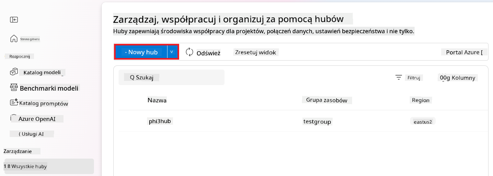

1. Wykonaj następujące czynności:

    - Wprowadź **Hub name**. Musi to być unikalna wartość.
    - Wybierz swoją subskrypcję Azure (**Subscription**).
    - Wybierz **Resource group**, której chcesz użyć (utwórz nową, jeśli to konieczne).
    - Wybierz **Location**, której chcesz użyć.
    - Wybierz **Connect Azure AI Services**, które chcesz użyć (utwórz nowe, jeśli to konieczne).
    - Wybierz **Connect Azure AI Search** i zaznacz **Skip connecting**.

    

1. Wybierz **Next**.

#### Utwórz projekt Azure AI Foundry

1. W utworzonym Hubie wybierz **All projects** z zakładki po lewej stronie.

1. Wybierz **+ New project** z menu nawigacyjnego.

    

1. Wprowadź **Project name**. Musi to być unikalna wartość.

    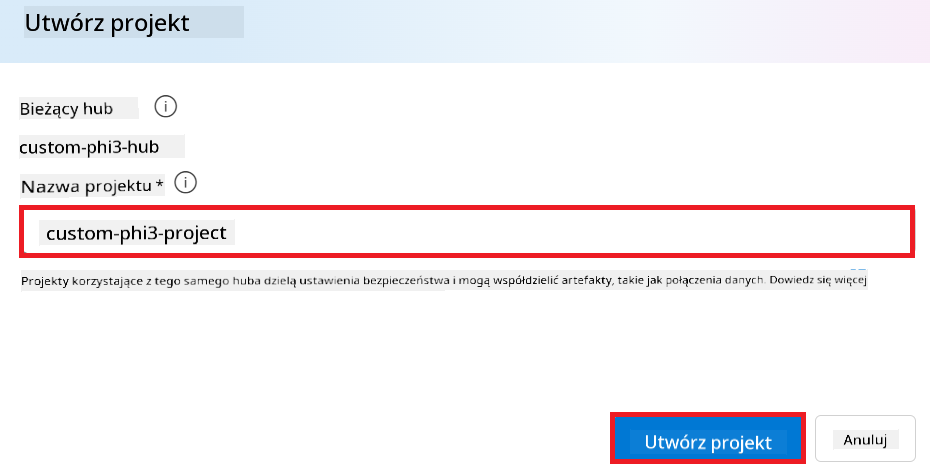

1. Wybierz **Create a project**.

#### Dodaj niestandardowe połączenie dla dostrojonego modelu Phi-3

Aby zintegrować swój niestandardowy model Phi-3 z Prompt flow, musisz zapisać punkt końcowy modelu i klucz w niestandardowym połączeniu. To ustawienie zapewnia dostęp do Twojego niestandardowego modelu Phi-3 w Prompt flow.

#### Ustaw klucz api i URI punktu końcowego dostrojonego modelu Phi-3

1. Odwiedź [Azure ML Studio](https://ml.azure.com/home?WT.mc_id=aiml-137032-kinfeylo).

1. Przejdź do przestrzeni roboczej Azure Machine Learning, którą utworzyłeś.

1. Wybierz **Endpoints** z zakładki po lewej stronie.

    

1. Wybierz utworzony punkt końcowy.

    

1. Wybierz **Consume** z menu nawigacyjnego.

1. Skopiuj swój **REST endpoint** oraz **Primary key**.

    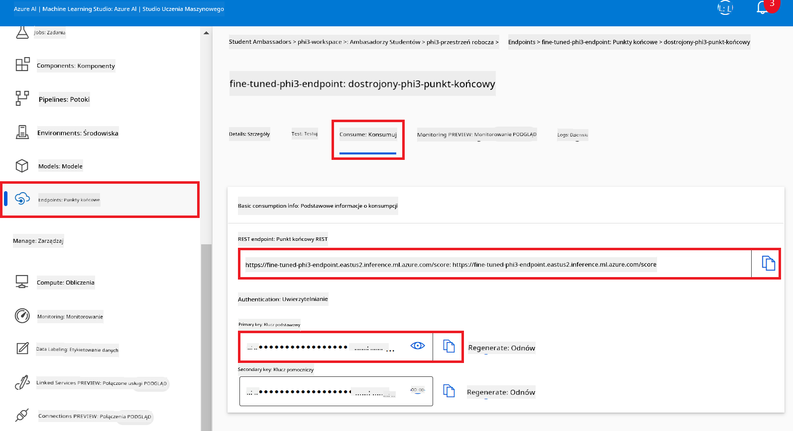

#### Dodaj niestandardowe połączenie

1. Odwiedź [Azure AI Foundry](https://ai.azure.com/?WT.mc_id=aiml-137032-kinfeylo).

1. Przejdź do projektu Azure AI Foundry, który utworzyłeś.

1. W utworzonym Projekcie wybierz **Settings** z zakładki po lewej stronie.

1. Wybierz **+ New connection**.

    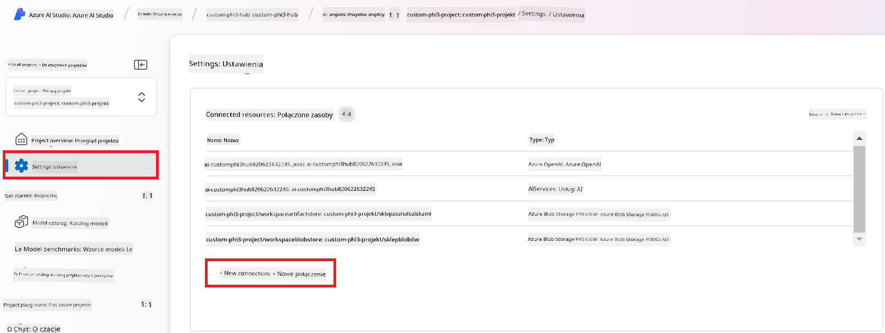

1. Wybierz **Custom keys** z menu nawigacyjnego.

    

1. Wykonaj następujące czynności:

    - Wybierz **+ Add key value pairs**.
    - Dla nazwy klucza wpisz **endpoint** i wklej skopiowany z Azure ML Studio punkt końcowy w pole wartości.
    - Ponownie wybierz **+ Add key value pairs**.
    - Dla nazwy klucza wpisz **key** i wklej skopiowany z Azure ML Studio klucz w pole wartości.
    - Po dodaniu kluczy zaznacz **is secret**, aby zapobiec ujawnieniu klucza.

    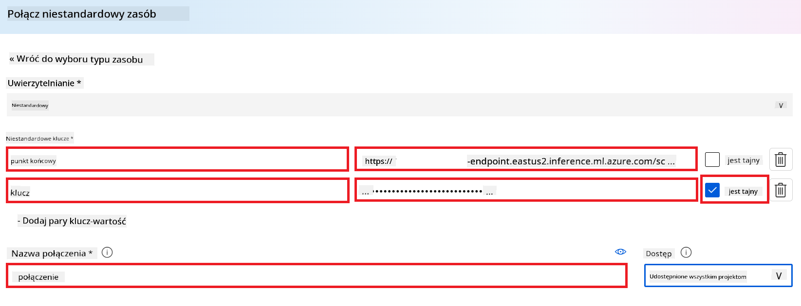

1. Wybierz **Add connection**.

#### Utwórz Prompt flow

Dodałeś niestandardowe połączenie w Azure AI Foundry. Teraz utwórz Prompt flow, wykonując poniższe kroki. Następnie połącz ten Prompt flow z niestandardowym połączeniem, aby móc korzystać z dostrojonego modelu w Prompt flow.

1. Przejdź do projektu Azure AI Foundry, który utworzyłeś.

1. Wybierz **Prompt flow** z zakładki po lewej stronie.

1. Wybierz **+ Create** z menu nawigacyjnego.

    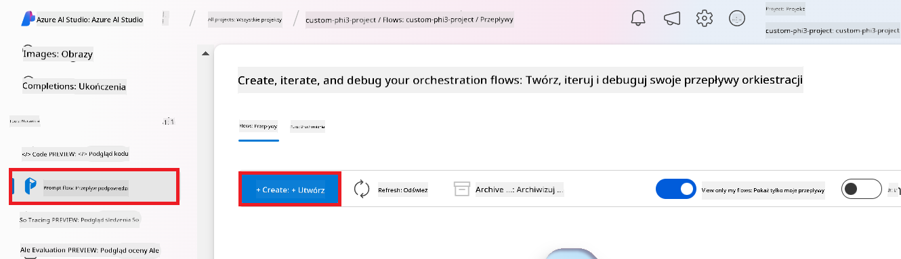

1. Wybierz **Chat flow** z menu nawigacyjnego.

    

1. Wprowadź **Folder name**, którego chcesz użyć.

    

2. Wybierz **Create**.

#### Skonfiguruj Prompt flow do rozmowy z niestandardowym modelem Phi-3

Musisz zintegrować dostrojony model Phi-3 z Prompt flow. Jednak istniejący Prompt flow nie jest do tego przystosowany. Dlatego musisz przeprojektować Prompt flow, aby umożliwić integrację niestandardowego modelu.

1. W Prompt flow wykonaj następujące czynności, aby przebudować istniejący flow:

    - Wybierz **Raw file mode**.
    - Usuń cały istniejący kod w pliku *flow.dag.yml*.
    - Dodaj poniższy kod do pliku *flow.dag.yml*.

        ```yml
        inputs:
          input_data:
            type: string
            default: "Who founded Microsoft?"

        outputs:
          answer:
            type: string
            reference: ${integrate_with_promptflow.output}

        nodes:
        - name: integrate_with_promptflow
          type: python
          source:
            type: code
            path: integrate_with_promptflow.py
          inputs:
            input_data: ${inputs.input_data}
        ```

    - Wybierz **Save**.

    

1. Dodaj poniższy kod do pliku *integrate_with_promptflow.py*, aby użyć niestandardowego modelu Phi-3 w Prompt flow.

    ```python
    import logging
    import requests
    from promptflow import tool
    from promptflow.connections import CustomConnection

    # Logging setup
    logging.basicConfig(
        format="%(asctime)s - %(levelname)s - %(name)s - %(message)s",
        datefmt="%Y-%m-%d %H:%M:%S",
        level=logging.DEBUG
    )
    logger = logging.getLogger(__name__)

    def query_phi3_model(input_data: str, connection: CustomConnection) -> str:
        """
        Send a request to the Phi-3 model endpoint with the given input data using Custom Connection.
        """

        # "connection" is the name of the Custom Connection, "endpoint", "key" are the keys in the Custom Connection
        endpoint_url = connection.endpoint
        api_key = connection.key

        headers = {
            "Content-Type": "application/json",
            "Authorization": f"Bearer {api_key}"
        }
        data = {
            "input_data": {
                "input_string": [
                    {"role": "user", "content": input_data}
                ],
                "parameters": {
                    "temperature": 0.7,
                    "max_new_tokens": 128
                }
            }
        }
        try:
            response = requests.post(endpoint_url, json=data, headers=headers)
            response.raise_for_status()
            
            # Log the full JSON response
            logger.debug(f"Full JSON response: {response.json()}")

            result = response.json()["output"]
            logger.info("Successfully received response from Azure ML Endpoint.")
            return result
        except requests.exceptions.RequestException as e:
            logger.error(f"Error querying Azure ML Endpoint: {e}")
            raise

    @tool
    def my_python_tool(input_data: str, connection: CustomConnection) -> str:
        """
        Tool function to process input data and query the Phi-3 model.
        """
        return query_phi3_model(input_data, connection)

    ```

    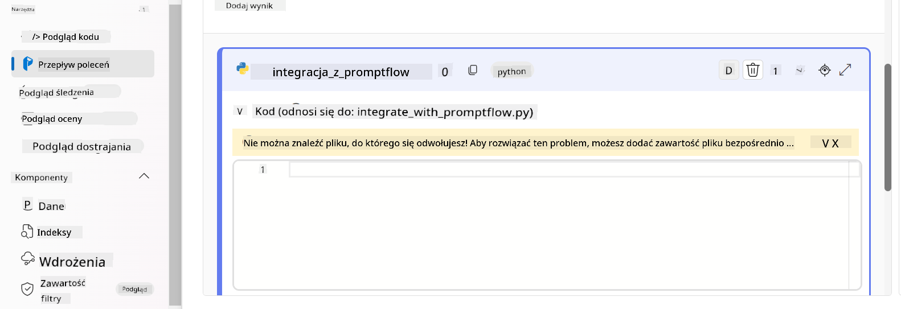

> [!NOTE]
> Aby uzyskać bardziej szczegółowe informacje na temat korzystania z Prompt flow w Azure AI Foundry, możesz zapoznać się z [Prompt flow in Azure AI Foundry](https://learn.microsoft.com/azure/ai-studio/how-to/prompt-flow).

1. Wybierz **Chat input**, **Chat output**, aby włączyć rozmowę z modelem.

    

1. Teraz jesteś gotowy do rozmowy z niestandardowym modelem Phi-3. W kolejnym ćwiczeniu nauczysz się, jak uruchomić Prompt flow i korzystać z niego do rozmowy z dostrojonym modelem Phi-3.

> [!NOTE]
>
> Przebudowany flow powinien wyglądać jak na poniższym obrazku:
>
> 
>

### Rozmowa z niestandardowym modelem Phi-3

Teraz, gdy dostroiłeś i zintegrowałeś swój niestandardowy model Phi-3 z Prompt flow, jesteś gotowy, aby zacząć z nim rozmawiać. To ćwiczenie przeprowadzi Cię przez proces konfiguracji i uruchomienia rozmowy z modelem za pomocą Prompt flow. Postępując zgodnie z tymi krokami, będziesz mógł w pełni wykorzystać możliwości swojego dostrojonego modelu Phi-3 do różnych zadań i konwersacji.

- Rozmawiaj z niestandardowym modelem Phi-3 za pomocą Prompt flow.

#### Uruchom Prompt flow

1. Wybierz **Start compute sessions**, aby uruchomić Prompt flow.

    

1. Wybierz **Validate and parse input**, aby odświeżyć parametry.

    

1. Wybierz **Value** pola **connection** i wskaż niestandardowe połączenie, które utworzyłeś. Na przykład *connection*.

    

#### Rozmawiaj ze swoim niestandardowym modelem

1. Wybierz **Chat**.

    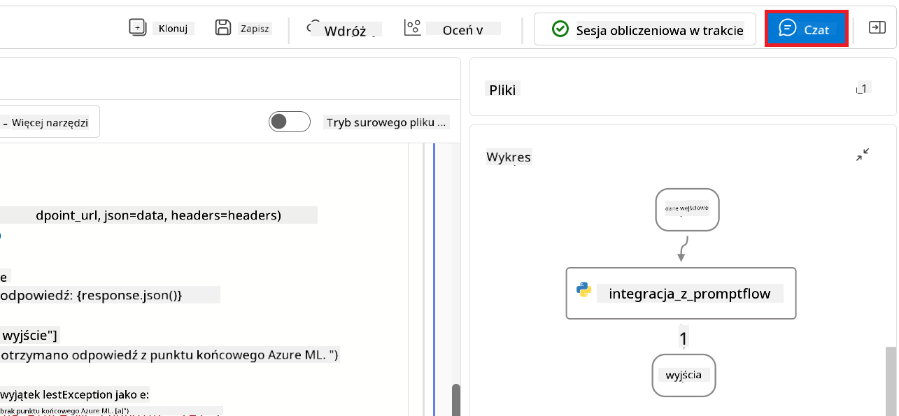

1. Oto przykład wyników: teraz możesz rozmawiać ze swoim niestandardowym modelem Phi-3. Zaleca się zadawanie pytań opartych na danych użytych do dostrojenia.

    

**Zastrzeżenie**:  
Niniejszy dokument został przetłumaczony przy użyciu usługi tłumaczenia AI [Co-op Translator](https://github.com/Azure/co-op-translator). Mimo że dążymy do dokładności, prosimy mieć na uwadze, że automatyczne tłumaczenia mogą zawierać błędy lub nieścisłości. Oryginalny dokument w języku źródłowym powinien być uznawany za źródło autorytatywne. W przypadku informacji o kluczowym znaczeniu zalecane jest skorzystanie z profesjonalnego tłumaczenia wykonanego przez człowieka. Nie ponosimy odpowiedzialności za jakiekolwiek nieporozumienia lub błędne interpretacje wynikające z korzystania z tego tłumaczenia.