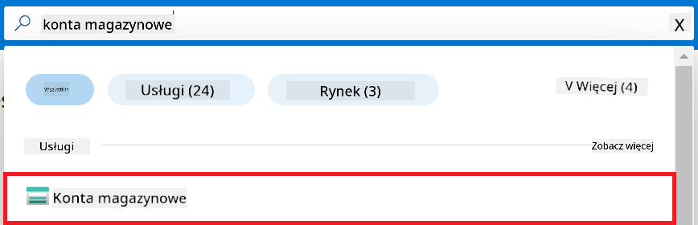
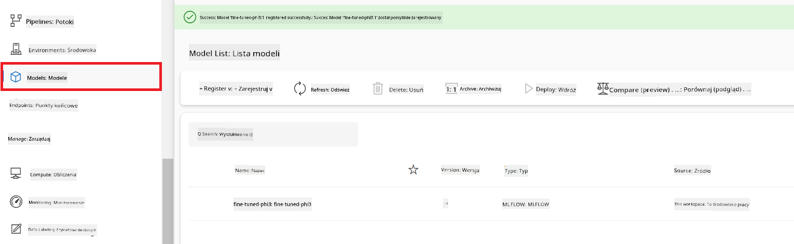

<!--
CO_OP_TRANSLATOR_METADATA:
{
  "original_hash": "ecbd9179a21edbaafaf114d47f09f3e3",
  "translation_date": "2025-05-09T18:04:17+00:00",
  "source_file": "md/02.Application/01.TextAndChat/Phi3/E2E_Phi-3-FineTuning_PromptFlow_Integration_AIFoundry.md",
  "language_code": "pl"
}
-->
# Dostosuj i zintegruj niestandardowe modele Phi-3 z Prompt flow w Azure AI Foundry

Ten kompleksowy (E2E) przykład opiera się na przewodniku "[Fine-Tune and Integrate Custom Phi-3 Models with Prompt Flow in Azure AI Foundry](https://techcommunity.microsoft.com/t5/educator-developer-blog/fine-tune-and-integrate-custom-phi-3-models-with-prompt-flow-in/ba-p/4191726?WT.mc_id=aiml-137032-kinfeylo)" z Microsoft Tech Community. Przedstawia procesy dostrajania, wdrażania i integracji niestandardowych modeli Phi-3 z Prompt flow w Azure AI Foundry.
W przeciwieństwie do przykładu E2E "[Fine-Tune and Integrate Custom Phi-3 Models with Prompt Flow](./E2E_Phi-3-FineTuning_PromptFlow_Integration.md)", który wymagał uruchamiania kodu lokalnie, ten samouczek skupia się całkowicie na dostrajaniu i integracji modelu w Azure AI / ML Studio.

## Przegląd

W tym przykładzie E2E nauczysz się, jak dostroić model Phi-3 i zintegrować go z Prompt flow w Azure AI Foundry. Wykorzystując Azure AI / ML Studio, stworzysz workflow do wdrażania i korzystania z niestandardowych modeli AI. Przykład E2E podzielony jest na trzy scenariusze:

**Scenariusz 1: Konfiguracja zasobów Azure i przygotowanie do dostrajania**

**Scenariusz 2: Dostrajanie modelu Phi-3 i wdrażanie w Azure Machine Learning Studio**

**Scenariusz 3: Integracja z Prompt flow i rozmowa z niestandardowym modelem w Azure AI Foundry**

Oto przegląd tego przykładu E2E.


### Spis treści

1. **[Scenariusz 1: Konfiguracja zasobów Azure i przygotowanie do dostrajania](../../../../../../md/02.Application/01.TextAndChat/Phi3)**
    - [Utwórz Azure Machine Learning Workspace](../../../../../../md/02.Application/01.TextAndChat/Phi3)
    - [Złóż wniosek o limity GPU w subskrypcji Azure](../../../../../../md/02.Application/01.TextAndChat/Phi3)
    - [Dodaj przypisanie roli](../../../../../../md/02.Application/01.TextAndChat/Phi3)
    - [Skonfiguruj projekt](../../../../../../md/02.Application/01.TextAndChat/Phi3)
    - [Przygotuj zestaw danych do dostrajania](../../../../../../md/02.Application/01.TextAndChat/Phi3)

1. **[Scenariusz 2: Dostrój model Phi-3 i wdrażaj w Azure Machine Learning Studio](../../../../../../md/02.Application/01.TextAndChat/Phi3)**
    - [Dostrój model Phi-3](../../../../../../md/02.Application/01.TextAndChat/Phi3)
    - [Wdrażaj dostrojony model Phi-3](../../../../../../md/02.Application/01.TextAndChat/Phi3)

1. **[Scenariusz 3: Integracja z Prompt flow i rozmowa z niestandardowym modelem w Azure AI Foundry](../../../../../../md/02.Application/01.TextAndChat/Phi3)**
    - [Zintegruj niestandardowy model Phi-3 z Prompt flow](../../../../../../md/02.Application/01.TextAndChat/Phi3)
    - [Rozmawiaj ze swoim niestandardowym modelem Phi-3](../../../../../../md/02.Application/01.TextAndChat/Phi3)

## Scenariusz 1: Konfiguracja zasobów Azure i przygotowanie do dostrajania

### Utwórz Azure Machine Learning Workspace

1. Wpisz *azure machine learning* w **pasku wyszukiwania** na górze strony portalu i wybierz **Azure Machine Learning** z dostępnych opcji.

    

2. Wybierz **+ Create** z menu nawigacyjnego.

3. Wybierz **New workspace** z menu nawigacyjnego.

    

4. Wykonaj następujące czynności:

    - Wybierz swoją subskrypcję Azure (**Subscription**).
    - Wybierz grupę zasobów (**Resource group**) do użycia (stwórz nową, jeśli to konieczne).
    - Wpisz nazwę workspace (**Workspace Name**). Musi być unikalna.
    - Wybierz region (**Region**), którego chcesz użyć.
    - Wybierz konto magazynu (**Storage account**) do użycia (stwórz nowe, jeśli to konieczne).
    - Wybierz key vault do użycia (stwórz nowy, jeśli to konieczne).
    - Wybierz Application Insights do użycia (stwórz nowy, jeśli to konieczne).
    - Wybierz rejestr kontenerów (**Container registry**) do użycia (stwórz nowy, jeśli to konieczne).

    

5. Wybierz **Review + Create**.

6. Wybierz **Create**.

### Złóż wniosek o limity GPU w subskrypcji Azure

W tym samouczku nauczysz się, jak dostroić i wdrożyć model Phi-3, korzystając z GPU. Do dostrajania użyjesz GPU *Standard_NC24ads_A100_v4*, który wymaga złożenia wniosku o limit. Do wdrożenia użyjesz GPU *Standard_NC6s_v3*, który również wymaga wniosku o limit.

> [!NOTE]
>
> Tylko subskrypcje Pay-As-You-Go (standardowy typ subskrypcji) kwalifikują się do przydziału GPU; subskrypcje typu benefit nie są obecnie obsługiwane.
>

1. Odwiedź [Azure ML Studio](https://ml.azure.com/home?wt.mc_id=studentamb_279723).

1. Wykonaj następujące kroki, aby złożyć wniosek o limit *Standard NCADSA100v4 Family*:

    - Wybierz **Quota** z lewego panelu.
    - Wybierz rodzinę maszyn wirtualnych (**Virtual machine family**), np. **Standard NCADSA100v4 Family Cluster Dedicated vCPUs**, która obejmuje GPU *Standard_NC24ads_A100_v4*.
    - Wybierz **Request quota** z menu nawigacyjnego.

        

    - Na stronie Request quota wpisz nowy limit rdzeni (**New cores limit**), np. 24.
    - Na stronie Request quota wybierz **Submit**, aby złożyć wniosek o limit GPU.

1. Wykonaj następujące kroki, aby złożyć wniosek o limit *Standard NCSv3 Family*:

    - Wybierz **Quota** z lewego panelu.
    - Wybierz rodzinę maszyn wirtualnych (**Virtual machine family**), np. **Standard NCSv3 Family Cluster Dedicated vCPUs**, która obejmuje GPU *Standard_NC6s_v3*.
    - Wybierz **Request quota** z menu nawigacyjnego.
    - Na stronie Request quota wpisz nowy limit rdzeni (**New cores limit**), np. 24.
    - Na stronie Request quota wybierz **Submit**, aby złożyć wniosek o limit GPU.

### Dodaj przypisanie roli

Aby dostroić i wdrożyć modele, musisz najpierw utworzyć User Assigned Managed Identity (UAI) i przypisać jej odpowiednie uprawnienia. Ta UAI będzie używana do uwierzytelniania podczas wdrażania.

#### Utwórz User Assigned Managed Identity (UAI)

1. Wpisz *managed identities* w **pasku wyszukiwania** na górze strony portalu i wybierz **Managed Identities** z dostępnych opcji.

    

1. Wybierz **+ Create**.

    

1. Wykonaj następujące czynności:

    - Wybierz swoją subskrypcję Azure (**Subscription**).
    - Wybierz grupę zasobów (**Resource group**) do użycia (stwórz nową, jeśli to konieczne).
    - Wybierz region (**Region**), którego chcesz użyć.
    - Wpisz nazwę (**Name**). Musi być unikalna.

    

1. Wybierz **Review + create**.

1. Wybierz **+ Create**.

#### Dodaj przypisanie roli Contributor do Managed Identity

1. Przejdź do zasobu Managed Identity, który utworzyłeś.

1. Wybierz **Azure role assignments** z lewego panelu.

1. Wybierz **+Add role assignment** z menu nawigacyjnego.

1. Na stronie Add role assignment wykonaj następujące czynności:
    - Wybierz zakres (**Scope**) jako **Resource group**.
    - Wybierz swoją subskrypcję Azure (**Subscription**).
    - Wybierz grupę zasobów (**Resource group**) do użycia.
    - Wybierz rolę (**Role**) jako **Contributor**.

    

2. Wybierz **Save**.

#### Dodaj przypisanie roli Storage Blob Data Reader do Managed Identity

1. Wpisz *storage accounts* w **pasku wyszukiwania** na górze strony portalu i wybierz **Storage accounts** z dostępnych opcji.

    

1. Wybierz konto magazynu powiązane z Azure Machine Learning workspace, które utworzyłeś. Na przykład *finetunephistorage*.

1. Wykonaj następujące kroki, aby przejść do strony Add role assignment:

    - Przejdź do utworzonego konta magazynu Azure Storage.
    - Wybierz **Access Control (IAM)** z lewego panelu.
    - Wybierz **+ Add** z menu nawigacyjnego.
    - Wybierz **Add role assignment** z menu nawigacyjnego.

    

1. Na stronie Add role assignment wykonaj następujące czynności:

    - W polu roli wpisz *Storage Blob Data Reader* w **pasku wyszukiwania** i wybierz **Storage Blob Data Reader** z dostępnych opcji.
    - Wybierz **Next**.
    - Na stronie Members wybierz **Assign access to** **Managed identity**.
    - Wybierz **+ Select members**.
    - Na stronie Select managed identities wybierz swoją subskrypcję Azure (**Subscription**).
    - Wybierz **Managed identity** jako **Manage Identity**.
    - Wybierz utworzoną Managed Identity, np. *finetunephi-managedidentity*.
    - Wybierz **Select**.

    

1. Wybierz **Review + assign**.

#### Dodaj przypisanie roli AcrPull do Managed Identity

1. Wpisz *container registries* w **pasku wyszukiwania** na górze strony portalu i wybierz **Container registries** z dostępnych opcji.

    

1. Wybierz rejestr kontenerów powiązany z Azure Machine Learning workspace, np. *finetunephicontainerregistry*

1. Wykonaj następujące kroki, aby przejść do strony Add role assignment:

    - Wybierz **Access Control (IAM)** z lewego panelu.
    - Wybierz **+ Add** z menu nawigacyjnego.
    - Wybierz **Add role assignment** z menu nawigacyjnego.

1. Na stronie Add role assignment wykonaj następujące czynności:

    - W polu roli wpisz *AcrPull* w **pasku wyszukiwania** i wybierz **AcrPull** z dostępnych opcji.
    - Wybierz **Next**.
    - Na stronie Members wybierz **Assign access to** **Managed identity**.
    - Wybierz **+ Select members**.
    - Na stronie Select managed identities wybierz swoją subskrypcję Azure (**Subscription**).
    - Wybierz **Managed identity** jako **Manage Identity**.
    - Wybierz utworzoną Managed Identity, np. *finetunephi-managedidentity*.
    - Wybierz **Select**.
    - Wybierz **Review + assign**.

### Skonfiguruj projekt

Aby pobrać zestawy danych potrzebne do dostrajania, skonfigurujesz środowisko lokalne.

W tym ćwiczeniu:

- Utworzysz folder do pracy.
- Utworzysz środowisko wirtualne.
- Zainstalujesz wymagane pakiety.
- Utworzysz plik *download_dataset.py* do pobrania zestawu danych.

#### Utwórz folder do pracy

1. Otwórz terminal i wpisz następujące polecenie, aby utworzyć folder o nazwie *finetune-phi* w domyślnej lokalizacji.

    ```console
    mkdir finetune-phi
    ```

2. Wpisz następujące polecenie w terminalu, aby przejść do utworzonego folderu *finetune-phi*.

    ```console
    cd finetune-phi
    ```

#### Utwórz środowisko wirtualne

1. Wpisz następujące polecenie w terminalu, aby utworzyć środowisko wirtualne o nazwie *.venv*.

    ```console
    python -m venv .venv
    ```

2. Wpisz następujące polecenie w terminalu, aby aktywować środowisko wirtualne.

    ```console
    .venv\Scripts\activate.bat
    ```

> [!NOTE]
> Jeśli wszystko poszło dobrze, przed wierszem poleceń powinno pojawić się *(.venv)*.

#### Zainstaluj wymagane pakiety

1. Wpisz następujące polecenia w terminalu, aby zainstalować potrzebne pakiety.

    ```console
    pip install datasets==2.19.1
    ```

#### Utwórz `download_dataset.py`

> [!NOTE]
> Kompletny układ folderów:
>
> ```text
> └── YourUserName
> .    └── finetune-phi
> .        └── download_dataset.py
> ```

1. Otwórz **Visual Studio Code**.

1. Wybierz **File** z paska menu.

1. Wybierz **Open Folder**.

1. Wybierz utworzony folder *finetune-phi*, który znajduje się pod ścieżką *C:\Users\yourUserName\finetune-phi*.

    

1. W lewym panelu Visual Studio Code kliknij prawym przyciskiem i wybierz **New File**, aby utworzyć nowy plik o nazwie *download_dataset.py*.

    

### Przygotuj zestaw danych do dostrajania

W tym ćwiczeniu uruchomisz plik *download_dataset.py*, aby pobrać zestawy danych *ultrachat_200k* do środowiska lokalnego. Następnie użyjesz tych danych do dostrojenia modelu Phi-3 w Azure Machine Learning.

W tym ćwiczeniu:

- Dodasz kod do pliku *download_dataset.py*, aby pobrać zestawy danych.
- Uruchomisz plik *download_dataset.py*, aby pobrać dane do lokalnego środowiska.

#### Pobierz zestaw danych za pomocą *download_dataset.py*

1. Otwórz plik *download_dataset.py* w Visual Studio Code.

1. Dodaj następujący kod do pliku *download_dataset.py*.

    ```python
    import json
    import os
    from datasets import load_dataset

    def load_and_split_dataset(dataset_name, config_name, split_ratio):
        """
        Load and split a dataset.
        """
        # Load the dataset with the specified name, configuration, and split ratio
        dataset = load_dataset(dataset_name, config_name, split=split_ratio)
        print(f"Original dataset size: {len(dataset)}")
        
        # Split the dataset into train and test sets (80% train, 20% test)
        split_dataset = dataset.train_test_split(test_size=0.2)
        print(f"Train dataset size: {len(split_dataset['train'])}")
        print(f"Test dataset size: {len(split_dataset['test'])}")
        
        return split_dataset

    def save_dataset_to_jsonl(dataset, filepath):
        """
        Save a dataset to a JSONL file.
        """
        # Create the directory if it does not exist
        os.makedirs(os.path.dirname(filepath), exist_ok=True)
        
        # Open the file in write mode
        with open(filepath, 'w', encoding='utf-8') as f:
            # Iterate over each record in the dataset
            for record in dataset:
                # Dump the record as a JSON object and write it to the file
                json.dump(record, f)
                # Write a newline character to separate records
                f.write('\n')
        
        print(f"Dataset saved to {filepath}")

    def main():
        """
        Main function to load, split, and save the dataset.
        """
        # Load and split the ULTRACHAT_200k dataset with a specific configuration and split ratio
        dataset = load_and_split_dataset("HuggingFaceH4/ultrachat_200k", 'default', 'train_sft[:1%]')
        
        # Extract the train and test datasets from the split
        train_dataset = dataset['train']
        test_dataset = dataset['test']

        # Save the train dataset to a JSONL file
        save_dataset_to_jsonl(train_dataset, "data/train_data.jsonl")
        
        # Save the test dataset to a separate JSONL file
        save_dataset_to_jsonl(test_dataset, "data/test_data.jsonl")

    if __name__ == "__main__":
        main()

    ```

1. Wpisz następujące polecenie w terminalu, aby uruchomić skrypt i pobrać zestaw danych do lokalnego środowiska.

    ```console
    python download_dataset.py
    ```

1. Sprawdź, czy zestawy danych zostały poprawnie zapisane w lokalnym katalogu *finetune-phi/data*.

> [!NOTE]
>
> #### Uwaga dotycząca rozmiaru zestawu danych i czasu dostrajania
>
> W tym samouczku używasz tylko 1% zestawu danych (`split='train[:1%]'`). Znacznie zmniejsza to ilość danych, przyspieszając zarówno przesyłanie, jak i proces dostrajania. Możesz dostosować ten procent, aby znaleźć odpowiedni balans między czasem treningu a jakością modelu. Użycie m
1. Odwiedź [Azure ML Studio](https://ml.azure.com/home?wt.mc_id=studentamb_279723).

1. Wybierz **Compute** z zakładki po lewej stronie.

1. Wybierz **Compute clusters** z menu nawigacyjnego.

1. Wybierz **+ New**.

    

1. Wykonaj następujące czynności:

    - Wybierz **Region**, którego chcesz użyć.
    - Ustaw **Virtual machine tier** na **Dedicated**.
    - Ustaw **Virtual machine type** na **GPU**.
    - Ustaw filtr **Virtual machine size** na **Select from all options**.
    - Wybierz **Virtual machine size** na **Standard_NC24ads_A100_v4**.

    

1. Wybierz **Next**.

1. Wykonaj następujące czynności:

    - Wprowadź **Compute name**. Musi to być unikalna wartość.
    - Ustaw **Minimum number of nodes** na **0**.
    - Ustaw **Maximum number of nodes** na **1**.
    - Ustaw **Idle seconds before scale down** na **120**.

    

1. Wybierz **Create**.

#### Dostosuj model Phi-3

1. Odwiedź [Azure ML Studio](https://ml.azure.com/home?wt.mc_id=studentamb_279723).

1. Wybierz workspace Azure Machine Learning, który utworzyłeś.

    

1. Wykonaj następujące czynności:

    - Wybierz **Model catalog** z zakładki po lewej stronie.
    - Wpisz *phi-3-mini-4k* w **search bar** i wybierz **Phi-3-mini-4k-instruct** z pojawiających się opcji.

    

1. Wybierz **Fine-tune** z menu nawigacyjnego.

    

1. Wykonaj następujące czynności:

    - Ustaw **Select task type** na **Chat completion**.
    - Wybierz **+ Select data**, aby przesłać **Traning data**.
    - Ustaw typ przesyłania danych walidacyjnych na **Provide different validation data**.
    - Wybierz **+ Select data**, aby przesłać **Validation data**.

    

    > [!TIP]
    >
    > Możesz wybrać **Advanced settings**, aby dostosować konfiguracje takie jak **learning_rate** i **lr_scheduler_type**, optymalizując proces dostrajania do swoich potrzeb.

1. Wybierz **Finish**.

1. W tym ćwiczeniu udało Ci się dostroić model Phi-3 za pomocą Azure Machine Learning. Pamiętaj, że proces dostrajania może zająć sporo czasu. Po uruchomieniu zadania dostrajania musisz poczekać na jego zakończenie. Status zadania możesz śledzić w zakładce Jobs po lewej stronie w Twoim Azure Machine Learning Workspace. W kolejnej serii zadań wdrożysz dostrojony model i zintegrujesz go z Prompt flow.

    

### Wdróż dostrojony model Phi-3

Aby zintegrować dostrojony model Phi-3 z Prompt flow, musisz go wdrożyć, aby był dostępny do inferencji w czasie rzeczywistym. Proces ten obejmuje rejestrację modelu, utworzenie punktu końcowego online oraz wdrożenie modelu.

W tym ćwiczeniu:

- Zarejestrujesz dostrojony model w workspace Azure Machine Learning.
- Utworzysz punkt końcowy online.
- Wdrożysz zarejestrowany dostrojony model Phi-3.

#### Zarejestruj dostrojony model

1. Odwiedź [Azure ML Studio](https://ml.azure.com/home?wt.mc_id=studentamb_279723).

1. Wybierz workspace Azure Machine Learning, który utworzyłeś.

    

1. Wybierz **Models** z zakładki po lewej stronie.

1. Wybierz **+ Register**.

1. Wybierz **From a job output**.

    

1. Wybierz zadanie, które utworzyłeś.

    

1. Wybierz **Next**.

1. Ustaw **Model type** na **MLflow**.

1. Upewnij się, że wybrano **Job output**; powinno być zaznaczone automatycznie.

    

2. Wybierz **Next**.

3. Wybierz **Register**.

    

4. Możesz zobaczyć zarejestrowany model, przechodząc do menu **Models** w zakładce po lewej stronie.

    

#### Wdróż dostrojony model

1. Przejdź do workspace Azure Machine Learning, który utworzyłeś.

1. Wybierz **Endpoints** z zakładki po lewej stronie.

1. Wybierz **Real-time endpoints** z menu nawigacyjnego.

    

1. Wybierz **Create**.

1. Wybierz zarejestrowany model, który utworzyłeś.

    

1. Wybierz **Select**.

1. Wykonaj następujące czynności:

    - Ustaw **Virtual machine** na *Standard_NC6s_v3*.
    - Wybierz liczbę instancji, którą chcesz użyć, np. *1*.
    - Ustaw **Endpoint** na **New**, aby utworzyć nowy punkt końcowy.
    - Wprowadź **Endpoint name**. Musi to być unikalna wartość.
    - Wprowadź **Deployment name**. Musi to być unikalna wartość.

    

1. Wybierz **Deploy**.

> [!WARNING]
> Aby uniknąć dodatkowych opłat, pamiętaj o usunięciu utworzonego punktu końcowego w workspace Azure Machine Learning.
>

#### Sprawdź status wdrożenia w Azure Machine Learning Workspace

1. Przejdź do workspace Azure Machine Learning, który utworzyłeś.

1. Wybierz **Endpoints** z zakładki po lewej stronie.

1. Wybierz punkt końcowy, który utworzyłeś.

    

1. Na tej stronie możesz zarządzać punktami końcowymi podczas procesu wdrożenia.

> [!NOTE]
> Po zakończeniu wdrożenia upewnij się, że **Live traffic** jest ustawiony na **100%**. Jeśli nie, wybierz **Update traffic**, aby dostosować ustawienia ruchu. Pamiętaj, że nie możesz testować modelu, jeśli ruch jest ustawiony na 0%.
>
> 
>

## Scenariusz 3: Integracja z Prompt flow i rozmowa z własnym modelem w Azure AI Foundry

### Integracja niestandardowego modelu Phi-3 z Prompt flow

Po pomyślnym wdrożeniu dostrojonego modelu możesz teraz zintegrować go z Prompt Flow, aby korzystać z modelu w aplikacjach czasu rzeczywistego, umożliwiając różnorodne interaktywne zadania z Twoim niestandardowym modelem Phi-3.

W tym ćwiczeniu:

- Utworzysz Azure AI Foundry Hub.
- Utworzysz Azure AI Foundry Project.
- Utworzysz Prompt flow.
- Dodasz niestandardowe połączenie dla dostrojonego modelu Phi-3.
- Skonfigurujesz Prompt flow do rozmowy z Twoim niestandardowym modelem Phi-3.

> [!NOTE]
> Możesz także integrować się z Promptflow za pomocą Azure ML Studio. Ten sam proces integracji można zastosować w Azure ML Studio.

#### Utwórz Azure AI Foundry Hub

Musisz utworzyć Hub przed utworzeniem Projektu. Hub działa jak grupa zasobów, pozwalając na organizację i zarządzanie wieloma projektami w Azure AI Foundry.

1. Odwiedź [Azure AI Foundry](https://ai.azure.com/?WT.mc_id=aiml-137032-kinfeylo).

1. Wybierz **All hubs** z zakładki po lewej stronie.

1. Wybierz **+ New hub** z menu nawigacyjnego.

    

1. Wykonaj następujące czynności:

    - Wprowadź **Hub name**. Musi to być unikalna wartość.
    - Wybierz swoją subskrypcję Azure **Subscription**.
    - Wybierz **Resource group** do użycia (utwórz nową, jeśli to konieczne).
    - Wybierz **Location**, którego chcesz użyć.
    - Wybierz **Connect Azure AI Services** do użycia (utwórz nowe, jeśli to konieczne).
    - Wybierz **Connect Azure AI Search** na **Skip connecting**.

    

1. Wybierz **Next**.

#### Utwórz Azure AI Foundry Project

1. W hubie, który utworzyłeś, wybierz **All projects** z zakładki po lewej stronie.

1. Wybierz **+ New project** z menu nawigacyjnego.

    

1. Wprowadź **Project name**. Musi to być unikalna wartość.

    

1. Wybierz **Create a project**.

#### Dodaj niestandardowe połączenie dla dostrojonego modelu Phi-3

Aby zintegrować niestandardowy model Phi-3 z Prompt flow, musisz zapisać endpoint i klucz modelu w niestandardowym połączeniu. To ustawienie zapewnia dostęp do Twojego niestandardowego modelu Phi-3 w Prompt flow.

#### Ustaw api key i endpoint uri dostrojonego modelu Phi-3

1. Odwiedź [Azure ML Studio](https://ml.azure.com/home?WT.mc_id=aiml-137032-kinfeylo).

1. Przejdź do workspace Azure Machine Learning, który utworzyłeś.

1. Wybierz **Endpoints** z zakładki po lewej stronie.

    

1. Wybierz punkt końcowy, który utworzyłeś.

    

1. Wybierz **Consume** z menu nawigacyjnego.

1. Skopiuj swój **REST endpoint** oraz **Primary key**.


#### Dodaj niestandardowe połączenie

1. Odwiedź [Azure AI Foundry](https://ai.azure.com/?WT.mc_id=aiml-137032-kinfeylo).

1. Przejdź do projektu Azure AI Foundry, który utworzyłeś.

1. W utworzonym projekcie wybierz **Settings** z lewego panelu.

1. Wybierz **+ New connection**.

    

1. W menu nawigacyjnym wybierz **Custom keys**.

    

1. Wykonaj następujące czynności:

    - Wybierz **+ Add key value pairs**.
    - Jako nazwę klucza wpisz **endpoint** i wklej punkt końcowy skopiowany z Azure ML Studio w pole wartości.
    - Ponownie wybierz **+ Add key value pairs**.
    - Jako nazwę klucza wpisz **key** i wklej klucz skopiowany z Azure ML Studio w pole wartości.
    - Po dodaniu kluczy zaznacz **is secret**, aby zapobiec ujawnieniu klucza.

    

1. Wybierz **Add connection**.

#### Utwórz Prompt flow

Dodałeś niestandardowe połączenie w Azure AI Foundry. Teraz utwórz Prompt flow, wykonując poniższe kroki. Następnie połącz ten Prompt flow z niestandardowym połączeniem, aby móc korzystać z dostrojonego modelu w ramach Prompt flow.

1. Przejdź do projektu Azure AI Foundry, który utworzyłeś.

1. Wybierz **Prompt flow** z lewego panelu.

1. W menu nawigacyjnym wybierz **+ Create**.

    

1. W menu nawigacyjnym wybierz **Chat flow**.

    

1. Wprowadź nazwę folderu, którego chcesz użyć.

    

2. Wybierz **Create**.

#### Skonfiguruj Prompt flow do rozmowy z niestandardowym modelem Phi-3

Musisz zintegrować dostrojony model Phi-3 z Prompt flow. Jednak istniejący Prompt flow nie jest do tego przystosowany. Dlatego musisz przebudować Prompt flow, aby umożliwić integrację niestandardowego modelu.

1. W Prompt flow wykonaj następujące czynności, aby przebudować istniejący flow:

    - Wybierz **Raw file mode**.
    - Usuń cały istniejący kod w pliku *flow.dag.yml*.
    - Dodaj poniższy kod do pliku *flow.dag.yml*.

        ```yml
        inputs:
          input_data:
            type: string
            default: "Who founded Microsoft?"

        outputs:
          answer:
            type: string
            reference: ${integrate_with_promptflow.output}

        nodes:
        - name: integrate_with_promptflow
          type: python
          source:
            type: code
            path: integrate_with_promptflow.py
          inputs:
            input_data: ${inputs.input_data}
        ```

    - Wybierz **Save**.

    

1. Dodaj poniższy kod do pliku *integrate_with_promptflow.py*, aby użyć niestandardowego modelu Phi-3 w Prompt flow.

    ```python
    import logging
    import requests
    from promptflow import tool
    from promptflow.connections import CustomConnection

    # Logging setup
    logging.basicConfig(
        format="%(asctime)s - %(levelname)s - %(name)s - %(message)s",
        datefmt="%Y-%m-%d %H:%M:%S",
        level=logging.DEBUG
    )
    logger = logging.getLogger(__name__)

    def query_phi3_model(input_data: str, connection: CustomConnection) -> str:
        """
        Send a request to the Phi-3 model endpoint with the given input data using Custom Connection.
        """

        # "connection" is the name of the Custom Connection, "endpoint", "key" are the keys in the Custom Connection
        endpoint_url = connection.endpoint
        api_key = connection.key

        headers = {
            "Content-Type": "application/json",
            "Authorization": f"Bearer {api_key}"
        }
        data = {
            "input_data": {
                "input_string": [
                    {"role": "user", "content": input_data}
                ],
                "parameters": {
                    "temperature": 0.7,
                    "max_new_tokens": 128
                }
            }
        }
        try:
            response = requests.post(endpoint_url, json=data, headers=headers)
            response.raise_for_status()
            
            # Log the full JSON response
            logger.debug(f"Full JSON response: {response.json()}")

            result = response.json()["output"]
            logger.info("Successfully received response from Azure ML Endpoint.")
            return result
        except requests.exceptions.RequestException as e:
            logger.error(f"Error querying Azure ML Endpoint: {e}")
            raise

    @tool
    def my_python_tool(input_data: str, connection: CustomConnection) -> str:
        """
        Tool function to process input data and query the Phi-3 model.
        """
        return query_phi3_model(input_data, connection)

    ```

    

> [!NOTE]
> Szczegółowe informacje na temat korzystania z Prompt flow w Azure AI Foundry znajdziesz w [Prompt flow in Azure AI Foundry](https://learn.microsoft.com/azure/ai-studio/how-to/prompt-flow).

1. Włącz **Chat input** oraz **Chat output**, aby umożliwić rozmowę z modelem.

    

1. Teraz możesz rozpocząć rozmowę z niestandardowym modelem Phi-3. W kolejnym ćwiczeniu nauczysz się, jak uruchomić Prompt flow i korzystać z niego do rozmowy z dostrojonym modelem Phi-3.

> [!NOTE]
>
> Przebudowany flow powinien wyglądać jak na poniższym obrazku:
>
> 
>

### Rozmowa z niestandardowym modelem Phi-3

Teraz, gdy dostroiłeś i zintegrowałeś swój niestandardowy model Phi-3 z Prompt flow, możesz rozpocząć interakcję z nim. To ćwiczenie przeprowadzi Cię przez proces konfiguracji i uruchomienia rozmowy z modelem za pomocą Prompt flow. Dzięki temu w pełni wykorzystasz możliwości swojego dostrojonego modelu Phi-3 do różnych zadań i konwersacji.

- Rozmawiaj z niestandardowym modelem Phi-3 za pomocą Prompt flow.

#### Uruchom Prompt flow

1. Wybierz **Start compute sessions**, aby uruchomić Prompt flow.

    

1. Wybierz **Validate and parse input**, aby odświeżyć parametry.

    

1. Wybierz **Value** pola **connection**, aby wybrać niestandardowe połączenie, które utworzyłeś. Na przykład *connection*.

    

#### Rozmowa z niestandardowym modelem

1. Wybierz **Chat**.

    

1. Oto przykład wyników: teraz możesz rozmawiać ze swoim niestandardowym modelem Phi-3. Zaleca się zadawanie pytań opartych na danych użytych do dostrojenia.

    

**Zastrzeżenie**:  
Niniejszy dokument został przetłumaczony przy użyciu automatycznej usługi tłumaczeniowej AI [Co-op Translator](https://github.com/Azure/co-op-translator). Mimo że dążymy do dokładności, prosimy mieć na uwadze, że tłumaczenia automatyczne mogą zawierać błędy lub nieścisłości. Oryginalny dokument w języku źródłowym powinien być traktowany jako autorytatywne źródło. W przypadku informacji krytycznych zaleca się skorzystanie z profesjonalnego tłumaczenia wykonanego przez człowieka. Nie ponosimy odpowiedzialności za jakiekolwiek nieporozumienia lub błędne interpretacje wynikające z korzystania z tego tłumaczenia.