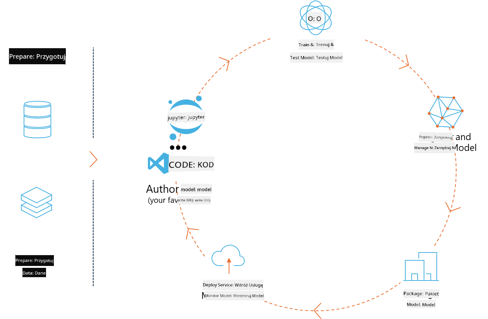
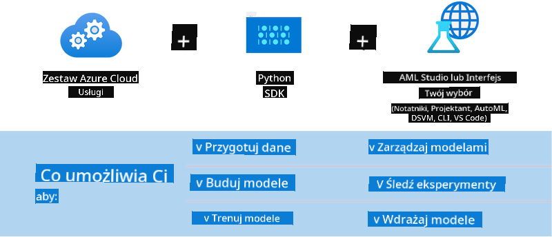

<!--
CO_OP_TRANSLATOR_METADATA:
{
  "original_hash": "f61c383bbf0c3dac97e43f833c258731",
  "translation_date": "2025-07-17T02:30:52+00:00",
  "source_file": "md/02.Application/01.TextAndChat/Phi3/E2E_Phi-3-MLflow.md",
  "language_code": "pl"
}
-->
# MLflow

[MLflow](https://mlflow.org/) to otwartoźródłowa platforma zaprojektowana do zarządzania pełnym cyklem życia uczenia maszynowego.



MLFlow służy do zarządzania cyklem życia ML, obejmującym eksperymentowanie, powtarzalność, wdrażanie oraz centralny rejestr modeli. Obecnie MLflow oferuje cztery komponenty.

- **MLflow Tracking:** Rejestruj i przeszukuj eksperymenty, kod, konfiguracje danych oraz wyniki.
- **MLflow Projects:** Pakuj kod data science w formacie umożliwiającym odtworzenie uruchomień na dowolnej platformie.
- **Mlflow Models:** Wdrażaj modele uczenia maszynowego w różnych środowiskach serwujących.
- **Model Registry:** Przechowuj, komentuj i zarządzaj modelami w centralnym repozytorium.

Platforma oferuje funkcje śledzenia eksperymentów, pakowania kodu w powtarzalne uruchomienia oraz udostępniania i wdrażania modeli. MLFlow jest zintegrowany z Databricks i wspiera różne biblioteki ML, dzięki czemu jest niezależny od konkretnej biblioteki. Można go używać z dowolną biblioteką uczenia maszynowego i w dowolnym języku programowania, ponieważ udostępnia REST API oraz CLI dla wygody.


Kluczowe cechy MLFlow to:

- **Śledzenie eksperymentów:** Rejestruj i porównuj parametry oraz wyniki.
- **Zarządzanie modelami:** Wdrażaj modele na różnych platformach serwujących i inferencyjnych.
- **Model Registry:** Współpracuj przy zarządzaniu cyklem życia modeli MLflow, w tym wersjonowanie i adnotacje.
- **Projects:** Pakuj kod ML do udostępniania lub produkcyjnego użytku.

MLFlow wspiera również pętlę MLOps, która obejmuje przygotowanie danych, rejestrację i zarządzanie modelami, pakowanie modeli do wykonania, wdrażanie usług oraz monitorowanie modeli. Celem jest uproszczenie przejścia od prototypu do produkcyjnego workflow, szczególnie w środowiskach chmurowych i edge.

## Scenariusz E2E – Budowa wrappera i użycie Phi-3 jako modelu MLFlow

W tym przykładzie E2E pokażemy dwa różne podejścia do budowy wrappera wokół małego modelu językowego Phi-3 (SLM), a następnie uruchomimy go jako model MLFlow lokalnie lub w chmurze, np. w Azure Machine Learning workspace.



| Projekt | Opis | Lokalizacja |
| ------------ | ----------- | -------- |
| Transformer Pipeline | Transformer Pipeline to najprostsza opcja budowy wrappera, jeśli chcesz użyć modelu HuggingFace z eksperymentalnym flavour transformerów MLFlow. | [**TransformerPipeline.ipynb**](../../../../../../code/06.E2E/E2E_Phi-3-MLflow_TransformerPipeline.ipynb) |
| Custom Python Wrapper | W momencie pisania, transformer pipeline nie wspierał generowania wrappera MLFlow dla modeli HuggingFace w formacie ONNX, nawet z eksperymentalnym pakietem optimum Python. W takich przypadkach możesz zbudować własny, niestandardowy wrapper Python dla trybu MLFlow. | [**CustomPythonWrapper.ipynb**](../../../../../../code/06.E2E/E2E_Phi-3-MLflow_CustomPythonWrapper.ipynb) |

## Projekt: Transformer Pipeline

1. Będziesz potrzebować odpowiednich pakietów Python z MLFlow i HuggingFace:

    ``` Python
    import mlflow
    import transformers
    ```

2. Następnie powinieneś zainicjować pipeline transformera, odwołując się do docelowego modelu Phi-3 w rejestrze HuggingFace. Jak widać z karty modelu _Phi-3-mini-4k-instruct_, jego zadanie to „Text Generation”:

    ``` Python
    pipeline = transformers.pipeline(
        task = "text-generation",
        model = "microsoft/Phi-3-mini-4k-instruct"
    )
    ```

3. Teraz możesz zapisać pipeline transformera modelu Phi-3 w formacie MLFlow i podać dodatkowe szczegóły, takie jak docelowa ścieżka artefaktów, specyficzne ustawienia konfiguracji modelu oraz typ API inferencyjnego:

    ``` Python
    model_info = mlflow.transformers.log_model(
        transformers_model = pipeline,
        artifact_path = "phi3-mlflow-model",
        model_config = model_config,
        task = "llm/v1/chat"
    )
    ```

## Projekt: Custom Python Wrapper

1. Tutaj możemy wykorzystać [ONNX Runtime generate() API](https://github.com/microsoft/onnxruntime-genai) Microsoftu do inferencji modelu ONNX oraz kodowania/dekodowania tokenów. Musisz wybrać pakiet _onnxruntime_genai_ dla docelowego środowiska obliczeniowego, w poniższym przykładzie skierowanym na CPU:

    ``` Python
    import mlflow
    from mlflow.models import infer_signature
    import onnxruntime_genai as og
    ```

1. Nasza niestandardowa klasa implementuje dwie metody: _load_context()_ do inicjalizacji **modelu ONNX** Phi-3 Mini 4K Instruct, **parametrów generatora** oraz **tokenizera**; oraz _predict()_ do generowania tokenów wyjściowych dla podanego promptu:

    ``` Python
    class Phi3Model(mlflow.pyfunc.PythonModel):
        def load_context(self, context):
            # Retrieving model from the artifacts
            model_path = context.artifacts["phi3-mini-onnx"]
            model_options = {
                 "max_length": 300,
                 "temperature": 0.2,         
            }
        
            # Defining the model
            self.phi3_model = og.Model(model_path)
            self.params = og.GeneratorParams(self.phi3_model)
            self.params.set_search_options(**model_options)
            
            # Defining the tokenizer
            self.tokenizer = og.Tokenizer(self.phi3_model)
    
        def predict(self, context, model_input):
            # Retrieving prompt from the input
            prompt = model_input["prompt"][0]
            self.params.input_ids = self.tokenizer.encode(prompt)
    
            # Generating the model's response
            response = self.phi3_model.generate(self.params)
    
            return self.tokenizer.decode(response[0][len(self.params.input_ids):])
    ```

1. Teraz możesz użyć funkcji _mlflow.pyfunc.log_model()_ do wygenerowania niestandardowego wrappera Python (w formacie pickle) dla modelu Phi-3, wraz z oryginalnym modelem ONNX i wymaganymi zależnościami:

    ``` Python
    model_info = mlflow.pyfunc.log_model(
        artifact_path = artifact_path,
        python_model = Phi3Model(),
        artifacts = {
            "phi3-mini-onnx": "cpu_and_mobile/cpu-int4-rtn-block-32-acc-level-4",
        },
        input_example = input_example,
        signature = infer_signature(input_example, ["Run"]),
        extra_pip_requirements = ["torch", "onnxruntime_genai", "numpy"],
    )
    ```

## Sygnatury wygenerowanych modeli MLFlow

1. W kroku 3 projektu Transformer Pipeline powyżej ustawiliśmy zadanie modelu MLFlow na „_llm/v1/chat_”. Taka instrukcja generuje wrapper API modelu, kompatybilny z OpenAI Chat API, jak pokazano poniżej:

    ``` Python
    {inputs: 
      ['messages': Array({content: string (required), name: string (optional), role: string (required)}) (required), 'temperature': double (optional), 'max_tokens': long (optional), 'stop': Array(string) (optional), 'n': long (optional), 'stream': boolean (optional)],
    outputs: 
      ['id': string (required), 'object': string (required), 'created': long (required), 'model': string (required), 'choices': Array({finish_reason: string (required), index: long (required), message: {content: string (required), name: string (optional), role: string (required)} (required)}) (required), 'usage': {completion_tokens: long (required), prompt_tokens: long (required), total_tokens: long (required)} (required)],
    params: 
      None}
    ```

1. W efekcie możesz przesłać swój prompt w następującym formacie:

    ``` Python
    messages = [{"role": "user", "content": "What is the capital of Spain?"}]
    ```

1. Następnie użyj kompatybilnego z OpenAI API post-processingu, np. _response[0][‘choices’][0][‘message’][‘content’]_, aby upiększyć wynik do czegoś takiego:

    ``` JSON
    Question: What is the capital of Spain?
    
    Answer: The capital of Spain is Madrid. It is the largest city in Spain and serves as the political, economic, and cultural center of the country. Madrid is located in the center of the Iberian Peninsula and is known for its rich history, art, and architecture, including the Royal Palace, the Prado Museum, and the Plaza Mayor.
    
    Usage: {'prompt_tokens': 11, 'completion_tokens': 73, 'total_tokens': 84}
    ```

1. W kroku 3 projektu Custom Python Wrapper powyżej pozwalamy pakietowi MLFlow wygenerować sygnaturę modelu na podstawie podanego przykładu wejściowego. Sygnatura naszego wrappera MLFlow będzie wyglądać tak:

    ``` Python
    {inputs: 
      ['prompt': string (required)],
    outputs: 
      [string (required)],
    params: 
      None}
    ```

1. Zatem nasz prompt musi zawierać klucz słownika "prompt", podobnie jak tutaj:

    ``` Python
    {"prompt": "<|system|>You are a stand-up comedian.<|end|><|user|>Tell me a joke about atom<|end|><|assistant|>",}
    ```

1. Wyjście modelu zostanie wtedy zwrócone w formacie tekstowym:

    ``` JSON
    Alright, here's a little atom-related joke for you!
    
    Why don't electrons ever play hide and seek with protons?
    
    Because good luck finding them when they're always "sharing" their electrons!
    
    Remember, this is all in good fun, and we're just having a little atomic-level humor!
    ```

**Zastrzeżenie**:  
Niniejszy dokument został przetłumaczony przy użyciu automatycznej usługi tłumaczeniowej AI [Co-op Translator](https://github.com/Azure/co-op-translator). Mimo że dokładamy starań, aby tłumaczenie było jak najbardziej precyzyjne, prosimy mieć na uwadze, że tłumaczenia automatyczne mogą zawierać błędy lub nieścisłości. Oryginalny dokument w języku źródłowym należy traktować jako źródło wiążące. W przypadku informacji o kluczowym znaczeniu zalecane jest skorzystanie z profesjonalnego tłumaczenia wykonanego przez człowieka. Nie ponosimy odpowiedzialności za jakiekolwiek nieporozumienia lub błędne interpretacje wynikające z korzystania z tego tłumaczenia.