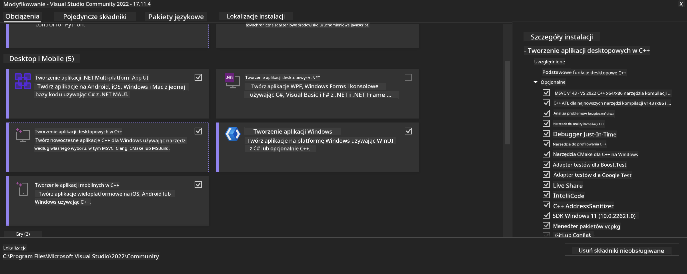
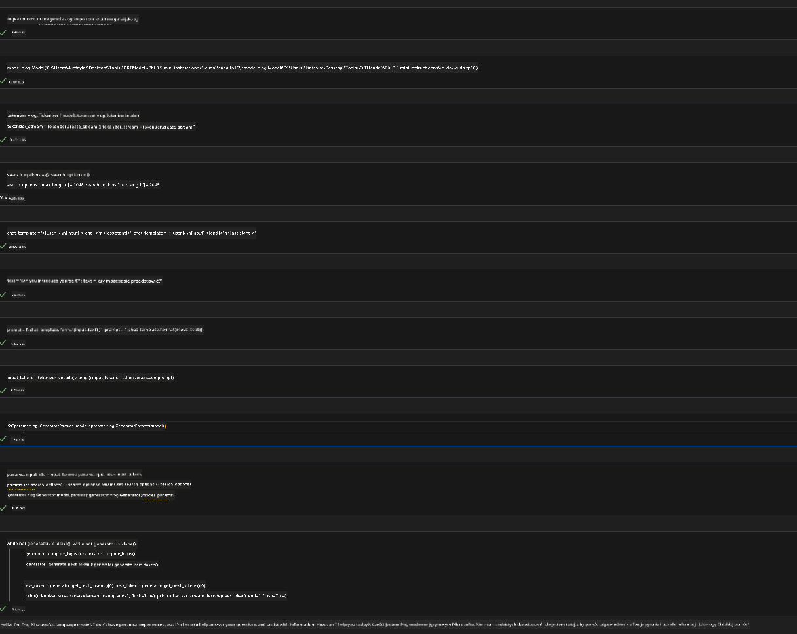

<!--
CO_OP_TRANSLATOR_METADATA:
{
  "original_hash": "b066fc29c1b2129df84e027cb75119ce",
  "translation_date": "2025-07-17T02:43:00+00:00",
  "source_file": "md/02.Application/01.TextAndChat/Phi3/ORTWindowGPUGuideline.md",
  "language_code": "pl"
}
-->
# **Wytyczne dotyczące OnnxRuntime GenAI Windows GPU**

Te wytyczne zawierają kroki dotyczące konfiguracji i korzystania z ONNX Runtime (ORT) z GPU na Windows. Mają na celu pomóc w wykorzystaniu akceleracji GPU dla Twoich modeli, poprawiając wydajność i efektywność.

Dokument zawiera wskazówki dotyczące:

- Konfiguracji środowiska: Instrukcje instalacji niezbędnych zależności, takich jak CUDA, cuDNN i ONNX Runtime.
- Konfiguracji: Jak skonfigurować środowisko i ONNX Runtime, aby efektywnie korzystać z zasobów GPU.
- Wskazówek optymalizacyjnych: Porady, jak dostroić ustawienia GPU dla optymalnej wydajności.

### **1. Python 3.10.x /3.11.8**

   ***Note*** Zalecamy użycie [miniforge](https://github.com/conda-forge/miniforge/releases/latest/download/Miniforge3-Windows-x86_64.exe) jako środowiska Pythona

   ```bash

   conda create -n pydev python==3.11.8

   conda activate pydev

   ```

   ***Reminder*** Jeśli masz zainstalowaną jakąkolwiek bibliotekę ONNX dla Pythona, proszę ją odinstalować

### **2. Instalacja CMake za pomocą winget**

   ```bash

   winget install -e --id Kitware.CMake

   ```

### **3. Instalacja Visual Studio 2022 - Desktop Development with C++**

   ***Note*** Jeśli nie chcesz kompilować, możesz pominąć ten krok



### **4. Instalacja sterownika NVIDIA**

1. **Sterownik NVIDIA GPU**  [https://www.nvidia.com/en-us/drivers/](https://www.nvidia.com/en-us/drivers/)

2. **NVIDIA CUDA 12.4** [https://developer.nvidia.com/cuda-12-4-0-download-archive](https://developer.nvidia.com/cuda-12-4-0-download-archive)

3. **NVIDIA CUDNN 9.4**  [https://developer.nvidia.com/cudnn-downloads](https://developer.nvidia.com/cudnn-downloads)

***Reminder*** Proszę korzystać z domyślnych ustawień podczas instalacji

### **5. Ustawienie środowiska NVIDIA**

Skopiuj pliki NVIDIA CUDNN 9.4 z folderów lib, bin, include do odpowiednich folderów NVIDIA CUDA 12.4

- skopiuj pliki z *'C:\Program Files\NVIDIA\CUDNN\v9.4\bin\12.6'* do  *'C:\Program Files\NVIDIA GPU Computing Toolkit\CUDA\v12.4\bin'*

- skopiuj pliki z *'C:\Program Files\NVIDIA\CUDNN\v9.4\include\12.6'* do  *'C:\Program Files\NVIDIA GPU Computing Toolkit\CUDA\v12.4\include'*

- skopiuj pliki z *'C:\Program Files\NVIDIA\CUDNN\v9.4\lib\12.6'* do  *'C:\Program Files\NVIDIA GPU Computing Toolkit\CUDA\v12.4\lib\x64'*

### **6. Pobierz Phi-3.5-mini-instruct-onnx**

   ```bash

   winget install -e --id Git.Git

   winget install -e --id GitHub.GitLFS

   git lfs install

   git clone https://huggingface.co/microsoft/Phi-3.5-mini-instruct-onnx

   ```

### **7. Uruchomienie InferencePhi35Instruct.ipynb**

   Otwórz [Notebook](../../../../../../code/09.UpdateSamples/Aug/ortgpu-phi35-instruct.ipynb) i wykonaj



### **8. Kompilacja ORT GenAI GPU**

   ***Note*** 
   
   1. Najpierw odinstaluj wszystkie pakiety związane z onnx, onnxruntime i onnxruntime-genai

   ```bash

   pip list 
   
   ```

   Następnie odinstaluj wszystkie biblioteki onnxruntime, np.

   ```bash

   pip uninstall onnxruntime

   pip uninstall onnxruntime-genai

   pip uninstall onnxruntume-genai-cuda
   
   ```

   2. Sprawdź wsparcie rozszerzenia Visual Studio

   Sprawdź folder C:\Program Files\NVIDIA GPU Computing Toolkit\CUDA\v12.4\extras, aby upewnić się, że znajduje się tam folder C:\Program Files\NVIDIA GPU Computing Toolkit\CUDA\v12.4\extras\visual_studio_integration. 
   
   Jeśli go nie ma, sprawdź inne foldery narzędzi Cuda i skopiuj folder visual_studio_integration wraz z zawartością do C:\Program Files\NVIDIA GPU Computing Toolkit\CUDA\v12.4\extras\visual_studio_integration

   - Jeśli nie chcesz kompilować, możesz pominąć ten krok

   ```bash

   git clone https://github.com/microsoft/onnxruntime-genai

   ```

   - Pobierz [https://github.com/microsoft/onnxruntime/releases/download/v1.19.2/onnxruntime-win-x64-gpu-1.19.2.zip](https://github.com/microsoft/onnxruntime/releases/download/v1.19.2/onnxruntime-win-x64-gpu-1.19.2.zip)

   - Rozpakuj onnxruntime-win-x64-gpu-1.19.2.zip, zmień nazwę folderu na **ort**, a następnie skopiuj folder ort do onnxruntime-genai

   - Używając Windows Terminal, przejdź do Developer Command Prompt for VS 2022 i przejdź do folderu onnxruntime-genai


   - Skompiluj go w swoim środowisku Pythona

   ```bash

   cd onnxruntime-genai

   python build.py --use_cuda  --cuda_home "C:\Program Files\NVIDIA GPU Computing Toolkit\CUDA\v12.4" --config Release
 

   cd build/Windows/Release/Wheel

   pip install .whl

   ```

**Zastrzeżenie**:  
Niniejszy dokument został przetłumaczony za pomocą usługi tłumaczenia AI [Co-op Translator](https://github.com/Azure/co-op-translator). Mimo że dążymy do jak największej dokładności, prosimy mieć na uwadze, że tłumaczenia automatyczne mogą zawierać błędy lub nieścisłości. Oryginalny dokument w języku źródłowym powinien być uznawany za źródło autorytatywne. W przypadku informacji o kluczowym znaczeniu zalecane jest skorzystanie z profesjonalnego tłumaczenia wykonanego przez człowieka. Nie ponosimy odpowiedzialności za jakiekolwiek nieporozumienia lub błędne interpretacje wynikające z korzystania z tego tłumaczenia.