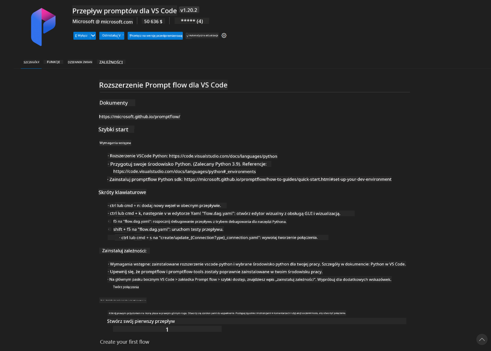
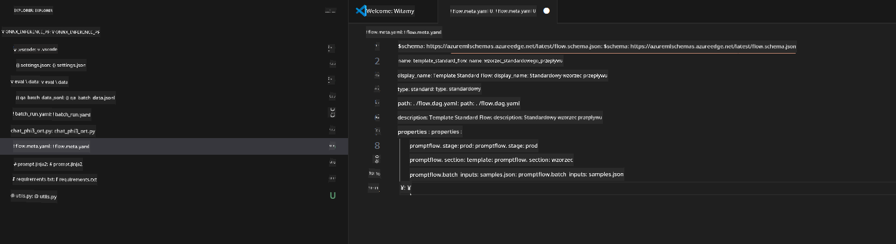
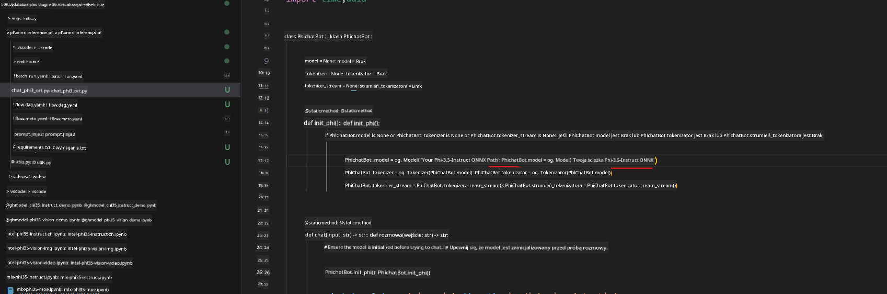
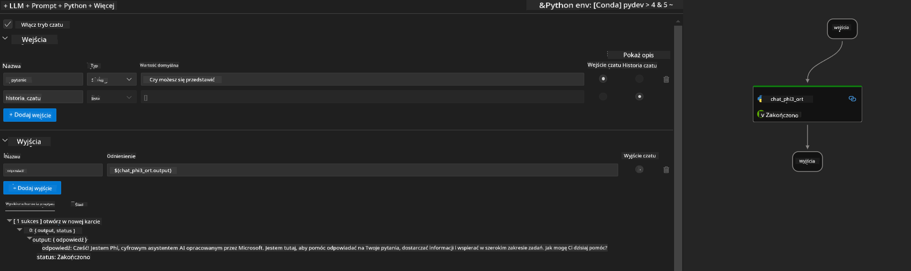
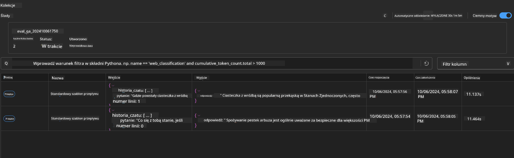

<!--
CO_OP_TRANSLATOR_METADATA:
{
  "original_hash": "92e7dac1e5af0dd7c94170fdaf6860fe",
  "translation_date": "2025-05-09T18:52:36+00:00",
  "source_file": "md/02.Application/01.TextAndChat/Phi3/UsingPromptFlowWithONNX.md",
  "language_code": "pl"
}
-->
# Korzystanie z Windows GPU do tworzenia rozwiązania Prompt flow z Phi-3.5-Instruct ONNX

Poniższy dokument jest przykładem, jak używać PromptFlow z ONNX (Open Neural Network Exchange) do tworzenia aplikacji AI opartych na modelach Phi-3.

PromptFlow to zestaw narzędzi deweloperskich zaprojektowany, aby usprawnić cały cykl tworzenia aplikacji AI opartych na LLM (Large Language Model), od pomysłu i prototypowania, przez testowanie, aż po ewaluację.

Integrując PromptFlow z ONNX, deweloperzy mogą:

- Optymalizować wydajność modelu: Wykorzystać ONNX do efektywnego wnioskowania i wdrażania modeli.
- Uprościć rozwój: Korzystać z PromptFlow do zarządzania przepływem pracy i automatyzacji powtarzalnych zadań.
- Zwiększyć współpracę: Ułatwić współpracę w zespole dzięki jednolitemu środowisku deweloperskiemu.

**Prompt flow** to zestaw narzędzi deweloperskich zaprojektowany, aby usprawnić cały cykl tworzenia aplikacji AI opartych na LLM, od pomysłu, prototypowania, testowania, ewaluacji, aż po wdrożenie produkcyjne i monitorowanie. Ułatwia inżynierię promptów i pozwala tworzyć aplikacje LLM o jakości produkcyjnej.

Prompt flow może łączyć się z OpenAI, Azure OpenAI Service oraz konfigurowalnymi modelami (Huggingface, lokalne LLM/SLM). Planujemy wdrożyć kwantyzowany model ONNX Phi-3.5 do lokalnych aplikacji. Prompt flow pomoże nam lepiej zaplanować biznes i zrealizować lokalne rozwiązania oparte na Phi-3.5. W tym przykładzie połączymy ONNX Runtime GenAI Library, aby stworzyć rozwiązanie Prompt flow oparte na Windows GPU.

## **Instalacja**

### **ONNX Runtime GenAI dla Windows GPU**

Przeczytaj ten przewodnik, aby skonfigurować ONNX Runtime GenAI dla Windows GPU [kliknij tutaj](./ORTWindowGPUGuideline.md)

### **Konfiguracja Prompt flow w VSCode**

1. Zainstaluj rozszerzenie Prompt flow dla VS Code



2. Po instalacji rozszerzenia Prompt flow w VS Code, kliknij rozszerzenie i wybierz **Installation dependencies**, aby zgodnie z tym przewodnikiem zainstalować SDK Prompt flow w swoim środowisku


3. Pobierz [Przykładowy kod](../../../../../../code/09.UpdateSamples/Aug/pf/onnx_inference_pf) i otwórz go w VS Code



4. Otwórz **flow.dag.yaml**, aby wybrać swoje środowisko Python


   Otwórz **chat_phi3_ort.py**, aby zmienić lokalizację modelu Phi-3.5-instruct ONNX



5. Uruchom swój prompt flow do testów

Otwórz **flow.dag.yaml** i kliknij edytor wizualny


Po kliknięciu uruchom go, aby przetestować



1. Możesz uruchomić batch w terminalu, aby sprawdzić więcej wyników


```bash

pf run create --file batch_run.yaml --stream --name 'Your eval qa name'    

```

Wyniki możesz sprawdzić w domyślnej przeglądarce




**Zastrzeżenie**:  
Niniejszy dokument został przetłumaczony za pomocą usługi tłumaczenia AI [Co-op Translator](https://github.com/Azure/co-op-translator). Mimo że dążymy do dokładności, prosimy pamiętać, że tłumaczenia automatyczne mogą zawierać błędy lub nieścisłości. Oryginalny dokument w języku źródłowym należy traktować jako źródło autorytatywne. W przypadku informacji krytycznych zalecane jest skorzystanie z profesjonalnego tłumaczenia wykonanego przez człowieka. Nie ponosimy odpowiedzialności za jakiekolwiek nieporozumienia lub błędne interpretacje wynikające z korzystania z tego tłumaczenia.