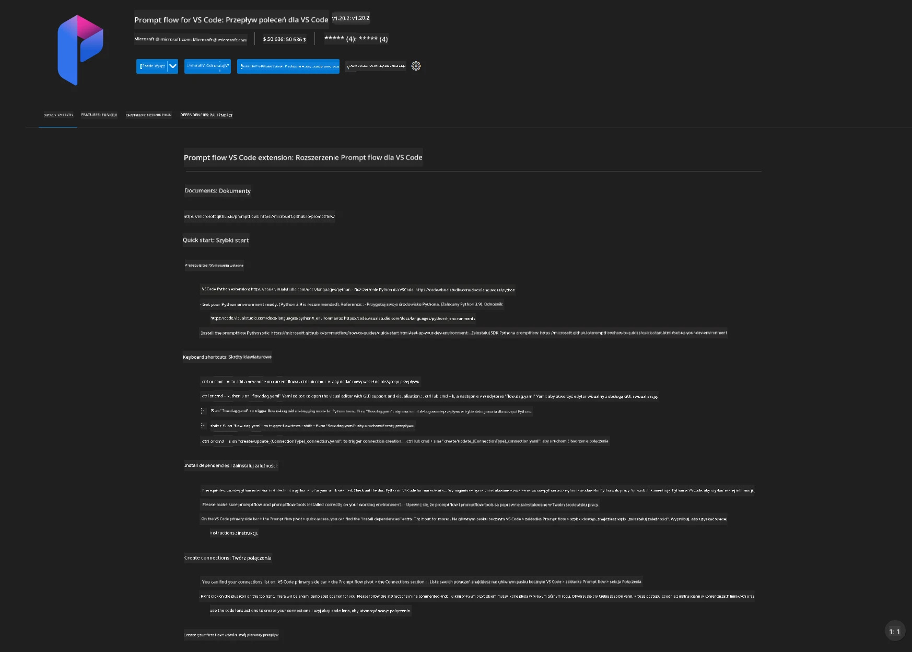
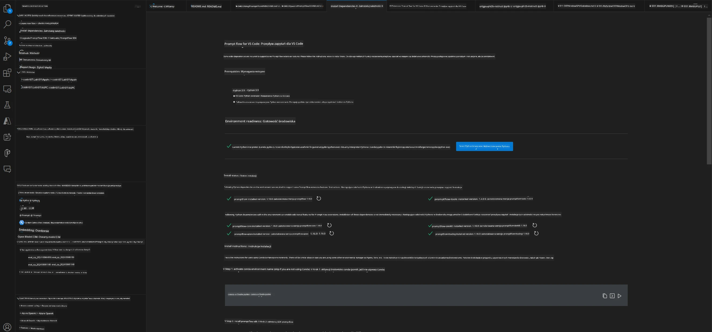
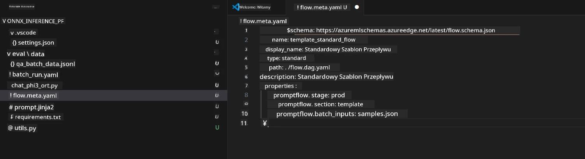
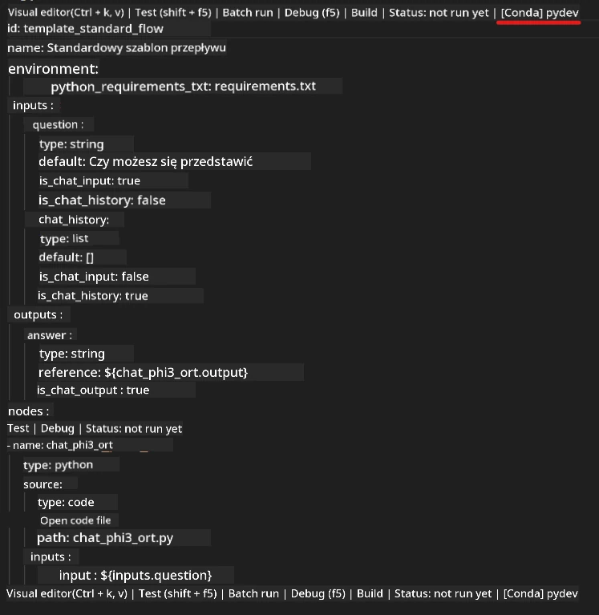
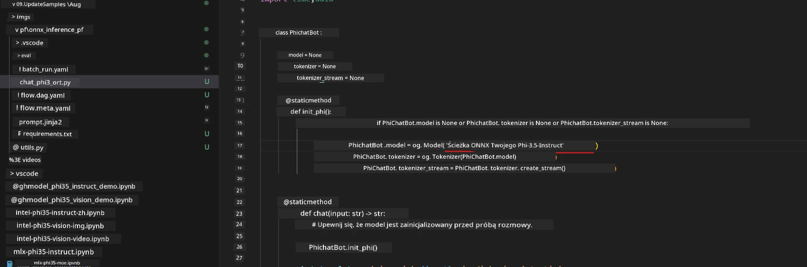
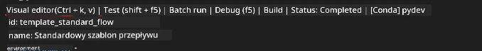
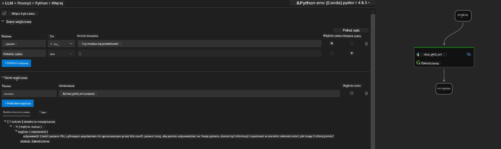
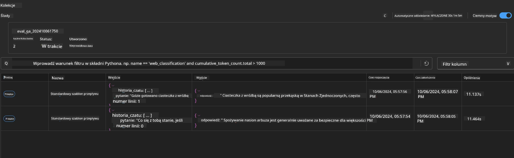

# Użycie Windows GPU do stworzenia rozwiązania Prompt flow z Phi-3.5-Instruct ONNX 

Niniejszy dokument jest przykładem, jak używać PromptFlow z ONNX (Open Neural Network Exchange) do tworzenia aplikacji AI opartych na modelach Phi-3.

PromptFlow to zestaw narzędzi deweloperskich zaprojektowanych, aby usprawnić cały cykl rozwoju aplikacji AI opartych na LLM (Large Language Model), od pomysłu i prototypowania po testowanie i ocenę.

Integrując PromptFlow z ONNX, deweloperzy mogą:

- Optymalizować wydajność modelu: Wykorzystać ONNX do efektywnego wykonywania i wdrażania modelu.
- Uprościć rozwój: Używać PromptFlow do zarządzania przepływem pracy i automatyzacji powtarzalnych zadań.
- Zwiększyć współpracę: Ułatwić współpracę między członkami zespołu, zapewniając zunifikowane środowisko deweloperskie.

**Prompt flow** to zestaw narzędzi deweloperskich zaprojektowanych, aby usprawnić cały cykl rozwoju aplikacji AI opartych na LLM, od ideacji, prototypowania, testowania, oceny po wdrożenie produkcyjne i monitorowanie. Ułatwia inżynierię promptów i pozwala na budowanie aplikacji LLM o jakości produkcyjnej.

Prompt flow może łączyć się z OpenAI, Azure OpenAI Service oraz modelami konfigurowalnymi (Huggingface, lokalne LLM/SLM). Planujemy wdrożyć skwantyzowany model ONNX Phi-3.5 do aplikacji lokalnych. Prompt flow pomoże nam lepiej zaplanować biznes i ukończyć rozwiązania lokalne oparte na Phi-3.5. W tym przykładzie połączymy ONNX Runtime GenAI Library, aby ukończyć rozwiązanie Prompt flow oparte na Windows GPU.

## **Instalacja**

### **ONNX Runtime GenAI dla Windows GPU**

Przeczytaj tę instrukcję, aby skonfigurować ONNX Runtime GenAI dla Windows GPU [kliknij tutaj](./ORTWindowGPUGuideline.md)

### **Konfiguracja Prompt flow w VSCode**

1. Zainstaluj rozszerzenie Prompt flow dla VS Code



2. Po zainstalowaniu rozszerzenia Prompt flow VS Code, kliknij rozszerzenie i wybierz **Installation dependencies**, postępuj zgodnie z tą instrukcją, aby zainstalować Prompt flow SDK w swoim środowisku



3. Pobierz [Sample Code](../../../../../../code/09.UpdateSamples/Aug/pf/onnx_inference_pf) i użyj VS Code, aby otworzyć ten przykład



4. Otwórz **flow.dag.yaml** i wybierz swoje środowisko Python



   Otwórz **chat_phi3_ort.py**, aby zmienić lokalizację modelu Phi-3.5-instruct ONNX



5. Uruchom swój prompt flow do testowania

Otwórz **flow.dag.yaml** i kliknij edytor wizualny



Po kliknięciu tego, uruchom go, aby przetestować



1. Możesz uruchomić batch w terminalu, aby sprawdzić więcej wyników


```bash

pf run create --file batch_run.yaml --stream --name 'Your eval qa name'    

```

Możesz sprawdzić wyniki w swojej domyślnej przeglądarce




---

<!-- CO-OP TRANSLATOR DISCLAIMER START -->
**Zastrzeżenie**:
Niniejszy dokument został przetłumaczony za pomocą usługi tłumaczenia AI [Co-op Translator](https://github.com/Azure/co-op-translator). Choć dążymy do dokładności, prosimy pamiętać, że automatyczne tłumaczenia mogą zawierać błędy lub niedokładności. Oryginalny dokument w jego języku źródłowym należy uznawać za autorytatywne źródło. W przypadku informacji krytycznych zalecane jest skorzystanie z profesjonalnego tłumaczenia wykonanego przez człowieka. Nie ponosimy odpowiedzialności za jakiekolwiek nieporozumienia lub błędne interpretacje wynikające z użycia tego tłumaczenia.
<!-- CO-OP TRANSLATOR DISCLAIMER END -->