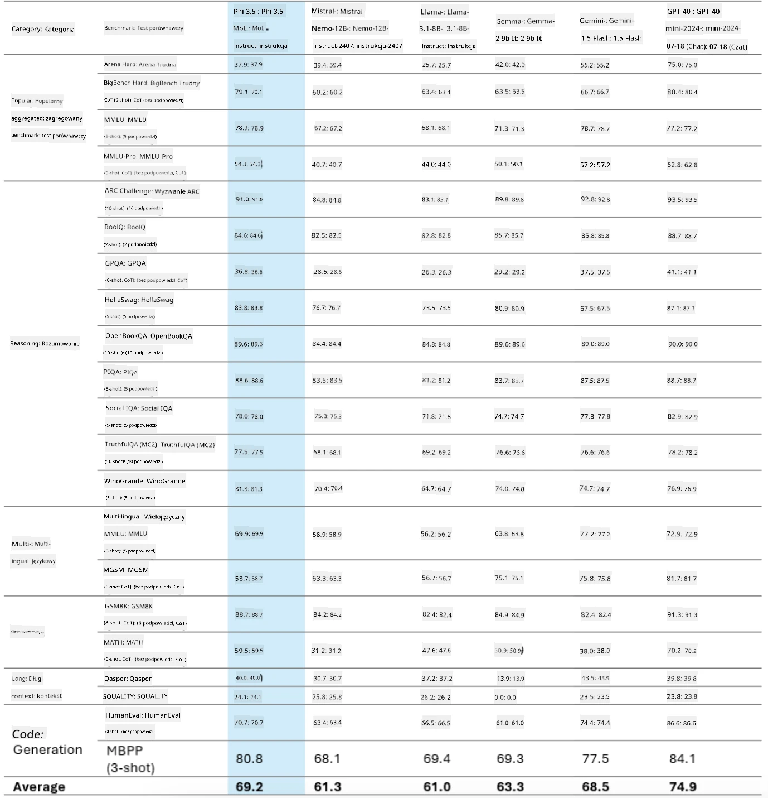
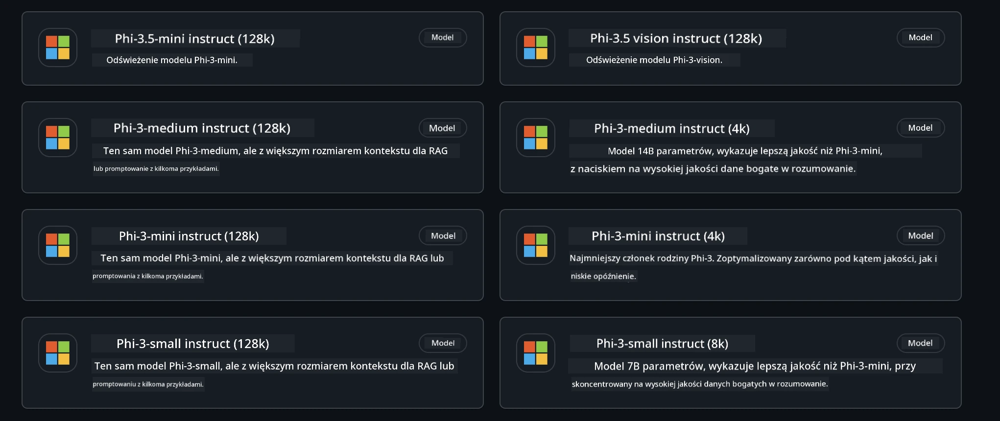
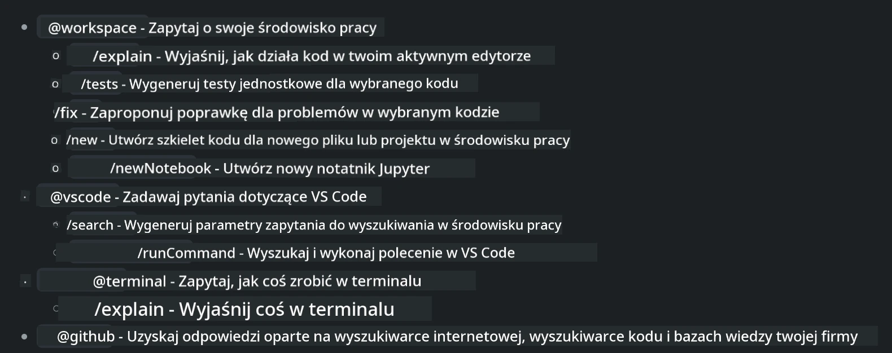
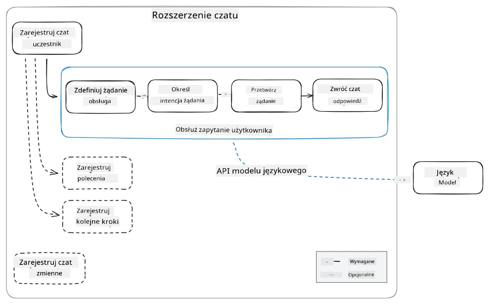
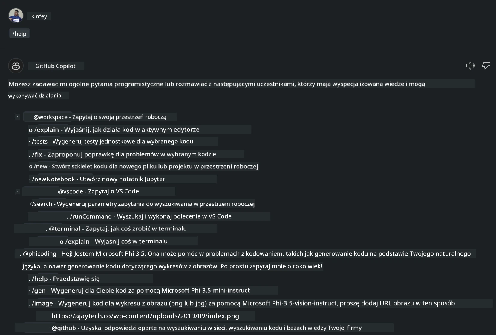
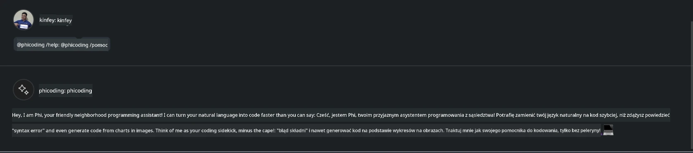
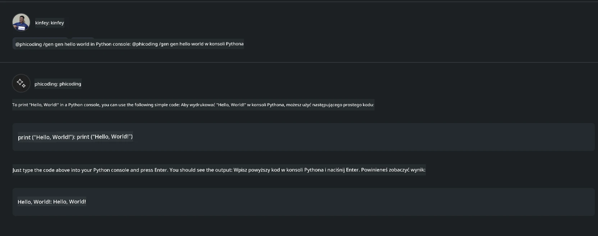
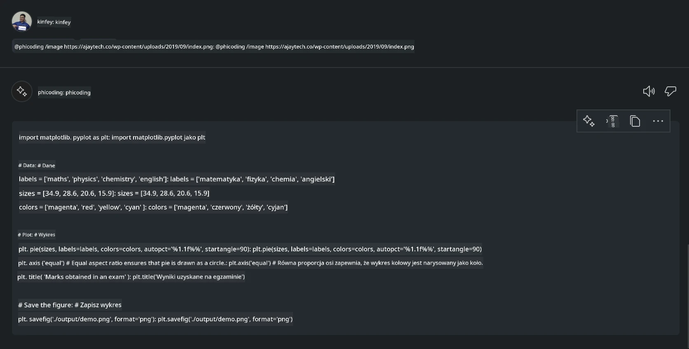

# **Stwórz własnego agenta Visual Studio Code Chat Copilot z Phi-3.5 od GitHub Models**

Czy korzystasz z Visual Studio Code Copilot? Szczególnie w Chat możesz używać różnych agentów, aby poprawić zdolność tworzenia, pisania i utrzymywania projektów w Visual Studio Code. Visual Studio Code udostępnia API, które pozwala firmom i osobom prywatnym tworzyć różne agenty oparte na ich działalności, aby rozszerzyć możliwości w różnych specjalistycznych dziedzinach. W tym artykule skupimy się na **Phi-3.5-mini-instruct (128k)** oraz **Phi-3.5-vision-instruct (128k)** z GitHub Models, aby stworzyć własnego agenta Visual Studio Code.

## **O Phi-3.5 na GitHub Models**

Wiemy, że Phi-3/3.5-mini-instruct z rodziny Phi-3/3.5 ma silne zdolności rozumienia i generowania kodu, i przewyższa Gemma-2-9b oraz Mistral-Nemo-12B-instruct-2407.



Najnowsze GitHub Models udostępniają już dostęp do modeli Phi-3.5-mini-instruct (128k) oraz Phi-3.5-vision-instruct (128k). Deweloperzy mogą korzystać z nich przez OpenAI SDK, Azure AI Inference SDK oraz REST API.



***Note:*** Zaleca się używanie tutaj Azure AI Inference SDK, ponieważ lepiej współpracuje z Azure Model Catalog w środowisku produkcyjnym.

Poniżej przedstawiono wyniki **Phi-3.5-mini-instruct (128k)** oraz **Phi-3.5-vision-instruct (128k)** w scenariuszu generowania kodu po integracji z GitHub Models, a także przygotowanie do poniższych przykładów.

**Demo: GitHub Models Phi-3.5-mini-instruct (128k) generuje kod na podstawie Prompt** ([kliknij ten link](../../../../../../code/09.UpdateSamples/Aug/ghmodel_phi35_instruct_demo.ipynb))

**Demo: GitHub Models Phi-3.5-vision-instruct (128k) generuje kod na podstawie obrazu** ([kliknij ten link](../../../../../../code/09.UpdateSamples/Aug/ghmodel_phi35_vision_demo.ipynb))


## **O agencie GitHub Copilot Chat**

Agent GitHub Copilot Chat może wykonywać różne zadania w różnych scenariuszach projektowych na podstawie kodu. System posiada cztery agenty: workspace, github, terminal, vscode.



Dodając nazwę agenta poprzedzoną ‘@’, możesz szybko wykonać odpowiadające mu zadanie. Dla firm, jeśli dodasz własne treści związane z biznesem, takie jak wymagania, kodowanie, specyfikacje testów i wydania, możesz uzyskać bardziej zaawansowane, prywatne funkcje firmowe oparte na GitHub Copilot.

Visual Studio Code Chat Agent oficjalnie udostępnił swoje API, pozwalając firmom lub deweloperom firmowym tworzyć agentów opartych na różnych ekosystemach oprogramowania biznesowego. Bazując na metodzie rozwoju rozszerzeń Visual Studio Code, możesz łatwo uzyskać dostęp do interfejsu API Visual Studio Code Chat Agent. Możemy rozwijać się w oparciu o ten proces.



Scenariusz rozwoju może obsługiwać dostęp do API modeli firm trzecich (takich jak GitHub Models, Azure Model Catalog oraz własne usługi oparte na modelach open source) oraz może korzystać z modeli gpt-35-turbo, gpt-4 i gpt-4o udostępnianych przez GitHub Copilot.

## **Dodaj agenta @phicoding opartego na Phi-3.5**

Próbujemy zintegrować możliwości programistyczne Phi-3.5, aby realizować pisanie kodu, generowanie kodu na podstawie obrazu i inne zadania. Stwórz agenta opartego na Phi-3.5 - @PHI, oto niektóre funkcje:

1. Generowanie autoprezentacji opartej na GPT-4o udostępnianej przez GitHub Copilot za pomocą polecenia **@phicoding /help**

2. Generowanie kodu dla różnych języków programowania na podstawie **Phi-3.5-mini-instruct (128k)** za pomocą polecenia **@phicoding /gen**

3. Generowanie kodu na podstawie **Phi-3.5-vision-instruct (128k)** oraz uzupełnianie obrazów za pomocą polecenia **@phicoding /image**


## **Powiązane kroki**

1. Zainstaluj wsparcie dla rozwoju rozszerzeń Visual Studio Code za pomocą npm

```bash

npm install --global yo generator-code 

```
2. Utwórz wtyczkę rozszerzenia Visual Studio Code (w trybie rozwoju Typescript, nazwaną phiext)

```bash

yo code 

```

3. Otwórz utworzony projekt i zmodyfikuj package.json. Poniżej znajdują się powiązane instrukcje i konfiguracje, a także konfiguracja GitHub Models. Pamiętaj, aby dodać tutaj swój token GitHub Models.

```json

{
  "name": "phiext",
  "displayName": "phiext",
  "description": "",
  "version": "0.0.1",
  "engines": {
    "vscode": "^1.93.0"
  },
  "categories": [
    "AI",
    "Chat"
  ],
  "activationEvents": [],
  "enabledApiProposals": [
      "chatVariableResolver"
  ],
  "main": "./dist/extension.js",
  "contributes": {
    "chatParticipants": [
        {
            "id": "chat.phicoding",
            "name": "phicoding",
            "description": "Hey! I am Microsoft Phi-3.5, She can help me with coding problems, such as generation code with your natural language, or even generation code about chart from images. Just ask me anything!",
            "isSticky": true,
            "commands": [
                {
                    "name": "help",
                    "description": "Introduce myself to you"
                },
                {
                    "name": "gen",
                    "description": "Generate code for you with Microsoft Phi-3.5-mini-instruct"
                },
                {
                    "name": "image",
                    "description": "Generate code for chart from image(png or jpg) with Microsoft Phi-3.5-vision-instruct, please add image url like this : https://ajaytech.co/wp-content/uploads/2019/09/index.png"
                }
            ]
        }
    ],
    "commands": [
        {
            "command": "phicoding.namesInEditor",
            "title": "Use Microsoft Phi 3.5 in Editor"
        }
    ],
    "configuration": {
      "type": "object",
      "title": "githubmodels",
      "properties": {
        "githubmodels.endpoint": {
          "type": "string",
          "default": "https://models.inference.ai.azure.com",
          "description": "Your GitHub Models Endpoint",
          "order": 0
        },
        "githubmodels.api_key": {
          "type": "string",
          "default": "Your GitHub Models Token",
          "description": "Your GitHub Models Token",
          "order": 1
        },
        "githubmodels.phi35instruct": {
          "type": "string",
          "default": "Phi-3.5-mini-instruct",
          "description": "Your Phi-35-Instruct Model",
          "order": 2
        },
        "githubmodels.phi35vision": {
          "type": "string",
          "default": "Phi-3.5-vision-instruct",
          "description": "Your Phi-35-Vision Model",
          "order": 3
        }
      }
    }
  },
  "scripts": {
    "vscode:prepublish": "npm run package",
    "compile": "webpack",
    "watch": "webpack --watch",
    "package": "webpack --mode production --devtool hidden-source-map",
    "compile-tests": "tsc -p . --outDir out",
    "watch-tests": "tsc -p . -w --outDir out",
    "pretest": "npm run compile-tests && npm run compile && npm run lint",
    "lint": "eslint src",
    "test": "vscode-test"
  },
  "devDependencies": {
    "@types/vscode": "^1.93.0",
    "@types/mocha": "^10.0.7",
    "@types/node": "20.x",
    "@typescript-eslint/eslint-plugin": "^8.3.0",
    "@typescript-eslint/parser": "^8.3.0",
    "eslint": "^9.9.1",
    "typescript": "^5.5.4",
    "ts-loader": "^9.5.1",
    "webpack": "^5.94.0",
    "webpack-cli": "^5.1.4",
    "@vscode/test-cli": "^0.0.10",
    "@vscode/test-electron": "^2.4.1"
  },
  "dependencies": {
    "@types/node-fetch": "^2.6.11",
    "node-fetch": "^3.3.2",
    "@azure-rest/ai-inference": "latest",
    "@azure/core-auth": "latest",
    "@azure/core-sse": "latest"
  }
}


```

4. Zmodyfikuj plik src/extension.ts

```typescript

// The module 'vscode' contains the VS Code extensibility API
// Import the module and reference it with the alias vscode in your code below
import * as vscode from 'vscode';
import ModelClient from "@azure-rest/ai-inference";
import { AzureKeyCredential } from "@azure/core-auth";


interface IPhiChatResult extends vscode.ChatResult {
    metadata: {
        command: string;
    };
}


const MODEL_SELECTOR: vscode.LanguageModelChatSelector = { vendor: 'copilot', family: 'gpt-4o' };

function isValidImageUrl(url: string): boolean {
    const regex = /^(https?:\/\/.*\.(?:png|jpg))$/i;
    return regex.test(url);
}
  

// This method is called when your extension is activated
// Your extension is activated the very first time the command is executed
export function activate(context: vscode.ExtensionContext) {

    const codinghandler: vscode.ChatRequestHandler = async (request: vscode.ChatRequest, context: vscode.ChatContext, stream: vscode.ChatResponseStream, token: vscode.CancellationToken): Promise<IPhiChatResult> => {


        const config : any = vscode.workspace.getConfiguration('githubmodels');
        const endPoint: string = config.get('endpoint');
        const apiKey: string = config.get('api_key');
        const phi35instruct: string = config.get('phi35instruct');
        const phi35vision: string = config.get('phi35vision');
        
        if (request.command === 'help') {

            const content = "Welcome to Coding assistant with Microsoft Phi-3.5"; 
            stream.progress(content);


            try {
                const [model] = await vscode.lm.selectChatModels(MODEL_SELECTOR);
                if (model) {
                    const messages = [
                        vscode.LanguageModelChatMessage.User("Please help me express this content in a humorous way: I am a programming assistant who can help you convert natural language into code and generate code based on the charts in the images. output format like this : Hey I am Phi ......")
                    ];
                    const chatResponse = await model.sendRequest(messages, {}, token);
                    for await (const fragment of chatResponse.text) {
                        stream.markdown(fragment);
                    }
                }
            } catch(err) {
                console.log(err);
            }


            return { metadata: { command: 'help' } };

        }

        
        if (request.command === 'gen') {

            const content = "Welcome to use phi-3.5 to generate code";

            stream.progress(content);

            const client = new ModelClient(endPoint, new AzureKeyCredential(apiKey));

            const response = await client.path("/chat/completions").post({
              body: {
                messages: [
                  { role:"system", content: "You are a coding assistant.Help answer all code generation questions." },
                  { role:"user", content: request.prompt }
                ],
                model: phi35instruct,
                temperature: 0.4,
                max_tokens: 1000,
                top_p: 1.
              }
            });

            stream.markdown(response.body.choices[0].message.content);

            return { metadata: { command: 'gen' } };

        }


        
        if (request.command === 'image') {


            const content = "Welcome to use phi-3.5 to generate code from image(png or jpg),image url like this:https://ajaytech.co/wp-content/uploads/2019/09/index.png";

            stream.progress(content);

            if (!isValidImageUrl(request.prompt)) {
                stream.markdown('Please provide a valid image URL');
                return { metadata: { command: 'image' } };
            }
            else
            {

                const client = new ModelClient(endPoint, new AzureKeyCredential(apiKey));
    
                const response = await client.path("/chat/completions").post({
                    body: {
                      messages: [
                        { role: "system", content: "You are a helpful assistant that describes images in details." },
                        { role: "user", content: [
                            { type: "text", text: "Please generate code according to the chart in the picture according to the following requirements\n1. Keep all information in the chart, including data and text\n2. Do not generate additional information that is not included in the chart\n3. Please extract data from the picture, do not generate it from csv\n4. Please save the regenerated chart as a chart and save it to ./output/demo.png"},
                            { type: "image_url", image_url: {url: request.prompt}
                            }
                          ]
                        }
                      ],
                      model: phi35vision,
                      temperature: 0.4,
                      max_tokens: 2048,
                      top_p: 1.
                    }
                  });
    
                
                stream.markdown(response.body.choices[0].message.content);
    
                return { metadata: { command: 'image' } };
            }


        }


        return { metadata: { command: '' } };
    };


    const phi_ext = vscode.chat.createChatParticipant("chat.phicoding", codinghandler);

    phi_ext.iconPath = new vscode.ThemeIcon('sparkle');


    phi_ext.followupProvider = {
        provideFollowups(result: IPhiChatResult, context: vscode.ChatContext, token: vscode.CancellationToken) {
            return [{
                prompt: 'Let us coding with Phi-3.5 😋😋😋😋',
                label: vscode.l10n.t('Enjoy coding with Phi-3.5'),
                command: 'help'
            } satisfies vscode.ChatFollowup];
        }
    };

    context.subscriptions.push(phi_ext);
}

// This method is called when your extension is deactivated
export function deactivate() {}


```

6. Uruchomienie

***/help***



***@phicoding /help***



***@phicoding /gen***



***@phicoding /image***



Możesz pobrać przykładowy kod: [kliknij](../../../../../../code/09.UpdateSamples/Aug/vscode)

## **Zasoby**

1. Zarejestruj się w GitHub Models [https://gh.io/models](https://gh.io/models)

2. Naucz się tworzenia rozszerzeń Visual Studio Code [https://code.visualstudio.com/api/get-started/your-first-extension](https://code.visualstudio.com/api/get-started/your-first-extension)

3. Poznaj Visual Studio Code Copilot Chat API [https://code.visualstudio.com/api/extension-guides/chat](https://code.visualstudio.com/api/extension-guides/chat)

**Zastrzeżenie**:  
Niniejszy dokument został przetłumaczony za pomocą usługi tłumaczenia AI [Co-op Translator](https://github.com/Azure/co-op-translator). Mimo że dążymy do dokładności, prosimy mieć na uwadze, że automatyczne tłumaczenia mogą zawierać błędy lub nieścisłości. Oryginalny dokument w języku źródłowym powinien być uznawany za źródło autorytatywne. W przypadku informacji o kluczowym znaczeniu zalecane jest skorzystanie z profesjonalnego tłumaczenia wykonanego przez człowieka. Nie ponosimy odpowiedzialności za jakiekolwiek nieporozumienia lub błędne interpretacje wynikające z korzystania z tego tłumaczenia.