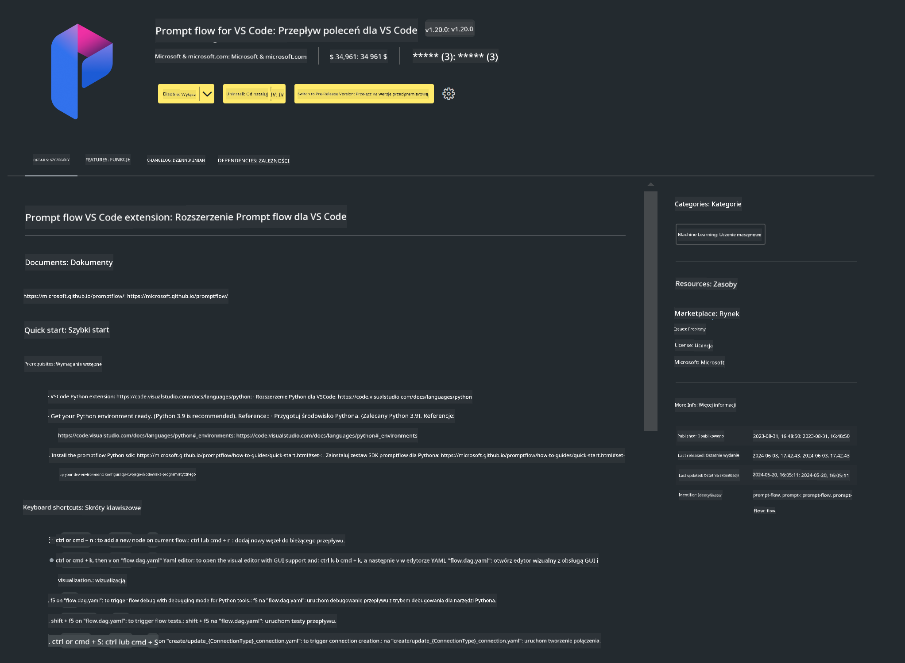

<!--
CO_OP_TRANSLATOR_METADATA:
{
  "original_hash": "a4ef39027902e82f2c33d568d2a2259a",
  "translation_date": "2025-05-09T19:19:20+00:00",
  "source_file": "md/02.Application/02.Code/Phi3/VSCodeExt/HOL/AIPC/01.Installations.md",
  "language_code": "pl"
}
-->
# **Lab 0 - Instalacja**

Po wejściu do laboratorium musimy skonfigurować odpowiednie środowisko:


### **1. Python 3.11+**

Zaleca się użycie miniforge do skonfigurowania środowiska Pythona

Aby skonfigurować miniforge, proszę odnieść się do [https://github.com/conda-forge/miniforge](https://github.com/conda-forge/miniforge)

Po skonfigurowaniu miniforge, uruchom następujące polecenie w Power Shell

```bash

conda create -n pyenv python==3.11.8 -y

conda activate pyenv

```


### **2. Instalacja Prompt flow SDK**

W Laboratorium 1 używamy Prompt flow, więc musisz skonfigurować Prompt flow SDK.

```bash

pip install promptflow --upgrade

```

Możesz sprawdzić promptflow sdk za pomocą tego polecenia


```bash

pf --version

```

### **3. Instalacja rozszerzenia Prompt flow do Visual Studio Code**




### **4. Intel NPU Acceleration Library**

Nowej generacji procesory Intela wspierają NPU. Jeśli chcesz użyć NPU do lokalnego uruchamiania LLM / SLM, możesz skorzystać z ***Intel NPU Acceleration Library***. Jeśli chcesz dowiedzieć się więcej, możesz przeczytać [https://github.com/microsoft/PhiCookBook/blob/main/md/01.Introduction/03/AIPC_Inference.md](https://github.com/microsoft/PhiCookBook/blob/main/md/01.Introduction/03/AIPC_Inference.md).

Zainstaluj Intel NPU Acceleration Library w bash


```bash

pip install intel-npu-acceleration-library

```

***Note***: Zwróć uwagę, że ta biblioteka obsługuje transformers w wersji ***4.40.2***, proszę potwierdź wersję


### **5. Inne biblioteki Pythona**


utwórz plik requirements.txt i dodaj tę zawartość

```txt

notebook
numpy 
scipy 
scikit-learn 
matplotlib 
pandas 
pillow 
graphviz

```


### **6. Instalacja NVM**

zainstaluj nvm w Powershell 


```bash

winget install -e --id CoreyButler.NVMforWindows

```

zainstaluj nodejs 18.20


```bash

nvm install 18.20.0

nvm use 18.20.0

```

### **7. Instalacja wsparcia dla Visual Studio Code do programowania**


```bash

npm install --global yo generator-code

```

Gratulacje! Pomyślnie skonfigurowałeś SDK. Teraz przejdź do praktycznych kroków.

**Zastrzeżenie**:  
Niniejszy dokument został przetłumaczony za pomocą usługi tłumaczenia AI [Co-op Translator](https://github.com/Azure/co-op-translator). Mimo że dokładamy starań, aby tłumaczenie było jak najdokładniejsze, prosimy pamiętać, że automatyczne tłumaczenia mogą zawierać błędy lub nieścisłości. Oryginalny dokument w języku źródłowym powinien być traktowany jako źródło autorytatywne. W przypadku informacji krytycznych zalecane jest skorzystanie z profesjonalnego tłumaczenia wykonanego przez człowieka. Nie ponosimy odpowiedzialności za jakiekolwiek nieporozumienia lub błędne interpretacje wynikające z korzystania z tego tłumaczenia.