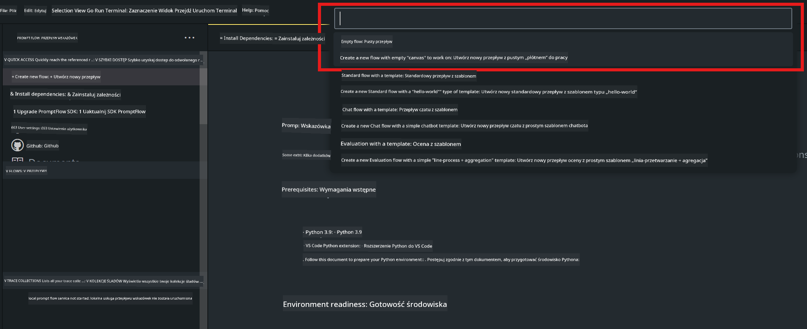

<!--
CO_OP_TRANSLATOR_METADATA:
{
  "original_hash": "bc29f7fe7fc16bed6932733eac8c81b8",
  "translation_date": "2025-05-09T19:23:11+00:00",
  "source_file": "md/02.Application/02.Code/Phi3/VSCodeExt/HOL/AIPC/02.PromptflowWithNPU.md",
  "language_code": "pl"
}
-->
# **Lab 2 - Uruchamianie Prompt flow z Phi-3-mini w AIPC**

## **Czym jest Prompt flow**

Prompt flow to zestaw narzędzi deweloperskich zaprojektowanych, aby usprawnić cały cykl rozwoju aplikacji AI opartych na LLM, od pomysłu, prototypowania, testowania, oceny aż po wdrożenie produkcyjne i monitorowanie. Ułatwia tworzenie promptów i pozwala budować aplikacje LLM o jakości produkcyjnej.

Dzięki prompt flow możesz:

- Tworzyć przepływy łączące LLM, prompt, kod Python i inne narzędzia w wykonalny workflow.

- Debugować i iterować swoje przepływy, szczególnie interakcję z LLM, z łatwością.

- Ocenić swoje przepływy, obliczać metryki jakości i wydajności na większych zbiorach danych.

- Zintegrować testowanie i ocenę z systemem CI/CD, aby zapewnić jakość przepływu.

- Wdrożyć swoje przepływy na wybranej platformie serwisowej lub łatwo zintegrować je z kodem aplikacji.

- (Opcjonalnie, ale wysoce zalecane) Współpracować z zespołem, korzystając z wersji chmurowej Prompt flow w Azure AI.

## **Czym jest AIPC**

AI PC ma CPU, GPU oraz NPU, z których każdy oferuje specyficzne możliwości przyspieszenia AI. NPU, czyli neural processing unit, to specjalizowany akcelerator obsługujący zadania sztucznej inteligencji (AI) i uczenia maszynowego (ML) bezpośrednio na Twoim komputerze, zamiast wysyłać dane do przetworzenia w chmurze. GPU i CPU również mogą przetwarzać te zadania, ale NPU jest szczególnie efektywny przy niskim zużyciu energii dla obliczeń AI. AI PC to zasadnicza zmiana w sposobie działania naszych komputerów. Nie jest to rozwiązanie problemu, który wcześniej nie istniał, lecz znacząca poprawa codziennego użytkowania PC.

Jak to działa? W porównaniu do generatywnej AI i ogromnych modeli językowych (LLM) trenowanych na ogromnych publicznych danych, AI działające na Twoim PC jest bardziej dostępne na wielu poziomach. Koncepcja jest łatwiejsza do zrozumienia, a ponieważ model jest trenowany na Twoich danych i nie wymaga dostępu do chmury, korzyści są od razu atrakcyjne dla szerszej grupy użytkowników.

W najbliższej przyszłości świat AI PC to asystenci osobowi i mniejsze modele AI działające bezpośrednio na Twoim komputerze, wykorzystujące Twoje dane, by oferować osobiste, prywatne i bezpieczniejsze usprawnienia AI do codziennych czynności – sporządzanie notatek ze spotkań, organizowanie ligi fantasy football, automatyzacja ulepszeń do edycji zdjęć i wideo czy tworzenie idealnego planu rodzinnego spotkania na podstawie godzin przyjazdu i odjazdu wszystkich uczestników.

## **Tworzenie przepływów generacji kodu na AIPC**

***Note*** ：Jeśli nie ukończyłeś instalacji środowiska, odwiedź [Lab 0 -Installations](./01.Installations.md)

1. Otwórz rozszerzenie Prompt flow w Visual Studio Code i utwórz pusty projekt przepływu



2. Dodaj parametry Inputs i Outputs oraz dodaj kod Python jako nowy przepływ


Możesz odwołać się do tej struktury (flow.dag.yaml) przy tworzeniu przepływu

```yaml

inputs:
  question:
    type: string
    default: how to write Bubble Algorithm
outputs:
  answer:
    type: string
    reference: ${Chat_With_Phi3.output}
nodes:
- name: Chat_With_Phi3
  type: python
  source:
    type: code
    path: Chat_With_Phi3.py
  inputs:
    question: ${inputs.question}


```

3. Dodaj kod w ***Chat_With_Phi3.py***

```python


from promptflow.core import tool

# import torch
from transformers import AutoTokenizer, pipeline,TextStreamer
import intel_npu_acceleration_library as npu_lib

import warnings

import asyncio
import platform

class Phi3CodeAgent:
    
    model = None
    tokenizer = None
    text_streamer = None
    
    model_id = "microsoft/Phi-3-mini-4k-instruct"

    @staticmethod
    def init_phi3():
        
        if Phi3CodeAgent.model is None or Phi3CodeAgent.tokenizer is None or Phi3CodeAgent.text_streamer is None:
            Phi3CodeAgent.model = npu_lib.NPUModelForCausalLM.from_pretrained(
                                    Phi3CodeAgent.model_id,
                                    torch_dtype="auto",
                                    dtype=npu_lib.int4,
                                    trust_remote_code=True
                                )
            Phi3CodeAgent.tokenizer = AutoTokenizer.from_pretrained(Phi3CodeAgent.model_id)
            Phi3CodeAgent.text_streamer = TextStreamer(Phi3CodeAgent.tokenizer, skip_prompt=True)

    

    @staticmethod
    def chat_with_phi3(prompt):
        
        Phi3CodeAgent.init_phi3()

        messages = "<|system|>You are a AI Python coding assistant. Please help me to generate code in Python.The answer only genertated Python code, but any comments and instructions do not need to be generated<|end|><|user|>" + prompt +"<|end|><|assistant|>"


        generation_args = {
            "max_new_tokens": 1024,
            "return_full_text": False,
            "temperature": 0.3,
            "do_sample": False,
            "streamer": Phi3CodeAgent.text_streamer,
        }

        pipe = pipeline(
            "text-generation",
            model=Phi3CodeAgent.model,
            tokenizer=Phi3CodeAgent.tokenizer,
            # **generation_args
        )

        result = ''

        with warnings.catch_warnings():
            warnings.simplefilter("ignore")
            response = pipe(messages, **generation_args)
            result =response[0]['generated_text']
            return result


@tool
def my_python_tool(question: str) -> str:
    if platform.system() == 'Windows':
        asyncio.set_event_loop_policy(asyncio.WindowsSelectorEventLoopPolicy())
    return Phi3CodeAgent.chat_with_phi3(question)


```

4. Możesz przetestować przepływ korzystając z Debug lub Run, aby sprawdzić, czy generowanie kodu działa poprawnie


5. Uruchom przepływ jako API developerskie w terminalu

```

pf flow serve --source ./ --port 8080 --host localhost   

```

Możesz przetestować go w Postman / Thunder Client

### **Note**

1. Pierwsze uruchomienie zajmuje dużo czasu. Zaleca się pobranie modelu phi-3 za pomocą Hugging face CLI.

2. Ze względu na ograniczoną moc obliczeniową Intel NPU, zaleca się używanie Phi-3-mini-4k-instruct

3. Używamy Intel NPU Acceleration do kwantyzacji konwersji INT4, ale jeśli ponownie uruchomisz usługę, musisz usunąć foldery cache i nc_workshop.

## **Zasoby**

1. Learn Promptflow [https://microsoft.github.io/promptflow/](https://microsoft.github.io/promptflow/)

2. Learn Intel NPU Acceleration [https://github.com/intel/intel-npu-acceleration-library](https://github.com/intel/intel-npu-acceleration-library)

3. Sample Code, download [Local NPU Agent Sample Code](../../../../../../../../../code/07.Lab/01/AIPC)

**Zastrzeżenie**:  
Niniejszy dokument został przetłumaczony przy użyciu usługi tłumaczenia AI [Co-op Translator](https://github.com/Azure/co-op-translator). Chociaż dokładamy starań, aby tłumaczenie było jak najbardziej precyzyjne, prosimy mieć na uwadze, że automatyczne tłumaczenia mogą zawierać błędy lub nieścisłości. Oryginalny dokument w języku źródłowym należy traktować jako źródło wiążące. W przypadku informacji o kluczowym znaczeniu zalecane jest skorzystanie z profesjonalnego tłumaczenia wykonanego przez człowieka. Nie ponosimy odpowiedzialności za jakiekolwiek nieporozumienia lub błędne interpretacje wynikające z korzystania z tego tłumaczenia.