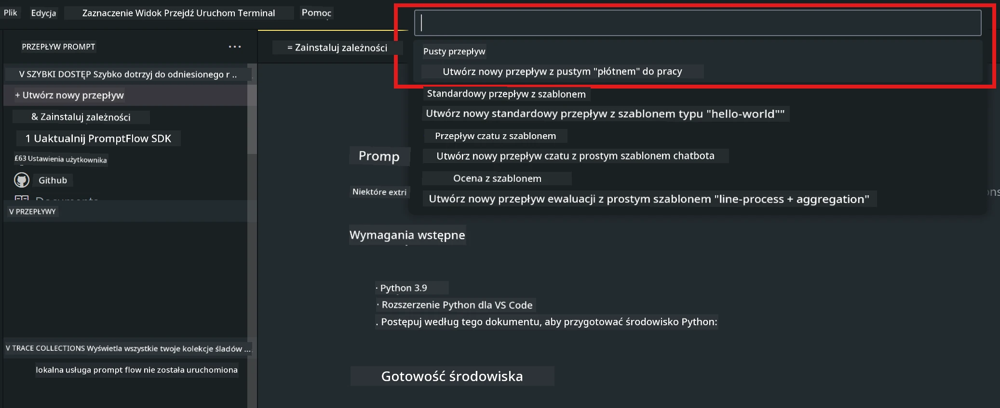
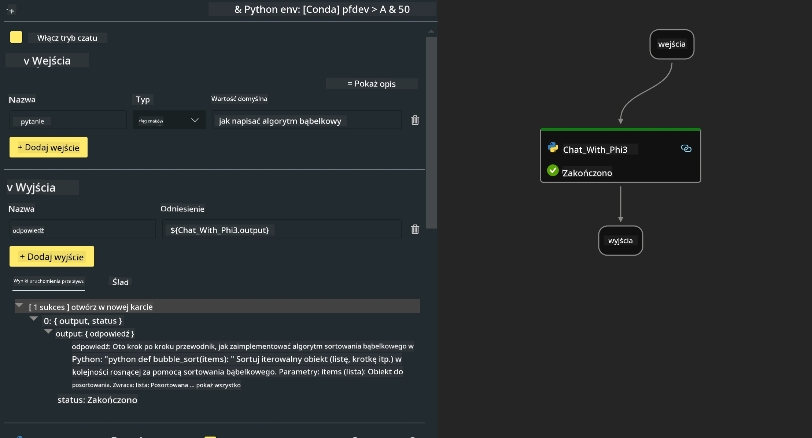
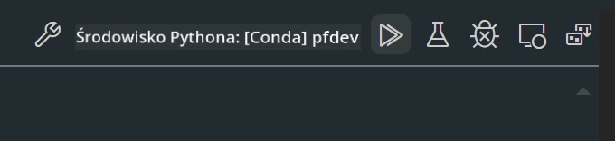

<!--
CO_OP_TRANSLATOR_METADATA:
{
  "original_hash": "3dbbf568625b1ee04b354c2dc81d3248",
  "translation_date": "2025-07-17T04:25:40+00:00",
  "source_file": "md/02.Application/02.Code/Phi3/VSCodeExt/HOL/Apple/02.PromptflowWithMLX.md",
  "language_code": "pl"
}
-->
# **Lab 2 - Uruchom Prompt flow z Phi-3-mini w AIPC**

## **Czym jest Prompt flow**

Prompt flow to zestaw narzędzi deweloperskich zaprojektowanych, aby usprawnić cały cykl tworzenia aplikacji AI opartych na LLM — od pomysłu, prototypowania, testowania, oceny, aż po wdrożenie produkcyjne i monitorowanie. Ułatwia inżynierię promptów i pozwala tworzyć aplikacje LLM o jakości produkcyjnej.

Dzięki prompt flow będziesz mógł:

- Tworzyć przepływy łączące LLM, prompty, kod Pythona i inne narzędzia w wykonalny workflow.

- Łatwo debugować i iterować swoje przepływy, zwłaszcza interakcję z LLM.

- Ocenić swoje przepływy, obliczać metryki jakości i wydajności na większych zbiorach danych.

- Zintegrować testowanie i ocenę z systemem CI/CD, aby zapewnić jakość przepływu.

- Wdrożyć swoje przepływy na wybranej platformie serwującej lub łatwo zintegrować je z kodem aplikacji.

- (Opcjonalnie, ale wysoce zalecane) Współpracować z zespołem, korzystając z wersji chmurowej Prompt flow w Azure AI.

## **Tworzenie przepływów generujących kod na Apple Silicon**

***Note*** ：Jeśli nie ukończyłeś instalacji środowiska, odwiedź [Lab 0 -Installations](./01.Installations.md)

1. Otwórz rozszerzenie Prompt flow w Visual Studio Code i utwórz pusty projekt przepływu



2. Dodaj parametry Inputs i Outputs oraz dodaj kod Pythona jako nowy przepływ



Możesz odnieść się do tej struktury (flow.dag.yaml), aby zbudować swój przepływ

```yaml

inputs:
  prompt:
    type: string
    default: Write python code for Fibonacci serie. Please use markdown as output
outputs:
  result:
    type: string
    reference: ${gen_code_by_phi3.output}
nodes:
- name: gen_code_by_phi3
  type: python
  source:
    type: code
    path: gen_code_by_phi3.py
  inputs:
    prompt: ${inputs.prompt}


```

3. Kwantyzacja phi-3-mini

Chcemy lepiej uruchamiać SLM na lokalnych urządzeniach. Zazwyczaj kwantyzujemy model (INT4, FP16, FP32)

```bash

python -m mlx_lm.convert --hf-path microsoft/Phi-3-mini-4k-instruct

```

**Note:** domyślny folder to mlx_model

4. Dodaj kod w ***Chat_With_Phi3.py***

```python


from promptflow import tool

from mlx_lm import load, generate


# The inputs section will change based on the arguments of the tool function, after you save the code
# Adding type to arguments and return value will help the system show the types properly
# Please update the function name/signature per need
@tool
def my_python_tool(prompt: str) -> str:

    model_id = './mlx_model_phi3_mini'

    model, tokenizer = load(model_id)

    # <|user|>\nWrite python code for Fibonacci serie. Please use markdown as output<|end|>\n<|assistant|>

    response = generate(model, tokenizer, prompt="<|user|>\n" + prompt  + "<|end|>\n<|assistant|>", max_tokens=2048, verbose=True)

    return response


```

4. Możesz przetestować przepływ za pomocą Debug lub Run, aby sprawdzić, czy generowanie kodu działa poprawnie



5. Uruchom przepływ jako API developerskie w terminalu

```

pf flow serve --source ./ --port 8080 --host localhost   

```

Możesz przetestować to w Postman / Thunder Client

### **Note**

1. Pierwsze uruchomienie zajmuje dużo czasu. Zaleca się pobranie modelu phi-3 za pomocą Hugging face CLI.

2. Ze względu na ograniczoną moc obliczeniową Intel NPU, zaleca się używanie Phi-3-mini-4k-instruct

3. Używamy przyspieszenia Intel NPU do kwantyzacji konwersji INT4, ale jeśli ponownie uruchomisz usługę, musisz usunąć foldery cache i nc_workshop.

## **Zasoby**

1. Poznaj Promptflow [https://microsoft.github.io/promptflow/](https://microsoft.github.io/promptflow/)

2. Poznaj Intel NPU Acceleration [https://github.com/intel/intel-npu-acceleration-library](https://github.com/intel/intel-npu-acceleration-library)

3. Przykładowy kod, pobierz [Local NPU Agent Sample Code](../../../../../../../../../code/07.Lab/01/AIPC/local-npu-agent)

**Zastrzeżenie**:  
Niniejszy dokument został przetłumaczony za pomocą usługi tłumaczenia AI [Co-op Translator](https://github.com/Azure/co-op-translator). Mimo że dążymy do dokładności, prosimy mieć na uwadze, że automatyczne tłumaczenia mogą zawierać błędy lub nieścisłości. Oryginalny dokument w języku źródłowym powinien być uznawany za źródło autorytatywne. W przypadku informacji o kluczowym znaczeniu zalecane jest skorzystanie z profesjonalnego tłumaczenia wykonanego przez człowieka. Nie ponosimy odpowiedzialności za jakiekolwiek nieporozumienia lub błędne interpretacje wynikające z korzystania z tego tłumaczenia.