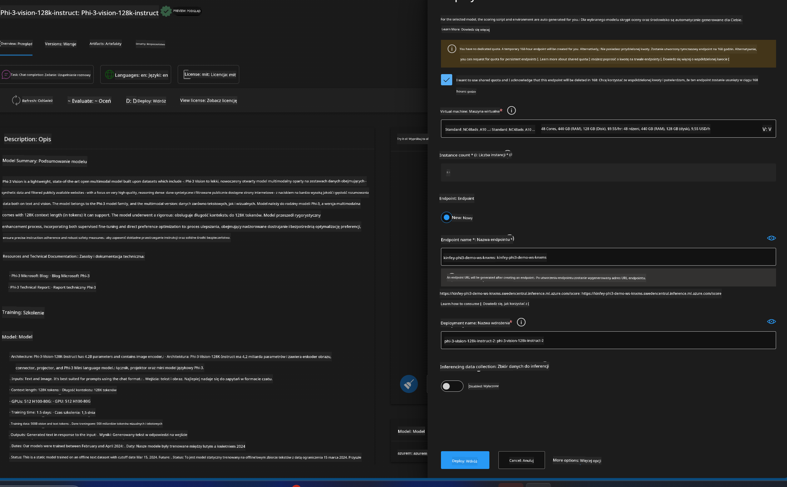
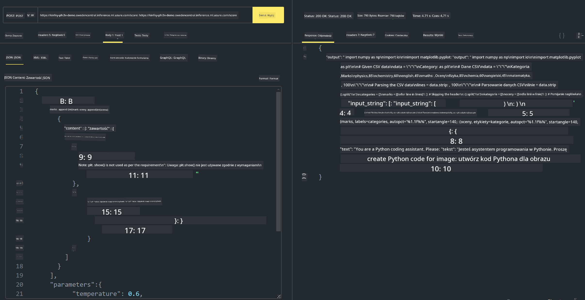

<!--
CO_OP_TRANSLATOR_METADATA:
{
  "original_hash": "20cb4e6ac1686248e8be913ccf6c2bc2",
  "translation_date": "2025-05-09T19:43:15+00:00",
  "source_file": "md/02.Application/02.Code/Phi3/VSCodeExt/HOL/Apple/03.DeployPhi3VisionOnAzure.md",
  "language_code": "pl"
}
-->
# **Laboratorium 3 - Wdrożenie Phi-3-vision w Azure Machine Learning Service**

Używamy NPU do wykonania produkcyjnego wdrożenia lokalnego kodu, a następnie chcemy wprowadzić możliwość korzystania z PHI-3-VISION, aby na podstawie obrazów generować kod.

W tym wprowadzeniu możemy szybko zbudować Model As Service Phi-3 Vision w Azure Machine Learning Service.

***Note***: Phi-3 Vision wymaga mocy obliczeniowej, aby generować treści szybciej. Potrzebujemy mocy obliczeniowej w chmurze, aby nam w tym pomóc.

### **1. Utwórz Azure Machine Learning Service**

Musimy utworzyć Azure Machine Learning Service w Azure Portal. Jeśli chcesz się dowiedzieć, jak to zrobić, odwiedź ten link [https://learn.microsoft.com/azure/machine-learning/quickstart-create-resources?view=azureml-api-2](https://learn.microsoft.com/azure/machine-learning/quickstart-create-resources?view=azureml-api-2)

### **2. Wybierz Phi-3 Vision w Azure Machine Learning Service**


### **3. Wdróż Phi-3-Vision w Azure**



### **4. Przetestuj Endpoint w Postman**



***Note***

1. Parametry, które należy przesłać, muszą zawierać Authorization, azureml-model-deployment oraz Content-Type. Należy sprawdzić informacje o wdrożeniu, aby je uzyskać.

2. Aby przesłać parametry, Phi-3-Vision potrzebuje linku do obrazu. Proszę odnieść się do metody GPT-4-Vision przesyłania parametrów, na przykład

```json

{
  "input_data":{
    "input_string":[
      {
        "role":"user",
        "content":[ 
          {
            "type": "text",
            "text": "You are a Python coding assistant.Please create Python code for image "
          },
          {
              "type": "image_url",
              "image_url": {
                "url": "https://ajaytech.co/wp-content/uploads/2019/09/index.png"
              }
          }
        ]
      }
    ],
    "parameters":{
          "temperature": 0.6,
          "top_p": 0.9,
          "do_sample": false,
          "max_new_tokens": 2048
    }
  }
}

```

3. Wywołaj **/score** metodą Post

**Gratulacje**! Ukończyłeś szybkie wdrożenie PHI-3-VISION i sprawdziłeś, jak na podstawie obrazów generować kod. Następnie możemy budować aplikacje łącząc NPU i chmurę.

**Zastrzeżenie**:  
Niniejszy dokument został przetłumaczony za pomocą usługi tłumaczenia AI [Co-op Translator](https://github.com/Azure/co-op-translator). Mimo że dążymy do jak największej dokładności, prosimy pamiętać, że tłumaczenia automatyczne mogą zawierać błędy lub nieścisłości. Oryginalny dokument w języku źródłowym należy traktować jako źródło autorytatywne. W przypadku informacji o kluczowym znaczeniu zaleca się skorzystanie z profesjonalnego tłumaczenia wykonanego przez człowieka. Nie ponosimy odpowiedzialności za jakiekolwiek nieporozumienia lub błędne interpretacje wynikające z korzystania z tego tłumaczenia.