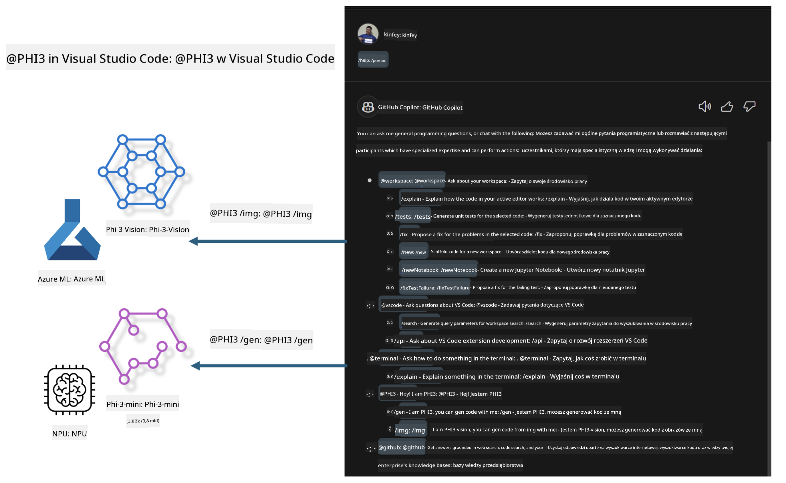

<!--
CO_OP_TRANSLATOR_METADATA:
{
  "original_hash": "00b7a699de8ac405fa821f4c0f7fc0ab",
  "translation_date": "2025-05-09T19:12:40+00:00",
  "source_file": "md/02.Application/02.Code/Phi3/VSCodeExt/README.md",
  "language_code": "pl"
}
-->
# **Zbuduj własnego GitHub Copilot Chat do Visual Studio Code z rodziny Microsoft Phi-3**

Czy korzystałeś z agenta workspace w GitHub Copilot Chat? Chcesz stworzyć własnego agenta kodu dla swojego zespołu? Ten praktyczny kurs ma na celu połączenie modelu open source, aby zbudować agent biznesowy do generowania kodu na poziomie przedsiębiorstwa.

## **Podstawy**

### **Dlaczego warto wybrać Microsoft Phi-3**

Phi-3 to seria modeli obejmująca phi-3-mini, phi-3-small oraz phi-3-medium, różniące się parametrami treningowymi do generowania tekstu, dialogów i kodu. Istnieje także phi-3-vision oparty na Vision. Model ten jest odpowiedni dla firm lub zespołów, które chcą tworzyć lokalne rozwiązania generatywnej sztucznej inteligencji.

Zalecane do przeczytania: [https://github.com/microsoft/PhiCookBook/blob/main/md/01.Introduction/01/01.PhiFamily.md](https://github.com/microsoft/PhiCookBook/blob/main/md/01.Introduction/01/01.PhiFamily.md)

### **Microsoft GitHub Copilot Chat**

Rozszerzenie GitHub Copilot Chat oferuje interfejs czatu, który pozwala na interakcję z GitHub Copilot i otrzymywanie odpowiedzi na pytania związane z kodowaniem bezpośrednio w VS Code, bez konieczności przeglądania dokumentacji czy wyszukiwania na forach internetowych.

Copilot Chat może wykorzystywać podświetlanie składni, wcięcia i inne elementy formatowania, aby odpowiedzi były bardziej czytelne. W zależności od pytania, odpowiedź może zawierać linki do kontekstu, którego Copilot użył do wygenerowania odpowiedzi, np. pliki źródłowe czy dokumentację, albo przyciski umożliwiające dostęp do funkcji VS Code.

- Copilot Chat integruje się z Twoim procesem deweloperskim i pomaga tam, gdzie tego potrzebujesz:

- Rozpocznij rozmowę inline bezpośrednio z edytora lub terminala, aby uzyskać pomoc podczas kodowania

- Korzystaj z widoku czatu, aby mieć asystenta AI pod ręką o każdej porze

- Uruchom Quick Chat, aby zadać szybkie pytanie i wrócić do pracy

Możesz używać GitHub Copilot Chat w różnych sytuacjach, takich jak:

- Odpowiadanie na pytania dotyczące najlepszych sposobów rozwiązania problemu

- Tłumaczenie czyjegoś kodu i sugerowanie ulepszeń

- Proponowanie poprawek w kodzie

- Generowanie testów jednostkowych

- Tworzenie dokumentacji kodu

Zalecane do przeczytania: [https://code.visualstudio.com/docs/copilot/copilot-chat](https://code.visualstudio.com/docs/copilot/copilot-chat?WT.mc_id=aiml-137032-kinfeylo)

###  **Microsoft GitHub Copilot Chat @workspace**

Odwołanie do **@workspace** w Copilot Chat pozwala zadawać pytania dotyczące całej bazy kodu. W oparciu o pytanie, Copilot inteligentnie wyszukuje odpowiednie pliki i symbole, które następnie uwzględnia w odpowiedzi jako linki i przykłady kodu.

Aby odpowiedzieć na pytanie, **@workspace** przeszukuje te same źródła, z których korzysta deweloper podczas poruszania się po bazie kodu w VS Code:

- Wszystkie pliki w workspace, z wyjątkiem tych ignorowanych przez plik .gitignore

- Strukturę katalogów z zagnieżdżonymi folderami i nazwami plików

- Indeks wyszukiwania kodu GitHub, jeśli workspace jest repozytorium GitHub i jest indeksowane przez code search

- Symbole i definicje w workspace

- Aktualnie zaznaczony tekst lub widoczny tekst w aktywnym edytorze

Uwaga: plik .gitignore jest pomijany, jeśli masz otwarty plik lub zaznaczony tekst w pliku ignorowanym.

Zalecane do przeczytania: [[https://code.visualstudio.com/docs/copilot/copilot-chat](https://code.visualstudio.com/docs/copilot/workspace-context?WT.mc_id=aiml-137032-kinfeylo)]

## **Dowiedz się więcej o tym laboratorium**

GitHub Copilot znacząco zwiększył efektywność programowania w przedsiębiorstwach, a każda firma chce dostosować odpowiednie funkcje GitHub Copilot do swoich potrzeb. Wiele firm tworzy własne rozszerzenia podobne do GitHub Copilot, bazując na swoich scenariuszach biznesowych i modelach open source. Dla firm takie spersonalizowane rozszerzenia są łatwiejsze w kontroli, ale może to wpłynąć na doświadczenie użytkownika. W końcu GitHub Copilot ma mocniejsze funkcje w obsłudze ogólnych scenariuszy i profesjonalizmu. Jeśli można zachować spójne doświadczenie, lepiej jest dostosować własne rozszerzenie firmy. GitHub Copilot Chat udostępnia odpowiednie API, które pozwalają firmom rozszerzać doświadczenie czatu. Utrzymanie spójnego doświadczenia oraz posiadanie funkcji dostosowanych to lepsze doświadczenie użytkownika.

To laboratorium głównie wykorzystuje model Phi-3 w połączeniu z lokalnym NPU i hybrydą Azure, aby zbudować niestandardowego agenta w GitHub Copilot Chat ***@PHI3***, który wspiera deweloperów przedsiębiorstw w generowaniu kodu ***(@PHI3 /gen)*** oraz tworzeniu kodu na podstawie obrazów ***(@PHI3 /img)***.

### ***Uwaga:*** 

To laboratorium jest obecnie realizowane na AIPC dla procesorów Intel CPU i Apple Silicon. Będziemy kontynuować aktualizacje wersji Qualcomm NPU.

## **Laboratorium**

| Nazwa | Opis | AIPC | Apple |
| ------------ | ----------- | -------- |-------- |
| Lab0 - Installations(✅) | Konfiguracja i instalacja środowisk oraz narzędzi instalacyjnych | [Go](./HOL/AIPC/01.Installations.md) |[Go](./HOL/Apple/01.Installations.md) |
| Lab1 - Run Prompt flow with Phi-3-mini (✅) | Połączenie z AIPC / Apple Silicon, wykorzystanie lokalnego NPU do generowania kodu za pomocą Phi-3-mini | [Go](./HOL/AIPC/02.PromptflowWithNPU.md) |  [Go](./HOL/Apple/02.PromptflowWithMLX.md) |
| Lab2 - Deploy Phi-3-vision on Azure Machine Learning Service(✅) | Generowanie kodu poprzez wdrożenie modelu Phi-3-vision z katalogu modeli Azure Machine Learning Service | [Go](./HOL/AIPC/03.DeployPhi3VisionOnAzure.md) |[Go](./HOL/Apple/03.DeployPhi3VisionOnAzure.md) |
| Lab3 - Create a @phi-3 agent in GitHub Copilot Chat(✅)  | Stwórz niestandardowego agenta Phi-3 w GitHub Copilot Chat do generowania kodu, kodu generującego wykresy, RAG itp. | [Go](./HOL/AIPC/04.CreatePhi3AgentInVSCode.md) | [Go](./HOL/Apple/04.CreatePhi3AgentInVSCode.md) |
| Sample Code (✅)  | Pobierz przykładowy kod | [Go](../../../../../../../code/07.Lab/01/AIPC) | [Go](../../../../../../../code/07.Lab/01/Apple) |

## **Zasoby**

1. Phi-3 Cookbook [https://github.com/microsoft/Phi-3CookBook](https://github.com/microsoft/Phi-3CookBook)

2. Dowiedz się więcej o GitHub Copilot [https://learn.microsoft.com/training/paths/copilot/](https://learn.microsoft.com/training/paths/copilot/?WT.mc_id=aiml-137032-kinfeylo)

3. Dowiedz się więcej o GitHub Copilot Chat [https://learn.microsoft.com/training/paths/accelerate-app-development-using-github-copilot/](https://learn.microsoft.com/training/paths/accelerate-app-development-using-github-copilot/?WT.mc_id=aiml-137032-kinfeylo)

4. Dowiedz się więcej o GitHub Copilot Chat API [https://code.visualstudio.com/api/extension-guides/chat](https://code.visualstudio.com/api/extension-guides/chat?WT.mc_id=aiml-137032-kinfeylo)

5. Dowiedz się więcej o Azure AI Foundry [https://learn.microsoft.com/training/paths/create-custom-copilots-ai-studio/](https://learn.microsoft.com/training/paths/create-custom-copilots-ai-studio/?WT.mc_id=aiml-137032-kinfeylo)

6. Dowiedz się więcej o katalogu modeli Azure AI Foundry [https://learn.microsoft.com/azure/ai-studio/how-to/model-catalog-overview](https://learn.microsoft.com/azure/ai-studio/how-to/model-catalog-overview)

**Zastrzeżenie**:  
Niniejszy dokument został przetłumaczony za pomocą usługi tłumaczeń AI [Co-op Translator](https://github.com/Azure/co-op-translator). Mimo że dążymy do dokładności, prosimy mieć na uwadze, że automatyczne tłumaczenia mogą zawierać błędy lub niedokładności. Oryginalny dokument w jego języku źródłowym powinien być uznawany za autorytatywne źródło. W przypadku informacji krytycznych zalecane jest skorzystanie z profesjonalnego tłumaczenia wykonanego przez człowieka. Nie ponosimy odpowiedzialności za jakiekolwiek nieporozumienia lub błędne interpretacje wynikające z korzystania z tego tłumaczenia.