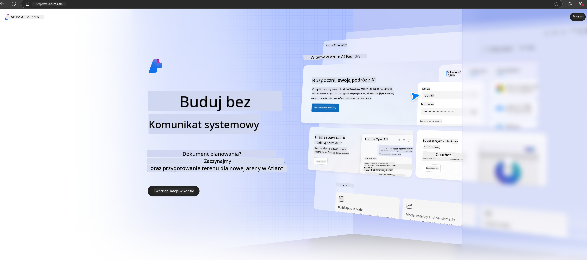

<!--
CO_OP_TRANSLATOR_METADATA:
{
  "original_hash": "3a1e48b628022485aac989c9f733e792",
  "translation_date": "2025-05-09T20:11:17+00:00",
  "source_file": "md/02.QuickStart/AzureAIFoundry_QuickStart.md",
  "language_code": "pl"
}
-->
# **Używanie Phi-3 w Azure AI Foundry**

Wraz z rozwojem Generative AI, chcemy korzystać z zunifikowanej platformy do zarządzania różnymi LLM i SLM, integracji danych przedsiębiorstwa, operacji fine-tuning/RAG oraz oceny różnych biznesów po integracji LLM i SLM, tak aby generatywna AI mogła lepiej wspierać inteligentne aplikacje. [Azure AI Foundry](https://ai.azure.com) to platforma do zastosowań generatywnej AI na poziomie przedsiębiorstwa.

Dzięki Azure AI Foundry możesz oceniać odpowiedzi dużych modeli językowych (LLM) oraz zarządzać komponentami aplikacji prompt flow dla lepszej wydajności. Platforma ułatwia skalowanie, umożliwiając łatwe przekształcenie proof of concept w pełnoprawną produkcję. Ciągły monitoring i doskonalenie wspierają długoterminowy sukces.

Model Phi-3 można szybko wdrożyć w Azure AI Foundry prostymi krokami, a następnie korzystać z Azure AI Foundry do realizacji zadań związanych z Playground/Chat, fine-tuningiem, oceną i innymi powiązanymi działaniami.

## **1. Przygotowanie**

Jeśli masz już zainstalowany [Azure Developer CLI](https://learn.microsoft.com/azure/developer/azure-developer-cli/overview?WT.mc_id=aiml-138114-kinfeylo) na swoim komputerze, użycie tego szablonu sprowadza się do uruchomienia tej komendy w nowym katalogu.

## Tworzenie ręczne

Utworzenie projektu i huba w Microsoft Azure AI Foundry to świetny sposób na organizację i zarządzanie pracą AI. Oto przewodnik krok po kroku, który pomoże Ci zacząć:

### Tworzenie projektu w Azure AI Foundry

1. **Przejdź do Azure AI Foundry**: Zaloguj się do portalu Azure AI Foundry.
2. **Utwórz projekt**:
   - Jeśli jesteś w projekcie, wybierz "Azure AI Foundry" w lewym górnym rogu strony, aby przejść do strony głównej.
   - Wybierz "+ Create project".
   - Wprowadź nazwę projektu.
   - Jeśli masz hub, zostanie on wybrany domyślnie. Jeśli masz dostęp do więcej niż jednego huba, możesz wybrać inny z listy rozwijanej. Jeśli chcesz utworzyć nowy hub, wybierz "Create new hub" i podaj nazwę.
   - Wybierz "Create".

### Tworzenie huba w Azure AI Foundry

1. **Przejdź do Azure AI Foundry**: Zaloguj się na swoje konto Azure.
2. **Utwórz hub**:
   - Wybierz Management center z lewego menu.
   - Wybierz "All resources", następnie strzałkę w dół obok "+ New project" i wybierz "+ New hub".
   - W oknie "Create a new hub" wpisz nazwę huba (np. contoso-hub) i zmodyfikuj pozostałe pola według potrzeb.
   - Wybierz "Next", sprawdź informacje, a następnie wybierz "Create".

Po bardziej szczegółowe instrukcje odsyłamy do oficjalnej [dokumentacji Microsoft](https://learn.microsoft.com/azure/ai-studio/how-to/create-projects).

Po pomyślnym utworzeniu możesz uzyskać dostęp do stworzonego studia przez [ai.azure.com](https://ai.azure.com/)

Na jednym AI Foundry może być wiele projektów. Utwórz projekt w AI Foundry, aby się przygotować.

Utwórz Azure AI Foundry [QuickStarts](https://learn.microsoft.com/azure/ai-studio/quickstarts/get-started-code)

## **2. Wdrożenie modelu Phi w Azure AI Foundry**

Kliknij opcję Explore w projekcie, aby wejść do Model Catalog i wybierz Phi-3

Wybierz Phi-3-mini-4k-instruct

Kliknij 'Deploy', aby wdrożyć model Phi-3-mini-4k-instruct

> [!NOTE]
>
> Możesz wybrać moc obliczeniową podczas wdrażania

## **3. Playground Chat Phi w Azure AI Foundry**

Przejdź do strony wdrożenia, wybierz Playground i rozpocznij rozmowę z Phi-3 w Azure AI Foundry

## **4. Wdrażanie modelu z Azure AI Foundry**

Aby wdrożyć model z Azure Model Catalog, wykonaj następujące kroki:

- Zaloguj się do Azure AI Foundry.
- Wybierz model, który chcesz wdrożyć z katalogu modeli Azure AI Foundry.
- Na stronie Szczegóły modelu wybierz Deploy, a następnie wybierz Serverless API z Azure AI Content Safety.
- Wybierz projekt, w którym chcesz wdrożyć model. Aby korzystać z Serverless API, Twoje środowisko musi znajdować się w regionie East US 2 lub Sweden Central. Możesz dostosować nazwę wdrożenia.
- W kreatorze wdrożenia wybierz Pricing and terms, aby zapoznać się z cennikiem i warunkami użytkowania.
- Wybierz Deploy. Poczekaj, aż wdrożenie będzie gotowe i zostaniesz przekierowany na stronę Deployments.
- Wybierz Open in playground, aby rozpocząć interakcję z modelem.
- Możesz wrócić do strony Deployments, wybrać wdrożenie i zanotować adres URL endpointu (Target URL) oraz Secret Key, które posłużą do wywoływania wdrożenia i generowania odpowiedzi.
- Szczegóły endpointu, URL i klucze dostępu znajdziesz zawsze w zakładce Build, wybierając Deployments w sekcji Components.

> [!NOTE]
> Pamiętaj, że Twoje konto musi mieć uprawnienia roli Azure AI Developer na Resource Group, aby wykonać te kroki.

## **5. Korzystanie z Phi API w Azure AI Foundry**

Możesz uzyskać dostęp do https://{Your project name}.region.inference.ml.azure.com/swagger.json przez Postman metodą GET i połączyć to z Key, aby zapoznać się z dostępnymi interfejsami

Bardzo wygodnie możesz poznać parametry zapytania oraz parametry odpowiedzi.

**Zastrzeżenie**:  
Niniejszy dokument został przetłumaczony przy użyciu automatycznej usługi tłumaczeniowej AI [Co-op Translator](https://github.com/Azure/co-op-translator). Mimo że dokładamy starań, aby tłumaczenie było precyzyjne, prosimy pamiętać, że automatyczne tłumaczenia mogą zawierać błędy lub nieścisłości. Oryginalny dokument w języku źródłowym należy traktować jako autorytatywne źródło. W przypadku informacji o kluczowym znaczeniu zaleca się skorzystanie z profesjonalnego tłumaczenia wykonanego przez człowieka. Nie ponosimy odpowiedzialności za jakiekolwiek nieporozumienia lub błędne interpretacje wynikające z użycia tego tłumaczenia.