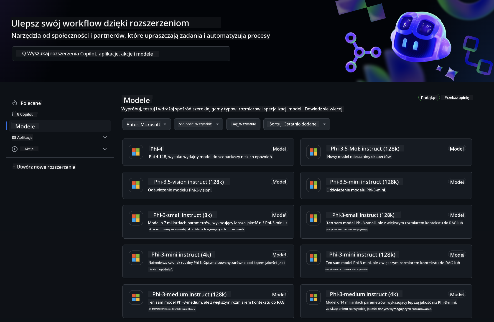
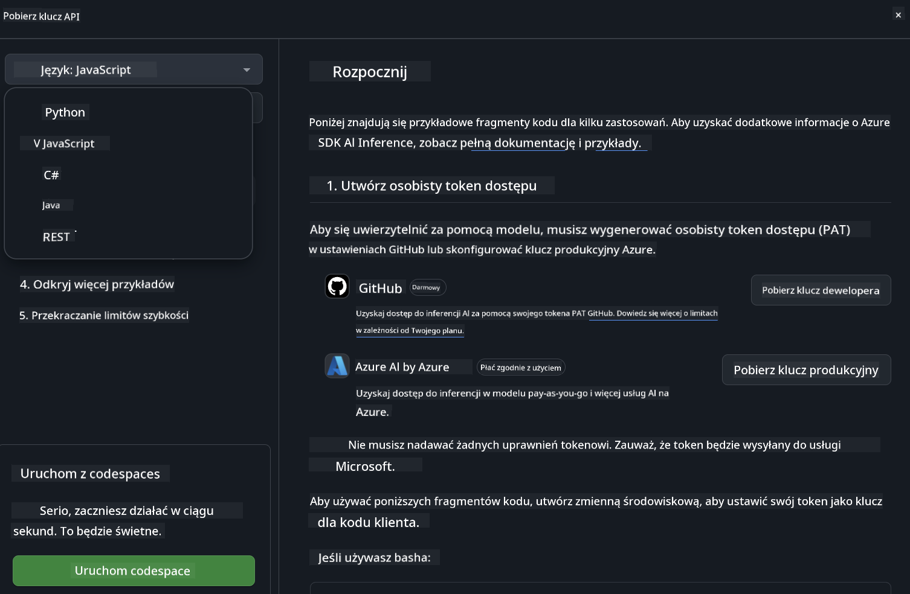
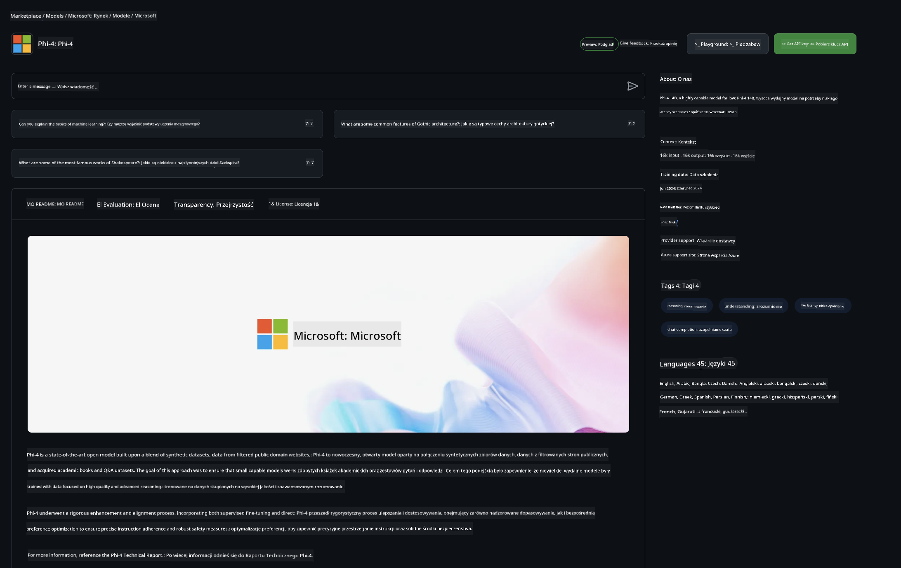

<!--
CO_OP_TRANSLATOR_METADATA:
{
  "original_hash": "5113634b77370af6790f9697d5d7de90",
  "translation_date": "2025-05-09T20:17:31+00:00",
  "source_file": "md/02.QuickStart/GitHubModel_QuickStart.md",
  "language_code": "pl"
}
-->
## GitHub Models - Ograniczona Publiczna Beta

Witamy w [GitHub Models](https://github.com/marketplace/models)! Mamy wszystko gotowe, abyś mógł odkrywać modele AI hostowane na Azure AI.



Aby uzyskać więcej informacji o dostępnych modelach w GitHub Models, odwiedź [GitHub Model Marketplace](https://github.com/marketplace/models)

## Dostępne modele

Każdy model ma dedykowane środowisko testowe oraz przykładowy kod


### Modele Phi-3 w katalogu GitHub Model

[Phi-3-Medium-128k-Instruct](https://github.com/marketplace/models/azureml/Phi-3-medium-128k-instruct)

[Phi-3-medium-4k-instruct](https://github.com/marketplace/models/azureml/Phi-3-medium-4k-instruct)

[Phi-3-mini-128k-instruct](https://github.com/marketplace/models/azureml/Phi-3-mini-128k-instruct)

[Phi-3-mini-4k-instruct](https://github.com/marketplace/models/azureml/Phi-3-mini-4k-instruct)

[Phi-3-small-128k-instruct](https://github.com/marketplace/models/azureml/Phi-3-small-128k-instruct)

[Phi-3-small-8k-instruct](https://github.com/marketplace/models/azureml/Phi-3-small-8k-instruct)

## Pierwsze kroki

Do dyspozycji masz kilka podstawowych przykładów gotowych do uruchomienia. Znajdziesz je w katalogu samples. Jeśli chcesz od razu przejść do swojego ulubionego języka, przykłady dostępne są w następujących językach:

- Python
- JavaScript
- cURL

Dostępne jest także dedykowane środowisko Codespaces do uruchamiania przykładów i modeli.



## Przykładowy kod

Poniżej znajdziesz przykładowe fragmenty kodu dla kilku zastosowań. Aby uzyskać więcej informacji o Azure AI Inference SDK, zobacz pełną dokumentację i przykłady.

## Konfiguracja

1. Utwórz token dostępu osobistego  
Nie musisz nadawać żadnych uprawnień tokenowi. Pamiętaj, że token zostanie przesłany do usługi Microsoft.

Aby korzystać z poniższych fragmentów kodu, ustaw zmienną środowiskową z tokenem jako klucz dla kodu klienta.

Jeśli używasz bash:  
```
export GITHUB_TOKEN="<your-github-token-goes-here>"
```  
Jeśli korzystasz z powershell:  

```
$Env:GITHUB_TOKEN="<your-github-token-goes-here>"
```  

Jeśli używasz Windows command prompt:  

```
set GITHUB_TOKEN=<your-github-token-goes-here>
```  

## Przykład w Python

### Instalacja zależności  
Zainstaluj Azure AI Inference SDK za pomocą pip (Wymaga: Python >=3.8):

```
pip install azure-ai-inference
```  
### Uruchom podstawowy przykład kodu

Ten przykład pokazuje podstawowe wywołanie API chat completion. Wykorzystuje punkt końcowy inferencji modelu AI GitHub oraz Twój token GitHub. Wywołanie jest synchroniczne.

```
import os
from azure.ai.inference import ChatCompletionsClient
from azure.ai.inference.models import SystemMessage, UserMessage
from azure.core.credentials import AzureKeyCredential

endpoint = "https://models.inference.ai.azure.com"
# Replace Model_Name 
model_name = "Phi-3-small-8k-instruct"
token = os.environ["GITHUB_TOKEN"]

client = ChatCompletionsClient(
    endpoint=endpoint,
    credential=AzureKeyCredential(token),
)

response = client.complete(
    messages=[
        SystemMessage(content="You are a helpful assistant."),
        UserMessage(content="What is the capital of France?"),
    ],
    model=model_name,
    temperature=1.,
    max_tokens=1000,
    top_p=1.
)

print(response.choices[0].message.content)
```

### Uruchom rozmowę wieloetapową

Ten przykład pokazuje rozmowę wieloetapową z API chat completion. Korzystając z modelu w aplikacji czatu, musisz zarządzać historią rozmowy i przesyłać do modelu najnowsze wiadomości.

```
import os
from azure.ai.inference import ChatCompletionsClient
from azure.ai.inference.models import AssistantMessage, SystemMessage, UserMessage
from azure.core.credentials import AzureKeyCredential

token = os.environ["GITHUB_TOKEN"]
endpoint = "https://models.inference.ai.azure.com"
# Replace Model_Name
model_name = "Phi-3-small-8k-instruct"

client = ChatCompletionsClient(
    endpoint=endpoint,
    credential=AzureKeyCredential(token),
)

messages = [
    SystemMessage(content="You are a helpful assistant."),
    UserMessage(content="What is the capital of France?"),
    AssistantMessage(content="The capital of France is Paris."),
    UserMessage(content="What about Spain?"),
]

response = client.complete(messages=messages, model=model_name)

print(response.choices[0].message.content)
```

### Strumieniowanie odpowiedzi

Dla lepszego doświadczenia użytkownika warto strumieniować odpowiedź modelu, aby pierwszy token pojawił się szybko i nie trzeba było czekać na długie odpowiedzi.

```
import os
from azure.ai.inference import ChatCompletionsClient
from azure.ai.inference.models import SystemMessage, UserMessage
from azure.core.credentials import AzureKeyCredential

token = os.environ["GITHUB_TOKEN"]
endpoint = "https://models.inference.ai.azure.com"
# Replace Model_Name
model_name = "Phi-3-small-8k-instruct"

client = ChatCompletionsClient(
    endpoint=endpoint,
    credential=AzureKeyCredential(token),
)

response = client.complete(
    stream=True,
    messages=[
        SystemMessage(content="You are a helpful assistant."),
        UserMessage(content="Give me 5 good reasons why I should exercise every day."),
    ],
    model=model_name,
)

for update in response:
    if update.choices:
        print(update.choices[0].delta.content or "", end="")

client.close()
```

## JavaScript

### Instalacja zależności

Zainstaluj Node.js.

Skopiuj poniższe linie tekstu i zapisz je jako plik package.json w swoim folderze.

```
{
  "type": "module",
  "dependencies": {
    "@azure-rest/ai-inference": "latest",
    "@azure/core-auth": "latest",
    "@azure/core-sse": "latest"
  }
}
```

Uwaga: @azure/core-sse jest potrzebny tylko wtedy, gdy strumieniujesz odpowiedzi chat completion.

Otwórz terminal w tym folderze i uruchom npm install.

Dla każdego z poniższych fragmentów kodu skopiuj zawartość do pliku sample.js i uruchom node sample.js.

### Uruchom podstawowy przykład kodu

Ten przykład pokazuje podstawowe wywołanie API chat completion. Wykorzystuje punkt końcowy inferencji modelu AI GitHub oraz Twój token GitHub. Wywołanie jest synchroniczne.

```
import ModelClient from "@azure-rest/ai-inference";
import { AzureKeyCredential } from "@azure/core-auth";

const token = process.env["GITHUB_TOKEN"];
const endpoint = "https://models.inference.ai.azure.com";
// Update your modelname
const modelName = "Phi-3-small-8k-instruct";

export async function main() {

  const client = new ModelClient(endpoint, new AzureKeyCredential(token));

  const response = await client.path("/chat/completions").post({
    body: {
      messages: [
        { role:"system", content: "You are a helpful assistant." },
        { role:"user", content: "What is the capital of France?" }
      ],
      model: modelName,
      temperature: 1.,
      max_tokens: 1000,
      top_p: 1.
    }
  });

  if (response.status !== "200") {
    throw response.body.error;
  }
  console.log(response.body.choices[0].message.content);
}

main().catch((err) => {
  console.error("The sample encountered an error:", err);
});
```

### Uruchom rozmowę wieloetapową

Ten przykład pokazuje rozmowę wieloetapową z API chat completion. Korzystając z modelu w aplikacji czatu, musisz zarządzać historią rozmowy i przesyłać do modelu najnowsze wiadomości.

```
import ModelClient from "@azure-rest/ai-inference";
import { AzureKeyCredential } from "@azure/core-auth";

const token = process.env["GITHUB_TOKEN"];
const endpoint = "https://models.inference.ai.azure.com";
// Update your modelname
const modelName = "Phi-3-small-8k-instruct";

export async function main() {

  const client = new ModelClient(endpoint, new AzureKeyCredential(token));

  const response = await client.path("/chat/completions").post({
    body: {
      messages: [
        { role: "system", content: "You are a helpful assistant." },
        { role: "user", content: "What is the capital of France?" },
        { role: "assistant", content: "The capital of France is Paris." },
        { role: "user", content: "What about Spain?" },
      ],
      model: modelName,
    }
  });

  if (response.status !== "200") {
    throw response.body.error;
  }

  for (const choice of response.body.choices) {
    console.log(choice.message.content);
  }
}

main().catch((err) => {
  console.error("The sample encountered an error:", err);
});
```

### Strumieniowanie odpowiedzi

Dla lepszego doświadczenia użytkownika warto strumieniować odpowiedź modelu, aby pierwszy token pojawił się szybko i nie trzeba było czekać na długie odpowiedzi.

```
import ModelClient from "@azure-rest/ai-inference";
import { AzureKeyCredential } from "@azure/core-auth";
import { createSseStream } from "@azure/core-sse";

const token = process.env["GITHUB_TOKEN"];
const endpoint = "https://models.inference.ai.azure.com";
// Update your modelname
const modelName = "Phi-3-small-8k-instruct";

export async function main() {

  const client = new ModelClient(endpoint, new AzureKeyCredential(token));

  const response = await client.path("/chat/completions").post({
    body: {
      messages: [
        { role: "system", content: "You are a helpful assistant." },
        { role: "user", content: "Give me 5 good reasons why I should exercise every day." },
      ],
      model: modelName,
      stream: true
    }
  }).asNodeStream();

  const stream = response.body;
  if (!stream) {
    throw new Error("The response stream is undefined");
  }

  if (response.status !== "200") {
    stream.destroy();
    throw new Error(`Failed to get chat completions, http operation failed with ${response.status} code`);
  }

  const sseStream = createSseStream(stream);

  for await (const event of sseStream) {
    if (event.data === "[DONE]") {
      return;
    }
    for (const choice of (JSON.parse(event.data)).choices) {
        process.stdout.write(choice.delta?.content ?? ``);
    }
  }
}

main().catch((err) => {
  console.error("The sample encountered an error:", err);
});
```

## REST

### Uruchom podstawowy przykład kodu

Wklej poniższe polecenie do powłoki:

```
curl -X POST "https://models.inference.ai.azure.com/chat/completions" \
    -H "Content-Type: application/json" \
    -H "Authorization: Bearer $GITHUB_TOKEN" \
    -d '{
        "messages": [
            {
                "role": "system",
                "content": "You are a helpful assistant."
            },
            {
                "role": "user",
                "content": "What is the capital of France?"
            }
        ],
        "model": "Phi-3-small-8k-instruct"
    }'
```  
### Uruchom rozmowę wieloetapową

Wywołaj API chat completion i przekaż historię rozmowy:

```
curl -X POST "https://models.inference.ai.azure.com/chat/completions" \
    -H "Content-Type: application/json" \
    -H "Authorization: Bearer $GITHUB_TOKEN" \
    -d '{
        "messages": [
            {
                "role": "system",
                "content": "You are a helpful assistant."
            },
            {
                "role": "user",
                "content": "What is the capital of France?"
            },
            {
                "role": "assistant",
                "content": "The capital of France is Paris."
            },
            {
                "role": "user",
                "content": "What about Spain?"
            }
        ],
        "model": "Phi-3-small-8k-instruct"
    }'
```  
### Strumieniowanie odpowiedzi

To przykład wywołania punktu końcowego z jednoczesnym strumieniowaniem odpowiedzi.

```
curl -X POST "https://models.inference.ai.azure.com/chat/completions" \
    -H "Content-Type: application/json" \
    -H "Authorization: Bearer $GITHUB_TOKEN" \
    -d '{
        "messages": [
            {
                "role": "system",
                "content": "You are a helpful assistant."
            },
            {
                "role": "user",
                "content": "Give me 5 good reasons why I should exercise every day."
            }
        ],
        "stream": true,
        "model": "Phi-3-small-8k-instruct"
    }'
```

## BEZPŁATNE użycie i limity dla GitHub Models



[Limity dla środowiska testowego i darmowego API](https://docs.github.com/en/github-models/prototyping-with-ai-models#rate-limits) mają na celu umożliwić eksperymentowanie z modelami i prototypowanie aplikacji AI. Aby korzystać poza tymi limitami i skalować swoją aplikację, musisz przydzielić zasoby z konta Azure i uwierzytelnić się tam zamiast za pomocą osobistego tokena GitHub. Nie musisz zmieniać niczego w swoim kodzie. Skorzystaj z tego linku, aby dowiedzieć się, jak przekroczyć limity darmowego poziomu w Azure AI.

### Informacje dodatkowe

Pamiętaj, że korzystając z modelu eksperymentujesz z AI, więc mogą zdarzyć się błędy w treści.

Funkcjonalność jest objęta różnymi ograniczeniami (w tym liczba zapytań na minutę, na dzień, tokeny na zapytanie oraz zapytania równoczesne) i nie jest przeznaczona do zastosowań produkcyjnych.

GitHub Models korzysta z Azure AI Content Safety. Te filtry nie mogą być wyłączone w ramach doświadczenia GitHub Models. Jeśli zdecydujesz się korzystać z modeli przez płatną usługę, skonfiguruj filtry treści zgodnie ze swoimi wymaganiami.

Ta usługa jest objęta warunkami wstępnej wersji GitHub.

**Zastrzeżenie**:  
Ten dokument został przetłumaczony za pomocą usługi tłumaczenia AI [Co-op Translator](https://github.com/Azure/co-op-translator). Chociaż dążymy do dokładności, prosimy pamiętać, że tłumaczenia automatyczne mogą zawierać błędy lub niedokładności. Oryginalny dokument w jego języku źródłowym powinien być uważany za wiarygodne źródło. W przypadku informacji krytycznych zaleca się skorzystanie z profesjonalnego tłumaczenia wykonanego przez człowieka. Nie ponosimy odpowiedzialności za jakiekolwiek nieporozumienia lub błędne interpretacje wynikające z korzystania z tego tłumaczenia.