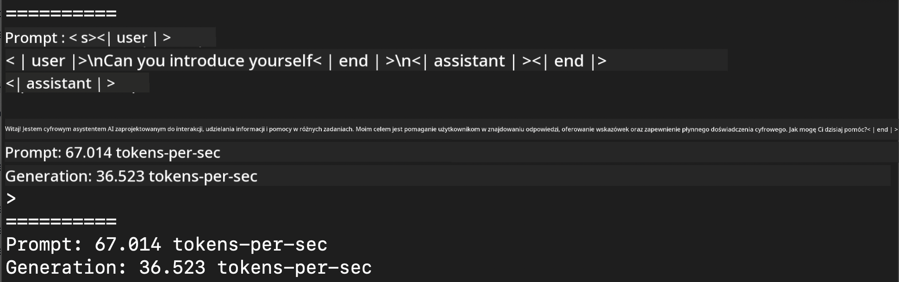
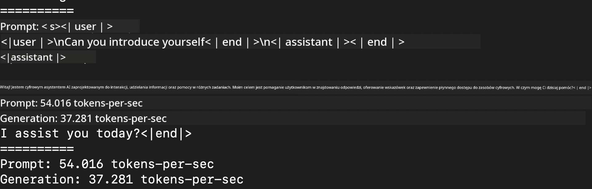

<!--
CO_OP_TRANSLATOR_METADATA:
{
  "original_hash": "dcb656f3d206fc4968e236deec5d4384",
  "translation_date": "2025-07-17T10:06:19+00:00",
  "source_file": "md/03.FineTuning/03.Inference/MLX_Inference.md",
  "language_code": "pl"
}
-->
# **Inference Phi-3 z wykorzystaniem Apple MLX Framework**

## **Czym jest MLX Framework**

MLX to framework do pracy z tablicami, stworzony do badań nad uczeniem maszynowym na procesorach Apple Silicon, opracowany przez zespół badawczy Apple zajmujący się uczeniem maszynowym.

MLX został zaprojektowany przez badaczy uczenia maszynowego dla badaczy uczenia maszynowego. Framework ma być przyjazny dla użytkownika, a jednocześnie wydajny w trenowaniu i wdrażaniu modeli. Sama konstrukcja frameworka jest również koncepcyjnie prosta. Chcemy, aby badacze mogli łatwo rozszerzać i ulepszać MLX, co pozwoli na szybkie testowanie nowych pomysłów.

Modele LLM można przyspieszyć na urządzeniach Apple Silicon dzięki MLX, a modele można uruchamiać lokalnie w bardzo wygodny sposób.

## **Użycie MLX do inferencji Phi-3-mini**

### **1. Skonfiguruj swoje środowisko MLX**

1. Python 3.11.x  
2. Zainstaluj bibliotekę MLX


```bash

pip install mlx-lm

```

### **2. Uruchomienie Phi-3-mini w terminalu z MLX**


```bash

python -m mlx_lm.generate --model microsoft/Phi-3-mini-4k-instruct --max-token 2048 --prompt  "<|user|>\nCan you introduce yourself<|end|>\n<|assistant|>"

```

Wynik (moje środowisko to Apple M1 Max, 64GB) to



### **3. Kwantyzacja Phi-3-mini z MLX w terminalu**


```bash

python -m mlx_lm.convert --hf-path microsoft/Phi-3-mini-4k-instruct

```

***Note：*** Model można poddać kwantyzacji za pomocą mlx_lm.convert, a domyślną kwantyzacją jest INT4. W tym przykładzie Phi-3-mini jest kwantyzowany do INT4.

Model można poddać kwantyzacji za pomocą mlx_lm.convert, a domyślną kwantyzacją jest INT4. Ten przykład pokazuje kwantyzację Phi-3-mini do INT4. Po kwantyzacji model zostanie zapisany w domyślnym katalogu ./mlx_model

Możemy przetestować model po kwantyzacji z MLX z poziomu terminala


```bash

python -m mlx_lm.generate --model ./mlx_model/ --max-token 2048 --prompt  "<|user|>\nCan you introduce yourself<|end|>\n<|assistant|>"

```

Wynik to




### **4. Uruchomienie Phi-3-mini z MLX w Jupyter Notebook**


***Note:*** Proszę zapoznać się z tym przykładem [klikając ten link](../../../../../code/03.Inference/MLX/MLX_DEMO.ipynb)


## **Zasoby**

1. Dowiedz się więcej o Apple MLX Framework [https://ml-explore.github.io](https://ml-explore.github.io/mlx/build/html/index.html)

2. Repozytorium Apple MLX na GitHub [https://github.com/ml-explore](https://github.com/ml-explore)

**Zastrzeżenie**:  
Niniejszy dokument został przetłumaczony przy użyciu usługi tłumaczenia AI [Co-op Translator](https://github.com/Azure/co-op-translator). Mimo że dążymy do dokładności, prosimy mieć na uwadze, że automatyczne tłumaczenia mogą zawierać błędy lub nieścisłości. Oryginalny dokument w języku źródłowym powinien być uznawany za źródło autorytatywne. W przypadku informacji o kluczowym znaczeniu zalecane jest skorzystanie z profesjonalnego tłumaczenia wykonanego przez człowieka. Nie ponosimy odpowiedzialności za jakiekolwiek nieporozumienia lub błędne interpretacje wynikające z korzystania z tego tłumaczenia.