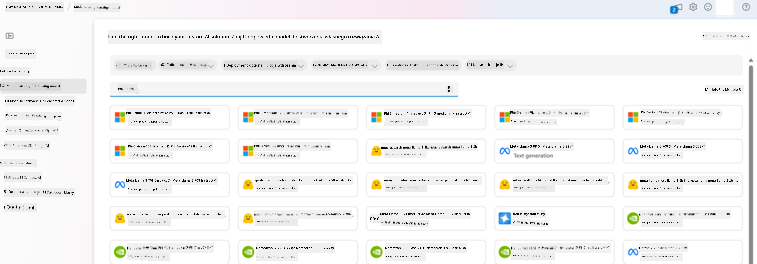
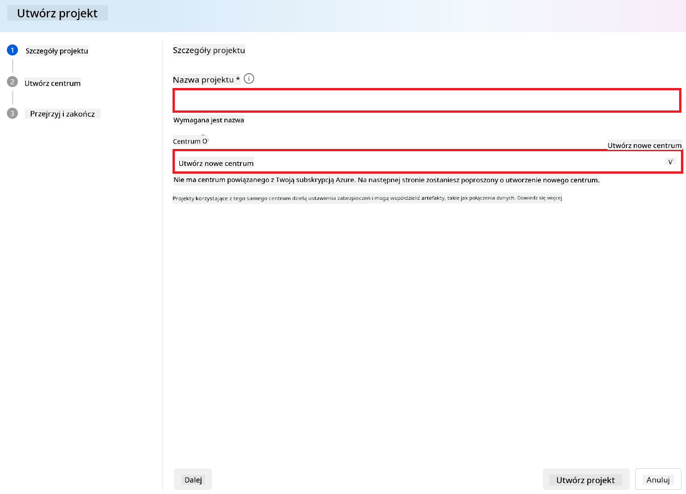
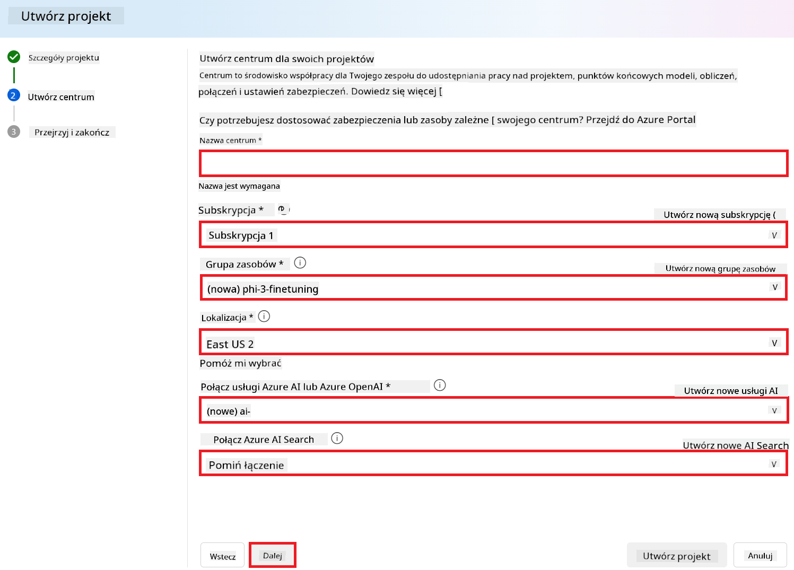
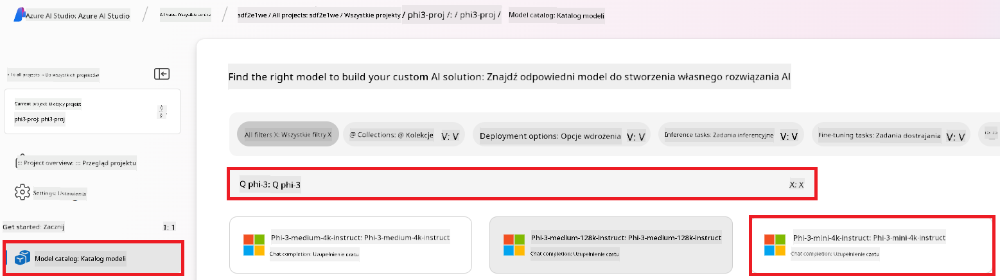
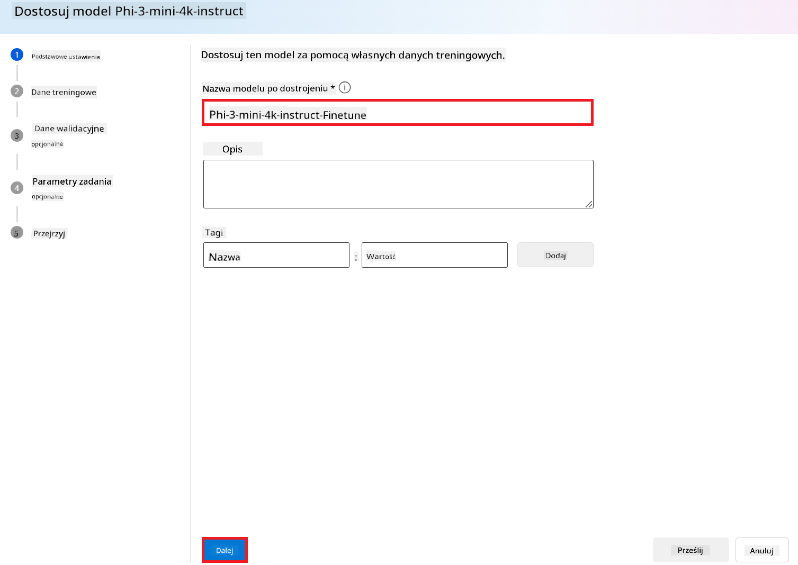
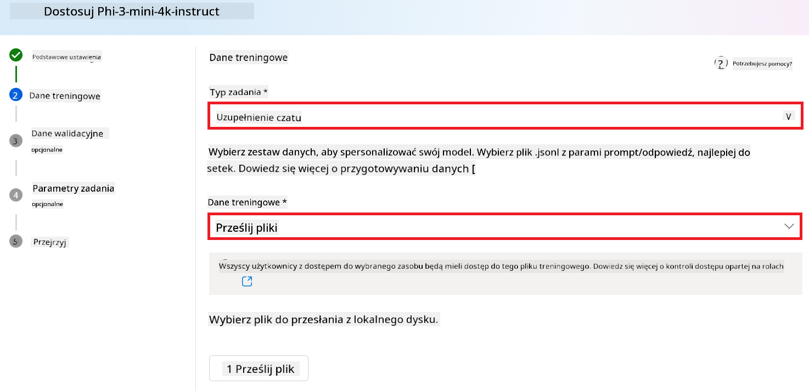
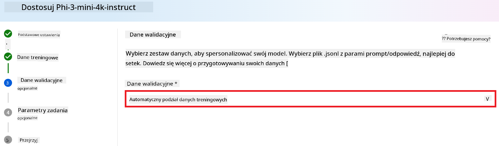
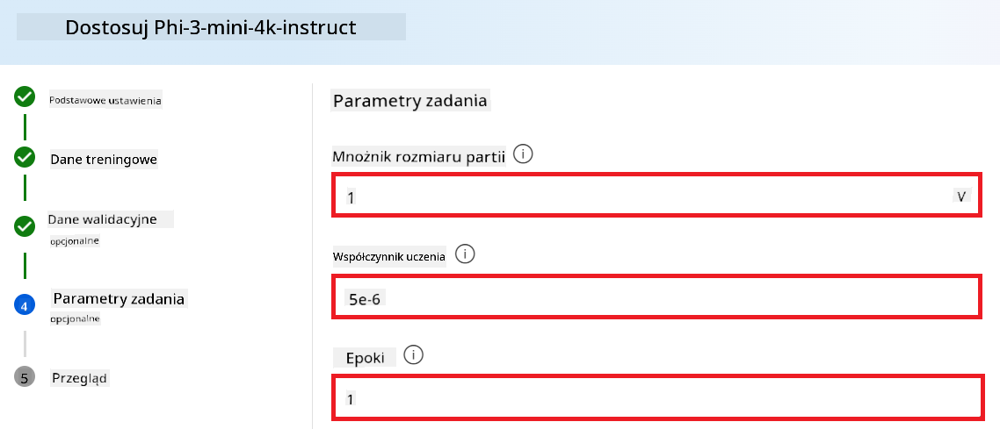
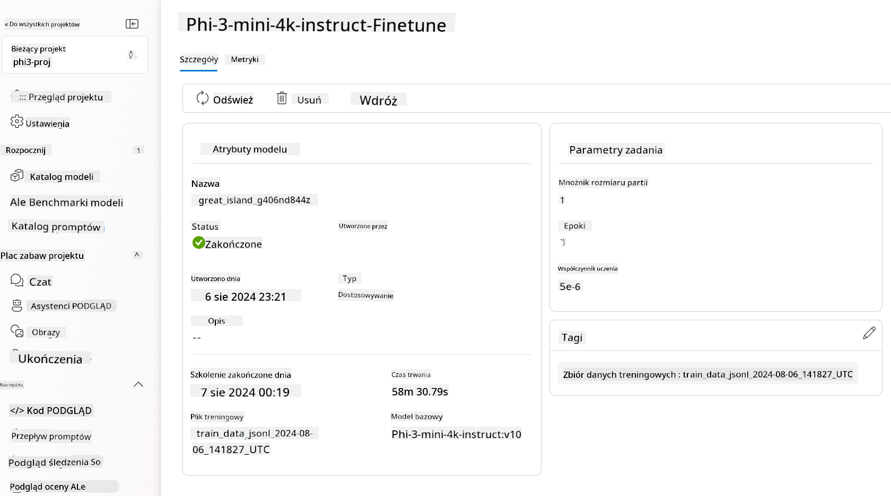

<!--
CO_OP_TRANSLATOR_METADATA:
{
  "original_hash": "c1559c5af6caccf6f623fd43a6b3a9a3",
  "translation_date": "2025-07-17T06:04:24+00:00",
  "source_file": "md/03.FineTuning/FineTuning_AIFoundry.md",
  "language_code": "pl"
}
-->
# Dostosowywanie Phi-3 za pomocą Azure AI Foundry

Poznajmy, jak dostosować model językowy Phi-3 Mini firmy Microsoft za pomocą Azure AI Foundry. Dostosowywanie pozwala na przystosowanie Phi-3 Mini do konkretnych zadań, czyniąc go jeszcze bardziej wydajnym i świadomym kontekstu.

## Uwagi

- **Możliwości:** Które modele można dostosowywać? Do czego można dostosować model bazowy?
- **Koszty:** Jaki jest model cenowy dostosowywania?
- **Możliwość dostosowania:** Jak bardzo mogę modyfikować model bazowy – i w jaki sposób?
- **Wygoda:** Jak przebiega proces dostosowywania – czy muszę pisać własny kod? Czy muszę zapewnić własne zasoby obliczeniowe?
- **Bezpieczeństwo:** Modele dostosowane mogą wiązać się z ryzykiem bezpieczeństwa – czy istnieją zabezpieczenia chroniące przed niezamierzonymi szkodami?



## Przygotowanie do dostosowywania

### Wymagania wstępne

> [!NOTE]
> W przypadku modeli z rodziny Phi-3, oferta dostosowywania w modelu pay-as-you-go jest dostępna tylko dla hubów utworzonych w regionie **East US 2**.

- Subskrypcja Azure. Jeśli nie masz subskrypcji Azure, utwórz [płatne konto Azure](https://azure.microsoft.com/pricing/purchase-options/pay-as-you-go), aby rozpocząć.

- Projekt [AI Foundry](https://ai.azure.com?WT.mc_id=aiml-138114-kinfeylo).
- Kontrola dostępu oparta na rolach Azure (Azure RBAC) jest używana do nadawania uprawnień do operacji w Azure AI Foundry. Aby wykonać kroki opisane w tym artykule, Twoje konto użytkownika musi mieć przypisaną __rolę Azure AI Developer__ w grupie zasobów.

### Rejestracja dostawcy subskrypcji

Sprawdź, czy subskrypcja jest zarejestrowana u dostawcy zasobów `Microsoft.Network`.

1. Zaloguj się do [portalu Azure](https://portal.azure.com).
1. Wybierz **Subskrypcje** z lewego menu.
1. Wybierz subskrypcję, której chcesz użyć.
1. Wybierz **Ustawienia projektu AI** > **Dostawcy zasobów** z lewego menu.
1. Potwierdź, że **Microsoft.Network** znajduje się na liście dostawców zasobów. Jeśli nie, dodaj go.

### Przygotowanie danych

Przygotuj dane treningowe i walidacyjne do dostosowania modelu. Twoje zestawy danych treningowych i walidacyjnych powinny zawierać przykłady wejścia i wyjścia, które pokazują, jak chcesz, aby model działał.

Upewnij się, że wszystkie przykłady treningowe mają oczekiwany format do inferencji. Aby skutecznie dostosować modele, zapewnij zrównoważony i różnorodny zestaw danych.

Oznacza to utrzymanie równowagi danych, uwzględnienie różnych scenariuszy oraz okresowe udoskonalanie danych treningowych, aby odpowiadały rzeczywistym oczekiwaniom, co ostatecznie prowadzi do dokładniejszych i bardziej zrównoważonych odpowiedzi modelu.

Różne typy modeli wymagają różnych formatów danych treningowych.

### Chat Completion

Dane treningowe i walidacyjne, których używasz, **muszą** być sformatowane jako dokument JSON Lines (JSONL). Dla `Phi-3-mini-128k-instruct` zestaw danych do dostosowywania musi być sformatowany w formacie konwersacyjnym używanym przez API Chat completions.

### Przykładowy format pliku

```json
    {"messages": [{"role": "system", "content": "You are an Xbox customer support agent whose primary goal is to help users with issues they are experiencing with their Xbox devices. You are friendly and concise. You only provide factual answers to queries, and do not provide answers that are not related to Xbox."}, {"role": "user", "content": "Is Xbox better than PlayStation?"}, {"role": "assistant", "content": "I apologize, but I cannot provide personal opinions. My primary job is to assist you with any issues related to your Xbox device. Do you have any Xbox-related issues that need addressing?"}]}
    {"messages": [{"role": "system", "content": "You are an Xbox customer support agent whose primary goal is to help users with issues they are experiencing with their Xbox devices. You are friendly and concise. You only provide factual answers to queries, and do not provide answers that are not related to Xbox."}, {"role": "user", "content": "Can I play PC games on my Xbox?"}, {"role": "assistant", "content": "While Xbox consoles don't natively support PC games, they can play an array of Xbox games, many of which are also available on PC. Can I assist you with finding games compatible with your Xbox device?"}]}
    {"messages": [{"role": "system", "content": "You are an Xbox customer support agent whose primary goal is to help users with issues they are experiencing with their Xbox devices. You are friendly and concise. You only provide factual answers to queries, and do not provide answers that are not related to Xbox."}, {"role": "user", "content": "I'm having trouble connecting my Xbox to the Wi-Fi."}, {"role": "assistant", "content": "No worries, let's go through the network settings on your Xbox. Can you please tell me what happens when you try to connect it to the Wi-Fi?"}]}
```

Obsługiwany typ pliku to JSON Lines. Pliki są przesyłane do domyślnego magazynu danych i udostępniane w Twoim projekcie.

## Dostosowywanie Phi-3 za pomocą Azure AI Foundry

Azure AI Foundry pozwala dostosować duże modele językowe do Twoich własnych zbiorów danych za pomocą procesu zwanego fine-tuningiem. Dostosowywanie przynosi znaczące korzyści, umożliwiając personalizację i optymalizację pod kątem konkretnych zadań i zastosowań. Skutkuje to lepszą wydajnością, efektywnością kosztową, zmniejszeniem opóźnień oraz dopasowanymi wynikami.


### Utwórz nowy projekt

1. Zaloguj się do [Azure AI Foundry](https://ai.azure.com).

1. Wybierz **+New project**, aby utworzyć nowy projekt w Azure AI Foundry.

    

1. Wykonaj następujące czynności:

    - Nazwa **Hubu** projektu. Musi być unikalna.
    - Wybierz **Hub**, którego chcesz użyć (utwórz nowy, jeśli to konieczne).

    

1. Wykonaj następujące czynności, aby utworzyć nowy hub:

    - Wprowadź nazwę **Hubu**. Musi być unikalna.
    - Wybierz swoją subskrypcję Azure.
    - Wybierz **Grupę zasobów** do użycia (utwórz nową, jeśli to konieczne).
    - Wybierz **Lokalizację**, której chcesz użyć.
    - Wybierz **Połącz usługi Azure AI** do użycia (utwórz nową, jeśli to konieczne).
    - Wybierz **Połącz Azure AI Search** i zaznacz **Pomiń łączenie**.

    

1. Wybierz **Dalej**.
1. Wybierz **Utwórz projekt**.

### Przygotowanie danych

Przed dostosowywaniem zbierz lub utwórz zestaw danych odpowiedni do Twojego zadania, np. instrukcje czatu, pary pytań i odpowiedzi lub inne istotne dane tekstowe. Oczyść i przetwórz dane, usuwając szumy, uzupełniając brakujące wartości i tokenizując tekst.

### Dostosowywanie modeli Phi-3 w Azure AI Foundry

> [!NOTE]
> Dostosowywanie modeli Phi-3 jest obecnie obsługiwane tylko w projektach zlokalizowanych w regionie East US 2.

1. Wybierz **Model catalog** z lewego panelu.

1. Wpisz *phi-3* w **pasku wyszukiwania** i wybierz model phi-3, którego chcesz użyć.

    

1. Wybierz **Fine-tune**.

    

1. Wprowadź nazwę **Fine-tuned model**.

    

1. Wybierz **Dalej**.

1. Wykonaj następujące czynności:

    - Wybierz **typ zadania** na **Chat completion**.
    - Wybierz **dane treningowe**, których chcesz użyć. Możesz je przesłać przez Azure AI Foundry lub z lokalnego środowiska.

    

1. Wybierz **Dalej**.

1. Prześlij **dane walidacyjne**, których chcesz użyć, lub wybierz **Automatyczny podział danych treningowych**.

    

1. Wybierz **Dalej**.

1. Wykonaj następujące czynności:

    - Wybierz **wielokrotność rozmiaru partii** (Batch size multiplier).
    - Wybierz **współczynnik uczenia** (Learning rate).
    - Wybierz liczbę **epok** (Epochs).

    

1. Wybierz **Zatwierdź**, aby rozpocząć proces dostosowywania.

    

1. Po zakończeniu dostosowywania status modelu będzie widoczny jako **Completed**, jak pokazano na poniższym obrazku. Teraz możesz wdrożyć model i używać go w swojej aplikacji, w playgroundzie lub w prompt flow. Więcej informacji znajdziesz w [Jak wdrożyć modele z rodziny Phi-3 za pomocą Azure AI Foundry](https://learn.microsoft.com/azure/ai-studio/how-to/deploy-models-phi-3?tabs=phi-3-5&pivots=programming-language-python).

    

> [!NOTE]
> Aby uzyskać bardziej szczegółowe informacje na temat dostosowywania Phi-3, odwiedź [Fine-tune Phi-3 models in Azure AI Foundry](https://learn.microsoft.com/azure/ai-studio/how-to/fine-tune-phi-3?tabs=phi-3-mini).

## Usuwanie dostosowanych modeli

Możesz usunąć dostosowany model z listy modeli dostosowanych w [Azure AI Foundry](https://ai.azure.com) lub ze strony szczegółów modelu. Wybierz model do usunięcia na stronie Fine-tuning, a następnie kliknij przycisk Usuń, aby usunąć model.

> [!NOTE]
> Nie możesz usunąć modelu niestandardowego, jeśli ma istniejące wdrożenie. Najpierw musisz usunąć wdrożenie modelu, zanim usuniesz model niestandardowy.

## Koszty i limity

### Koszty i limity dla modeli Phi-3 dostosowywanych jako usługa

Modele Phi dostosowywane jako usługa są oferowane przez Microsoft i zintegrowane z Azure AI Foundry do użytku. Cennik znajdziesz podczas [wdrażania](https://learn.microsoft.com/azure/ai-studio/how-to/deploy-models-phi-3?tabs=phi-3-5&pivots=programming-language-python) lub dostosowywania modeli w zakładce Cennik i warunki w kreatorze wdrożenia.

## Filtrowanie treści

Modele wdrażane jako usługa w modelu pay-as-you-go są chronione przez Azure AI Content Safety. Po wdrożeniu na punktach końcowych w czasie rzeczywistym możesz zrezygnować z tej funkcji. Gdy Azure AI Content Safety jest włączone, zarówno prompt, jak i odpowiedź przechodzą przez zestaw modeli klasyfikacyjnych mających na celu wykrywanie i zapobieganie generowaniu szkodliwych treści. System filtrowania treści wykrywa i podejmuje działania wobec określonych kategorii potencjalnie szkodliwych treści zarówno w promptach, jak i w odpowiedziach. Dowiedz się więcej o [Azure AI Content Safety](https://learn.microsoft.com/azure/ai-studio/concepts/content-filtering).

**Konfiguracja dostosowywania**

Hiperparametry: Zdefiniuj hiperparametry takie jak współczynnik uczenia, rozmiar partii i liczba epok treningowych.

**Funkcja straty**

Wybierz odpowiednią funkcję straty dla swojego zadania (np. cross-entropy).

**Optymalizator**

Wybierz optymalizator (np. Adam) do aktualizacji gradientów podczas treningu.

**Proces dostosowywania**

- Załaduj model wstępnie wytrenowany: Załaduj checkpoint Phi-3 Mini.
- Dodaj warstwy niestandardowe: Dodaj warstwy specyficzne dla zadania (np. głowę klasyfikacyjną dla instrukcji czatu).

**Trening modelu**  
Dostosuj model, korzystając z przygotowanego zestawu danych. Monitoruj postęp treningu i w razie potrzeby dostosuj hiperparametry.

**Ewaluacja i walidacja**

Zestaw walidacyjny: Podziel dane na zestawy treningowe i walidacyjne.

**Ocena wydajności**

Użyj metryk takich jak dokładność, F1-score lub perplexity do oceny wydajności modelu.

## Zapisz dostosowany model

**Checkpoint**  
Zapisz checkpoint dostosowanego modelu do późniejszego użytku.

## Wdrożenie

- Wdróż jako usługę sieciową: Wdróż dostosowany model jako usługę sieciową w Azure AI Foundry.
- Przetestuj punkt końcowy: Wyślij testowe zapytania do wdrożonego punktu końcowego, aby zweryfikować jego działanie.

## Iteruj i ulepszaj

Iteruj: Jeśli wydajność nie jest zadowalająca, wprowadzaj zmiany, dostosowując hiperparametry, dodając więcej danych lub trenując przez kolejne epoki.

## Monitoruj i udoskonalaj

Ciągle monitoruj zachowanie modelu i w razie potrzeby go udoskonalaj.

## Dostosuj i rozszerzaj

Zadania niestandardowe: Phi-3 Mini można dostosować do różnych zadań poza instrukcjami czatu. Eksploruj inne zastosowania!  
Eksperymentuj: Wypróbuj różne architektury, kombinacje warstw i techniki, aby poprawić wydajność.

> [!NOTE]
> Dostosowywanie to proces iteracyjny. Eksperymentuj, ucz się i dostosowuj model, aby osiągnąć najlepsze wyniki dla swojego konkretnego zadania!

**Zastrzeżenie**:  
Niniejszy dokument został przetłumaczony za pomocą usługi tłumaczenia AI [Co-op Translator](https://github.com/Azure/co-op-translator). Mimo że dążymy do jak największej dokładności, prosimy mieć na uwadze, że tłumaczenia automatyczne mogą zawierać błędy lub nieścisłości. Oryginalny dokument w języku źródłowym powinien być uznawany za źródło autorytatywne. W przypadku informacji o kluczowym znaczeniu zalecane jest skorzystanie z profesjonalnego tłumaczenia wykonanego przez człowieka. Nie ponosimy odpowiedzialności za jakiekolwiek nieporozumienia lub błędne interpretacje wynikające z korzystania z tego tłumaczenia.