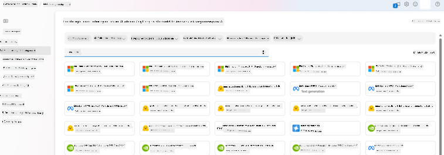
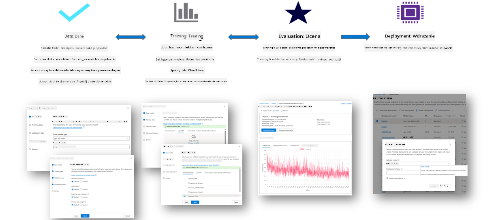
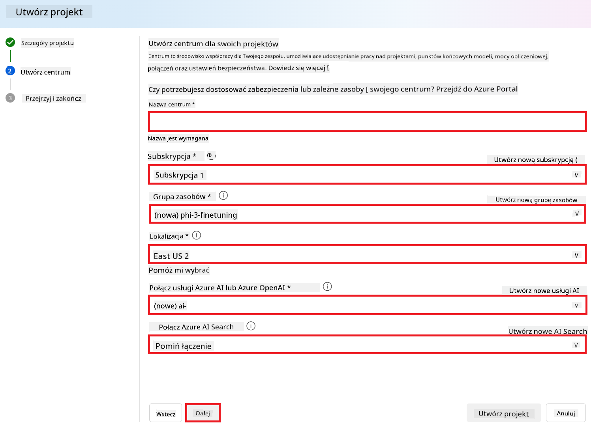
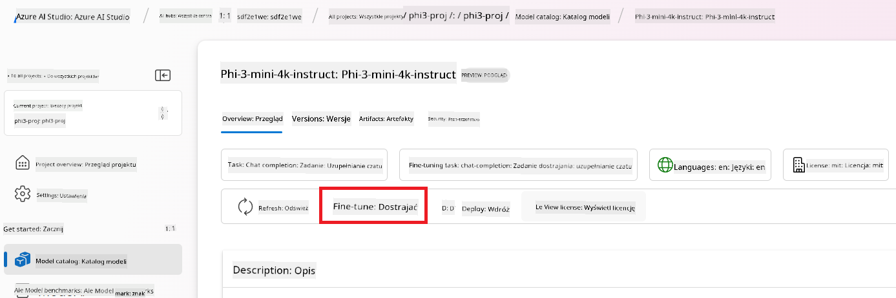
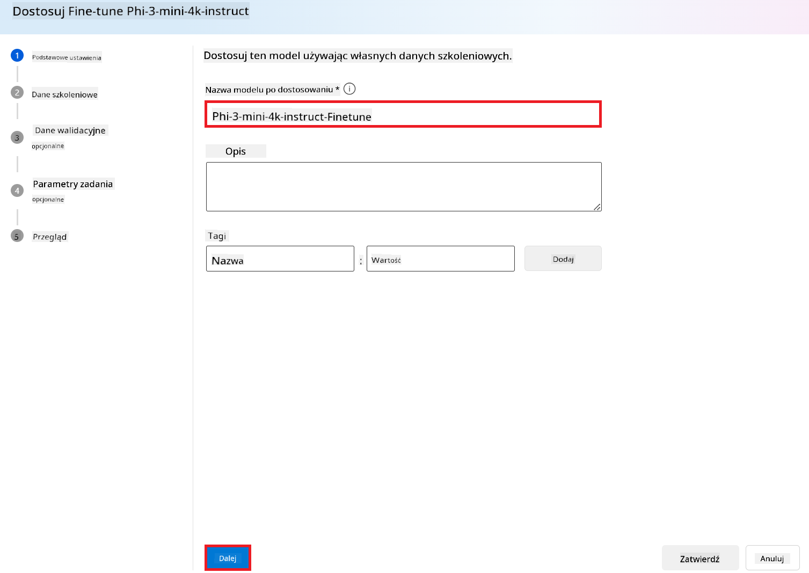
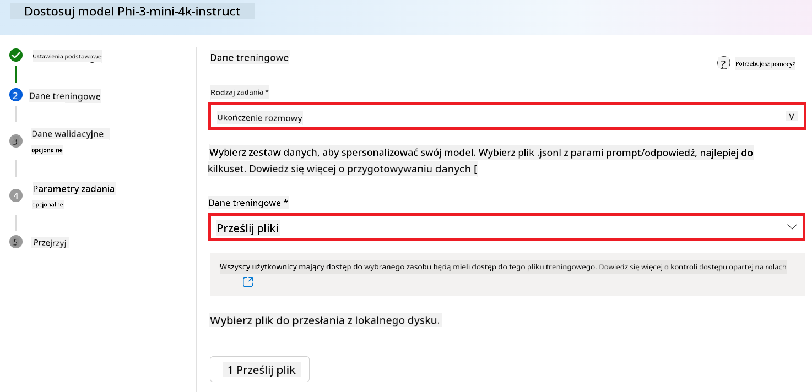
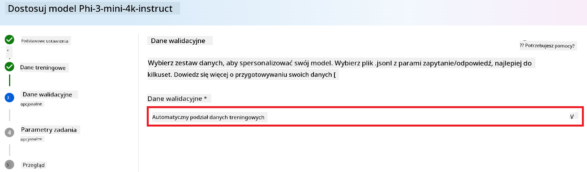
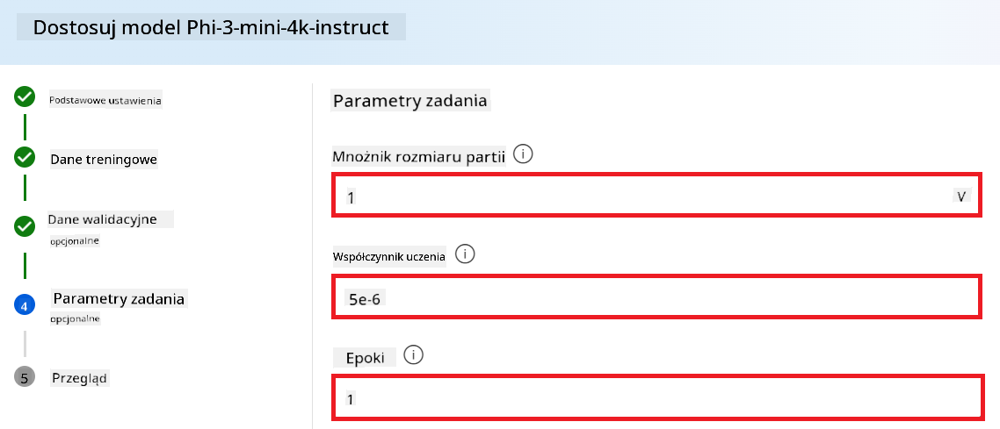
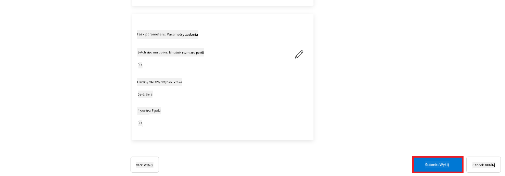

<!--
CO_OP_TRANSLATOR_METADATA:
{
  "original_hash": "c1559c5af6caccf6f623fd43a6b3a9a3",
  "translation_date": "2025-05-09T20:30:30+00:00",
  "source_file": "md/03.FineTuning/FineTuning_AIFoundry.md",
  "language_code": "pl"
}
-->
# Dostosowywanie Phi-3 z Azure AI Foundry

Przyjrzyjmy się, jak dostosować model językowy Phi-3 Mini firmy Microsoft za pomocą Azure AI Foundry. Dostosowywanie pozwala na przystosowanie Phi-3 Mini do konkretnych zadań, czyniąc go jeszcze bardziej wydajnym i świadomym kontekstu.

## Uwagi

- **Możliwości:** Które modele można dostosowywać? Do czego można dostosować model bazowy?
- **Koszty:** Jaki jest model cenowy dla dostosowywania?
- **Możliwość dostosowania:** W jakim stopniu mogę modyfikować model bazowy – i na jakie sposoby?
- **Wygoda:** Jak przebiega proces dostosowywania – czy muszę pisać własny kod? Czy muszę zapewnić własne zasoby obliczeniowe?
- **Bezpieczeństwo:** Modele dostosowane niosą ze sobą ryzyko związane z bezpieczeństwem – czy są jakieś zabezpieczenia chroniące przed niezamierzonymi szkodami?



## Przygotowanie do dostosowywania

### Wymagania wstępne

> [!NOTE]
> W przypadku modeli z rodziny Phi-3, oferta dostosowywania w modelu pay-as-you-go jest dostępna tylko dla hubów utworzonych w regionie **East US 2**.

- Subskrypcja Azure. Jeśli nie masz subskrypcji, utwórz [płatne konto Azure](https://azure.microsoft.com/pricing/purchase-options/pay-as-you-go), aby rozpocząć.

- Projekt [AI Foundry](https://ai.azure.com?WT.mc_id=aiml-138114-kinfeylo).
- Do zarządzania dostępem do operacji w Azure AI Foundry używane są role oparte na Azure RBAC. Aby wykonać kroki opisane w tym artykule, Twoje konto użytkownika musi mieć przypisaną rolę __Azure AI Developer__ w grupie zasobów.

### Rejestracja dostawcy subskrypcji

Sprawdź, czy subskrypcja jest zarejestrowana u dostawcy zasobów `Microsoft.Network`.

1. Zaloguj się do [portalu Azure](https://portal.azure.com).
1. Wybierz **Subskrypcje** z menu po lewej stronie.
1. Wybierz subskrypcję, której chcesz użyć.
1. Wybierz **Ustawienia projektu AI** > **Dostawcy zasobów** z menu po lewej stronie.
1. Potwierdź, że na liście znajduje się **Microsoft.Network**. Jeśli nie, dodaj go.

### Przygotowanie danych

Przygotuj dane treningowe i walidacyjne do dostosowania modelu. Twoje zestawy danych treningowych i walidacyjnych powinny zawierać przykłady wejścia i wyjścia pokazujące, jak chcesz, aby model działał.

Upewnij się, że wszystkie przykłady treningowe mają oczekiwany format do inferencji. Aby skutecznie dostosować modele, zapewnij zrównoważony i różnorodny zestaw danych.

Oznacza to utrzymanie równowagi danych, uwzględnienie różnych scenariuszy oraz okresowe udoskonalanie danych treningowych, aby odpowiadały rzeczywistym oczekiwaniom, co prowadzi do dokładniejszych i bardziej zrównoważonych odpowiedzi modelu.

Różne typy modeli wymagają różnych formatów danych treningowych.

### Chat Completion

Dane treningowe i walidacyjne, których używasz, **muszą** być sformatowane jako dokument JSON Lines (JSONL). Dla `Phi-3-mini-128k-instruct` zestaw danych do dostosowywania musi mieć format konwersacyjny, używany przez API Chat completions.

### Przykładowy format pliku

```json
    {"messages": [{"role": "system", "content": "You are an Xbox customer support agent whose primary goal is to help users with issues they are experiencing with their Xbox devices. You are friendly and concise. You only provide factual answers to queries, and do not provide answers that are not related to Xbox."}, {"role": "user", "content": "Is Xbox better than PlayStation?"}, {"role": "assistant", "content": "I apologize, but I cannot provide personal opinions. My primary job is to assist you with any issues related to your Xbox device. Do you have any Xbox-related issues that need addressing?"}]}
    {"messages": [{"role": "system", "content": "You are an Xbox customer support agent whose primary goal is to help users with issues they are experiencing with their Xbox devices. You are friendly and concise. You only provide factual answers to queries, and do not provide answers that are not related to Xbox."}, {"role": "user", "content": "Can I play PC games on my Xbox?"}, {"role": "assistant", "content": "While Xbox consoles don't natively support PC games, they can play an array of Xbox games, many of which are also available on PC. Can I assist you with finding games compatible with your Xbox device?"}]}
    {"messages": [{"role": "system", "content": "You are an Xbox customer support agent whose primary goal is to help users with issues they are experiencing with their Xbox devices. You are friendly and concise. You only provide factual answers to queries, and do not provide answers that are not related to Xbox."}, {"role": "user", "content": "I'm having trouble connecting my Xbox to the Wi-Fi."}, {"role": "assistant", "content": "No worries, let's go through the network settings on your Xbox. Can you please tell me what happens when you try to connect it to the Wi-Fi?"}]}
```

Obsługiwany typ pliku to JSON Lines. Pliki są przesyłane do domyślnego magazynu danych i udostępniane w Twoim projekcie.

## Dostosowywanie Phi-3 z Azure AI Foundry

Azure AI Foundry pozwala dostosować duże modele językowe do Twoich własnych zbiorów danych, wykorzystując proces zwany fine-tuningiem. Dostosowywanie przynosi znaczące korzyści, umożliwiając personalizację i optymalizację pod kątem konkretnych zadań i zastosowań. Skutkuje to lepszą wydajnością, oszczędnością kosztów, zmniejszeniem opóźnień oraz dopasowanymi wynikami.



### Utwórz nowy projekt

1. Zaloguj się do [Azure AI Foundry](https://ai.azure.com).

1. Wybierz **+New project**, aby utworzyć nowy projekt w Azure AI Foundry.

    

1. Wykonaj następujące zadania:

    - Nazwa **Hubu** projektu. Musi być unikalna.
    - Wybierz **Hub**, którego chcesz użyć (utwórz nowy, jeśli to konieczne).

    

1. Wykonaj następujące kroki, aby utworzyć nowy hub:

    - Wprowadź nazwę **Hubu**. Musi być unikalna.
    - Wybierz swoją subskrypcję Azure (**Subscription**).
    - Wybierz grupę zasobów (**Resource group**) do użycia (utwórz nową, jeśli to konieczne).
    - Wybierz lokalizację (**Location**), którą chcesz użyć.
    - Wybierz **Connect Azure AI Services** do użycia (utwórz nową, jeśli to konieczne).
    - Wybierz **Connect Azure AI Search** i opcję **Skip connecting**.

    

1. Wybierz **Next**.
1. Wybierz **Create a project**.

### Przygotowanie danych

Przed dostosowywaniem zbierz lub utwórz zbiór danych odpowiedni do Twojego zadania, na przykład instrukcje czatu, pary pytanie-odpowiedź lub inne odpowiednie dane tekstowe. Oczyść i przetwórz dane, usuwając szumy, obsługując brakujące wartości i tokenizując tekst.

### Dostosowywanie modeli Phi-3 w Azure AI Foundry

> [!NOTE]
> Dostosowywanie modeli Phi-3 jest obecnie obsługiwane tylko w projektach zlokalizowanych w regionie East US 2.

1. Wybierz **Model catalog** z menu po lewej stronie.

1. Wpisz *phi-3* w **pasku wyszukiwania** i wybierz model phi-3, którego chcesz użyć.

    

1. Wybierz **Fine-tune**.

    

1. Wprowadź nazwę **Fine-tuned model name**.

    

1. Wybierz **Next**.

1. Wykonaj następujące czynności:

    - Wybierz **task type** jako **Chat completion**.
    - Wybierz dane treningowe (**Training data**), których chcesz użyć. Możesz je przesłać za pomocą Azure AI Foundry lub z lokalnego środowiska.

    

1. Wybierz **Next**.

1. Prześlij dane walidacyjne (**Validation data**), których chcesz użyć lub wybierz **Automatic split of training data**.

    

1. Wybierz **Next**.

1. Wykonaj następujące czynności:

    - Wybierz **Batch size multiplier**.
    - Wybierz **Learning rate**.
    - Wybierz **Epochs**.

    

1. Wybierz **Submit**, aby rozpocząć proces dostosowywania.

    

1. Po zakończeniu dostosowywania modelu status będzie widoczny jako **Completed**, jak pokazano na poniższym obrazku. Teraz możesz wdrożyć model i używać go w swojej aplikacji, w playgroundzie lub w prompt flow. Więcej informacji znajdziesz w [Jak wdrożyć modele z rodziny Phi-3 za pomocą Azure AI Foundry](https://learn.microsoft.com/azure/ai-studio/how-to/deploy-models-phi-3?tabs=phi-3-5&pivots=programming-language-python).

    

> [!NOTE]
> Aby uzyskać bardziej szczegółowe informacje o dostosowywaniu Phi-3, odwiedź [Fine-tune Phi-3 models in Azure AI Foundry](https://learn.microsoft.com/azure/ai-studio/how-to/fine-tune-phi-3?tabs=phi-3-mini).

## Czyszczenie dostosowanych modeli

Możesz usunąć dostosowany model z listy modeli dostosowywanych w [Azure AI Foundry](https://ai.azure.com) lub ze strony szczegółów modelu. Wybierz dostosowany model do usunięcia na stronie Fine-tuning, a następnie kliknij przycisk Delete, aby go usunąć.

> [!NOTE]
> Nie możesz usunąć modelu niestandardowego, jeśli ma on aktywne wdrożenie. Najpierw musisz usunąć wdrożenie modelu, aby móc usunąć model niestandardowy.

## Koszty i limity

### Uwagi dotyczące kosztów i limitów dla modeli Phi-3 dostosowywanych jako usługa

Modele Phi dostosowywane jako usługa są oferowane przez Microsoft i zintegrowane z Azure AI Foundry do użytku. Cennik znajdziesz podczas [wdrażania](https://learn.microsoft.com/azure/ai-studio/how-to/deploy-models-phi-3?tabs=phi-3-5&pivots=programming-language-python) lub dostosowywania modeli w zakładce Pricing and terms w kreatorze wdrożenia.

## Filtrowanie treści

Modele wdrażane jako usługa w modelu pay-as-you-go są chronione przez Azure AI Content Safety. Po wdrożeniu na endpointy czasu rzeczywistego możesz zrezygnować z tej funkcji. Gdy Azure AI Content Safety jest włączone, zarówno prompt, jak i completion przechodzą przez zestaw modeli klasyfikacyjnych mających na celu wykrywanie i zapobieganie generowaniu szkodliwych treści. System filtrowania wykrywa i podejmuje działania wobec określonych kategorii potencjalnie szkodliwych treści w promptach i wynikach. Dowiedz się więcej o [Azure AI Content Safety](https://learn.microsoft.com/azure/ai-studio/concepts/content-filtering).

**Konfiguracja dostosowywania**

Hiperparametry: Określ hiperparametry takie jak learning rate, batch size i liczbę epok treningowych.

**Funkcja straty**

Wybierz odpowiednią funkcję straty dla swojego zadania (np. cross-entropy).

**Optymalizator**

Wybierz optymalizator (np. Adam) do aktualizacji gradientów podczas treningu.

**Proces dostosowywania**

- Załaduj model wstępnie wytrenowany: Załaduj checkpoint Phi-3 Mini.
- Dodaj warstwy niestandardowe: Dodaj warstwy specyficzne dla zadania (np. głowę klasyfikacyjną dla instrukcji czatu).

**Trening modelu**
Dostosuj model, korzystając z przygotowanego zestawu danych. Monitoruj postęp treningu i w razie potrzeby dostosuj hiperparametry.

**Ewaluacja i walidacja**

Zestaw walidacyjny: Podziel dane na zestawy treningowe i walidacyjne.

**Ocena wydajności**

Użyj metryk takich jak accuracy, F1-score lub perplexity, aby ocenić wydajność modelu.

## Zapisz dostosowany model

**Checkpoint**
Zapisz checkpoint dostosowanego modelu do późniejszego wykorzystania.

## Wdrożenie

- Wdróż jako usługę sieciową: Wdróż swój dostosowany model jako usługę webową w Azure AI Foundry.
- Przetestuj endpoint: Wyślij testowe zapytania do wdrożonego endpointu, aby zweryfikować jego działanie.

## Iteruj i ulepszaj

Iteruj: Jeśli wydajność nie jest zadowalająca, wprowadzaj zmiany, dostosowując hiperparametry, dodając więcej danych lub trenując przez kolejne epoki.

## Monitoruj i udoskonalaj

Nieustannie monitoruj zachowanie modelu i w razie potrzeby go udoskonalaj.

## Dostosuj i rozszerzaj

Zadania niestandardowe: Phi-3 Mini można dostosować do różnych zadań poza instrukcjami czatu. Eksploruj inne zastosowania!
Eksperymentuj: Wypróbuj różne architektury, kombinacje warstw i techniki, aby poprawić wydajność.

> [!NOTE]
> Dostosowywanie to proces iteracyjny. Eksperymentuj, ucz się i dopasowuj model, aby osiągnąć najlepsze wyniki dla swojego konkretnego zadania!

**Zastrzeżenie**:  
Niniejszy dokument został przetłumaczony przy użyciu usługi tłumaczenia AI [Co-op Translator](https://github.com/Azure/co-op-translator). Mimo że dążymy do dokładności, prosimy pamiętać, że automatyczne tłumaczenia mogą zawierać błędy lub nieścisłości. Oryginalny dokument w języku źródłowym powinien być uznawany za źródło wiarygodne. W przypadku informacji krytycznych zaleca się skorzystanie z profesjonalnego tłumaczenia wykonanego przez człowieka. Nie ponosimy odpowiedzialności za jakiekolwiek nieporozumienia lub błędne interpretacje wynikające z korzystania z tego tłumaczenia.