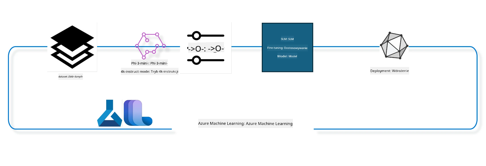

## Jak używać komponentów chat-completion z rejestru systemu Azure ML do dopasowywania modelu

W tym przykładzie przeprowadzimy fine tuning modelu Phi-3-mini-4k-instruct, aby ukończyć rozmowę między 2 osobami, korzystając z zestawu danych ultrachat_200k.



Przykład pokaże, jak przeprowadzić fine tuning przy użyciu Azure ML SDK i Pythona, a następnie wdrożyć dostrojony model do punktu końcowego online do inferencji w czasie rzeczywistym.

### Dane treningowe

Użyjemy zestawu danych ultrachat_200k. Jest to mocno przefiltrowana wersja zestawu UltraChat i był on użyty do treningu Zephyr-7B-β, nowoczesnego modelu chat o wielkości 7 mld parametrów.

### Model

Użyjemy modelu Phi-3-mini-4k-instruct, aby pokazać, jak użytkownik może dopasować model do zadania chat-completion. Jeśli otworzyłeś ten notatnik z konkretnej karty modelu, pamiętaj, aby zastąpić nazwę konkretnego modelu.

### Zadania

- Wybierz model do fine tuningu.
- Wybierz i zbadaj dane treningowe.
- Skonfiguruj zadanie fine tuningu.
- Uruchom zadanie fine tuningu.
- Przejrzyj metryki treningu i ewaluacji.
- Zarejestruj dostrojony model.
- Wdróż dostrojony model do inferencji w czasie rzeczywistym.
- Posprzątaj zasoby.

## 1. Przygotowanie wymagań wstępnych

- Zainstaluj zależności
- Połącz się z AzureML Workspace. Dowiedz się więcej o ustawianiu uwierzytelniania SDK. Zamień <WORKSPACE_NAME>, <RESOURCE_GROUP> oraz <SUBSCRIPTION_ID> poniżej.
- Połącz się z rejestrem systemowym azureml
- Ustaw opcjonalną nazwę eksperymentu
- Sprawdź lub utwórz środowisko compute.

> [!NOTE]
> Wymagania: pojedynczy węzeł GPU może mieć wiele kart GPU. Na przykład w jednym węźle Standard_NC24rs_v3 jest 4 NVIDIA V100 GPU, podczas gdy w Standard_NC12s_v3 są 2 NVIDIA V100 GPU. Zapoznaj się z dokumentacją, aby uzyskać te informacje. Liczba kart GPU na węzeł jest ustawiana parametrem gpus_per_node poniżej. Poprawne ustawienie tego parametru zapewni wykorzystanie wszystkich GPU w węźle. Zalecane SKU dla GPU można znaleźć tutaj i tutaj.

### Biblioteki Pythona

Zainstaluj zależności, uruchamiając poniższą komórkę. Nie jest to opcjonalny krok, jeśli uruchamiasz w nowym środowisku.

```bash
pip install azure-ai-ml
pip install azure-identity
pip install datasets==2.9.0
pip install mlflow
pip install azureml-mlflow
```

### Interakcja z Azure ML

1. Ten skrypt Pythona służy do interakcji z usługą Azure Machine Learning (Azure ML). Oto, co robi:

    - Importuje niezbędne moduły z pakietów azure.ai.ml, azure.identity i azure.ai.ml.entities. Importuje również moduł time.

    - Próbuje uwierzytelnić się za pomocą DefaultAzureCredential(), które upraszcza proces uwierzytelniania, aby szybko rozpocząć tworzenie aplikacji uruchamianych w chmurze Azure. Jeśli to się nie powiedzie, używa InteractiveBrowserCredential(), które dostarcza interaktywne okno logowania.

    - Następnie próbuje utworzyć instancję MLClient za pomocą metody from_config, która odczytuje konfigurację z domyślnego pliku konfiguracyjnego (config.json). Jeśli to się nie powiedzie, tworzy instancję MLClient, podając ręcznie subscription_id, resource_group_name oraz workspace_name.

    - Tworzy kolejną instancję MLClient, tym razem dla rejestru Azure ML o nazwie "azureml". Ten rejestr przechowuje modele, pipeline'y fine tuningu oraz środowiska.

    - Ustawia nazwę eksperymentu na "chat_completion_Phi-3-mini-4k-instruct".

    - Generuje unikalny znacznik czasu przez konwersję aktualnego czasu (w sekundach od epoki, jako liczba zmiennoprzecinkowa) na liczbę całkowitą, a następnie na ciąg znaków. Ten znacznik czasu może służyć do tworzenia unikalnych nazw i wersji.

    ```python
    # Importuj niezbędne moduły z Azure ML i Azure Identity
    from azure.ai.ml import MLClient
    from azure.identity import (
        DefaultAzureCredential,
        InteractiveBrowserCredential,
    )
    from azure.ai.ml.entities import AmlCompute
    import time  # Importuj moduł time
    
    # Spróbuj uwierzytelnić się za pomocą DefaultAzureCredential
    try:
        credential = DefaultAzureCredential()
        credential.get_token("https://management.azure.com/.default")
    except Exception as ex:  # Jeśli DefaultAzureCredential się nie powiedzie, użyj InteractiveBrowserCredential
        credential = InteractiveBrowserCredential()
    
    # Spróbuj utworzyć instancję MLClient używając domyślnego pliku konfiguracyjnego
    try:
        workspace_ml_client = MLClient.from_config(credential=credential)
    except:  # Jeśli to się nie powiedzie, utwórz instancję MLClient podając dane ręcznie
        workspace_ml_client = MLClient(
            credential,
            subscription_id="<SUBSCRIPTION_ID>",
            resource_group_name="<RESOURCE_GROUP>",
            workspace_name="<WORKSPACE_NAME>",
        )
    
    # Utwórz kolejną instancję MLClient dla rejestru Azure ML o nazwie "azureml"
    # W tym rejestrze przechowywane są modele, potoki dostrajania oraz środowiska
    registry_ml_client = MLClient(credential, registry_name="azureml")
    
    # Ustaw nazwę eksperymentu
    experiment_name = "chat_completion_Phi-3-mini-4k-instruct"
    
    # Wygeneruj unikalny znacznik czasu, który może być używany do nazw i wersji wymagających unikalności
    timestamp = str(int(time.time()))
    ```

## 2. Wybierz model bazowy do fine tuningu

1. Phi-3-mini-4k-instruct to model o 3,8 mld parametrach, lekki, nowoczesny model otwarty oparty na zestawach danych używanych dla Phi-2. Model należy do rodziny modeli Phi-3, a wersja Mini występuje w dwóch wariantach: 4K i 128K, co oznacza długość kontekstu (w tokenach), którą może obsłużyć. Musimy dostroić model do naszego specjalnego celu, by go użyć. Możesz przeglądać te modele w Katalogu Modeli w AzureML Studio, filtrując po zadaniu chat-completion. W tym przykładzie używamy modelu Phi-3-mini-4k-instruct. Jeśli otworzyłeś ten notatnik dla innego modelu, odpowiednio zmień nazwę i wersję modelu.

> [!NOTE]
> właściwość id modelu. Będzie ona przekazana jako wejście do zadania fine tuningu. Jest ona również dostępna jako pole Asset ID na stronie szczegółów modelu w katalogu modeli AzureML Studio.

2. Ten skrypt Pythona wchodzi w interakcję z usługą Azure Machine Learning (Azure ML). Oto, co robi:

    - Ustawia model_name na "Phi-3-mini-4k-instruct".

    - Używa metody get właściwości models obiektu registry_ml_client, aby pobrać najnowszą wersję modelu o określonej nazwie z rejestru Azure ML. Metoda get jest wywoływana z dwoma argumentami: nazwą modelu oraz etykietą wskazującą, że ma być pobrana najnowsza wersja modelu.

    - Wypisuje na konsoli komunikat z nazwą, wersją oraz id modelu, który będzie używany do fine tuningu. Metoda format łańcucha znaków wstawia nazwę, wersję i id modelu do komunikatu. Właściwości name, version oraz id modelu są pobierane z obiektu foundation_model.

    ```python
    # Ustaw nazwę modelu
    model_name = "Phi-3-mini-4k-instruct"
    
    # Pobierz najnowszą wersję modelu z rejestru Azure ML
    foundation_model = registry_ml_client.models.get(model_name, label="latest")
    
    # Wydrukuj nazwę modelu, wersję i identyfikator
    # Te informacje są przydatne do śledzenia i debugowania
    print(
        "\n\nUsing model name: {0}, version: {1}, id: {2} for fine tuning".format(
            foundation_model.name, foundation_model.version, foundation_model.id
        )
    )
    ```

## 3. Utwórz środowisko compute do użycia z zadaniem

Zadanie fine tune działa TYLKO z obliczeniami GPU. Rozmiar środowiska compute zależy od wielkości modelu i w większości przypadków trudno jest dobrać odpowiednie środowisko. W tej komórce prowadzimy użytkownika w wyborze odpowiedniego środowiska.

> [!NOTE]
> Poniżej wymienione środowiska compute działają z najbardziej zoptymalizowaną konfiguracją. Jakiekolwiek zmiany w konfiguracji mogą prowadzić do błędu Cuda Out Of Memory. W takich przypadkach spróbuj zwiększyć rozmiar środowiska compute.

> [!NOTE]
> Podczas wyboru compute_cluster_size upewnij się, że środowisko compute jest dostępne w twojej grupie zasobów. Jeśli dane compute nie jest dostępne, możesz złożyć prośbę o dostęp do zasobów compute.

### Sprawdzanie modelu pod kątem wsparcia dla fine tuningu

1. Ten skrypt Pythona wchodzi w interakcję z modelem Azure Machine Learning (Azure ML). Oto, co robi:

    - Importuje moduł ast, który zapewnia funkcje do przetwarzania drzew składni abstrakcyjnej Pythona.

    - Sprawdza, czy obiekt foundation_model (reprezentujący model w Azure ML) zawiera tag o nazwie finetune_compute_allow_list. Tagami w Azure ML są pary klucz-wartość, które można tworzyć oraz używać do filtrowania i sortowania modeli.

    - Jeśli tag finetune_compute_allow_list jest obecny, używa funkcji ast.literal_eval do bezpiecznego sparsowania wartości tagu (ciągu znaków) do listy Pythona. Lista ta jest następnie przypisana do zmiennej computes_allow_list. Następnie wypisuje komunikat wskazujący, że należy utworzyć compute z tej listy.

    - Jeśli tag finetune_compute_allow_list nie jest obecny, ustawia computes_allow_list na None i wypisuje komunikat, że tag nie jest częścią tagów modelu.

    - Podsumowując, skrypt sprawdza istnienie konkretnego tagu w metadanych modelu, konwertuje jego wartość na listę, jeśli istnieje i dostarcza odpowiednią informację zwrotną użytkownikowi.

    ```python
    # Importuj moduł ast, który udostępnia funkcje do przetwarzania drzew składni abstrakcyjnej Pythona
    import ast
    
    # Sprawdź, czy tag 'finetune_compute_allow_list' jest obecny w tagach modelu
    if "finetune_compute_allow_list" in foundation_model.tags:
        # Jeśli tag jest obecny, użyj ast.literal_eval, aby bezpiecznie przekształcić wartość tagu (łańcuch znaków) w listę Pythona
        computes_allow_list = ast.literal_eval(
            foundation_model.tags["finetune_compute_allow_list"]
        )  # konwertuj łańcuch znaków na listę Pythona
        # Wydrukuj komunikat wskazujący, że obliczenia powinny zostać utworzone z listy
        print(f"Please create a compute from the above list - {computes_allow_list}")
    else:
        # Jeśli tag nie jest obecny, ustaw computes_allow_list na None
        computes_allow_list = None
        # Wydrukuj komunikat wskazujący, że tag 'finetune_compute_allow_list' nie jest częścią tagów modelu
        print("`finetune_compute_allow_list` is not part of model tags")
    ```

### Sprawdzanie instancji compute

1. Ten skrypt Pythona wchodzi w interakcję z usługą Azure Machine Learning (Azure ML) i wykonuje kilka kontroli instancji compute. Oto, co robi:

    - Próbuje pobrać instancję compute o nazwie przechowywanej w compute_cluster z przestrzeni roboczej Azure ML. Jeśli stan provisioningowy compute to "failed", zgłasza błąd ValueError.

    - Sprawdza, czy computes_allow_list nie jest None. Jeśli nie jest, konwertuje wszystkie rozmiary compute w liście na małe litery i sprawdza, czy rozmiar bieżącej instancji compute znajduje się na tej liście. Jeśli nie, zgłasza błąd ValueError.

    - Jeśli computes_allow_list jest None, sprawdza, czy rozmiar instancji compute znajduje się na liście nieobsługiwanych rozmiarów GPU VM. Jeśli tak, zgłasza błąd ValueError.

    - Pobiera listę wszystkich dostępnych rozmiarów compute w przestrzeni roboczej. Następnie iteruje po tej liście i dla każdego rozmiaru sprawdza, czy jego nazwa odpowiada rozmiarowi bieżącej instancji compute. Jeśli tak, pobiera liczbę GPU dla tego rozmiaru i ustawia gpu_count_found na True.

    - Jeśli gpu_count_found jest True, wypisuje liczbę GPU w instancji compute. Jeśli gpu_count_found jest False, zgłasza błąd ValueError.

    - Podsumowując, skrypt wykonuje kilka kontroli instancji compute w przestrzeni roboczej Azure ML, w tym sprawdzanie stanu provisioningowego, rozmiaru względem listy dozwolonych lub niedozwolonych oraz liczbę GPU.

    ```python
    # Wydrukuj komunikat wyjątku
    print(e)
    # Wyrzuć wyjątek ValueError, jeśli rozmiar obliczeniowy nie jest dostępny w obszarze roboczym
    raise ValueError(
        f"WARNING! Compute size {compute_cluster_size} not available in workspace"
    )
    
    # Pobierz instancję obliczeniową z obszaru roboczego Azure ML
    compute = workspace_ml_client.compute.get(compute_cluster)
    # Sprawdź, czy stan provisioningowy instancji obliczeniowej to "failed"
    if compute.provisioning_state.lower() == "failed":
        # Wyrzuć wyjątek ValueError, jeśli stan provisioningowy to "failed"
        raise ValueError(
            f"Provisioning failed, Compute '{compute_cluster}' is in failed state. "
            f"please try creating a different compute"
        )
    
    # Sprawdź, czy computes_allow_list nie jest None
    if computes_allow_list is not None:
        # Przekonwertuj wszystkie rozmiary obliczeniowe w computes_allow_list na małe litery
        computes_allow_list_lower_case = [x.lower() for x in computes_allow_list]
        # Sprawdź, czy rozmiar instancji obliczeniowej jest w computes_allow_list_lower_case
        if compute.size.lower() not in computes_allow_list_lower_case:
            # Wyrzuć wyjątek ValueError, jeśli rozmiar instancji obliczeniowej nie jest w computes_allow_list_lower_case
            raise ValueError(
                f"VM size {compute.size} is not in the allow-listed computes for finetuning"
            )
    else:
        # Zdefiniuj listę nieobsługiwanych rozmiarów VM GPU
        unsupported_gpu_vm_list = [
            "standard_nc6",
            "standard_nc12",
            "standard_nc24",
            "standard_nc24r",
        ]
        # Sprawdź, czy rozmiar instancji obliczeniowej jest na liście unsupported_gpu_vm_list
        if compute.size.lower() in unsupported_gpu_vm_list:
            # Wyrzuć wyjątek ValueError, jeśli rozmiar instancji obliczeniowej jest na liście unsupported_gpu_vm_list
            raise ValueError(
                f"VM size {compute.size} is currently not supported for finetuning"
            )
    
    # Zainicjuj flagę do sprawdzenia, czy liczba GPU w instancji obliczeniowej została znaleziona
    gpu_count_found = False
    # Pobierz listę wszystkich dostępnych rozmiarów obliczeniowych w obszarze roboczym
    workspace_compute_sku_list = workspace_ml_client.compute.list_sizes()
    available_sku_sizes = []
    # Iteruj po liście dostępnych rozmiarów obliczeniowych
    for compute_sku in workspace_compute_sku_list:
        available_sku_sizes.append(compute_sku.name)
        # Sprawdź, czy nazwa rozmiaru obliczeniowego odpowiada rozmiarowi instancji obliczeniowej
        if compute_sku.name.lower() == compute.size.lower():
            # Jeśli tak, pobierz liczbę GPU dla tego rozmiaru obliczeniowego i ustaw gpu_count_found na True
            gpus_per_node = compute_sku.gpus
            gpu_count_found = True
    # Jeśli gpu_count_found jest True, wydrukuj liczbę GPU w instancji obliczeniowej
    if gpu_count_found:
        print(f"Number of GPU's in compute {compute.size}: {gpus_per_node}")
    else:
        # Jeśli gpu_count_found jest False, wyrzuć wyjątek ValueError
        raise ValueError(
            f"Number of GPU's in compute {compute.size} not found. Available skus are: {available_sku_sizes}."
            f"This should not happen. Please check the selected compute cluster: {compute_cluster} and try again."
        )
    ```

## 4. Wybierz zestaw danych do fine tuningu modelu

1. Używamy zestawu danych ultrachat_200k. Zestaw danych ma cztery podziały, odpowiednie do nadzorowanego fine tuningu (sft). Ranking generacji (gen). Liczba przykładów na podział jest przedstawiona poniżej:

    ```bash
    train_sft test_sft  train_gen  test_gen
    207865  23110  256032  28304
    ```

1. Kolejne komórki pokazują podstawowe przygotowanie danych do fine tuningu:

### Wizualizacja kilku wierszy danych

Chcemy, aby ta próba działała szybko, więc zachowujemy pliki train_sft i test_sft zawierające 5% już przyciętych wierszy. Oznacza to, że dostrojony model będzie miał niższą dokładność, dlatego nie powinien być używany w środowisku produkcyjnym. 
Skrypt download-dataset.py jest używany do pobrania zestawu ultrachat_200k i przekształcenia go do formatu kompatybilnego z komponentem pipeline fine tuningu. Ponieważ zestaw jest duży, tutaj mamy tylko jego fragment.

1. Uruchomienie poniższego skryptu pobiera tylko 5% danych. Można to zwiększyć zmieniając parametr dataset_split_pc na żądany procent.

> [!NOTE]
> Niektóre modele językowe używają różnych kodów języków, dlatego nazwy kolumn w zestawie danych powinny odzwierciedlać te różnice.

1. Oto przykład, jak powinny wyglądać dane
Zestaw danych do chat-completion jest przechowywany w formacie parquet, gdzie każdy wpis używa następującego schematu:

    - Jest to dokument JSON (JavaScript Object Notation), który jest popularnym formatem wymiany danych. Nie jest to kod wykonywalny, a sposób przechowywania i przesyłania danych. Oto podział jego struktury:

    - "prompt": Ten klucz zawiera wartość tekstową reprezentującą zadanie lub pytanie skierowane do asystenta AI.

    - "messages": Ten klucz zawiera tablicę obiektów. Każdy obiekt reprezentuje wiadomość w konwersacji między użytkownikiem a asystentem AI. Każda wiadomość ma dwa klucze:

    - "content": Klucz trzyma tekst zawartości wiadomości.
    - "role": Klucz trzyma rolę nadawcy wiadomości. Może to być "user" lub "assistant".
    - "prompt_id": Klucz trzyma unikalny identyfikator prompta.

1. W tym konkretnym dokumencie JSON przedstawiona jest rozmowa, gdzie użytkownik prosi asystenta AI o stworzenie protagonisty do opowieści dystopijnej. Asystent odpowiada, a użytkownik pyta o więcej szczegółów. Asystent zgadza się dostarczyć więcej informacji. Cała rozmowa jest powiązana z konkretnym identyfikatorem prompta.

    ```python
    {
        // The task or question posed to an AI assistant
        "prompt": "Create a fully-developed protagonist who is challenged to survive within a dystopian society under the rule of a tyrant. ...",
        
        // An array of objects, each representing a message in a conversation between a user and an AI assistant
        "messages":[
            {
                // The content of the user's message
                "content": "Create a fully-developed protagonist who is challenged to survive within a dystopian society under the rule of a tyrant. ...",
                // The role of the entity that sent the message
                "role": "user"
            },
            {
                // The content of the assistant's message
                "content": "Name: Ava\n\n Ava was just 16 years old when the world as she knew it came crashing down. The government had collapsed, leaving behind a chaotic and lawless society. ...",
                // The role of the entity that sent the message
                "role": "assistant"
            },
            {
                // The content of the user's message
                "content": "Wow, Ava's story is so intense and inspiring! Can you provide me with more details.  ...",
                // The role of the entity that sent the message
                "role": "user"
            }, 
            {
                // The content of the assistant's message
                "content": "Certainly! ....",
                // The role of the entity that sent the message
                "role": "assistant"
            }
        ],
        
        // A unique identifier for the prompt
        "prompt_id": "d938b65dfe31f05f80eb8572964c6673eddbd68eff3db6bd234d7f1e3b86c2af"
    }
    ```

### Pobieranie danych

1. Ten skrypt Pythona służy do pobrania zestawu danych za pomocą pomocniczego skryptu download-dataset.py. Oto, co robi:

    - Importuje moduł os, który zapewnia przenośny sposób korzystania z funkcji zależnych od systemu operacyjnego.

    - Używa funkcji os.system do uruchomienia skryptu download-dataset.py w powłoce z określonymi argumentami. Argumenty określają zestaw danych do pobrania (HuggingFaceH4/ultrachat_200k), katalog do pobrania (ultrachat_200k_dataset) i procent podziału zestawu danych (5). Funkcja os.system zwraca status zakończenia polecenia, który jest przechowywany w zmiennej exit_status.

    - Sprawdza, czy exit_status nie jest 0. W systemach Unix-like status 0 oznacza zwykle sukces, a każda inna wartość błąd. Jeśli exit_status jest różny od 0, zgłasza wyjątek z komunikatem o błędzie podczas pobierania zestawu danych.

    - Podsumowując, skrypt uruchamia polecenie pobierające zestaw danych za pomocą pomocniczego skryptu i zgłasza wyjątek w przypadku niepowodzenia.

    ```python
    # Importuj moduł os, który zapewnia sposób korzystania z funkcjonalności zależnej od systemu operacyjnego
    import os
    
    # Użyj funkcji os.system, aby uruchomić skrypt download-dataset.py w powłoce z określonymi argumentami wiersza poleceń
    # Argumenty określają zestaw danych do pobrania (HuggingFaceH4/ultrachat_200k), katalog do pobrania (ultrachat_200k_dataset) oraz procent podziału zestawu danych (5)
    # Funkcja os.system zwraca status zakończenia wykonanej komendy; status ten jest przechowywany w zmiennej exit_status
    exit_status = os.system(
        "python ./download-dataset.py --dataset HuggingFaceH4/ultrachat_200k --download_dir ultrachat_200k_dataset --dataset_split_pc 5"
    )
    
    # Sprawdź, czy exit_status jest różny od 0
    # W systemach operacyjnych podobnych do Unix, status zakończenia 0 zwykle oznacza, że polecenie zakończyło się sukcesem, natomiast każda inna liczba wskazuje na błąd
    # Jeśli exit_status jest różny od 0, zgłoś wyjątek Exception z komunikatem wskazującym błąd podczas pobierania zestawu danych
    if exit_status != 0:
        raise Exception("Error downloading dataset")
    ```

### Ładowanie danych do DataFrame

1. Ten skrypt Pythona ładuje plik JSON Lines do DataFrame biblioteki pandas i wyświetla pierwsze 5 wierszy. Oto, co robi:

    - Importuje bibliotekę pandas, która jest potężnym narzędziem do manipulacji i analizy danych.

    - Ustawia maksymalną szerokość kolumn w opcjach wyświetlania pandas na 0. Oznacza to, że pełny tekst w każdej kolumnie będzie wyświetlany bez skracania podczas drukowania DataFrame.
    - Używa funkcji pd.read_json do wczytania pliku train_sft.jsonl z katalogu ultrachat_200k_dataset do DataFrame. Argument lines=True wskazuje, że plik jest w formacie JSON Lines, gdzie każda linia jest oddzielnym obiektem JSON.

    - Używa metody head, aby wyświetlić pierwsze 5 wierszy DataFrame. Jeśli DataFrame ma mniej niż 5 wierszy, wyświetli je wszystkie.

    - Podsumowując, ten skrypt wczytuje plik JSON Lines do DataFrame i wyświetla pierwsze 5 wierszy z pełnym tekstem kolumn.
    
    ```python
    # Importuj bibliotekę pandas, która jest potężną biblioteką do manipulacji i analizy danych
    import pandas as pd
    
    # Ustaw maksymalną szerokość kolumny w opcjach wyświetlania pandas na 0
    # Oznacza to, że pełny tekst każdej kolumny będzie wyświetlany bez obcinania podczas drukowania DataFrame
    pd.set_option("display.max_colwidth", 0)
    
    # Użyj funkcji pd.read_json, aby załadować plik train_sft.jsonl z katalogu ultrachat_200k_dataset do DataFrame
    # Argument lines=True wskazuje, że plik jest w formacie JSON Lines, gdzie każda linia jest osobnym obiektem JSON
    df = pd.read_json("./ultrachat_200k_dataset/train_sft.jsonl", lines=True)
    
    # Użyj metody head, aby wyświetlić pierwszych 5 wierszy DataFrame
    # Jeśli DataFrame ma mniej niż 5 wierszy, wyświetli wszystkie z nich
    df.head()
    ```

## 5. Prześlij zadanie fine tuningu używając modelu i danych jako wejść

Utwórz zadanie, które używa komponentu pipeline chat-completion. Dowiedz się więcej o wszystkich parametrach obsługiwanych do fine tuningu.

### Definiowanie parametrów fine tuningu

1. Parametry fine tuningu można podzielić na 2 kategorie - parametry treningu oraz parametry optymalizacji

1. Parametry treningu definiują aspekty treningu takie jak -

    - Optymalizator, scheduler do użycia
    - Metryka optymalizująca fine tuning
    - Liczba kroków treningowych, rozmiar batcha i inne
    - Parametry optymalizacji pomagają w optymalizacji pamięci GPU i efektywnym wykorzystaniu zasobów obliczeniowych.

1. Poniżej znajduje się kilka parametrów należących do tej kategorii. Parametry optymalizacji różnią się dla każdego modelu i są dołączone do modelu, aby obsłużyć te różnice.

    - Włączenie deepspeed i LoRA
    - Włączenie treningu z mieszaną precyzją
    - Włączenie treningu wielowęzłowego

> [!NOTE]
> Nadzorowany fine tuning może skutkować utratą wyrównania (alignment) lub katastrofalnym zapomnieniem. Zalecamy sprawdzenie tego problemu i wykonanie etapu wyrównania po fine tuningu.

### Parametry fine tuningu

1. Ten skrypt w Pythonie ustawia parametry do fine tuningu modelu uczenia maszynowego. Oto co robi:

    - Ustawia domyślne parametry treningu takie jak liczba epok treningowych, rozmiary batcha dla treningu i ewaluacji, współczynnik uczenia oraz typ scheduler'a współczynnika uczenia.

    - Ustawia domyślne parametry optymalizacji takie jak czy stosować Layer-wise Relevance Propagation (LoRa) i DeepSpeed, oraz etap DeepSpeed.

    - Łączy parametry treningu i optymalizacji w jeden słownik o nazwie finetune_parameters.

    - Sprawdza, czy foundation_model ma domyślne parametry specyficzne dla modelu. Jeśli tak, wyświetla ostrzeżenie i aktualizuje słownik finetune_parameters tymi domyślnymi parametrami modelu. Funkcja ast.literal_eval służy do konwersji domyślnych parametrów modelu z napisu na słownik Pythona.

    - Wyświetla ostateczny zestaw parametrów fine tuningu, które zostaną użyte podczas uruchomienia.

    - Podsumowując, ten skrypt ustawia i wyświetla parametry do fine tuningu modelu uczenia maszynowego z możliwością nadpisania domyślnych parametrów model-specyficznymi.

    ```python
    # Ustaw domyślne parametry treningu, takie jak liczba epok treningowych, wielkość partii dla treningu i ewaluacji, współczynnik uczenia oraz typ harmonogramu współczynnika uczenia
    training_parameters = dict(
        num_train_epochs=3,
        per_device_train_batch_size=1,
        per_device_eval_batch_size=1,
        learning_rate=5e-6,
        lr_scheduler_type="cosine",
    )
    
    # Ustaw domyślne parametry optymalizacji, takie jak zastosowanie Layer-wise Relevance Propagation (LoRa) i DeepSpeed oraz etap DeepSpeed
    optimization_parameters = dict(
        apply_lora="true",
        apply_deepspeed="true",
        deepspeed_stage=2,
    )
    
    # Połącz parametry treningu i optymalizacji w jeden słownik o nazwie finetune_parameters
    finetune_parameters = {**training_parameters, **optimization_parameters}
    
    # Sprawdź, czy foundation_model ma jakiekolwiek domyślne parametry specyficzne dla modelu
    # Jeśli tak, wyświetl komunikat ostrzegawczy i zaktualizuj słownik finetune_parameters o te domyślne parametry specyficzne dla modelu
    # Funkcja ast.literal_eval jest używana do konwersji domyślnych parametrów specyficznych dla modelu ze stringa na słownik Pythona
    if "model_specific_defaults" in foundation_model.tags:
        print("Warning! Model specific defaults exist. The defaults could be overridden.")
        finetune_parameters.update(
            ast.literal_eval(  # konwersja stringa na słownik Pythona
                foundation_model.tags["model_specific_defaults"]
            )
        )
    
    # Wydrukuj ostateczny zestaw parametrów dostrajania, które zostaną użyte podczas uruchomienia
    print(
        f"The following finetune parameters are going to be set for the run: {finetune_parameters}"
    )
    ```

### Pipeline treningowy

1. Ten skrypt w Pythonie definiuje funkcję do generowania nazwy wyświetlanej dla pipeline treningowego uczenia maszynowego, a następnie wywołuje tę funkcję, aby wygenerować i wypisać nazwę wyświetlaną. Oto co robi:

1. Definiuje funkcję get_pipeline_display_name. Funkcja ta generuje nazwę wyświetlaną na podstawie różnych parametrów związanych z pipeline treningowym.

1. Wewnątrz funkcji oblicza całkowity rozmiar batcha przez pomnożenie rozmiaru batcha na każde urządzenie, liczby kroków akumulacji gradientu, liczby GPU na węzeł oraz liczby węzłów użytych do fine tuningu.

1. Pobiera różne inne parametry takie jak typ scheduler'a współczynnika uczenia, czy jest używany DeepSpeed, etap DeepSpeed, czy jest używany Layer-wise Relevance Propagation (LoRa), limit liczby checkpointów modelu do zachowania oraz maksymalną długość sekwencji.

1. Buduje łańcuch znaków, który zawiera wszystkie te parametry, rozdzielone myślnikami. Jeśli jest używany DeepSpeed lub LoRa, łańcuch zawiera odpowiednio "ds" z etapem DeepSpeed lub "lora". Jeśli nie, zawiera "nods" lub "nolora".

1. Funkcja zwraca ten łańcuch, który służy jako nazwa wyświetlana pipeline treningowego.

1. Po zdefiniowaniu funkcji jest ona wywoływana, aby wygenerować nazwę wyświetlaną, która jest następnie wypisana.

1. Podsumowując, ten skrypt generuje nazwę wyświetlaną dla pipeline treningowego uczenia maszynowego na podstawie różnych parametrów i wypisuje tę nazwę.

    ```python
    # Zdefiniuj funkcję do generowania nazwy wyświetlanej dla procesu trenowania
    def get_pipeline_display_name():
        # Oblicz całkowity rozmiar partii, mnożąc rozmiar partii na urządzenie, liczbę kroków akumulacji gradientów, liczbę GPU na węzeł oraz liczbę węzłów używanych do dostrajania
        batch_size = (
            int(finetune_parameters.get("per_device_train_batch_size", 1))
            * int(finetune_parameters.get("gradient_accumulation_steps", 1))
            * int(gpus_per_node)
            * int(finetune_parameters.get("num_nodes_finetune", 1))
        )
        # Pobierz typ harmonogramu współczynnika uczenia
        scheduler = finetune_parameters.get("lr_scheduler_type", "linear")
        # Pobierz informację, czy stosowany jest DeepSpeed
        deepspeed = finetune_parameters.get("apply_deepspeed", "false")
        # Pobierz etap DeepSpeed
        ds_stage = finetune_parameters.get("deepspeed_stage", "2")
        # Jeśli DeepSpeed jest stosowany, do nazwy wyświetlanej dołącz "ds" oraz etap DeepSpeed; jeśli nie, dołącz "nods"
        if deepspeed == "true":
            ds_string = f"ds{ds_stage}"
        else:
            ds_string = "nods"
        # Pobierz informację, czy stosowana jest propagacja istotności warstwa-po-warstwie (LoRa)
        lora = finetune_parameters.get("apply_lora", "false")
        # Jeśli LoRa jest stosowana, do nazwy wyświetlanej dołącz "lora"; jeśli nie, dołącz "nolora"
        if lora == "true":
            lora_string = "lora"
        else:
            lora_string = "nolora"
        # Pobierz limit liczby zapisywanych punktów kontrolnych modelu
        save_limit = finetune_parameters.get("save_total_limit", -1)
        # Pobierz maksymalną długość sekwencji
        seq_len = finetune_parameters.get("max_seq_length", -1)
        # Utwórz nazwę wyświetlaną, łącząc wszystkie te parametry, oddzielone łącznikami
        return (
            model_name
            + "-"
            + "ultrachat"
            + "-"
            + f"bs{batch_size}"
            + "-"
            + f"{scheduler}"
            + "-"
            + ds_string
            + "-"
            + lora_string
            + f"-save_limit{save_limit}"
            + f"-seqlen{seq_len}"
        )
    
    # Wywołaj funkcję generującą nazwę wyświetlaną
    pipeline_display_name = get_pipeline_display_name()
    # Wypisz nazwę wyświetlaną
    print(f"Display name used for the run: {pipeline_display_name}")
    ```

### Konfiguracja Pipeline

Ten skrypt w Pythonie definiuje i konfiguruje pipeline uczenia maszynowego za pomocą Azure Machine Learning SDK. Oto co robi:

1. Importuje niezbędne moduły z Azure AI ML SDK.

1. Pobiera komponent pipeline o nazwie "chat_completion_pipeline" z rejestru.

1. Definiuje zadanie pipeline przy użyciu dekoratora `@pipeline` i funkcji `create_pipeline`. Nazwa pipeline jest ustawiona na `pipeline_display_name`.

1. W funkcji `create_pipeline` inicjalizuje pobrany komponent pipeline z różnymi parametrami, w tym ścieżką do modelu, klastrami obliczeniowymi dla różnych etapów, podziałami zbioru danych do treningu i testów, liczbą GPU używanych do fine tuningu oraz innymi parametrami fine tuningu.

1. Mapuje wynik zadania fine tuningu do wyjścia zadania pipeline. Robi się to, aby łatwo można było zarejestrować wytrenowany model, co jest wymagane do wdrożenia modelu do online lub batch endpointa.

1. Tworzy instancję pipeline wywołując funkcję `create_pipeline`.

1. Ustawia opcję `force_rerun` pipeline na `True`, co oznacza, że wyniki z pamięci podręcznej poprzednich zadań nie będą używane.

1. Ustawia opcję `continue_on_step_failure` pipeline na `False`, co oznacza, że pipeline zatrzyma się, jeśli którykolwiek krok się nie powiedzie.

1. Podsumowując, ten skrypt definiuje i konfiguruje pipeline uczenia maszynowego dla zadania chat completion za pomocą Azure Machine Learning SDK.

    ```python
    # Importuj niezbędne moduły z SDK Azure AI ML
    from azure.ai.ml.dsl import pipeline
    from azure.ai.ml import Input
    
    # Pobierz komponent potoku o nazwie "chat_completion_pipeline" z rejestru
    pipeline_component_func = registry_ml_client.components.get(
        name="chat_completion_pipeline", label="latest"
    )
    
    # Zdefiniuj zadanie potoku za pomocą dekoratora @pipeline i funkcji create_pipeline
    # Nazwa potoku jest ustawiona na pipeline_display_name
    @pipeline(name=pipeline_display_name)
    def create_pipeline():
        # Zainicjuj pobrany komponent potoku z różnymi parametrami
        # Obejmują one ścieżkę modelu, klastry obliczeniowe dla różnych etapów, podziały zbioru danych na trening i test, liczbę GPU używanych do dostrajania oraz inne parametry dostrajania
        chat_completion_pipeline = pipeline_component_func(
            mlflow_model_path=foundation_model.id,
            compute_model_import=compute_cluster,
            compute_preprocess=compute_cluster,
            compute_finetune=compute_cluster,
            compute_model_evaluation=compute_cluster,
            # Mapuj podziały zbioru danych na parametry
            train_file_path=Input(
                type="uri_file", path="./ultrachat_200k_dataset/train_sft.jsonl"
            ),
            test_file_path=Input(
                type="uri_file", path="./ultrachat_200k_dataset/test_sft.jsonl"
            ),
            # Ustawienia treningu
            number_of_gpu_to_use_finetuning=gpus_per_node,  # Ustaw na liczbę dostępnych GPU w klastrze obliczeniowym
            **finetune_parameters
        )
        return {
            # Mapuj wyjście pracy dostrajania na wyjście zadania potoku
            # Robi się to, aby łatwo zarejestrować dostrojony model
            # Rejestracja modelu jest wymagana do wdrożenia modelu na końcówce online lub batch
            "trained_model": chat_completion_pipeline.outputs.mlflow_model_folder
        }
    
    # Utwórz instancję potoku wywołując funkcję create_pipeline
    pipeline_object = create_pipeline()
    
    # Nie używaj wyników z pamięci podręcznej z poprzednich zadań
    pipeline_object.settings.force_rerun = True
    
    # Ustaw kontynuację po błędzie kroku na False
    # Oznacza to, że potok zatrzyma się, jeśli którykolwiek krok zawiedzie
    pipeline_object.settings.continue_on_step_failure = False
    ```

### Prześlij zadanie

1. Ten skrypt w Pythonie przesyła zadanie pipeline uczenia maszynowego do przestrzeni roboczej Azure Machine Learning i czeka na zakończenie zadania. Oto co robi:

    - Wywołuje metodę create_or_update obiektu jobs w workspace_ml_client, aby przesłać zadanie pipeline. Pipeline, które ma być uruchomione, jest określone przez pipeline_object, a eksperyment, pod którym zadanie jest uruchamiane, jest określony przez experiment_name.

    - Następnie wywołuje metodę stream obiektu jobs w workspace_ml_client, aby oczekiwać na zakończenie zadania pipeline. Zadanie do oczekiwania jest określone przez atrybut name obiektu pipeline_job.

    - Podsumowując, ten skrypt przesyła zadanie pipeline uczenia maszynowego do przestrzeni roboczej Azure Machine Learning i czeka na jego zakończenie.

    ```python
    # Prześlij zadanie potoku do przestrzeni roboczej Azure Machine Learning
    # Potok do uruchomienia jest określony przez pipeline_object
    # Eksperyment, pod którym uruchamiane jest zadanie, jest określony przez experiment_name
    pipeline_job = workspace_ml_client.jobs.create_or_update(
        pipeline_object, experiment_name=experiment_name
    )
    
    # Poczekaj na zakończenie zadania potoku
    # Zadanie, na które trzeba czekać, jest określone przez atrybut name obiektu pipeline_job
    workspace_ml_client.jobs.stream(pipeline_job.name)
    ```

## 6. Zarejestruj wytrenowany model w workspace

Zarejestrujemy model z wyniku zadania fine tuningu. To będzie śledzić pochodzenie między modelem wytrenowanym a zadaniem fine tuningu. Zadanie fine tuningu dodatkowo śledzi pochodzenie do modelu bazowego, danych i kodu treningowego.

### Rejestracja modelu ML

1. Ten skrypt w Pythonie rejestruje model uczenia maszynowego wytrenowany w pipeline Azure Machine Learning. Oto co robi:

    - Importuje niezbędne moduły z Azure AI ML SDK.

    - Sprawdza czy wyjście trained_model jest dostępne z zadania pipeline, wywołując metodę get obiektu jobs w workspace_ml_client i uzyskując dostęp do jego atrybutu outputs.

    - Konstruuje ścieżkę do wytrenowanego modelu formatując napis z nazwą zadania pipeline i nazwą wyjścia ("trained_model").

    - Definiuje nazwę dla wytrenowanego modelu poprzez dołączenie "-ultrachat-200k" do oryginalnej nazwy modelu i zastąpienie ukośników myślnikami.

    - Przygotowuje się do rejestracji modelu tworząc obiekt Model z różnymi parametrami, w tym ścieżką do modelu, typem modelu (model MLflow), nazwą i wersją modelu oraz opisem modelu.

    - Rejestruje model wywołując metodę create_or_update obiektu models w workspace_ml_client z obiektem Model jako argumentem.

    - Wypisuje zarejestrowany model.

1. Podsumowując, ten skrypt rejestruje model uczenia maszynowego wytrenowany w pipeline Azure Machine Learning.
    
    ```python
    # Importuj niezbędne moduły z Azure AI ML SDK
    from azure.ai.ml.entities import Model
    from azure.ai.ml.constants import AssetTypes
    
    # Sprawdź, czy wyjście `trained_model` jest dostępne z zadania pipeline
    print("pipeline job outputs: ", workspace_ml_client.jobs.get(pipeline_job.name).outputs)
    
    # Zbuduj ścieżkę do wytrenowanego modelu, formatując łańcuch znaków z nazwą zadania pipeline i nazwą wyjścia ("trained_model")
    model_path_from_job = "azureml://jobs/{0}/outputs/{1}".format(
        pipeline_job.name, "trained_model"
    )
    
    # Zdefiniuj nazwę dla dostrojonego modelu, dodając "-ultrachat-200k" do oryginalnej nazwy modelu i zamieniając ukośniki na myślniki
    finetuned_model_name = model_name + "-ultrachat-200k"
    finetuned_model_name = finetuned_model_name.replace("/", "-")
    
    print("path to register model: ", model_path_from_job)
    
    # Przygotuj rejestrację modelu, tworząc obiekt Model z różnymi parametrami
    # Obejmują one ścieżkę do modelu, typ modelu (model MLflow), nazwę i wersję modelu oraz opis modelu
    prepare_to_register_model = Model(
        path=model_path_from_job,
        type=AssetTypes.MLFLOW_MODEL,
        name=finetuned_model_name,
        version=timestamp,  # Użyj znacznika czasu jako wersji, aby uniknąć konfliktu wersji
        description=model_name + " fine tuned model for ultrachat 200k chat-completion",
    )
    
    print("prepare to register model: \n", prepare_to_register_model)
    
    # Zarejestruj model, wywołując metodę create_or_update obiektu models w workspace_ml_client z obiektem Model jako argumentem
    registered_model = workspace_ml_client.models.create_or_update(
        prepare_to_register_model
    )
    
    # Wydrukuj zarejestrowany model
    print("registered model: \n", registered_model)
    ```

## 7. Wdróż wytrenowany model do online endpointu

Online endpointy dają trwałe API REST, które można wykorzystać do integracji z aplikacjami potrzebującymi korzystać z modelu.

### Zarządzanie Endpointem

1. Ten skrypt w Pythonie tworzy zarządzany online endpoint w Azure Machine Learning dla zarejestrowanego modelu. Oto co robi:

    - Importuje niezbędne moduły z Azure AI ML SDK.

    - Definiuje unikalną nazwę dla online endpointu, dołączając znacznik czasu do napisu "ultrachat-completion-".

    - Przygotowuje się do utworzenia online endpointu tworząc obiekt ManagedOnlineEndpoint z różnymi parametrami, w tym nazwą endpointu, opisem endpointu i trybem uwierzytelniania ("key").

    - Tworzy online endpoint wywołując metodę begin_create_or_update obiektu workspace_ml_client z obiektem ManagedOnlineEndpoint jako argumentem, następnie oczekuje na zakończenie operacji wywołując metodę wait.

1. Podsumowując, ten skrypt tworzy zarządzany online endpoint w Azure Machine Learning dla zarejestrowanego modelu.

    ```python
    # Importuj niezbędne moduły z SDK Azure AI ML
    from azure.ai.ml.entities import (
        ManagedOnlineEndpoint,
        ManagedOnlineDeployment,
        ProbeSettings,
        OnlineRequestSettings,
    )
    
    # Zdefiniuj unikalną nazwę dla punktu końcowego online, dodając znacznik czasu do ciągu "ultrachat-completion-"
    online_endpoint_name = "ultrachat-completion-" + timestamp
    
    # Przygotuj się do utworzenia punktu końcowego online, tworząc obiekt ManagedOnlineEndpoint z różnymi parametrami
    # Obejmują one nazwę punktu końcowego, opis punktu końcowego oraz tryb uwierzytelniania ("key")
    endpoint = ManagedOnlineEndpoint(
        name=online_endpoint_name,
        description="Online endpoint for "
        + registered_model.name
        + ", fine tuned model for ultrachat-200k-chat-completion",
        auth_mode="key",
    )
    
    # Utwórz punkt końcowy online, wywołując metodę begin_create_or_update obiektu workspace_ml_client z obiektem ManagedOnlineEndpoint jako argumentem
    # Następnie poczekaj na zakończenie operacji tworzenia, wywołując metodę wait
    workspace_ml_client.begin_create_or_update(endpoint).wait()
    ```

> [!NOTE]
> Tutaj znajdziesz listę SKU obsługiwanych do wdrożenia - [Lista SKU zarządzanych online endpointów](https://learn.microsoft.com/azure/machine-learning/reference-managed-online-endpoints-vm-sku-list)

### Wdróż model ML

1. Ten skrypt w Pythonie wdraża zarejestrowany model uczenia maszynowego do zarządzanego online endpointu w Azure Machine Learning. Oto co robi:

    - Importuje moduł ast, który dostarcza funkcje do przetwarzania drzew abstrakcyjnej składni Pythona.

    - Ustawia typ instancji dla wdrożenia na "Standard_NC6s_v3".

    - Sprawdza, czy w modelu bazowym znajduje się tag inference_compute_allow_list. Jeśli tak, konwertuje wartość tagu ze stringa na listę Pythona i przypisuje do inference_computes_allow_list. Jeśli nie, ustawia inference_computes_allow_list na None.

    - Sprawdza, czy wskazany typ instancji jest na liście dozwolonych. Jeśli nie, wyświetla komunikat z prośbą o wybranie typu instancji z listy dozwolonych.

    - Przygotowuje się do utworzenia wdrożenia tworząc obiekt ManagedOnlineDeployment z różnymi parametrami, w tym nazwą wdrożenia, nazwą endpointu, ID modelu, typem i liczbą instancji, ustawieniami sond żywotności oraz ustawieniami zapytań.

    - Tworzy wdrożenie wywołując metodę begin_create_or_update obiektu workspace_ml_client z obiektem ManagedOnlineDeployment jako argumentem, następnie oczekuje na zakończenie operacji wywołując metodę wait.

    - Ustawia ruch endpointu tak, aby 100% był kierowany do wdrożenia "demo".

    - Aktualizuje endpoint wywołując metodę begin_create_or_update obiektu workspace_ml_client z obiektem endpoint jako argumentem, następnie oczekuje na zakończenie aktualizacji wywołując metodę result.

1. Podsumowując, ten skrypt wdraża zarejestrowany model uczenia maszynowego do zarządzanego online endpointu w Azure Machine Learning.

    ```python
    # Importuj moduł ast, który dostarcza funkcji do przetwarzania drzew abstrakcyjnej składni Pythona
    import ast
    
    # Ustaw typ instancji dla wdrożenia
    instance_type = "Standard_NC6s_v3"
    
    # Sprawdź, czy w modelu bazowym znajduje się tag `inference_compute_allow_list`
    if "inference_compute_allow_list" in foundation_model.tags:
        # Jeśli tak, konwertuj wartość tagu z ciągu znaków na listę Pythona i przypisz ją do `inference_computes_allow_list`
        inference_computes_allow_list = ast.literal_eval(
            foundation_model.tags["inference_compute_allow_list"]
        )
        print(f"Please create a compute from the above list - {computes_allow_list}")
    else:
        # Jeśli nie, ustaw `inference_computes_allow_list` na `None`
        inference_computes_allow_list = None
        print("`inference_compute_allow_list` is not part of model tags")
    
    # Sprawdź, czy określony typ instancji znajduje się na liście dozwolonych
    if (
        inference_computes_allow_list is not None
        and instance_type not in inference_computes_allow_list
    ):
        print(
            f"`instance_type` is not in the allow listed compute. Please select a value from {inference_computes_allow_list}"
        )
    
    # Przygotuj się do utworzenia wdrożenia, tworząc obiekt `ManagedOnlineDeployment` z różnymi parametrami
    demo_deployment = ManagedOnlineDeployment(
        name="demo",
        endpoint_name=online_endpoint_name,
        model=registered_model.id,
        instance_type=instance_type,
        instance_count=1,
        liveness_probe=ProbeSettings(initial_delay=600),
        request_settings=OnlineRequestSettings(request_timeout_ms=90000),
    )
    
    # Utwórz wdrożenie, wywołując metodę `begin_create_or_update` klienta `workspace_ml_client` z obiektem `ManagedOnlineDeployment` jako argumentem
    # Następnie poczekaj na zakończenie operacji tworzenia, wywołując metodę `wait`
    workspace_ml_client.online_deployments.begin_create_or_update(demo_deployment).wait()
    
    # Ustaw ruch punktu końcowego, aby skierować 100% ruchu do wdrożenia "demo"
    endpoint.traffic = {"demo": 100}
    
    # Zaktualizuj punkt końcowy, wywołując metodę `begin_create_or_update` klienta `workspace_ml_client` z obiektem `endpoint` jako argumentem
    # Następnie poczekaj na zakończenie operacji aktualizacji, wywołując metodę `result`
    workspace_ml_client.begin_create_or_update(endpoint).result()
    ```

## 8. Testowanie endpointu z danymi przykładowymi

Pobierzemy przykładowe dane z zestawu testowego i prześlemy do online endpointu celem wnioskowania. Następnie wyświetlimy przewidziane etykiety obok rzeczywistych etykiet.

### Odczyt wyników

1. Ten skrypt w Pythonie wczytuje plik JSON Lines do pandas DataFrame, pobiera losową próbkę i resetuje indeks. Oto co robi:

    - Wczytuje plik ./ultrachat_200k_dataset/test_gen.jsonl do pandas DataFrame. Funkcja read_json jest użyta z argumentem lines=True, ponieważ plik jest w formacie JSON Lines, gdzie każda linia jest osobnym obiektem JSON.

    - Pobiera losową próbkę 1 wiersza z DataFrame. Funkcja sample jest wywoływana z argumentem n=1, aby określić liczbę losowo wybranych wierszy.

    - Resetuje indeks DataFrame. Funkcja reset_index jest wywołana z argumentem drop=True, aby usunąć oryginalny indeks i zastąpić go nowym indeksem wartości całkowitych.

    - Wyświetla pierwsze 2 wiersze DataFrame używając funkcji head z argumentem 2. Jednakże, ponieważ DataFrame zawiera tylko jeden wiersz po próbkowaniu, wyświetlony zostanie tylko ten jeden wiersz.

1. Podsumowując, ten skrypt wczytuje plik JSON Lines do pandas DataFrame, pobiera losową próbkę jednego wiersza, resetuje indeks i wyświetla pierwszy wiersz.
    
    ```python
    # Importuj bibliotekę pandas
    import pandas as pd
    
    # Wczytaj plik JSON Lines './ultrachat_200k_dataset/test_gen.jsonl' do DataFrame pandas
    # Argument 'lines=True' wskazuje, że plik jest w formacie JSON Lines, gdzie każda linia to osobny obiekt JSON
    test_df = pd.read_json("./ultrachat_200k_dataset/test_gen.jsonl", lines=True)
    
    # Wybierz losową próbkę 1 wiersza z DataFrame
    # Argument 'n=1' określa liczbę losowych wierszy do wybrania
    test_df = test_df.sample(n=1)
    
    # Zresetuj indeks DataFrame
    # Argument 'drop=True' wskazuje, że oryginalny indeks powinien zostać usunięty i zastąpiony nowym indeksem domyślnych wartości całkowitych
    # Argument 'inplace=True' oznacza, że DataFrame powinien zostać zmodyfikowany na miejscu (bez tworzenia nowego obiektu)
    test_df.reset_index(drop=True, inplace=True)
    
    # Wyświetl pierwsze 2 wiersze DataFrame
    # Jednak ponieważ DataFrame zawiera tylko jeden wiersz po próbkowaniu, zostanie wyświetlony tylko ten jeden wiersz
    test_df.head(2)
    ```

### Utwórz obiekt JSON

1. Ten skrypt w Pythonie tworzy obiekt JSON z określonymi parametrami i zapisuje go do pliku. Oto co robi:

    - Importuje moduł json, który dostarcza funkcje do pracy z danymi JSON.
    - Tworzy słownik parameters z kluczami i wartościami, które reprezentują parametry dla modelu uczenia maszynowego. Kluczami są "temperature", "top_p", "do_sample" i "max_new_tokens", a odpowiadające im wartości to odpowiednio 0.6, 0.9, True i 200.

    - Tworzy kolejny słownik test_json z dwoma kluczami: "input_data" i "params". Wartością "input_data" jest inny słownik z kluczami "input_string" i "parameters". Wartością "input_string" jest lista zawierająca pierwszą wiadomość z DataFrame test_df. Wartością "parameters" jest wcześniej utworzony słownik parameters. Wartością "params" jest pusty słownik.

    - Otwiera plik o nazwie sample_score.json
    
    ```python
    # Importuj moduł json, który zapewnia funkcje do pracy z danymi JSON
    import json
    
    # Utwórz słownik `parameters` z kluczami i wartościami reprezentującymi parametry modelu uczenia maszynowego
    # Kluczami są "temperature", "top_p", "do_sample" i "max_new_tokens", a ich odpowiadające wartości to odpowiednio 0.6, 0.9, True i 200
    parameters = {
        "temperature": 0.6,
        "top_p": 0.9,
        "do_sample": True,
        "max_new_tokens": 200,
    }
    
    # Utwórz inny słownik `test_json` z dwoma kluczami: "input_data" i "params"
    # Wartością klucza "input_data" jest kolejny słownik z kluczami "input_string" i "parameters"
    # Wartością klucza "input_string" jest lista zawierająca pierwszą wiadomość z DataFrame `test_df`
    # Wartością klucza "parameters" jest słownik `parameters` utworzony wcześniej
    # Wartością klucza "params" jest pusty słownik
    test_json = {
        "input_data": {
            "input_string": [test_df["messages"][0]],
            "parameters": parameters,
        },
        "params": {},
    }
    
    # Otwórz plik o nazwie `sample_score.json` w katalogu `./ultrachat_200k_dataset` w trybie zapisu
    with open("./ultrachat_200k_dataset/sample_score.json", "w") as f:
        # Zapisz słownik `test_json` do pliku w formacie JSON, używając funkcji `json.dump`
        json.dump(test_json, f)
    ```

### Wywołanie Endpointu

1. Ten skrypt Pythona wywołuje endpoint online w Azure Machine Learning, aby ocenić plik JSON. Oto analiza tego, co robi:

    - Wywołuje metodę invoke właściwości online_endpoints obiektu workspace_ml_client. Metoda ta jest używana do wysłania żądania do endpointu online i uzyskania odpowiedzi.

    - Określa nazwę endpointu i wdrożenia za pomocą argumentów endpoint_name i deployment_name. W tym przypadku nazwa endpointu jest przechowywana w zmiennej online_endpoint_name, a nazwa wdrożenia to "demo".

    - Określa ścieżkę do pliku JSON do oceny za pomocą argumentu request_file. W tym przypadku jest to plik ./ultrachat_200k_dataset/sample_score.json.

    - Przechowuje odpowiedź z endpointu w zmiennej response.

    - Wyświetla surową odpowiedź.

1. Podsumowując, ten skrypt wywołuje endpoint online w Azure Machine Learning, aby ocenić plik JSON i wyświetla odpowiedź.

    ```python
    # Wywołaj punkt końcowy online w Azure Machine Learning, aby ocenić plik `sample_score.json`
    # Metoda `invoke` właściwości `online_endpoints` obiektu `workspace_ml_client` służy do wysłania żądania do punktu końcowego online i uzyskania odpowiedzi
    # Argument `endpoint_name` określa nazwę punktu końcowego, która jest przechowywana w zmiennej `online_endpoint_name`
    # Argument `deployment_name` określa nazwę wdrożenia, która to "demo"
    # Argument `request_file` określa ścieżkę do pliku JSON do oceny, która to `./ultrachat_200k_dataset/sample_score.json`
    response = workspace_ml_client.online_endpoints.invoke(
        endpoint_name=online_endpoint_name,
        deployment_name="demo",
        request_file="./ultrachat_200k_dataset/sample_score.json",
    )
    
    # Wydrukuj surową odpowiedź z punktu końcowego
    print("raw response: \n", response, "\n")
    ```

## 9. Usunięcie endpointu online

1. Nie zapomnij usunąć endpointu online, w przeciwnym razie licznik rozliczeń będzie nadal naliczał opłaty za zasoby obliczeniowe używane przez ten endpoint. Ta linia kodu w Pythonie usuwa endpoint online w Azure Machine Learning. Oto analiza tego, co robi:

    - Wywołuje metodę begin_delete właściwości online_endpoints obiektu workspace_ml_client. Metoda ta służy do rozpoczęcia usuwania endpointu online.

    - Określa nazwę endpointu do usunięcia za pomocą argumentu name. W tym przypadku nazwa endpointu jest przechowywana w zmiennej online_endpoint_name.

    - Wywołuje metodę wait, aby poczekać na zakończenie operacji usuwania. Jest to operacja blokująca, co oznacza, że skrypt nie będzie kontynuowany, dopóki usuwanie się nie zakończy.

    - Podsumowując, ta linia kodu rozpoczyna usuwanie endpointu online w Azure Machine Learning i czeka na zakończenie operacji.

    ```python
    # Usuń punkt końcowy online w Azure Machine Learning
    # Metoda `begin_delete` właściwości `online_endpoints` obiektu `workspace_ml_client` jest używana do rozpoczęcia usuwania punktu końcowego online
    # Argument `name` określa nazwę punktu końcowego do usunięcia, która jest przechowywana w zmiennej `online_endpoint_name`
    # Wywoływana jest metoda `wait`, aby oczekiwać na zakończenie operacji usuwania. Jest to operacja blokująca, co oznacza, że skrypt nie będzie kontynuowany, dopóki usuwanie nie zostanie zakończone
    workspace_ml_client.online_endpoints.begin_delete(name=online_endpoint_name).wait()
    ```

---

<!-- CO-OP TRANSLATOR DISCLAIMER START -->
**Zastrzeżenie**:  
Niniejszy dokument został przetłumaczony za pomocą automatycznej usługi tłumaczeniowej AI [Co-op Translator](https://github.com/Azure/co-op-translator). Mimo że dokładamy wszelkich starań, aby zapewnić poprawność tłumaczenia, prosimy mieć na uwadze, że tłumaczenia automatyczne mogą zawierać błędy lub niedokładności. Oryginalny dokument w języku źródłowym należy traktować jako źródło wiarygodne i nadrzędne. W przypadku informacji krytycznych zalecane jest skorzystanie z profesjonalnego tłumaczenia wykonanego przez człowieka. Nie ponosimy odpowiedzialności za jakiekolwiek nieporozumienia lub błędne interpretacje wynikające z korzystania z tego tłumaczenia.
<!-- CO-OP TRANSLATOR DISCLAIMER END -->