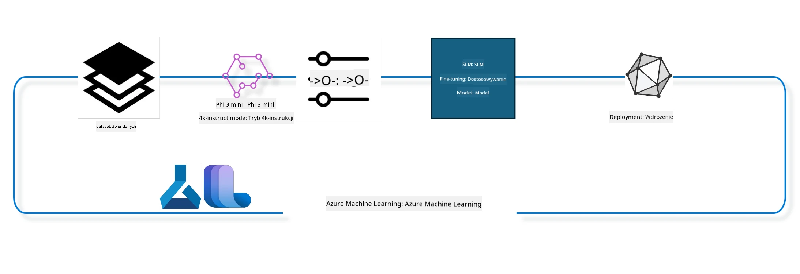

## Jak używać komponentów do chat-completion z rejestru systemu Azure ML do fine-tuningu modelu

W tym przykładzie przeprowadzimy fine tuning modelu Phi-3-mini-4k-instruct aby ukończyć rozmowę między 2 osobami, korzystając z zestawu danych ultrachat_200k.



Przykład pokaże Ci, jak przeprowadzić fine tuning przy użyciu Azure ML SDK i Pythona, a następnie wdrożyć model po fine tuningu do punktu końcowego online dla wnioskowania w czasie rzeczywistym.

### Dane treningowe

Użyjemy zestawu danych ultrachat_200k. Jest to silnie przefiltrowana wersja zestawu UltraChat, która była używana do trenowania Zephyr-7B-β, nowoczesnego modelu chat o rozmiarze 7b.

### Model

Użyjemy modelu Phi-3-mini-4k-instruct, aby pokazać, jak użytkownik może przeprowadzić fine tuning modelu do zadania chat-completion. Jeśli otworzyłeś ten notatnik z konkretnej karty modelu, pamiętaj, aby zastąpić nazwę modelu na odpowiednią.

### Zadania

- Wybierz model do fine tuningu.
- Wybierz i przeanalizuj dane treningowe.
- Skonfiguruj zadanie fine tuningu.
- Uruchom zadanie fine tuningu.
- Przejrzyj metryki treningowe i ewaluacyjne.
- Zarejestruj model po fine tuningu.
- Wdróż model po fine tuningu do wnioskowania w czasie rzeczywistym.
- Posprzątaj zasoby.

## 1. Przygotowanie wymagań wstępnych

- Zainstaluj zależności
- Połącz się z obszarem roboczym AzureML. Dowiedz się więcej w sekcji konfiguracja uwierzytelniania SDK. Zamień <WORKSPACE_NAME>, <RESOURCE_GROUP> oraz <SUBSCRIPTION_ID> poniżej.
- Połącz się z rejestrem systemu azureml
- Ustaw opcjonalną nazwę eksperymentu
- Sprawdź lub utwórz zasób obliczeniowy.

> [!NOTE]
> Wymagania dotyczą pojedynczego węzła GPU, który może mieć wiele kart GPU. Na przykład w jednym węźle Standard_NC24rs_v3 znajdują się 4 karty NVIDIA V100 GPU, podczas gdy w Standard_NC12s_v3 są 2 karty NVIDIA V100 GPU. Więcej informacji znajdziesz w dokumentacji. Liczba kart GPU na węzeł jest ustawiona w parametrze gpus_per_node poniżej. Poprawne ustawienie tej wartości zapewni wykorzystanie wszystkich GPU na węźle. Zalecane SKU dla obliczeń z GPU dostępne są tutaj i tutaj.

### Biblioteki Pythona

Zainstaluj zależności, uruchamiając poniższą komórkę. To nie jest opcjonalny krok, jeśli działasz w nowym środowisku.

```bash
pip install azure-ai-ml
pip install azure-identity
pip install datasets==2.9.0
pip install mlflow
pip install azureml-mlflow
```

### Interakcja z Azure ML

1. Ten skrypt Pythona służy do interakcji z usługą Azure Machine Learning (Azure ML). Oto omówienie jego działania:

    - Importuje niezbędne moduły z pakietów azure.ai.ml, azure.identity oraz azure.ai.ml.entities. Importuje również moduł time.

    - Próbuje się uwierzytelnić za pomocą DefaultAzureCredential(), który oferuje uproszczony sposób uwierzytelniania do szybkiego rozpoczęcia pracy z aplikacjami działającymi w chmurze Azure. Jeśli to się nie powiedzie, korzysta z InteractiveBrowserCredential(), który zapewnia interaktywny monit logowania.

    - Następnie próbuje utworzyć instancję MLClient za pomocą metody from_config, która odczytuje konfigurację z domyślnego pliku konfiguracyjnego (config.json). Jeśli to się nie powiedzie, tworzy instancję MLClient podając ręcznie subscription_id, resource_group_name i workspace_name.

    - Tworzy kolejną instancję MLClient, tym razem dla rejestru Azure ML o nazwie "azureml". Ten rejestr przechowuje modele, potoki fine-tuningu i środowiska.

    - Ustawia nazwę eksperymentu na "chat_completion_Phi-3-mini-4k-instruct".

    - Generuje unikalny znacznik czasu, konwertując obecny czas (w sekundach od epoki, jako liczba zmiennoprzecinkowa) na liczbę całkowitą, a następnie na string. Ten znacznik może służyć do tworzenia unikalnych nazw i wersji.

    ```python
    # Importuj niezbędne moduły z Azure ML i Azure Identity
    from azure.ai.ml import MLClient
    from azure.identity import (
        DefaultAzureCredential,
        InteractiveBrowserCredential,
    )
    from azure.ai.ml.entities import AmlCompute
    import time  # Importuj moduł time
    
    # Spróbuj uwierzytelnić się za pomocą DefaultAzureCredential
    try:
        credential = DefaultAzureCredential()
        credential.get_token("https://management.azure.com/.default")
    except Exception as ex:  # Jeśli DefaultAzureCredential się nie powiedzie, użyj InteractiveBrowserCredential
        credential = InteractiveBrowserCredential()
    
    # Spróbuj utworzyć instancję MLClient używając domyślnego pliku konfiguracyjnego
    try:
        workspace_ml_client = MLClient.from_config(credential=credential)
    except:  # Jeśli to się nie powiedzie, utwórz instancję MLClient, podając szczegóły ręcznie
        workspace_ml_client = MLClient(
            credential,
            subscription_id="<SUBSCRIPTION_ID>",
            resource_group_name="<RESOURCE_GROUP>",
            workspace_name="<WORKSPACE_NAME>",
        )
    
    # Utwórz kolejną instancję MLClient dla rejestru Azure ML o nazwie "azureml"
    # Ten rejestr przechowuje modele, pipeline'y do fine-tuningu oraz środowiska
    registry_ml_client = MLClient(credential, registry_name="azureml")
    
    # Ustaw nazwę eksperymentu
    experiment_name = "chat_completion_Phi-3-mini-4k-instruct"
    
    # Wygeneruj unikalny znacznik czasu, który może być użyty dla nazw i wersji wymagających unikalności
    timestamp = str(int(time.time()))
    ```

## 2. Wybierz model bazowy do fine tuningu

1. Phi-3-mini-4k-instruct to lekki, nowoczesny model o 3,8 miliardach parametrów, oparty na zestawach danych używanych w Phi-2. Model należy do rodziny modeli Phi-3, a wersja Mini dostępna jest w dwóch wariantach: 4K i 128K, które oznaczają długość kontekstu (w tokenach), jaką obsługuje. Musimy dokonać fine tuningu modelu dla naszego konkretnego celu, aby móc go użyć. Możesz przeglądać te modele w Katalogu Modeli w AzureML Studio, filtrując po zadaniu chat-completion. W tym przykładzie używamy modelu Phi-3-mini-4k-instruct. Jeśli otworzyłeś ten notatnik dla innego modelu, zastąp nazwę i wersję modelu odpowiednio.

> [!NOTE]
> Właściwość model id modelu. Zostanie przekazana jako input do zadania fine tuningu. Jest też dostępna jako pole Asset ID na stronie szczegółów modelu w Katalogu Modeli AzureML Studio.

2. Ten skrypt Pythona komunikuje się z usługą Azure Machine Learning (Azure ML). Oto omówienie jego działania:

    - Ustawia model_name na "Phi-3-mini-4k-instruct".

    - Korzysta z metody get właściwości models obiektu registry_ml_client, aby pobrać najnowszą wersję modelu o podanej nazwie z rejestru Azure ML. Metoda get jest wywoływana z dwoma argumentami: nazwą modelu oraz etykietą określającą, że ma być pobrana najnowsza wersja modelu.

    - Wypisuje na konsolę komunikat wskazujący nazwę, wersję i identyfikator modelu, który zostanie użyty do fine tuningu. Metoda format stringa wstawia nazwę, wersję i id modelu do komunikatu. Nazwa, wersja i id modelu są dostępne jako właściwości obiektu foundation_model.

    ```python
    # Ustaw nazwę modelu
    model_name = "Phi-3-mini-4k-instruct"
    
    # Pobierz najnowszą wersję modelu z rejestru Azure ML
    foundation_model = registry_ml_client.models.get(model_name, label="latest")
    
    # Wydrukuj nazwę modelu, wersję i identyfikator
    # Te informacje są przydatne do śledzenia i debugowania
    print(
        "\n\nUsing model name: {0}, version: {1}, id: {2} for fine tuning".format(
            foundation_model.name, foundation_model.version, foundation_model.id
        )
    )
    ```

## 3. Utwórz zasób obliczeniowy do użycia z zadaniem

Zadanie fine tuningu działa TYLKO z obliczeniami GPU. Rozmiar zasobu obliczeniowego zależy od wielkości modelu i w większości przypadków trudno jest dobrać odpowiedni zasób dla zadania. W tej komórce pomagamy użytkownikowi wybrać odpowiedni zasób obliczeniowy.

> [!NOTE]
> Poniżej wymienione zasoby obliczeniowe działają z najbardziej zoptymalizowaną konfiguracją. Jakiekolwiek zmiany konfiguracji mogą prowadzić do błędu Cuda Out Of Memory. W takim przypadku spróbuj zwiększyć zasób obliczeniowy do większego rozmiaru.

> [!NOTE]
> Przy wyborze compute_cluster_size poniżej upewnij się, że zasób jest dostępny w Twojej grupie zasobów. Jeśli dany zasób nie jest dostępny, możesz złożyć prośbę o dostęp do zasobów obliczeniowych.

### Sprawdzanie modelu pod kątem wsparcia fine tuningu

1. Ten skrypt Pythona komunikuje się z modelem Azure Machine Learning (Azure ML). Oto omówienie jego działania:

    - Importuje moduł ast, który oferuje funkcje do przetwarzania drzew składni abstrakcyjnej Pythona.

    - Sprawdza, czy obiekt foundation_model (reprezentujący model w Azure ML) posiada tag o nazwie finetune_compute_allow_list. Tag w Azure ML to para klucz-wartość, którą można tworzyć i używać do filtrowania i sortowania modeli.

    - Jeśli tag finetune_compute_allow_list jest obecny, używa funkcji ast.literal_eval do bezpiecznego przetworzenia wartości tagu (ciągu znaków) na listę Pythona. Lista ta jest przypisywana do zmiennej computes_allow_list. Następnie wypisuje komunikat wskazujący, że zasób obliczeniowy powinien zostać utworzony z listy.

    - Jeśli tag finetune_compute_allow_list nie istnieje, ustawia computes_allow_list na None i wypisuje komunikat, że tag nie jest częścią tagów modelu.

    - Podsumowując, skrypt sprawdza istnienie konkretnego tagu w metadanych modelu, konwertuje wartość tagu na listę jeśli istnieje, i odpowiednio informuje użytkownika.

    ```python
    # Importuj moduł ast, który dostarcza funkcje do przetwarzania drzew abstrakcyjnej składni Pythona
    import ast
    
    # Sprawdź, czy tag 'finetune_compute_allow_list' jest obecny w tagach modelu
    if "finetune_compute_allow_list" in foundation_model.tags:
        # Jeśli tag jest obecny, użyj ast.literal_eval, aby bezpiecznie sparsować wartość tagu (łańcuch znaków) do listy Pythona
        computes_allow_list = ast.literal_eval(
            foundation_model.tags["finetune_compute_allow_list"]
        )  # przekonwertuj łańcuch znaków na listę Pythona
        # Wydrukuj komunikat wskazujący, że należy utworzyć compute z listy
        print(f"Please create a compute from the above list - {computes_allow_list}")
    else:
        # Jeśli tag nie jest obecny, ustaw computes_allow_list na None
        computes_allow_list = None
        # Wydrukuj komunikat wskazujący, że tag 'finetune_compute_allow_list' nie jest częścią tagów modelu
        print("`finetune_compute_allow_list` is not part of model tags")
    ```

### Sprawdzanie Instancji Obliczeniowej

1. Ten skrypt Pythona komunikuje się z usługą Azure Machine Learning (Azure ML) i wykonuje kilka kontroli instancji obliczeniowej. Oto omówienie jego działania:

    - Próbuje pobrać instancję obliczeniową o nazwie zapisanej w zmiennej compute_cluster z przestrzeni roboczej Azure ML. Jeśli stan provisioning jest "failed", zgłasza wyjątek ValueError.

    - Sprawdza, czy computes_allow_list nie jest None. Jeśli nie jest, konwertuje wszystkie rozmiary obliczeń na listę z małymi literami i sprawdza, czy rozmiar bieżącej instancji obliczeniowej znajduje się na liście. Jeśli nie, zgłasza ValueError.

    - Jeśli computes_allow_list jest None, sprawdza, czy rozmiar instancji obliczeniowej znajduje się w liście nieobsługiwanych rozmiarów maszyn wirtualnych GPU. Jeśli tak, zgłasza ValueError.

    - Pobiera listę wszystkich dostępnych rozmiarów obliczeniowych w przestrzeni roboczej. Następnie iteruje po niej i dla każdego rozmiaru sprawdza, czy jego nazwa pasuje do rozmiaru bieżącej instancji. Jeśli tak, pobiera liczbę GPU dla tego rozmiaru i ustawia gpu_count_found na True.

    - Jeśli gpu_count_found jest True, wypisuje liczbę GPU w instancji obliczeniowej. W przeciwnym przypadku zgłasza ValueError.

    - Podsumowując, skrypt wykonuje szereg kontroli instancji obliczeniowej w przestrzeni roboczej Azure ML, w tym jej stan provisioning, rozmiar względem listy dozwolonych lub niedozwolonych wartości oraz liczbę posiadanych GPU.

    ```python
    # Wydrukuj komunikat wyjątku
    print(e)
    # Wygeneruj ValueError, jeśli rozmiar compute nie jest dostępny w workspace
    raise ValueError(
        f"WARNING! Compute size {compute_cluster_size} not available in workspace"
    )
    
    # Pobierz instancję compute z Azure ML workspace
    compute = workspace_ml_client.compute.get(compute_cluster)
    # Sprawdź, czy stan provisioningu instancji compute to "failed"
    if compute.provisioning_state.lower() == "failed":
        # Wygeneruj ValueError, jeśli stan provisioningu to "failed"
        raise ValueError(
            f"Provisioning failed, Compute '{compute_cluster}' is in failed state. "
            f"please try creating a different compute"
        )
    
    # Sprawdź, czy computes_allow_list nie jest None
    if computes_allow_list is not None:
        # Konwertuj wszystkie rozmiary compute w computes_allow_list na małe litery
        computes_allow_list_lower_case = [x.lower() for x in computes_allow_list]
        # Sprawdź, czy rozmiar instancji compute znajduje się w computes_allow_list_lower_case
        if compute.size.lower() not in computes_allow_list_lower_case:
            # Wygeneruj ValueError, jeśli rozmiar instancji compute nie znajduje się w computes_allow_list_lower_case
            raise ValueError(
                f"VM size {compute.size} is not in the allow-listed computes for finetuning"
            )
    else:
        # Zdefiniuj listę nieobsługiwanych rozmiarów GPU VM
        unsupported_gpu_vm_list = [
            "standard_nc6",
            "standard_nc12",
            "standard_nc24",
            "standard_nc24r",
        ]
        # Sprawdź, czy rozmiar instancji compute znajduje się na liście unsupported_gpu_vm_list
        if compute.size.lower() in unsupported_gpu_vm_list:
            # Wygeneruj ValueError, jeśli rozmiar instancji compute znajduje się na liście unsupported_gpu_vm_list
            raise ValueError(
                f"VM size {compute.size} is currently not supported for finetuning"
            )
    
    # Zainicjuj flagę do sprawdzenia, czy liczba GPU w instancji compute została znaleziona
    gpu_count_found = False
    # Pobierz listę wszystkich dostępnych rozmiarów compute w workspace
    workspace_compute_sku_list = workspace_ml_client.compute.list_sizes()
    available_sku_sizes = []
    # Iteruj po liście dostępnych rozmiarów compute
    for compute_sku in workspace_compute_sku_list:
        available_sku_sizes.append(compute_sku.name)
        # Sprawdź, czy nazwa rozmiaru compute pasuje do rozmiaru instancji compute
        if compute_sku.name.lower() == compute.size.lower():
            # Jeśli tak, pobierz liczbę GPU dla tego rozmiaru compute i ustaw gpu_count_found na True
            gpus_per_node = compute_sku.gpus
            gpu_count_found = True
    # Jeśli gpu_count_found jest True, wydrukuj liczbę GPU w instancji compute
    if gpu_count_found:
        print(f"Number of GPU's in compute {compute.size}: {gpus_per_node}")
    else:
        # Jeśli gpu_count_found jest False, wygeneruj ValueError
        raise ValueError(
            f"Number of GPU's in compute {compute.size} not found. Available skus are: {available_sku_sizes}."
            f"This should not happen. Please check the selected compute cluster: {compute_cluster} and try again."
        )
    ```

## 4. Wybierz zestaw danych do fine tuningu modelu

1. Używamy zestawu danych ultrachat_200k. Zestaw danych ma cztery podziały, odpowiednie do nadzorowanego fine tuningu (sft).
Ranking generacji (gen). Liczba przykładów w podziale jest pokazana następująco:

    ```bash
    train_sft test_sft  train_gen  test_gen
    207865  23110  256032  28304
    ```

1. Następne komórki pokazują podstawowe przygotowanie danych do fine tuningu:

### Wizualizacja kilku wierszy danych

Chcemy, aby ten przykład działał szybko, więc zapisz pliki train_sft, test_sft zawierające 5% wcześniej przyciętych wierszy. Oznacza to, że model po fine tuningu będzie miał niższą dokładność, dlatego nie powinien być używany w zastosowaniach produkcyjnych.
Skrypt download-dataset.py służy do pobrania zestawu ultrachat_200k oraz przekształcenia go do formatu zgodnego z komponentem potoku fine tuningu. Ponieważ zestaw jest duży, mamy tu tylko część danych.

1. Uruchomienie poniższego skryptu pobiera tylko 5% danych. Można to zwiększyć zmieniając parametr dataset_split_pc na odpowiedni procent.

> [!NOTE]
> Niektóre modele językowe mają różne kody języków, dlatego nazwy kolumn w zestawie danych powinny być odpowiednio dostosowane.

1. Oto przykład, jak powinny wyglądać dane
Zestaw danych chat-completion jest przechowywany w formacie parquet, a każdy wpis używa poniższego schematu:

    - Jest to dokument JSON (JavaScript Object Notation), popularny format wymiany danych. Nie jest to kod wykonywalny, lecz sposób przechowywania i transportu danych. Oto rozbicie jego struktury:

    - "prompt": Ten klucz przechowuje wartość tekstową reprezentującą zadanie lub pytanie zadane asystentowi AI.

    - "messages": Ten klucz przechowuje tablicę obiektów. Każdy obiekt reprezentuje wiadomość w rozmowie między użytkownikiem a asystentem AI. Każdy obiekt wiadomości ma dwa klucze:

    - "content": Klucz z wartością tekstową, reprezentującą zawartość wiadomości.
    - "role": Klucz z wartością tekstową, oznaczającą rolę podmiotu, który wysłał wiadomość. Może to być "user" lub "assistant".
    - "prompt_id": Klucz z wartością tekstową, reprezentującą unikalny identyfikator promptu.

1. W tym konkretnym dokumencie JSON reprezentowana jest rozmowa, gdzie użytkownik prosi asystenta AI o stworzenie protagonisty do dystopijnej historii. Asystent odpowiada, a użytkownik prosi o więcej szczegółów. Asystent zgadza się je podać. Cała rozmowa jest powiązana z konkretnym identyfikatorem promptu.

    ```python
    {
        // The task or question posed to an AI assistant
        "prompt": "Create a fully-developed protagonist who is challenged to survive within a dystopian society under the rule of a tyrant. ...",
        
        // An array of objects, each representing a message in a conversation between a user and an AI assistant
        "messages":[
            {
                // The content of the user's message
                "content": "Create a fully-developed protagonist who is challenged to survive within a dystopian society under the rule of a tyrant. ...",
                // The role of the entity that sent the message
                "role": "user"
            },
            {
                // The content of the assistant's message
                "content": "Name: Ava\n\n Ava was just 16 years old when the world as she knew it came crashing down. The government had collapsed, leaving behind a chaotic and lawless society. ...",
                // The role of the entity that sent the message
                "role": "assistant"
            },
            {
                // The content of the user's message
                "content": "Wow, Ava's story is so intense and inspiring! Can you provide me with more details.  ...",
                // The role of the entity that sent the message
                "role": "user"
            }, 
            {
                // The content of the assistant's message
                "content": "Certainly! ....",
                // The role of the entity that sent the message
                "role": "assistant"
            }
        ],
        
        // A unique identifier for the prompt
        "prompt_id": "d938b65dfe31f05f80eb8572964c6673eddbd68eff3db6bd234d7f1e3b86c2af"
    }
    ```

### Pobieranie danych

1. Ten skrypt Pythona służy do pobrania zestawu danych za pomocą pomocniczego skryptu download-dataset.py. Oto omówienie jego działania:

    - Importuje moduł os, który zapewnia przenośny dostęp do funkcjonalności systemu operacyjnego.

    - Używa funkcji os.system, aby uruchomić skrypt download-dataset.py w powłoce z określonymi argumentami wiersza poleceń. Argumenty wskazują zestaw danych do pobrania (HuggingFaceH4/ultrachat_200k), katalog docelowy (ultrachat_200k_dataset) oraz procent podziału danych (5). Funkcja os.system zwraca status zakończenia polecenia, który zapisywany jest do zmiennej exit_status.

    - Sprawdza, czy exit_status jest różny od 0. W systemach Unix exit status 0 oznacza zwykle powodzenie, a każda inna liczba błąd. Jeśli exit_status jest różny od 0, zgłasza wyjątek z wiadomością o błędzie podczas pobierania zestawu danych.

    - Podsumowując, skrypt uruchamia polecenie pobierania zestawu danych za pomocą pomocniczego skryptu i zgłasza wyjątek, jeśli polecenie nie powiedzie się.

    ```python
    # Zaimportuj moduł os, który zapewnia sposób korzystania z funkcji zależnych od systemu operacyjnego
    import os
    
    # Użyj funkcji os.system, aby uruchomić skrypt download-dataset.py w powłoce z określonymi argumentami wiersza poleceń
    # Argumenty określają zestaw danych do pobrania (HuggingFaceH4/ultrachat_200k), katalog do zapisu (ultrachat_200k_dataset) oraz procent podziału zestawu danych (5)
    # Funkcja os.system zwraca status zakończenia wykonanej komendy; status ten jest przechowywany w zmiennej exit_status
    exit_status = os.system(
        "python ./download-dataset.py --dataset HuggingFaceH4/ultrachat_200k --download_dir ultrachat_200k_dataset --dataset_split_pc 5"
    )
    
    # Sprawdź, czy exit_status jest różny od 0
    # W systemach operacyjnych podobnych do Unix, status zakończenia 0 zazwyczaj oznacza, że komenda zakończyła się sukcesem, natomiast każda inna liczba wskazuje na błąd
    # Jeśli exit_status jest różny od 0, zgłoś wyjątek z komunikatem wskazującym na błąd podczas pobierania zestawu danych
    if exit_status != 0:
        raise Exception("Error downloading dataset")
    ```

### Ładowanie danych do DataFrame
1. Ten skrypt Pythona ładuje plik JSON Lines do DataFrame biblioteki pandas i wyświetla pierwsze 5 wierszy. Oto, co robi:

    - Importuje bibliotekę pandas, która jest potężną biblioteką do manipulacji i analizy danych.

    - Ustawia maksymalną szerokość kolumny dla opcji wyświetlania pandas na 0. Oznacza to, że pełny tekst każdej kolumny będzie wyświetlany bez ucinania, gdy DataFrame zostanie wydrukowany.

    - Korzysta z funkcji pd.read_json, aby załadować plik train_sft.jsonl z katalogu ultrachat_200k_dataset do DataFrame. Argument lines=True wskazuje, że plik jest w formacie JSON Lines, gdzie każda linia jest osobnym obiektem JSON.

    - Używa metody head, aby wyświetlić pierwsze 5 wierszy DataFrame. Jeśli DataFrame ma mniej niż 5 wierszy, wyświetli je wszystkie.

    - Podsumowując, skrypt ten ładuje plik JSON Lines do DataFrame i wyświetla pierwsze 5 wierszy z pełnym tekstem kolumn.

    ```python
    # Zaimportuj bibliotekę pandas, która jest potężną biblioteką do manipulacji i analizy danych
    import pandas as pd
    
    # Ustaw maksymalną szerokość kolumny dla opcji wyświetlania pandas na 0
    # Oznacza to, że cały tekst każdej kolumny będzie wyświetlany bez ucinania, gdy DataFrame zostanie wydrukowany
    pd.set_option("display.max_colwidth", 0)
    
    # Użyj funkcji pd.read_json, aby załadować plik train_sft.jsonl z katalogu ultrachat_200k_dataset do DataFrame
    # Argument lines=True oznacza, że plik jest w formacie JSON Lines, gdzie każda linia jest osobnym obiektem JSON
    df = pd.read_json("./ultrachat_200k_dataset/train_sft.jsonl", lines=True)
    
    # Użyj metody head, aby wyświetlić pierwsze 5 wierszy DataFrame
    # Jeśli DataFrame ma mniej niż 5 wierszy, wyświetli je wszystkie
    df.head()
    ```

## 5. Prześlij zadanie fine tuningu, używając modelu i danych jako wejścia

Utwórz zadanie, które używa komponentu pipeline chat-completion. Dowiedz się więcej o wszystkich parametrach obsługiwanych podczas fine tuningu.

### Definiowanie parametrów fine tuningu

1. Parametry fine tuningu można podzielić na 2 kategorie - parametry treningowe, parametry optymalizacji.

1. Parametry treningowe definiują aspekty treningu takie jak -

    - Jaki optymalizator, scheduler będzie używany
    - Metryka do optymalizacji fine tuningu
    - Liczba kroków treningowych, rozmiar batcha i tak dalej
    - Parametry optymalizacji pomagają w optymalizacji pamięci GPU oraz efektywnym wykorzystaniu zasobów obliczeniowych.

1. Poniżej kilka parametrów należących do tej kategorii. Parametry optymalizacji różnią się dla każdego modelu i są dostarczane wraz z modelem, aby obsłużyć te różnice.

    - Włącz deepspeed i LoRA
    - Włącz trening z mieszana precyzją
    - Włącz trening wielowęzłowy

> [!NOTE]
> Fine tuning nadzorowany może skutkować utratą dopasowania lub katastrofalnym zapominaniem. Zalecamy sprawdzenie tego problemu i przeprowadzenie etapu dopasowania po fine tuningu.

### Parametry Fine Tuningu

1. Ten skrypt Pythona ustawia parametry dla fine tuningu modelu uczenia maszynowego. Oto co robi:

    - Ustawia domyślne parametry treningowe, takie jak liczba epok treningowych, rozmiary batcha dla treningu i ewaluacji, współczynnik uczenia oraz typ schedulera współczynnika uczenia.

    - Ustawia domyślne parametry optymalizacji, takie jak czy stosować Layer-wise Relevance Propagation (LoRa) i DeepSpeed oraz etap DeepSpeed.

    - Łączy parametry treningowe i optymalizacji w jeden słownik o nazwie finetune_parameters.

    - Sprawdza, czy foundation_model ma jakiekolwiek parametry domyślne specyficzne dla modelu. Jeśli tak, wypisuje komunikat ostrzegawczy i aktualizuje słownik finetune_parameters tymi domyślnymi parametrami specyficznymi dla modelu. Funkcja ast.literal_eval jest używana do przekształcenia domyślnych parametrów specyficznych dla modelu z napisu na słownik Pythona.

    - Wypisuje ostateczny zestaw parametrów fine tuningu, które będą użyte podczas uruchomienia.

    - Podsumowując, skrypt ten ustawia i wyświetla parametry fine tuningu modelu uczenia maszynowego, z możliwością nadpisania domyślnych parametrów parametrami specyficznymi dla modelu.

    ```python
    # Ustaw domyślne parametry treningu, takie jak liczba epok treningowych, rozmiary partii dla treningu i ewaluacji, wskaźnik uczenia oraz typ harmonogramu wskaźnika uczenia
    training_parameters = dict(
        num_train_epochs=3,
        per_device_train_batch_size=1,
        per_device_eval_batch_size=1,
        learning_rate=5e-6,
        lr_scheduler_type="cosine",
    )
    
    # Ustaw domyślne parametry optymalizacji, takie jak czy zastosować Layer-wise Relevance Propagation (LoRa) i DeepSpeed oraz etap DeepSpeed
    optimization_parameters = dict(
        apply_lora="true",
        apply_deepspeed="true",
        deepspeed_stage=2,
    )
    
    # Połącz parametry treningu i optymalizacji w jeden słownik o nazwie finetune_parameters
    finetune_parameters = {**training_parameters, **optimization_parameters}
    
    # Sprawdź, czy foundation_model ma jakieś specyficzne dla modelu domyślne parametry
    # Jeśli tak, wyświetl komunikat ostrzegawczy i zaktualizuj słownik finetune_parameters tymi specyficznymi dla modelu domyślnymi wartościami
    # Funkcja ast.literal_eval jest używana do konwersji specyficznych dla modelu domyślnych wartości ze stringa na słownik Pythona
    if "model_specific_defaults" in foundation_model.tags:
        print("Warning! Model specific defaults exist. The defaults could be overridden.")
        finetune_parameters.update(
            ast.literal_eval(  # konwersja stringa na słownik Pythona
                foundation_model.tags["model_specific_defaults"]
            )
        )
    
    # Wydrukuj finalny zestaw parametrów dostrajania, które będą użyte podczas uruchomienia
    print(
        f"The following finetune parameters are going to be set for the run: {finetune_parameters}"
    )
    ```

### Pipeline Treningowy

1. Ten skrypt Pythona definiuje funkcję do generowania nazwy wyświetlanej dla pipeline’u treningu modelu uczenia maszynowego, a następnie wywołuje tę funkcję, aby wygenerować i wydrukować nazwę wyświetlaną. Oto co robi:

1. Definiuje się funkcja get_pipeline_display_name. Ta funkcja generuje nazwę wyświetlaną na podstawie różnych parametrów związanych z pipeline’em treningowym.

1. Wewnątrz funkcji obliczana jest całkowita wielkość batcha mnożąc per-device batch size, liczbę kroków akumulacji gradientów, liczbę GPU na węzeł oraz liczbę węzłów używanych do fine tuningu.

1. Pobierane są różne inne parametry, takie jak typ schedulera współczynnika uczenia, czy jest stosowany DeepSpeed, etap DeepSpeed, czy Layer-wise Relevance Propagation (LoRa) jest stosowany, limit liczby punktów kontrolnych modelu do zachowania oraz maksymalna długość sekwencji.

1. Konstruowany jest ciąg znaków zawierający te parametry, oddzielone myślnikami. Jeśli DeepSpeed lub LoRa są stosowane, ciąg zawiera odpowiednio "ds" z etapem DeepSpeed, lub "lora". Jeśli nie, zawiera "nods" lub "nolora".

1. Funkcja zwraca ten ciąg, który służy jako nazwa wyświetlana pipeline’u treningowego.

1. Po zdefiniowaniu funkcji jest ona wywoływana, by wygenerować nazwę wyświetlaną, która jest następnie drukowana.

1. Podsumowując, skrypt generuje nazwę wyświetlaną pipeline’u treningowego na podstawie różnych parametrów, a następnie ją drukuje.

    ```python
    # Zdefiniuj funkcję do generowania nazwy wyświetlanej dla procesu treningowego
    def get_pipeline_display_name():
        # Oblicz całkowity rozmiar partii przez pomnożenie rozmiaru partii na urządzenie, liczby kroków akumulacji gradientu, liczby GPU na węzeł i liczby węzłów używanych do fine-tuningu
        batch_size = (
            int(finetune_parameters.get("per_device_train_batch_size", 1))
            * int(finetune_parameters.get("gradient_accumulation_steps", 1))
            * int(gpus_per_node)
            * int(finetune_parameters.get("num_nodes_finetune", 1))
        )
        # Pobierz typ harmonogramu zmiany współczynnika uczenia
        scheduler = finetune_parameters.get("lr_scheduler_type", "linear")
        # Pobierz informację, czy używany jest DeepSpeed
        deepspeed = finetune_parameters.get("apply_deepspeed", "false")
        # Pobierz etap DeepSpeed
        ds_stage = finetune_parameters.get("deepspeed_stage", "2")
        # Jeśli DeepSpeed jest używany, do nazwy wyświetlanej dodaj "ds" oraz etap DeepSpeed; jeśli nie, dodaj "nods"
        if deepspeed == "true":
            ds_string = f"ds{ds_stage}"
        else:
            ds_string = "nods"
        # Pobierz informację, czy stosowany jest Layer-wise Relevance Propagation (LoRa)
        lora = finetune_parameters.get("apply_lora", "false")
        # Jeśli LoRa jest stosowany, do nazwy wyświetlanej dodaj "lora"; jeśli nie, dodaj "nolora"
        if lora == "true":
            lora_string = "lora"
        else:
            lora_string = "nolora"
        # Pobierz limit liczby zachowywanych punktów kontrolnych modelu
        save_limit = finetune_parameters.get("save_total_limit", -1)
        # Pobierz maksymalną długość sekwencji
        seq_len = finetune_parameters.get("max_seq_length", -1)
        # Utwórz nazwę wyświetlaną, łącząc wszystkie te parametry, rozdzielone myślnikami
        return (
            model_name
            + "-"
            + "ultrachat"
            + "-"
            + f"bs{batch_size}"
            + "-"
            + f"{scheduler}"
            + "-"
            + ds_string
            + "-"
            + lora_string
            + f"-save_limit{save_limit}"
            + f"-seqlen{seq_len}"
        )
    
    # Wywołaj funkcję generującą nazwę wyświetlaną
    pipeline_display_name = get_pipeline_display_name()
    # Wypisz nazwę wyświetlaną
    print(f"Display name used for the run: {pipeline_display_name}")
    ```

### Konfiguracja Pipeline’u

Ten skrypt Pythona definiuje i konfiguruje pipeline uczenia maszynowego używając Azure Machine Learning SDK. Oto co robi:

1. Importuje niezbędne moduły z Azure AI ML SDK.

1. Pobiera komponent pipeline o nazwie "chat_completion_pipeline" z rejestru.

1. Definiuje zadanie pipeline przy użyciu dekoratora `@pipeline` oraz funkcji `create_pipeline`. Nazwa pipeline’u ustawiona jest na `pipeline_display_name`.

1. W funkcji `create_pipeline` inicjalizowany jest pobrany komponent pipeline z różnymi parametrami, w tym ścieżką do modelu, klastrami obliczeniowymi dla różnych etapów, podziałami zbiorów danych do treningu i testów, liczbą GPU do fine tuningu oraz innymi parametrami fine tuningu.

1. Mapuje się wyjście zadania fine tuningu do wyjścia zadania pipeline’u. Jest to zrobione tak, aby łatwo można było zarejestrować wytrenowany model, co jest wymagane do wdrożenia modelu do endpointa online lub batch.

1. Tworzy się instancję pipeline wywołując funkcję `create_pipeline`.

1. Ustawia się opcję `force_rerun` pipeline’u na `True`, co oznacza, że nie będą używane buforowane wyniki z poprzednich zadań.

1. Ustawia się opcję `continue_on_step_failure` pipeline’u na `False`, co oznacza, że pipeline zatrzyma się, jeśli jakiś krok zakończy się niepowodzeniem.

1. Podsumowując, skrypt definiuje i konfiguruje pipeline uczenia maszynowego dla zadania chat completion z użyciem Azure Machine Learning SDK.

    ```python
    # Importuj niezbędne moduły z SDK Azure AI ML
    from azure.ai.ml.dsl import pipeline
    from azure.ai.ml import Input
    
    # Pobierz komponent pipeline o nazwie "chat_completion_pipeline" z rejestru
    pipeline_component_func = registry_ml_client.components.get(
        name="chat_completion_pipeline", label="latest"
    )
    
    # Zdefiniuj zadanie pipeline za pomocą dekoratora @pipeline i funkcji create_pipeline
    # Nazwa pipeline jest ustawiona na pipeline_display_name
    @pipeline(name=pipeline_display_name)
    def create_pipeline():
        # Zainicjuj pobrany komponent pipeline z różnymi parametrami
        # Obejmują one ścieżkę do modelu, klastry obliczeniowe dla różnych etapów, podziały zestawu danych do trenowania i testowania, liczbę GPU do użycia przy dopasowywaniu oraz inne parametry dopasowania
        chat_completion_pipeline = pipeline_component_func(
            mlflow_model_path=foundation_model.id,
            compute_model_import=compute_cluster,
            compute_preprocess=compute_cluster,
            compute_finetune=compute_cluster,
            compute_model_evaluation=compute_cluster,
            # Mapuj podziały zestawu danych do parametrów
            train_file_path=Input(
                type="uri_file", path="./ultrachat_200k_dataset/train_sft.jsonl"
            ),
            test_file_path=Input(
                type="uri_file", path="./ultrachat_200k_dataset/test_sft.jsonl"
            ),
            # Ustawienia treningu
            number_of_gpu_to_use_finetuning=gpus_per_node,  # Ustaw na liczbę dostępnych GPU w obliczeniach
            **finetune_parameters
        )
        return {
            # Mapuj wynik zadania dopasowania do wyjścia zadania pipeline
            # Jest to zrobione, aby łatwo zarejestrować dopasowany model
            # Rejestracja modelu jest wymagana do wdrożenia modelu do punktu końcowego online lub batch
            "trained_model": chat_completion_pipeline.outputs.mlflow_model_folder
        }
    
    # Utwórz instancję pipeline wywołując funkcję create_pipeline
    pipeline_object = create_pipeline()
    
    # Nie używaj wyników z pamięci podręcznej z poprzednich zadań
    pipeline_object.settings.force_rerun = True
    
    # Ustaw continue on step failure na False
    # Oznacza to, że pipeline zatrzyma się, jeśli którykolwiek krok zakończy się niepowodzeniem
    pipeline_object.settings.continue_on_step_failure = False
    ```

### Przesyłanie zadania

1. Ten skrypt Pythona przesyła zadanie pipeline’u uczenia maszynowego do workspace Azure Machine Learning, a następnie czeka na ukończenie zadania. Oto co robi:

    - Wywołuje metodę create_or_update obiektu jobs w workspace_ml_client, aby przesłać zadanie pipeline. Pipeline do uruchomienia jest wskazany przez pipeline_object, a eksperyment, pod którym zadanie jest uruchamiane, jest wskazany przez experiment_name.

    - Następnie wywołuje metodę stream obiektu jobs w workspace_ml_client, aby czekać na zakończenie zadania pipeline. Zadanie do oczekiwania jest wskazane przez nazwę atrybutu name obiektu pipeline_job.

    - Podsumowując, skrypt przesyła zadanie pipeline’u uczenia maszynowego do workspace Azure Machine Learning, a następnie czeka na zakończenie tego zadania.

    ```python
    # Prześlij zadanie pipeline do przestrzeni roboczej Azure Machine Learning
    # Pipeline do uruchomienia jest określony przez pipeline_object
    # Eksperyment, w ramach którego uruchamiane jest zadanie, jest określony przez experiment_name
    pipeline_job = workspace_ml_client.jobs.create_or_update(
        pipeline_object, experiment_name=experiment_name
    )
    
    # Poczekaj na zakończenie zadania pipeline
    # Zadanie, na które czekamy, jest określone przez atrybut name obiektu pipeline_job
    workspace_ml_client.jobs.stream(pipeline_job.name)
    ```

## 6. Zarejestruj wytrenowany model w workspace

Zarejestrujemy model z wyniku zadania fine tuningu. To pozwoli śledzić pochodzenie (lineage) między wytrenowanym modelem a zadaniem fine tuningu. Zadanie fine tuningu dodatkowo śledzi pochodzenie do modelu bazowego, danych i kodu treningowego.

### Rejestracja modelu ML

1. Ten skrypt Pythona rejestruje model uczenia maszynowego wytrenowany w pipeline Azure Machine Learning. Oto co robi:

    - Importuje niezbędne moduły z Azure AI ML SDK.

    - Sprawdza, czy wyjście trained_model jest dostępne z zadania pipeline, wywołując metodę get obiektu jobs w workspace_ml_client i uzyskując dostęp do jego atrybutu outputs.

    - Buduje ścieżkę do wytrenowanego modelu, formatując ciąg znaków zawierający nazwę zadania pipeline i nazwę wyjścia ("trained_model").

    - Definiuje nazwę dla wytrenowanego modelu, dodając "-ultrachat-200k" do oryginalnej nazwy modelu i zamieniając wszystkie ukośniki na myślniki.

    - Przygotowuje rejestrację modelu tworząc obiekt Model z różnymi parametrami, w tym ścieżką do modelu, typem modelu (model MLflow), nazwą i wersją modelu oraz opisem modelu.

    - Rejestruje model, wywołując metodę create_or_update obiektu models w workspace_ml_client z obiektem Model jako argumentem.

    - Drukuje zarejestrowany model.

1. Podsumowując, skrypt rejestruje model uczenia maszynowego wytrenowany w pipeline Azure Machine Learning.

    ```python
    # Importuj niezbędne moduły z Azure AI ML SDK
    from azure.ai.ml.entities import Model
    from azure.ai.ml.constants import AssetTypes
    
    # Sprawdź, czy wyjście `trained_model` jest dostępne z zadania pipeline
    print("pipeline job outputs: ", workspace_ml_client.jobs.get(pipeline_job.name).outputs)
    
    # Utwórz ścieżkę do wytrenowanego modelu, formatując ciąg znaków z nazwą zadania pipeline i nazwą wyjścia ("trained_model")
    model_path_from_job = "azureml://jobs/{0}/outputs/{1}".format(
        pipeline_job.name, "trained_model"
    )
    
    # Zdefiniuj nazwę dla modelu poddanego fine-tuningu, dodając "-ultrachat-200k" do oryginalnej nazwy modelu i zastępując wszelkie ukośniki myślnikami
    finetuned_model_name = model_name + "-ultrachat-200k"
    finetuned_model_name = finetuned_model_name.replace("/", "-")
    
    print("path to register model: ", model_path_from_job)
    
    # Przygotuj się do rejestracji modelu, tworząc obiekt Model z różnymi parametrami
    # Obejmują one ścieżkę do modelu, typ modelu (model MLflow), nazwę i wersję modelu oraz opis modelu
    prepare_to_register_model = Model(
        path=model_path_from_job,
        type=AssetTypes.MLFLOW_MODEL,
        name=finetuned_model_name,
        version=timestamp,  # Użyj znacznika czasu jako wersji, aby uniknąć konfliktu wersji
        description=model_name + " fine tuned model for ultrachat 200k chat-completion",
    )
    
    print("prepare to register model: \n", prepare_to_register_model)
    
    # Zarejestruj model, wywołując metodę create_or_update obiektu models w workspace_ml_client z obiektem Model jako argumentem
    registered_model = workspace_ml_client.models.create_or_update(
        prepare_to_register_model
    )
    
    # Wydrukuj zarejestrowany model
    print("registered model: \n", registered_model)
    ```

## 7. Wdrożenie wytrenowanego modelu do endpointa online

Endpointy online udostępniają trwałe API REST, które może być używane do integracji z aplikacjami potrzebującymi korzystać z modelu.

### Zarządzanie endpointem

1. Ten skrypt Pythona tworzy zarządzany endpoint online w Azure Machine Learning dla zarejestrowanego modelu. Oto co robi:

    - Importuje niezbędne moduły z Azure AI ML SDK.

    - Definiuje unikalną nazwę endpointa online, dopisując znacznik czasu do łańcucha "ultrachat-completion-".

    - Przygotowuje się do utworzenia endpointa online, tworząc obiekt ManagedOnlineEndpoint z różnymi parametrami, w tym nazwą endpointa, opisem endpointa oraz trybem uwierzytelniania ("key").

    - Tworzy endpoint online, wywołując metodę begin_create_or_update obiektu workspace_ml_client z obiektem ManagedOnlineEndpoint jako argumentem. Następnie czeka na zakończenie operacji tworzenia, wywołując metodę wait.

1. Podsumowując, skrypt tworzy zarządzany endpoint online w Azure Machine Learning dla zarejestrowanego modelu.

    ```python
    # Importuj niezbędne moduły z SDK Azure AI ML
    from azure.ai.ml.entities import (
        ManagedOnlineEndpoint,
        ManagedOnlineDeployment,
        ProbeSettings,
        OnlineRequestSettings,
    )
    
    # Zdefiniuj unikalną nazwę dla punktu końcowego online, dodając znacznik czasu do ciągu "ultrachat-completion-"
    online_endpoint_name = "ultrachat-completion-" + timestamp
    
    # Przygotuj się do utworzenia punktu końcowego online, tworząc obiekt ManagedOnlineEndpoint z różnymi parametrami
    # Obejmują one nazwę punktu końcowego, opis punktu końcowego oraz tryb uwierzytelniania ("key")
    endpoint = ManagedOnlineEndpoint(
        name=online_endpoint_name,
        description="Online endpoint for "
        + registered_model.name
        + ", fine tuned model for ultrachat-200k-chat-completion",
        auth_mode="key",
    )
    
    # Utwórz punkt końcowy online, wywołując metodę begin_create_or_update klienta workspace_ml_client z obiektem ManagedOnlineEndpoint jako argumentem
    # Następnie poczekaj na zakończenie operacji tworzenia, wywołując metodę wait
    workspace_ml_client.begin_create_or_update(endpoint).wait()
    ```

> [!NOTE]
> Tutaj znajdziesz listę skoń SKU wspieranych do wdrożenia - [Lista SKU zarządzanych endpointów online](https://learn.microsoft.com/azure/machine-learning/reference-managed-online-endpoints-vm-sku-list)

### Wdrożenie modelu ML

1. Ten skrypt Pythona wdraża zarejestrowany model uczenia maszynowego do zarządzanego endpointa online w Azure Machine Learning. Oto co robi:

    - Importuje moduł ast, który udostępnia funkcje do przetwarzania drzew abstrakcyjnej składni Pythona.

    - Ustawia typ instancji dla wdrożenia na "Standard_NC6s_v3".

    - Sprawdza, czy w modelu bazowym jest obecny tag inference_compute_allow_list. Jeśli tak, konwertuje wartość tagu z napisu na listę Pythona i przypisuje do inference_computes_allow_list. Jeśli nie, ustawia inference_computes_allow_list na None.

    - Sprawdza, czy wybrany typ instancji znajduje się na liście dozwolonych typów. Jeśli nie, wyświetla komunikat z prośbą o wybór typu instancji z listy dozwolonej.

    - Przygotowuje się do utworzenia wdrożenia, tworząc obiekt ManagedOnlineDeployment z różnymi parametrami, w tym nazwą wdrożenia, nazwą endpointa, ID modelu, typem i liczbą instancji, ustawieniami liveness probe oraz ustawieniami zapytań.

    - Tworzy wdrożenie, wywołując metodę begin_create_or_update obiektu workspace_ml_client z obiektem ManagedOnlineDeployment jako argumentem. Następnie czeka na zakończenie operacji tworzenia, wywołując metodę wait.

    - Ustawia ruch endpointa, kierując 100% ruchu do wdrożenia o nazwie "demo".

    - Aktualizuje endpoint, wywołując metodę begin_create_or_update obiektu workspace_ml_client z obiektem endpoint jako argumentem. Następnie czeka na zakończenie operacji aktualizacji, wywołując metodę result.

1. Podsumowując, skrypt wdraża zarejestrowany model uczenia maszynowego do zarządzanego endpointa online w Azure Machine Learning.

    ```python
    # Importuj moduł ast, który udostępnia funkcje do przetwarzania drzew abstrakcyjnej składni języka Python
    import ast
    
    # Ustaw typ instancji dla wdrożenia
    instance_type = "Standard_NC6s_v3"
    
    # Sprawdź, czy tag `inference_compute_allow_list` jest obecny w modelu podstawowym
    if "inference_compute_allow_list" in foundation_model.tags:
        # Jeśli tak, przekształć wartość tagu ze stringa na listę Pythona i przypisz ją do `inference_computes_allow_list`
        inference_computes_allow_list = ast.literal_eval(
            foundation_model.tags["inference_compute_allow_list"]
        )
        print(f"Please create a compute from the above list - {computes_allow_list}")
    else:
        # Jeśli nie, ustaw `inference_computes_allow_list` na `None`
        inference_computes_allow_list = None
        print("`inference_compute_allow_list` is not part of model tags")
    
    # Sprawdź, czy określony typ instancji znajduje się na liście dozwolonych
    if (
        inference_computes_allow_list is not None
        and instance_type not in inference_computes_allow_list
    ):
        print(
            f"`instance_type` is not in the allow listed compute. Please select a value from {inference_computes_allow_list}"
        )
    
    # Przygotuj się do utworzenia wdrożenia, tworząc obiekt `ManagedOnlineDeployment` z różnymi parametrami
    demo_deployment = ManagedOnlineDeployment(
        name="demo",
        endpoint_name=online_endpoint_name,
        model=registered_model.id,
        instance_type=instance_type,
        instance_count=1,
        liveness_probe=ProbeSettings(initial_delay=600),
        request_settings=OnlineRequestSettings(request_timeout_ms=90000),
    )
    
    # Utwórz wdrożenie, wywołując metodę `begin_create_or_update` klienta `workspace_ml_client` z obiektem `ManagedOnlineDeployment` jako argumentem
    # Następnie poczekaj na zakończenie operacji tworzenia, wywołując metodę `wait`
    workspace_ml_client.online_deployments.begin_create_or_update(demo_deployment).wait()
    
    # Ustaw ruch punktu końcowego, aby skierować 100% ruchu do wdrożenia "demo"
    endpoint.traffic = {"demo": 100}
    
    # Zaktualizuj punkt końcowy, wywołując metodę `begin_create_or_update` klienta `workspace_ml_client` z obiektem `endpoint` jako argumentem
    # Następnie poczekaj na zakończenie operacji aktualizacji, wywołując metodę `result`
    workspace_ml_client.begin_create_or_update(endpoint).result()
    ```

## 8. Testuj endpoint na przykładowych danych

Pobierzemy przykładowe dane ze zbioru testowego i wyślemy je do endpointa online w celu inferencji. Następnie pokażemy wyświetlone etykiety ocenione wraz z prawdziwymi etykietami.

### Odczytywanie wyników

1. Ten skrypt Pythona odczytuje plik JSON Lines do DataFrame pandas, pobiera losową próbkę i resetuje indeks. Oto co robi:

    - Odczytuje plik ./ultrachat_200k_dataset/test_gen.jsonl do DataFrame pandas. Funkcja read_json jest używana z argumentem lines=True, ponieważ plik jest w formacie JSON Lines, gdzie każda linia jest osobnym obiektem JSON.

    - Pobiera losową próbkę 1 wiersza z DataFrame. Funkcja sample jest używana z argumentem n=1, aby określić liczbę losowo wybranych wierszy.

    - Resetuje indeks DataFrame. Funkcja reset_index jest używana z argumentem drop=True, aby usunąć oryginalny indeks i zastąpić go nowym indeksem domyślnych wartości całkowitych.

    - Wyświetla pierwsze 2 wiersze DataFrame używając funkcji head z argumentem 2. Jednak ponieważ DataFrame zawiera po próbkowaniu tylko jeden wiersz, zostanie wyświetlony tylko ten jeden wiersz.

1. Podsumowując, skrypt odczytuje plik JSON Lines do DataFrame pandas, pobiera losową próbkę 1 wiersza, resetuje indeks i wyświetla pierwszy wiersz.

    ```python
    # Importuj bibliotekę pandas
    import pandas as pd
    
    # Wczytaj plik JSON Lines './ultrachat_200k_dataset/test_gen.jsonl' do DataFrame pandas
    # Argument 'lines=True' wskazuje, że plik jest w formacie JSON Lines, gdzie każda linia to osobny obiekt JSON
    test_df = pd.read_json("./ultrachat_200k_dataset/test_gen.jsonl", lines=True)
    
    # Pobierz losową próbkę 1 wiersza z DataFrame
    # Argument 'n=1' określa liczbę losowych wierszy do wybrania
    test_df = test_df.sample(n=1)
    
    # Zresetuj indeks DataFrame
    # Argument 'drop=True' wskazuje, że oryginalny indeks powinien zostać usunięty i zastąpiony nowym indeksem z domyślnymi wartościami całkowitymi
    # Argument 'inplace=True' wskazuje, że DataFrame powinien zostać zmodyfikowany na miejscu (bez tworzenia nowego obiektu)
    test_df.reset_index(drop=True, inplace=True)
    
    # Wyświetl pierwsze 2 wiersze DataFrame
    # Jednakże, ponieważ DataFrame zawiera tylko jeden wiersz po próbkowaniu, zostanie wyświetlony tylko ten jeden wiersz
    test_df.head(2)
    ```

### Utwórz obiekt JSON
1. Ten skrypt Pythona tworzy obiekt JSON ze określonymi parametrami i zapisuje go do pliku. Oto, co robi krok po kroku:

    - Importuje moduł json, który dostarcza funkcje do pracy z danymi JSON.

    - Tworzy słownik parameters z kluczami i wartościami reprezentującymi parametry dla modelu uczenia maszynowego. Klucze to "temperature", "top_p", "do_sample" i "max_new_tokens", a odpowiadające im wartości to odpowiednio 0.6, 0.9, True i 200.

    - Tworzy kolejny słownik test_json z dwoma kluczami: "input_data" i "params". Wartość "input_data" to kolejny słownik z kluczami "input_string" i "parameters". Wartością "input_string" jest lista zawierająca pierwszą wiadomość z DataFrame test_df. Wartością "parameters" jest słownik parameters utworzony wcześniej. Wartością "params" jest pusty słownik.

    - Otwiera plik o nazwie sample_score.json
    
    ```python
    # Importuj moduł json, który zapewnia funkcje do pracy z danymi JSON
    import json
    
    # Utwórz słownik `parameters` z kluczami i wartościami reprezentującymi parametry dla modelu uczenia maszynowego
    # Klucze to "temperature", "top_p", "do_sample" i "max_new_tokens", a ich odpowiednie wartości to 0.6, 0.9, True i 200
    parameters = {
        "temperature": 0.6,
        "top_p": 0.9,
        "do_sample": True,
        "max_new_tokens": 200,
    }
    
    # Utwórz kolejny słownik `test_json` z dwoma kluczami: "input_data" i "params"
    # Wartość "input_data" to kolejny słownik z kluczami "input_string" i "parameters"
    # Wartość "input_string" to lista zawierająca pierwszą wiadomość z DataFrame `test_df`
    # Wartość "parameters" to wcześniej utworzony słownik `parameters`
    # Wartość "params" to pusty słownik
    test_json = {
        "input_data": {
            "input_string": [test_df["messages"][0]],
            "parameters": parameters,
        },
        "params": {},
    }
    
    # Otwórz plik o nazwie `sample_score.json` w katalogu `./ultrachat_200k_dataset` w trybie zapisu
    with open("./ultrachat_200k_dataset/sample_score.json", "w") as f:
        # Zapisz słownik `test_json` do pliku w formacie JSON za pomocą funkcji `json.dump`
        json.dump(test_json, f)
    ```

### Wywołanie Endpointu

1. Ten skrypt Pythona wywołuje endpoint online w Azure Machine Learning, aby ocenić plik JSON. Oto, co robi krok po kroku:

    - Wywołuje metodę invoke właściwości online_endpoints obiektu workspace_ml_client. Metoda ta służy do wysłania żądania do endpointu online i uzyskania odpowiedzi.

    - Określa nazwę endpointu i wdrożenia za pomocą argumentów endpoint_name i deployment_name. W tym przypadku nazwa endpointu jest przechowywana w zmiennej online_endpoint_name, a nazwa wdrożenia to "demo".

    - Określa ścieżkę do pliku JSON do oceny za pomocą argumentu request_file. W tym przypadku jest to plik ./ultrachat_200k_dataset/sample_score.json.

    - Przechowuje odpowiedź z endpointu w zmiennej response.

    - Wypisuje surową odpowiedź.

1. Podsumowując, ten skrypt wywołuje endpoint online w Azure Machine Learning, aby ocenić plik JSON i wypisuje odpowiedź.

    ```python
    # Wywołaj punkt końcowy online w Azure Machine Learning, aby ocenić plik `sample_score.json`
    # Metoda `invoke` właściwości `online_endpoints` obiektu `workspace_ml_client` służy do wysłania żądania do punktu końcowego online i uzyskania odpowiedzi
    # Argument `endpoint_name` określa nazwę punktu końcowego, który jest przechowywany w zmiennej `online_endpoint_name`
    # Argument `deployment_name` określa nazwę wdrożenia, która to "demo"
    # Argument `request_file` określa ścieżkę do pliku JSON do oceny, którym jest `./ultrachat_200k_dataset/sample_score.json`
    response = workspace_ml_client.online_endpoints.invoke(
        endpoint_name=online_endpoint_name,
        deployment_name="demo",
        request_file="./ultrachat_200k_dataset/sample_score.json",
    )
    
    # Wydrukuj surową odpowiedź z punktu końcowego
    print("raw response: \n", response, "\n")
    ```

## 9. Usuń endpoint online

1. Nie zapomnij usunąć endpointu online, inaczej pozostawisz włączony licznik rozliczeń za zasoby obliczeniowe używane przez endpoint. Ta linia kodu Pythona usuwa endpoint online w Azure Machine Learning. Oto, co robi krok po kroku:

    - Wywołuje metodę begin_delete właściwości online_endpoints obiektu workspace_ml_client. Metoda ta służy do rozpoczęcia usuwania endpointu online.

    - Określa nazwę endpointu do usunięcia za pomocą argumentu name. W tym przypadku nazwa endpointu jest przechowywana w zmiennej online_endpoint_name.

    - Wywołuje metodę wait, aby poczekać na ukończenie operacji usuwania. Jest to operacja blokująca, co oznacza, że zapobiegnie kontynuacji skryptu aż do zakończenia usuwania.

    - Podsumowując, ta linia kodu rozpoczyna usuwanie endpointu online w Azure Machine Learning i czeka na ukończenie tej operacji.

    ```python
    # Usuń punkt końcowy online w Azure Machine Learning
    # Metoda `begin_delete` własności `online_endpoints` obiektu `workspace_ml_client` służy do rozpoczęcia usuwania punktu końcowego online
    # Argument `name` określa nazwę punktu końcowego do usunięcia, która jest przechowywana w zmiennej `online_endpoint_name`
    # Wywoływana jest metoda `wait`, aby poczekać na zakończenie operacji usuwania. Jest to operacja blokująca, co oznacza, że zapobiegnie kontynuacji skryptu aż do zakończenia usuwania
    workspace_ml_client.online_endpoints.begin_delete(name=online_endpoint_name).wait()
    ```

---

<!-- CO-OP TRANSLATOR DISCLAIMER START -->
**Zastrzeżenie**:
Niniejszy dokument został przetłumaczony za pomocą automatycznej usługi tłumaczeniowej AI [Co-op Translator](https://github.com/Azure/co-op-translator). Mimo że dokładamy wszelkich starań, aby tłumaczenie było precyzyjne, prosimy mieć na uwadze, że tłumaczenia automatyczne mogą zawierać błędy lub nieścisłości. Oryginalny dokument w języku źródłowym powinien być uznawany za źródło ostateczne. W przypadku informacji krytycznych zalecane jest skorzystanie z profesjonalnego, ludzkiego tłumaczenia. Nie ponosimy odpowiedzialności za jakiekolwiek nieporozumienia lub błędne interpretacje wynikające z korzystania z tego tłumaczenia.
<!-- CO-OP TRANSLATOR DISCLAIMER END -->