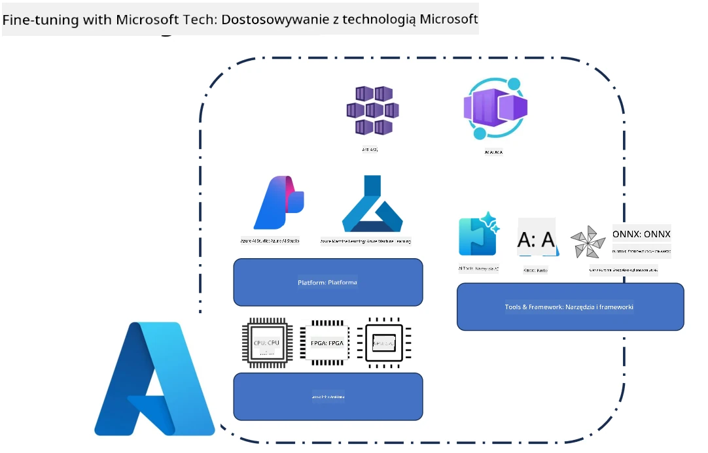
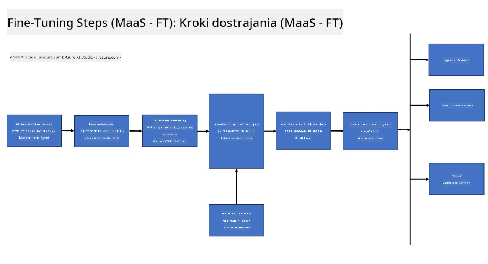
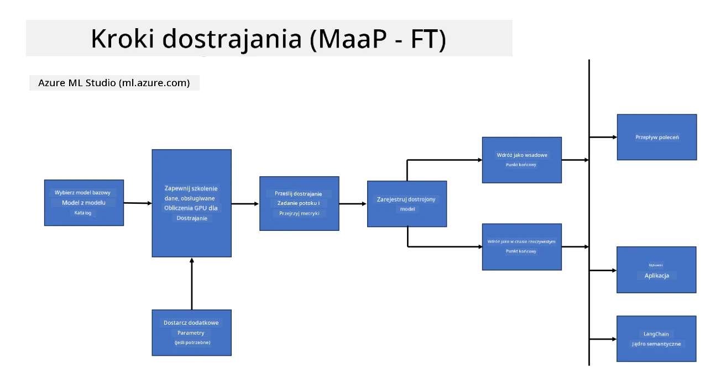
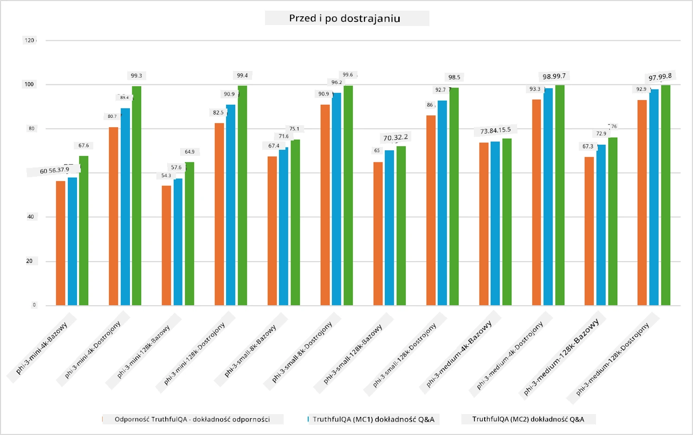

## Scenariusze Fine Tuningu

**Platforma** Obejmuje różne technologie, takie jak Azure AI Foundry, Azure Machine Learning, AI Tools, Kaito oraz ONNX Runtime.

**Infrastruktura** Obejmuje CPU i FPGA, które są niezbędne do procesu fine tuningu. Pokażę ikony dla każdej z tych technologii.

**Narzędzia i Frameworki** Obejmuje ONNX Runtime oraz ONNX Runtime. Pokażę ikony dla każdej z tych technologii.  
[Wstaw ikony dla ONNX Runtime i ONNX Runtime]

Proces fine tuningu z wykorzystaniem technologii Microsoft obejmuje różne komponenty i narzędzia. Dzięki zrozumieniu i wykorzystaniu tych technologii możemy skutecznie dostrajać nasze aplikacje i tworzyć lepsze rozwiązania.

## Model jako Usługa

Dostrój model korzystając z hostowanego fine tuningu, bez konieczności tworzenia i zarządzania zasobami obliczeniowymi.

Serverless fine tuning jest dostępny dla modeli Phi-3-mini i Phi-3-medium, co pozwala deweloperom szybko i łatwo dostosować modele do scenariuszy chmurowych i edge bez konieczności organizowania zasobów obliczeniowych. Ogłosiliśmy również, że Phi-3-small jest teraz dostępny w ramach naszej oferty Models-as-a-Service, dzięki czemu deweloperzy mogą szybko i łatwo rozpocząć pracę z AI bez konieczności zarządzania infrastrukturą.

## Model jako Platforma

Użytkownicy zarządzają własnymi zasobami obliczeniowymi, aby dostroić swoje modele.

[Przykład Fine Tuningu](https://github.com/Azure/azureml-examples/blob/main/sdk/python/foundation-models/system/finetune/chat-completion/chat-completion.ipynb)

## Scenariusze Fine Tuningu

| | | | | | | |
|-|-|-|-|-|-|-|
|Scenariusz|LoRA|QLoRA|PEFT|DeepSpeed|ZeRO|DORA|
|Dostosowanie wstępnie wytrenowanych LLM do konkretnych zadań lub dziedzin|Tak|Tak|Tak|Tak|Tak|Tak|
|Fine tuning dla zadań NLP, takich jak klasyfikacja tekstu, rozpoznawanie nazwanych jednostek i tłumaczenie maszynowe|Tak|Tak|Tak|Tak|Tak|Tak|
|Fine tuning dla zadań QA|Tak|Tak|Tak|Tak|Tak|Tak|
|Fine tuning do generowania odpowiedzi przypominających ludzkie w chatbotach|Tak|Tak|Tak|Tak|Tak|Tak|
|Fine tuning do generowania muzyki, sztuki lub innych form kreatywności|Tak|Tak|Tak|Tak|Tak|Tak|
|Zmniejszenie kosztów obliczeniowych i finansowych|Tak|Tak|Nie|Tak|Tak|Nie|
|Zmniejszenie zużycia pamięci|Nie|Tak|Nie|Tak|Tak|Tak|
|Użycie mniejszej liczby parametrów dla efektywnego fine tuningu|Nie|Tak|Tak|Nie|Nie|Tak|
|Efektywna pamięciowo forma równoległości danych, która daje dostęp do łącznej pamięci GPU wszystkich dostępnych urządzeń GPU|Nie|Nie|Nie|Tak|Tak|Tak|

## Przykłady Wydajności Fine Tuningu

**Zastrzeżenie**:  
Niniejszy dokument został przetłumaczony przy użyciu usługi tłumaczenia AI [Co-op Translator](https://github.com/Azure/co-op-translator). Chociaż dokładamy starań, aby tłumaczenie było jak najbardziej precyzyjne, prosimy mieć na uwadze, że automatyczne tłumaczenia mogą zawierać błędy lub nieścisłości. Oryginalny dokument w języku źródłowym należy traktować jako źródło autorytatywne. W przypadku informacji o kluczowym znaczeniu zalecane jest skorzystanie z profesjonalnego tłumaczenia wykonanego przez człowieka. Nie ponosimy odpowiedzialności za jakiekolwiek nieporozumienia lub błędne interpretacje wynikające z korzystania z tego tłumaczenia.